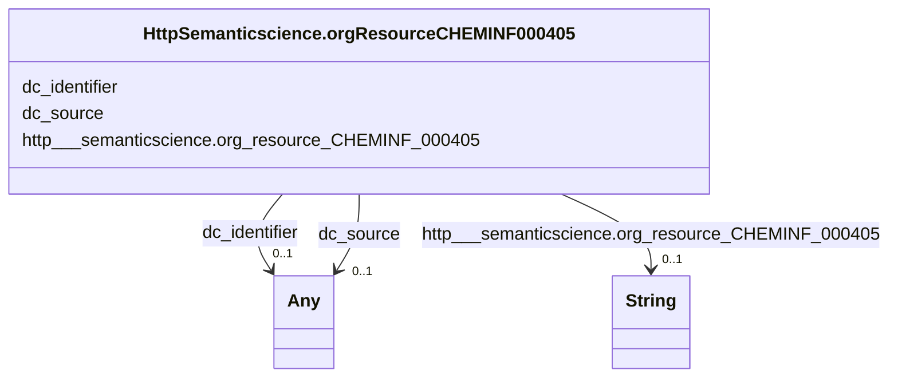

# Class: HttpSemanticscience.orgResourceCHEMINF000405


This class occurs 406 times.


URI: [http://semanticscience.org/resource/CHEMINF_000405](http://semanticscience.org/resource/CHEMINF_000405)





<!-- no inheritance hierarchy -->


## Slots

| Name | Cardinality and Range | Description | Inheritance | Occurrences |
| ---  | --- | --- | --- | --- |
| [dc_identifier](../slots/dc_identifier.md) | 0..1 <br/> [Any](../classes/Any.md) | Recommended practice is to identify the resource by means of a string conform... <br/> description: An unambiguous reference to the resource within a given context. | direct | 406 |
| [dc_source](../slots/dc_source.md) | 0..1 <br/> [Any](../classes/Any.md) | The described resource may be derived from the related resource in whole or i... <br/> description: A related resource from which the described resource is derived. | direct | 406 |
| [http___semanticscience.org_resource_CHEMINF_000405](../slots/http___semanticscience.org_resource_CHEMINF_000405.md) | 0..1 <br/> [xsd:string](xsd:string) |  <br/>  | direct | 406 |


## LinkML Source

<!-- TODO: investigate https://stackoverflow.com/questions/37606292/how-to-create-tabbed-code-blocks-in-mkdocs-or-sphinx -->

### Direct

<details>

```yaml
name: http___semanticscience.org_resource_CHEMINF_000405
from_schema: okns:biobricks-aopwiki-kg
rank: 1000
slots:
- dc_identifier
- dc_source
- http___semanticscience.org_resource_CHEMINF_000405
class_uri: http://semanticscience.org/resource/CHEMINF_000405

```
</details>

### Induced

<details>

```yaml
name: http___semanticscience.org_resource_CHEMINF_000405
from_schema: okns:biobricks-aopwiki-kg
rank: 1000
attributes:
  dc_identifier:
    name: dc_identifier
    description: Recommended practice is to identify the resource by means of a string
      conforming to an identification system.
    title: Identifier
    notes:
    - 'A [second property](/specifications/dublin-core/dcmi-terms/#http://purl.org/dc/terms/identifier)
      with the same name as this property has been declared in the [dcterms: namespace](http://purl.org/dc/terms/).  See
      the Introduction to the document [DCMI Metadata Terms](/specifications/dublin-core/dcmi-terms/)
      for an explanation.'
    - No occurrences of this slot in the graph.
    comments:
    - 'description: An unambiguous reference to the resource within a given context.'
    from_schema: okns:dc
    source: http://purl.org/dc/elements/1.1/
    slot_uri: dc:identifier
    alias: dc_identifier
    owner: http___semanticscience.org_resource_CHEMINF_000405
    domain_of:
    - edam_data_1025
    - edam_data_1027
    - edam_data_1033
    - edam_data_2291
    - edam_data_2298
    - http___aopkb.org_aop_ontology#AdverseOutcomePathway
    - http___aopkb.org_aop_ontology#CellTypeContext
    - http___aopkb.org_aop_ontology#KeyEvent
    - http___aopkb.org_aop_ontology#KeyEventRelationship
    - http___aopkb.org_aop_ontology#OrganContext
    - http___ncicb.nci.nih.gov_xml_owl_EVS_Thesaurus.owl#C54571
    - http___purl.bioontology.org_ontology_NCBITAXON_131567
    - http___semanticscience.org_resource_CHEMINF_000000
    - http___semanticscience.org_resource_CHEMINF_000140
    - http___semanticscience.org_resource_CHEMINF_000405
    - http___semanticscience.org_resource_CHEMINF_000406
    - http___semanticscience.org_resource_CHEMINF_000407
    - http___semanticscience.org_resource_CHEMINF_000408
    - http___semanticscience.org_resource_CHEMINF_000409
    - http___semanticscience.org_resource_CHEMINF_000412
    - http___semanticscience.org_resource_CHEMINF_000446
    - http___semanticscience.org_resource_CHEMINF_000564
    - http___semanticscience.org_resource_CHEMINF_000567
    - obo_GO_0008150
    range: Any
  dc_source:
    name: dc_source
    description: The described resource may be derived from the related resource in
      whole or in part. Recommended best practice is to identify the related resource
      by means of a string conforming to a formal identification system.
    title: Source
    notes:
    - 'A [second property](/specifications/dublin-core/dcmi-terms/#http://purl.org/dc/terms/source)
      with the same name as this property has been declared in the [dcterms: namespace](http://purl.org/dc/terms/).  See
      the Introduction to the document [DCMI Metadata Terms](/specifications/dublin-core/dcmi-terms/)
      for an explanation.'
    - No occurrences of this slot in the graph.
    comments:
    - 'description: A related resource from which the described resource is derived.'
    from_schema: okns:dc
    source: http://purl.org/dc/elements/1.1/
    slot_uri: dc:source
    alias: dc_source
    owner: http___semanticscience.org_resource_CHEMINF_000405
    domain_of:
    - edam_data_1025
    - edam_data_1027
    - edam_data_1033
    - edam_data_2291
    - edam_data_2298
    - http___aopkb.org_aop_ontology#AdverseOutcomePathway
    - http___aopkb.org_aop_ontology#CellTypeContext
    - http___aopkb.org_aop_ontology#KeyEvent
    - http___aopkb.org_aop_ontology#OrganContext
    - http___purl.bioontology.org_ontology_NCBITAXON_131567
    - http___semanticscience.org_resource_CHEMINF_000000
    - http___semanticscience.org_resource_CHEMINF_000140
    - http___semanticscience.org_resource_CHEMINF_000405
    - http___semanticscience.org_resource_CHEMINF_000406
    - http___semanticscience.org_resource_CHEMINF_000407
    - http___semanticscience.org_resource_CHEMINF_000408
    - http___semanticscience.org_resource_CHEMINF_000409
    - http___semanticscience.org_resource_CHEMINF_000412
    - http___semanticscience.org_resource_CHEMINF_000446
    - http___semanticscience.org_resource_CHEMINF_000564
    - http___semanticscience.org_resource_CHEMINF_000567
    - obo_GO_0008150
    range: Any
  http___semanticscience.org_resource_CHEMINF_000405:
    name: http___semanticscience.org_resource_CHEMINF_000405
    from_schema: okns:biobricks-aopwiki-kg
    rank: 1000
    slot_uri: http://semanticscience.org/resource/CHEMINF_000405
    alias: http___semanticscience.org_resource_CHEMINF_000405
    owner: http___semanticscience.org_resource_CHEMINF_000405
    domain_of:
    - http___semanticscience.org_resource_CHEMINF_000405
    range: string
class_uri: http://semanticscience.org/resource/CHEMINF_000405

```
</details>