# biobricks-ice

## Schema Diagram

```mermaid
erDiagram
OwlAllDifferent {

}
OwlAllDisjointClasses {

}
OwlAllDisjointProperties {

}
OwlAnnotation {

}
OwlAnnotationProperty {

}
OwlAsymmetricProperty {

}
OwlAxiom {

}
OwlClass {

}
OwlDataRange {
    uri rdfs_seeAlso  
    string rdfs_label  
    string rdfs_comment  
}
OwlDatatypeProperty {

}
OwlDeprecatedClass {

}
OwlDeprecatedProperty {

}
OwlFunctionalProperty {

}
OwlInverseFunctionalProperty {

}
OwlIrreflexiveProperty {

}
OwlNamedIndividual {

}
OwlNegativePropertyAssertion {

}
OwlNothing {

}
OwlObjectProperty {

}
OwlOntology {

}
OwlOntologyProperty {

}
OwlReflexiveProperty {

}
OwlRestriction {

}
OwlSymmetricProperty {

}
OwlThing {

}
OwlTransitiveProperty {

}
RdfAlt {

}
RdfBag {

}
RdfCompoundLiteral {

}
RdfList {
    string rdfs_label  
    string rdfs_comment  
}
RdfProperty {

}
RdfSeq {

}
RdfStatement {

}
RdfsClass {

}
RdfsContainer {

}
RdfsContainerMembershipProperty {

}
RdfsDatatype {
    uri rdfs_seeAlso  
    string rdfs_label  
    string rdfs_comment  
}
RdfsLiteral {

}
RdfsResource {

}
DcamVocabularyEncodingScheme {
    date dct_issued  
    string rdfs_label  
    string rdfs_comment  
    uri rdfs_seeAlso  
}
DcmitypeCollection {

}
DcmitypeDataset {

}
DcmitypeEvent {

}
DcmitypeImage {

}
DcmitypeInteractiveResource {

}
DcmitypeMovingImage {

}
DcmitypePhysicalObject {

}
DcmitypeService {

}
DcmitypeSoftware {

}
DcmitypeSound {

}
DcmitypeStillImage {

}
DcmitypeText {

}
DctAgent {

}
DctAgentClass {
    string rdfs_label  
    string rdfs_comment  
    date dct_issued  
}
DctBibliographicResource {

}
DctFileFormat {

}
DctFrequency {

}
DctJurisdiction {

}
DctLicenseDocument {

}
DctLinguisticSystem {

}
DctLocation {

}
DctLocationPeriodOrJurisdiction {

}
DctMediaType {

}
DctMediaTypeOrExtent {

}
DctMethodOfAccrual {

}
DctMethodOfInstruction {

}
DctPeriodOfTime {

}
DctPhysicalMedium {

}
DctPhysicalResource {

}
DctPolicy {

}
DctProvenanceStatement {

}
DctRightsStatement {

}
DctSizeOrDuration {

}
DctStandard {

}
Bao0000015 {
    string niehs_throughMechanisticTarget  
    string niehs_assay_tissue  
    string niehs_mayInformOn  
    string rdfs_label  
    string niehs_assay_species  
    string niehs_assay_invitro_assay_format  
    string niehs_assay_source  
}
Bao0000040 {

}
Bao0000179 {
    string obo_ExO_0000055  
    string rdfs_label  
    string semsci_000221  
    string semsci_000300  
}
Bao0003064 {

}
EdamData1027 {

}
EdamData1181 {

}
HttpsW3id.orgBiolinkVocabChemicalEntity {
    string rdfs_label  
}
OboCHEMINF000000 {
    string rdfs_label  
}
OboCHEMINF000446 {
    string rdfs_label  
}
OboCHEMINF000568 {
    string rdfs_label  
}

OwlDataRange ||--|o OwlOntology : "rdfs_isDefinedBy"
OwlDataRange ||--|o RdfsResource : "rdfs_isDefinedBy"
OwlDataRange ||--|o RdfsClass : "rdfs_subClassOf"
OwlDataRange ||--|o RdfsResource : "rdfs_seeAlso"
OwlDataRange ||--|o RdfsLiteral : "rdfs_label"
OwlDataRange ||--|o RdfsLiteral : "rdfs_comment"
RdfList ||--|o RdfsLiteral : "rdfs_label"
RdfList ||--|o RdfsLiteral : "rdfs_comment"
RdfList ||--|o OwlOntology : "rdfs_isDefinedBy"
RdfList ||--|o RdfsResource : "rdfs_isDefinedBy"
RdfsDatatype ||--|o OwlOntology : "rdfs_isDefinedBy"
RdfsDatatype ||--|o RdfsResource : "rdfs_isDefinedBy"
RdfsDatatype ||--|o RdfsClass : "rdfs_subClassOf"
RdfsDatatype ||--|o RdfsResource : "rdfs_seeAlso"
RdfsDatatype ||--|o RdfsLiteral : "rdfs_label"
RdfsDatatype ||--|o RdfsLiteral : "rdfs_comment"
DcamVocabularyEncodingScheme ||--|o RdfsLiteral : "dct_issued"
DcamVocabularyEncodingScheme ||--|o RdfsLiteral : "rdfs_label"
DcamVocabularyEncodingScheme ||--|o RdfsLiteral : "rdfs_comment"
DcamVocabularyEncodingScheme ||--|o RdfsResource : "rdfs_seeAlso"
DcamVocabularyEncodingScheme ||--|o OwlOntology : "rdfs_isDefinedBy"
DcamVocabularyEncodingScheme ||--|o RdfsResource : "rdfs_isDefinedBy"
DctAgentClass ||--|o RdfsLiteral : "rdfs_label"
DctAgentClass ||--|o RdfsLiteral : "rdfs_comment"
DctAgentClass ||--|o RdfsLiteral : "dct_issued"
DctAgentClass ||--|o OwlOntology : "rdfs_isDefinedBy"
DctAgentClass ||--|o RdfsResource : "rdfs_isDefinedBy"
Bao0000015 ||--|o EdamData1027 : "niehs_assay_entrez_gene_id"
Bao0000015 ||--|o RdfsLiteral : "rdfs_label"
Bao0000015 ||--|o Bao0003064 : "umls_C1708327"
Bao0000015 ||--|o EdamData1181 : "umls_C1708327"
Bao0000015 ||--|o Bao0003064 : "niehs_throughMechanisticTarget_NCIm"
Bao0000015 ||--|o EdamData1181 : "niehs_throughMechanisticTarget_NCIm"
Bao0000015 ||--|o Bao0000040 : "bao_0000209"
Bao0000040 ||--|o Bao0000179 : "obo_OBI_0000299"
Bao0000040 ||--|o HttpsW3id.orgBiolinkVocabChemicalEntity : "obo_RO_0000057"
Bao0000040 ||--|o OboCHEMINF000000 : "obo_RO_0000057"
Bao0000179 ||--|o RdfsLiteral : "rdfs_label"
Bao0000179 ||--|o HttpsW3id.orgBiolinkVocabChemicalEntity : "obo_IAO_0000136"
Bao0000179 ||--|o OboCHEMINF000000 : "obo_IAO_0000136"
HttpsW3id.orgBiolinkVocabChemicalEntity ||--|o OboCHEMINF000568 : "edam_has_identifier"
HttpsW3id.orgBiolinkVocabChemicalEntity ||--|o OboCHEMINF000446 : "edam_has_identifier"
HttpsW3id.orgBiolinkVocabChemicalEntity ||--|o Bao0000040 : "obo_RO_0000056"
HttpsW3id.orgBiolinkVocabChemicalEntity ||--|o RdfsLiteral : "rdfs_label"
OboCHEMINF000000 ||--|o OboCHEMINF000568 : "edam_has_identifier"
OboCHEMINF000000 ||--|o OboCHEMINF000446 : "edam_has_identifier"
OboCHEMINF000000 ||--|o Bao0000040 : "obo_RO_0000056"
OboCHEMINF000000 ||--|o RdfsLiteral : "rdfs_label"
OboCHEMINF000446 ||--|o RdfsLiteral : "rdfs_label"
OboCHEMINF000568 ||--|o RdfsLiteral : "rdfs_label"

```

## Imports

* linkml:types
* okns:dc
* okns:extended_types
* okns:owl-rdf-rdfs

## Classes

| Class | Description | Occurrences |
| --- | --- | --- |
| [Bao0000015](classes/Bao0000015.md) | None | 2063 | 
| [Bao0000040](classes/Bao0000040.md) | None | 203755 | 
| [Bao0000179](classes/Bao0000179.md) | None | 3020705 | 
| [Bao0003064](classes/Bao0003064.md) | None | 59 | 
| [EdamData1027](classes/EdamData1027.md) | None | 526 | 
| [EdamData1181](classes/EdamData1181.md) | None | 59 | 
| [HttpsW3id.orgBiolinkVocabChemicalEntity](classes/HttpsW3id.orgBiolinkVocabChemicalEntity.md) | None | 206543 | 
| [OboCHEMINF000000](classes/OboCHEMINF000000.md) | None | 206543 | 
| [OboCHEMINF000446](classes/OboCHEMINF000446.md) | None | 538147 | 
| [OboCHEMINF000568](classes/OboCHEMINF000568.md) | None | 538131 | 

## Slots

| Slot | Description | Occurrences |
| --- | --- | --- |
| [bao_0000209](slots/bao_0000209.md) |  | 9641 |
| [edam_has_identifier](slots/edam_has_identifier.md) |  | 413086 |
| [niehs_assay_entrez_gene_id](slots/niehs_assay_entrez_gene_id.md) |  | 1814 |
| [niehs_assay_invitro_assay_format](slots/niehs_assay_invitro_assay_format.md) |  | 1814 |
| [niehs_assay_source](slots/niehs_assay_source.md) |  | 1814 |
| [niehs_assay_species](slots/niehs_assay_species.md) |  | 1814 |
| [niehs_assay_tissue](slots/niehs_assay_tissue.md) |  | 1814 |
| [niehs_mayInformOn](slots/niehs_mayInformOn.md) |  | 3570 |
| [niehs_throughMechanisticTarget](slots/niehs_throughMechanisticTarget.md) |  | 2753 |
| [niehs_throughMechanisticTarget_NCIm](slots/niehs_throughMechanisticTarget_NCIm.md) |  | 3015 |
| [obo_ExO_0000055](slots/obo_ExO_0000055.md) |  | 135113 |
| [obo_IAO_0000136](slots/obo_IAO_0000136.md) |  | 3020705 |
| [obo_OBI_0000299](slots/obo_OBI_0000299.md) |  | 3021699 |
| [obo_RO_0000056](slots/obo_RO_0000056.md) |  | 2306975 |
| [obo_RO_0000057](slots/obo_RO_0000057.md) |  | 2306975 |
| [semsci_000221](slots/semsci_000221.md) |  | 3020705 |
| [semsci_000300](slots/semsci_000300.md) |  | 3021184 |
| [umls_C1708327](slots/umls_C1708327.md) |  | 3015 |

## IRI prefixes

* bao: http://www.bioassayontology.org/bao#BAO_
* dc: http://purl.org/dc/elements/1.1/
* edam: http://edamontology.org/
* linkml: https://w3id.org/linkml/
* niehs: https://ice.ntp.niehs.nih.gov/property/
* obo: http://purl.obolibrary.org/obo/
* okn: https://purl.org/okn/
* okns: https://purl.org/okn/schema/
* rdfs: http://www.w3.org/2000/01/rdf-schema#
* semsci: http://semanticscience.org/resource/SIO_
* umls: https://identifiers.org/umls:
