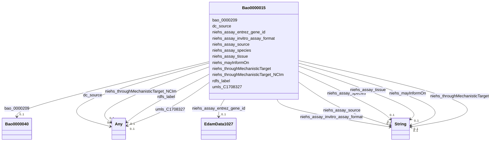

# Class: Bao0000015


This class occurs 2063 times.


URI: [bao:0000015](http://www.bioassayontology.org/bao#BAO_0000015)





<!-- no inheritance hierarchy -->


## Slots

| Name | Cardinality and Range | Description | Inheritance | Occurrences |
| ---  | --- | --- | --- | --- |
| [niehs_throughMechanisticTarget](../slots/niehs_throughMechanisticTarget.md) | 0..1 <br/> [xsd:string](xsd:string) |  <br/>  | direct | 2753 |
| [niehs_assay_entrez_gene_id](../slots/niehs_assay_entrez_gene_id.md) | 0..1 <br/> [EdamData1027](../classes/EdamData1027.md) |  <br/>  | direct | 1814 |
| [niehs_assay_tissue](../slots/niehs_assay_tissue.md) | 0..1 <br/> [xsd:string](xsd:string) |  <br/>  | direct | 1814 |
| [niehs_mayInformOn](../slots/niehs_mayInformOn.md) | 0..1 <br/> [xsd:string](xsd:string) |  <br/>  | direct | 3570 |
| [rdfs_label](../slots/rdfs_label.md) | 0..1 <br/> [RdfsLiteral](../classes/RdfsLiteral.md)&nbsp;or&nbsp;<br />[xsd:string](xsd:string) | A human-readable name for the subject <br/>  | direct | 2063 |
| [niehs_assay_species](../slots/niehs_assay_species.md) | 0..1 <br/> [xsd:string](xsd:string) |  <br/>  | direct | 1814 |
| [umls_C1708327](../slots/umls_C1708327.md) | 0..1 <br/> [Bao0003064](../classes/Bao0003064.md)&nbsp;or&nbsp;<br />[EdamData1181](../classes/EdamData1181.md) |  <br/>  | direct | 6030 |
| [dc_source](../slots/dc_source.md) | 0..1 <br/> [Any](../classes/Any.md) | The described resource may be derived from the related resource in whole or i... <br/> description: A related resource from which the described resource is derived. | direct | 1995 |
| [niehs_assay_invitro_assay_format](../slots/niehs_assay_invitro_assay_format.md) | 0..1 <br/> [xsd:string](xsd:string) |  <br/>  | direct | 1814 |
| [niehs_throughMechanisticTarget_NCIm](../slots/niehs_throughMechanisticTarget_NCIm.md) | 0..1 <br/> [Bao0003064](../classes/Bao0003064.md)&nbsp;or&nbsp;<br />[EdamData1181](../classes/EdamData1181.md) |  <br/>  | direct | 6030 |
| [bao_0000209](../slots/bao_0000209.md) | 0..1 <br/> [Bao0000040](../classes/Bao0000040.md) |  <br/>  | direct | 9641 |
| [niehs_assay_source](../slots/niehs_assay_source.md) | 0..1 <br/> [xsd:string](xsd:string) |  <br/>  | direct | 1814 |


## LinkML Source

<!-- TODO: investigate https://stackoverflow.com/questions/37606292/how-to-create-tabbed-code-blocks-in-mkdocs-or-sphinx -->

### Direct

<details>

```yaml
name: bao_0000015
from_schema: okns:biobricks-ice-kg
rank: 1000
slots:
- niehs_throughMechanisticTarget
- niehs_assay_entrez_gene_id
- niehs_assay_tissue
- niehs_mayInformOn
- rdfs_label
- niehs_assay_species
- umls_C1708327
- dc_source
- niehs_assay_invitro_assay_format
- niehs_throughMechanisticTarget_NCIm
- bao_0000209
- niehs_assay_source
class_uri: bao:0000015

```
</details>

### Induced

<details>

```yaml
name: bao_0000015
from_schema: okns:biobricks-ice-kg
rank: 1000
attributes:
  niehs_throughMechanisticTarget:
    name: niehs_throughMechanisticTarget
    from_schema: okns:biobricks-ice-kg
    rank: 1000
    slot_uri: niehs:throughMechanisticTarget
    alias: niehs_throughMechanisticTarget
    owner: bao_0000015
    domain_of:
    - bao_0000015
    range: string
  niehs_assay_entrez_gene_id:
    name: niehs_assay_entrez_gene_id
    from_schema: okns:biobricks-ice-kg
    rank: 1000
    slot_uri: niehs:assay_entrez_gene_id
    alias: niehs_assay_entrez_gene_id
    owner: bao_0000015
    domain_of:
    - bao_0000015
    range: edam_data_1027
  niehs_assay_tissue:
    name: niehs_assay_tissue
    from_schema: okns:biobricks-ice-kg
    rank: 1000
    slot_uri: niehs:assay_tissue
    alias: niehs_assay_tissue
    owner: bao_0000015
    domain_of:
    - bao_0000015
    range: string
  niehs_mayInformOn:
    name: niehs_mayInformOn
    from_schema: okns:biobricks-ice-kg
    rank: 1000
    slot_uri: niehs:mayInformOn
    alias: niehs_mayInformOn
    owner: bao_0000015
    domain_of:
    - bao_0000015
    range: string
  rdfs_label:
    name: rdfs_label
    description: A human-readable name for the subject.
    title: label
    from_schema: okns:owl-rdf-rdfs
    source: http://www.w3.org/2000/01/rdf-schema#
    domain: rdfs_Resource
    slot_uri: rdfs:label
    alias: rdfs_label
    owner: bao_0000015
    domain_of:
    - rdf_List
    - rdfs_Datatype
    - dcam_VocabularyEncodingScheme
    - dct_AgentClass
    - bao_0000015
    - bao_0000179
    - https___w3id.org_biolink_vocab_ChemicalEntity
    - obo_CHEMINF_000000
    - obo_CHEMINF_000446
    - obo_CHEMINF_000568
    range: Any
    any_of:
    - range: rdfs_Literal
    - range: string
  niehs_assay_species:
    name: niehs_assay_species
    from_schema: okns:biobricks-ice-kg
    rank: 1000
    slot_uri: niehs:assay_species
    alias: niehs_assay_species
    owner: bao_0000015
    domain_of:
    - bao_0000015
    range: string
  umls_C1708327:
    name: umls_C1708327
    from_schema: okns:biobricks-ice-kg
    rank: 1000
    slot_uri: umls:C1708327
    alias: umls_C1708327
    owner: bao_0000015
    domain_of:
    - bao_0000015
    range: Any
    any_of:
    - range: bao_0003064
    - range: edam_data_1181
  dc_source:
    name: dc_source
    description: The described resource may be derived from the related resource in
      whole or in part. Recommended best practice is to identify the related resource
      by means of a string conforming to a formal identification system.
    title: Source
    notes:
    - 'A [second property](/specifications/dublin-core/dcmi-terms/#http://purl.org/dc/terms/source)
      with the same name as this property has been declared in the [dcterms: namespace](http://purl.org/dc/terms/).  See
      the Introduction to the document [DCMI Metadata Terms](/specifications/dublin-core/dcmi-terms/)
      for an explanation.'
    - No occurrences of this slot in the graph.
    comments:
    - 'description: A related resource from which the described resource is derived.'
    from_schema: okns:dc
    source: http://purl.org/dc/elements/1.1/
    slot_uri: dc:source
    alias: dc_source
    owner: bao_0000015
    domain_of:
    - bao_0000015
    - obo_CHEMINF_000446
    - obo_CHEMINF_000568
    range: Any
  niehs_assay_invitro_assay_format:
    name: niehs_assay_invitro_assay_format
    from_schema: okns:biobricks-ice-kg
    rank: 1000
    slot_uri: niehs:assay_invitro_assay_format
    alias: niehs_assay_invitro_assay_format
    owner: bao_0000015
    domain_of:
    - bao_0000015
    range: string
  niehs_throughMechanisticTarget_NCIm:
    name: niehs_throughMechanisticTarget_NCIm
    from_schema: okns:biobricks-ice-kg
    rank: 1000
    slot_uri: niehs:throughMechanisticTarget_NCIm
    alias: niehs_throughMechanisticTarget_NCIm
    owner: bao_0000015
    domain_of:
    - bao_0000015
    range: Any
    any_of:
    - range: bao_0003064
    - range: edam_data_1181
  bao_0000209:
    name: bao_0000209
    from_schema: okns:biobricks-ice-kg
    rank: 1000
    slot_uri: bao:0000209
    alias: bao_0000209
    owner: bao_0000015
    domain_of:
    - bao_0000015
    range: bao_0000040
  niehs_assay_source:
    name: niehs_assay_source
    from_schema: okns:biobricks-ice-kg
    rank: 1000
    slot_uri: niehs:assay_source
    alias: niehs_assay_source
    owner: bao_0000015
    domain_of:
    - bao_0000015
    range: string
class_uri: bao:0000015

```
</details>