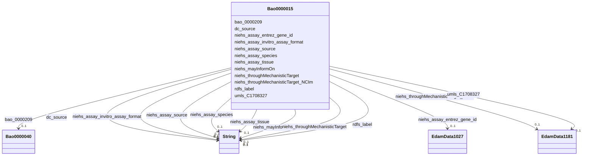

# Class: TODO -- what's a good name for this class (type)? (bao_0000015)


_TODO -- tell the world what this class (type) describes._


URI: [bao:0000015](http://www.bioassayontology.org/bao#BAO_0000015)





<!-- no inheritance hierarchy -->


## Slots

| Name | Cardinality and Range | Description | Inheritance |
| ---  | --- | --- | --- |
| [dc_source](../slots/dc_source.md) | 0..1 <br/> [xsd:string](http://www.w3.org/2001/XMLSchema#string) | TODO -- tell the world what this slot (predicate) describes | direct |
| [niehs_assay_entrez_gene_id](../slots/niehs_assay_entrez_gene_id.md) | 0..1 <br/> [EdamData1027](../classes/EdamData1027.md) | TODO -- tell the world what this slot (predicate) describes | direct |
| [bao_0000209](../slots/bao_0000209.md) | 0..1 <br/> [Bao0000040](../classes/Bao0000040.md) | TODO -- tell the world what this slot (predicate) describes | direct |
| [rdfs_label](../slots/rdfs_label.md) | 0..1 <br/> [xsd:string](http://www.w3.org/2001/XMLSchema#string) | TODO -- tell the world what this slot (predicate) describes | direct |
| [niehs_assay_source](../slots/niehs_assay_source.md) | 0..1 <br/> [xsd:string](http://www.w3.org/2001/XMLSchema#string) | TODO -- tell the world what this slot (predicate) describes | direct |
| [niehs_assay_species](../slots/niehs_assay_species.md) | 0..1 <br/> [xsd:string](http://www.w3.org/2001/XMLSchema#string) | TODO -- tell the world what this slot (predicate) describes | direct |
| [niehs_throughMechanisticTarget](../slots/niehs_throughMechanisticTarget.md) | 0..1 <br/> [xsd:string](http://www.w3.org/2001/XMLSchema#string) | TODO -- tell the world what this slot (predicate) describes | direct |
| [niehs_assay_tissue](../slots/niehs_assay_tissue.md) | 0..1 <br/> [xsd:string](http://www.w3.org/2001/XMLSchema#string) | TODO -- tell the world what this slot (predicate) describes | direct |
| [niehs_throughMechanisticTarget_NCIm](../slots/niehs_throughMechanisticTarget_NCIm.md) | 0..1 <br/> [EdamData1181](../classes/EdamData1181.md) | TODO -- tell the world what this slot (predicate) describes | direct |
| [niehs_assay_invitro_assay_format](../slots/niehs_assay_invitro_assay_format.md) | 0..1 <br/> [xsd:string](http://www.w3.org/2001/XMLSchema#string) | TODO -- tell the world what this slot (predicate) describes | direct |
| [umls_C1708327](../slots/umls_C1708327.md) | 0..1 <br/> [EdamData1181](../classes/EdamData1181.md) | TODO -- tell the world what this slot (predicate) describes | direct |
| [niehs_mayInformOn](../slots/niehs_mayInformOn.md) | 0..1 <br/> [xsd:string](http://www.w3.org/2001/XMLSchema#string) | TODO -- tell the world what this slot (predicate) describes | direct |


## TODOs

* TODO -- Todos for this class go here
* or you can delete the todos
* if you think the class is perfect.

## Identifier and Mapping Information


### Schema Source


* from schema: biobricks-ice-kg


## Mappings

| Mapping Type | Mapped Value |
| ---  | ---  |
| self | bao:0000015 |
| native | biobricks-ice-kg/:Bao0000015 |


## LinkML Source

<!-- TODO: investigate https://stackoverflow.com/questions/37606292/how-to-create-tabbed-code-blocks-in-mkdocs-or-sphinx -->

### Direct

<details>
```yaml
name: bao_0000015
description: TODO -- tell the world what this class (type) describes.
title: TODO -- what's a good name for this class (type)?
todos:
- TODO -- Todos for this class go here
- or you can delete the todos
- if you think the class is perfect.
notes:
- Class with 2063 occurences.
from_schema: biobricks-ice-kg
slots:
- dc_source
- niehs_assay_entrez_gene_id
- bao_0000209
- rdfs_label
- niehs_assay_source
- niehs_assay_species
- niehs_throughMechanisticTarget
- niehs_assay_tissue
- niehs_throughMechanisticTarget_NCIm
- niehs_assay_invitro_assay_format
- umls_C1708327
- niehs_mayInformOn
class_uri: bao:0000015

```
</details>

### Induced

<details>
```yaml
name: bao_0000015
description: TODO -- tell the world what this class (type) describes.
title: TODO -- what's a good name for this class (type)?
todos:
- TODO -- Todos for this class go here
- or you can delete the todos
- if you think the class is perfect.
notes:
- Class with 2063 occurences.
from_schema: biobricks-ice-kg
attributes:
  dc_source:
    name: dc_source
    description: TODO -- tell the world what this slot (predicate) describes.
    todos:
    - TODO -- Todos for this slot go here
    - or you can delete the todos
    - if you think the class is perfect.
    comments:
    - 538147 occurrences with subject type cheminf_000446 and object type string.
    - 538131 occurrences with subject type cheminf_000568 and object type string.
    - 3990 occurrences with subject type bao_0000015 and object type string.
    examples:
    - value: http://identifiers.org/cas/10-00-4 dc:source CAS
    - value: https://comptox.epa.gov/dashboard/chemical/details/DTXSID001002091 dc:source
        CompTox
    - value: https://comptox.epa.gov/dashboard/assay-endpoints/ACEA_AR_agonist_80hr
        dc:source ICE
    from_schema: biobricks-ice-kg
    rank: 1000
    slot_uri: dc:source
    alias: dc_source
    owner: bao_0000015
    domain_of:
    - bao_0000015
    - cheminf_000446
    - cheminf_000568
    range: string
  niehs_assay_entrez_gene_id:
    name: niehs_assay_entrez_gene_id
    description: TODO -- tell the world what this slot (predicate) describes.
    todos:
    - TODO -- Todos for this slot go here
    - or you can delete the todos
    - if you think the class is perfect.
    comments:
    - 1814 occurrences with subject type bao_0000015 and object type edam_data_1027.
    examples:
    - value: https://comptox.epa.gov/dashboard/assay-endpoints/UPITT_HCI_U2OS_AR_TIF2_Nucleoli_Cytoplasm_Ratio_Antagonist
        niehs:assay_entrez_gene_id https://www.ncbi.nlm.nih.gov/gene/367
    from_schema: biobricks-ice-kg
    rank: 1000
    slot_uri: niehs:assay_entrez_gene_id
    alias: niehs_assay_entrez_gene_id
    owner: bao_0000015
    domain_of:
    - bao_0000015
    range: edam_data_1027
  bao_0000209:
    name: bao_0000209
    description: TODO -- tell the world what this slot (predicate) describes.
    todos:
    - TODO -- Todos for this slot go here
    - or you can delete the todos
    - if you think the class is perfect.
    comments:
    - 8208 occurrences with subject type bao_0000015 and object type bao_0000040.
    examples:
    - value: http://example.com/ice/Endocrine_In_Vivo_Endocrine.parquet/assay/Uterotrophic-Agonist/Assay
        bao:0000209 http://example.com/ice/Endocrine_In_Vivo_Endocrine.parquet/dtxsid/DTXSID9024065/assay/Uterotrophic-Agonist/Measure_Group
    from_schema: biobricks-ice-kg
    rank: 1000
    slot_uri: bao:0000209
    alias: bao_0000209
    owner: bao_0000015
    domain_of:
    - bao_0000015
    range: bao_0000040
  rdfs_label:
    name: rdfs_label
    description: TODO -- tell the world what this slot (predicate) describes.
    todos:
    - TODO -- Todos for this slot go here
    - or you can delete the todos
    - if you think the class is perfect.
    comments:
    - 197214 occurrences with subject type cheminf_000000 and object type string.
    - 413168 occurrences with subject type bao_0000179 and object type string.
    - 542470 occurrences with subject type cheminf_000446 and object type string.
    - 542456 occurrences with subject type cheminf_000568 and object type string.
    - 2063 occurrences with subject type bao_0000015 and object type string.
    examples:
    - value: http://example.com/ice/ADME_Parameters_Data.parquet/dtxsid/DTXSID001009966/Chemical_Entity
        rdfs:label Tegafur
    - value: http://example.com/ice/ADME_Parameters_Data.parquet/record_id/httk2.2.2_DTXSID001009966/dtxsid/DTXSID001009966/endpoint/Fu/Endpoint
        rdfs:label Fu
    - value: http://identifiers.org/cas/10-00-4 rdfs:label Uliginosin B
    - value: https://comptox.epa.gov/dashboard/chemical/details/DTXSID001002091 rdfs:label
        N-[3-(Dimethylamino)propyl]octadeca-9,12-dienimidic acid
    - value: http://example.com/ice/ADME_Parameters_Data.parquet/assay/httk%2C%20Human%20Hepatic%20Intrinsic%20Clearance/Assay
        rdfs:label httk, Human Hepatic Intrinsic Clearance
    from_schema: biobricks-ice-kg
    rank: 1000
    slot_uri: rdfs:label
    alias: rdfs_label
    owner: bao_0000015
    domain_of:
    - bao_0000015
    - bao_0000179
    - cheminf_000000
    - cheminf_000446
    - cheminf_000568
    range: string
  niehs_assay_source:
    name: niehs_assay_source
    description: TODO -- tell the world what this slot (predicate) describes.
    todos:
    - TODO -- Todos for this slot go here
    - or you can delete the todos
    - if you think the class is perfect.
    comments:
    - 1814 occurrences with subject type bao_0000015 and object type string.
    examples:
    - value: https://comptox.epa.gov/dashboard/assay-endpoints/ACEA_AR_agonist_80hr
        niehs:assay_source ACEA Biosciences
    from_schema: biobricks-ice-kg
    rank: 1000
    slot_uri: niehs:assay_source
    alias: niehs_assay_source
    owner: bao_0000015
    domain_of:
    - bao_0000015
    range: string
  niehs_assay_species:
    name: niehs_assay_species
    description: TODO -- tell the world what this slot (predicate) describes.
    todos:
    - TODO -- Todos for this slot go here
    - or you can delete the todos
    - if you think the class is perfect.
    comments:
    - 1814 occurrences with subject type bao_0000015 and object type string.
    examples:
    - value: https://comptox.epa.gov/dashboard/assay-endpoints/ACEA_AR_agonist_80hr
        niehs:assay_species human
    from_schema: biobricks-ice-kg
    rank: 1000
    slot_uri: niehs:assay_species
    alias: niehs_assay_species
    owner: bao_0000015
    domain_of:
    - bao_0000015
    range: string
  niehs_throughMechanisticTarget:
    name: niehs_throughMechanisticTarget
    description: TODO -- tell the world what this slot (predicate) describes.
    todos:
    - TODO -- Todos for this slot go here
    - or you can delete the todos
    - if you think the class is perfect.
    comments:
    - 2753 occurrences with subject type bao_0000015 and object type string.
    examples:
    - value: https://comptox.epa.gov/dashboard/assay-endpoints/ACEA_AR_agonist_80hr
        niehs:throughMechanisticTarget AR Modulation
    from_schema: biobricks-ice-kg
    rank: 1000
    slot_uri: niehs:throughMechanisticTarget
    alias: niehs_throughMechanisticTarget
    owner: bao_0000015
    domain_of:
    - bao_0000015
    range: string
  niehs_assay_tissue:
    name: niehs_assay_tissue
    description: TODO -- tell the world what this slot (predicate) describes.
    todos:
    - TODO -- Todos for this slot go here
    - or you can delete the todos
    - if you think the class is perfect.
    comments:
    - 1814 occurrences with subject type bao_0000015 and object type string.
    examples:
    - value: https://comptox.epa.gov/dashboard/assay-endpoints/ACEA_AR_agonist_80hr
        niehs:assay_tissue prostate
    from_schema: biobricks-ice-kg
    rank: 1000
    slot_uri: niehs:assay_tissue
    alias: niehs_assay_tissue
    owner: bao_0000015
    domain_of:
    - bao_0000015
    range: string
  niehs_throughMechanisticTarget_NCIm:
    name: niehs_throughMechanisticTarget_NCIm
    description: TODO -- tell the world what this slot (predicate) describes.
    todos:
    - TODO -- Todos for this slot go here
    - or you can delete the todos
    - if you think the class is perfect.
    comments:
    - 3015 occurrences with subject type bao_0000015 and object type edam_data_1181.
    examples:
    - value: https://comptox.epa.gov/dashboard/assay-endpoints/UPITT_HCI_U2OS_AR_TIF2_Nucleoli_Cytoplasm_Ratio_Antagonist
        niehs:throughMechanisticTarget_NCIm umls:CUI%3AC1625136
    from_schema: biobricks-ice-kg
    rank: 1000
    slot_uri: niehs:throughMechanisticTarget_NCIm
    alias: niehs_throughMechanisticTarget_NCIm
    owner: bao_0000015
    domain_of:
    - bao_0000015
    range: edam_data_1181
  niehs_assay_invitro_assay_format:
    name: niehs_assay_invitro_assay_format
    description: TODO -- tell the world what this slot (predicate) describes.
    todos:
    - TODO -- Todos for this slot go here
    - or you can delete the todos
    - if you think the class is perfect.
    comments:
    - 1814 occurrences with subject type bao_0000015 and object type string.
    examples:
    - value: https://comptox.epa.gov/dashboard/assay-endpoints/ACEA_AR_agonist_80hr
        niehs:assay_invitro_assay_format cell line(22Rv1)
    from_schema: biobricks-ice-kg
    rank: 1000
    slot_uri: niehs:assay_invitro_assay_format
    alias: niehs_assay_invitro_assay_format
    owner: bao_0000015
    domain_of:
    - bao_0000015
    range: string
  umls_C1708327:
    name: umls_C1708327
    description: TODO -- tell the world what this slot (predicate) describes.
    todos:
    - TODO -- Todos for this slot go here
    - or you can delete the todos
    - if you think the class is perfect.
    comments:
    - 3015 occurrences with subject type bao_0000015 and object type edam_data_1181.
    examples:
    - value: https://comptox.epa.gov/dashboard/assay-endpoints/UPITT_HCI_U2OS_AR_TIF2_Nucleoli_Cytoplasm_Ratio_Antagonist
        umls:C1708327 umls:CUI%3AC1625136
    from_schema: biobricks-ice-kg
    rank: 1000
    slot_uri: umls:C1708327
    alias: umls_C1708327
    owner: bao_0000015
    domain_of:
    - bao_0000015
    range: edam_data_1181
  niehs_mayInformOn:
    name: niehs_mayInformOn
    description: TODO -- tell the world what this slot (predicate) describes.
    todos:
    - TODO -- Todos for this slot go here
    - or you can delete the todos
    - if you think the class is perfect.
    comments:
    - 3570 occurrences with subject type bao_0000015 and object type string.
    examples:
    - value: https://comptox.epa.gov/dashboard/assay-endpoints/ACEA_AR_agonist_80hr
        niehs:mayInformOn Androgen - Androgen Receptor Modulation
    from_schema: biobricks-ice-kg
    rank: 1000
    slot_uri: niehs:mayInformOn
    alias: niehs_mayInformOn
    owner: bao_0000015
    domain_of:
    - bao_0000015
    range: string
class_uri: bao:0000015

```
</details>