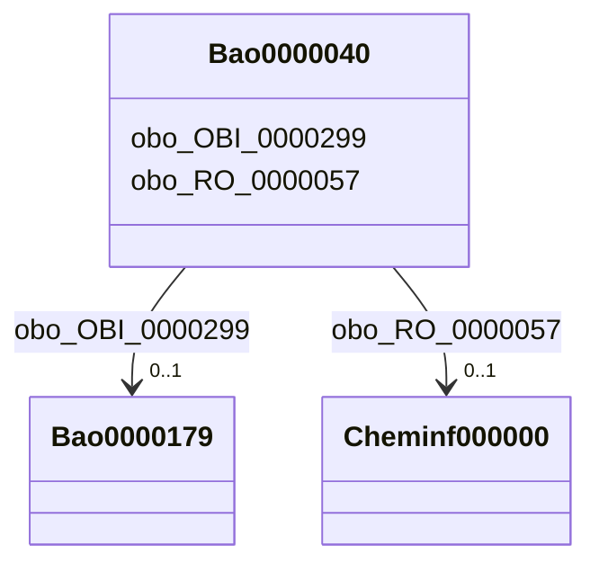

# Class: TODO -- what's a good name for this class (type)? (bao_0000040)


_No type description provided_


URI: [bao:0000040](http://www.bioassayontology.org/bao#BAO_0000040)





<!-- no inheritance hierarchy -->


## Slots

| Name | Cardinality and Range | Description | Inheritance |
| ---  | --- | --- | --- |
| [obo_RO_0000057](../slots/obo_RO_0000057.md) | 0..1 <br/> [Cheminf000000](../classes/Cheminf000000.md) | No slot description provided | direct |
| [obo_OBI_0000299](../slots/obo_OBI_0000299.md) | 0..1 <br/> [Bao0000179](../classes/Bao0000179.md) | No slot description provided | direct |


## Usages

| used by | used in | type | used |
| ---  | --- | --- | --- |
| [Bao0000015](../classes/Bao0000015.md) | [bao_0000209](../slots/bao_0000209.md) | range | [Bao0000040](../classes/Bao0000040.md) |
| [Cheminf000000](../classes/Cheminf000000.md) | [obo_RO_0000056](../slots/obo_RO_0000056.md) | range | [Bao0000040](../classes/Bao0000040.md) |


## TODOs

* TODO -- Todos for this class go here
* or you can delete the todos
* if you think the class is perfect.

## Identifier and Mapping Information


### Schema Source


* from schema: biobricks-ice-kg


## Mappings

| Mapping Type | Mapped Value |
| ---  | ---  |
| self | bao:0000040 |
| native | biobricks-ice-kg/:Bao0000040 |


## LinkML Source

<!-- TODO: investigate https://stackoverflow.com/questions/37606292/how-to-create-tabbed-code-blocks-in-mkdocs-or-sphinx -->

### Direct

<details>
```yaml
name: bao_0000040
description: No type description provided
title: TODO -- what's a good name for this class (type)?
todos:
- TODO -- Todos for this class go here
- or you can delete the todos
- if you think the class is perfect.
notes:
- Class with 202322 occurences.
from_schema: biobricks-ice-kg
rank: 1000
slots:
- obo_RO_0000057
- obo_OBI_0000299
class_uri: bao:0000040

```
</details>

### Induced

<details>
```yaml
name: bao_0000040
description: No type description provided
title: TODO -- what's a good name for this class (type)?
todos:
- TODO -- Todos for this class go here
- or you can delete the todos
- if you think the class is perfect.
notes:
- Class with 202322 occurences.
from_schema: biobricks-ice-kg
rank: 1000
attributes:
  obo_RO_0000057:
    name: obo_RO_0000057
    description: No slot description provided
    todos:
    - TODO -- Todos for this slot go here
    - or you can delete the todos
    - if you think the class is perfect.
    comments:
    - 202322 occurrences with subject type bao_0000040 and object type cheminf_000000.
    examples:
    - value: http://example.com/ice/Endocrine_In_Vivo_Endocrine.parquet/dtxsid/DTXSID9047962/assay/Hershberger-Antagonist/Measure_Group
        obo:RO_0000057 http://example.com/ice/Endocrine_In_Vivo_Endocrine.parquet/dtxsid/DTXSID9047962/Chemical_Entity
    from_schema: biobricks-ice-kg
    rank: 1000
    slot_uri: obo:RO_0000057
    alias: obo_RO_0000057
    owner: bao_0000040
    domain_of:
    - bao_0000040
    range: cheminf_000000
  obo_OBI_0000299:
    name: obo_OBI_0000299
    description: No slot description provided
    todos:
    - TODO -- Todos for this slot go here
    - or you can delete the todos
    - if you think the class is perfect.
    comments:
    - 414162 occurrences with subject type bao_0000040 and object type bao_0000179.
    examples:
    - value: http://example.com/ice/Endocrine_In_Vivo_Endocrine.parquet/dtxsid/DTXSID9047962/assay/Hershberger-Antagonist/Measure_Group
        obo:OBI_0000299 http://example.com/ice/Endocrine_In_Vivo_Endocrine.parquet/record_id/Browne2018_Ant_248/dtxsid/DTXSID9047962/endpoint/NOEL/Endpoint
    from_schema: biobricks-ice-kg
    rank: 1000
    slot_uri: obo:OBI_0000299
    alias: obo_OBI_0000299
    owner: bao_0000040
    domain_of:
    - bao_0000040
    range: bao_0000179
class_uri: bao:0000040

```
</details>