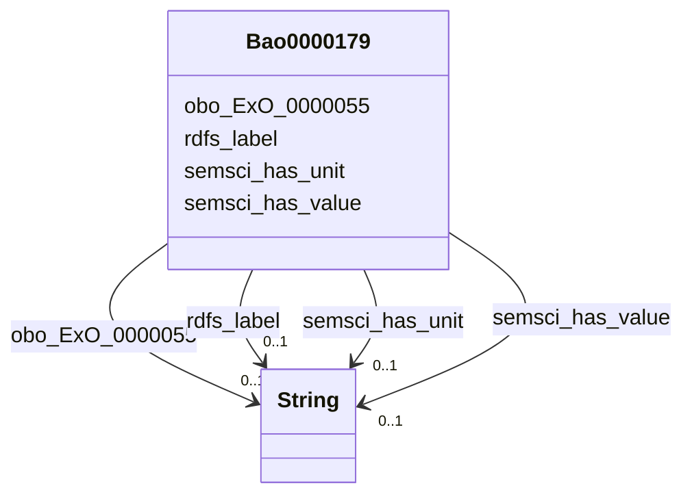

# Class: TODO -- what's a good name for this class (type)? (bao_0000179)


_TODO -- tell the world what this class (type) describes._


URI: [bao:0000179](http://www.bioassayontology.org/bao#BAO_0000179)





<!-- no inheritance hierarchy -->


## Slots

| Name | Cardinality and Range | Description | Inheritance |
| ---  | --- | --- | --- |
| [rdfs_label](../slots/rdfs_label.md) | 0..1 <br/> [xsd:string](http://www.w3.org/2001/XMLSchema#string) | TODO -- tell the world what this slot (predicate) describes | direct |
| [obo_ExO_0000055](../slots/obo_ExO_0000055.md) | 0..1 <br/> [xsd:string](http://www.w3.org/2001/XMLSchema#string) | TODO -- tell the world what this slot (predicate) describes | direct |
| [semsci_has_value](../slots/semsci_has_value.md) | 0..1 <br/> [xsd:string](http://www.w3.org/2001/XMLSchema#string) | TODO -- tell the world what this slot (predicate) describes | direct |
| [semsci_has_unit](../slots/semsci_has_unit.md) | 0..1 <br/> [xsd:string](http://www.w3.org/2001/XMLSchema#string) | TODO -- tell the world what this slot (predicate) describes | direct |


## Usages

| used by | used in | type | used |
| ---  | --- | --- | --- |
| [Bao0000040](../classes/Bao0000040.md) | [obo_OBI_0000299](../slots/obo_OBI_0000299.md) | range | [Bao0000179](../classes/Bao0000179.md) |


## TODOs

* TODO -- Todos for this class go here
* or you can delete the todos
* if you think the class is perfect.

## Identifier and Mapping Information


### Schema Source


* from schema: biobricks-ice-kg


## Mappings

| Mapping Type | Mapped Value |
| ---  | ---  |
| self | bao:0000179 |
| native | biobricks-ice-kg/:Bao0000179 |


## LinkML Source

<!-- TODO: investigate https://stackoverflow.com/questions/37606292/how-to-create-tabbed-code-blocks-in-mkdocs-or-sphinx -->

### Direct

<details>
```yaml
name: bao_0000179
description: TODO -- tell the world what this class (type) describes.
title: TODO -- what's a good name for this class (type)?
todos:
- TODO -- Todos for this class go here
- or you can delete the todos
- if you think the class is perfect.
notes:
- Class with 413168 occurences.
from_schema: biobricks-ice-kg
slots:
- rdfs_label
- obo_ExO_0000055
- semsci_has-value
- semsci_has-unit
class_uri: bao:0000179

```
</details>

### Induced

<details>
```yaml
name: bao_0000179
description: TODO -- tell the world what this class (type) describes.
title: TODO -- what's a good name for this class (type)?
todos:
- TODO -- Todos for this class go here
- or you can delete the todos
- if you think the class is perfect.
notes:
- Class with 413168 occurences.
from_schema: biobricks-ice-kg
attributes:
  rdfs_label:
    name: rdfs_label
    description: TODO -- tell the world what this slot (predicate) describes.
    todos:
    - TODO -- Todos for this slot go here
    - or you can delete the todos
    - if you think the class is perfect.
    comments:
    - 197214 occurrences with subject type cheminf_000000 and object type string.
    - 413168 occurrences with subject type bao_0000179 and object type string.
    - 542470 occurrences with subject type cheminf_000446 and object type string.
    - 542456 occurrences with subject type cheminf_000568 and object type string.
    - 2063 occurrences with subject type bao_0000015 and object type string.
    examples:
    - value: http://example.com/ice/ADME_Parameters_Data.parquet/dtxsid/DTXSID001009966/Chemical_Entity
        rdfs:label Tegafur
    - value: http://example.com/ice/ADME_Parameters_Data.parquet/record_id/httk2.2.2_DTXSID001009966/dtxsid/DTXSID001009966/endpoint/Fu/Endpoint
        rdfs:label Fu
    - value: http://identifiers.org/cas/10-00-4 rdfs:label Uliginosin B
    - value: https://comptox.epa.gov/dashboard/chemical/details/DTXSID001002091 rdfs:label
        N-[3-(Dimethylamino)propyl]octadeca-9,12-dienimidic acid
    - value: http://example.com/ice/ADME_Parameters_Data.parquet/assay/httk%2C%20Human%20Hepatic%20Intrinsic%20Clearance/Assay
        rdfs:label httk, Human Hepatic Intrinsic Clearance
    from_schema: biobricks-ice-kg
    rank: 1000
    slot_uri: rdfs:label
    alias: rdfs_label
    owner: bao_0000179
    domain_of:
    - bao_0000015
    - bao_0000179
    - cheminf_000000
    - cheminf_000446
    - cheminf_000568
    range: string
  obo_ExO_0000055:
    name: obo_ExO_0000055
    description: TODO -- tell the world what this slot (predicate) describes.
    todos:
    - TODO -- Todos for this slot go here
    - or you can delete the todos
    - if you think the class is perfect.
    comments:
    - 135113 occurrences with subject type bao_0000179 and object type string.
    examples:
    - value: 'http://example.com/ice/DART_Data.parquet/record_id/ECHADartv1_Allen%20et%20al.%201996%3B%20Study%20A_1/dtxsid/DTXSID1020194/endpoint/Body%20weight/Endpoint
        obo:ExO_0000055 Oral: diet'
    from_schema: biobricks-ice-kg
    rank: 1000
    slot_uri: obo:ExO_0000055
    alias: obo_ExO_0000055
    owner: bao_0000179
    domain_of:
    - bao_0000179
    range: string
  semsci_has-value:
    name: semsci_has-value
    description: TODO -- tell the world what this slot (predicate) describes.
    todos:
    - TODO -- Todos for this slot go here
    - or you can delete the todos
    - if you think the class is perfect.
    comments:
    - 413647 occurrences with subject type bao_0000179 and object type string.
    examples:
    - value: http://example.com/ice/ADME_Parameters_Data.parquet/record_id/httk2.2.2_DTXSID001009966/dtxsid/DTXSID001009966/endpoint/Fu/Endpoint
        semsci:has-value 0.78
    from_schema: biobricks-ice-kg
    rank: 1000
    slot_uri: semsci:has-value
    alias: semsci_has_value
    owner: bao_0000179
    domain_of:
    - bao_0000179
    range: string
  semsci_has-unit:
    name: semsci_has-unit
    description: TODO -- tell the world what this slot (predicate) describes.
    todos:
    - TODO -- Todos for this slot go here
    - or you can delete the todos
    - if you think the class is perfect.
    comments:
    - 413168 occurrences with subject type bao_0000179 and object type string.
    examples:
    - value: http://example.com/ice/ADME_Parameters_Data.parquet/record_id/httk2.2.2_DTXSID001009966/dtxsid/DTXSID001009966/endpoint/Fu/Endpoint
        semsci:has-unit Unitless
    from_schema: biobricks-ice-kg
    rank: 1000
    slot_uri: semsci:has-unit
    alias: semsci_has_unit
    owner: bao_0000179
    domain_of:
    - bao_0000179
    range: string
class_uri: bao:0000179

```
</details>