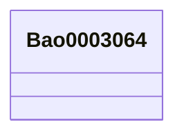

# Class: Bao0003064


This class occurs 59 times.


URI: [bao:0003064](http://www.bioassayontology.org/bao#BAO_0003064)





<!-- no inheritance hierarchy -->


## Slots

| Name | Cardinality and Range | Description | Inheritance | Occurrences |
| ---  | --- | --- | --- | --- |


## Usages

| used by | used in | type | used |
| ---  | --- | --- | --- |
| [Bao0000015](../classes/Bao0000015.md) | [umls_C1708327](../slots/umls_C1708327.md) | any_of[range] | [Bao0003064](../classes/Bao0003064.md) |
| [Bao0000015](../classes/Bao0000015.md) | [niehs_throughMechanisticTarget_NCIm](../slots/niehs_throughMechanisticTarget_NCIm.md) | any_of[range] | [Bao0003064](../classes/Bao0003064.md) |


## LinkML Source

<!-- TODO: investigate https://stackoverflow.com/questions/37606292/how-to-create-tabbed-code-blocks-in-mkdocs-or-sphinx -->

### Direct

<details>

```yaml
name: bao_0003064
from_schema: okns:biobricks-ice-kg
rank: 1000
class_uri: bao:0003064

```
</details>

### Induced

<details>

```yaml
name: bao_0003064
from_schema: okns:biobricks-ice-kg
rank: 1000
class_uri: bao:0003064

```
</details>