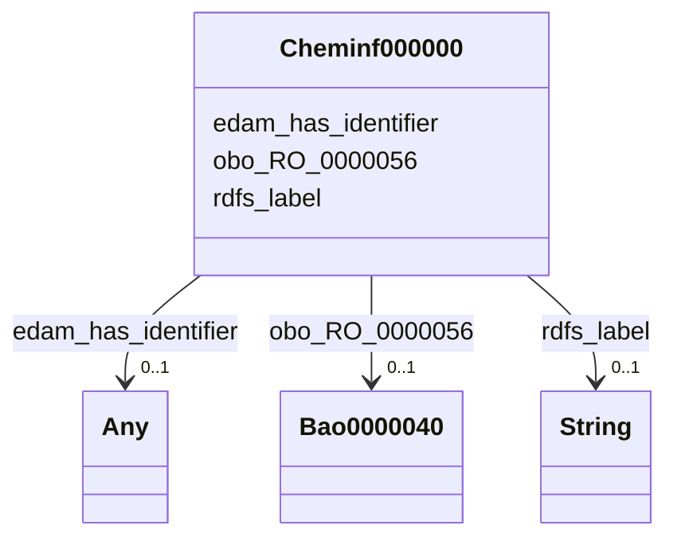

# Class: TODO -- what's a good name for this class (type)? (cheminf_000000)


_No type description provided_


URI: [cheminf:000000](http://purl.obolibrary.org/obo/CHEMINF_000000)





<!-- no inheritance hierarchy -->


## Slots

| Name | Cardinality and Range | Description | Inheritance |
| ---  | --- | --- | --- |
| [edam_has_identifier](../slots/edam_has_identifier.md) | 0..1 <br/> [Cheminf000568](../classes/Cheminf000568.md)&nbsp;or&nbsp;<br />[Cheminf000446](../classes/Cheminf000446.md) | No slot description provided | direct |
| [rdfs_label](../slots/rdfs_label.md) | 0..1 <br/> [xsd:string](xsd:string) | No slot description provided | direct |
| [obo_RO_0000056](../slots/obo_RO_0000056.md) | 0..1 <br/> [Bao0000040](../classes/Bao0000040.md) | No slot description provided | direct |


## Usages

| used by | used in | type | used |
| ---  | --- | --- | --- |
| [Bao0000040](../classes/Bao0000040.md) | [obo_RO_0000057](../slots/obo_RO_0000057.md) | range | [Cheminf000000](../classes/Cheminf000000.md) |


## TODOs

* TODO -- Todos for this class go here
* or you can delete the todos
* if you think the class is perfect.

## Identifier and Mapping Information


### Schema Source


* from schema: biobricks-ice-kg


## Mappings

| Mapping Type | Mapped Value |
| ---  | ---  |
| self | cheminf:000000 |
| native | biobricks-ice-kg/:Cheminf000000 |


## LinkML Source

<!-- TODO: investigate https://stackoverflow.com/questions/37606292/how-to-create-tabbed-code-blocks-in-mkdocs-or-sphinx -->

### Direct

<details>
```yaml
name: cheminf_000000
description: No type description provided
title: TODO -- what's a good name for this class (type)?
todos:
- TODO -- Todos for this class go here
- or you can delete the todos
- if you think the class is perfect.
notes:
- Class with 197214 occurences.
from_schema: biobricks-ice-kg
rank: 1000
slots:
- edam_has_identifier
- rdfs_label
- obo_RO_0000056
class_uri: cheminf:000000

```
</details>

### Induced

<details>
```yaml
name: cheminf_000000
description: No type description provided
title: TODO -- what's a good name for this class (type)?
todos:
- TODO -- Todos for this class go here
- or you can delete the todos
- if you think the class is perfect.
notes:
- Class with 197214 occurences.
from_schema: biobricks-ice-kg
rank: 1000
attributes:
  edam_has_identifier:
    name: edam_has_identifier
    description: No slot description provided
    todos:
    - TODO -- Todos for this slot go here
    - or you can delete the todos
    - if you think the class is perfect.
    comments:
    - 197214 occurrences with subject type cheminf_000000 and object type cheminf_000446.
    - 197214 occurrences with subject type cheminf_000000 and object type cheminf_000568.
    examples:
    - value: http://example.com/ice/Endocrine_In_Vivo_Endocrine.parquet/dtxsid/DTXSID9047962/Chemical_Entity
        edam:has_identifier http://identifiers.org/cas/101-53-1
    - value: http://example.com/ice/Endocrine_In_Vivo_Endocrine.parquet/dtxsid/DTXSID9047962/Chemical_Entity
        edam:has_identifier https://comptox.epa.gov/dashboard/chemical/details/DTXSID9047962
    from_schema: biobricks-ice-kg
    rank: 1000
    slot_uri: edam:has_identifier
    alias: edam_has_identifier
    owner: cheminf_000000
    domain_of:
    - cheminf_000000
    range: Any
    any_of:
    - range: cheminf_000568
    - range: cheminf_000446
  rdfs_label:
    name: rdfs_label
    description: No slot description provided
    todos:
    - TODO -- Todos for this slot go here
    - or you can delete the todos
    - if you think the class is perfect.
    comments:
    - 197214 occurrences with subject type cheminf_000000 and object type string.
    - 413168 occurrences with subject type bao_0000179 and object type string.
    - 542470 occurrences with subject type cheminf_000446 and object type string.
    - 542456 occurrences with subject type cheminf_000568 and object type string.
    - 2063 occurrences with subject type bao_0000015 and object type string.
    examples:
    - value: http://example.com/ice/ADME_Parameters_Data.parquet/dtxsid/DTXSID001009966/Chemical_Entity
        rdfs:label Tegafur
    - value: http://example.com/ice/ADME_Parameters_Data.parquet/record_id/httk2.2.2_DTXSID001009966/dtxsid/DTXSID001009966/endpoint/Fu/Endpoint
        rdfs:label Fu
    - value: http://identifiers.org/cas/10-00-4 rdfs:label Uliginosin B
    - value: https://comptox.epa.gov/dashboard/chemical/details/DTXSID001002091 rdfs:label
        N-[3-(Dimethylamino)propyl]octadeca-9,12-dienimidic acid
    - value: http://example.com/ice/ADME_Parameters_Data.parquet/assay/httk%2C%20Human%20Hepatic%20Intrinsic%20Clearance/Assay
        rdfs:label httk, Human Hepatic Intrinsic Clearance
    from_schema: biobricks-ice-kg
    rank: 1000
    slot_uri: rdfs:label
    alias: rdfs_label
    owner: cheminf_000000
    domain_of:
    - bao_0000015
    - bao_0000179
    - cheminf_000000
    - cheminf_000446
    - cheminf_000568
    range: string
  obo_RO_0000056:
    name: obo_RO_0000056
    description: No slot description provided
    todos:
    - TODO -- Todos for this slot go here
    - or you can delete the todos
    - if you think the class is perfect.
    comments:
    - 202322 occurrences with subject type cheminf_000000 and object type bao_0000040.
    examples:
    - value: http://example.com/ice/Endocrine_In_Vivo_Endocrine.parquet/dtxsid/DTXSID9047962/Chemical_Entity
        obo:RO_0000056 http://example.com/ice/Endocrine_In_Vivo_Endocrine.parquet/dtxsid/DTXSID9047962/assay/Hershberger-Antagonist/Measure_Group
    from_schema: biobricks-ice-kg
    rank: 1000
    slot_uri: obo:RO_0000056
    alias: obo_RO_0000056
    owner: cheminf_000000
    domain_of:
    - cheminf_000000
    range: bao_0000040
class_uri: cheminf:000000

```
</details>