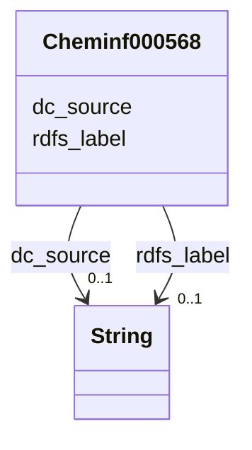

# Class: TODO -- what's a good name for this class (type)? (cheminf_000568)


_TODO -- tell the world what this class (type) describes._


URI: [cheminf:000568](http://purl.obolibrary.org/obo/CHEMINF_000568)





<!-- no inheritance hierarchy -->


## Slots

| Name | Cardinality and Range | Description | Inheritance |
| ---  | --- | --- | --- |
| [dc_source](../slots/dc_source.md) | 0..1 <br/> [xsd:string](http://www.w3.org/2001/XMLSchema#string) | TODO -- tell the world what this slot (predicate) describes | direct |
| [rdfs_label](../slots/rdfs_label.md) | 0..1 <br/> [xsd:string](http://www.w3.org/2001/XMLSchema#string) | TODO -- tell the world what this slot (predicate) describes | direct |


## Usages

| used by | used in | type | used |
| ---  | --- | --- | --- |
| [Cheminf000000](../classes/Cheminf000000.md) | [edam_has_identifier](../slots/edam_has_identifier.md) | any_of[range] | [Cheminf000568](../classes/Cheminf000568.md) |


## TODOs

* TODO -- Todos for this class go here
* or you can delete the todos
* if you think the class is perfect.

## Identifier and Mapping Information


### Schema Source


* from schema: biobricks-ice-kg


## Mappings

| Mapping Type | Mapped Value |
| ---  | ---  |
| self | cheminf:000568 |
| native | biobricks-ice-kg/:Cheminf000568 |


## LinkML Source

<!-- TODO: investigate https://stackoverflow.com/questions/37606292/how-to-create-tabbed-code-blocks-in-mkdocs-or-sphinx -->

### Direct

<details>
```yaml
name: cheminf_000568
description: TODO -- tell the world what this class (type) describes.
title: TODO -- what's a good name for this class (type)?
todos:
- TODO -- Todos for this class go here
- or you can delete the todos
- if you think the class is perfect.
notes:
- Class with 538131 occurences.
from_schema: biobricks-ice-kg
slots:
- dc_source
- rdfs_label
class_uri: cheminf:000568

```
</details>

### Induced

<details>
```yaml
name: cheminf_000568
description: TODO -- tell the world what this class (type) describes.
title: TODO -- what's a good name for this class (type)?
todos:
- TODO -- Todos for this class go here
- or you can delete the todos
- if you think the class is perfect.
notes:
- Class with 538131 occurences.
from_schema: biobricks-ice-kg
attributes:
  dc_source:
    name: dc_source
    description: TODO -- tell the world what this slot (predicate) describes.
    todos:
    - TODO -- Todos for this slot go here
    - or you can delete the todos
    - if you think the class is perfect.
    comments:
    - 538147 occurrences with subject type cheminf_000446 and object type string.
    - 538131 occurrences with subject type cheminf_000568 and object type string.
    - 3990 occurrences with subject type bao_0000015 and object type string.
    examples:
    - value: http://identifiers.org/cas/10-00-4 dc:source CAS
    - value: https://comptox.epa.gov/dashboard/chemical/details/DTXSID001002091 dc:source
        CompTox
    - value: https://comptox.epa.gov/dashboard/assay-endpoints/ACEA_AR_agonist_80hr
        dc:source ICE
    from_schema: biobricks-ice-kg
    rank: 1000
    slot_uri: dc:source
    alias: dc_source
    owner: cheminf_000568
    domain_of:
    - bao_0000015
    - cheminf_000446
    - cheminf_000568
    range: string
  rdfs_label:
    name: rdfs_label
    description: TODO -- tell the world what this slot (predicate) describes.
    todos:
    - TODO -- Todos for this slot go here
    - or you can delete the todos
    - if you think the class is perfect.
    comments:
    - 197214 occurrences with subject type cheminf_000000 and object type string.
    - 413168 occurrences with subject type bao_0000179 and object type string.
    - 542470 occurrences with subject type cheminf_000446 and object type string.
    - 542456 occurrences with subject type cheminf_000568 and object type string.
    - 2063 occurrences with subject type bao_0000015 and object type string.
    examples:
    - value: http://example.com/ice/ADME_Parameters_Data.parquet/dtxsid/DTXSID001009966/Chemical_Entity
        rdfs:label Tegafur
    - value: http://example.com/ice/ADME_Parameters_Data.parquet/record_id/httk2.2.2_DTXSID001009966/dtxsid/DTXSID001009966/endpoint/Fu/Endpoint
        rdfs:label Fu
    - value: http://identifiers.org/cas/10-00-4 rdfs:label Uliginosin B
    - value: https://comptox.epa.gov/dashboard/chemical/details/DTXSID001002091 rdfs:label
        N-[3-(Dimethylamino)propyl]octadeca-9,12-dienimidic acid
    - value: http://example.com/ice/ADME_Parameters_Data.parquet/assay/httk%2C%20Human%20Hepatic%20Intrinsic%20Clearance/Assay
        rdfs:label httk, Human Hepatic Intrinsic Clearance
    from_schema: biobricks-ice-kg
    rank: 1000
    slot_uri: rdfs:label
    alias: rdfs_label
    owner: cheminf_000568
    domain_of:
    - bao_0000015
    - bao_0000179
    - cheminf_000000
    - cheminf_000446
    - cheminf_000568
    range: string
class_uri: cheminf:000568

```
</details>