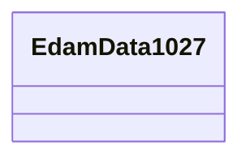

# Class: TODO -- what's a good name for this class (type)? (edam_data_1027)


_TODO -- tell the world what this class (type) describes._


URI: [edam:data_1027](http://edamontology.org/data_1027)





<!-- no inheritance hierarchy -->


## Slots

| Name | Cardinality and Range | Description | Inheritance |
| ---  | --- | --- | --- |


## Usages

| used by | used in | type | used |
| ---  | --- | --- | --- |
| [Bao0000015](../classes/Bao0000015.md) | [niehs_assay_entrez_gene_id](../slots/niehs_assay_entrez_gene_id.md) | range | [EdamData1027](../classes/EdamData1027.md) |


## Examples

| Value |
| --- |
| https://www.ncbi.nlm.nih.gov/gene/10000 |

## TODOs

* TODO -- Todos for this class go here
* or you can delete the todos
* if you think the class is perfect.

## Identifier and Mapping Information


### Schema Source


* from schema: biobricks-ice-kg


## Mappings

| Mapping Type | Mapped Value |
| ---  | ---  |
| self | edam:data_1027 |
| native | biobricks-ice-kg/:EdamData1027 |


## LinkML Source

<!-- TODO: investigate https://stackoverflow.com/questions/37606292/how-to-create-tabbed-code-blocks-in-mkdocs-or-sphinx -->

### Direct

<details>
```yaml
name: edam_data_1027
description: TODO -- tell the world what this class (type) describes.
title: TODO -- what's a good name for this class (type)?
todos:
- TODO -- Todos for this class go here
- or you can delete the todos
- if you think the class is perfect.
notes:
- Class with 526 occurences.
examples:
- value: https://www.ncbi.nlm.nih.gov/gene/10000
from_schema: biobricks-ice-kg
class_uri: edam:data_1027

```
</details>

### Induced

<details>
```yaml
name: edam_data_1027
description: TODO -- tell the world what this class (type) describes.
title: TODO -- what's a good name for this class (type)?
todos:
- TODO -- Todos for this class go here
- or you can delete the todos
- if you think the class is perfect.
notes:
- Class with 526 occurences.
examples:
- value: https://www.ncbi.nlm.nih.gov/gene/10000
from_schema: biobricks-ice-kg
class_uri: edam:data_1027

```
</details>