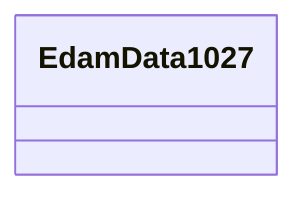

# Class: EdamData1027


This class occurs 526 times.


URI: [edam:data_1027](http://edamontology.org/data_1027)





<!-- no inheritance hierarchy -->


## Slots

| Name | Cardinality and Range | Description | Inheritance | Occurrences |
| ---  | --- | --- | --- | --- |


## Usages

| used by | used in | type | used |
| ---  | --- | --- | --- |
| [Bao0000015](../classes/Bao0000015.md) | [niehs_assay_entrez_gene_id](../slots/niehs_assay_entrez_gene_id.md) | range | [EdamData1027](../classes/EdamData1027.md) |


## LinkML Source

<!-- TODO: investigate https://stackoverflow.com/questions/37606292/how-to-create-tabbed-code-blocks-in-mkdocs-or-sphinx -->

### Direct

<details>

```yaml
name: edam_data_1027
from_schema: okns:biobricks-ice-kg
rank: 1000
class_uri: edam:data_1027

```
</details>

### Induced

<details>

```yaml
name: edam_data_1027
from_schema: okns:biobricks-ice-kg
rank: 1000
class_uri: edam:data_1027

```
</details>