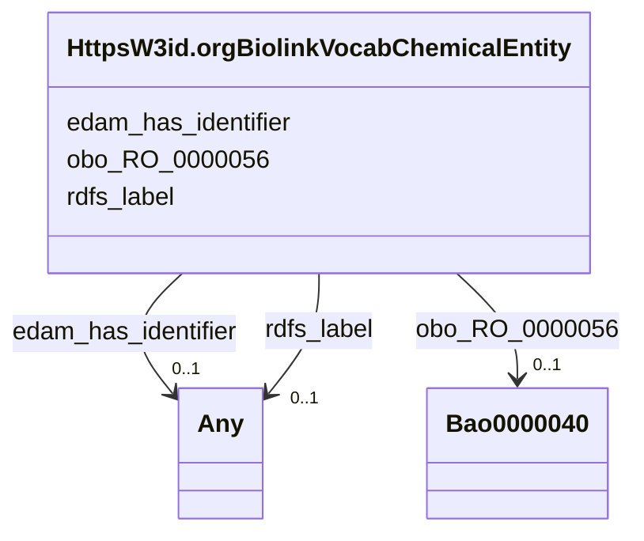

# Class: HttpsW3id.orgBiolinkVocabChemicalEntity


This class occurs 206543 times.


URI: [https://w3id.org/biolink/vocab/ChemicalEntity](https://w3id.org/biolink/vocab/ChemicalEntity)





<!-- no inheritance hierarchy -->


## Slots

| Name | Cardinality and Range | Description | Inheritance | Occurrences |
| ---  | --- | --- | --- | --- |
| [edam_has_identifier](../slots/edam_has_identifier.md) | 0..1 <br/> [OboCHEMINF000568](../classes/OboCHEMINF000568.md)&nbsp;or&nbsp;<br />[OboCHEMINF000446](../classes/OboCHEMINF000446.md) |  <br/>  | direct | 413086 |
| [obo_RO_0000056](../slots/obo_RO_0000056.md) | 0..1 <br/> [Bao0000040](../classes/Bao0000040.md) |  <br/>  | direct | 2306975 |
| [rdfs_label](../slots/rdfs_label.md) | 0..1 <br/> [RdfsLiteral](../classes/RdfsLiteral.md)&nbsp;or&nbsp;<br />[xsd:string](xsd:string) | A human-readable name for the subject <br/>  | direct | 206543 |


## Usages

| used by | used in | type | used |
| ---  | --- | --- | --- |
| [Bao0000040](../classes/Bao0000040.md) | [obo_RO_0000057](../slots/obo_RO_0000057.md) | any_of[range] | [HttpsW3id.orgBiolinkVocabChemicalEntity](../classes/HttpsW3id.orgBiolinkVocabChemicalEntity.md) |
| [Bao0000179](../classes/Bao0000179.md) | [obo_IAO_0000136](../slots/obo_IAO_0000136.md) | any_of[range] | [HttpsW3id.orgBiolinkVocabChemicalEntity](../classes/HttpsW3id.orgBiolinkVocabChemicalEntity.md) |


## LinkML Source

<!-- TODO: investigate https://stackoverflow.com/questions/37606292/how-to-create-tabbed-code-blocks-in-mkdocs-or-sphinx -->

### Direct

<details>

```yaml
name: https___w3id.org_biolink_vocab_ChemicalEntity
from_schema: okns:biobricks-ice-kg
rank: 1000
slots:
- edam_has_identifier
- obo_RO_0000056
- rdfs_label
class_uri: https://w3id.org/biolink/vocab/ChemicalEntity

```
</details>

### Induced

<details>

```yaml
name: https___w3id.org_biolink_vocab_ChemicalEntity
from_schema: okns:biobricks-ice-kg
rank: 1000
attributes:
  edam_has_identifier:
    name: edam_has_identifier
    from_schema: okns:biobricks-ice-kg
    rank: 1000
    slot_uri: edam:has_identifier
    alias: edam_has_identifier
    owner: https___w3id.org_biolink_vocab_ChemicalEntity
    domain_of:
    - https___w3id.org_biolink_vocab_ChemicalEntity
    - obo_CHEMINF_000000
    range: Any
    any_of:
    - range: obo_CHEMINF_000568
    - range: obo_CHEMINF_000446
  obo_RO_0000056:
    name: obo_RO_0000056
    from_schema: okns:biobricks-ice-kg
    rank: 1000
    slot_uri: obo:RO_0000056
    alias: obo_RO_0000056
    owner: https___w3id.org_biolink_vocab_ChemicalEntity
    domain_of:
    - https___w3id.org_biolink_vocab_ChemicalEntity
    - obo_CHEMINF_000000
    range: bao_0000040
  rdfs_label:
    name: rdfs_label
    description: A human-readable name for the subject.
    title: label
    from_schema: okns:owl-rdf-rdfs
    source: http://www.w3.org/2000/01/rdf-schema#
    domain: rdfs_Resource
    slot_uri: rdfs:label
    alias: rdfs_label
    owner: https___w3id.org_biolink_vocab_ChemicalEntity
    domain_of:
    - rdf_List
    - rdfs_Datatype
    - dcam_VocabularyEncodingScheme
    - dct_AgentClass
    - bao_0000015
    - bao_0000179
    - https___w3id.org_biolink_vocab_ChemicalEntity
    - obo_CHEMINF_000000
    - obo_CHEMINF_000446
    - obo_CHEMINF_000568
    range: Any
    any_of:
    - range: rdfs_Literal
    - range: string
class_uri: https://w3id.org/biolink/vocab/ChemicalEntity

```
</details>