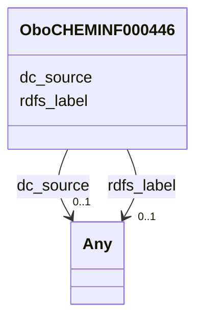

# Class: OboCHEMINF000446


This class occurs 538147 times.


URI: [obo:CHEMINF_000446](http://purl.obolibrary.org/obo/CHEMINF_000446)





<!-- no inheritance hierarchy -->


## Slots

| Name | Cardinality and Range | Description | Inheritance | Occurrences |
| ---  | --- | --- | --- | --- |
| [dc_source](../slots/dc_source.md) | 0..1 <br/> [Any](../classes/Any.md) | The described resource may be derived from the related resource in whole or i... <br/> description: A related resource from which the described resource is derived. | direct | 538147 |
| [rdfs_label](../slots/rdfs_label.md) | 0..1 <br/> [RdfsLiteral](../classes/RdfsLiteral.md)&nbsp;or&nbsp;<br />[xsd:string](xsd:string) | A human-readable name for the subject <br/>  | direct | 542470 |


## Usages

| used by | used in | type | used |
| ---  | --- | --- | --- |
| [HttpsW3id.orgBiolinkVocabChemicalEntity](../classes/HttpsW3id.orgBiolinkVocabChemicalEntity.md) | [edam_has_identifier](../slots/edam_has_identifier.md) | any_of[range] | [OboCHEMINF000446](../classes/OboCHEMINF000446.md) |
| [OboCHEMINF000000](../classes/OboCHEMINF000000.md) | [edam_has_identifier](../slots/edam_has_identifier.md) | any_of[range] | [OboCHEMINF000446](../classes/OboCHEMINF000446.md) |


## LinkML Source

<!-- TODO: investigate https://stackoverflow.com/questions/37606292/how-to-create-tabbed-code-blocks-in-mkdocs-or-sphinx -->

### Direct

<details>

```yaml
name: obo_CHEMINF_000446
from_schema: okns:biobricks-ice-kg
rank: 1000
slots:
- dc_source
- rdfs_label
class_uri: obo:CHEMINF_000446

```
</details>

### Induced

<details>

```yaml
name: obo_CHEMINF_000446
from_schema: okns:biobricks-ice-kg
rank: 1000
attributes:
  dc_source:
    name: dc_source
    description: The described resource may be derived from the related resource in
      whole or in part. Recommended best practice is to identify the related resource
      by means of a string conforming to a formal identification system.
    title: Source
    notes:
    - 'A [second property](/specifications/dublin-core/dcmi-terms/#http://purl.org/dc/terms/source)
      with the same name as this property has been declared in the [dcterms: namespace](http://purl.org/dc/terms/).  See
      the Introduction to the document [DCMI Metadata Terms](/specifications/dublin-core/dcmi-terms/)
      for an explanation.'
    - No occurrences of this slot in the graph.
    comments:
    - 'description: A related resource from which the described resource is derived.'
    from_schema: okns:dc
    source: http://purl.org/dc/elements/1.1/
    slot_uri: dc:source
    alias: dc_source
    owner: obo_CHEMINF_000446
    domain_of:
    - bao_0000015
    - obo_CHEMINF_000446
    - obo_CHEMINF_000568
    range: Any
  rdfs_label:
    name: rdfs_label
    description: A human-readable name for the subject.
    title: label
    from_schema: okns:owl-rdf-rdfs
    source: http://www.w3.org/2000/01/rdf-schema#
    domain: rdfs_Resource
    slot_uri: rdfs:label
    alias: rdfs_label
    owner: obo_CHEMINF_000446
    domain_of:
    - rdf_List
    - rdfs_Datatype
    - dcam_VocabularyEncodingScheme
    - dct_AgentClass
    - bao_0000015
    - bao_0000179
    - https___w3id.org_biolink_vocab_ChemicalEntity
    - obo_CHEMINF_000000
    - obo_CHEMINF_000446
    - obo_CHEMINF_000568
    range: Any
    any_of:
    - range: rdfs_Literal
    - range: string
class_uri: obo:CHEMINF_000446

```
</details>