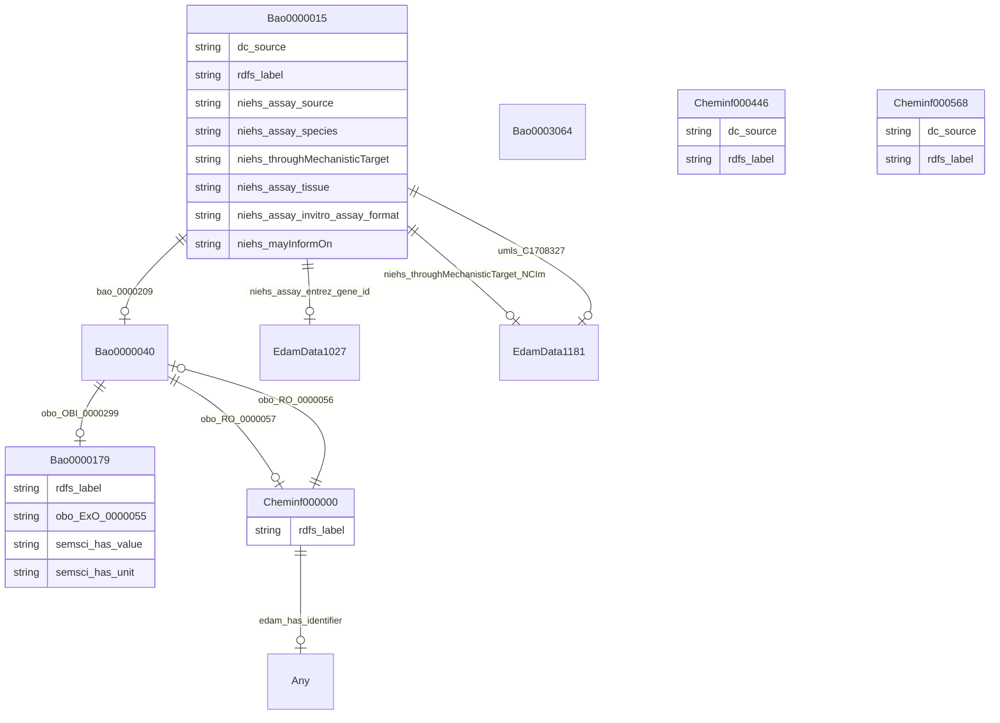

# TODO_Give_this_schema_a_name!

TODO -- tell the world what this schema describes.

URI: biobricks-ice-kg

Name: biobricks-ice-kg

## Schema Diagram

## Classes

| Class | Description |
| --- | --- |
| [Any](classes/Any.md) | None |
| [Bao0000015](classes/Bao0000015.md) | TODO -- tell the world what this class (type) describes. |
| [Bao0000040](classes/Bao0000040.md) | TODO -- tell the world what this class (type) describes. |
| [Bao0000179](classes/Bao0000179.md) | TODO -- tell the world what this class (type) describes. |
| [Bao0003064](classes/Bao0003064.md) | TODO -- tell the world what this class (type) describes. |
| [Cheminf000000](classes/Cheminf000000.md) | TODO -- tell the world what this class (type) describes. |
| [Cheminf000446](classes/Cheminf000446.md) | TODO -- tell the world what this class (type) describes. |
| [Cheminf000568](classes/Cheminf000568.md) | TODO -- tell the world what this class (type) describes. |
| [EdamData1027](classes/EdamData1027.md) | TODO -- tell the world what this class (type) describes. |
| [EdamData1181](classes/EdamData1181.md) | TODO -- tell the world what this class (type) describes. |

## Slots

| Slot | Description |
| --- | --- |
| [bao_0000209](slots/bao_0000209.md) | TODO -- tell the world what this slot (predicate) describes |
| [dc_source](slots/dc_source.md) | TODO -- tell the world what this slot (predicate) describes |
| [edam_has_identifier](slots/edam_has_identifier.md) | TODO -- tell the world what this slot (predicate) describes |
| [niehs_assay_entrez_gene_id](slots/niehs_assay_entrez_gene_id.md) | TODO -- tell the world what this slot (predicate) describes |
| [niehs_assay_invitro_assay_format](slots/niehs_assay_invitro_assay_format.md) | TODO -- tell the world what this slot (predicate) describes |
| [niehs_assay_source](slots/niehs_assay_source.md) | TODO -- tell the world what this slot (predicate) describes |
| [niehs_assay_species](slots/niehs_assay_species.md) | TODO -- tell the world what this slot (predicate) describes |
| [niehs_assay_tissue](slots/niehs_assay_tissue.md) | TODO -- tell the world what this slot (predicate) describes |
| [niehs_mayInformOn](slots/niehs_mayInformOn.md) | TODO -- tell the world what this slot (predicate) describes |
| [niehs_throughMechanisticTarget](slots/niehs_throughMechanisticTarget.md) | TODO -- tell the world what this slot (predicate) describes |
| [niehs_throughMechanisticTarget_NCIm](slots/niehs_throughMechanisticTarget_NCIm.md) | TODO -- tell the world what this slot (predicate) describes |
| [obo_ExO_0000055](slots/obo_ExO_0000055.md) | TODO -- tell the world what this slot (predicate) describes |
| [obo_OBI_0000299](slots/obo_OBI_0000299.md) | TODO -- tell the world what this slot (predicate) describes |
| [obo_RO_0000056](slots/obo_RO_0000056.md) | TODO -- tell the world what this slot (predicate) describes |
| [obo_RO_0000057](slots/obo_RO_0000057.md) | TODO -- tell the world what this slot (predicate) describes |
| [rdfs_label](slots/rdfs_label.md) | TODO -- tell the world what this slot (predicate) describes |
| [semsci_has_unit](slots/semsci_has_unit.md) | TODO -- tell the world what this slot (predicate) describes |
| [semsci_has_value](slots/semsci_has_value.md) | TODO -- tell the world what this slot (predicate) describes |
| [umls_C1708327](slots/umls_C1708327.md) | TODO -- tell the world what this slot (predicate) describes |

## Enumerations

| Enumeration | Description |
| --- | --- |

## Types

| Type | Description |
| --- | --- |

## Subsets

| Subset | Description |
| --- | --- |
