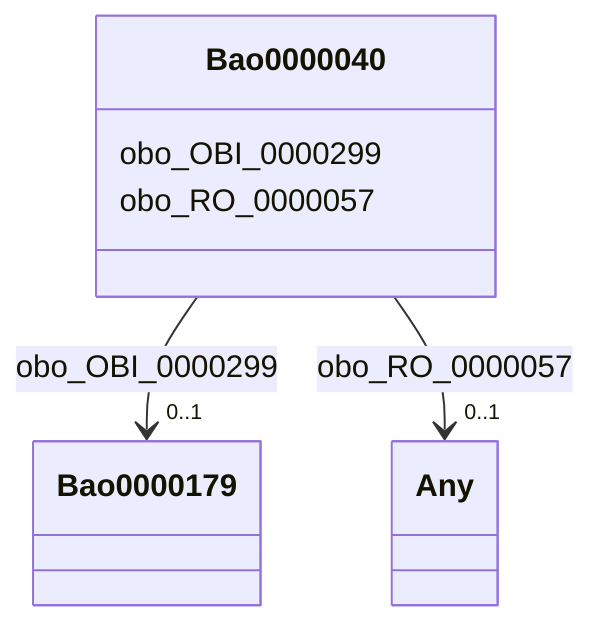

# Class: Bao0000040


This class occurs 3344010 times.


URI: [bao:0000040](http://www.bioassayontology.org/bao#BAO_0000040)





<!-- no inheritance hierarchy -->


## Slots

| Name | Cardinality and Range | Description | Inheritance | Occurrences |
| ---  | --- | --- | --- | --- |
| [obo_OBI_0000299](../slots/obo_OBI_0000299.md) | 0..1 <br/> [Bao0000179](../classes/Bao0000179.md) |  <br/>  | direct | 3344010 |
| [obo_RO_0000057](../slots/obo_RO_0000057.md) | 0..1 <br/> [HttpsW3id.orgBiolinkVocabChemicalEntity](../classes/HttpsW3id.orgBiolinkVocabChemicalEntity.md)&nbsp;or&nbsp;<br />[OboCHEMINF000000](../classes/OboCHEMINF000000.md) |  <br/>  | direct | 6688020 |


## Usages

| used by | used in | type | used |
| ---  | --- | --- | --- |
| [Bao0000015](../classes/Bao0000015.md) | [bao_0000209](../slots/bao_0000209.md) | range | [Bao0000040](../classes/Bao0000040.md) |
| [HttpsW3id.orgBiolinkVocabChemicalEntity](../classes/HttpsW3id.orgBiolinkVocabChemicalEntity.md) | [obo_RO_0000056](../slots/obo_RO_0000056.md) | range | [Bao0000040](../classes/Bao0000040.md) |
| [OboCHEMINF000000](../classes/OboCHEMINF000000.md) | [obo_RO_0000056](../slots/obo_RO_0000056.md) | range | [Bao0000040](../classes/Bao0000040.md) |


## LinkML Source

<!-- TODO: investigate https://stackoverflow.com/questions/37606292/how-to-create-tabbed-code-blocks-in-mkdocs-or-sphinx -->

### Direct

<details>

```yaml
name: bao_0000040
from_schema: okns:biobricks-toxcast-kg
rank: 1000
slots:
- obo_OBI_0000299
- obo_RO_0000057
class_uri: bao:0000040

```
</details>

### Induced

<details>

```yaml
name: bao_0000040
from_schema: okns:biobricks-toxcast-kg
rank: 1000
attributes:
  obo_OBI_0000299:
    name: obo_OBI_0000299
    from_schema: okns:biobricks-toxcast-kg
    rank: 1000
    slot_uri: obo:OBI_0000299
    alias: obo_OBI_0000299
    owner: bao_0000040
    domain_of:
    - bao_0000040
    range: bao_0000179
  obo_RO_0000057:
    name: obo_RO_0000057
    from_schema: okns:biobricks-toxcast-kg
    rank: 1000
    slot_uri: obo:RO_0000057
    alias: obo_RO_0000057
    owner: bao_0000040
    domain_of:
    - bao_0000040
    range: Any
    any_of:
    - range: https___w3id.org_biolink_vocab_ChemicalEntity
    - range: obo_CHEMINF_000000
class_uri: bao:0000040

```
</details>