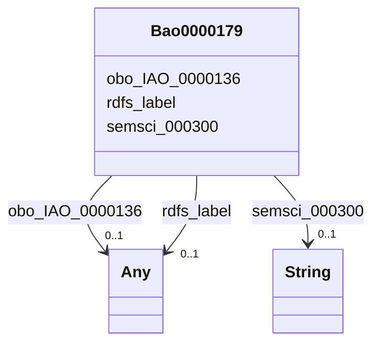

# Class: Bao0000179


This class occurs 3344010 times.


URI: [bao:0000179](http://www.bioassayontology.org/bao#BAO_0000179)





<!-- no inheritance hierarchy -->


## Slots

| Name | Cardinality and Range | Description | Inheritance | Occurrences |
| ---  | --- | --- | --- | --- |
| [rdfs_label](../slots/rdfs_label.md) | 0..1 <br/> [RdfsLiteral](../classes/RdfsLiteral.md)&nbsp;or&nbsp;<br />[xsd:string](xsd:string) | A human-readable name for the subject <br/>  | direct | 3344010 |
| [semsci_000300](../slots/semsci_000300.md) | 0..1 <br/> [xsd:string](xsd:string) |  <br/>  | direct | 3380300 |
| [obo_IAO_0000136](../slots/obo_IAO_0000136.md) | 0..1 <br/> [HttpsW3id.orgBiolinkVocabChemicalEntity](../classes/HttpsW3id.orgBiolinkVocabChemicalEntity.md)&nbsp;or&nbsp;<br />[OboCHEMINF000000](../classes/OboCHEMINF000000.md) |  <br/>  | direct | 6688020 |


## Usages

| used by | used in | type | used |
| ---  | --- | --- | --- |
| [Bao0000040](../classes/Bao0000040.md) | [obo_OBI_0000299](../slots/obo_OBI_0000299.md) | range | [Bao0000179](../classes/Bao0000179.md) |


## LinkML Source

<!-- TODO: investigate https://stackoverflow.com/questions/37606292/how-to-create-tabbed-code-blocks-in-mkdocs-or-sphinx -->

### Direct

<details>

```yaml
name: bao_0000179
from_schema: okns:biobricks-toxcast-kg
rank: 1000
slots:
- rdfs_label
- semsci_000300
- obo_IAO_0000136
class_uri: bao:0000179

```
</details>

### Induced

<details>

```yaml
name: bao_0000179
from_schema: okns:biobricks-toxcast-kg
rank: 1000
attributes:
  rdfs_label:
    name: rdfs_label
    description: A human-readable name for the subject.
    title: label
    from_schema: okns:owl-rdf-rdfs
    source: http://www.w3.org/2000/01/rdf-schema#
    domain: rdfs_Resource
    slot_uri: rdfs:label
    alias: rdfs_label
    owner: bao_0000179
    domain_of:
    - rdf_List
    - rdfs_Datatype
    - dcam_VocabularyEncodingScheme
    - dct_AgentClass
    - bao_0000015
    - bao_0000179
    - https___w3id.org_biolink_vocab_ChemicalEntity
    - obo_CHEMINF_000000
    - obo_CHEMINF_000446
    - obo_CHEMINF_000568
    range: Any
    any_of:
    - range: rdfs_Literal
    - range: string
  semsci_000300:
    name: semsci_000300
    from_schema: okns:biobricks-toxcast-kg
    rank: 1000
    slot_uri: semsci:000300
    alias: semsci_000300
    owner: bao_0000179
    domain_of:
    - bao_0000179
    range: string
  obo_IAO_0000136:
    name: obo_IAO_0000136
    from_schema: okns:biobricks-toxcast-kg
    rank: 1000
    slot_uri: obo:IAO_0000136
    alias: obo_IAO_0000136
    owner: bao_0000179
    domain_of:
    - bao_0000179
    range: Any
    any_of:
    - range: https___w3id.org_biolink_vocab_ChemicalEntity
    - range: obo_CHEMINF_000000
class_uri: bao:0000179

```
</details>