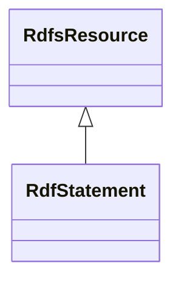

# Class: Statement (rdf_Statement)


_The class of RDF statements._


This class occurs 18352179 times.


URI: [rdf:Statement](http://www.w3.org/1999/02/22-rdf-syntax-ns#Statement)





## Inheritance
* [RdfsResource](../classes/RdfsResource.md)
    * **RdfStatement**


## Slots

| Name | Cardinality and Range | Description | Inheritance | Occurrences |
| ---  | --- | --- | --- | --- |


## LinkML Source

<!-- TODO: investigate https://stackoverflow.com/questions/37606292/how-to-create-tabbed-code-blocks-in-mkdocs-or-sphinx -->

### Direct

<details>

```yaml
name: rdf_Statement
description: The class of RDF statements.
title: Statement
from_schema: okns:owl-rdf-rdfs
source: http://www.w3.org/1999/02/22-rdf-syntax-ns#
is_a: rdfs_Resource
class_uri: rdf:Statement

```
</details>

### Induced

<details>

```yaml
name: rdf_Statement
description: The class of RDF statements.
title: Statement
from_schema: okns:owl-rdf-rdfs
source: http://www.w3.org/1999/02/22-rdf-syntax-ns#
is_a: rdfs_Resource
class_uri: rdf:Statement

```
</details>