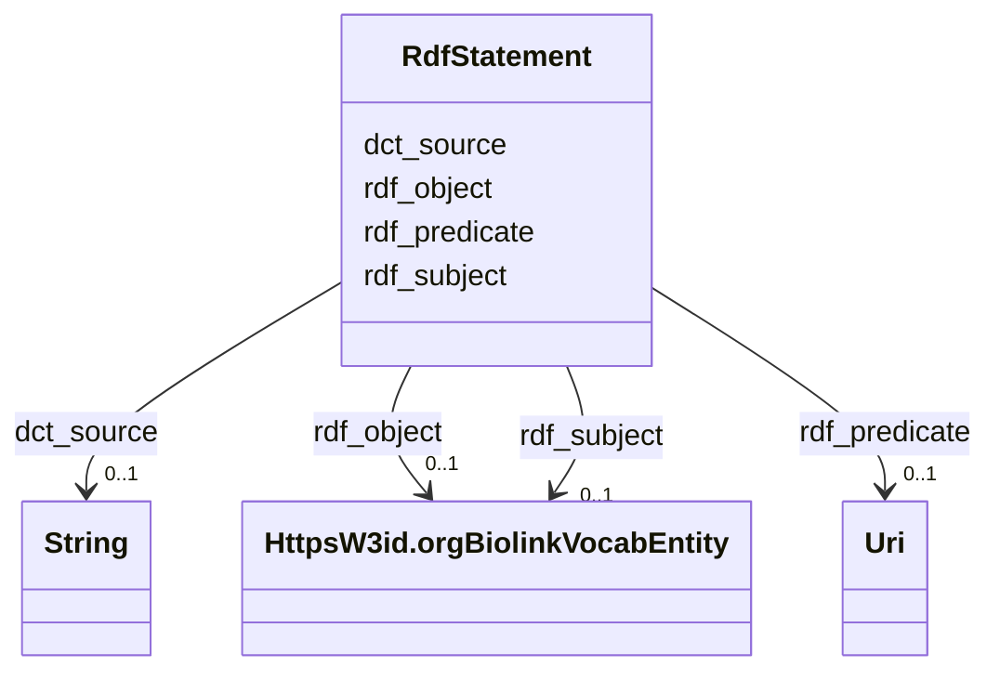

# Class: No class (type) name specified (rdf_Statement)


_No class (type) description specified_


This class occurs 18352179 times.


URI: [rdf:Statement](http://www.w3.org/1999/02/22-rdf-syntax-ns#Statement)





<!-- no inheritance hierarchy -->


## Slots

| Name | Cardinality and Range | Description | Inheritance | Occurrences |
| ---  | --- | --- | --- | --- |
| [rdf_subject](../slots/rdf_subject.md) | 0..1 <br/> [HttpsW3id.orgBiolinkVocabEntity](../classes/HttpsW3id.orgBiolinkVocabEntity.md) | No slot (predicate) description specified <br/>  | direct | 18352179 |
| [rdf_predicate](../slots/rdf_predicate.md) | 0..1 <br/> [xsd:anyURI](http://www.w3.org/2001/XMLSchema#anyURI) | No slot (predicate) description specified <br/>  | direct | 18352179 |
| [dct_source](../slots/dct_source.md) | 0..1 <br/> [xsd:string](http://www.w3.org/2001/XMLSchema#string) | No slot (predicate) description specified <br/>  | direct | 18352179 |
| [rdf_object](../slots/rdf_object.md) | 0..1 <br/> [HttpsW3id.orgBiolinkVocabEntity](../classes/HttpsW3id.orgBiolinkVocabEntity.md) | No slot (predicate) description specified <br/>  | direct | 18352179 |


## LinkML Source

<!-- TODO: investigate https://stackoverflow.com/questions/37606292/how-to-create-tabbed-code-blocks-in-mkdocs-or-sphinx -->

### Direct

<details>

```yaml
name: rdf_Statement
conforms_to: No schema conformance document specified
annotations:
  count:
    tag: count
    value: 18352179
description: No class (type) description specified
title: No class (type) name specified
from_schema: biohealth
rank: 1000
slots:
- rdf_subject
- rdf_predicate
- dct_source
- rdf_object
slot_usage:
  dct_source:
    name: dct_source
    annotations:
      string:
        tag: string
        value: 18352179
  rdf_object:
    name: rdf_object
    annotations:
      https___w3id.org_biolink_vocab_Entity:
        tag: https___w3id.org_biolink_vocab_Entity
        value: 18352179
  rdf_predicate:
    name: rdf_predicate
    annotations:
      uri:
        tag: uri
        value: 18352179
  rdf_subject:
    name: rdf_subject
    annotations:
      https___w3id.org_biolink_vocab_Entity:
        tag: https___w3id.org_biolink_vocab_Entity
        value: 18352179
class_uri: rdf:Statement

```
</details>

### Induced

<details>

```yaml
name: rdf_Statement
conforms_to: No schema conformance document specified
annotations:
  count:
    tag: count
    value: 18352179
description: No class (type) description specified
title: No class (type) name specified
from_schema: biohealth
rank: 1000
slot_usage:
  dct_source:
    name: dct_source
    annotations:
      string:
        tag: string
        value: 18352179
  rdf_object:
    name: rdf_object
    annotations:
      https___w3id.org_biolink_vocab_Entity:
        tag: https___w3id.org_biolink_vocab_Entity
        value: 18352179
  rdf_predicate:
    name: rdf_predicate
    annotations:
      uri:
        tag: uri
        value: 18352179
  rdf_subject:
    name: rdf_subject
    annotations:
      https___w3id.org_biolink_vocab_Entity:
        tag: https___w3id.org_biolink_vocab_Entity
        value: 18352179
attributes:
  rdf_subject:
    name: rdf_subject
    annotations:
      https___w3id.org_biolink_vocab_Entity:
        tag: https___w3id.org_biolink_vocab_Entity
        value: 18352179
    description: No slot (predicate) description specified
    examples:
    - object:
        example_object: http://linkedlifedata.com/resource/umls/id/C0250482
        example_object_type: https___w3id.org_biolink_vocab_Entity
        example_predicate: rdf:subject
        example_subject: https://biohealthkg.proto-okn.net/kg/relationship/0
        example_subject_type: rdf_Statement
    from_schema: biohealth
    rank: 1000
    slot_uri: rdf:subject
    alias: rdf_subject
    owner: rdf_Statement
    domain_of:
    - rdf_Statement
    range: https___w3id.org_biolink_vocab_Entity
  rdf_predicate:
    name: rdf_predicate
    annotations:
      uri:
        tag: uri
        value: 18352179
    description: No slot (predicate) description specified
    examples:
    - object:
        example_object: https://w3id.org/biolink/vocab/subclass_of
        example_object_type: uri
        example_predicate: rdf:predicate
        example_subject: https://biohealthkg.proto-okn.net/kg/relationship/0
        example_subject_type: rdf_Statement
    from_schema: biohealth
    rank: 1000
    slot_uri: rdf:predicate
    alias: rdf_predicate
    owner: rdf_Statement
    domain_of:
    - rdf_Statement
    range: uri
  dct_source:
    name: dct_source
    annotations:
      string:
        tag: string
        value: 18352179
    description: No slot (predicate) description specified
    examples:
    - object:
        example_object: MIMIC;PubMed
        example_object_type: string
        example_predicate: dct:source
        example_subject: https://biohealthkg.proto-okn.net/kg/relationship/0
        example_subject_type: rdf_Statement
    from_schema: biohealth
    rank: 1000
    slot_uri: dct:source
    alias: dct_source
    owner: rdf_Statement
    domain_of:
    - rdf_Statement
    range: string
  rdf_object:
    name: rdf_object
    annotations:
      https___w3id.org_biolink_vocab_Entity:
        tag: https___w3id.org_biolink_vocab_Entity
        value: 18352179
    description: No slot (predicate) description specified
    examples:
    - object:
        example_object: http://linkedlifedata.com/resource/umls/id/C0250480
        example_object_type: https___w3id.org_biolink_vocab_Entity
        example_predicate: rdf:object
        example_subject: https://biohealthkg.proto-okn.net/kg/relationship/0
        example_subject_type: rdf_Statement
    from_schema: biohealth
    rank: 1000
    slot_uri: rdf:object
    alias: rdf_object
    owner: rdf_Statement
    domain_of:
    - rdf_Statement
    range: https___w3id.org_biolink_vocab_Entity
class_uri: rdf:Statement

```
</details>