# TODO_Give_this_schema_a_name!

TODO -- tell the world what this schema describes.

URI: climatepub4-kg

Name: climatepub4-kg

## Schema Diagram

```mermaid
erDiagram
Any {

}
HsdoActivity {
    string skos_prefLabel  
    string skos_definition  
}
HsdoChronostratigraphicUnit {
    string skos_prefLabel  
    string skos_definition  
}
HsdoCmip6SourceId {
    string skos_prefLabel  
    string skos_definition  
}
HsdoDataFormat {
    string skos_prefLabel  
    string skos_definition  
}
HsdoDataset {
    string skos_prefLabel  
    string skos_definition  
}
HsdoExperiment {
    string attribute_tier  
    string skos_definition  
    string attribute_start_year  
    string attribute_experiment  
    string skos_prefLabel  
    string attribute_end_year  
}
HsdoFrequency {
    string skos_prefLabel  
    string skos_definition  
}
HsdoGridLabel {

}
HsdoHorizontalResolutionRange {
    string skos_prefLabel  
}
HsdoInstitution {
    string skos_prefLabel  
    string skos_definition  
}
HsdoInstrument {
    string skos_prefLabel  
    string skos_definition  
}
HsdoLicense {
    string skos_prefLabel  
    string skos_definition  
}
HsdoLocation {
    string skos_prefLabel  
    string skos_definition  
}
HsdoMeasurementName {
    string skos_prefLabel  
    string skos_definition  
}
HsdoMimeType {
    string skos_prefLabel  
    string skos_definition  
}
HsdoModel {
    string skos_prefLabel  
    string skos_definition  
}
HsdoModels {
    string skos_prefLabel  
    string skos_definition  
}
HsdoNominalResolution {
    string skos_prefLabel  
}
HsdoObs4MipsSourceId {

}
HsdoPlatform {
    string skos_prefLabel  
    string skos_definition  
}
HsdoProject {
    string skos_prefLabel  
    string skos_definition  
}
HsdoProvider {
    string skos_prefLabel  
    string skos_definition  
}
HsdoRealm {
    string skos_prefLabel  
}
HsdoRegion {

}
HsdoRelatedUrlContentType {
    string skos_prefLabel  
    string skos_definition  
}
HsdoScienceKeyword {
    string skos_prefLabel  
    string skos_definition  
}
HsdoSourceType {
    string skos_prefLabel  
    string skos_definition  
}
HsdoSubExperimentId {
    string skos_prefLabel  
    string skos_definition  
}
HsdoTemporalResolutionRange {
    string skos_prefLabel  
    string skos_definition  
}
HsdoVariable {
    string skos_prefLabel  
    string skos_definition  
}
HsdoVerticalResolutionRange {
    string skos_prefLabel  
}
HsdoPaper {
    string attribute_title  
    string attribute_authors  
    string attribute_pub_date  
    string attribute_doi  
}
SkosConcept {
    string skos_prefLabel  
    string skos_definition  
    uri skos_inScheme  
}

HsdoActivity ||--|o HsdoProject : "relation_HasProjectName"
HsdoActivity ||--|o Any : "relation_TargetsLocation"
HsdoActivity ||--|o Any : "relation_MeasuredAt"
HsdoActivity ||--|o Any : "relation_RunBy"
HsdoActivity ||--|o Any : "relation_ComparedTo"
HsdoActivity ||--|o Any : "relation_UsedIn"
HsdoActivity ||--|o Any : "skos_broader"
HsdoActivity ||--|o Any : "relation_ProvidedBy"
HsdoChronostratigraphicUnit ||--|o Any : "relation_TargetsLocation"
HsdoChronostratigraphicUnit ||--|o Any : "relation_MeasuredAt"
HsdoChronostratigraphicUnit ||--|o Any : "relation_ComparedTo"
HsdoChronostratigraphicUnit ||--|o Any : "relation_UsedIn"
HsdoChronostratigraphicUnit ||--|o Any : "skos_broader"
HsdoChronostratigraphicUnit ||--|o Any : "relation_RunBy"
HsdoCmip6SourceId ||--|o HsdoLicense : "relation_HasLicenseInfo"
HsdoCmip6SourceId ||--|o HsdoProject : "relation_HasProjectName"
HsdoCmip6SourceId ||--|o HsdoActivity : "relation_HasActivityParticipation"
HsdoCmip6SourceId ||--|o Any : "relation_HasModelComponent"
HsdoCmip6SourceId ||--|o Any : "relation_TargetsLocation"
HsdoCmip6SourceId ||--|o Any : "relation_RunBy"
HsdoCmip6SourceId ||--|o Any : "relation_Outputs"
HsdoCmip6SourceId ||--|o Any : "relation_UsedIn"
HsdoCmip6SourceId ||--|o Any : "relation_ComparedTo"
HsdoCmip6SourceId ||--|o HsdoInstitution : "relation_HasInstitution"
HsdoCmip6SourceId ||--|o Any : "skos_broader"
HsdoCmip6SourceId ||--|o Any : "relation_ValidatedBy"
HsdoCmip6SourceId ||--|o Any : "relation_ProvidedBy"
HsdoDataFormat ||--|o Any : "relation_TargetsLocation"
HsdoDataFormat ||--|o Any : "relation_MeasuredAt"
HsdoDataFormat ||--|o Any : "relation_Outputs"
HsdoDataFormat ||--|o Any : "relation_ComparedTo"
HsdoDataFormat ||--|o Any : "relation_UsedIn"
HsdoDataFormat ||--|o Any : "skos_broader"
HsdoDataFormat ||--|o Any : "relation_ProvidedBy"
HsdoDataset ||--|o Any : "relation_HasSourceType"
HsdoDataset ||--|o HsdoProject : "relation_HasProjectName"
HsdoDataset ||--|o Any : "relation_TargetsLocation"
HsdoDataset ||--|o Any : "relation_MeasuredAt"
HsdoDataset ||--|o Any : "relation_Outputs"
HsdoDataset ||--|o Any : "relation_ComparedTo"
HsdoDataset ||--|o Any : "relation_UsedIn"
HsdoDataset ||--|o HsdoInstitution : "relation_HasInstitution"
HsdoDataset ||--|o HsdoLocation : "relation_HasRegion"
HsdoDataset ||--|o Any : "skos_broader"
HsdoDataset ||--|o Any : "relation_ProvidedBy"
HsdoExperiment ||--|o HsdoActivity : "relation_HasParentActivity"
HsdoExperiment ||--|o Any : "relation_TargetsLocation"
HsdoExperiment ||--|o Any : "relation_ValidatedBy"
HsdoExperiment ||--|o Any : "relation_HasAdditionalAllowedModelComponents"
HsdoExperiment ||--|o Any : "relation_MeasuredAt"
HsdoExperiment ||--|o Any : "relation_Outputs"
HsdoExperiment ||--|o Any : "skos_broader"
HsdoExperiment ||--|o Any : "relation_RunBy"
HsdoExperiment ||--|o Any : "relation_UsedIn"
HsdoExperiment ||--|o Any : "relation_ComparedTo"
HsdoExperiment ||--|o HsdoExperiment : "relation_HasParentExperiment"
HsdoExperiment ||--|o Any : "relation_ProvidedBy"
HsdoExperiment ||--|o HsdoProject : "relation_HasProjectName"
HsdoExperiment ||--|o Any : "relation_MountedOn"
HsdoExperiment ||--|o HsdoActivity : "relation_HasActivity"
HsdoExperiment ||--|o Any : "relation_HasRequiredModelComponents"
HsdoFrequency ||--|o Any : "skos_broader"
HsdoFrequency ||--|o Any : "relation_MeasuredAt"
HsdoHorizontalResolutionRange ||--|o Any : "skos_broader"
HsdoHorizontalResolutionRange ||--|o Any : "relation_MeasuredAt"
HsdoInstitution ||--|o Any : "relation_TargetsLocation"
HsdoInstitution ||--|o Any : "relation_MeasuredAt"
HsdoInstitution ||--|o Any : "relation_Outputs"
HsdoInstitution ||--|o Any : "relation_ComparedTo"
HsdoInstitution ||--|o Any : "relation_UsedIn"
HsdoInstitution ||--|o Any : "skos_broader"
HsdoInstitution ||--|o Any : "relation_ValidatedBy"
HsdoInstitution ||--|o Any : "relation_ProvidedBy"
HsdoInstrument ||--|o HsdoProject : "relation_HasProjectName"
HsdoInstrument ||--|o Any : "relation_MountedOn"
HsdoInstrument ||--|o Any : "relation_TargetsLocation"
HsdoInstrument ||--|o Any : "relation_MeasuredAt"
HsdoInstrument ||--|o Any : "relation_RunBy"
HsdoInstrument ||--|o Any : "relation_Outputs"
HsdoInstrument ||--|o Any : "relation_ComparedTo"
HsdoInstrument ||--|o Any : "relation_UsedIn"
HsdoInstrument ||--|o Any : "skos_broader"
HsdoInstrument ||--|o Any : "relation_ValidatedBy"
HsdoInstrument ||--|o Any : "relation_ProvidedBy"
HsdoLicense ||--|o Any : "skos_broader"
HsdoLocation ||--|o HsdoProject : "relation_HasProjectName"
HsdoLocation ||--|o Any : "relation_MountedOn"
HsdoLocation ||--|o Any : "relation_TargetsLocation"
HsdoLocation ||--|o Any : "relation_MeasuredAt"
HsdoLocation ||--|o Any : "relation_RunBy"
HsdoLocation ||--|o Any : "relation_Outputs"
HsdoLocation ||--|o Any : "relation_ComparedTo"
HsdoLocation ||--|o Any : "relation_UsedIn"
HsdoLocation ||--|o Any : "skos_broader"
HsdoLocation ||--|o Any : "relation_ValidatedBy"
HsdoLocation ||--|o Any : "relation_ProvidedBy"
HsdoMeasurementName ||--|o Any : "relation_TargetsLocation"
HsdoMeasurementName ||--|o Any : "relation_MeasuredAt"
HsdoMeasurementName ||--|o Any : "relation_ComparedTo"
HsdoMeasurementName ||--|o Any : "relation_UsedIn"
HsdoMeasurementName ||--|o Any : "skos_broader"
HsdoMimeType ||--|o Any : "skos_broader"
HsdoModel ||--|o Any : "relation_ProvidedBy"
HsdoModel ||--|o HsdoProject : "relation_HasProjectName"
HsdoModel ||--|o Any : "relation_TargetsLocation"
HsdoModel ||--|o Any : "relation_MeasuredAt"
HsdoModel ||--|o Any : "relation_Outputs"
HsdoModel ||--|o Any : "relation_ComparedTo"
HsdoModel ||--|o Any : "relation_UsedIn"
HsdoModel ||--|o Any : "skos_broader"
HsdoModel ||--|o Any : "relation_ValidatedBy"
HsdoModel ||--|o Any : "relation_RunBy"
HsdoModels ||--|o HsdoProject : "relation_HasProjectName"
HsdoModels ||--|o Any : "relation_ProvidedBy"
HsdoModels ||--|o Any : "relation_TargetsLocation"
HsdoModels ||--|o Any : "relation_MeasuredAt"
HsdoModels ||--|o Any : "relation_Outputs"
HsdoModels ||--|o Any : "relation_ComparedTo"
HsdoModels ||--|o Any : "relation_UsedIn"
HsdoModels ||--|o Any : "skos_broader"
HsdoModels ||--|o Any : "relation_ValidatedBy"
HsdoModels ||--|o Any : "relation_RunBy"
HsdoNominalResolution ||--|o Any : "skos_broader"
HsdoPlatform ||--|o Any : "relation_MountedOn"
HsdoPlatform ||--|o Any : "relation_TargetsLocation"
HsdoPlatform ||--|o Any : "relation_MeasuredAt"
HsdoPlatform ||--|o Any : "relation_RunBy"
HsdoPlatform ||--|o Any : "relation_Outputs"
HsdoPlatform ||--|o Any : "relation_ComparedTo"
HsdoPlatform ||--|o Any : "relation_UsedIn"
HsdoPlatform ||--|o Any : "skos_broader"
HsdoPlatform ||--|o Any : "relation_ProvidedBy"
HsdoProject ||--|o HsdoProject : "relation_HasProjectName"
HsdoProject ||--|o Any : "relation_MountedOn"
HsdoProject ||--|o Any : "relation_TargetsLocation"
HsdoProject ||--|o Any : "relation_MeasuredAt"
HsdoProject ||--|o Any : "relation_RunBy"
HsdoProject ||--|o Any : "relation_Outputs"
HsdoProject ||--|o Any : "relation_ComparedTo"
HsdoProject ||--|o Any : "relation_UsedIn"
HsdoProject ||--|o Any : "skos_broader"
HsdoProject ||--|o Any : "relation_ValidatedBy"
HsdoProject ||--|o Any : "relation_ProvidedBy"
HsdoProvider ||--|o HsdoProject : "relation_HasProjectName"
HsdoProvider ||--|o Any : "relation_MountedOn"
HsdoProvider ||--|o Any : "relation_TargetsLocation"
HsdoProvider ||--|o Any : "relation_MeasuredAt"
HsdoProvider ||--|o Any : "relation_Outputs"
HsdoProvider ||--|o Any : "relation_ComparedTo"
HsdoProvider ||--|o Any : "relation_UsedIn"
HsdoProvider ||--|o Any : "skos_broader"
HsdoProvider ||--|o Any : "relation_ValidatedBy"
HsdoProvider ||--|o Any : "relation_ProvidedBy"
HsdoRealm ||--|o HsdoProject : "relation_HasProjectName"
HsdoRealm ||--|o Any : "skos_broader"
HsdoRelatedUrlContentType ||--|o Any : "relation_TargetsLocation"
HsdoRelatedUrlContentType ||--|o Any : "relation_MeasuredAt"
HsdoRelatedUrlContentType ||--|o Any : "relation_ComparedTo"
HsdoRelatedUrlContentType ||--|o Any : "relation_UsedIn"
HsdoRelatedUrlContentType ||--|o Any : "skos_broader"
HsdoScienceKeyword ||--|o Any : "relation_TargetsLocation"
HsdoScienceKeyword ||--|o Any : "relation_MeasuredAt"
HsdoScienceKeyword ||--|o Any : "relation_RunBy"
HsdoScienceKeyword ||--|o Any : "relation_Outputs"
HsdoScienceKeyword ||--|o Any : "relation_ComparedTo"
HsdoScienceKeyword ||--|o Any : "relation_UsedIn"
HsdoScienceKeyword ||--|o Any : "skos_broader"
HsdoScienceKeyword ||--|o Any : "relation_ProvidedBy"
HsdoSourceType ||--|o Any : "skos_broader"
HsdoSubExperimentId ||--|o Any : "relation_TargetsLocation"
HsdoSubExperimentId ||--|o Any : "relation_MeasuredAt"
HsdoSubExperimentId ||--|o Any : "relation_ComparedTo"
HsdoSubExperimentId ||--|o Any : "skos_broader"
HsdoTemporalResolutionRange ||--|o Any : "relation_TargetsLocation"
HsdoTemporalResolutionRange ||--|o Any : "relation_MeasuredAt"
HsdoTemporalResolutionRange ||--|o Any : "relation_UsedIn"
HsdoTemporalResolutionRange ||--|o Any : "skos_broader"
HsdoVariable ||--|o HsdoProject : "relation_HasProjectName"
HsdoVariable ||--|o Any : "relation_TargetsLocation"
HsdoVariable ||--|o Any : "relation_MeasuredAt"
HsdoVariable ||--|o Any : "relation_Outputs"
HsdoVariable ||--|o Any : "relation_ComparedTo"
HsdoVariable ||--|o Any : "relation_UsedIn"
HsdoVariable ||--|o Any : "skos_broader"
HsdoVariable ||--|o Any : "relation_ValidatedBy"
HsdoVariable ||--|o Any : "relation_ProvidedBy"
HsdoVerticalResolutionRange ||--|o Any : "skos_broader"
HsdoPaper ||--|o Any : "relation_Mention"
SkosConcept ||--|o SkosConcept : "skos_narrower"
SkosConcept ||--|o Any : "skos_broader"

```

## Classes

| Class | Description |
| --- | --- |
| [Any](classes/Any.md) | None |
| [HsdoActivity](classes/HsdoActivity.md) | TODO -- tell the world what this class (type) describes. |
| [HsdoChronostratigraphicUnit](classes/HsdoChronostratigraphicUnit.md) | TODO -- tell the world what this class (type) describes. |
| [HsdoCmip6SourceId](classes/HsdoCmip6SourceId.md) | TODO -- tell the world what this class (type) describes. |
| [HsdoDataFormat](classes/HsdoDataFormat.md) | TODO -- tell the world what this class (type) describes. |
| [HsdoDataset](classes/HsdoDataset.md) | A body of structured information describing some topic(s) of interest. |
| [HsdoExperiment](classes/HsdoExperiment.md) | TODO -- tell the world what this class (type) describes. |
| [HsdoFrequency](classes/HsdoFrequency.md) | TODO -- tell the world what this class (type) describes. |
| [HsdoGridLabel](classes/HsdoGridLabel.md) | TODO -- tell the world what this class (type) describes. |
| [HsdoHorizontalResolutionRange](classes/HsdoHorizontalResolutionRange.md) | TODO -- tell the world what this class (type) describes. |
| [HsdoInstitution](classes/HsdoInstitution.md) | TODO -- tell the world what this class (type) describes. |
| [HsdoInstrument](classes/HsdoInstrument.md) | TODO -- tell the world what this class (type) describes. |
| [HsdoLicense](classes/HsdoLicense.md) | TODO -- tell the world what this class (type) describes. |
| [HsdoLocation](classes/HsdoLocation.md) | TODO -- tell the world what this class (type) describes. |
| [HsdoMeasurementName](classes/HsdoMeasurementName.md) | TODO -- tell the world what this class (type) describes. |
| [HsdoMimeType](classes/HsdoMimeType.md) | TODO -- tell the world what this class (type) describes. |
| [HsdoModel](classes/HsdoModel.md) | TODO -- tell the world what this class (type) describes. |
| [HsdoModels](classes/HsdoModels.md) | TODO -- tell the world what this class (type) describes. |
| [HsdoNominalResolution](classes/HsdoNominalResolution.md) | TODO -- tell the world what this class (type) describes. |
| [HsdoObs4MipsSourceId](classes/HsdoObs4MipsSourceId.md) | TODO -- tell the world what this class (type) describes. |
| [HsdoPaper](classes/HsdoPaper.md) | TODO -- tell the world what this class (type) describes. |
| [HsdoPlatform](classes/HsdoPlatform.md) | TODO -- tell the world what this class (type) describes. |
| [HsdoProject](classes/HsdoProject.md) | An enterprise (potentially individual but typically collaborative), planned to achieve a particular aim.
Use properties from [[Organization]], [[subOrganization]]/[[parentOrganization]] to indicate project sub-structures. 
    |
| [HsdoProvider](classes/HsdoProvider.md) | TODO -- tell the world what this class (type) describes. |
| [HsdoRealm](classes/HsdoRealm.md) | TODO -- tell the world what this class (type) describes. |
| [HsdoRegion](classes/HsdoRegion.md) | TODO -- tell the world what this class (type) describes. |
| [HsdoRelatedUrlContentType](classes/HsdoRelatedUrlContentType.md) | TODO -- tell the world what this class (type) describes. |
| [HsdoScienceKeyword](classes/HsdoScienceKeyword.md) | TODO -- tell the world what this class (type) describes. |
| [HsdoSourceType](classes/HsdoSourceType.md) | TODO -- tell the world what this class (type) describes. |
| [HsdoSubExperimentId](classes/HsdoSubExperimentId.md) | TODO -- tell the world what this class (type) describes. |
| [HsdoTemporalResolutionRange](classes/HsdoTemporalResolutionRange.md) | TODO -- tell the world what this class (type) describes. |
| [HsdoVariable](classes/HsdoVariable.md) | TODO -- tell the world what this class (type) describes. |
| [HsdoVerticalResolutionRange](classes/HsdoVerticalResolutionRange.md) | TODO -- tell the world what this class (type) describes. |
| [SkosConcept](classes/SkosConcept.md) | TODO -- tell the world what this class (type) describes. |

## Slots

| Slot | Description |
| --- | --- |
| [attribute_authors](slots/attribute_authors.md) | TODO -- tell the world what this slot (predicate) describes |
| [attribute_doi](slots/attribute_doi.md) | TODO -- tell the world what this slot (predicate) describes |
| [attribute_end_year](slots/attribute_end_year.md) | TODO -- tell the world what this slot (predicate) describes |
| [attribute_experiment](slots/attribute_experiment.md) | TODO -- tell the world what this slot (predicate) describes |
| [attribute_pub_date](slots/attribute_pub_date.md) | TODO -- tell the world what this slot (predicate) describes |
| [attribute_start_year](slots/attribute_start_year.md) | TODO -- tell the world what this slot (predicate) describes |
| [attribute_tier](slots/attribute_tier.md) | TODO -- tell the world what this slot (predicate) describes |
| [attribute_title](slots/attribute_title.md) | TODO -- tell the world what this slot (predicate) describes |
| [example_ontology_definition](slots/example_ontology_definition.md) | TODO -- tell the world what this slot (predicate) describes |
| [example_ontology_id](slots/example_ontology_id.md) | TODO -- tell the world what this slot (predicate) describes |
| [example_ontology_path_id](slots/example_ontology_path_id.md) | TODO -- tell the world what this slot (predicate) describes |
| [example_ontology_path_label](slots/example_ontology_path_label.md) | TODO -- tell the world what this slot (predicate) describes |
| [example_ontology_prefLabel](slots/example_ontology_prefLabel.md) | TODO -- tell the world what this slot (predicate) describes |
| [example_ontology_reference](slots/example_ontology_reference.md) | TODO -- tell the world what this slot (predicate) describes |
| [example_ontology_tag](slots/example_ontology_tag.md) | TODO -- tell the world what this slot (predicate) describes |
| [relation_ComparedTo](slots/relation_ComparedTo.md) | TODO -- tell the world what this slot (predicate) describes |
| [relation_HasActivity](slots/relation_HasActivity.md) | TODO -- tell the world what this slot (predicate) describes |
| [relation_HasActivityParticipation](slots/relation_HasActivityParticipation.md) | TODO -- tell the world what this slot (predicate) describes |
| [relation_HasAdditionalAllowedModelComponents](slots/relation_HasAdditionalAllowedModelComponents.md) | TODO -- tell the world what this slot (predicate) describes |
| [relation_HasInstitution](slots/relation_HasInstitution.md) | TODO -- tell the world what this slot (predicate) describes |
| [relation_HasLicenseInfo](slots/relation_HasLicenseInfo.md) | TODO -- tell the world what this slot (predicate) describes |
| [relation_HasModelComponent](slots/relation_HasModelComponent.md) | TODO -- tell the world what this slot (predicate) describes |
| [relation_HasParentActivity](slots/relation_HasParentActivity.md) | TODO -- tell the world what this slot (predicate) describes |
| [relation_HasParentExperiment](slots/relation_HasParentExperiment.md) | TODO -- tell the world what this slot (predicate) describes |
| [relation_HasProjectName](slots/relation_HasProjectName.md) | TODO -- tell the world what this slot (predicate) describes |
| [relation_HasRegion](slots/relation_HasRegion.md) | TODO -- tell the world what this slot (predicate) describes |
| [relation_HasRequiredModelComponents](slots/relation_HasRequiredModelComponents.md) | TODO -- tell the world what this slot (predicate) describes |
| [relation_HasSourceType](slots/relation_HasSourceType.md) | TODO -- tell the world what this slot (predicate) describes |
| [relation_MeasuredAt](slots/relation_MeasuredAt.md) | TODO -- tell the world what this slot (predicate) describes |
| [relation_Mention](slots/relation_Mention.md) | TODO -- tell the world what this slot (predicate) describes |
| [relation_MountedOn](slots/relation_MountedOn.md) | TODO -- tell the world what this slot (predicate) describes |
| [relation_Outputs](slots/relation_Outputs.md) | TODO -- tell the world what this slot (predicate) describes |
| [relation_ProvidedBy](slots/relation_ProvidedBy.md) | TODO -- tell the world what this slot (predicate) describes |
| [relation_RunBy](slots/relation_RunBy.md) | TODO -- tell the world what this slot (predicate) describes |
| [relation_TargetsLocation](slots/relation_TargetsLocation.md) | TODO -- tell the world what this slot (predicate) describes |
| [relation_UsedIn](slots/relation_UsedIn.md) | TODO -- tell the world what this slot (predicate) describes |
| [relation_ValidatedBy](slots/relation_ValidatedBy.md) | TODO -- tell the world what this slot (predicate) describes |
| [skos_broader](slots/skos_broader.md) | TODO -- tell the world what this slot (predicate) describes |
| [skos_definition](slots/skos_definition.md) | TODO -- tell the world what this slot (predicate) describes |
| [skos_inScheme](slots/skos_inScheme.md) | TODO -- tell the world what this slot (predicate) describes |
| [skos_narrower](slots/skos_narrower.md) | TODO -- tell the world what this slot (predicate) describes |
| [skos_prefLabel](slots/skos_prefLabel.md) | TODO -- tell the world what this slot (predicate) describes |

## Enumerations

| Enumeration | Description |
| --- | --- |

## Types

| Type | Description |
| --- | --- |

## Subsets

| Subset | Description |
| --- | --- |
