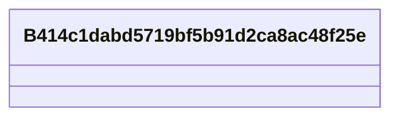

# Class: B414c1dabd5719bf5b91d2ca8ac48f25e


URI: [_:B414c1dabd5719bf5b91d2ca8ac48f25e](_:B414c1dabd5719bf5b91d2ca8ac48f25e)





<!-- no inheritance hierarchy -->


## Slots

| Name | Cardinality and Range | Description | Inheritance | Occurrences |
| ---  | --- | --- | --- | --- |


## LinkML Source

<!-- TODO: investigate https://stackoverflow.com/questions/37606292/how-to-create-tabbed-code-blocks-in-mkdocs-or-sphinx -->

### Direct

<details>

```yaml
name: __B414c1dabd5719bf5b91d2ca8ac48f25e
from_schema: okns:climatepub4-kg
rank: 1000
class_uri: _:B414c1dabd5719bf5b91d2ca8ac48f25e

```
</details>

### Induced

<details>

```yaml
name: __B414c1dabd5719bf5b91d2ca8ac48f25e
from_schema: okns:climatepub4-kg
rank: 1000
class_uri: _:B414c1dabd5719bf5b91d2ca8ac48f25e

```
</details>