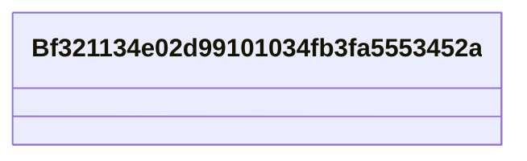

# Class: Bf321134e02d99101034fb3fa5553452a


URI: [_:Bf321134e02d99101034fb3fa5553452a](_:Bf321134e02d99101034fb3fa5553452a)





<!-- no inheritance hierarchy -->


## Slots

| Name | Cardinality and Range | Description | Inheritance | Occurrences |
| ---  | --- | --- | --- | --- |


## LinkML Source

<!-- TODO: investigate https://stackoverflow.com/questions/37606292/how-to-create-tabbed-code-blocks-in-mkdocs-or-sphinx -->

### Direct

<details>

```yaml
name: __Bf321134e02d99101034fb3fa5553452a
from_schema: okns:climatepub4-kg
rank: 1000
class_uri: _:Bf321134e02d99101034fb3fa5553452a

```
</details>

### Induced

<details>

```yaml
name: __Bf321134e02d99101034fb3fa5553452a
from_schema: okns:climatepub4-kg
rank: 1000
class_uri: _:Bf321134e02d99101034fb3fa5553452a

```
</details>