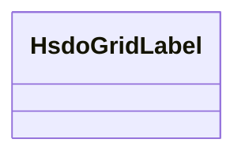

# Class: No class name specified (hsdo_Grid_Label)


_No class (type) description specified_


URI: [hsdo:Grid_Label](http://schema.org/Grid_Label)





<!-- no inheritance hierarchy -->


## Slots

| Name | Cardinality and Range | Description | Inheritance |
| ---  | --- | --- | --- |


## Examples

| Value |
| --- |
| https://climateKG.org/entity/a42a0f2b-365b-42a9-b285-cf549596188d |


## Identifier and Mapping Information


### Schema Source


* from schema: climatepub4-kg


## Mappings

| Mapping Type | Mapped Value |
| ---  | ---  |
| self | hsdo:Grid_Label |
| native | climatepub4-kg/:HsdoGridLabel |


## LinkML Source

<!-- TODO: investigate https://stackoverflow.com/questions/37606292/how-to-create-tabbed-code-blocks-in-mkdocs-or-sphinx -->

### Direct

<details>
```yaml
name: hsdo_Grid_Label
conforms_to: No schema conformance document specified
description: No class (type) description specified
title: No class name specified
notes:
- Class with 45 occurrences.
examples:
- value: https://climateKG.org/entity/a42a0f2b-365b-42a9-b285-cf549596188d
from_schema: climatepub4-kg
rank: 1000
class_uri: hsdo:Grid_Label

```
</details>

### Induced

<details>
```yaml
name: hsdo_Grid_Label
conforms_to: No schema conformance document specified
description: No class (type) description specified
title: No class name specified
notes:
- Class with 45 occurrences.
examples:
- value: https://climateKG.org/entity/a42a0f2b-365b-42a9-b285-cf549596188d
from_schema: climatepub4-kg
rank: 1000
class_uri: hsdo:Grid_Label

```
</details>