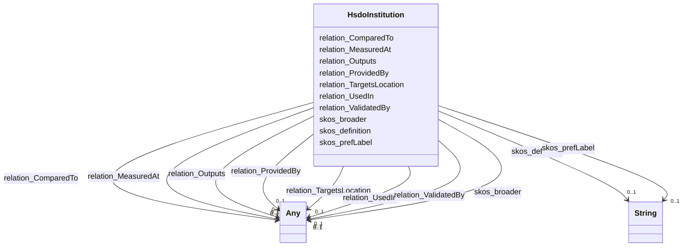

# Class: No class name specified (hsdo_Institution)


_No class (type) description specified_


URI: [hsdo:Institution](http://schema.org/Institution)





<!-- no inheritance hierarchy -->


## Slots

| Name | Cardinality and Range | Description | Inheritance |
| ---  | --- | --- | --- |
| [skos_definition](../slots/skos_definition.md) | 0..1 <br/> [xsd:string](xsd:string) | No slot (predicate) description specified <br/> 368 occurrences with subject type hsdo_Location and object type string.<br/>2792 occurrences with subject type hsdo_Science_Keyword and object type string.<br/>1114 occurrences with subject type hsdo_Platform and object type string.<br/>24 occurrences with subject type hsdo_Activity and object type string.<br/>141 occurrences with subject type hsdo_Model and object type string.<br/>422 occurrences with subject type hsdo_Experiment and object type string.<br/>3483 occurrences with subject type hsdo_Provider and object type string.<br/>1913 occurrences with subject type hsdo_Instrument and object type string.<br/>1560 occurrences with subject type hsdo_Project and object type string.<br/>168 occurrences with subject type hsdo_Chronostratigraphic_Unit and object type string.<br/>93 occurrences with subject type hsdo_Measurement_Name and object type string.<br/>75 occurrences with subject type hsdo_Institution and object type string.<br/>54 occurrences with subject type hsdo_Sub_Experiment_Id and object type string.<br/>37 occurrences with subject type hsdo_Models and object type string.<br/>187 occurrences with subject type hsdo_Data_Format and object type string.<br/>1280 occurrences with subject type hsdo_Variable and object type string.<br/>134 occurrences with subject type hsdo_Cmip6_Source_Id and object type string.<br/>5 occurrences with subject type hsdo_Source_Type and object type string.<br/>106 occurrences with subject type hsdo_Dataset and object type string.<br/>68 occurrences with subject type hsdo_Related_Url_Content_Type and object type string.<br/>16 occurrences with subject type hsdo_Frequency and object type string.<br/>4 occurrences with subject type hsdo_License and object type string.<br/>1 occurrences with subject type hsdo_Temporal_Resolution_Range and object type string.<br/>16359 occurrences with subject type skos_Concept and object type string.<br/>32 occurrences with subject type hsdo_Mime_Type and object type string. | direct |
| [relation_Outputs](../slots/relation_Outputs.md) | 0..1 <br/> [HsdoMeasurementName](../classes/HsdoMeasurementName.md)&nbsp;or&nbsp;<br />[HsdoVariable](../classes/HsdoVariable.md)&nbsp;or&nbsp;<br />[HsdoModels](../classes/HsdoModels.md)&nbsp;or&nbsp;<br />[HsdoProvider](../classes/HsdoProvider.md)&nbsp;or&nbsp;<br />[HsdoLocation](../classes/HsdoLocation.md)&nbsp;or&nbsp;<br />[HsdoProject](../classes/HsdoProject.md)&nbsp;or&nbsp;<br />[HsdoModel](../classes/HsdoModel.md)&nbsp;or&nbsp;<br />[HsdoInstitution](../classes/HsdoInstitution.md)&nbsp;or&nbsp;<br />[HsdoActivity](../classes/HsdoActivity.md)&nbsp;or&nbsp;<br />[HsdoDataset](../classes/HsdoDataset.md)&nbsp;or&nbsp;<br />[HsdoRelatedUrlContentType](../classes/HsdoRelatedUrlContentType.md)&nbsp;or&nbsp;<br />[HsdoDataFormat](../classes/HsdoDataFormat.md)&nbsp;or&nbsp;<br />[HsdoInstrument](../classes/HsdoInstrument.md)&nbsp;or&nbsp;<br />[HsdoPlatform](../classes/HsdoPlatform.md)&nbsp;or&nbsp;<br />[HsdoScienceKeyword](../classes/HsdoScienceKeyword.md)&nbsp;or&nbsp;<br />[HsdoExperiment](../classes/HsdoExperiment.md) | No slot (predicate) description specified <br/> 10 occurrences with subject type hsdo_Model and object type hsdo_Variable.<br/>6 occurrences with subject type hsdo_Model and object type hsdo_Instrument.<br/>62 occurrences with subject type hsdo_Models and object type hsdo_Variable.<br/>6 occurrences with subject type hsdo_Instrument and object type hsdo_Model.<br/>10 occurrences with subject type hsdo_Experiment and object type hsdo_Instrument.<br/>1 occurrences with subject type hsdo_Experiment and object type hsdo_Platform.<br/>2 occurrences with subject type hsdo_Science_Keyword and object type hsdo_Model.<br/>11 occurrences with subject type hsdo_Instrument and object type hsdo_Instrument.<br/>10 occurrences with subject type hsdo_Instrument and object type hsdo_Experiment.<br/>8 occurrences with subject type hsdo_Science_Keyword and object type hsdo_Science_Keyword.<br/>4 occurrences with subject type hsdo_Experiment and object type hsdo_Project.<br/>1 occurrences with subject type hsdo_Provider and object type hsdo_Project.<br/>3 occurrences with subject type hsdo_Science_Keyword and object type hsdo_Location.<br/>2 occurrences with subject type hsdo_Models and object type hsdo_Project.<br/>1 occurrences with subject type hsdo_Experiment and object type hsdo_Models.<br/>4 occurrences with subject type hsdo_Model and object type hsdo_Model.<br/>3 occurrences with subject type hsdo_Location and object type hsdo_Science_Keyword.<br/>1 occurrences with subject type hsdo_Variable and object type hsdo_Activity.<br/>4 occurrences with subject type hsdo_Models and object type hsdo_Provider.<br/>3 occurrences with subject type hsdo_Models and object type hsdo_Platform.<br/>2 occurrences with subject type hsdo_Model and object type hsdo_Project.<br/>2 occurrences with subject type hsdo_Provider and object type hsdo_Models.<br/>4 occurrences with subject type hsdo_Instrument and object type hsdo_Science_Keyword.<br/>4 occurrences with subject type hsdo_Instrument and object type hsdo_Provider.<br/>2 occurrences with subject type hsdo_Dataset and object type hsdo_Science_Keyword.<br/>1 occurrences with subject type hsdo_Dataset and object type hsdo_Instrument.<br/>4 occurrences with subject type hsdo_Location and object type hsdo_Instrument.<br/>4 occurrences with subject type hsdo_Science_Keyword and object type hsdo_Experiment.<br/>3 occurrences with subject type hsdo_Project and object type hsdo_Platform.<br/>4 occurrences with subject type hsdo_Project and object type hsdo_Science_Keyword.<br/>3 occurrences with subject type hsdo_Project and object type hsdo_Project.<br/>4 occurrences with subject type hsdo_Project and object type hsdo_Experiment.<br/>5 occurrences with subject type hsdo_Science_Keyword and object type hsdo_Instrument.<br/>4 occurrences with subject type hsdo_Experiment and object type hsdo_Variable.<br/>2 occurrences with subject type hsdo_Variable and object type hsdo_Location.<br/>2 occurrences with subject type hsdo_Variable and object type hsdo_Science_Keyword.<br/>1 occurrences with subject type hsdo_Variable and object type hsdo_Instrument.<br/>1 occurrences with subject type hsdo_Variable and object type hsdo_Measurement_Name.<br/>7 occurrences with subject type hsdo_Project and object type hsdo_Instrument.<br/>1 occurrences with subject type hsdo_Data_Format and object type hsdo_Instrument.<br/>5 occurrences with subject type hsdo_Instrument and object type hsdo_Variable.<br/>5 occurrences with subject type hsdo_Models and object type hsdo_Instrument.<br/>2 occurrences with subject type hsdo_Models and object type hsdo_Science_Keyword.<br/>1 occurrences with subject type hsdo_Models and object type hsdo_Model.<br/>3 occurrences with subject type hsdo_Platform and object type hsdo_Experiment.<br/>11 occurrences with subject type hsdo_Experiment and object type hsdo_Science_Keyword.<br/>5 occurrences with subject type hsdo_Instrument and object type hsdo_Project.<br/>9 occurrences with subject type hsdo_Instrument and object type hsdo_Location.<br/>1 occurrences with subject type hsdo_Institution and object type hsdo_Provider.<br/>8 occurrences with subject type hsdo_Location and object type hsdo_Location.<br/>1 occurrences with subject type hsdo_Location and object type hsdo_Experiment.<br/>7 occurrences with subject type hsdo_Experiment and object type hsdo_Experiment.<br/>3 occurrences with subject type hsdo_Experiment and object type hsdo_Model.<br/>1 occurrences with subject type hsdo_Platform and object type hsdo_Data_Format.<br/>2 occurrences with subject type hsdo_Project and object type hsdo_Model.<br/>8 occurrences with subject type hsdo_Model and object type hsdo_Experiment.<br/>1 occurrences with subject type hsdo_Variable and object type hsdo_Dataset.<br/>2 occurrences with subject type hsdo_Models and object type hsdo_Experiment.<br/>2 occurrences with subject type hsdo_Platform and object type hsdo_Location.<br/>1 occurrences with subject type hsdo_Science_Keyword and object type hsdo_Measurement_Name.<br/>1 occurrences with subject type hsdo_Experiment and object type hsdo_Location.<br/>1 occurrences with subject type hsdo_Platform and object type hsdo_Instrument.<br/>2 occurrences with subject type hsdo_Location and object type hsdo_Model.<br/>7 occurrences with subject type hsdo_Model and object type hsdo_Science_Keyword.<br/>1 occurrences with subject type hsdo_Model and object type hsdo_Location.<br/>2 occurrences with subject type hsdo_Model and object type hsdo_Models.<br/>2 occurrences with subject type hsdo_Model and object type hsdo_Measurement_Name.<br/>1 occurrences with subject type hsdo_Location and object type hsdo_Measurement_Name.<br/>1 occurrences with subject type hsdo_Model and object type hsdo_Platform.<br/>3 occurrences with subject type hsdo_Project and object type hsdo_Variable.<br/>2 occurrences with subject type hsdo_Location and object type hsdo_Variable.<br/>2 occurrences with subject type hsdo_Location and object type hsdo_Related_Url_Content_Type.<br/>1 occurrences with subject type hsdo_Instrument and object type hsdo_Institution.<br/>1 occurrences with subject type hsdo_Experiment and object type hsdo_Related_Url_Content_Type.<br/>1 occurrences with subject type hsdo_Platform and object type hsdo_Models.<br/>1 occurrences with subject type hsdo_Variable and object type hsdo_Project.<br/>2 occurrences with subject type hsdo_Instrument and object type hsdo_Platform.<br/>3 occurrences with subject type hsdo_Models and object type hsdo_Location.<br/>1 occurrences with subject type hsdo_Model and object type hsdo_Activity.<br/>1 occurrences with subject type hsdo_Dataset and object type hsdo_Experiment.<br/>1 occurrences with subject type hsdo_Science_Keyword and object type hsdo_Project.<br/>4 occurrences with subject type hsdo_Cmip6_Source_Id and object type hsdo_Variable.<br/>1 occurrences with subject type hsdo_Cmip6_Source_Id and object type hsdo_Provider.<br/>1 occurrences with subject type hsdo_Institution and object type hsdo_Variable.<br/>1 occurrences with subject type hsdo_Platform and object type hsdo_Science_Keyword.<br/>1 occurrences with subject type hsdo_Project and object type hsdo_Provider.<br/>2 occurrences with subject type hsdo_Project and object type hsdo_Location.<br/>1 occurrences with subject type hsdo_Models and object type hsdo_Data_Format. | direct |
| [relation_TargetsLocation](../slots/relation_TargetsLocation.md) | 0..1 <br/> [HsdoScienceKeyword](../classes/HsdoScienceKeyword.md)&nbsp;or&nbsp;<br />[HsdoPlatform](../classes/HsdoPlatform.md)&nbsp;or&nbsp;<br />[HsdoMeasurementName](../classes/HsdoMeasurementName.md)&nbsp;or&nbsp;<br />[HsdoVariable](../classes/HsdoVariable.md)&nbsp;or&nbsp;<br />[HsdoProvider](../classes/HsdoProvider.md)&nbsp;or&nbsp;<br />[HsdoFrequency](../classes/HsdoFrequency.md)&nbsp;or&nbsp;<br />[HsdoChronostratigraphicUnit](../classes/HsdoChronostratigraphicUnit.md)&nbsp;or&nbsp;<br />[HsdoTemporalResolutionRange](../classes/HsdoTemporalResolutionRange.md)&nbsp;or&nbsp;<br />[HsdoProject](../classes/HsdoProject.md)&nbsp;or&nbsp;<br />[HsdoModel](../classes/HsdoModel.md)&nbsp;or&nbsp;<br />[HsdoInstitution](../classes/HsdoInstitution.md)&nbsp;or&nbsp;<br />[HsdoActivity](../classes/HsdoActivity.md)&nbsp;or&nbsp;<br />[HsdoRelatedUrlContentType](../classes/HsdoRelatedUrlContentType.md)&nbsp;or&nbsp;<br />[HsdoDataFormat](../classes/HsdoDataFormat.md)&nbsp;or&nbsp;<br />[HsdoInstrument](../classes/HsdoInstrument.md)&nbsp;or&nbsp;<br />[HsdoModels](../classes/HsdoModels.md)&nbsp;or&nbsp;<br />[HsdoLocation](../classes/HsdoLocation.md)&nbsp;or&nbsp;<br />[HsdoExperiment](../classes/HsdoExperiment.md) | No slot (predicate) description specified <br/> 198 occurrences with subject type hsdo_Location and object type hsdo_Instrument.<br/>34 occurrences with subject type hsdo_Location and object type hsdo_Models.<br/>5 occurrences with subject type hsdo_Science_Keyword and object type hsdo_Provider.<br/>38 occurrences with subject type hsdo_Science_Keyword and object type hsdo_Location.<br/>159 occurrences with subject type hsdo_Model and object type hsdo_Location.<br/>11 occurrences with subject type hsdo_Model and object type hsdo_Science_Keyword.<br/>50 occurrences with subject type hsdo_Model and object type hsdo_Instrument.<br/>11 occurrences with subject type hsdo_Model and object type hsdo_Model.<br/>217 occurrences with subject type hsdo_Experiment and object type hsdo_Location.<br/>6 occurrences with subject type hsdo_Experiment and object type hsdo_Platform.<br/>17 occurrences with subject type hsdo_Experiment and object type hsdo_Science_Keyword.<br/>64 occurrences with subject type hsdo_Experiment and object type hsdo_Instrument.<br/>153 occurrences with subject type hsdo_Location and object type hsdo_Experiment.<br/>680 occurrences with subject type hsdo_Location and object type hsdo_Location.<br/>13 occurrences with subject type hsdo_Location and object type hsdo_Provider.<br/>82 occurrences with subject type hsdo_Project and object type hsdo_Location.<br/>12 occurrences with subject type hsdo_Project and object type hsdo_Experiment.<br/>140 occurrences with subject type hsdo_Models and object type hsdo_Location.<br/>30 occurrences with subject type hsdo_Models and object type hsdo_Instrument.<br/>8 occurrences with subject type hsdo_Models and object type hsdo_Variable.<br/>257 occurrences with subject type hsdo_Instrument and object type hsdo_Location.<br/>45 occurrences with subject type hsdo_Instrument and object type hsdo_Experiment.<br/>98 occurrences with subject type hsdo_Instrument and object type hsdo_Instrument.<br/>18 occurrences with subject type hsdo_Instrument and object type hsdo_Science_Keyword.<br/>7 occurrences with subject type hsdo_Instrument and object type hsdo_Models.<br/>27 occurrences with subject type hsdo_Location and object type hsdo_Science_Keyword.<br/>17 occurrences with subject type hsdo_Instrument and object type hsdo_Model.<br/>1 occurrences with subject type hsdo_Models and object type hsdo_Platform.<br/>13 occurrences with subject type hsdo_Models and object type hsdo_Experiment.<br/>1 occurrences with subject type hsdo_Models and object type hsdo_Models.<br/>7 occurrences with subject type hsdo_Models and object type hsdo_Chronostratigraphic_Unit.<br/>2 occurrences with subject type hsdo_Data_Format and object type hsdo_Instrument.<br/>5 occurrences with subject type hsdo_Experiment and object type hsdo_Chronostratigraphic_Unit.<br/>18 occurrences with subject type hsdo_Model and object type hsdo_Experiment.<br/>54 occurrences with subject type hsdo_Experiment and object type hsdo_Experiment.<br/>49 occurrences with subject type hsdo_Location and object type hsdo_Model.<br/>5 occurrences with subject type hsdo_Activity and object type hsdo_Location.<br/>21 occurrences with subject type hsdo_Science_Keyword and object type hsdo_Experiment.<br/>42 occurrences with subject type hsdo_Location and object type hsdo_Project.<br/>7 occurrences with subject type hsdo_Platform and object type hsdo_Experiment.<br/>7 occurrences with subject type hsdo_Location and object type hsdo_Activity.<br/>7 occurrences with subject type hsdo_Location and object type hsdo_Institution.<br/>9 occurrences with subject type hsdo_Platform and object type hsdo_Instrument.<br/>4 occurrences with subject type hsdo_Model and object type hsdo_Measurement_Name.<br/>35 occurrences with subject type hsdo_Provider and object type hsdo_Location.<br/>26 occurrences with subject type hsdo_Cmip6_Source_Id and object type hsdo_Location.<br/>2 occurrences with subject type hsdo_Location and object type hsdo_Platform.<br/>4 occurrences with subject type hsdo_Chronostratigraphic_Unit and object type hsdo_Chronostratigraphic_Unit.<br/>1 occurrences with subject type hsdo_Chronostratigraphic_Unit and object type hsdo_Experiment.<br/>9 occurrences with subject type hsdo_Model and object type hsdo_Chronostratigraphic_Unit.<br/>7 occurrences with subject type hsdo_Science_Keyword and object type hsdo_Science_Keyword.<br/>2 occurrences with subject type hsdo_Variable and object type hsdo_Model.<br/>2 occurrences with subject type hsdo_Variable and object type hsdo_Instrument.<br/>17 occurrences with subject type hsdo_Project and object type hsdo_Instrument.<br/>8 occurrences with subject type hsdo_Instrument and object type hsdo_Project.<br/>1 occurrences with subject type hsdo_Variable and object type hsdo_Science_Keyword.<br/>5 occurrences with subject type hsdo_Measurement_Name and object type hsdo_Location.<br/>8 occurrences with subject type hsdo_Provider and object type hsdo_Instrument.<br/>4 occurrences with subject type hsdo_Models and object type hsdo_Provider.<br/>26 occurrences with subject type hsdo_Science_Keyword and object type hsdo_Instrument.<br/>6 occurrences with subject type hsdo_Experiment and object type hsdo_Measurement_Name.<br/>7 occurrences with subject type hsdo_Instrument and object type hsdo_Chronostratigraphic_Unit.<br/>6 occurrences with subject type hsdo_Dataset and object type hsdo_Location.<br/>1 occurrences with subject type hsdo_Dataset and object type hsdo_Instrument.<br/>3 occurrences with subject type hsdo_Model and object type hsdo_Models.<br/>3 occurrences with subject type hsdo_Project and object type hsdo_Variable.<br/>1 occurrences with subject type hsdo_Location and object type hsdo_Variable.<br/>6 occurrences with subject type hsdo_Science_Keyword and object type hsdo_Models.<br/>1 occurrences with subject type hsdo_Data_Format and object type hsdo_Science_Keyword.<br/>5 occurrences with subject type hsdo_Science_Keyword and object type hsdo_Chronostratigraphic_Unit.<br/>36 occurrences with subject type hsdo_Location and object type hsdo_Chronostratigraphic_Unit.<br/>5 occurrences with subject type hsdo_Variable and object type hsdo_Location.<br/>1 occurrences with subject type hsdo_Variable and object type hsdo_Variable.<br/>1 occurrences with subject type hsdo_Variable and object type hsdo_Models.<br/>1 occurrences with subject type hsdo_Variable and object type hsdo_Experiment.<br/>6 occurrences with subject type hsdo_Science_Keyword and object type hsdo_Model.<br/>9 occurrences with subject type hsdo_Chronostratigraphic_Unit and object type hsdo_Location.<br/>4 occurrences with subject type hsdo_Instrument and object type hsdo_Provider.<br/>1 occurrences with subject type hsdo_Models and object type hsdo_Science_Keyword.<br/>22 occurrences with subject type hsdo_Platform and object type hsdo_Location.<br/>1 occurrences with subject type hsdo_Platform and object type hsdo_Project.<br/>3 occurrences with subject type hsdo_Platform and object type hsdo_Model.<br/>2 occurrences with subject type hsdo_Platform and object type hsdo_Chronostratigraphic_Unit.<br/>1 occurrences with subject type hsdo_Platform and object type hsdo_Models.<br/>10 occurrences with subject type hsdo_Provider and object type hsdo_Experiment.<br/>12 occurrences with subject type hsdo_Institution and object type hsdo_Location.<br/>3 occurrences with subject type hsdo_Science_Keyword and object type hsdo_Measurement_Name.<br/>1 occurrences with subject type hsdo_Provider and object type hsdo_Measurement_Name.<br/>11 occurrences with subject type hsdo_Experiment and object type hsdo_Model.<br/>1 occurrences with subject type hsdo_Institution and object type hsdo_Instrument.<br/>5 occurrences with subject type hsdo_Project and object type hsdo_Science_Keyword.<br/>1 occurrences with subject type hsdo_Sub_Experiment_Id and object type hsdo_Location.<br/>1 occurrences with subject type hsdo_Provider and object type hsdo_Science_Keyword.<br/>1 occurrences with subject type hsdo_Related_Url_Content_Type and object type hsdo_Experiment.<br/>2 occurrences with subject type hsdo_Related_Url_Content_Type and object type hsdo_Location.<br/>6 occurrences with subject type hsdo_Location and object type hsdo_Data_Format.<br/>1 occurrences with subject type hsdo_Models and object type hsdo_Measurement_Name.<br/>1 occurrences with subject type hsdo_Activity and object type hsdo_Experiment.<br/>2 occurrences with subject type hsdo_Platform and object type hsdo_Science_Keyword.<br/>6 occurrences with subject type hsdo_Chronostratigraphic_Unit and object type hsdo_Instrument.<br/>3 occurrences with subject type hsdo_Experiment and object type hsdo_Variable.<br/>2 occurrences with subject type hsdo_Science_Keyword and object type hsdo_Platform.<br/>2 occurrences with subject type hsdo_Project and object type hsdo_Model.<br/>1 occurrences with subject type hsdo_Project and object type hsdo_Measurement_Name.<br/>2 occurrences with subject type hsdo_Chronostratigraphic_Unit and object type hsdo_Model.<br/>8 occurrences with subject type hsdo_Experiment and object type hsdo_Provider.<br/>1 occurrences with subject type hsdo_Temporal_Resolution_Range and object type hsdo_Location.<br/>1 occurrences with subject type hsdo_Temporal_Resolution_Range and object type hsdo_Experiment.<br/>1 occurrences with subject type hsdo_Temporal_Resolution_Range and object type hsdo_Instrument.<br/>5 occurrences with subject type hsdo_Experiment and object type hsdo_Project.<br/>2 occurrences with subject type hsdo_Model and object type hsdo_Variable.<br/>2 occurrences with subject type hsdo_Model and object type hsdo_Provider.<br/>3 occurrences with subject type hsdo_Model and object type hsdo_Project.<br/>1 occurrences with subject type hsdo_Model and object type hsdo_Platform.<br/>1 occurrences with subject type hsdo_Model and object type hsdo_Data_Format.<br/>1 occurrences with subject type hsdo_Provider and object type hsdo_Provider.<br/>1 occurrences with subject type hsdo_Activity and object type hsdo_Instrument.<br/>1 occurrences with subject type hsdo_Activity and object type hsdo_Project.<br/>2 occurrences with subject type hsdo_Location and object type hsdo_Measurement_Name.<br/>1 occurrences with subject type hsdo_Provider and object type hsdo_Models.<br/>2 occurrences with subject type hsdo_Instrument and object type hsdo_Activity.<br/>2 occurrences with subject type hsdo_Project and object type hsdo_Chronostratigraphic_Unit.<br/>5 occurrences with subject type hsdo_Data_Format and object type hsdo_Location.<br/>1 occurrences with subject type hsdo_Experiment and object type hsdo_Related_Url_Content_Type.<br/>2 occurrences with subject type hsdo_Location and object type hsdo_Related_Url_Content_Type.<br/>1 occurrences with subject type hsdo_Instrument and object type hsdo_Temporal_Resolution_Range.<br/>3 occurrences with subject type hsdo_Instrument and object type hsdo_Measurement_Name.<br/>1 occurrences with subject type hsdo_Chronostratigraphic_Unit and object type hsdo_Models.<br/>2 occurrences with subject type hsdo_Measurement_Name and object type hsdo_Instrument.<br/>1 occurrences with subject type hsdo_Measurement_Name and object type hsdo_Experiment.<br/>1 occurrences with subject type hsdo_Activity and object type hsdo_Chronostratigraphic_Unit.<br/>1 occurrences with subject type hsdo_Instrument and object type hsdo_Variable.<br/>1 occurrences with subject type hsdo_Models and object type hsdo_Model.<br/>1 occurrences with subject type hsdo_Cmip6_Source_Id and object type hsdo_Experiment.<br/>1 occurrences with subject type hsdo_Model and object type hsdo_Temporal_Resolution_Range.<br/>1 occurrences with subject type hsdo_Chronostratigraphic_Unit and object type hsdo_Data_Format.<br/>1 occurrences with subject type hsdo_Measurement_Name and object type hsdo_Frequency.<br/>3 occurrences with subject type hsdo_Experiment and object type hsdo_Models.<br/>1 occurrences with subject type hsdo_Science_Keyword and object type hsdo_Activity.<br/>1 occurrences with subject type hsdo_Institution and object type hsdo_Provider.<br/>2 occurrences with subject type hsdo_Instrument and object type hsdo_Platform.<br/>1 occurrences with subject type hsdo_Cmip6_Source_Id and object type hsdo_Instrument.<br/>2 occurrences with subject type hsdo_Project and object type hsdo_Platform.<br/>1 occurrences with subject type hsdo_Project and object type hsdo_Models.<br/>2 occurrences with subject type hsdo_Project and object type hsdo_Provider.<br/>1 occurrences with subject type hsdo_Measurement_Name and object type hsdo_Related_Url_Content_Type. | direct |
| [relation_MeasuredAt](../slots/relation_MeasuredAt.md) | 0..1 <br/> [HsdoMeasurementName](../classes/HsdoMeasurementName.md)&nbsp;or&nbsp;<br />[HsdoProject](../classes/HsdoProject.md)&nbsp;or&nbsp;<br />[HsdoSubExperimentId](../classes/HsdoSubExperimentId.md)&nbsp;or&nbsp;<br />[HsdoActivity](../classes/HsdoActivity.md)&nbsp;or&nbsp;<br />[HsdoRelatedUrlContentType](../classes/HsdoRelatedUrlContentType.md)&nbsp;or&nbsp;<br />[HsdoModels](../classes/HsdoModels.md)&nbsp;or&nbsp;<br />[HsdoPlatform](../classes/HsdoPlatform.md)&nbsp;or&nbsp;<br />[HsdoCmip6SourceId](../classes/HsdoCmip6SourceId.md)&nbsp;or&nbsp;<br />[HsdoExperiment](../classes/HsdoExperiment.md)&nbsp;or&nbsp;<br />[HsdoVariable](../classes/HsdoVariable.md)&nbsp;or&nbsp;<br />[HsdoProvider](../classes/HsdoProvider.md)&nbsp;or&nbsp;<br />[HsdoModel](../classes/HsdoModel.md)&nbsp;or&nbsp;<br />[HsdoInstrument](../classes/HsdoInstrument.md)&nbsp;or&nbsp;<br />[HsdoLocation](../classes/HsdoLocation.md)&nbsp;or&nbsp;<br />[HsdoChronostratigraphicUnit](../classes/HsdoChronostratigraphicUnit.md)&nbsp;or&nbsp;<br />[HsdoTemporalResolutionRange](../classes/HsdoTemporalResolutionRange.md)&nbsp;or&nbsp;<br />[HsdoDataFormat](../classes/HsdoDataFormat.md)&nbsp;or&nbsp;<br />[HsdoScienceKeyword](../classes/HsdoScienceKeyword.md)&nbsp;or&nbsp;<br />[HsdoDataset](../classes/HsdoDataset.md) | No slot (predicate) description specified <br/> 542 occurrences with subject type hsdo_Location and object type hsdo_Location.<br/>71 occurrences with subject type hsdo_Science_Keyword and object type hsdo_Science_Keyword.<br/>150 occurrences with subject type hsdo_Science_Keyword and object type hsdo_Instrument.<br/>240 occurrences with subject type hsdo_Science_Keyword and object type hsdo_Location.<br/>76 occurrences with subject type hsdo_Science_Keyword and object type hsdo_Experiment.<br/>10 occurrences with subject type hsdo_Science_Keyword and object type hsdo_Platform.<br/>43 occurrences with subject type hsdo_Experiment and object type hsdo_Science_Keyword.<br/>128 occurrences with subject type hsdo_Experiment and object type hsdo_Location.<br/>73 occurrences with subject type hsdo_Experiment and object type hsdo_Instrument.<br/>49 occurrences with subject type hsdo_Experiment and object type hsdo_Experiment.<br/>9 occurrences with subject type hsdo_Experiment and object type hsdo_Model.<br/>108 occurrences with subject type hsdo_Location and object type hsdo_Experiment.<br/>44 occurrences with subject type hsdo_Project and object type hsdo_Location.<br/>20 occurrences with subject type hsdo_Project and object type hsdo_Experiment.<br/>349 occurrences with subject type hsdo_Instrument and object type hsdo_Location.<br/>10 occurrences with subject type hsdo_Science_Keyword and object type hsdo_Provider.<br/>4 occurrences with subject type hsdo_Project and object type hsdo_Project.<br/>15 occurrences with subject type hsdo_Model and object type hsdo_Science_Keyword.<br/>41 occurrences with subject type hsdo_Model and object type hsdo_Location.<br/>15 occurrences with subject type hsdo_Model and object type hsdo_Experiment.<br/>27 occurrences with subject type hsdo_Model and object type hsdo_Instrument.<br/>178 occurrences with subject type hsdo_Instrument and object type hsdo_Instrument.<br/>14 occurrences with subject type hsdo_Instrument and object type hsdo_Model.<br/>15 occurrences with subject type hsdo_Location and object type hsdo_Measurement_Name.<br/>223 occurrences with subject type hsdo_Location and object type hsdo_Instrument.<br/>64 occurrences with subject type hsdo_Location and object type hsdo_Science_Keyword.<br/>9 occurrences with subject type hsdo_Instrument and object type hsdo_Platform.<br/>17 occurrences with subject type hsdo_Instrument and object type hsdo_Provider.<br/>15 occurrences with subject type hsdo_Instrument and object type hsdo_Measurement_Name.<br/>91 occurrences with subject type hsdo_Instrument and object type hsdo_Experiment.<br/>5 occurrences with subject type hsdo_Project and object type hsdo_Model.<br/>16 occurrences with subject type hsdo_Science_Keyword and object type hsdo_Model.<br/>93 occurrences with subject type hsdo_Instrument and object type hsdo_Science_Keyword.<br/>2 occurrences with subject type hsdo_Models and object type hsdo_Chronostratigraphic_Unit.<br/>8 occurrences with subject type hsdo_Models and object type hsdo_Instrument.<br/>1 occurrences with subject type hsdo_Models and object type hsdo_Project.<br/>13 occurrences with subject type hsdo_Project and object type hsdo_Science_Keyword.<br/>1 occurrences with subject type hsdo_Experiment and object type hsdo_Activity.<br/>10 occurrences with subject type hsdo_Location and object type hsdo_Data_Format.<br/>61 occurrences with subject type hsdo_Provider and object type hsdo_Location.<br/>11 occurrences with subject type hsdo_Instrument and object type hsdo_Project.<br/>2 occurrences with subject type hsdo_Instrument and object type hsdo_Data_Format.<br/>27 occurrences with subject type hsdo_Variable and object type hsdo_Instrument.<br/>7 occurrences with subject type hsdo_Science_Keyword and object type hsdo_Chronostratigraphic_Unit.<br/>11 occurrences with subject type hsdo_Location and object type hsdo_Chronostratigraphic_Unit.<br/>32 occurrences with subject type hsdo_Location and object type hsdo_Provider.<br/>7 occurrences with subject type hsdo_Variable and object type hsdo_Model.<br/>5 occurrences with subject type hsdo_Platform and object type hsdo_Science_Keyword.<br/>30 occurrences with subject type hsdo_Platform and object type hsdo_Location.<br/>21 occurrences with subject type hsdo_Platform and object type hsdo_Instrument.<br/>12 occurrences with subject type hsdo_Platform and object type hsdo_Experiment.<br/>17 occurrences with subject type hsdo_Provider and object type hsdo_Experiment.<br/>29 occurrences with subject type hsdo_Provider and object type hsdo_Instrument.<br/>7 occurrences with subject type hsdo_Location and object type hsdo_Platform.<br/>13 occurrences with subject type hsdo_Science_Keyword and object type hsdo_Project.<br/>17 occurrences with subject type hsdo_Location and object type hsdo_Variable.<br/>3 occurrences with subject type hsdo_Model and object type hsdo_Model.<br/>2 occurrences with subject type hsdo_Data_Format and object type hsdo_Experiment.<br/>1 occurrences with subject type hsdo_Data_Format and object type hsdo_Chronostratigraphic_Unit.<br/>5 occurrences with subject type hsdo_Data_Format and object type hsdo_Instrument.<br/>9 occurrences with subject type hsdo_Experiment and object type hsdo_Variable.<br/>16 occurrences with subject type hsdo_Location and object type hsdo_Project.<br/>20 occurrences with subject type hsdo_Location and object type hsdo_Model.<br/>1 occurrences with subject type hsdo_Horizontal_Resolution_Range and object type hsdo_Location.<br/>5 occurrences with subject type hsdo_Variable and object type hsdo_Models.<br/>12 occurrences with subject type hsdo_Variable and object type hsdo_Experiment.<br/>6 occurrences with subject type hsdo_Experiment and object type hsdo_Project.<br/>12 occurrences with subject type hsdo_Experiment and object type hsdo_Provider.<br/>27 occurrences with subject type hsdo_Project and object type hsdo_Instrument.<br/>23 occurrences with subject type hsdo_Measurement_Name and object type hsdo_Location.<br/>4 occurrences with subject type hsdo_Model and object type hsdo_Variable.<br/>1 occurrences with subject type hsdo_Science_Keyword and object type hsdo_Data_Format.<br/>7 occurrences with subject type hsdo_Instrument and object type hsdo_Chronostratigraphic_Unit.<br/>23 occurrences with subject type hsdo_Location and object type hsdo_Models.<br/>6 occurrences with subject type hsdo_Models and object type hsdo_Variable.<br/>36 occurrences with subject type hsdo_Variable and object type hsdo_Location.<br/>5 occurrences with subject type hsdo_Variable and object type hsdo_Science_Keyword.<br/>6 occurrences with subject type hsdo_Variable and object type hsdo_Provider.<br/>10 occurrences with subject type hsdo_Provider and object type hsdo_Science_Keyword.<br/>16 occurrences with subject type hsdo_Measurement_Name and object type hsdo_Instrument.<br/>2 occurrences with subject type hsdo_Measurement_Name and object type hsdo_Platform.<br/>6 occurrences with subject type hsdo_Measurement_Name and object type hsdo_Science_Keyword.<br/>5 occurrences with subject type hsdo_Provider and object type hsdo_Project.<br/>2 occurrences with subject type hsdo_Model and object type hsdo_Project.<br/>6 occurrences with subject type hsdo_Science_Keyword and object type hsdo_Measurement_Name.<br/>5 occurrences with subject type hsdo_Instrument and object type hsdo_Models.<br/>3 occurrences with subject type hsdo_Provider and object type hsdo_Model.<br/>15 occurrences with subject type hsdo_Instrument and object type hsdo_Variable.<br/>2 occurrences with subject type hsdo_Dataset and object type hsdo_Location.<br/>3 occurrences with subject type hsdo_Measurement_Name and object type hsdo_Measurement_Name.<br/>1 occurrences with subject type hsdo_Project and object type hsdo_Platform.<br/>3 occurrences with subject type hsdo_Location and object type hsdo_Related_Url_Content_Type.<br/>7 occurrences with subject type hsdo_Science_Keyword and object type hsdo_Models.<br/>8 occurrences with subject type hsdo_Variable and object type hsdo_Chronostratigraphic_Unit.<br/>2 occurrences with subject type hsdo_Variable and object type hsdo_Platform.<br/>2 occurrences with subject type hsdo_Variable and object type hsdo_Variable.<br/>1 occurrences with subject type hsdo_Variable and object type hsdo_Data_Format.<br/>1 occurrences with subject type hsdo_Project and object type hsdo_Provider.<br/>2 occurrences with subject type hsdo_Project and object type hsdo_Models.<br/>3 occurrences with subject type hsdo_Models and object type hsdo_Experiment.<br/>1 occurrences with subject type hsdo_Model and object type hsdo_Provider.<br/>4 occurrences with subject type hsdo_Provider and object type hsdo_Models.<br/>2 occurrences with subject type hsdo_Models and object type hsdo_Location.<br/>2 occurrences with subject type hsdo_Institution and object type hsdo_Variable.<br/>1 occurrences with subject type hsdo_Project and object type hsdo_Chronostratigraphic_Unit.<br/>3 occurrences with subject type hsdo_Location and object type hsdo_Dataset.<br/>5 occurrences with subject type hsdo_Related_Url_Content_Type and object type hsdo_Location.<br/>3 occurrences with subject type hsdo_Related_Url_Content_Type and object type hsdo_Instrument.<br/>1 occurrences with subject type hsdo_Related_Url_Content_Type and object type hsdo_Experiment.<br/>5 occurrences with subject type hsdo_Science_Keyword and object type hsdo_Variable.<br/>6 occurrences with subject type hsdo_Measurement_Name and object type hsdo_Experiment.<br/>3 occurrences with subject type hsdo_Activity and object type hsdo_Variable.<br/>4 occurrences with subject type hsdo_Experiment and object type hsdo_Data_Format.<br/>2 occurrences with subject type hsdo_Project and object type hsdo_Measurement_Name.<br/>2 occurrences with subject type hsdo_Model and object type hsdo_Measurement_Name.<br/>2 occurrences with subject type hsdo_Platform and object type hsdo_Provider.<br/>1 occurrences with subject type hsdo_Experiment and object type hsdo_Chronostratigraphic_Unit.<br/>2 occurrences with subject type hsdo_Experiment and object type hsdo_Measurement_Name.<br/>2 occurrences with subject type hsdo_Instrument and object type hsdo_Related_Url_Content_Type.<br/>9 occurrences with subject type hsdo_Chronostratigraphic_Unit and object type hsdo_Location.<br/>3 occurrences with subject type hsdo_Chronostratigraphic_Unit and object type hsdo_Instrument.<br/>1 occurrences with subject type hsdo_Variable and object type hsdo_Measurement_Name.<br/>2 occurrences with subject type hsdo_Temporal_Resolution_Range and object type hsdo_Location.<br/>4 occurrences with subject type hsdo_Sub_Experiment_Id and object type hsdo_Location.<br/>2 occurrences with subject type hsdo_Experiment and object type hsdo_Platform.<br/>1 occurrences with subject type hsdo_Measurement_Name and object type hsdo_Chronostratigraphic_Unit.<br/>2 occurrences with subject type hsdo_Platform and object type hsdo_Chronostratigraphic_Unit.<br/>1 occurrences with subject type hsdo_Location and object type hsdo_Temporal_Resolution_Range.<br/>1 occurrences with subject type hsdo_Frequency and object type hsdo_Location.<br/>1 occurrences with subject type hsdo_Instrument and object type hsdo_Activity.<br/>1 occurrences with subject type hsdo_Temporal_Resolution_Range and object type hsdo_Model.<br/>1 occurrences with subject type hsdo_Temporal_Resolution_Range and object type hsdo_Instrument.<br/>1 occurrences with subject type hsdo_Model and object type hsdo_Platform.<br/>2 occurrences with subject type hsdo_Provider and object type hsdo_Measurement_Name.<br/>1 occurrences with subject type hsdo_Institution and object type hsdo_Instrument.<br/>1 occurrences with subject type hsdo_Provider and object type hsdo_Platform.<br/>2 occurrences with subject type hsdo_Platform and object type hsdo_Models.<br/>3 occurrences with subject type hsdo_Provider and object type hsdo_Variable.<br/>1 occurrences with subject type hsdo_Data_Format and object type hsdo_Provider.<br/>2 occurrences with subject type hsdo_Chronostratigraphic_Unit and object type hsdo_Variable.<br/>1 occurrences with subject type hsdo_Provider and object type hsdo_Provider.<br/>1 occurrences with subject type hsdo_Measurement_Name and object type hsdo_Project.<br/>2 occurrences with subject type hsdo_Measurement_Name and object type hsdo_Model.<br/>1 occurrences with subject type hsdo_Measurement_Name and object type hsdo_Data_Format.<br/>1 occurrences with subject type hsdo_Provider and object type hsdo_Chronostratigraphic_Unit.<br/>1 occurrences with subject type hsdo_Provider and object type hsdo_Cmip6_Source_Id.<br/>1 occurrences with subject type hsdo_Chronostratigraphic_Unit and object type hsdo_Project.<br/>1 occurrences with subject type hsdo_Dataset and object type hsdo_Provider.<br/>1 occurrences with subject type hsdo_Dataset and object type hsdo_Science_Keyword.<br/>1 occurrences with subject type hsdo_Dataset and object type hsdo_Project.<br/>1 occurrences with subject type hsdo_Platform and object type hsdo_Project.<br/>4 occurrences with subject type hsdo_Experiment and object type hsdo_Models.<br/>3 occurrences with subject type hsdo_Data_Format and object type hsdo_Location.<br/>1 occurrences with subject type hsdo_Data_Format and object type hsdo_Science_Keyword.<br/>1 occurrences with subject type hsdo_Model and object type hsdo_Models.<br/>1 occurrences with subject type hsdo_Measurement_Name and object type hsdo_Variable.<br/>1 occurrences with subject type hsdo_Project and object type hsdo_Sub_Experiment_Id. | direct |
| [relation_ValidatedBy](../slots/relation_ValidatedBy.md) | 0..1 <br/> [HsdoModels](../classes/HsdoModels.md)&nbsp;or&nbsp;<br />[HsdoVariable](../classes/HsdoVariable.md)&nbsp;or&nbsp;<br />[HsdoProvider](../classes/HsdoProvider.md)&nbsp;or&nbsp;<br />[HsdoProject](../classes/HsdoProject.md)&nbsp;or&nbsp;<br />[HsdoModel](../classes/HsdoModel.md)&nbsp;or&nbsp;<br />[HsdoDataset](../classes/HsdoDataset.md)&nbsp;or&nbsp;<br />[HsdoInstrument](../classes/HsdoInstrument.md)&nbsp;or&nbsp;<br />[HsdoPlatform](../classes/HsdoPlatform.md)&nbsp;or&nbsp;<br />[HsdoScienceKeyword](../classes/HsdoScienceKeyword.md)&nbsp;or&nbsp;<br />[HsdoExperiment](../classes/HsdoExperiment.md) | No slot (predicate) description specified <br/> 1 occurrences with subject type hsdo_Models and object type hsdo_Project.<br/>2 occurrences with subject type hsdo_Experiment and object type hsdo_Instrument.<br/>1 occurrences with subject type hsdo_Instrument and object type hsdo_Project.<br/>2 occurrences with subject type hsdo_Models and object type hsdo_Instrument.<br/>2 occurrences with subject type hsdo_Models and object type hsdo_Platform.<br/>3 occurrences with subject type hsdo_Instrument and object type hsdo_Instrument.<br/>1 occurrences with subject type hsdo_Instrument and object type hsdo_Models.<br/>2 occurrences with subject type hsdo_Experiment and object type hsdo_Science_Keyword.<br/>1 occurrences with subject type hsdo_Experiment and object type hsdo_Experiment.<br/>1 occurrences with subject type hsdo_Location and object type hsdo_Model.<br/>4 occurrences with subject type hsdo_Instrument and object type hsdo_Model.<br/>1 occurrences with subject type hsdo_Provider and object type hsdo_Model.<br/>2 occurrences with subject type hsdo_Institution and object type hsdo_Platform.<br/>2 occurrences with subject type hsdo_Model and object type hsdo_Instrument.<br/>2 occurrences with subject type hsdo_Project and object type hsdo_Project.<br/>1 occurrences with subject type hsdo_Model and object type hsdo_Science_Keyword.<br/>1 occurrences with subject type hsdo_Variable and object type hsdo_Experiment.<br/>1 occurrences with subject type hsdo_Instrument and object type hsdo_Science_Keyword.<br/>1 occurrences with subject type hsdo_Instrument and object type hsdo_Variable.<br/>1 occurrences with subject type hsdo_Instrument and object type hsdo_Platform.<br/>1 occurrences with subject type hsdo_Model and object type hsdo_Experiment.<br/>1 occurrences with subject type hsdo_Models and object type hsdo_Model.<br/>1 occurrences with subject type hsdo_Location and object type hsdo_Experiment.<br/>1 occurrences with subject type hsdo_Experiment and object type hsdo_Provider.<br/>3 occurrences with subject type hsdo_Project and object type hsdo_Experiment.<br/>1 occurrences with subject type hsdo_Cmip6_Source_Id and object type hsdo_Platform.<br/>3 occurrences with subject type hsdo_Models and object type hsdo_Dataset.<br/>1 occurrences with subject type hsdo_Project and object type hsdo_Model. | direct |
| [relation_ProvidedBy](../slots/relation_ProvidedBy.md) | 0..1 <br/> [HsdoScienceKeyword](../classes/HsdoScienceKeyword.md)&nbsp;or&nbsp;<br />[HsdoMeasurementName](../classes/HsdoMeasurementName.md)&nbsp;or&nbsp;<br />[HsdoVariable](../classes/HsdoVariable.md)&nbsp;or&nbsp;<br />[HsdoModels](../classes/HsdoModels.md)&nbsp;or&nbsp;<br />[HsdoSubExperimentId](../classes/HsdoSubExperimentId.md)&nbsp;or&nbsp;<br />[HsdoProvider](../classes/HsdoProvider.md)&nbsp;or&nbsp;<br />[HsdoChronostratigraphicUnit](../classes/HsdoChronostratigraphicUnit.md)&nbsp;or&nbsp;<br />[HsdoProject](../classes/HsdoProject.md)&nbsp;or&nbsp;<br />[HsdoModel](../classes/HsdoModel.md)&nbsp;or&nbsp;<br />[HsdoInstitution](../classes/HsdoInstitution.md)&nbsp;or&nbsp;<br />[HsdoActivity](../classes/HsdoActivity.md)&nbsp;or&nbsp;<br />[HsdoDataset](../classes/HsdoDataset.md)&nbsp;or&nbsp;<br />[HsdoDataFormat](../classes/HsdoDataFormat.md)&nbsp;or&nbsp;<br />[HsdoInstrument](../classes/HsdoInstrument.md)&nbsp;or&nbsp;<br />[HsdoPlatform](../classes/HsdoPlatform.md)&nbsp;or&nbsp;<br />[HsdoLocation](../classes/HsdoLocation.md)&nbsp;or&nbsp;<br />[HsdoCmip6SourceId](../classes/HsdoCmip6SourceId.md)&nbsp;or&nbsp;<br />[HsdoExperiment](../classes/HsdoExperiment.md) | No slot (predicate) description specified <br/> 17 occurrences with subject type hsdo_Model and object type hsdo_Instrument.<br/>5 occurrences with subject type hsdo_Experiment and object type hsdo_Location.<br/>7 occurrences with subject type hsdo_Experiment and object type hsdo_Project.<br/>1 occurrences with subject type hsdo_Provider and object type hsdo_Activity.<br/>3 occurrences with subject type hsdo_Models and object type hsdo_Activity.<br/>25 occurrences with subject type hsdo_Models and object type hsdo_Project.<br/>1 occurrences with subject type hsdo_Instrument and object type hsdo_Measurement_Name.<br/>24 occurrences with subject type hsdo_Instrument and object type hsdo_Location.<br/>31 occurrences with subject type hsdo_Instrument and object type hsdo_Instrument.<br/>4 occurrences with subject type hsdo_Science_Keyword and object type hsdo_Model.<br/>16 occurrences with subject type hsdo_Instrument and object type hsdo_Experiment.<br/>2 occurrences with subject type hsdo_Science_Keyword and object type hsdo_Project.<br/>11 occurrences with subject type hsdo_Model and object type hsdo_Project.<br/>4 occurrences with subject type hsdo_Model and object type hsdo_Location.<br/>3 occurrences with subject type hsdo_Platform and object type hsdo_Provider.<br/>15 occurrences with subject type hsdo_Project and object type hsdo_Instrument.<br/>5 occurrences with subject type hsdo_Provider and object type hsdo_Provider.<br/>3 occurrences with subject type hsdo_Provider and object type hsdo_Institution.<br/>5 occurrences with subject type hsdo_Provider and object type hsdo_Project.<br/>4 occurrences with subject type hsdo_Project and object type hsdo_Platform.<br/>8 occurrences with subject type hsdo_Platform and object type hsdo_Instrument.<br/>1 occurrences with subject type hsdo_Variable and object type hsdo_Model.<br/>8 occurrences with subject type hsdo_Instrument and object type hsdo_Institution.<br/>9 occurrences with subject type hsdo_Project and object type hsdo_Model.<br/>5 occurrences with subject type hsdo_Models and object type hsdo_Institution.<br/>6 occurrences with subject type hsdo_Experiment and object type hsdo_Instrument.<br/>9 occurrences with subject type hsdo_Experiment and object type hsdo_Experiment.<br/>4 occurrences with subject type hsdo_Location and object type hsdo_Model.<br/>16 occurrences with subject type hsdo_Instrument and object type hsdo_Model.<br/>26 occurrences with subject type hsdo_Project and object type hsdo_Location.<br/>20 occurrences with subject type hsdo_Provider and object type hsdo_Location.<br/>11 occurrences with subject type hsdo_Instrument and object type hsdo_Platform.<br/>19 occurrences with subject type hsdo_Location and object type hsdo_Instrument.<br/>4 occurrences with subject type hsdo_Model and object type hsdo_Model.<br/>2 occurrences with subject type hsdo_Data_Format and object type hsdo_Science_Keyword.<br/>4 occurrences with subject type hsdo_Science_Keyword and object type hsdo_Experiment.<br/>1 occurrences with subject type hsdo_Project and object type hsdo_Chronostratigraphic_Unit.<br/>5 occurrences with subject type hsdo_Model and object type hsdo_Institution.<br/>16 occurrences with subject type hsdo_Project and object type hsdo_Project.<br/>16 occurrences with subject type hsdo_Provider and object type hsdo_Instrument.<br/>6 occurrences with subject type hsdo_Science_Keyword and object type hsdo_Instrument.<br/>12 occurrences with subject type hsdo_Instrument and object type hsdo_Provider.<br/>2 occurrences with subject type hsdo_Dataset and object type hsdo_Institution.<br/>3 occurrences with subject type hsdo_Dataset and object type hsdo_Location.<br/>2 occurrences with subject type hsdo_Dataset and object type hsdo_Science_Keyword.<br/>3 occurrences with subject type hsdo_Dataset and object type hsdo_Instrument.<br/>1 occurrences with subject type hsdo_Dataset and object type hsdo_Provider.<br/>2 occurrences with subject type hsdo_Project and object type hsdo_Dataset.<br/>3 occurrences with subject type hsdo_Project and object type hsdo_Science_Keyword.<br/>7 occurrences with subject type hsdo_Location and object type hsdo_Provider.<br/>1 occurrences with subject type hsdo_Location and object type hsdo_Activity.<br/>1 occurrences with subject type hsdo_Science_Keyword and object type hsdo_Location.<br/>1 occurrences with subject type hsdo_Science_Keyword and object type hsdo_Provider.<br/>1 occurrences with subject type hsdo_Variable and object type hsdo_Experiment.<br/>8 occurrences with subject type hsdo_Location and object type hsdo_Experiment.<br/>2 occurrences with subject type hsdo_Provider and object type hsdo_Variable.<br/>3 occurrences with subject type hsdo_Institution and object type hsdo_Institution.<br/>3 occurrences with subject type hsdo_Models and object type hsdo_Location.<br/>1 occurrences with subject type hsdo_Models and object type hsdo_Instrument.<br/>3 occurrences with subject type hsdo_Models and object type hsdo_Model.<br/>2 occurrences with subject type hsdo_Models and object type hsdo_Experiment.<br/>3 occurrences with subject type hsdo_Instrument and object type hsdo_Science_Keyword.<br/>2 occurrences with subject type hsdo_Platform and object type hsdo_Experiment.<br/>1 occurrences with subject type hsdo_Experiment and object type hsdo_Science_Keyword.<br/>5 occurrences with subject type hsdo_Institution and object type hsdo_Model.<br/>2 occurrences with subject type hsdo_Institution and object type hsdo_Dataset.<br/>1 occurrences with subject type hsdo_Institution and object type hsdo_Location.<br/>7 occurrences with subject type hsdo_Institution and object type hsdo_Models.<br/>3 occurrences with subject type hsdo_Instrument and object type hsdo_Models.<br/>24 occurrences with subject type hsdo_Instrument and object type hsdo_Project.<br/>8 occurrences with subject type hsdo_Project and object type hsdo_Provider.<br/>4 occurrences with subject type hsdo_Institution and object type hsdo_Project.<br/>1 occurrences with subject type hsdo_Platform and object type hsdo_Platform.<br/>2 occurrences with subject type hsdo_Provider and object type hsdo_Science_Keyword.<br/>4 occurrences with subject type hsdo_Platform and object type hsdo_Science_Keyword.<br/>3 occurrences with subject type hsdo_Platform and object type hsdo_Location.<br/>2 occurrences with subject type hsdo_Platform and object type hsdo_Institution.<br/>1 occurrences with subject type hsdo_Platform and object type hsdo_Model.<br/>1 occurrences with subject type hsdo_Platform and object type hsdo_Project.<br/>4 occurrences with subject type hsdo_Project and object type hsdo_Activity.<br/>12 occurrences with subject type hsdo_Project and object type hsdo_Experiment.<br/>10 occurrences with subject type hsdo_Location and object type hsdo_Project.<br/>9 occurrences with subject type hsdo_Cmip6_Source_Id and object type hsdo_Project.<br/>4 occurrences with subject type hsdo_Experiment and object type hsdo_Platform.<br/>5 occurrences with subject type hsdo_Provider and object type hsdo_Model.<br/>15 occurrences with subject type hsdo_Location and object type hsdo_Location.<br/>2 occurrences with subject type hsdo_Models and object type hsdo_Provider.<br/>1 occurrences with subject type hsdo_Model and object type hsdo_Platform.<br/>2 occurrences with subject type hsdo_Activity and object type hsdo_Models.<br/>1 occurrences with subject type hsdo_Activity and object type hsdo_Institution.<br/>2 occurrences with subject type hsdo_Activity and object type hsdo_Experiment.<br/>2 occurrences with subject type hsdo_Activity and object type hsdo_Instrument.<br/>5 occurrences with subject type hsdo_Provider and object type hsdo_Experiment.<br/>2 occurrences with subject type hsdo_Models and object type hsdo_Science_Keyword.<br/>3 occurrences with subject type hsdo_Activity and object type hsdo_Project.<br/>1 occurrences with subject type hsdo_Activity and object type hsdo_Activity.<br/>1 occurrences with subject type hsdo_Location and object type hsdo_Data_Format.<br/>3 occurrences with subject type hsdo_Experiment and object type hsdo_Models.<br/>3 occurrences with subject type hsdo_Project and object type hsdo_Variable.<br/>1 occurrences with subject type hsdo_Project and object type hsdo_Data_Format.<br/>2 occurrences with subject type hsdo_Experiment and object type hsdo_Institution.<br/>4 occurrences with subject type hsdo_Model and object type hsdo_Experiment.<br/>2 occurrences with subject type hsdo_Experiment and object type hsdo_Model.<br/>1 occurrences with subject type hsdo_Experiment and object type hsdo_Dataset.<br/>1 occurrences with subject type hsdo_Experiment and object type hsdo_Cmip6_Source_Id.<br/>1 occurrences with subject type hsdo_Location and object type hsdo_Platform.<br/>2 occurrences with subject type hsdo_Cmip6_Source_Id and object type hsdo_Activity.<br/>1 occurrences with subject type hsdo_Dataset and object type hsdo_Experiment.<br/>1 occurrences with subject type hsdo_Data_Format and object type hsdo_Provider.<br/>2 occurrences with subject type hsdo_Cmip6_Source_Id and object type hsdo_Instrument.<br/>2 occurrences with subject type hsdo_Provider and object type hsdo_Platform.<br/>1 occurrences with subject type hsdo_Data_Format and object type hsdo_Platform.<br/>3 occurrences with subject type hsdo_Experiment and object type hsdo_Provider.<br/>1 occurrences with subject type hsdo_Platform and object type hsdo_Models.<br/>1 occurrences with subject type hsdo_Model and object type hsdo_Provider.<br/>1 occurrences with subject type hsdo_Models and object type hsdo_Measurement_Name.<br/>1 occurrences with subject type hsdo_Data_Format and object type hsdo_Instrument.<br/>2 occurrences with subject type hsdo_Data_Format and object type hsdo_Location.<br/>2 occurrences with subject type hsdo_Model and object type hsdo_Models.<br/>1 occurrences with subject type hsdo_Dataset and object type hsdo_Platform.<br/>1 occurrences with subject type hsdo_Dataset and object type hsdo_Model.<br/>2 occurrences with subject type hsdo_Location and object type hsdo_Science_Keyword.<br/>4 occurrences with subject type hsdo_Institution and object type hsdo_Instrument.<br/>1 occurrences with subject type hsdo_Institution and object type hsdo_Platform.<br/>2 occurrences with subject type hsdo_Project and object type hsdo_Institution.<br/>5 occurrences with subject type hsdo_Project and object type hsdo_Models.<br/>1 occurrences with subject type hsdo_Instrument and object type hsdo_Variable.<br/>1 occurrences with subject type hsdo_Data_Format and object type hsdo_Experiment.<br/>1 occurrences with subject type hsdo_Instrument and object type hsdo_Activity.<br/>1 occurrences with subject type hsdo_Project and object type hsdo_Sub_Experiment_Id. | direct |
| [relation_UsedIn](../slots/relation_UsedIn.md) | 0..1 <br/> [HsdoPlatform](../classes/HsdoPlatform.md)&nbsp;or&nbsp;<br />[HsdoMeasurementName](../classes/HsdoMeasurementName.md)&nbsp;or&nbsp;<br />[HsdoVariable](../classes/HsdoVariable.md)&nbsp;or&nbsp;<br />[HsdoProvider](../classes/HsdoProvider.md)&nbsp;or&nbsp;<br />[HsdoChronostratigraphicUnit](../classes/HsdoChronostratigraphicUnit.md)&nbsp;or&nbsp;<br />[HsdoLocation](../classes/HsdoLocation.md)&nbsp;or&nbsp;<br />[HsdoProject](../classes/HsdoProject.md)&nbsp;or&nbsp;<br />[HsdoModel](../classes/HsdoModel.md)&nbsp;or&nbsp;<br />[HsdoInstitution](../classes/HsdoInstitution.md)&nbsp;or&nbsp;<br />[HsdoActivity](../classes/HsdoActivity.md)&nbsp;or&nbsp;<br />[HsdoDataset](../classes/HsdoDataset.md)&nbsp;or&nbsp;<br />[HsdoDataFormat](../classes/HsdoDataFormat.md)&nbsp;or&nbsp;<br />[HsdoInstrument](../classes/HsdoInstrument.md)&nbsp;or&nbsp;<br />[HsdoModels](../classes/HsdoModels.md)&nbsp;or&nbsp;<br />[HsdoScienceKeyword](../classes/HsdoScienceKeyword.md)&nbsp;or&nbsp;<br />[HsdoCmip6SourceId](../classes/HsdoCmip6SourceId.md)&nbsp;or&nbsp;<br />[HsdoExperiment](../classes/HsdoExperiment.md) | No slot (predicate) description specified <br/> 14 occurrences with subject type hsdo_Model and object type hsdo_Location.<br/>17 occurrences with subject type hsdo_Model and object type hsdo_Model.<br/>29 occurrences with subject type hsdo_Experiment and object type hsdo_Instrument.<br/>2 occurrences with subject type hsdo_Experiment and object type hsdo_Science_Keyword.<br/>46 occurrences with subject type hsdo_Experiment and object type hsdo_Experiment.<br/>20 occurrences with subject type hsdo_Experiment and object type hsdo_Project.<br/>16 occurrences with subject type hsdo_Models and object type hsdo_Experiment.<br/>11 occurrences with subject type hsdo_Models and object type hsdo_Activity.<br/>27 occurrences with subject type hsdo_Models and object type hsdo_Project.<br/>46 occurrences with subject type hsdo_Instrument and object type hsdo_Experiment.<br/>37 occurrences with subject type hsdo_Instrument and object type hsdo_Model.<br/>28 occurrences with subject type hsdo_Model and object type hsdo_Instrument.<br/>16 occurrences with subject type hsdo_Model and object type hsdo_Experiment.<br/>8 occurrences with subject type hsdo_Model and object type hsdo_Activity.<br/>114 occurrences with subject type hsdo_Instrument and object type hsdo_Instrument.<br/>44 occurrences with subject type hsdo_Instrument and object type hsdo_Location.<br/>18 occurrences with subject type hsdo_Project and object type hsdo_Instrument.<br/>16 occurrences with subject type hsdo_Models and object type hsdo_Model.<br/>7 occurrences with subject type hsdo_Models and object type hsdo_Location.<br/>7 occurrences with subject type hsdo_Models and object type hsdo_Instrument.<br/>11 occurrences with subject type hsdo_Models and object type hsdo_Models.<br/>5 occurrences with subject type hsdo_Instrument and object type hsdo_Science_Keyword.<br/>1 occurrences with subject type hsdo_Instrument and object type hsdo_Platform.<br/>5 occurrences with subject type hsdo_Science_Keyword and object type hsdo_Experiment.<br/>10 occurrences with subject type hsdo_Model and object type hsdo_Project.<br/>6 occurrences with subject type hsdo_Instrument and object type hsdo_Models.<br/>2 occurrences with subject type hsdo_Provider and object type hsdo_Models.<br/>8 occurrences with subject type hsdo_Cmip6_Source_Id and object type hsdo_Location.<br/>1 occurrences with subject type hsdo_Cmip6_Source_Id and object type hsdo_Chronostratigraphic_Unit.<br/>1 occurrences with subject type hsdo_Science_Keyword and object type hsdo_Provider.<br/>29 occurrences with subject type hsdo_Location and object type hsdo_Instrument.<br/>15 occurrences with subject type hsdo_Experiment and object type hsdo_Model.<br/>5 occurrences with subject type hsdo_Science_Keyword and object type hsdo_Location.<br/>7 occurrences with subject type hsdo_Science_Keyword and object type hsdo_Model.<br/>2 occurrences with subject type hsdo_Science_Keyword and object type hsdo_Measurement_Name.<br/>4 occurrences with subject type hsdo_Variable and object type hsdo_Models.<br/>1 occurrences with subject type hsdo_Variable and object type hsdo_Experiment.<br/>5 occurrences with subject type hsdo_Variable and object type hsdo_Model.<br/>2 occurrences with subject type hsdo_Variable and object type hsdo_Instrument.<br/>15 occurrences with subject type hsdo_Location and object type hsdo_Model.<br/>1 occurrences with subject type hsdo_Location and object type hsdo_Measurement_Name.<br/>4 occurrences with subject type hsdo_Model and object type hsdo_Models.<br/>6 occurrences with subject type hsdo_Provider and object type hsdo_Location.<br/>9 occurrences with subject type hsdo_Science_Keyword and object type hsdo_Instrument.<br/>1 occurrences with subject type hsdo_Measurement_Name and object type hsdo_Location.<br/>17 occurrences with subject type hsdo_Location and object type hsdo_Location.<br/>17 occurrences with subject type hsdo_Experiment and object type hsdo_Location.<br/>7 occurrences with subject type hsdo_Experiment and object type hsdo_Models.<br/>9 occurrences with subject type hsdo_Experiment and object type hsdo_Activity.<br/>3 occurrences with subject type hsdo_Instrument and object type hsdo_Provider.<br/>13 occurrences with subject type hsdo_Instrument and object type hsdo_Project.<br/>3 occurrences with subject type hsdo_Project and object type hsdo_Institution.<br/>2 occurrences with subject type hsdo_Location and object type hsdo_Variable.<br/>25 occurrences with subject type hsdo_Location and object type hsdo_Experiment.<br/>2 occurrences with subject type hsdo_Provider and object type hsdo_Experiment.<br/>4 occurrences with subject type hsdo_Location and object type hsdo_Models.<br/>4 occurrences with subject type hsdo_Platform and object type hsdo_Experiment.<br/>1 occurrences with subject type hsdo_Variable and object type hsdo_Location.<br/>1 occurrences with subject type hsdo_Variable and object type hsdo_Institution.<br/>1 occurrences with subject type hsdo_Variable and object type hsdo_Project.<br/>4 occurrences with subject type hsdo_Instrument and object type hsdo_Data_Format.<br/>3 occurrences with subject type hsdo_Models and object type hsdo_Science_Keyword.<br/>4 occurrences with subject type hsdo_Platform and object type hsdo_Model.<br/>6 occurrences with subject type hsdo_Platform and object type hsdo_Instrument.<br/>4 occurrences with subject type hsdo_Platform and object type hsdo_Project.<br/>8 occurrences with subject type hsdo_Project and object type hsdo_Location.<br/>5 occurrences with subject type hsdo_Data_Format and object type hsdo_Instrument.<br/>1 occurrences with subject type hsdo_Instrument and object type hsdo_Measurement_Name.<br/>3 occurrences with subject type hsdo_Instrument and object type hsdo_Activity.<br/>1 occurrences with subject type hsdo_Science_Keyword and object type hsdo_Variable.<br/>3 occurrences with subject type hsdo_Experiment and object type hsdo_Provider.<br/>14 occurrences with subject type hsdo_Project and object type hsdo_Experiment.<br/>1 occurrences with subject type hsdo_Location and object type hsdo_Platform.<br/>3 occurrences with subject type hsdo_Provider and object type hsdo_Instrument.<br/>2 occurrences with subject type hsdo_Provider and object type hsdo_Science_Keyword.<br/>6 occurrences with subject type hsdo_Location and object type hsdo_Data_Format.<br/>6 occurrences with subject type hsdo_Project and object type hsdo_Project.<br/>8 occurrences with subject type hsdo_Project and object type hsdo_Model.<br/>8 occurrences with subject type hsdo_Activity and object type hsdo_Model.<br/>3 occurrences with subject type hsdo_Activity and object type hsdo_Activity.<br/>4 occurrences with subject type hsdo_Activity and object type hsdo_Experiment.<br/>3 occurrences with subject type hsdo_Activity and object type hsdo_Instrument.<br/>6 occurrences with subject type hsdo_Activity and object type hsdo_Project.<br/>3 occurrences with subject type hsdo_Model and object type hsdo_Science_Keyword.<br/>5 occurrences with subject type hsdo_Science_Keyword and object type hsdo_Science_Keyword.<br/>1 occurrences with subject type hsdo_Data_Format and object type hsdo_Location.<br/>2 occurrences with subject type hsdo_Activity and object type hsdo_Location.<br/>3 occurrences with subject type hsdo_Activity and object type hsdo_Models.<br/>2 occurrences with subject type hsdo_Chronostratigraphic_Unit and object type hsdo_Experiment.<br/>1 occurrences with subject type hsdo_Chronostratigraphic_Unit and object type hsdo_Chronostratigraphic_Unit.<br/>1 occurrences with subject type hsdo_Cmip6_Source_Id and object type hsdo_Project.<br/>2 occurrences with subject type hsdo_Cmip6_Source_Id and object type hsdo_Model.<br/>1 occurrences with subject type hsdo_Model and object type hsdo_Platform.<br/>2 occurrences with subject type hsdo_Instrument and object type hsdo_Variable.<br/>1 occurrences with subject type hsdo_Temporal_Resolution_Range and object type hsdo_Experiment.<br/>1 occurrences with subject type hsdo_Instrument and object type hsdo_Dataset.<br/>1 occurrences with subject type hsdo_Model and object type hsdo_Chronostratigraphic_Unit.<br/>1 occurrences with subject type hsdo_Model and object type hsdo_Variable.<br/>1 occurrences with subject type hsdo_Model and object type hsdo_Provider.<br/>10 occurrences with subject type hsdo_Project and object type hsdo_Models.<br/>1 occurrences with subject type hsdo_Science_Keyword and object type hsdo_Models.<br/>1 occurrences with subject type hsdo_Related_Url_Content_Type and object type hsdo_Model.<br/>1 occurrences with subject type hsdo_Temporal_Resolution_Range and object type hsdo_Science_Keyword.<br/>3 occurrences with subject type hsdo_Location and object type hsdo_Project.<br/>3 occurrences with subject type hsdo_Platform and object type hsdo_Science_Keyword.<br/>2 occurrences with subject type hsdo_Platform and object type hsdo_Models.<br/>2 occurrences with subject type hsdo_Instrument and object type hsdo_Institution.<br/>1 occurrences with subject type hsdo_Institution and object type hsdo_Model.<br/>1 occurrences with subject type hsdo_Location and object type hsdo_Science_Keyword.<br/>1 occurrences with subject type hsdo_Variable and object type hsdo_Platform.<br/>1 occurrences with subject type hsdo_Platform and object type hsdo_Location.<br/>1 occurrences with subject type hsdo_Measurement_Name and object type hsdo_Model.<br/>1 occurrences with subject type hsdo_Provider and object type hsdo_Project.<br/>1 occurrences with subject type hsdo_Cmip6_Source_Id and object type hsdo_Instrument.<br/>2 occurrences with subject type hsdo_Project and object type hsdo_Science_Keyword.<br/>1 occurrences with subject type hsdo_Dataset and object type hsdo_Location.<br/>1 occurrences with subject type hsdo_Cmip6_Source_Id and object type hsdo_Experiment.<br/>1 occurrences with subject type hsdo_Experiment and object type hsdo_Variable.<br/>1 occurrences with subject type hsdo_Institution and object type hsdo_Project.<br/>4 occurrences with subject type hsdo_Project and object type hsdo_Activity.<br/>2 occurrences with subject type hsdo_Location and object type hsdo_Provider.<br/>1 occurrences with subject type hsdo_Provider and object type hsdo_Activity.<br/>1 occurrences with subject type hsdo_Project and object type hsdo_Provider.<br/>1 occurrences with subject type hsdo_Provider and object type hsdo_Model.<br/>1 occurrences with subject type hsdo_Experiment and object type hsdo_Data_Format.<br/>6 occurrences with subject type hsdo_Project and object type hsdo_Cmip6_Source_Id.<br/>1 occurrences with subject type hsdo_Measurement_Name and object type hsdo_Instrument.<br/>2 occurrences with subject type hsdo_Models and object type hsdo_Chronostratigraphic_Unit. | direct |
| [relation_ComparedTo](../slots/relation_ComparedTo.md) | 0..1 <br/> [HsdoMeasurementName](../classes/HsdoMeasurementName.md)&nbsp;or&nbsp;<br />[HsdoProject](../classes/HsdoProject.md)&nbsp;or&nbsp;<br />[HsdoInstitution](../classes/HsdoInstitution.md)&nbsp;or&nbsp;<br />[HsdoSubExperimentId](../classes/HsdoSubExperimentId.md)&nbsp;or&nbsp;<br />[HsdoActivity](../classes/HsdoActivity.md)&nbsp;or&nbsp;<br />[HsdoRelatedUrlContentType](../classes/HsdoRelatedUrlContentType.md)&nbsp;or&nbsp;<br />[HsdoPlatform](../classes/HsdoPlatform.md)&nbsp;or&nbsp;<br />[HsdoModels](../classes/HsdoModels.md)&nbsp;or&nbsp;<br />[HsdoCmip6SourceId](../classes/HsdoCmip6SourceId.md)&nbsp;or&nbsp;<br />[HsdoExperiment](../classes/HsdoExperiment.md)&nbsp;or&nbsp;<br />[HsdoVariable](../classes/HsdoVariable.md)&nbsp;or&nbsp;<br />[HsdoProvider](../classes/HsdoProvider.md)&nbsp;or&nbsp;<br />[HsdoModel](../classes/HsdoModel.md)&nbsp;or&nbsp;<br />[HsdoInstrument](../classes/HsdoInstrument.md)&nbsp;or&nbsp;<br />[HsdoLocation](../classes/HsdoLocation.md)&nbsp;or&nbsp;<br />[HsdoChronostratigraphicUnit](../classes/HsdoChronostratigraphicUnit.md)&nbsp;or&nbsp;<br />[HsdoTemporalResolutionRange](../classes/HsdoTemporalResolutionRange.md)&nbsp;or&nbsp;<br />[HsdoDataFormat](../classes/HsdoDataFormat.md)&nbsp;or&nbsp;<br />[HsdoScienceKeyword](../classes/HsdoScienceKeyword.md)&nbsp;or&nbsp;<br />[HsdoDataset](../classes/HsdoDataset.md) | No slot (predicate) description specified <br/> 734 occurrences with subject type hsdo_Location and object type hsdo_Location.<br/>34 occurrences with subject type hsdo_Science_Keyword and object type hsdo_Experiment.<br/>2 occurrences with subject type hsdo_Science_Keyword and object type hsdo_Measurement_Name.<br/>79 occurrences with subject type hsdo_Location and object type hsdo_Instrument.<br/>5 occurrences with subject type hsdo_Science_Keyword and object type hsdo_Model.<br/>16 occurrences with subject type hsdo_Model and object type hsdo_Instrument.<br/>27 occurrences with subject type hsdo_Model and object type hsdo_Model.<br/>40 occurrences with subject type hsdo_Experiment and object type hsdo_Location.<br/>69 occurrences with subject type hsdo_Experiment and object type hsdo_Experiment.<br/>12 occurrences with subject type hsdo_Project and object type hsdo_Project.<br/>94 occurrences with subject type hsdo_Instrument and object type hsdo_Instrument.<br/>70 occurrences with subject type hsdo_Models and object type hsdo_Models.<br/>85 occurrences with subject type hsdo_Instrument and object type hsdo_Location.<br/>9 occurrences with subject type hsdo_Model and object type hsdo_Location.<br/>20 occurrences with subject type hsdo_Instrument and object type hsdo_Model.<br/>11 occurrences with subject type hsdo_Provider and object type hsdo_Instrument.<br/>1 occurrences with subject type hsdo_Sub_Experiment_Id and object type hsdo_Location.<br/>79 occurrences with subject type hsdo_Science_Keyword and object type hsdo_Science_Keyword.<br/>35 occurrences with subject type hsdo_Science_Keyword and object type hsdo_Instrument.<br/>4 occurrences with subject type hsdo_Models and object type hsdo_Location.<br/>5 occurrences with subject type hsdo_Science_Keyword and object type hsdo_Provider.<br/>24 occurrences with subject type hsdo_Experiment and object type hsdo_Science_Keyword.<br/>7 occurrences with subject type hsdo_Instrument and object type hsdo_Provider.<br/>30 occurrences with subject type hsdo_Instrument and object type hsdo_Science_Keyword.<br/>25 occurrences with subject type hsdo_Instrument and object type hsdo_Experiment.<br/>29 occurrences with subject type hsdo_Location and object type hsdo_Science_Keyword.<br/>4 occurrences with subject type hsdo_Activity and object type hsdo_Activity.<br/>3 occurrences with subject type hsdo_Science_Keyword and object type hsdo_Variable.<br/>38 occurrences with subject type hsdo_Location and object type hsdo_Experiment.<br/>4 occurrences with subject type hsdo_Location and object type hsdo_Platform.<br/>6 occurrences with subject type hsdo_Instrument and object type hsdo_Platform.<br/>6 occurrences with subject type hsdo_Provider and object type hsdo_Experiment.<br/>2 occurrences with subject type hsdo_Model and object type hsdo_Measurement_Name.<br/>17 occurrences with subject type hsdo_Chronostratigraphic_Unit and object type hsdo_Chronostratigraphic_Unit.<br/>4 occurrences with subject type hsdo_Experiment and object type hsdo_Chronostratigraphic_Unit.<br/>4 occurrences with subject type hsdo_Location and object type hsdo_Chronostratigraphic_Unit.<br/>1 occurrences with subject type hsdo_Data_Format and object type hsdo_Instrument.<br/>8 occurrences with subject type hsdo_Provider and object type hsdo_Provider.<br/>2 occurrences with subject type hsdo_Provider and object type hsdo_Project.<br/>10 occurrences with subject type hsdo_Provider and object type hsdo_Location.<br/>6 occurrences with subject type hsdo_Project and object type hsdo_Instrument.<br/>20 occurrences with subject type hsdo_Science_Keyword and object type hsdo_Location.<br/>3 occurrences with subject type hsdo_Platform and object type hsdo_Platform.<br/>10 occurrences with subject type hsdo_Location and object type hsdo_Model.<br/>4 occurrences with subject type hsdo_Variable and object type hsdo_Variable.<br/>2 occurrences with subject type hsdo_Variable and object type hsdo_Provider.<br/>2 occurrences with subject type hsdo_Location and object type hsdo_Measurement_Name.<br/>28 occurrences with subject type hsdo_Experiment and object type hsdo_Instrument.<br/>5 occurrences with subject type hsdo_Instrument and object type hsdo_Project.<br/>15 occurrences with subject type hsdo_Models and object type hsdo_Instrument.<br/>1 occurrences with subject type hsdo_Variable and object type hsdo_Instrument.<br/>3 occurrences with subject type hsdo_Variable and object type hsdo_Platform.<br/>2 occurrences with subject type hsdo_Measurement_Name and object type hsdo_Instrument.<br/>2 occurrences with subject type hsdo_Measurement_Name and object type hsdo_Model.<br/>6 occurrences with subject type hsdo_Science_Keyword and object type hsdo_Platform.<br/>8 occurrences with subject type hsdo_Instrument and object type hsdo_Models.<br/>3 occurrences with subject type hsdo_Provider and object type hsdo_Science_Keyword.<br/>3 occurrences with subject type hsdo_Provider and object type hsdo_Variable.<br/>1 occurrences with subject type hsdo_Provider and object type hsdo_Platform.<br/>5 occurrences with subject type hsdo_Measurement_Name and object type hsdo_Science_Keyword.<br/>3 occurrences with subject type hsdo_Models and object type hsdo_Institution.<br/>11 occurrences with subject type hsdo_Models and object type hsdo_Model.<br/>1 occurrences with subject type hsdo_Project and object type hsdo_Variable.<br/>8 occurrences with subject type hsdo_Project and object type hsdo_Science_Keyword.<br/>7 occurrences with subject type hsdo_Project and object type hsdo_Experiment.<br/>5 occurrences with subject type hsdo_Model and object type hsdo_Experiment.<br/>8 occurrences with subject type hsdo_Variable and object type hsdo_Science_Keyword.<br/>1 occurrences with subject type hsdo_Variable and object type hsdo_Measurement_Name.<br/>1 occurrences with subject type hsdo_Variable and object type hsdo_Experiment.<br/>3 occurrences with subject type hsdo_Variable and object type hsdo_Location.<br/>2 occurrences with subject type hsdo_Model and object type hsdo_Platform.<br/>4 occurrences with subject type hsdo_Model and object type hsdo_Project.<br/>1 occurrences with subject type hsdo_Data_Format and object type hsdo_Data_Format.<br/>9 occurrences with subject type hsdo_Model and object type hsdo_Science_Keyword.<br/>1 occurrences with subject type hsdo_Models and object type hsdo_Activity.<br/>2 occurrences with subject type hsdo_Models and object type hsdo_Project.<br/>1 occurrences with subject type hsdo_Location and object type hsdo_Variable.<br/>5 occurrences with subject type hsdo_Platform and object type hsdo_Science_Keyword.<br/>3 occurrences with subject type hsdo_Project and object type hsdo_Platform.<br/>2 occurrences with subject type hsdo_Sub_Experiment_Id and object type hsdo_Sub_Experiment_Id.<br/>2 occurrences with subject type hsdo_Model and object type hsdo_Variable.<br/>5 occurrences with subject type hsdo_Institution and object type hsdo_Models.<br/>1 occurrences with subject type hsdo_Institution and object type hsdo_Project.<br/>1 occurrences with subject type hsdo_Platform and object type hsdo_Institution.<br/>3 occurrences with subject type hsdo_Platform and object type hsdo_Provider.<br/>7 occurrences with subject type hsdo_Location and object type hsdo_Project.<br/>9 occurrences with subject type hsdo_Experiment and object type hsdo_Project.<br/>1 occurrences with subject type hsdo_Science_Keyword and object type hsdo_Project.<br/>24 occurrences with subject type hsdo_Cmip6_Source_Id and object type hsdo_Cmip6_Source_Id.<br/>2 occurrences with subject type hsdo_Location and object type hsdo_Data_Format.<br/>5 occurrences with subject type hsdo_Location and object type hsdo_Provider.<br/>1 occurrences with subject type hsdo_Instrument and object type hsdo_Dataset.<br/>1 occurrences with subject type hsdo_Measurement_Name and object type hsdo_Variable.<br/>2 occurrences with subject type hsdo_Measurement_Name and object type hsdo_Measurement_Name.<br/>10 occurrences with subject type hsdo_Experiment and object type hsdo_Model.<br/>2 occurrences with subject type hsdo_Activity and object type hsdo_Model.<br/>1 occurrences with subject type hsdo_Experiment and object type hsdo_Activity.<br/>5 occurrences with subject type hsdo_Project and object type hsdo_Location.<br/>6 occurrences with subject type hsdo_Platform and object type hsdo_Instrument.<br/>2 occurrences with subject type hsdo_Location and object type hsdo_Models.<br/>1 occurrences with subject type hsdo_Models and object type hsdo_Experiment.<br/>1 occurrences with subject type hsdo_Models and object type hsdo_Science_Keyword.<br/>4 occurrences with subject type hsdo_Platform and object type hsdo_Experiment.<br/>2 occurrences with subject type hsdo_Platform and object type hsdo_Model.<br/>1 occurrences with subject type hsdo_Provider and object type hsdo_Sub_Experiment_Id.<br/>1 occurrences with subject type hsdo_Activity and object type hsdo_Models.<br/>3 occurrences with subject type hsdo_Activity and object type hsdo_Project.<br/>1 occurrences with subject type hsdo_Provider and object type hsdo_Model.<br/>5 occurrences with subject type hsdo_Chronostratigraphic_Unit and object type hsdo_Experiment.<br/>5 occurrences with subject type hsdo_Platform and object type hsdo_Location.<br/>5 occurrences with subject type hsdo_Cmip6_Source_Id and object type hsdo_Instrument.<br/>7 occurrences with subject type hsdo_Instrument and object type hsdo_Variable.<br/>1 occurrences with subject type hsdo_Platform and object type hsdo_Project.<br/>1 occurrences with subject type hsdo_Sub_Experiment_Id and object type hsdo_Provider.<br/>2 occurrences with subject type hsdo_Platform and object type hsdo_Variable.<br/>12 occurrences with subject type hsdo_Model and object type hsdo_Models.<br/>4 occurrences with subject type hsdo_Model and object type hsdo_Institution.<br/>1 occurrences with subject type hsdo_Model and object type hsdo_Cmip6_Source_Id.<br/>2 occurrences with subject type hsdo_Activity and object type hsdo_Experiment.<br/>1 occurrences with subject type hsdo_Project and object type hsdo_Provider.<br/>1 occurrences with subject type hsdo_Related_Url_Content_Type and object type hsdo_Related_Url_Content_Type.<br/>2 occurrences with subject type hsdo_Cmip6_Source_Id and object type hsdo_Models.<br/>1 occurrences with subject type hsdo_Location and object type hsdo_Temporal_Resolution_Range.<br/>1 occurrences with subject type hsdo_Dataset and object type hsdo_Project.<br/>2 occurrences with subject type hsdo_Experiment and object type hsdo_Platform.<br/>1 occurrences with subject type hsdo_Project and object type hsdo_Models.<br/>1 occurrences with subject type hsdo_Instrument and object type hsdo_Data_Format.<br/>3 occurrences with subject type hsdo_Instrument and object type hsdo_Institution.<br/>2 occurrences with subject type hsdo_Measurement_Name and object type hsdo_Provider.<br/>2 occurrences with subject type hsdo_Measurement_Name and object type hsdo_Location.<br/>1 occurrences with subject type hsdo_Project and object type hsdo_Model.<br/>1 occurrences with subject type hsdo_Location and object type hsdo_Related_Url_Content_Type.<br/>2 occurrences with subject type hsdo_Dataset and object type hsdo_Instrument.<br/>1 occurrences with subject type hsdo_Dataset and object type hsdo_Platform.<br/>1 occurrences with subject type hsdo_Dataset and object type hsdo_Dataset.<br/>1 occurrences with subject type hsdo_Science_Keyword and object type hsdo_Chronostratigraphic_Unit.<br/>1 occurrences with subject type hsdo_Model and object type hsdo_Dataset.<br/>2 occurrences with subject type hsdo_Experiment and object type hsdo_Variable.<br/>2 occurrences with subject type hsdo_Experiment and object type hsdo_Provider.<br/>2 occurrences with subject type hsdo_Institution and object type hsdo_Institution.<br/>3 occurrences with subject type hsdo_Institution and object type hsdo_Model.<br/>1 occurrences with subject type hsdo_Science_Keyword and object type hsdo_Models.<br/>3 occurrences with subject type hsdo_Data_Format and object type hsdo_Location.<br/>2 occurrences with subject type hsdo_Models and object type hsdo_Cmip6_Source_Id.<br/>2 occurrences with subject type hsdo_Measurement_Name and object type hsdo_Experiment.<br/>1 occurrences with subject type hsdo_Instrument and object type hsdo_Measurement_Name.<br/>2 occurrences with subject type hsdo_Project and object type hsdo_Activity. | direct |
| [skos_prefLabel](../slots/skos_prefLabel.md) | 0..1 <br/> [xsd:string](xsd:string) | No slot (predicate) description specified <br/> 983 occurrences with subject type hsdo_Location and object type string.<br/>2975 occurrences with subject type hsdo_Science_Keyword and object type string.<br/>1171 occurrences with subject type hsdo_Platform and object type string.<br/>24 occurrences with subject type hsdo_Activity and object type string.<br/>150 occurrences with subject type hsdo_Model and object type string.<br/>184 occurrences with subject type hsdo_Chronostratigraphic_Unit and object type string.<br/>444 occurrences with subject type hsdo_Experiment and object type string.<br/>3745 occurrences with subject type hsdo_Provider and object type string.<br/>2363 occurrences with subject type hsdo_Instrument and object type string.<br/>1727 occurrences with subject type hsdo_Project and object type string.<br/>4 occurrences with subject type hsdo_Realm and object type string.<br/>297 occurrences with subject type hsdo_Models and object type string.<br/>234 occurrences with subject type hsdo_Measurement_Name and object type string.<br/>75 occurrences with subject type hsdo_Institution and object type string.<br/>55 occurrences with subject type hsdo_Sub_Experiment_Id and object type string.<br/>198 occurrences with subject type hsdo_Data_Format and object type string.<br/>1283 occurrences with subject type hsdo_Variable and object type string.<br/>134 occurrences with subject type hsdo_Cmip6_Source_Id and object type string.<br/>15 occurrences with subject type hsdo_Horizontal_Resolution_Range and object type string.<br/>5 occurrences with subject type hsdo_Source_Type and object type string.<br/>88 occurrences with subject type hsdo_Related_Url_Content_Type and object type string.<br/>107 occurrences with subject type hsdo_Dataset and object type string.<br/>19 occurrences with subject type hsdo_Temporal_Resolution_Range and object type string.<br/>16 occurrences with subject type hsdo_Nominal_Resolution and object type string.<br/>16 occurrences with subject type hsdo_Frequency and object type string.<br/>4 occurrences with subject type hsdo_License and object type string.<br/>38 occurrences with subject type hsdo_Mime_Type and object type string.<br/>16359 occurrences with subject type skos_Concept and object type string.<br/>6 occurrences with subject type hsdo_Vertical_Resolution_Range and object type string. | direct |
| [skos_broader](../slots/skos_broader.md) | 0..1 <br/> [HsdoMeasurementName](../classes/HsdoMeasurementName.md)&nbsp;or&nbsp;<br />[SkosConcept](../classes/SkosConcept.md)&nbsp;or&nbsp;<br />[HsdoProject](../classes/HsdoProject.md)&nbsp;or&nbsp;<br />[HsdoSubExperimentId](../classes/HsdoSubExperimentId.md)&nbsp;or&nbsp;<br />[HsdoMimeType](../classes/HsdoMimeType.md)&nbsp;or&nbsp;<br />[HsdoRelatedUrlContentType](../classes/HsdoRelatedUrlContentType.md)&nbsp;or&nbsp;<br />[HsdoModels](../classes/HsdoModels.md)&nbsp;or&nbsp;<br />[HsdoPlatform](../classes/HsdoPlatform.md)&nbsp;or&nbsp;<br />[HsdoExperiment](../classes/HsdoExperiment.md)&nbsp;or&nbsp;<br />[HsdoVariable](../classes/HsdoVariable.md)&nbsp;or&nbsp;<br />[HsdoProvider](../classes/HsdoProvider.md)&nbsp;or&nbsp;<br />[HsdoModel](../classes/HsdoModel.md)&nbsp;or&nbsp;<br />[HsdoInstrument](../classes/HsdoInstrument.md)&nbsp;or&nbsp;<br />[HsdoNominalResolution](../classes/HsdoNominalResolution.md)&nbsp;or&nbsp;<br />[HsdoLocation](../classes/HsdoLocation.md)&nbsp;or&nbsp;<br />[HsdoHorizontalResolutionRange](../classes/HsdoHorizontalResolutionRange.md)&nbsp;or&nbsp;<br />[HsdoChronostratigraphicUnit](../classes/HsdoChronostratigraphicUnit.md)&nbsp;or&nbsp;<br />[HsdoTemporalResolutionRange](../classes/HsdoTemporalResolutionRange.md)&nbsp;or&nbsp;<br />[HsdoSourceType](../classes/HsdoSourceType.md)&nbsp;or&nbsp;<br />[HsdoDataFormat](../classes/HsdoDataFormat.md)&nbsp;or&nbsp;<br />[HsdoScienceKeyword](../classes/HsdoScienceKeyword.md)&nbsp;or&nbsp;<br />[HsdoDataset](../classes/HsdoDataset.md) | No slot (predicate) description specified <br/> 2245 occurrences with subject type hsdo_Location and object type hsdo_Location.<br/>261 occurrences with subject type hsdo_Location and object type hsdo_Instrument.<br/>8109 occurrences with subject type hsdo_Science_Keyword and object type hsdo_Science_Keyword.<br/>2953 occurrences with subject type hsdo_Science_Keyword and object type hsdo_Provider.<br/>1937 occurrences with subject type hsdo_Science_Keyword and object type hsdo_Location.<br/>312 occurrences with subject type hsdo_Science_Keyword and object type hsdo_Model.<br/>1761 occurrences with subject type hsdo_Platform and object type hsdo_Instrument.<br/>2153 occurrences with subject type hsdo_Platform and object type hsdo_Platform.<br/>102 occurrences with subject type hsdo_Location and object type hsdo_Project.<br/>48 occurrences with subject type hsdo_Activity and object type hsdo_Project.<br/>40 occurrences with subject type hsdo_Model and object type hsdo_Instrument.<br/>34 occurrences with subject type hsdo_Model and object type hsdo_Platform.<br/>789 occurrences with subject type hsdo_Chronostratigraphic_Unit and object type hsdo_Chronostratigraphic_Unit.<br/>47 occurrences with subject type hsdo_Experiment and object type hsdo_Project.<br/>8707 occurrences with subject type hsdo_Provider and object type hsdo_Provider.<br/>86 occurrences with subject type hsdo_Model and object type hsdo_Project.<br/>6114 occurrences with subject type hsdo_Instrument and object type hsdo_Instrument.<br/>2038 occurrences with subject type hsdo_Instrument and object type hsdo_Experiment.<br/>57 occurrences with subject type hsdo_Experiment and object type hsdo_Provider.<br/>475 occurrences with subject type hsdo_Location and object type hsdo_Science_Keyword.<br/>311 occurrences with subject type hsdo_Location and object type hsdo_Provider.<br/>26 occurrences with subject type hsdo_Location and object type hsdo_Model.<br/>3416 occurrences with subject type hsdo_Project and object type hsdo_Project.<br/>4 occurrences with subject type hsdo_Realm and object type hsdo_Location.<br/>304 occurrences with subject type hsdo_Provider and object type hsdo_Location.<br/>180 occurrences with subject type hsdo_Instrument and object type hsdo_Project.<br/>891 occurrences with subject type hsdo_Models and object type hsdo_Science_Keyword.<br/>286 occurrences with subject type hsdo_Science_Keyword and object type hsdo_Instrument.<br/>355 occurrences with subject type hsdo_Experiment and object type hsdo_Experiment.<br/>131 occurrences with subject type hsdo_Model and object type hsdo_Science_Keyword.<br/>32 occurrences with subject type hsdo_Model and object type hsdo_Model.<br/>9 occurrences with subject type hsdo_Model and object type hsdo_Experiment.<br/>80 occurrences with subject type hsdo_Model and object type hsdo_Provider.<br/>317 occurrences with subject type hsdo_Measurement_Name and object type hsdo_Instrument.<br/>20 occurrences with subject type hsdo_Measurement_Name and object type hsdo_Location.<br/>75 occurrences with subject type hsdo_Institution and object type hsdo_Provider.<br/>38 occurrences with subject type hsdo_Model and object type hsdo_Location.<br/>12 occurrences with subject type hsdo_Instrument and object type hsdo_Variable.<br/>352 occurrences with subject type hsdo_Instrument and object type hsdo_Science_Keyword.<br/>160 occurrences with subject type hsdo_Instrument and object type hsdo_Provider.<br/>137 occurrences with subject type hsdo_Experiment and object type hsdo_Science_Keyword.<br/>31 occurrences with subject type hsdo_Experiment and object type hsdo_Location.<br/>54 occurrences with subject type hsdo_Sub_Experiment_Id and object type hsdo_Sub_Experiment_Id.<br/>227 occurrences with subject type hsdo_Measurement_Name and object type hsdo_Measurement_Name.<br/>130 occurrences with subject type hsdo_Instrument and object type hsdo_Location.<br/>154 occurrences with subject type hsdo_Provider and object type hsdo_Science_Keyword.<br/>182 occurrences with subject type hsdo_Provider and object type hsdo_Model.<br/>183 occurrences with subject type hsdo_Provider and object type hsdo_Instrument.<br/>43 occurrences with subject type hsdo_Location and object type hsdo_Platform.<br/>242 occurrences with subject type hsdo_Data_Format and object type hsdo_Data_Format.<br/>63 occurrences with subject type hsdo_Location and object type hsdo_Experiment.<br/>1281 occurrences with subject type hsdo_Variable and object type hsdo_Variable.<br/>55 occurrences with subject type hsdo_Platform and object type hsdo_Science_Keyword.<br/>25 occurrences with subject type hsdo_Platform and object type hsdo_Location.<br/>33 occurrences with subject type hsdo_Platform and object type hsdo_Provider.<br/>84 occurrences with subject type hsdo_Instrument and object type hsdo_Platform.<br/>27 occurrences with subject type hsdo_Science_Keyword and object type hsdo_Project.<br/>22 occurrences with subject type hsdo_Provider and object type hsdo_Related_Url_Content_Type.<br/>402 occurrences with subject type hsdo_Cmip6_Source_Id and object type hsdo_Science_Keyword.<br/>15 occurrences with subject type hsdo_Provider and object type hsdo_Sub_Experiment_Id.<br/>3 occurrences with subject type hsdo_Model and object type hsdo_Source_Type.<br/>58 occurrences with subject type hsdo_Experiment and object type hsdo_Instrument.<br/>6 occurrences with subject type hsdo_Experiment and object type hsdo_Platform.<br/>34 occurrences with subject type hsdo_Instrument and object type hsdo_Model.<br/>5 occurrences with subject type hsdo_Location and object type hsdo_Sub_Experiment_Id.<br/>220 occurrences with subject type hsdo_Science_Keyword and object type hsdo_Experiment.<br/>42 occurrences with subject type hsdo_Science_Keyword and object type hsdo_Platform.<br/>7 occurrences with subject type hsdo_Model and object type hsdo_Variable.<br/>13 occurrences with subject type hsdo_Provider and object type hsdo_Variable.<br/>4 occurrences with subject type hsdo_Provider and object type hsdo_Experiment.<br/>211 occurrences with subject type hsdo_Related_Url_Content_Type and object type hsdo_Related_Url_Content_Type.<br/>106 occurrences with subject type hsdo_Dataset and object type hsdo_Dataset.<br/>26 occurrences with subject type hsdo_Project and object type hsdo_Science_Keyword.<br/>4 occurrences with subject type hsdo_Project and object type hsdo_Location.<br/>15 occurrences with subject type hsdo_Project and object type hsdo_Provider.<br/>4 occurrences with subject type hsdo_Platform and object type hsdo_Experiment.<br/>7 occurrences with subject type hsdo_Location and object type hsdo_Related_Url_Content_Type.<br/>16 occurrences with subject type hsdo_Models and object type hsdo_Instrument.<br/>10 occurrences with subject type hsdo_Location and object type hsdo_Measurement_Name.<br/>1 occurrences with subject type hsdo_Provider and object type hsdo_Source_Type.<br/>14 occurrences with subject type hsdo_Instrument and object type hsdo_Related_Url_Content_Type.<br/>12 occurrences with subject type hsdo_Experiment and object type hsdo_Model.<br/>85 occurrences with subject type hsdo_Platform and object type hsdo_Model.<br/>18 occurrences with subject type hsdo_Temporal_Resolution_Range and object type hsdo_Temporal_Resolution_Range.<br/>4 occurrences with subject type hsdo_Project and object type hsdo_Model.<br/>17 occurrences with subject type hsdo_Platform and object type hsdo_Project.<br/>2 occurrences with subject type hsdo_Experiment and object type hsdo_Variable.<br/>3 occurrences with subject type hsdo_Provider and object type hsdo_Platform.<br/>12 occurrences with subject type hsdo_Location and object type hsdo_Variable.<br/>2 occurrences with subject type hsdo_Institution and object type hsdo_Location.<br/>4 occurrences with subject type hsdo_Source_Type and object type hsdo_Source_Type.<br/>15 occurrences with subject type hsdo_Nominal_Resolution and object type hsdo_Nominal_Resolution.<br/>3 occurrences with subject type hsdo_Experiment and object type hsdo_Source_Type.<br/>16 occurrences with subject type hsdo_Frequency and object type hsdo_Temporal_Resolution_Range.<br/>4 occurrences with subject type hsdo_License and object type hsdo_Instrument.<br/>1 occurrences with subject type hsdo_Instrument and object type hsdo_Models.<br/>3 occurrences with subject type hsdo_Location and object type hsdo_Source_Type.<br/>3 occurrences with subject type hsdo_Model and object type hsdo_Related_Url_Content_Type.<br/>24 occurrences with subject type hsdo_Related_Url_Content_Type and object type hsdo_Provider.<br/>1 occurrences with subject type hsdo_Project and object type hsdo_Experiment.<br/>1 occurrences with subject type hsdo_Project and object type hsdo_Variable.<br/>1 occurrences with subject type hsdo_Model and object type hsdo_Temporal_Resolution_Range.<br/>3 occurrences with subject type hsdo_Models and object type hsdo_Models.<br/>1 occurrences with subject type hsdo_Provider and object type hsdo_Project.<br/>2 occurrences with subject type hsdo_Experiment and object type hsdo_Measurement_Name.<br/>16338 occurrences with subject type skos_Concept and object type skos_Concept.<br/>37 occurrences with subject type hsdo_Mime_Type and object type hsdo_Mime_Type.<br/>14 occurrences with subject type hsdo_Horizontal_Resolution_Range and object type hsdo_Horizontal_Resolution_Range.<br/>6 occurrences with subject type hsdo_Vertical_Resolution_Range and object type hsdo_Variable.<br/>2 occurrences with subject type hsdo_Related_Url_Content_Type and object type hsdo_Instrument. | direct |


## Usages

| used by | used in | type | used |
| ---  | --- | --- | --- |
| [HsdoActivity](../classes/HsdoActivity.md) | [relation_TargetsLocation](../slots/relation_TargetsLocation.md) | any_of[range] | [HsdoInstitution](../classes/HsdoInstitution.md) |
| [HsdoActivity](../classes/HsdoActivity.md) | [relation_RunBy](../slots/relation_RunBy.md) | any_of[range] | [HsdoInstitution](../classes/HsdoInstitution.md) |
| [HsdoActivity](../classes/HsdoActivity.md) | [relation_ProvidedBy](../slots/relation_ProvidedBy.md) | any_of[range] | [HsdoInstitution](../classes/HsdoInstitution.md) |
| [HsdoActivity](../classes/HsdoActivity.md) | [relation_UsedIn](../slots/relation_UsedIn.md) | any_of[range] | [HsdoInstitution](../classes/HsdoInstitution.md) |
| [HsdoActivity](../classes/HsdoActivity.md) | [relation_ComparedTo](../slots/relation_ComparedTo.md) | any_of[range] | [HsdoInstitution](../classes/HsdoInstitution.md) |
| [HsdoChronostratigraphicUnit](../classes/HsdoChronostratigraphicUnit.md) | [relation_TargetsLocation](../slots/relation_TargetsLocation.md) | any_of[range] | [HsdoInstitution](../classes/HsdoInstitution.md) |
| [HsdoChronostratigraphicUnit](../classes/HsdoChronostratigraphicUnit.md) | [relation_RunBy](../slots/relation_RunBy.md) | any_of[range] | [HsdoInstitution](../classes/HsdoInstitution.md) |
| [HsdoChronostratigraphicUnit](../classes/HsdoChronostratigraphicUnit.md) | [relation_UsedIn](../slots/relation_UsedIn.md) | any_of[range] | [HsdoInstitution](../classes/HsdoInstitution.md) |
| [HsdoChronostratigraphicUnit](../classes/HsdoChronostratigraphicUnit.md) | [relation_ComparedTo](../slots/relation_ComparedTo.md) | any_of[range] | [HsdoInstitution](../classes/HsdoInstitution.md) |
| [HsdoCmip6SourceId](../classes/HsdoCmip6SourceId.md) | [relation_HasInstitution](../slots/relation_HasInstitution.md) | range | [HsdoInstitution](../classes/HsdoInstitution.md) |
| [HsdoCmip6SourceId](../classes/HsdoCmip6SourceId.md) | [relation_Outputs](../slots/relation_Outputs.md) | any_of[range] | [HsdoInstitution](../classes/HsdoInstitution.md) |
| [HsdoCmip6SourceId](../classes/HsdoCmip6SourceId.md) | [relation_TargetsLocation](../slots/relation_TargetsLocation.md) | any_of[range] | [HsdoInstitution](../classes/HsdoInstitution.md) |
| [HsdoCmip6SourceId](../classes/HsdoCmip6SourceId.md) | [relation_RunBy](../slots/relation_RunBy.md) | any_of[range] | [HsdoInstitution](../classes/HsdoInstitution.md) |
| [HsdoCmip6SourceId](../classes/HsdoCmip6SourceId.md) | [relation_UsedIn](../slots/relation_UsedIn.md) | any_of[range] | [HsdoInstitution](../classes/HsdoInstitution.md) |
| [HsdoCmip6SourceId](../classes/HsdoCmip6SourceId.md) | [relation_ProvidedBy](../slots/relation_ProvidedBy.md) | any_of[range] | [HsdoInstitution](../classes/HsdoInstitution.md) |
| [HsdoCmip6SourceId](../classes/HsdoCmip6SourceId.md) | [relation_ComparedTo](../slots/relation_ComparedTo.md) | any_of[range] | [HsdoInstitution](../classes/HsdoInstitution.md) |
| [HsdoDataFormat](../classes/HsdoDataFormat.md) | [relation_Outputs](../slots/relation_Outputs.md) | any_of[range] | [HsdoInstitution](../classes/HsdoInstitution.md) |
| [HsdoDataFormat](../classes/HsdoDataFormat.md) | [relation_TargetsLocation](../slots/relation_TargetsLocation.md) | any_of[range] | [HsdoInstitution](../classes/HsdoInstitution.md) |
| [HsdoDataFormat](../classes/HsdoDataFormat.md) | [relation_ProvidedBy](../slots/relation_ProvidedBy.md) | any_of[range] | [HsdoInstitution](../classes/HsdoInstitution.md) |
| [HsdoDataFormat](../classes/HsdoDataFormat.md) | [relation_UsedIn](../slots/relation_UsedIn.md) | any_of[range] | [HsdoInstitution](../classes/HsdoInstitution.md) |
| [HsdoDataFormat](../classes/HsdoDataFormat.md) | [relation_ComparedTo](../slots/relation_ComparedTo.md) | any_of[range] | [HsdoInstitution](../classes/HsdoInstitution.md) |
| [HsdoDataset](../classes/HsdoDataset.md) | [relation_HasInstitution](../slots/relation_HasInstitution.md) | range | [HsdoInstitution](../classes/HsdoInstitution.md) |
| [HsdoDataset](../classes/HsdoDataset.md) | [relation_Outputs](../slots/relation_Outputs.md) | any_of[range] | [HsdoInstitution](../classes/HsdoInstitution.md) |
| [HsdoDataset](../classes/HsdoDataset.md) | [relation_TargetsLocation](../slots/relation_TargetsLocation.md) | any_of[range] | [HsdoInstitution](../classes/HsdoInstitution.md) |
| [HsdoDataset](../classes/HsdoDataset.md) | [relation_ProvidedBy](../slots/relation_ProvidedBy.md) | any_of[range] | [HsdoInstitution](../classes/HsdoInstitution.md) |
| [HsdoDataset](../classes/HsdoDataset.md) | [relation_UsedIn](../slots/relation_UsedIn.md) | any_of[range] | [HsdoInstitution](../classes/HsdoInstitution.md) |
| [HsdoDataset](../classes/HsdoDataset.md) | [relation_ComparedTo](../slots/relation_ComparedTo.md) | any_of[range] | [HsdoInstitution](../classes/HsdoInstitution.md) |
| [HsdoExperiment](../classes/HsdoExperiment.md) | [relation_UsedIn](../slots/relation_UsedIn.md) | any_of[range] | [HsdoInstitution](../classes/HsdoInstitution.md) |
| [HsdoExperiment](../classes/HsdoExperiment.md) | [relation_Outputs](../slots/relation_Outputs.md) | any_of[range] | [HsdoInstitution](../classes/HsdoInstitution.md) |
| [HsdoExperiment](../classes/HsdoExperiment.md) | [relation_TargetsLocation](../slots/relation_TargetsLocation.md) | any_of[range] | [HsdoInstitution](../classes/HsdoInstitution.md) |
| [HsdoExperiment](../classes/HsdoExperiment.md) | [relation_ComparedTo](../slots/relation_ComparedTo.md) | any_of[range] | [HsdoInstitution](../classes/HsdoInstitution.md) |
| [HsdoExperiment](../classes/HsdoExperiment.md) | [relation_MountedOn](../slots/relation_MountedOn.md) | any_of[range] | [HsdoInstitution](../classes/HsdoInstitution.md) |
| [HsdoExperiment](../classes/HsdoExperiment.md) | [relation_ProvidedBy](../slots/relation_ProvidedBy.md) | any_of[range] | [HsdoInstitution](../classes/HsdoInstitution.md) |
| [HsdoExperiment](../classes/HsdoExperiment.md) | [relation_RunBy](../slots/relation_RunBy.md) | any_of[range] | [HsdoInstitution](../classes/HsdoInstitution.md) |
| [HsdoInstitution](../classes/HsdoInstitution.md) | [relation_Outputs](../slots/relation_Outputs.md) | any_of[range] | [HsdoInstitution](../classes/HsdoInstitution.md) |
| [HsdoInstitution](../classes/HsdoInstitution.md) | [relation_TargetsLocation](../slots/relation_TargetsLocation.md) | any_of[range] | [HsdoInstitution](../classes/HsdoInstitution.md) |
| [HsdoInstitution](../classes/HsdoInstitution.md) | [relation_ProvidedBy](../slots/relation_ProvidedBy.md) | any_of[range] | [HsdoInstitution](../classes/HsdoInstitution.md) |
| [HsdoInstitution](../classes/HsdoInstitution.md) | [relation_UsedIn](../slots/relation_UsedIn.md) | any_of[range] | [HsdoInstitution](../classes/HsdoInstitution.md) |
| [HsdoInstitution](../classes/HsdoInstitution.md) | [relation_ComparedTo](../slots/relation_ComparedTo.md) | any_of[range] | [HsdoInstitution](../classes/HsdoInstitution.md) |
| [HsdoInstrument](../classes/HsdoInstrument.md) | [relation_Outputs](../slots/relation_Outputs.md) | any_of[range] | [HsdoInstitution](../classes/HsdoInstitution.md) |
| [HsdoInstrument](../classes/HsdoInstrument.md) | [relation_TargetsLocation](../slots/relation_TargetsLocation.md) | any_of[range] | [HsdoInstitution](../classes/HsdoInstitution.md) |
| [HsdoInstrument](../classes/HsdoInstrument.md) | [relation_MountedOn](../slots/relation_MountedOn.md) | any_of[range] | [HsdoInstitution](../classes/HsdoInstitution.md) |
| [HsdoInstrument](../classes/HsdoInstrument.md) | [relation_RunBy](../slots/relation_RunBy.md) | any_of[range] | [HsdoInstitution](../classes/HsdoInstitution.md) |
| [HsdoInstrument](../classes/HsdoInstrument.md) | [relation_ProvidedBy](../slots/relation_ProvidedBy.md) | any_of[range] | [HsdoInstitution](../classes/HsdoInstitution.md) |
| [HsdoInstrument](../classes/HsdoInstrument.md) | [relation_UsedIn](../slots/relation_UsedIn.md) | any_of[range] | [HsdoInstitution](../classes/HsdoInstitution.md) |
| [HsdoInstrument](../classes/HsdoInstrument.md) | [relation_ComparedTo](../slots/relation_ComparedTo.md) | any_of[range] | [HsdoInstitution](../classes/HsdoInstitution.md) |
| [HsdoLocation](../classes/HsdoLocation.md) | [relation_Outputs](../slots/relation_Outputs.md) | any_of[range] | [HsdoInstitution](../classes/HsdoInstitution.md) |
| [HsdoLocation](../classes/HsdoLocation.md) | [relation_TargetsLocation](../slots/relation_TargetsLocation.md) | any_of[range] | [HsdoInstitution](../classes/HsdoInstitution.md) |
| [HsdoLocation](../classes/HsdoLocation.md) | [relation_MountedOn](../slots/relation_MountedOn.md) | any_of[range] | [HsdoInstitution](../classes/HsdoInstitution.md) |
| [HsdoLocation](../classes/HsdoLocation.md) | [relation_RunBy](../slots/relation_RunBy.md) | any_of[range] | [HsdoInstitution](../classes/HsdoInstitution.md) |
| [HsdoLocation](../classes/HsdoLocation.md) | [relation_ProvidedBy](../slots/relation_ProvidedBy.md) | any_of[range] | [HsdoInstitution](../classes/HsdoInstitution.md) |
| [HsdoLocation](../classes/HsdoLocation.md) | [relation_UsedIn](../slots/relation_UsedIn.md) | any_of[range] | [HsdoInstitution](../classes/HsdoInstitution.md) |
| [HsdoLocation](../classes/HsdoLocation.md) | [relation_ComparedTo](../slots/relation_ComparedTo.md) | any_of[range] | [HsdoInstitution](../classes/HsdoInstitution.md) |
| [HsdoMeasurementName](../classes/HsdoMeasurementName.md) | [relation_TargetsLocation](../slots/relation_TargetsLocation.md) | any_of[range] | [HsdoInstitution](../classes/HsdoInstitution.md) |
| [HsdoMeasurementName](../classes/HsdoMeasurementName.md) | [relation_UsedIn](../slots/relation_UsedIn.md) | any_of[range] | [HsdoInstitution](../classes/HsdoInstitution.md) |
| [HsdoMeasurementName](../classes/HsdoMeasurementName.md) | [relation_ComparedTo](../slots/relation_ComparedTo.md) | any_of[range] | [HsdoInstitution](../classes/HsdoInstitution.md) |
| [HsdoModel](../classes/HsdoModel.md) | [relation_Outputs](../slots/relation_Outputs.md) | any_of[range] | [HsdoInstitution](../classes/HsdoInstitution.md) |
| [HsdoModel](../classes/HsdoModel.md) | [relation_TargetsLocation](../slots/relation_TargetsLocation.md) | any_of[range] | [HsdoInstitution](../classes/HsdoInstitution.md) |
| [HsdoModel](../classes/HsdoModel.md) | [relation_ProvidedBy](../slots/relation_ProvidedBy.md) | any_of[range] | [HsdoInstitution](../classes/HsdoInstitution.md) |
| [HsdoModel](../classes/HsdoModel.md) | [relation_UsedIn](../slots/relation_UsedIn.md) | any_of[range] | [HsdoInstitution](../classes/HsdoInstitution.md) |
| [HsdoModel](../classes/HsdoModel.md) | [relation_ComparedTo](../slots/relation_ComparedTo.md) | any_of[range] | [HsdoInstitution](../classes/HsdoInstitution.md) |
| [HsdoModel](../classes/HsdoModel.md) | [relation_RunBy](../slots/relation_RunBy.md) | any_of[range] | [HsdoInstitution](../classes/HsdoInstitution.md) |
| [HsdoModels](../classes/HsdoModels.md) | [relation_Outputs](../slots/relation_Outputs.md) | any_of[range] | [HsdoInstitution](../classes/HsdoInstitution.md) |
| [HsdoModels](../classes/HsdoModels.md) | [relation_TargetsLocation](../slots/relation_TargetsLocation.md) | any_of[range] | [HsdoInstitution](../classes/HsdoInstitution.md) |
| [HsdoModels](../classes/HsdoModels.md) | [relation_ProvidedBy](../slots/relation_ProvidedBy.md) | any_of[range] | [HsdoInstitution](../classes/HsdoInstitution.md) |
| [HsdoModels](../classes/HsdoModels.md) | [relation_UsedIn](../slots/relation_UsedIn.md) | any_of[range] | [HsdoInstitution](../classes/HsdoInstitution.md) |
| [HsdoModels](../classes/HsdoModels.md) | [relation_ComparedTo](../slots/relation_ComparedTo.md) | any_of[range] | [HsdoInstitution](../classes/HsdoInstitution.md) |
| [HsdoModels](../classes/HsdoModels.md) | [relation_RunBy](../slots/relation_RunBy.md) | any_of[range] | [HsdoInstitution](../classes/HsdoInstitution.md) |
| [HsdoPlatform](../classes/HsdoPlatform.md) | [relation_Outputs](../slots/relation_Outputs.md) | any_of[range] | [HsdoInstitution](../classes/HsdoInstitution.md) |
| [HsdoPlatform](../classes/HsdoPlatform.md) | [relation_TargetsLocation](../slots/relation_TargetsLocation.md) | any_of[range] | [HsdoInstitution](../classes/HsdoInstitution.md) |
| [HsdoPlatform](../classes/HsdoPlatform.md) | [relation_MountedOn](../slots/relation_MountedOn.md) | any_of[range] | [HsdoInstitution](../classes/HsdoInstitution.md) |
| [HsdoPlatform](../classes/HsdoPlatform.md) | [relation_RunBy](../slots/relation_RunBy.md) | any_of[range] | [HsdoInstitution](../classes/HsdoInstitution.md) |
| [HsdoPlatform](../classes/HsdoPlatform.md) | [relation_ProvidedBy](../slots/relation_ProvidedBy.md) | any_of[range] | [HsdoInstitution](../classes/HsdoInstitution.md) |
| [HsdoPlatform](../classes/HsdoPlatform.md) | [relation_UsedIn](../slots/relation_UsedIn.md) | any_of[range] | [HsdoInstitution](../classes/HsdoInstitution.md) |
| [HsdoPlatform](../classes/HsdoPlatform.md) | [relation_ComparedTo](../slots/relation_ComparedTo.md) | any_of[range] | [HsdoInstitution](../classes/HsdoInstitution.md) |
| [HsdoProject](../classes/HsdoProject.md) | [relation_Outputs](../slots/relation_Outputs.md) | any_of[range] | [HsdoInstitution](../classes/HsdoInstitution.md) |
| [HsdoProject](../classes/HsdoProject.md) | [relation_TargetsLocation](../slots/relation_TargetsLocation.md) | any_of[range] | [HsdoInstitution](../classes/HsdoInstitution.md) |
| [HsdoProject](../classes/HsdoProject.md) | [relation_MountedOn](../slots/relation_MountedOn.md) | any_of[range] | [HsdoInstitution](../classes/HsdoInstitution.md) |
| [HsdoProject](../classes/HsdoProject.md) | [relation_RunBy](../slots/relation_RunBy.md) | any_of[range] | [HsdoInstitution](../classes/HsdoInstitution.md) |
| [HsdoProject](../classes/HsdoProject.md) | [relation_ProvidedBy](../slots/relation_ProvidedBy.md) | any_of[range] | [HsdoInstitution](../classes/HsdoInstitution.md) |
| [HsdoProject](../classes/HsdoProject.md) | [relation_UsedIn](../slots/relation_UsedIn.md) | any_of[range] | [HsdoInstitution](../classes/HsdoInstitution.md) |
| [HsdoProject](../classes/HsdoProject.md) | [relation_ComparedTo](../slots/relation_ComparedTo.md) | any_of[range] | [HsdoInstitution](../classes/HsdoInstitution.md) |
| [HsdoProvider](../classes/HsdoProvider.md) | [relation_Outputs](../slots/relation_Outputs.md) | any_of[range] | [HsdoInstitution](../classes/HsdoInstitution.md) |
| [HsdoProvider](../classes/HsdoProvider.md) | [relation_TargetsLocation](../slots/relation_TargetsLocation.md) | any_of[range] | [HsdoInstitution](../classes/HsdoInstitution.md) |
| [HsdoProvider](../classes/HsdoProvider.md) | [relation_MountedOn](../slots/relation_MountedOn.md) | any_of[range] | [HsdoInstitution](../classes/HsdoInstitution.md) |
| [HsdoProvider](../classes/HsdoProvider.md) | [relation_ProvidedBy](../slots/relation_ProvidedBy.md) | any_of[range] | [HsdoInstitution](../classes/HsdoInstitution.md) |
| [HsdoProvider](../classes/HsdoProvider.md) | [relation_UsedIn](../slots/relation_UsedIn.md) | any_of[range] | [HsdoInstitution](../classes/HsdoInstitution.md) |
| [HsdoProvider](../classes/HsdoProvider.md) | [relation_ComparedTo](../slots/relation_ComparedTo.md) | any_of[range] | [HsdoInstitution](../classes/HsdoInstitution.md) |
| [HsdoRelatedUrlContentType](../classes/HsdoRelatedUrlContentType.md) | [relation_TargetsLocation](../slots/relation_TargetsLocation.md) | any_of[range] | [HsdoInstitution](../classes/HsdoInstitution.md) |
| [HsdoRelatedUrlContentType](../classes/HsdoRelatedUrlContentType.md) | [relation_UsedIn](../slots/relation_UsedIn.md) | any_of[range] | [HsdoInstitution](../classes/HsdoInstitution.md) |
| [HsdoRelatedUrlContentType](../classes/HsdoRelatedUrlContentType.md) | [relation_ComparedTo](../slots/relation_ComparedTo.md) | any_of[range] | [HsdoInstitution](../classes/HsdoInstitution.md) |
| [HsdoScienceKeyword](../classes/HsdoScienceKeyword.md) | [relation_Outputs](../slots/relation_Outputs.md) | any_of[range] | [HsdoInstitution](../classes/HsdoInstitution.md) |
| [HsdoScienceKeyword](../classes/HsdoScienceKeyword.md) | [relation_TargetsLocation](../slots/relation_TargetsLocation.md) | any_of[range] | [HsdoInstitution](../classes/HsdoInstitution.md) |
| [HsdoScienceKeyword](../classes/HsdoScienceKeyword.md) | [relation_RunBy](../slots/relation_RunBy.md) | any_of[range] | [HsdoInstitution](../classes/HsdoInstitution.md) |
| [HsdoScienceKeyword](../classes/HsdoScienceKeyword.md) | [relation_ProvidedBy](../slots/relation_ProvidedBy.md) | any_of[range] | [HsdoInstitution](../classes/HsdoInstitution.md) |
| [HsdoScienceKeyword](../classes/HsdoScienceKeyword.md) | [relation_UsedIn](../slots/relation_UsedIn.md) | any_of[range] | [HsdoInstitution](../classes/HsdoInstitution.md) |
| [HsdoScienceKeyword](../classes/HsdoScienceKeyword.md) | [relation_ComparedTo](../slots/relation_ComparedTo.md) | any_of[range] | [HsdoInstitution](../classes/HsdoInstitution.md) |
| [HsdoSubExperimentId](../classes/HsdoSubExperimentId.md) | [relation_TargetsLocation](../slots/relation_TargetsLocation.md) | any_of[range] | [HsdoInstitution](../classes/HsdoInstitution.md) |
| [HsdoSubExperimentId](../classes/HsdoSubExperimentId.md) | [relation_ComparedTo](../slots/relation_ComparedTo.md) | any_of[range] | [HsdoInstitution](../classes/HsdoInstitution.md) |
| [HsdoTemporalResolutionRange](../classes/HsdoTemporalResolutionRange.md) | [relation_TargetsLocation](../slots/relation_TargetsLocation.md) | any_of[range] | [HsdoInstitution](../classes/HsdoInstitution.md) |
| [HsdoTemporalResolutionRange](../classes/HsdoTemporalResolutionRange.md) | [relation_UsedIn](../slots/relation_UsedIn.md) | any_of[range] | [HsdoInstitution](../classes/HsdoInstitution.md) |
| [HsdoVariable](../classes/HsdoVariable.md) | [relation_Outputs](../slots/relation_Outputs.md) | any_of[range] | [HsdoInstitution](../classes/HsdoInstitution.md) |
| [HsdoVariable](../classes/HsdoVariable.md) | [relation_TargetsLocation](../slots/relation_TargetsLocation.md) | any_of[range] | [HsdoInstitution](../classes/HsdoInstitution.md) |
| [HsdoVariable](../classes/HsdoVariable.md) | [relation_ProvidedBy](../slots/relation_ProvidedBy.md) | any_of[range] | [HsdoInstitution](../classes/HsdoInstitution.md) |
| [HsdoVariable](../classes/HsdoVariable.md) | [relation_UsedIn](../slots/relation_UsedIn.md) | any_of[range] | [HsdoInstitution](../classes/HsdoInstitution.md) |
| [HsdoVariable](../classes/HsdoVariable.md) | [relation_ComparedTo](../slots/relation_ComparedTo.md) | any_of[range] | [HsdoInstitution](../classes/HsdoInstitution.md) |
| [HsdoPaper](../classes/HsdoPaper.md) | [relation_Mention](../slots/relation_Mention.md) | any_of[range] | [HsdoInstitution](../classes/HsdoInstitution.md) |


## Examples

| Value |
| --- |
| https://climateKG.org/entity/03976e48-3ff9-4dc6-a4c4-fd77026380ff |


## Identifier and Mapping Information


### Schema Source


* from schema: climatepub4-kg


## Mappings

| Mapping Type | Mapped Value |
| ---  | ---  |
| self | hsdo:Institution |
| native | climatepub4-kg/:HsdoInstitution |


## LinkML Source

<!-- TODO: investigate https://stackoverflow.com/questions/37606292/how-to-create-tabbed-code-blocks-in-mkdocs-or-sphinx -->

### Direct

<details>
```yaml
name: hsdo_Institution
conforms_to: No schema conformance document specified
description: No class (type) description specified
title: No class name specified
notes:
- Class with 75 occurrences.
examples:
- value: https://climateKG.org/entity/03976e48-3ff9-4dc6-a4c4-fd77026380ff
from_schema: climatepub4-kg
rank: 1000
slots:
- skos_definition
- relation_Outputs
- relation_TargetsLocation
- relation_MeasuredAt
- relation_ValidatedBy
- relation_ProvidedBy
- relation_UsedIn
- relation_ComparedTo
- skos_prefLabel
- skos_broader
class_uri: hsdo:Institution

```
</details>

### Induced

<details>
```yaml
name: hsdo_Institution
conforms_to: No schema conformance document specified
description: No class (type) description specified
title: No class name specified
notes:
- Class with 75 occurrences.
examples:
- value: https://climateKG.org/entity/03976e48-3ff9-4dc6-a4c4-fd77026380ff
from_schema: climatepub4-kg
rank: 1000
attributes:
  skos_definition:
    name: skos_definition
    description: No slot (predicate) description specified
    comments:
    - 368 occurrences with subject type hsdo_Location and object type string.
    - 2792 occurrences with subject type hsdo_Science_Keyword and object type string.
    - 1114 occurrences with subject type hsdo_Platform and object type string.
    - 24 occurrences with subject type hsdo_Activity and object type string.
    - 141 occurrences with subject type hsdo_Model and object type string.
    - 422 occurrences with subject type hsdo_Experiment and object type string.
    - 3483 occurrences with subject type hsdo_Provider and object type string.
    - 1913 occurrences with subject type hsdo_Instrument and object type string.
    - 1560 occurrences with subject type hsdo_Project and object type string.
    - 168 occurrences with subject type hsdo_Chronostratigraphic_Unit and object type
      string.
    - 93 occurrences with subject type hsdo_Measurement_Name and object type string.
    - 75 occurrences with subject type hsdo_Institution and object type string.
    - 54 occurrences with subject type hsdo_Sub_Experiment_Id and object type string.
    - 37 occurrences with subject type hsdo_Models and object type string.
    - 187 occurrences with subject type hsdo_Data_Format and object type string.
    - 1280 occurrences with subject type hsdo_Variable and object type string.
    - 134 occurrences with subject type hsdo_Cmip6_Source_Id and object type string.
    - 5 occurrences with subject type hsdo_Source_Type and object type string.
    - 106 occurrences with subject type hsdo_Dataset and object type string.
    - 68 occurrences with subject type hsdo_Related_Url_Content_Type and object type
      string.
    - 16 occurrences with subject type hsdo_Frequency and object type string.
    - 4 occurrences with subject type hsdo_License and object type string.
    - 1 occurrences with subject type hsdo_Temporal_Resolution_Range and object type
      string.
    - 16359 occurrences with subject type skos_Concept and object type string.
    - 32 occurrences with subject type hsdo_Mime_Type and object type string.
    examples:
    - description: hsdo_Location → string
      object:
        example_object: An arm of the Atlantic Ocean between Greenland and Labrador
          Canada
        example_object_type: string
        example_predicate: skos:definition
        example_subject: https://climateKG.org/entity/0006e246-4296-448c-9b81-a0831cad7f1c
        example_subject_type: hsdo_Location
    - description: hsdo_Science_Keyword → string
      object:
        example_object: The degree to which the ocean absorbs light assuming verticalseparation
          between light source and light receiver
        example_object_type: string
        example_predicate: skos:definition
        example_subject: https://climateKG.org/entity/001f18d3-7e61-430b-9883-1960c6256fe5
        example_subject_type: hsdo_Science_Keyword
    - description: hsdo_Platform → string
      object:
        example_object: PREFERRED TERMS 1A S1B S1C S1D Sentinel1DEFINITIONSentinel1
          is the European Radar Observatory representing the first new space component
          of the GMES Global Monitoring for Environment and Security satellite family
          designed and developed by ESA and funded by the EC European Commission The
          Copernicus missions Sentinel1 2 and 3 represent the EU contribution to GEOSS
          Global Earth Observation System of Systems Sentinel1 is composed of a constellation
          of two satellites Sentinel1A and Sentinel1B sharing the same orbital plane
          with a 180 orbital phasing difference The mission provides an independent
          operational capability for continuous radar mapping of the Earth with enhanced
          revisit frequency coverage timeliness and reliability for operational services
          and applications requiring long time seriesBROADER CONCEPT Earth Observation
          SatelliteENTRY TERMS SENTINEL1NOTE ABCDHOSTS SARURI httpsearthesaintconceptsentinel1
        example_object_type: string
        example_predicate: skos:definition
        example_subject: https://climateKG.org/entity/007c3084-89db-458e-8387-14e192b6cb8e
        example_subject_type: hsdo_Platform
    - description: hsdo_Activity → string
      object:
        example_object: Sea Ice Model Intercomparison Project
        example_object_type: string
        example_predicate: skos:definition
        example_subject: https://climateKG.org/entity/00a97d0c-e05e-43c9-93d0-3c7a2527b3c0
        example_subject_type: hsdo_Activity
    - description: hsdo_Model → string
      object:
        example_object: The evolution of the RADARSAT program the RCM includes a trio
          of Earth observation satellites capable of scanning Earth day or night and
          in any weather conditions The threesatellite configuration allows for daily
          revisits of Canadas vast territory and maritime approaches as well as daily
          access to 90 of the worlds surface and the Arctic up to four times a day
        example_object_type: string
        example_predicate: skos:definition
        example_subject: https://climateKG.org/entity/00bb59aa-755d-4710-a097-f1e2836f4032
        example_subject_type: hsdo_Model
    - description: hsdo_Experiment → string
      object:
        example_object: Concerns about harmful algal blooms HAB have increased over
          the lastdecade largely because of the perceived increase in the number andduration
          of events The toxins produced by these species cause finfishand shellfish
          poisoning and mortality of marine animals includingmammals and birdsAdvance
          warning of HABs increases the options for managing theseevents The HAB Project
          develops and supports systems that provideinformation on the location and
          extent of red tide blooms in the Gulfof Mexico The Experimental HAB bulletin
          alerts subscribers todeveloping blooms and changes in the location and extent
          of existingblooms The HAB Mapping System HABMapS provides the position of
          anidentified bloom and data from environmental conditions that mayaffect
          the extent or position Both tools rely on remote sensingtechnology to provide
          the large spatial scale and high frequency ofobservations required to assess
          bloom location and movements Thesetools can be used together to provide
          a regional perspective on HABeventsAdditional information on HAB available
          athttpwwwcscnoaagovcrshabfindexhtmlAdditional information on the HAB Mapping
          System available athttpwwwcscnoaagovcrshabfhabmapshtmlSST      Summary provided
          by NOAA
        example_object_type: string
        example_predicate: skos:definition
        example_subject: https://climateKG.org/entity/00ce4800-70ef-4346-aa15-0554280d0896
        example_subject_type: hsdo_Experiment
    - description: hsdo_Provider → string
      object:
        example_object: The US Department of the Interior manages one of every five
          acres of land inthe United States providing opportunities for wilderness
          wildlife protectionrecreation and resource development They supply water
          for much of the west sothat farmers can grow food and people can turn on
          their taps They provideaccess to energy and minerals so that people can
          warm and cool their homes anddrive to their jobs They honor American Indians
          Alaska Natives andaffiliated Island communities and protect wildlife and
          improve theenvironmentWebsite httpwwwdoigovSummary provided by the US Department
          of the Interior
        example_object_type: string
        example_predicate: skos:definition
        example_subject: https://climateKG.org/entity/0111fbd3-e6ec-464a-bc65-2323c2328e7c
        example_subject_type: hsdo_Provider
    - description: hsdo_Instrument → string
      object:
        example_object: HYDRA is a plasma experimental investigation on the POLAR
          spacecraft HYDRA isa collection of electrostatic analyzers designed for
          high resolutionobservations of electron and ion velocity distributions in
          the earths polarmagnetosphere and was designed and constructed by a consortium
          of institutionsfor the purpose of improving our understanding of the complex
          interactions ofthe polar magnetosphere with the solar wind and the ionosphereHYDRA
          subsystems are DuoDecaElectronIonSpectrometer DDEIS Parallel Plate Analyzer
          PPA Data Processing Unit DPU and UV Intracalibration System For more information
          see httpwwwstphysicsuiowaeduandhttppwggsfcnasagovpolarpolarinstshtmlGroup
          InstrumentDetails   EntryID HYDRA   Group InstrumentIdentification      InstrumentCategory
          SolarSpace Observing Instruments      InstrumentClass Particle Detectors      ShortName
          HYDRA      LongName Hot Plasma Analyzer   EndGroup   Group AssociatedPlatforms      ShortName
          POLAR   EndGroup   OnlineResource httpwwwstphysicsuiowaedu   SampleImage
          httpwwwstphysicsuiowaeduwwwimagesddeis2jpg   Group InstrumentLogistics      InstrumentStartDate
          19960224      InstrumentOwner University of Iowa   EndGroupEndGroup
        example_object_type: string
        example_predicate: skos:definition
        example_subject: https://climateKG.org/entity/01407ecf-45af-4fcc-8a1b-9b383636e2e4
        example_subject_type: hsdo_Instrument
    - description: hsdo_Project → string
      object:
        example_object: The US National Park Service NPS proposes a series of integrated
          research monitoring education and outreach projects designed to better understand
          and communicate change in Arctic environments in Alaska United States and
          adjacent areas of Chukotka Russia and the Yukon Territory Canada Proposed
          projects within this effort include the followingImplement the Vital Sign
          Monitoring Program for Arctic ARCN and Central Alaska CAKN Networks These
          new programs based on conceptual models and long term monitoring objectives
          now in development will implement monitoring of a broad suite of biological
          chemical and physical indicators on 406 million acres of NPS lands and waters
          in and around eight national park units in Alaska Implement baseline archaeological
          inventories and ethnographic research During 20072008 new archaeological
          inventories will be conducted at selected locations in Cape Krusenstern
          Denali and YukonCharley Rivers to locate and systematically document prehistoric
          human occupation sites in arctic and subarctic coastal inland and riverine
          environments Also ethnographic research at YukonCharley will synthesize
          oral written and archival data to produce a comprehensive ethnographic assessmentReport
          results of the Western Airborne Contaminants Assessment Program WACAP During
          20072008 this ongoing multiregional interagency US program will report on
          airborne contaminants in arctic subarctic highaltitude and high latitude
          areas A series of journal articles and presentations will be submitted for
          publication during the IPY Results will include contaminants assessments
          spring snow pack data and atmospheric back trajectories for multiple airborne
          contaminants potentially affecting polar areas A separate study will report
          on biological effects of airborne heavy metal deposition mineral dust in
          Cape KrusensternConvene two conferences on arctic parks and protected areas
          Scientific conferences and workshops focused on science and conservation
          of Arctic ecosystems and cultures will be cosponsored by NPS during the
          IPY The 2007 bilingual conference in Chukotka will be organized with Russian
          cooperators through the Beringian International Heritage Program Beringia
          The 2008 symposium in Alaska will be organized with the USGS other US cooperating
          agencies and possibly Beringia program cooperators Both symposia will be
          multidisciplinary biological physical cultural and social sciencesFocused
          journal issue on climate change in Alaskas national parks A focused issue
          of the Alaska Park Science journal will be published during 2007 in both
          printed and webbased formats Internetbased supporting materials targeted
          to meet the curriculum requirements of middle and highschool science teachers
          and students will also be developed Issues in 20082009 will highlight findings
          from research underway during IPYDigitized photo archives of arctic national
          parks NPS collections of Alaska photos will be screened and a representative
          collection of historic photographs documenting natural and cultural resources
          and human activities in Alaskas NPS areas targeting 50100 photographs of
          each area will be digitally reproduced for use in IPY symposia and publications
          This collection will also be augmented by recent photos possibly including
          repeat visits to photograph and document change at the sites of historic
          photographs Augment photo collection by working in cooperation with local
          Native residents and Native entities of the 36 neighboring communities to
          Arctic parks to acquire copies of historical photos documenting historical
          landform conditions Obtain use permission digitize and make available to
          Arctic researchers for use as dated baseline conditionsFocused competitive
          funding programs Support for a series of new focused projects will be provided
          through identification and consideration of IPYrelated criteria in the proposal
          request and evaluation processes of appropriate National Park Service competitive
          grant programs Eligible activities will include research natural and cultural
          resource inventories and monitoring recording of local and traditional knowledge
          trend analysis education and public outreach in Alaska and adjacent areas
          of Chukotka and the Yukon Territory For IPY 20072008 we will specifically
          invite proposals to study and inform the public about arcticsubarctic climate
          change global and local contaminants exotic species in the arctic and subarctic
          increasing human use of parks and protected areas and resource development
          within and surrounding these areasSummary provided by httpclassicipyorgdevelopmenteoiproposaldetailsphpid21
        example_object_type: string
        example_predicate: skos:definition
        example_subject: https://climateKG.org/entity/01e75216-1cee-4cc3-b31d-83019730da85
        example_subject_type: hsdo_Project
    - description: hsdo_Chronostratigraphic_Unit → string
      object:
        example_object: The Ordovician Period lasted almost 45 million years beginning
          4883 million years ago and ending 4437 million years ago During this period
          the area north of the tropics was almost entirely ocean and most of the
          worlds land was collected into the southern supercontinent Gondwana Throughout
          the Ordovician Gondwana shifted towards the South Pole and much of it was
          submerged underwater The Ordovician is best known for its diverse marine
          invertebrates including graptolites trilobites brachiopods and the conodonts
          early vertebrates A typical marine community consisted of these animals
          plus red and green algae primitive fish cephalopods corals crinoids and
          gastropods More recently tetrahedral spores that are similar to those of
          primitive land plants have been found suggesting that plants invaded the
          land at this time From the Lower to Middle Ordovician the Earth experienced
          a milder climate  the weather was warm and the atmosphere contained a lot
          of moisture However when Gondwana finally settled on the South Pole during
          the Upper Ordovician massive glaciers formed causing shallow seas to drain
          and sea levels to drop This likely caused the mass extinctions that characterize
          the end of the Ordovician in which 60 of all marine invertebrate genera
          and 25 of all families went extinct
        example_object_type: string
        example_predicate: skos:definition
        example_subject: https://climateKG.org/entity/02f8be65-6bdd-4f4d-9e69-adac5aec33f6
        example_subject_type: hsdo_Chronostratigraphic_Unit
    - description: hsdo_Measurement_Name → string
      object:
        example_object: Airborne solid particles also called dust or particulate matter
          PM or liquid droplets
        example_object_type: string
        example_predicate: skos:definition
        example_subject: https://climateKG.org/entity/038ac74c-470a-43e0-b80d-2b2fb1acfc13
        example_subject_type: hsdo_Measurement_Name
    - description: hsdo_Institution → string
      object:
        example_object: LLNL Lawrence Livermore National Laboratory Livermore CA 94550
          USA ANL Argonne National Laboratory Argonne IL 60439 USA BNL Brookhaven
          National Laboratory Upton NY 11973 USA LANL Los Alamos National Laboratory
          Los Alamos NM 87545 USA LBNL Lawrence Berkeley National Laboratory Berkeley
          CA 94720 USA ORNL Oak Ridge National Laboratory Oak Ridge TN 37831 USA PNNL
          Pacific Northwest National Laboratory Richland WA 99352 USA SNL Sandia National
          Laboratories Albuquerque NM 87185 USA Mailing address LLNL Climate Program
          co David C Bader Principal Investigator L103 7000 East Avenue Livermore
          CA 94550 USA
        example_object_type: string
        example_predicate: skos:definition
        example_subject: https://climateKG.org/entity/03976e48-3ff9-4dc6-a4c4-fd77026380ff
        example_subject_type: hsdo_Institution
    - description: hsdo_Sub_Experiment_Id → string
      object:
        example_object: initialized near end of year 2016
        example_object_type: string
        example_predicate: skos:definition
        example_subject: https://climateKG.org/entity/04e00ed0-39b6-4323-a788-2344264695c0
        example_subject_type: hsdo_Sub_Experiment_Id
    - description: hsdo_Models → string
      object:
        example_object: Numerical representation of the atmosphere and its phenomena
          over the entireEarth using the equations of motion and including radiation
          photochemistryand the transfer of heat water vapor and momentum
        example_object_type: string
        example_predicate: skos:definition
        example_subject: https://climateKG.org/entity/063177a9-14cd-4750-9aa4-ad5d266bd7ad
        example_subject_type: hsdo_Models
    - description: hsdo_Data_Format → string
      object:
        example_object: A generalpurpose programming language that is interpreted
          and contains several features such as dynamic typing along with the flexible
          data types is known as ICI not an acronym programming language It is considered
          to be similar to the Perl language This ICI language comprises flow control
          constructs and also contains some operators of the C language It is not
          an objectoriented language but some of the features of OOP can be attained
          by a specific inheritance method known as superstructures Similar to C this
          ICI programming language has the same system interface and a standard library
          for builtin functions
        example_object_type: string
        example_predicate: skos:definition
        example_subject: https://climateKG.org/entity/0679d78d-0931-4948-94ec-46ab130785a6
        example_subject_type: hsdo_Data_Format
    - description: hsdo_Variable → string
      object:
        example_object: Depth to Soil Thaw
        example_object_type: string
        example_predicate: skos:definition
        example_subject: https://climateKG.org/entity/0a23c6c7-d4e5-4ab4-a906-03e9b9bbee64
        example_subject_type: hsdo_Variable
    - description: hsdo_Cmip6_Source_Id → string
      object:
        example_object: IPSLCM5A2INCA
        example_object_type: string
        example_predicate: skos:definition
        example_subject: https://climateKG.org/entity/0cd4d2c4-ebfa-4759-b7aa-f9982122f581
        example_subject_type: hsdo_Cmip6_Source_Id
    - description: hsdo_Source_Type → string
      object:
        example_object: Specific subsystems or modules that together constitute a
          comprehensive climate model
        example_object_type: string
        example_predicate: skos:definition
        example_subject: https://climateKG.org/entity/27a62e86-0b64-4e21-9766-cfdcd95ff87b
        example_subject_type: hsdo_Source_Type
    - description: hsdo_Dataset → string
      object:
        example_object: ECMWF  ERA5 European ReAnalysis
        example_object_type: string
        example_predicate: skos:definition
        example_subject: https://climateKG.org/entity/2892e23f-5249-439d-8c0e-6c1d190b3beb
        example_subject_type: hsdo_Dataset
    - description: hsdo_Related_Url_Content_Type → string
      object:
        example_object: The URL for accessing micro articles Micro articles are concise
          and focused selections of information that allow users to quickly assess
          topics and locate the most useful or relevant associated data information
          and tools
        example_object_type: string
        example_predicate: skos:definition
        example_subject: https://climateKG.org/entity/4f3c0b04-1fe6-4e11-994a-9cc4afd09ce0
        example_subject_type: hsdo_Related_Url_Content_Type
    - description: hsdo_Frequency → string
      object:
        example_object: daily mean samples
        example_object_type: string
        example_predicate: skos:definition
        example_subject: https://climateKG.org/entity/8e4900ff-c7bc-47a1-aa55-a8892696d769
        example_subject_type: hsdo_Frequency
    - description: hsdo_License → string
      object:
        example_object: Creative Commons Attribution 40 International httpscreativecommonsorglicensesby40
        example_object_type: string
        example_predicate: skos:definition
        example_subject: https://climateKG.org/entity/95c7e601-fcfe-4fc9-9994-8105a1e11428
        example_subject_type: hsdo_License
    - description: hsdo_Temporal_Resolution_Range → string
      object:
        example_object: A diurnal cycle is any pattern that recurs every 24 hours
          as a result of one full rotation of the Earth1 with respect to the Sun
        example_object_type: string
        example_predicate: skos:definition
        example_subject: https://climateKG.org/entity/99ef187e-6940-4c10-8d65-00d4426d493b
        example_subject_type: hsdo_Temporal_Resolution_Range
    - description: skos_Concept → string
      object:
        example_object: 'Path = [''NORTH ATLANTIC OCEAN'', ''ATLANTIC OCEAN'', ''OCEAN'',
          ''Locations'']

          An arm of the Atlantic Ocean between Greenland and Labrador, Canada.'
        example_object_type: string
        example_predicate: skos:definition
        example_subject: https://gcmd.earthdata.nasa.gov/kms/concept/0006e246-4296-448c-9b81-a0831cad7f1c
        example_subject_type: skos_Concept
    - description: hsdo_Mime_Type → string
      object:
        example_object: MIME Type for Opensearch Description files applicationopensearchdescriptionxml
          provides a humanreadable text description of the search engineParent OpenSearchDescriptionRestrictions
          The value must contain 1024 or fewer characters of plain text The value
          must not contain HTML or other markupRequirements This element must appear
          exactly once
        example_object_type: string
        example_predicate: skos:definition
        example_subject: https://climateKG.org/entity/07bcc60e-1551-44d9-b87e-7c260d230ecb
        example_subject_type: hsdo_Mime_Type
    from_schema: climatepub4-kg
    rank: 1000
    slot_uri: skos:definition
    alias: skos_definition
    owner: hsdo_Institution
    domain_of:
    - hsdo_Activity
    - hsdo_Chronostratigraphic_Unit
    - hsdo_Cmip6_Source_Id
    - hsdo_Data_Format
    - hsdo_Dataset
    - hsdo_Experiment
    - hsdo_Frequency
    - hsdo_Institution
    - hsdo_Instrument
    - hsdo_License
    - hsdo_Location
    - hsdo_Measurement_Name
    - hsdo_Mime_Type
    - hsdo_Model
    - hsdo_Models
    - hsdo_Platform
    - hsdo_Project
    - hsdo_Provider
    - hsdo_Related_Url_Content_Type
    - hsdo_Science_Keyword
    - hsdo_Source_Type
    - hsdo_Sub_Experiment_Id
    - hsdo_Temporal_Resolution_Range
    - hsdo_Variable
    - skos_Concept
    range: string
  relation_Outputs:
    name: relation_Outputs
    description: No slot (predicate) description specified
    comments:
    - 10 occurrences with subject type hsdo_Model and object type hsdo_Variable.
    - 6 occurrences with subject type hsdo_Model and object type hsdo_Instrument.
    - 62 occurrences with subject type hsdo_Models and object type hsdo_Variable.
    - 6 occurrences with subject type hsdo_Instrument and object type hsdo_Model.
    - 10 occurrences with subject type hsdo_Experiment and object type hsdo_Instrument.
    - 1 occurrences with subject type hsdo_Experiment and object type hsdo_Platform.
    - 2 occurrences with subject type hsdo_Science_Keyword and object type hsdo_Model.
    - 11 occurrences with subject type hsdo_Instrument and object type hsdo_Instrument.
    - 10 occurrences with subject type hsdo_Instrument and object type hsdo_Experiment.
    - 8 occurrences with subject type hsdo_Science_Keyword and object type hsdo_Science_Keyword.
    - 4 occurrences with subject type hsdo_Experiment and object type hsdo_Project.
    - 1 occurrences with subject type hsdo_Provider and object type hsdo_Project.
    - 3 occurrences with subject type hsdo_Science_Keyword and object type hsdo_Location.
    - 2 occurrences with subject type hsdo_Models and object type hsdo_Project.
    - 1 occurrences with subject type hsdo_Experiment and object type hsdo_Models.
    - 4 occurrences with subject type hsdo_Model and object type hsdo_Model.
    - 3 occurrences with subject type hsdo_Location and object type hsdo_Science_Keyword.
    - 1 occurrences with subject type hsdo_Variable and object type hsdo_Activity.
    - 4 occurrences with subject type hsdo_Models and object type hsdo_Provider.
    - 3 occurrences with subject type hsdo_Models and object type hsdo_Platform.
    - 2 occurrences with subject type hsdo_Model and object type hsdo_Project.
    - 2 occurrences with subject type hsdo_Provider and object type hsdo_Models.
    - 4 occurrences with subject type hsdo_Instrument and object type hsdo_Science_Keyword.
    - 4 occurrences with subject type hsdo_Instrument and object type hsdo_Provider.
    - 2 occurrences with subject type hsdo_Dataset and object type hsdo_Science_Keyword.
    - 1 occurrences with subject type hsdo_Dataset and object type hsdo_Instrument.
    - 4 occurrences with subject type hsdo_Location and object type hsdo_Instrument.
    - 4 occurrences with subject type hsdo_Science_Keyword and object type hsdo_Experiment.
    - 3 occurrences with subject type hsdo_Project and object type hsdo_Platform.
    - 4 occurrences with subject type hsdo_Project and object type hsdo_Science_Keyword.
    - 3 occurrences with subject type hsdo_Project and object type hsdo_Project.
    - 4 occurrences with subject type hsdo_Project and object type hsdo_Experiment.
    - 5 occurrences with subject type hsdo_Science_Keyword and object type hsdo_Instrument.
    - 4 occurrences with subject type hsdo_Experiment and object type hsdo_Variable.
    - 2 occurrences with subject type hsdo_Variable and object type hsdo_Location.
    - 2 occurrences with subject type hsdo_Variable and object type hsdo_Science_Keyword.
    - 1 occurrences with subject type hsdo_Variable and object type hsdo_Instrument.
    - 1 occurrences with subject type hsdo_Variable and object type hsdo_Measurement_Name.
    - 7 occurrences with subject type hsdo_Project and object type hsdo_Instrument.
    - 1 occurrences with subject type hsdo_Data_Format and object type hsdo_Instrument.
    - 5 occurrences with subject type hsdo_Instrument and object type hsdo_Variable.
    - 5 occurrences with subject type hsdo_Models and object type hsdo_Instrument.
    - 2 occurrences with subject type hsdo_Models and object type hsdo_Science_Keyword.
    - 1 occurrences with subject type hsdo_Models and object type hsdo_Model.
    - 3 occurrences with subject type hsdo_Platform and object type hsdo_Experiment.
    - 11 occurrences with subject type hsdo_Experiment and object type hsdo_Science_Keyword.
    - 5 occurrences with subject type hsdo_Instrument and object type hsdo_Project.
    - 9 occurrences with subject type hsdo_Instrument and object type hsdo_Location.
    - 1 occurrences with subject type hsdo_Institution and object type hsdo_Provider.
    - 8 occurrences with subject type hsdo_Location and object type hsdo_Location.
    - 1 occurrences with subject type hsdo_Location and object type hsdo_Experiment.
    - 7 occurrences with subject type hsdo_Experiment and object type hsdo_Experiment.
    - 3 occurrences with subject type hsdo_Experiment and object type hsdo_Model.
    - 1 occurrences with subject type hsdo_Platform and object type hsdo_Data_Format.
    - 2 occurrences with subject type hsdo_Project and object type hsdo_Model.
    - 8 occurrences with subject type hsdo_Model and object type hsdo_Experiment.
    - 1 occurrences with subject type hsdo_Variable and object type hsdo_Dataset.
    - 2 occurrences with subject type hsdo_Models and object type hsdo_Experiment.
    - 2 occurrences with subject type hsdo_Platform and object type hsdo_Location.
    - 1 occurrences with subject type hsdo_Science_Keyword and object type hsdo_Measurement_Name.
    - 1 occurrences with subject type hsdo_Experiment and object type hsdo_Location.
    - 1 occurrences with subject type hsdo_Platform and object type hsdo_Instrument.
    - 2 occurrences with subject type hsdo_Location and object type hsdo_Model.
    - 7 occurrences with subject type hsdo_Model and object type hsdo_Science_Keyword.
    - 1 occurrences with subject type hsdo_Model and object type hsdo_Location.
    - 2 occurrences with subject type hsdo_Model and object type hsdo_Models.
    - 2 occurrences with subject type hsdo_Model and object type hsdo_Measurement_Name.
    - 1 occurrences with subject type hsdo_Location and object type hsdo_Measurement_Name.
    - 1 occurrences with subject type hsdo_Model and object type hsdo_Platform.
    - 3 occurrences with subject type hsdo_Project and object type hsdo_Variable.
    - 2 occurrences with subject type hsdo_Location and object type hsdo_Variable.
    - 2 occurrences with subject type hsdo_Location and object type hsdo_Related_Url_Content_Type.
    - 1 occurrences with subject type hsdo_Instrument and object type hsdo_Institution.
    - 1 occurrences with subject type hsdo_Experiment and object type hsdo_Related_Url_Content_Type.
    - 1 occurrences with subject type hsdo_Platform and object type hsdo_Models.
    - 1 occurrences with subject type hsdo_Variable and object type hsdo_Project.
    - 2 occurrences with subject type hsdo_Instrument and object type hsdo_Platform.
    - 3 occurrences with subject type hsdo_Models and object type hsdo_Location.
    - 1 occurrences with subject type hsdo_Model and object type hsdo_Activity.
    - 1 occurrences with subject type hsdo_Dataset and object type hsdo_Experiment.
    - 1 occurrences with subject type hsdo_Science_Keyword and object type hsdo_Project.
    - 4 occurrences with subject type hsdo_Cmip6_Source_Id and object type hsdo_Variable.
    - 1 occurrences with subject type hsdo_Cmip6_Source_Id and object type hsdo_Provider.
    - 1 occurrences with subject type hsdo_Institution and object type hsdo_Variable.
    - 1 occurrences with subject type hsdo_Platform and object type hsdo_Science_Keyword.
    - 1 occurrences with subject type hsdo_Project and object type hsdo_Provider.
    - 2 occurrences with subject type hsdo_Project and object type hsdo_Location.
    - 1 occurrences with subject type hsdo_Models and object type hsdo_Data_Format.
    examples:
    - description: hsdo_Model → hsdo_Variable
      object:
        example_object: https://climateKG.org/entity/2e0784f1-4c74-4e59-adc9-1245ae47db1e
        example_object_type: hsdo_Variable
        example_predicate: relation:Outputs
        example_subject: https://climateKG.org/entity/f2b0301b-2f33-4048-9381-25a92226ed66
        example_subject_type: hsdo_Model
    - description: hsdo_Model → hsdo_Instrument
      object:
        example_object: https://climateKG.org/entity/ae02541a-4968-4573-8569-0f4a02575ab2
        example_object_type: hsdo_Instrument
        example_predicate: relation:Outputs
        example_subject: https://climateKG.org/entity/d1e2c5e2-076b-4949-8125-384712a33b58
        example_subject_type: hsdo_Model
    - description: hsdo_Models → hsdo_Variable
      object:
        example_object: https://climateKG.org/entity/2e0784f1-4c74-4e59-adc9-1245ae47db1e
        example_object_type: hsdo_Variable
        example_predicate: relation:Outputs
        example_subject: https://climateKG.org/entity/ff0316d3-bbdd-463d-9a23-9f1eb69ca2a9
        example_subject_type: hsdo_Models
    - description: hsdo_Instrument → hsdo_Model
      object:
        example_object: https://climateKG.org/entity/8ad656db-1324-4e92-8273-5a765ca29282
        example_object_type: hsdo_Model
        example_predicate: relation:Outputs
        example_subject: https://climateKG.org/entity/ea213be5-fe37-4179-9a9b-030c2bf42cf5
        example_subject_type: hsdo_Instrument
    - description: hsdo_Experiment → hsdo_Instrument
      object:
        example_object: https://climateKG.org/entity/ab3a6b71-992e-4f21-a383-950c24549214
        example_object_type: hsdo_Instrument
        example_predicate: relation:Outputs
        example_subject: https://climateKG.org/entity/fa13c1b2-6be4-45c3-aefa-7918575a583d
        example_subject_type: hsdo_Experiment
    - description: hsdo_Experiment → hsdo_Platform
      object:
        example_object: https://climateKG.org/entity/386eb378-1d17-4fdb-b0de-7aec4db7be59
        example_object_type: hsdo_Platform
        example_predicate: relation:Outputs
        example_subject: https://climateKG.org/entity/06c1281f-e306-4511-bdab-ed6c0694f0f9
        example_subject_type: hsdo_Experiment
    - description: hsdo_Science_Keyword → hsdo_Model
      object:
        example_object: https://climateKG.org/entity/8ad656db-1324-4e92-8273-5a765ca29282
        example_object_type: hsdo_Model
        example_predicate: relation:Outputs
        example_subject: https://climateKG.org/entity/e660d917-0c77-463c-a15b-e8061ed296f8
        example_subject_type: hsdo_Science_Keyword
    - description: hsdo_Instrument → hsdo_Instrument
      object:
        example_object: https://climateKG.org/entity/df4bc930-ae90-41ae-9c8a-606e91572dcb
        example_object_type: hsdo_Instrument
        example_predicate: relation:Outputs
        example_subject: https://climateKG.org/entity/c88a747b-2302-49c9-b747-f2faa21e2b6b
        example_subject_type: hsdo_Instrument
    - description: hsdo_Instrument → hsdo_Experiment
      object:
        example_object: https://climateKG.org/entity/f1a25060-330c-4f84-9633-ed59ae8c64bf
        example_object_type: hsdo_Experiment
        example_predicate: relation:Outputs
        example_subject: https://climateKG.org/entity/eeba88d2-20bf-43b1-bccf-b125485405f4
        example_subject_type: hsdo_Instrument
    - description: hsdo_Science_Keyword → hsdo_Science_Keyword
      object:
        example_object: https://climateKG.org/entity/b632d0cc-d4b0-458e-a182-16bbd2a5ab05
        example_object_type: hsdo_Science_Keyword
        example_predicate: relation:Outputs
        example_subject: https://climateKG.org/entity/ecd03762-df34-49b7-91f2-d8a51acd270e
        example_subject_type: hsdo_Science_Keyword
    - description: hsdo_Experiment → hsdo_Project
      object:
        example_object: https://climateKG.org/entity/99bfdead-54e1-4ef1-9d59-284a6f730c16
        example_object_type: hsdo_Project
        example_predicate: relation:Outputs
        example_subject: https://climateKG.org/entity/9d7eed04-9c49-4024-8d0f-06474cc38bbc
        example_subject_type: hsdo_Experiment
    - description: hsdo_Provider → hsdo_Project
      object:
        example_object: https://climateKG.org/entity/89fd4098-0bc4-4d26-a9fa-345390d7c9a9
        example_object_type: hsdo_Project
        example_predicate: relation:Outputs
        example_subject: https://climateKG.org/entity/1411273b-4793-485b-91d6-1da4bfdaef22
        example_subject_type: hsdo_Provider
    - description: hsdo_Science_Keyword → hsdo_Location
      object:
        example_object: https://climateKG.org/entity/28dc7895-3365-4bab-9946-3b247f4137b0
        example_object_type: hsdo_Location
        example_predicate: relation:Outputs
        example_subject: https://climateKG.org/entity/ecd03762-df34-49b7-91f2-d8a51acd270e
        example_subject_type: hsdo_Science_Keyword
    - description: hsdo_Models → hsdo_Project
      object:
        example_object: https://climateKG.org/entity/4ea1b3cc-d4d2-4803-a416-753cdd1ec451
        example_object_type: hsdo_Project
        example_predicate: relation:Outputs
        example_subject: https://climateKG.org/entity/c266a473-338f-4fe9-965c-f8ae853ff57b
        example_subject_type: hsdo_Models
    - description: hsdo_Experiment → hsdo_Models
      object:
        example_object: https://climateKG.org/entity/bbd90aa4-fe5e-4580-a51d-90d7568a9fee
        example_object_type: hsdo_Models
        example_predicate: relation:Outputs
        example_subject: https://climateKG.org/entity/17b1489c-fba7-4252-bf23-b981148343f1
        example_subject_type: hsdo_Experiment
    - description: hsdo_Model → hsdo_Model
      object:
        example_object: https://climateKG.org/entity/23703b6b-ee15-4512-b5b2-f441547e2edf
        example_object_type: hsdo_Model
        example_predicate: relation:Outputs
        example_subject: https://climateKG.org/entity/8680cb49-1637-4a47-a5fd-f39d4e618e45
        example_subject_type: hsdo_Model
    - description: hsdo_Location → hsdo_Science_Keyword
      object:
        example_object: https://climateKG.org/entity/536a86bd-3dd1-4f4a-9b4a-222a12746db5
        example_object_type: hsdo_Science_Keyword
        example_predicate: relation:Outputs
        example_subject: https://climateKG.org/entity/47be68db-d10d-43e7-b150-61cfd3f06126
        example_subject_type: hsdo_Location
    - description: hsdo_Variable → hsdo_Activity
      object:
        example_object: https://climateKG.org/entity/8f528b66-670d-4198-b014-7fdc9e1f6890
        example_object_type: hsdo_Activity
        example_predicate: relation:Outputs
        example_subject: https://climateKG.org/entity/1abdb52f-5a0f-4c6f-8812-f642223f6517
        example_subject_type: hsdo_Variable
    - description: hsdo_Models → hsdo_Provider
      object:
        example_object: https://climateKG.org/entity/c297fda0-848a-4a9b-85be-86f29c92f212
        example_object_type: hsdo_Provider
        example_predicate: relation:Outputs
        example_subject: https://climateKG.org/entity/fc94343c-1809-431f-b3da-8ba5b887dda9
        example_subject_type: hsdo_Models
    - description: hsdo_Models → hsdo_Platform
      object:
        example_object: https://climateKG.org/entity/a9c4dcab-bbd0-4f67-b2c0-bbbe71b8245e
        example_object_type: hsdo_Platform
        example_predicate: relation:Outputs
        example_subject: https://climateKG.org/entity/f88c4559-fc4b-4b4a-ac57-0f15bb24e8e0
        example_subject_type: hsdo_Models
    - description: hsdo_Model → hsdo_Project
      object:
        example_object: https://climateKG.org/entity/5a7bb095-4d12-4232-bc75-b8e82197cb92
        example_object_type: hsdo_Project
        example_predicate: relation:Outputs
        example_subject: https://climateKG.org/entity/8680cb49-1637-4a47-a5fd-f39d4e618e45
        example_subject_type: hsdo_Model
    - description: hsdo_Provider → hsdo_Models
      object:
        example_object: https://climateKG.org/entity/1e97323a-ac5b-4d1d-858f-505b875b3bfb
        example_object_type: hsdo_Models
        example_predicate: relation:Outputs
        example_subject: https://climateKG.org/entity/d738d343-0440-4258-850d-107f9cd8072c
        example_subject_type: hsdo_Provider
    - description: hsdo_Instrument → hsdo_Science_Keyword
      object:
        example_object: https://climateKG.org/entity/536a86bd-3dd1-4f4a-9b4a-222a12746db5
        example_object_type: hsdo_Science_Keyword
        example_predicate: relation:Outputs
        example_subject: https://climateKG.org/entity/ee0fce70-2097-4f5b-853a-c34e6cbff929
        example_subject_type: hsdo_Instrument
    - description: hsdo_Instrument → hsdo_Provider
      object:
        example_object: https://climateKG.org/entity/08a4f002-f368-414d-b923-83dd498452d8
        example_object_type: hsdo_Provider
        example_predicate: relation:Outputs
        example_subject: https://climateKG.org/entity/5debca96-f263-457f-b013-ecdd358a0fef
        example_subject_type: hsdo_Instrument
    - description: hsdo_Dataset → hsdo_Science_Keyword
      object:
        example_object: https://climateKG.org/entity/d6aec072-daf9-4f96-b667-6c7831cf6bdd
        example_object_type: hsdo_Science_Keyword
        example_predicate: relation:Outputs
        example_subject: https://climateKG.org/entity/2892e23f-5249-439d-8c0e-6c1d190b3beb
        example_subject_type: hsdo_Dataset
    - description: hsdo_Dataset → hsdo_Instrument
      object:
        example_object: https://climateKG.org/entity/0aad04f5-5438-4800-a0c9-6155656a720e
        example_object_type: hsdo_Instrument
        example_predicate: relation:Outputs
        example_subject: https://climateKG.org/entity/2892e23f-5249-439d-8c0e-6c1d190b3beb
        example_subject_type: hsdo_Dataset
    - description: hsdo_Location → hsdo_Instrument
      object:
        example_object: https://climateKG.org/entity/e384382c-fb2a-43ea-b064-610e6d4807e9
        example_object_type: hsdo_Instrument
        example_predicate: relation:Outputs
        example_subject: https://climateKG.org/entity/f3b5489d-6723-40bf-bd55-68a0f2fc1874
        example_subject_type: hsdo_Location
    - description: hsdo_Science_Keyword → hsdo_Experiment
      object:
        example_object: https://climateKG.org/entity/d91ab3c6-89b0-4748-b824-1e3d45e49049
        example_object_type: hsdo_Experiment
        example_predicate: relation:Outputs
        example_subject: https://climateKG.org/entity/dc3f297b-8471-4101-b70e-dc5765762061
        example_subject_type: hsdo_Science_Keyword
    - description: hsdo_Project → hsdo_Platform
      object:
        example_object: https://climateKG.org/entity/a9c4dcab-bbd0-4f67-b2c0-bbbe71b8245e
        example_object_type: hsdo_Platform
        example_predicate: relation:Outputs
        example_subject: https://climateKG.org/entity/f4bc60f4-5505-4eb4-83e6-585e0683eac3
        example_subject_type: hsdo_Project
    - description: hsdo_Project → hsdo_Science_Keyword
      object:
        example_object: https://climateKG.org/entity/8ef6560e-c699-49b4-bcb3-6db68506ca22
        example_object_type: hsdo_Science_Keyword
        example_predicate: relation:Outputs
        example_subject: https://climateKG.org/entity/f4bc60f4-5505-4eb4-83e6-585e0683eac3
        example_subject_type: hsdo_Project
    - description: hsdo_Project → hsdo_Project
      object:
        example_object: https://climateKG.org/entity/de76fdb4-9055-4cad-8422-3bae8870e799
        example_object_type: hsdo_Project
        example_predicate: relation:Outputs
        example_subject: https://climateKG.org/entity/ce460962-f74d-459d-977c-97b6c6f06dd0
        example_subject_type: hsdo_Project
    - description: hsdo_Project → hsdo_Experiment
      object:
        example_object: https://climateKG.org/entity/fa13c1b2-6be4-45c3-aefa-7918575a583d
        example_object_type: hsdo_Experiment
        example_predicate: relation:Outputs
        example_subject: https://climateKG.org/entity/f4bc60f4-5505-4eb4-83e6-585e0683eac3
        example_subject_type: hsdo_Project
    - description: hsdo_Science_Keyword → hsdo_Instrument
      object:
        example_object: https://climateKG.org/entity/f50672b3-13d8-4206-b6c9-a1f9891ea470
        example_object_type: hsdo_Instrument
        example_predicate: relation:Outputs
        example_subject: https://climateKG.org/entity/a394776f-b658-44de-b952-90f4e53d58cc
        example_subject_type: hsdo_Science_Keyword
    - description: hsdo_Experiment → hsdo_Variable
      object:
        example_object: https://climateKG.org/entity/5f69ee7f-5bc3-4974-840b-49998de06860
        example_object_type: hsdo_Variable
        example_predicate: relation:Outputs
        example_subject: https://climateKG.org/entity/b2140059-b3ca-415c-b0a7-3e142783ffe8
        example_subject_type: hsdo_Experiment
    - description: hsdo_Variable → hsdo_Location
      object:
        example_object: https://climateKG.org/entity/3d4e44c4-5d99-4a9b-8388-43c63533ee97
        example_object_type: hsdo_Location
        example_predicate: relation:Outputs
        example_subject: https://climateKG.org/entity/64b3edd5-584f-407a-ba30-f6965a00fce3
        example_subject_type: hsdo_Variable
    - description: hsdo_Variable → hsdo_Science_Keyword
      object:
        example_object: https://climateKG.org/entity/536a86bd-3dd1-4f4a-9b4a-222a12746db5
        example_object_type: hsdo_Science_Keyword
        example_predicate: relation:Outputs
        example_subject: https://climateKG.org/entity/2e0784f1-4c74-4e59-adc9-1245ae47db1e
        example_subject_type: hsdo_Variable
    - description: hsdo_Variable → hsdo_Instrument
      object:
        example_object: https://climateKG.org/entity/e384382c-fb2a-43ea-b064-610e6d4807e9
        example_object_type: hsdo_Instrument
        example_predicate: relation:Outputs
        example_subject: https://climateKG.org/entity/2e0784f1-4c74-4e59-adc9-1245ae47db1e
        example_subject_type: hsdo_Variable
    - description: hsdo_Variable → hsdo_Measurement_Name
      object:
        example_object: https://climateKG.org/entity/e4e4dac0-f0aa-4757-989c-70522eb64e76
        example_object_type: hsdo_Measurement_Name
        example_predicate: relation:Outputs
        example_subject: https://climateKG.org/entity/2e0784f1-4c74-4e59-adc9-1245ae47db1e
        example_subject_type: hsdo_Variable
    - description: hsdo_Project → hsdo_Instrument
      object:
        example_object: https://climateKG.org/entity/ea213be5-fe37-4179-9a9b-030c2bf42cf5
        example_object_type: hsdo_Instrument
        example_predicate: relation:Outputs
        example_subject: https://climateKG.org/entity/f4bc60f4-5505-4eb4-83e6-585e0683eac3
        example_subject_type: hsdo_Project
    - description: hsdo_Data_Format → hsdo_Instrument
      object:
        example_object: https://climateKG.org/entity/3ce7f4f0-d2db-4352-8762-d88296f7aa15
        example_object_type: hsdo_Instrument
        example_predicate: relation:Outputs
        example_subject: https://climateKG.org/entity/3449b74c-42f8-47c5-8d12-fc62bf909749
        example_subject_type: hsdo_Data_Format
    - description: hsdo_Instrument → hsdo_Variable
      object:
        example_object: https://climateKG.org/entity/5f69ee7f-5bc3-4974-840b-49998de06860
        example_object_type: hsdo_Variable
        example_predicate: relation:Outputs
        example_subject: https://climateKG.org/entity/fcc9411c-a1c9-415d-a16c-75c42f2cec45
        example_subject_type: hsdo_Instrument
    - description: hsdo_Models → hsdo_Instrument
      object:
        example_object: https://climateKG.org/entity/e6f9524a-e4bc-460a-bdf3-a5e8f0e921a9
        example_object_type: hsdo_Instrument
        example_predicate: relation:Outputs
        example_subject: https://climateKG.org/entity/ff0316d3-bbdd-463d-9a23-9f1eb69ca2a9
        example_subject_type: hsdo_Models
    - description: hsdo_Models → hsdo_Science_Keyword
      object:
        example_object: https://climateKG.org/entity/b9107ec3-c777-4e71-9046-55bd7ed57ef0
        example_object_type: hsdo_Science_Keyword
        example_predicate: relation:Outputs
        example_subject: https://climateKG.org/entity/f88c4559-fc4b-4b4a-ac57-0f15bb24e8e0
        example_subject_type: hsdo_Models
    - description: hsdo_Models → hsdo_Model
      object:
        example_object: https://climateKG.org/entity/8491e067-951e-4cba-9619-d376b5c628a0
        example_object_type: hsdo_Model
        example_predicate: relation:Outputs
        example_subject: https://climateKG.org/entity/35d2677c-619a-4a47-a5a7-3feb9973c5ab
        example_subject_type: hsdo_Models
    - description: hsdo_Platform → hsdo_Experiment
      object:
        example_object: https://climateKG.org/entity/878e70de-f929-4d2f-9325-145ca95787e9
        example_object_type: hsdo_Experiment
        example_predicate: relation:Outputs
        example_subject: https://climateKG.org/entity/b1c1ea44-000a-4535-8e90-d8dd447371d4
        example_subject_type: hsdo_Platform
    - description: hsdo_Experiment → hsdo_Science_Keyword
      object:
        example_object: https://climateKG.org/entity/536a86bd-3dd1-4f4a-9b4a-222a12746db5
        example_object_type: hsdo_Science_Keyword
        example_predicate: relation:Outputs
        example_subject: https://climateKG.org/entity/fa13c1b2-6be4-45c3-aefa-7918575a583d
        example_subject_type: hsdo_Experiment
    - description: hsdo_Instrument → hsdo_Project
      object:
        example_object: https://climateKG.org/entity/2a60df4a-a0d7-4e4b-b02a-372a083f0170
        example_object_type: hsdo_Project
        example_predicate: relation:Outputs
        example_subject: https://climateKG.org/entity/edfbff1e-b24b-40b9-be54-e1823b4d7f49
        example_subject_type: hsdo_Instrument
    - description: hsdo_Instrument → hsdo_Location
      object:
        example_object: https://climateKG.org/entity/fd03d204-4391-4e98-8142-8b8efa235231
        example_object_type: hsdo_Location
        example_predicate: relation:Outputs
        example_subject: https://climateKG.org/entity/ea213be5-fe37-4179-9a9b-030c2bf42cf5
        example_subject_type: hsdo_Instrument
    - description: hsdo_Institution → hsdo_Provider
      object:
        example_object: https://climateKG.org/entity/c297fda0-848a-4a9b-85be-86f29c92f212
        example_object_type: hsdo_Provider
        example_predicate: relation:Outputs
        example_subject: https://climateKG.org/entity/4315c66b-86e9-4127-a456-e549687012cf
        example_subject_type: hsdo_Institution
    - description: hsdo_Location → hsdo_Location
      object:
        example_object: https://climateKG.org/entity/3d7ecc4f-e79e-40d1-8796-63059888bf5f
        example_object_type: hsdo_Location
        example_predicate: relation:Outputs
        example_subject: https://climateKG.org/entity/fa57b0a0-9723-4195-bdd1-4f26aefa0e07
        example_subject_type: hsdo_Location
    - description: hsdo_Location → hsdo_Experiment
      object:
        example_object: https://climateKG.org/entity/7f1f0059-de73-4a9e-9200-1bbcd2d6e789
        example_object_type: hsdo_Experiment
        example_predicate: relation:Outputs
        example_subject: https://climateKG.org/entity/49c6b17a-73b3-4a88-921e-960c5ceca013
        example_subject_type: hsdo_Location
    - description: hsdo_Experiment → hsdo_Experiment
      object:
        example_object: https://climateKG.org/entity/f1a25060-330c-4f84-9633-ed59ae8c64bf
        example_object_type: hsdo_Experiment
        example_predicate: relation:Outputs
        example_subject: https://climateKG.org/entity/f1a25060-330c-4f84-9633-ed59ae8c64bf
        example_subject_type: hsdo_Experiment
    - description: hsdo_Experiment → hsdo_Model
      object:
        example_object: https://climateKG.org/entity/8680cb49-1637-4a47-a5fd-f39d4e618e45
        example_object_type: hsdo_Model
        example_predicate: relation:Outputs
        example_subject: https://climateKG.org/entity/fa13c1b2-6be4-45c3-aefa-7918575a583d
        example_subject_type: hsdo_Experiment
    - description: hsdo_Platform → hsdo_Data_Format
      object:
        example_object: https://climateKG.org/entity/30ea4e9a-4741-42c9-ad8f-f10930b35294
        example_object_type: hsdo_Data_Format
        example_predicate: relation:Outputs
        example_subject: https://climateKG.org/entity/4a3988a7-f1c6-4c0a-a93b-9221adbca49b
        example_subject_type: hsdo_Platform
    - description: hsdo_Project → hsdo_Model
      object:
        example_object: https://climateKG.org/entity/d1e2c5e2-076b-4949-8125-384712a33b58
        example_object_type: hsdo_Model
        example_predicate: relation:Outputs
        example_subject: https://climateKG.org/entity/f4bc60f4-5505-4eb4-83e6-585e0683eac3
        example_subject_type: hsdo_Project
    - description: hsdo_Model → hsdo_Experiment
      object:
        example_object: https://climateKG.org/entity/c72fe5bf-6ec6-48bc-9888-257db1daf0af
        example_object_type: hsdo_Experiment
        example_predicate: relation:Outputs
        example_subject: https://climateKG.org/entity/d1e2c5e2-076b-4949-8125-384712a33b58
        example_subject_type: hsdo_Model
    - description: hsdo_Variable → hsdo_Dataset
      object:
        example_object: https://climateKG.org/entity/d3df0ea0-8954-4bea-aa01-c84c5d32eb54
        example_object_type: hsdo_Dataset
        example_predicate: relation:Outputs
        example_subject: https://climateKG.org/entity/5f69ee7f-5bc3-4974-840b-49998de06860
        example_subject_type: hsdo_Variable
    - description: hsdo_Models → hsdo_Experiment
      object:
        example_object: https://climateKG.org/entity/e2e53a45-c6ee-4fac-9c08-7677c1318533
        example_object_type: hsdo_Experiment
        example_predicate: relation:Outputs
        example_subject: https://climateKG.org/entity/c266a473-338f-4fe9-965c-f8ae853ff57b
        example_subject_type: hsdo_Models
    - description: hsdo_Platform → hsdo_Location
      object:
        example_object: https://climateKG.org/entity/ad73e951-fb5b-4a0b-b034-9469a8bfccaa
        example_object_type: hsdo_Location
        example_predicate: relation:Outputs
        example_subject: https://climateKG.org/entity/67290503-94b9-4517-b5b6-063bba2bee27
        example_subject_type: hsdo_Platform
    - description: hsdo_Science_Keyword → hsdo_Measurement_Name
      object:
        example_object: https://climateKG.org/entity/e4e4dac0-f0aa-4757-989c-70522eb64e76
        example_object_type: hsdo_Measurement_Name
        example_predicate: relation:Outputs
        example_subject: https://climateKG.org/entity/7cc62051-537c-4399-b9b9-b59c1a3e0773
        example_subject_type: hsdo_Science_Keyword
    - description: hsdo_Experiment → hsdo_Location
      object:
        example_object: https://climateKG.org/entity/49c6b17a-73b3-4a88-921e-960c5ceca013
        example_object_type: hsdo_Location
        example_predicate: relation:Outputs
        example_subject: https://climateKG.org/entity/7f1f0059-de73-4a9e-9200-1bbcd2d6e789
        example_subject_type: hsdo_Experiment
    - description: hsdo_Platform → hsdo_Instrument
      object:
        example_object: https://climateKG.org/entity/df4bc930-ae90-41ae-9c8a-606e91572dcb
        example_object_type: hsdo_Instrument
        example_predicate: relation:Outputs
        example_subject: https://climateKG.org/entity/82fdb39c-4fe8-4e2b-9dcf-67ceb4c6d8b9
        example_subject_type: hsdo_Platform
    - description: hsdo_Location → hsdo_Model
      object:
        example_object: https://climateKG.org/entity/8680cb49-1637-4a47-a5fd-f39d4e618e45
        example_object_type: hsdo_Model
        example_predicate: relation:Outputs
        example_subject: https://climateKG.org/entity/df160e31-ae45-41a4-9093-a80fe5303cea
        example_subject_type: hsdo_Location
    - description: hsdo_Model → hsdo_Science_Keyword
      object:
        example_object: https://climateKG.org/entity/07ce145c-9936-4675-b4a7-8710e39aa391
        example_object_type: hsdo_Science_Keyword
        example_predicate: relation:Outputs
        example_subject: https://climateKG.org/entity/f2b0301b-2f33-4048-9381-25a92226ed66
        example_subject_type: hsdo_Model
    - description: hsdo_Model → hsdo_Location
      object:
        example_object: https://climateKG.org/entity/df160e31-ae45-41a4-9093-a80fe5303cea
        example_object_type: hsdo_Location
        example_predicate: relation:Outputs
        example_subject: https://climateKG.org/entity/8680cb49-1637-4a47-a5fd-f39d4e618e45
        example_subject_type: hsdo_Model
    - description: hsdo_Model → hsdo_Models
      object:
        example_object: https://climateKG.org/entity/b0346391-1b8a-41b8-9427-ff6e314fa06d
        example_object_type: hsdo_Models
        example_predicate: relation:Outputs
        example_subject: https://climateKG.org/entity/d1e2c5e2-076b-4949-8125-384712a33b58
        example_subject_type: hsdo_Model
    - description: hsdo_Model → hsdo_Measurement_Name
      object:
        example_object: https://climateKG.org/entity/c899c6e7-9e0f-461b-a588-584e954233b7
        example_object_type: hsdo_Measurement_Name
        example_predicate: relation:Outputs
        example_subject: https://climateKG.org/entity/8ad656db-1324-4e92-8273-5a765ca29282
        example_subject_type: hsdo_Model
    - description: hsdo_Location → hsdo_Measurement_Name
      object:
        example_object: https://climateKG.org/entity/e4e4dac0-f0aa-4757-989c-70522eb64e76
        example_object_type: hsdo_Measurement_Name
        example_predicate: relation:Outputs
        example_subject: https://climateKG.org/entity/88bc8b39-ad19-4415-b426-e7d37450341a
        example_subject_type: hsdo_Location
    - description: hsdo_Model → hsdo_Platform
      object:
        example_object: https://climateKG.org/entity/67290503-94b9-4517-b5b6-063bba2bee27
        example_object_type: hsdo_Platform
        example_predicate: relation:Outputs
        example_subject: https://climateKG.org/entity/8ad656db-1324-4e92-8273-5a765ca29282
        example_subject_type: hsdo_Model
    - description: hsdo_Project → hsdo_Variable
      object:
        example_object: https://climateKG.org/entity/ba70b595-5263-4ffd-97a2-f86ba91681ae
        example_object_type: hsdo_Variable
        example_predicate: relation:Outputs
        example_subject: https://climateKG.org/entity/f4bc60f4-5505-4eb4-83e6-585e0683eac3
        example_subject_type: hsdo_Project
    - description: hsdo_Location → hsdo_Variable
      object:
        example_object: https://climateKG.org/entity/b631f7b6-9a64-4f2b-bd29-7a20a466e44b
        example_object_type: hsdo_Variable
        example_predicate: relation:Outputs
        example_subject: https://climateKG.org/entity/d138302a-03b3-4cf7-95db-ac98f863c04f
        example_subject_type: hsdo_Location
    - description: hsdo_Location → hsdo_Related_Url_Content_Type
      object:
        example_object: https://climateKG.org/entity/4f3c0b04-1fe6-4e11-994a-9cc4afd09ce0
        example_object_type: hsdo_Related_Url_Content_Type
        example_predicate: relation:Outputs
        example_subject: https://climateKG.org/entity/fa57b0a0-9723-4195-bdd1-4f26aefa0e07
        example_subject_type: hsdo_Location
    - description: hsdo_Instrument → hsdo_Institution
      object:
        example_object: https://climateKG.org/entity/75820b0a-56f5-4599-be19-ef4f078ca7e9
        example_object_type: hsdo_Institution
        example_predicate: relation:Outputs
        example_subject: https://climateKG.org/entity/a68048f4-181c-4c6c-9bfa-9e4171e9f237
        example_subject_type: hsdo_Instrument
    - description: hsdo_Experiment → hsdo_Related_Url_Content_Type
      object:
        example_object: https://climateKG.org/entity/4f3c0b04-1fe6-4e11-994a-9cc4afd09ce0
        example_object_type: hsdo_Related_Url_Content_Type
        example_predicate: relation:Outputs
        example_subject: https://climateKG.org/entity/a956d045-3b12-441c-8a18-fac7d33b2b4e
        example_subject_type: hsdo_Experiment
    - description: hsdo_Platform → hsdo_Models
      object:
        example_object: https://climateKG.org/entity/1e97323a-ac5b-4d1d-858f-505b875b3bfb
        example_object_type: hsdo_Models
        example_predicate: relation:Outputs
        example_subject: https://climateKG.org/entity/a9c4dcab-bbd0-4f67-b2c0-bbbe71b8245e
        example_subject_type: hsdo_Platform
    - description: hsdo_Variable → hsdo_Project
      object:
        example_object: https://climateKG.org/entity/f4bc60f4-5505-4eb4-83e6-585e0683eac3
        example_object_type: hsdo_Project
        example_predicate: relation:Outputs
        example_subject: https://climateKG.org/entity/ba70b595-5263-4ffd-97a2-f86ba91681ae
        example_subject_type: hsdo_Variable
    - description: hsdo_Instrument → hsdo_Platform
      object:
        example_object: https://climateKG.org/entity/386eb378-1d17-4fdb-b0de-7aec4db7be59
        example_object_type: hsdo_Platform
        example_predicate: relation:Outputs
        example_subject: https://climateKG.org/entity/edfbff1e-b24b-40b9-be54-e1823b4d7f49
        example_subject_type: hsdo_Instrument
    - description: hsdo_Models → hsdo_Location
      object:
        example_object: https://climateKG.org/entity/49c6b17a-73b3-4a88-921e-960c5ceca013
        example_object_type: hsdo_Location
        example_predicate: relation:Outputs
        example_subject: https://climateKG.org/entity/f88c4559-fc4b-4b4a-ac57-0f15bb24e8e0
        example_subject_type: hsdo_Models
    - description: hsdo_Model → hsdo_Activity
      object:
        example_object: https://climateKG.org/entity/88dc22d3-1fb6-471a-94de-56acb94f0f58
        example_object_type: hsdo_Activity
        example_predicate: relation:Outputs
        example_subject: https://climateKG.org/entity/d1e2c5e2-076b-4949-8125-384712a33b58
        example_subject_type: hsdo_Model
    - description: hsdo_Dataset → hsdo_Experiment
      object:
        example_object: https://climateKG.org/entity/878e70de-f929-4d2f-9325-145ca95787e9
        example_object_type: hsdo_Experiment
        example_predicate: relation:Outputs
        example_subject: https://climateKG.org/entity/d3df0ea0-8954-4bea-aa01-c84c5d32eb54
        example_subject_type: hsdo_Dataset
    - description: hsdo_Science_Keyword → hsdo_Project
      object:
        example_object: https://climateKG.org/entity/f4bc60f4-5505-4eb4-83e6-585e0683eac3
        example_object_type: hsdo_Project
        example_predicate: relation:Outputs
        example_subject: https://climateKG.org/entity/d559b900-eca6-42a4-9311-0297b2ef98ab
        example_subject_type: hsdo_Science_Keyword
    - description: hsdo_Cmip6_Source_Id → hsdo_Variable
      object:
        example_object: https://climateKG.org/entity/985a5044-8a57-4274-8936-eb8417513a6e
        example_object_type: hsdo_Variable
        example_predicate: relation:Outputs
        example_subject: https://climateKG.org/entity/df0ba39b-7461-4cee-8660-c80fee72e96b
        example_subject_type: hsdo_Cmip6_Source_Id
    - description: hsdo_Cmip6_Source_Id → hsdo_Provider
      object:
        example_object: https://climateKG.org/entity/c297fda0-848a-4a9b-85be-86f29c92f212
        example_object_type: hsdo_Provider
        example_predicate: relation:Outputs
        example_subject: https://climateKG.org/entity/df0ba39b-7461-4cee-8660-c80fee72e96b
        example_subject_type: hsdo_Cmip6_Source_Id
    - description: hsdo_Institution → hsdo_Variable
      object:
        example_object: https://climateKG.org/entity/ba70b595-5263-4ffd-97a2-f86ba91681ae
        example_object_type: hsdo_Variable
        example_predicate: relation:Outputs
        example_subject: https://climateKG.org/entity/e8df7edd-a176-45c9-8515-3a520948ef63
        example_subject_type: hsdo_Institution
    - description: hsdo_Platform → hsdo_Science_Keyword
      object:
        example_object: https://climateKG.org/entity/e5563c99-0fb6-43a9-8e20-6b47b1144394
        example_object_type: hsdo_Science_Keyword
        example_predicate: relation:Outputs
        example_subject: https://climateKG.org/entity/f24c4f33-5b89-4e8d-8de7-296078a7f18a
        example_subject_type: hsdo_Platform
    - description: hsdo_Project → hsdo_Provider
      object:
        example_object: https://climateKG.org/entity/c297fda0-848a-4a9b-85be-86f29c92f212
        example_object_type: hsdo_Provider
        example_predicate: relation:Outputs
        example_subject: https://climateKG.org/entity/f4bc60f4-5505-4eb4-83e6-585e0683eac3
        example_subject_type: hsdo_Project
    - description: hsdo_Project → hsdo_Location
      object:
        example_object: https://climateKG.org/entity/c5e1c055-768e-4aa3-a0a1-3adfda8ecdca
        example_object_type: hsdo_Location
        example_predicate: relation:Outputs
        example_subject: https://climateKG.org/entity/f69374fe-eda2-4223-b130-096220251235
        example_subject_type: hsdo_Project
    - description: hsdo_Models → hsdo_Data_Format
      object:
        example_object: https://climateKG.org/entity/10de1987-5896-42d6-be7c-506fd7ba1f21
        example_object_type: hsdo_Data_Format
        example_predicate: relation:Outputs
        example_subject: https://climateKG.org/entity/ff0316d3-bbdd-463d-9a23-9f1eb69ca2a9
        example_subject_type: hsdo_Models
    from_schema: climatepub4-kg
    rank: 1000
    slot_uri: relation:Outputs
    alias: relation_Outputs
    owner: hsdo_Institution
    domain_of:
    - hsdo_Cmip6_Source_Id
    - hsdo_Data_Format
    - hsdo_Dataset
    - hsdo_Experiment
    - hsdo_Institution
    - hsdo_Instrument
    - hsdo_Location
    - hsdo_Model
    - hsdo_Models
    - hsdo_Platform
    - hsdo_Project
    - hsdo_Provider
    - hsdo_Science_Keyword
    - hsdo_Variable
    range: Any
    any_of:
    - range: hsdo_Measurement_Name
    - range: hsdo_Variable
    - range: hsdo_Models
    - range: hsdo_Provider
    - range: hsdo_Location
    - range: hsdo_Project
    - range: hsdo_Model
    - range: hsdo_Institution
    - range: hsdo_Activity
    - range: hsdo_Dataset
    - range: hsdo_Related_Url_Content_Type
    - range: hsdo_Data_Format
    - range: hsdo_Instrument
    - range: hsdo_Platform
    - range: hsdo_Science_Keyword
    - range: hsdo_Experiment
  relation_TargetsLocation:
    name: relation_TargetsLocation
    description: No slot (predicate) description specified
    comments:
    - 198 occurrences with subject type hsdo_Location and object type hsdo_Instrument.
    - 34 occurrences with subject type hsdo_Location and object type hsdo_Models.
    - 5 occurrences with subject type hsdo_Science_Keyword and object type hsdo_Provider.
    - 38 occurrences with subject type hsdo_Science_Keyword and object type hsdo_Location.
    - 159 occurrences with subject type hsdo_Model and object type hsdo_Location.
    - 11 occurrences with subject type hsdo_Model and object type hsdo_Science_Keyword.
    - 50 occurrences with subject type hsdo_Model and object type hsdo_Instrument.
    - 11 occurrences with subject type hsdo_Model and object type hsdo_Model.
    - 217 occurrences with subject type hsdo_Experiment and object type hsdo_Location.
    - 6 occurrences with subject type hsdo_Experiment and object type hsdo_Platform.
    - 17 occurrences with subject type hsdo_Experiment and object type hsdo_Science_Keyword.
    - 64 occurrences with subject type hsdo_Experiment and object type hsdo_Instrument.
    - 153 occurrences with subject type hsdo_Location and object type hsdo_Experiment.
    - 680 occurrences with subject type hsdo_Location and object type hsdo_Location.
    - 13 occurrences with subject type hsdo_Location and object type hsdo_Provider.
    - 82 occurrences with subject type hsdo_Project and object type hsdo_Location.
    - 12 occurrences with subject type hsdo_Project and object type hsdo_Experiment.
    - 140 occurrences with subject type hsdo_Models and object type hsdo_Location.
    - 30 occurrences with subject type hsdo_Models and object type hsdo_Instrument.
    - 8 occurrences with subject type hsdo_Models and object type hsdo_Variable.
    - 257 occurrences with subject type hsdo_Instrument and object type hsdo_Location.
    - 45 occurrences with subject type hsdo_Instrument and object type hsdo_Experiment.
    - 98 occurrences with subject type hsdo_Instrument and object type hsdo_Instrument.
    - 18 occurrences with subject type hsdo_Instrument and object type hsdo_Science_Keyword.
    - 7 occurrences with subject type hsdo_Instrument and object type hsdo_Models.
    - 27 occurrences with subject type hsdo_Location and object type hsdo_Science_Keyword.
    - 17 occurrences with subject type hsdo_Instrument and object type hsdo_Model.
    - 1 occurrences with subject type hsdo_Models and object type hsdo_Platform.
    - 13 occurrences with subject type hsdo_Models and object type hsdo_Experiment.
    - 1 occurrences with subject type hsdo_Models and object type hsdo_Models.
    - 7 occurrences with subject type hsdo_Models and object type hsdo_Chronostratigraphic_Unit.
    - 2 occurrences with subject type hsdo_Data_Format and object type hsdo_Instrument.
    - 5 occurrences with subject type hsdo_Experiment and object type hsdo_Chronostratigraphic_Unit.
    - 18 occurrences with subject type hsdo_Model and object type hsdo_Experiment.
    - 54 occurrences with subject type hsdo_Experiment and object type hsdo_Experiment.
    - 49 occurrences with subject type hsdo_Location and object type hsdo_Model.
    - 5 occurrences with subject type hsdo_Activity and object type hsdo_Location.
    - 21 occurrences with subject type hsdo_Science_Keyword and object type hsdo_Experiment.
    - 42 occurrences with subject type hsdo_Location and object type hsdo_Project.
    - 7 occurrences with subject type hsdo_Platform and object type hsdo_Experiment.
    - 7 occurrences with subject type hsdo_Location and object type hsdo_Activity.
    - 7 occurrences with subject type hsdo_Location and object type hsdo_Institution.
    - 9 occurrences with subject type hsdo_Platform and object type hsdo_Instrument.
    - 4 occurrences with subject type hsdo_Model and object type hsdo_Measurement_Name.
    - 35 occurrences with subject type hsdo_Provider and object type hsdo_Location.
    - 26 occurrences with subject type hsdo_Cmip6_Source_Id and object type hsdo_Location.
    - 2 occurrences with subject type hsdo_Location and object type hsdo_Platform.
    - 4 occurrences with subject type hsdo_Chronostratigraphic_Unit and object type
      hsdo_Chronostratigraphic_Unit.
    - 1 occurrences with subject type hsdo_Chronostratigraphic_Unit and object type
      hsdo_Experiment.
    - 9 occurrences with subject type hsdo_Model and object type hsdo_Chronostratigraphic_Unit.
    - 7 occurrences with subject type hsdo_Science_Keyword and object type hsdo_Science_Keyword.
    - 2 occurrences with subject type hsdo_Variable and object type hsdo_Model.
    - 2 occurrences with subject type hsdo_Variable and object type hsdo_Instrument.
    - 17 occurrences with subject type hsdo_Project and object type hsdo_Instrument.
    - 8 occurrences with subject type hsdo_Instrument and object type hsdo_Project.
    - 1 occurrences with subject type hsdo_Variable and object type hsdo_Science_Keyword.
    - 5 occurrences with subject type hsdo_Measurement_Name and object type hsdo_Location.
    - 8 occurrences with subject type hsdo_Provider and object type hsdo_Instrument.
    - 4 occurrences with subject type hsdo_Models and object type hsdo_Provider.
    - 26 occurrences with subject type hsdo_Science_Keyword and object type hsdo_Instrument.
    - 6 occurrences with subject type hsdo_Experiment and object type hsdo_Measurement_Name.
    - 7 occurrences with subject type hsdo_Instrument and object type hsdo_Chronostratigraphic_Unit.
    - 6 occurrences with subject type hsdo_Dataset and object type hsdo_Location.
    - 1 occurrences with subject type hsdo_Dataset and object type hsdo_Instrument.
    - 3 occurrences with subject type hsdo_Model and object type hsdo_Models.
    - 3 occurrences with subject type hsdo_Project and object type hsdo_Variable.
    - 1 occurrences with subject type hsdo_Location and object type hsdo_Variable.
    - 6 occurrences with subject type hsdo_Science_Keyword and object type hsdo_Models.
    - 1 occurrences with subject type hsdo_Data_Format and object type hsdo_Science_Keyword.
    - 5 occurrences with subject type hsdo_Science_Keyword and object type hsdo_Chronostratigraphic_Unit.
    - 36 occurrences with subject type hsdo_Location and object type hsdo_Chronostratigraphic_Unit.
    - 5 occurrences with subject type hsdo_Variable and object type hsdo_Location.
    - 1 occurrences with subject type hsdo_Variable and object type hsdo_Variable.
    - 1 occurrences with subject type hsdo_Variable and object type hsdo_Models.
    - 1 occurrences with subject type hsdo_Variable and object type hsdo_Experiment.
    - 6 occurrences with subject type hsdo_Science_Keyword and object type hsdo_Model.
    - 9 occurrences with subject type hsdo_Chronostratigraphic_Unit and object type
      hsdo_Location.
    - 4 occurrences with subject type hsdo_Instrument and object type hsdo_Provider.
    - 1 occurrences with subject type hsdo_Models and object type hsdo_Science_Keyword.
    - 22 occurrences with subject type hsdo_Platform and object type hsdo_Location.
    - 1 occurrences with subject type hsdo_Platform and object type hsdo_Project.
    - 3 occurrences with subject type hsdo_Platform and object type hsdo_Model.
    - 2 occurrences with subject type hsdo_Platform and object type hsdo_Chronostratigraphic_Unit.
    - 1 occurrences with subject type hsdo_Platform and object type hsdo_Models.
    - 10 occurrences with subject type hsdo_Provider and object type hsdo_Experiment.
    - 12 occurrences with subject type hsdo_Institution and object type hsdo_Location.
    - 3 occurrences with subject type hsdo_Science_Keyword and object type hsdo_Measurement_Name.
    - 1 occurrences with subject type hsdo_Provider and object type hsdo_Measurement_Name.
    - 11 occurrences with subject type hsdo_Experiment and object type hsdo_Model.
    - 1 occurrences with subject type hsdo_Institution and object type hsdo_Instrument.
    - 5 occurrences with subject type hsdo_Project and object type hsdo_Science_Keyword.
    - 1 occurrences with subject type hsdo_Sub_Experiment_Id and object type hsdo_Location.
    - 1 occurrences with subject type hsdo_Provider and object type hsdo_Science_Keyword.
    - 1 occurrences with subject type hsdo_Related_Url_Content_Type and object type
      hsdo_Experiment.
    - 2 occurrences with subject type hsdo_Related_Url_Content_Type and object type
      hsdo_Location.
    - 6 occurrences with subject type hsdo_Location and object type hsdo_Data_Format.
    - 1 occurrences with subject type hsdo_Models and object type hsdo_Measurement_Name.
    - 1 occurrences with subject type hsdo_Activity and object type hsdo_Experiment.
    - 2 occurrences with subject type hsdo_Platform and object type hsdo_Science_Keyword.
    - 6 occurrences with subject type hsdo_Chronostratigraphic_Unit and object type
      hsdo_Instrument.
    - 3 occurrences with subject type hsdo_Experiment and object type hsdo_Variable.
    - 2 occurrences with subject type hsdo_Science_Keyword and object type hsdo_Platform.
    - 2 occurrences with subject type hsdo_Project and object type hsdo_Model.
    - 1 occurrences with subject type hsdo_Project and object type hsdo_Measurement_Name.
    - 2 occurrences with subject type hsdo_Chronostratigraphic_Unit and object type
      hsdo_Model.
    - 8 occurrences with subject type hsdo_Experiment and object type hsdo_Provider.
    - 1 occurrences with subject type hsdo_Temporal_Resolution_Range and object type
      hsdo_Location.
    - 1 occurrences with subject type hsdo_Temporal_Resolution_Range and object type
      hsdo_Experiment.
    - 1 occurrences with subject type hsdo_Temporal_Resolution_Range and object type
      hsdo_Instrument.
    - 5 occurrences with subject type hsdo_Experiment and object type hsdo_Project.
    - 2 occurrences with subject type hsdo_Model and object type hsdo_Variable.
    - 2 occurrences with subject type hsdo_Model and object type hsdo_Provider.
    - 3 occurrences with subject type hsdo_Model and object type hsdo_Project.
    - 1 occurrences with subject type hsdo_Model and object type hsdo_Platform.
    - 1 occurrences with subject type hsdo_Model and object type hsdo_Data_Format.
    - 1 occurrences with subject type hsdo_Provider and object type hsdo_Provider.
    - 1 occurrences with subject type hsdo_Activity and object type hsdo_Instrument.
    - 1 occurrences with subject type hsdo_Activity and object type hsdo_Project.
    - 2 occurrences with subject type hsdo_Location and object type hsdo_Measurement_Name.
    - 1 occurrences with subject type hsdo_Provider and object type hsdo_Models.
    - 2 occurrences with subject type hsdo_Instrument and object type hsdo_Activity.
    - 2 occurrences with subject type hsdo_Project and object type hsdo_Chronostratigraphic_Unit.
    - 5 occurrences with subject type hsdo_Data_Format and object type hsdo_Location.
    - 1 occurrences with subject type hsdo_Experiment and object type hsdo_Related_Url_Content_Type.
    - 2 occurrences with subject type hsdo_Location and object type hsdo_Related_Url_Content_Type.
    - 1 occurrences with subject type hsdo_Instrument and object type hsdo_Temporal_Resolution_Range.
    - 3 occurrences with subject type hsdo_Instrument and object type hsdo_Measurement_Name.
    - 1 occurrences with subject type hsdo_Chronostratigraphic_Unit and object type
      hsdo_Models.
    - 2 occurrences with subject type hsdo_Measurement_Name and object type hsdo_Instrument.
    - 1 occurrences with subject type hsdo_Measurement_Name and object type hsdo_Experiment.
    - 1 occurrences with subject type hsdo_Activity and object type hsdo_Chronostratigraphic_Unit.
    - 1 occurrences with subject type hsdo_Instrument and object type hsdo_Variable.
    - 1 occurrences with subject type hsdo_Models and object type hsdo_Model.
    - 1 occurrences with subject type hsdo_Cmip6_Source_Id and object type hsdo_Experiment.
    - 1 occurrences with subject type hsdo_Model and object type hsdo_Temporal_Resolution_Range.
    - 1 occurrences with subject type hsdo_Chronostratigraphic_Unit and object type
      hsdo_Data_Format.
    - 1 occurrences with subject type hsdo_Measurement_Name and object type hsdo_Frequency.
    - 3 occurrences with subject type hsdo_Experiment and object type hsdo_Models.
    - 1 occurrences with subject type hsdo_Science_Keyword and object type hsdo_Activity.
    - 1 occurrences with subject type hsdo_Institution and object type hsdo_Provider.
    - 2 occurrences with subject type hsdo_Instrument and object type hsdo_Platform.
    - 1 occurrences with subject type hsdo_Cmip6_Source_Id and object type hsdo_Instrument.
    - 2 occurrences with subject type hsdo_Project and object type hsdo_Platform.
    - 1 occurrences with subject type hsdo_Project and object type hsdo_Models.
    - 2 occurrences with subject type hsdo_Project and object type hsdo_Provider.
    - 1 occurrences with subject type hsdo_Measurement_Name and object type hsdo_Related_Url_Content_Type.
    examples:
    - description: hsdo_Location → hsdo_Instrument
      object:
        example_object: https://climateKG.org/entity/0aad04f5-5438-4800-a0c9-6155656a720e
        example_object_type: hsdo_Instrument
        example_predicate: relation:TargetsLocation
        example_subject: https://climateKG.org/entity/fd03d204-4391-4e98-8142-8b8efa235231
        example_subject_type: hsdo_Location
    - description: hsdo_Location → hsdo_Models
      object:
        example_object: https://climateKG.org/entity/c266a473-338f-4fe9-965c-f8ae853ff57b
        example_object_type: hsdo_Models
        example_predicate: relation:TargetsLocation
        example_subject: https://climateKG.org/entity/dd540b86-0422-496c-9c6b-5800192d7f8e
        example_subject_type: hsdo_Location
    - description: hsdo_Science_Keyword → hsdo_Provider
      object:
        example_object: https://climateKG.org/entity/5a47842e-785d-4cc4-b1c1-2147a9252c19
        example_object_type: hsdo_Provider
        example_predicate: relation:TargetsLocation
        example_subject: https://climateKG.org/entity/c77819e9-f62f-48dc-b924-e7a73b4dcda9
        example_subject_type: hsdo_Science_Keyword
    - description: hsdo_Science_Keyword → hsdo_Location
      object:
        example_object: https://climateKG.org/entity/c6455081-132d-4661-bb5f-22edf2f90800
        example_object_type: hsdo_Location
        example_predicate: relation:TargetsLocation
        example_subject: https://climateKG.org/entity/ec0e2762-f57a-4fdc-b395-c8d7d5590d18
        example_subject_type: hsdo_Science_Keyword
    - description: hsdo_Model → hsdo_Location
      object:
        example_object: https://climateKG.org/entity/f2ffbe58-8792-413b-805b-3e1c8de1c6ff
        example_object_type: hsdo_Location
        example_predicate: relation:TargetsLocation
        example_subject: https://climateKG.org/entity/f860ed88-991f-4b52-90b9-fc8d4046a598
        example_subject_type: hsdo_Model
    - description: hsdo_Model → hsdo_Science_Keyword
      object:
        example_object: https://climateKG.org/entity/bd46a0bf-5c06-48af-a6c9-022417b1fffd
        example_object_type: hsdo_Science_Keyword
        example_predicate: relation:TargetsLocation
        example_subject: https://climateKG.org/entity/f1e6caa5-2c97-407d-a0db-7bf01794d8e3
        example_subject_type: hsdo_Model
    - description: hsdo_Model → hsdo_Instrument
      object:
        example_object: https://climateKG.org/entity/e384382c-fb2a-43ea-b064-610e6d4807e9
        example_object_type: hsdo_Instrument
        example_predicate: relation:TargetsLocation
        example_subject: https://climateKG.org/entity/f2b0301b-2f33-4048-9381-25a92226ed66
        example_subject_type: hsdo_Model
    - description: hsdo_Model → hsdo_Model
      object:
        example_object: https://climateKG.org/entity/8894d92c-be32-465b-ae08-e5de755a92fc
        example_object_type: hsdo_Model
        example_predicate: relation:TargetsLocation
        example_subject: https://climateKG.org/entity/de62c07e-96c6-44fb-a3a1-cd2902305691
        example_subject_type: hsdo_Model
    - description: hsdo_Experiment → hsdo_Location
      object:
        example_object: https://climateKG.org/entity/ed8797be-661a-48c9-a7fe-2600b6c7c067
        example_object_type: hsdo_Location
        example_predicate: relation:TargetsLocation
        example_subject: https://climateKG.org/entity/fa13c1b2-6be4-45c3-aefa-7918575a583d
        example_subject_type: hsdo_Experiment
    - description: hsdo_Experiment → hsdo_Platform
      object:
        example_object: https://climateKG.org/entity/d8bb1aa0-49d7-4a6a-a96e-66231b3fc7f6
        example_object_type: hsdo_Platform
        example_predicate: relation:TargetsLocation
        example_subject: https://climateKG.org/entity/d91ab3c6-89b0-4748-b824-1e3d45e49049
        example_subject_type: hsdo_Experiment
    - description: hsdo_Experiment → hsdo_Science_Keyword
      object:
        example_object: https://climateKG.org/entity/29dbe37e-22e6-4d02-844f-60359fbbc130
        example_object_type: hsdo_Science_Keyword
        example_predicate: relation:TargetsLocation
        example_subject: https://climateKG.org/entity/fa13c1b2-6be4-45c3-aefa-7918575a583d
        example_subject_type: hsdo_Experiment
    - description: hsdo_Experiment → hsdo_Instrument
      object:
        example_object: https://climateKG.org/entity/df4bc930-ae90-41ae-9c8a-606e91572dcb
        example_object_type: hsdo_Instrument
        example_predicate: relation:TargetsLocation
        example_subject: https://climateKG.org/entity/fa13c1b2-6be4-45c3-aefa-7918575a583d
        example_subject_type: hsdo_Experiment
    - description: hsdo_Location → hsdo_Experiment
      object:
        example_object: https://climateKG.org/entity/e2e53a45-c6ee-4fac-9c08-7677c1318533
        example_object_type: hsdo_Experiment
        example_predicate: relation:TargetsLocation
        example_subject: https://climateKG.org/entity/fd03d204-4391-4e98-8142-8b8efa235231
        example_subject_type: hsdo_Location
    - description: hsdo_Location → hsdo_Location
      object:
        example_object: https://climateKG.org/entity/c322d007-8d19-451b-ba46-daa216782248
        example_object_type: hsdo_Location
        example_predicate: relation:TargetsLocation
        example_subject: https://climateKG.org/entity/ff1cfc9c-5e73-4137-b8e1-d6f4e83e61c4
        example_subject_type: hsdo_Location
    - description: hsdo_Location → hsdo_Provider
      object:
        example_object: https://climateKG.org/entity/c0f20ed1-baba-43f2-a437-f6b591aaa644
        example_object_type: hsdo_Provider
        example_predicate: relation:TargetsLocation
        example_subject: https://climateKG.org/entity/fa0ec8a7-ebed-4f2d-834b-1fa6a1c2e0ed
        example_subject_type: hsdo_Location
    - description: hsdo_Project → hsdo_Location
      object:
        example_object: https://climateKG.org/entity/b3715333-62d3-40cd-95d6-a8c2d9edc3e4
        example_object_type: hsdo_Location
        example_predicate: relation:TargetsLocation
        example_subject: https://climateKG.org/entity/fb0b9fcd-5c96-4989-8c64-a479bbed83ab
        example_subject_type: hsdo_Project
    - description: hsdo_Project → hsdo_Experiment
      object:
        example_object: https://climateKG.org/entity/e2e53a45-c6ee-4fac-9c08-7677c1318533
        example_object_type: hsdo_Experiment
        example_predicate: relation:TargetsLocation
        example_subject: https://climateKG.org/entity/f4bc60f4-5505-4eb4-83e6-585e0683eac3
        example_subject_type: hsdo_Project
    - description: hsdo_Models → hsdo_Location
      object:
        example_object: https://climateKG.org/entity/dca3c058-59cd-48b1-9f61-b30557e87e51
        example_object_type: hsdo_Location
        example_predicate: relation:TargetsLocation
        example_subject: https://climateKG.org/entity/ff0316d3-bbdd-463d-9a23-9f1eb69ca2a9
        example_subject_type: hsdo_Models
    - description: hsdo_Models → hsdo_Instrument
      object:
        example_object: https://climateKG.org/entity/e384382c-fb2a-43ea-b064-610e6d4807e9
        example_object_type: hsdo_Instrument
        example_predicate: relation:TargetsLocation
        example_subject: https://climateKG.org/entity/ff0316d3-bbdd-463d-9a23-9f1eb69ca2a9
        example_subject_type: hsdo_Models
    - description: hsdo_Models → hsdo_Variable
      object:
        example_object: https://climateKG.org/entity/ba70b595-5263-4ffd-97a2-f86ba91681ae
        example_object_type: hsdo_Variable
        example_predicate: relation:TargetsLocation
        example_subject: https://climateKG.org/entity/f88c4559-fc4b-4b4a-ac57-0f15bb24e8e0
        example_subject_type: hsdo_Models
    - description: hsdo_Instrument → hsdo_Location
      object:
        example_object: https://climateKG.org/entity/fe439b0d-db2c-4998-9890-c11c5c16641f
        example_object_type: hsdo_Location
        example_predicate: relation:TargetsLocation
        example_subject: https://climateKG.org/entity/ff03e9fc-9882-4a5e-ad0b-830d8f1186cb
        example_subject_type: hsdo_Instrument
    - description: hsdo_Instrument → hsdo_Experiment
      object:
        example_object: https://climateKG.org/entity/0720043d-4d31-45ae-a37c-9ba5959bf97d
        example_object_type: hsdo_Experiment
        example_predicate: relation:TargetsLocation
        example_subject: https://climateKG.org/entity/fcc9411c-a1c9-415d-a16c-75c42f2cec45
        example_subject_type: hsdo_Instrument
    - description: hsdo_Instrument → hsdo_Instrument
      object:
        example_object: https://climateKG.org/entity/f08d8e34-01db-4e89-a840-336432d18ecb
        example_object_type: hsdo_Instrument
        example_predicate: relation:TargetsLocation
        example_subject: https://climateKG.org/entity/ff03e9fc-9882-4a5e-ad0b-830d8f1186cb
        example_subject_type: hsdo_Instrument
    - description: hsdo_Instrument → hsdo_Science_Keyword
      object:
        example_object: https://climateKG.org/entity/dc3f297b-8471-4101-b70e-dc5765762061
        example_object_type: hsdo_Science_Keyword
        example_predicate: relation:TargetsLocation
        example_subject: https://climateKG.org/entity/f6350232-b1c7-458c-bc43-bda357ebb6db
        example_subject_type: hsdo_Instrument
    - description: hsdo_Instrument → hsdo_Models
      object:
        example_object: https://climateKG.org/entity/640d703f-9312-4f11-8367-30a8bd8fc508
        example_object_type: hsdo_Models
        example_predicate: relation:TargetsLocation
        example_subject: https://climateKG.org/entity/ff03e9fc-9882-4a5e-ad0b-830d8f1186cb
        example_subject_type: hsdo_Instrument
    - description: hsdo_Location → hsdo_Science_Keyword
      object:
        example_object: https://climateKG.org/entity/9db10fb2-0ceb-412e-9936-a286c579fa9f
        example_object_type: hsdo_Science_Keyword
        example_predicate: relation:TargetsLocation
        example_subject: https://climateKG.org/entity/fd03d204-4391-4e98-8142-8b8efa235231
        example_subject_type: hsdo_Location
    - description: hsdo_Instrument → hsdo_Model
      object:
        example_object: https://climateKG.org/entity/8ad656db-1324-4e92-8273-5a765ca29282
        example_object_type: hsdo_Model
        example_predicate: relation:TargetsLocation
        example_subject: https://climateKG.org/entity/ff03e9fc-9882-4a5e-ad0b-830d8f1186cb
        example_subject_type: hsdo_Instrument
    - description: hsdo_Models → hsdo_Platform
      object:
        example_object: https://climateKG.org/entity/7b335954-929b-4568-a758-1640d15c2504
        example_object_type: hsdo_Platform
        example_predicate: relation:TargetsLocation
        example_subject: https://climateKG.org/entity/063177a9-14cd-4750-9aa4-ad5d266bd7ad
        example_subject_type: hsdo_Models
    - description: hsdo_Models → hsdo_Experiment
      object:
        example_object: https://climateKG.org/entity/a6212424-1146-4a79-a14c-8ce88543b08b
        example_object_type: hsdo_Experiment
        example_predicate: relation:TargetsLocation
        example_subject: https://climateKG.org/entity/ff0316d3-bbdd-463d-9a23-9f1eb69ca2a9
        example_subject_type: hsdo_Models
    - description: hsdo_Models → hsdo_Models
      object:
        example_object: https://climateKG.org/entity/ca240508-9cd7-400e-9420-ad96f72195bd
        example_object_type: hsdo_Models
        example_predicate: relation:TargetsLocation
        example_subject: https://climateKG.org/entity/063177a9-14cd-4750-9aa4-ad5d266bd7ad
        example_subject_type: hsdo_Models
    - description: hsdo_Models → hsdo_Chronostratigraphic_Unit
      object:
        example_object: https://climateKG.org/entity/afd62c36-fd25-4673-a56d-85be8d47f3d0
        example_object_type: hsdo_Chronostratigraphic_Unit
        example_predicate: relation:TargetsLocation
        example_subject: https://climateKG.org/entity/ff0316d3-bbdd-463d-9a23-9f1eb69ca2a9
        example_subject_type: hsdo_Models
    - description: hsdo_Data_Format → hsdo_Instrument
      object:
        example_object: https://climateKG.org/entity/f08d8e34-01db-4e89-a840-336432d18ecb
        example_object_type: hsdo_Instrument
        example_predicate: relation:TargetsLocation
        example_subject: https://climateKG.org/entity/a42a0f2b-365b-42a9-b285-cf549596188d
        example_subject_type: hsdo_Data_Format
    - description: hsdo_Experiment → hsdo_Chronostratigraphic_Unit
      object:
        example_object: https://climateKG.org/entity/cb277225-be9e-4c22-954e-fe7352e9faa6
        example_object_type: hsdo_Chronostratigraphic_Unit
        example_predicate: relation:TargetsLocation
        example_subject: https://climateKG.org/entity/4dbe7764-a2ea-4a19-b754-696c35ac3205
        example_subject_type: hsdo_Experiment
    - description: hsdo_Model → hsdo_Experiment
      object:
        example_object: https://climateKG.org/entity/41cd228c-4677-4900-9507-70144d8b50bc
        example_object_type: hsdo_Experiment
        example_predicate: relation:TargetsLocation
        example_subject: https://climateKG.org/entity/f860ed88-991f-4b52-90b9-fc8d4046a598
        example_subject_type: hsdo_Model
    - description: hsdo_Experiment → hsdo_Experiment
      object:
        example_object: https://climateKG.org/entity/868b87a1-d8c2-49b3-8bbd-9cbbed115271
        example_object_type: hsdo_Experiment
        example_predicate: relation:TargetsLocation
        example_subject: https://climateKG.org/entity/fa13c1b2-6be4-45c3-aefa-7918575a583d
        example_subject_type: hsdo_Experiment
    - description: hsdo_Location → hsdo_Model
      object:
        example_object: https://climateKG.org/entity/00bb59aa-755d-4710-a097-f1e2836f4032
        example_object_type: hsdo_Model
        example_predicate: relation:TargetsLocation
        example_subject: https://climateKG.org/entity/fa3c6df8-a1e1-41d5-9de1-49b92e1ea455
        example_subject_type: hsdo_Location
    - description: hsdo_Activity → hsdo_Location
      object:
        example_object: https://climateKG.org/entity/d34c3aa5-81b8-4b56-b298-5f33307815b0
        example_object_type: hsdo_Location
        example_predicate: relation:TargetsLocation
        example_subject: https://climateKG.org/entity/9221496b-49fb-4998-a932-a51e11bf6cd7
        example_subject_type: hsdo_Activity
    - description: hsdo_Science_Keyword → hsdo_Experiment
      object:
        example_object: https://climateKG.org/entity/f1a25060-330c-4f84-9633-ed59ae8c64bf
        example_object_type: hsdo_Experiment
        example_predicate: relation:TargetsLocation
        example_subject: https://climateKG.org/entity/fa68e752-f3a7-4361-a000-47c908545e49
        example_subject_type: hsdo_Science_Keyword
    - description: hsdo_Location → hsdo_Project
      object:
        example_object: https://climateKG.org/entity/f4bc60f4-5505-4eb4-83e6-585e0683eac3
        example_object_type: hsdo_Project
        example_predicate: relation:TargetsLocation
        example_subject: https://climateKG.org/entity/fb6d9fe3-10b5-4a75-be97-521d4058a4a9
        example_subject_type: hsdo_Location
    - description: hsdo_Platform → hsdo_Experiment
      object:
        example_object: https://climateKG.org/entity/d91ab3c6-89b0-4748-b824-1e3d45e49049
        example_object_type: hsdo_Experiment
        example_predicate: relation:TargetsLocation
        example_subject: https://climateKG.org/entity/fdb04105-e8ba-4a83-9c35-ed3c931ccc9f
        example_subject_type: hsdo_Platform
    - description: hsdo_Location → hsdo_Activity
      object:
        example_object: https://climateKG.org/entity/68885007-d975-4f24-bdd5-dd19b246bdf6
        example_object_type: hsdo_Activity
        example_predicate: relation:TargetsLocation
        example_subject: https://climateKG.org/entity/ce0984da-1151-41ff-8d92-ab551c9d08bc
        example_subject_type: hsdo_Location
    - description: hsdo_Location → hsdo_Institution
      object:
        example_object: https://climateKG.org/entity/3be6270c-8554-467a-b2c7-9c13bc086b10
        example_object_type: hsdo_Institution
        example_predicate: relation:TargetsLocation
        example_subject: https://climateKG.org/entity/d6cde6e4-f89b-4cde-8bdf-245a4c67c1ff
        example_subject_type: hsdo_Location
    - description: hsdo_Platform → hsdo_Instrument
      object:
        example_object: https://climateKG.org/entity/ff03e9fc-9882-4a5e-ad0b-830d8f1186cb
        example_object_type: hsdo_Instrument
        example_predicate: relation:TargetsLocation
        example_subject: https://climateKG.org/entity/fdb04105-e8ba-4a83-9c35-ed3c931ccc9f
        example_subject_type: hsdo_Platform
    - description: hsdo_Model → hsdo_Measurement_Name
      object:
        example_object: https://climateKG.org/entity/bbafe0e9-38c1-4124-9bbd-ce0a83e4ca6e
        example_object_type: hsdo_Measurement_Name
        example_predicate: relation:TargetsLocation
        example_subject: https://climateKG.org/entity/8ad656db-1324-4e92-8273-5a765ca29282
        example_subject_type: hsdo_Model
    - description: hsdo_Provider → hsdo_Location
      object:
        example_object: https://climateKG.org/entity/78369c58-beaa-46f2-b286-dd2540634556
        example_object_type: hsdo_Location
        example_predicate: relation:TargetsLocation
        example_subject: https://climateKG.org/entity/f634ab55-de40-4d0b-93bc-691bf5408ccb
        example_subject_type: hsdo_Provider
    - description: hsdo_Cmip6_Source_Id → hsdo_Location
      object:
        example_object: https://climateKG.org/entity/c7db33e9-b333-4aee-bcf8-8003fba420b0
        example_object_type: hsdo_Location
        example_predicate: relation:TargetsLocation
        example_subject: https://climateKG.org/entity/f2c510b5-e0dc-413f-a7a2-35791cb07090
        example_subject_type: hsdo_Cmip6_Source_Id
    - description: hsdo_Location → hsdo_Platform
      object:
        example_object: https://climateKG.org/entity/0bf5fb56-9d29-438a-a84f-a60296a2e503
        example_object_type: hsdo_Platform
        example_predicate: relation:TargetsLocation
        example_subject: https://climateKG.org/entity/3112d474-b44f-4af1-8266-c3dd6d28220f
        example_subject_type: hsdo_Location
    - description: hsdo_Chronostratigraphic_Unit → hsdo_Chronostratigraphic_Unit
      object:
        example_object: https://climateKG.org/entity/e000088a-8252-4603-ba55-38189c45612c
        example_object_type: hsdo_Chronostratigraphic_Unit
        example_predicate: relation:TargetsLocation
        example_subject: https://climateKG.org/entity/e000088a-8252-4603-ba55-38189c45612c
        example_subject_type: hsdo_Chronostratigraphic_Unit
    - description: hsdo_Chronostratigraphic_Unit → hsdo_Experiment
      object:
        example_object: https://climateKG.org/entity/c7245882-84a1-4192-acfa-a758b5b9c151
        example_object_type: hsdo_Experiment
        example_predicate: relation:TargetsLocation
        example_subject: https://climateKG.org/entity/0d7a2c62-d0b0-4a13-8412-d7cc8d68aeff
        example_subject_type: hsdo_Chronostratigraphic_Unit
    - description: hsdo_Model → hsdo_Chronostratigraphic_Unit
      object:
        example_object: https://climateKG.org/entity/d0ab2b43-d68f-4ab0-8e5a-fd55974c3f29
        example_object_type: hsdo_Chronostratigraphic_Unit
        example_predicate: relation:TargetsLocation
        example_subject: https://climateKG.org/entity/f2b0301b-2f33-4048-9381-25a92226ed66
        example_subject_type: hsdo_Model
    - description: hsdo_Science_Keyword → hsdo_Science_Keyword
      object:
        example_object: https://climateKG.org/entity/1455c369-88e2-411b-83f7-c914b20609b1
        example_object_type: hsdo_Science_Keyword
        example_predicate: relation:TargetsLocation
        example_subject: https://climateKG.org/entity/fbc53539-ce4e-4e3e-bbd2-8270386616b4
        example_subject_type: hsdo_Science_Keyword
    - description: hsdo_Variable → hsdo_Model
      object:
        example_object: https://climateKG.org/entity/8680cb49-1637-4a47-a5fd-f39d4e618e45
        example_object_type: hsdo_Model
        example_predicate: relation:TargetsLocation
        example_subject: https://climateKG.org/entity/2e0784f1-4c74-4e59-adc9-1245ae47db1e
        example_subject_type: hsdo_Variable
    - description: hsdo_Variable → hsdo_Instrument
      object:
        example_object: https://climateKG.org/entity/ae02541a-4968-4573-8569-0f4a02575ab2
        example_object_type: hsdo_Instrument
        example_predicate: relation:TargetsLocation
        example_subject: https://climateKG.org/entity/2e0784f1-4c74-4e59-adc9-1245ae47db1e
        example_subject_type: hsdo_Variable
    - description: hsdo_Project → hsdo_Instrument
      object:
        example_object: https://climateKG.org/entity/58813ee3-ea1f-40a3-a0da-1198d78c06dd
        example_object_type: hsdo_Instrument
        example_predicate: relation:TargetsLocation
        example_subject: https://climateKG.org/entity/fb0b9fcd-5c96-4989-8c64-a479bbed83ab
        example_subject_type: hsdo_Project
    - description: hsdo_Instrument → hsdo_Project
      object:
        example_object: https://climateKG.org/entity/e1367ae7-882b-4c75-a3f1-c90994f917a1
        example_object_type: hsdo_Project
        example_predicate: relation:TargetsLocation
        example_subject: https://climateKG.org/entity/f843aa6e-0f5a-4e1d-9c9f-96169a283789
        example_subject_type: hsdo_Instrument
    - description: hsdo_Variable → hsdo_Science_Keyword
      object:
        example_object: https://climateKG.org/entity/2e69c08b-ee0f-426c-a8d2-dc50876f76c2
        example_object_type: hsdo_Science_Keyword
        example_predicate: relation:TargetsLocation
        example_subject: https://climateKG.org/entity/1f1436a3-ac80-48e1-abbe-095fc74c9655
        example_subject_type: hsdo_Variable
    - description: hsdo_Measurement_Name → hsdo_Location
      object:
        example_object: https://climateKG.org/entity/507794a1-9563-49a4-b2d3-8a28347c1fd7
        example_object_type: hsdo_Location
        example_predicate: relation:TargetsLocation
        example_subject: https://climateKG.org/entity/bbafe0e9-38c1-4124-9bbd-ce0a83e4ca6e
        example_subject_type: hsdo_Measurement_Name
    - description: hsdo_Provider → hsdo_Instrument
      object:
        example_object: https://climateKG.org/entity/ac87227c-b943-400a-ac61-71e42e8eb5f3
        example_object_type: hsdo_Instrument
        example_predicate: relation:TargetsLocation
        example_subject: https://climateKG.org/entity/e85b6d64-a230-4c1d-99a5-c62be8af18c7
        example_subject_type: hsdo_Provider
    - description: hsdo_Models → hsdo_Provider
      object:
        example_object: https://climateKG.org/entity/be92ce0f-2f1f-4649-a3b2-36360964187a
        example_object_type: hsdo_Provider
        example_predicate: relation:TargetsLocation
        example_subject: https://climateKG.org/entity/ff0316d3-bbdd-463d-9a23-9f1eb69ca2a9
        example_subject_type: hsdo_Models
    - description: hsdo_Science_Keyword → hsdo_Instrument
      object:
        example_object: https://climateKG.org/entity/4c4878cb-18f5-464c-b4bb-858273a48d6a
        example_object_type: hsdo_Instrument
        example_predicate: relation:TargetsLocation
        example_subject: https://climateKG.org/entity/406bfa8b-8522-4776-936a-1fda8b0cfe97
        example_subject_type: hsdo_Science_Keyword
    - description: hsdo_Experiment → hsdo_Measurement_Name
      object:
        example_object: https://climateKG.org/entity/511637f3-82aa-43b2-9eee-0c099ecbfcce
        example_object_type: hsdo_Measurement_Name
        example_predicate: relation:TargetsLocation
        example_subject: https://climateKG.org/entity/f1a25060-330c-4f84-9633-ed59ae8c64bf
        example_subject_type: hsdo_Experiment
    - description: hsdo_Instrument → hsdo_Chronostratigraphic_Unit
      object:
        example_object: https://climateKG.org/entity/e000088a-8252-4603-ba55-38189c45612c
        example_object_type: hsdo_Chronostratigraphic_Unit
        example_predicate: relation:TargetsLocation
        example_subject: https://climateKG.org/entity/ac87227c-b943-400a-ac61-71e42e8eb5f3
        example_subject_type: hsdo_Instrument
    - description: hsdo_Dataset → hsdo_Location
      object:
        example_object: https://climateKG.org/entity/f2ffbe58-8792-413b-805b-3e1c8de1c6ff
        example_object_type: hsdo_Location
        example_predicate: relation:TargetsLocation
        example_subject: https://climateKG.org/entity/ce35e51d-6949-400a-889b-4673b8c9a503
        example_subject_type: hsdo_Dataset
    - description: hsdo_Dataset → hsdo_Instrument
      object:
        example_object: https://climateKG.org/entity/ff03e9fc-9882-4a5e-ad0b-830d8f1186cb
        example_object_type: hsdo_Instrument
        example_predicate: relation:TargetsLocation
        example_subject: https://climateKG.org/entity/2892e23f-5249-439d-8c0e-6c1d190b3beb
        example_subject_type: hsdo_Dataset
    - description: hsdo_Model → hsdo_Models
      object:
        example_object: https://climateKG.org/entity/063177a9-14cd-4750-9aa4-ad5d266bd7ad
        example_object_type: hsdo_Models
        example_predicate: relation:TargetsLocation
        example_subject: https://climateKG.org/entity/c09496c1-0dbc-4110-9a27-ce2092571ffd
        example_subject_type: hsdo_Model
    - description: hsdo_Project → hsdo_Variable
      object:
        example_object: https://climateKG.org/entity/ba70b595-5263-4ffd-97a2-f86ba91681ae
        example_object_type: hsdo_Variable
        example_predicate: relation:TargetsLocation
        example_subject: https://climateKG.org/entity/f4bc60f4-5505-4eb4-83e6-585e0683eac3
        example_subject_type: hsdo_Project
    - description: hsdo_Location → hsdo_Variable
      object:
        example_object: https://climateKG.org/entity/1f1436a3-ac80-48e1-abbe-095fc74c9655
        example_object_type: hsdo_Variable
        example_predicate: relation:TargetsLocation
        example_subject: https://climateKG.org/entity/2a9bce94-c391-4834-96bb-a9685d3590b1
        example_subject_type: hsdo_Location
    - description: hsdo_Science_Keyword → hsdo_Models
      object:
        example_object: https://climateKG.org/entity/f88c4559-fc4b-4b4a-ac57-0f15bb24e8e0
        example_object_type: hsdo_Models
        example_predicate: relation:TargetsLocation
        example_subject: https://climateKG.org/entity/d3055f47-258e-4556-a885-54cd1fff4680
        example_subject_type: hsdo_Science_Keyword
    - description: hsdo_Data_Format → hsdo_Science_Keyword
      object:
        example_object: https://climateKG.org/entity/d6aec072-daf9-4f96-b667-6c7831cf6bdd
        example_object_type: hsdo_Science_Keyword
        example_predicate: relation:TargetsLocation
        example_subject: https://climateKG.org/entity/2c37a52f-c159-4d16-a5c1-36ca833863e1
        example_subject_type: hsdo_Data_Format
    - description: hsdo_Science_Keyword → hsdo_Chronostratigraphic_Unit
      object:
        example_object: https://climateKG.org/entity/e000088a-8252-4603-ba55-38189c45612c
        example_object_type: hsdo_Chronostratigraphic_Unit
        example_predicate: relation:TargetsLocation
        example_subject: https://climateKG.org/entity/e72ba365-ea43-42ef-acd1-05ac5c46f29a
        example_subject_type: hsdo_Science_Keyword
    - description: hsdo_Location → hsdo_Chronostratigraphic_Unit
      object:
        example_object: https://climateKG.org/entity/e000088a-8252-4603-ba55-38189c45612c
        example_object_type: hsdo_Chronostratigraphic_Unit
        example_predicate: relation:TargetsLocation
        example_subject: https://climateKG.org/entity/f3b5489d-6723-40bf-bd55-68a0f2fc1874
        example_subject_type: hsdo_Location
    - description: hsdo_Variable → hsdo_Location
      object:
        example_object: https://climateKG.org/entity/2dbbd81a-8a15-4748-b11c-700c3924860a
        example_object_type: hsdo_Location
        example_predicate: relation:TargetsLocation
        example_subject: https://climateKG.org/entity/b631f7b6-9a64-4f2b-bd29-7a20a466e44b
        example_subject_type: hsdo_Variable
    - description: hsdo_Variable → hsdo_Variable
      object:
        example_object: https://climateKG.org/entity/1f1436a3-ac80-48e1-abbe-095fc74c9655
        example_object_type: hsdo_Variable
        example_predicate: relation:TargetsLocation
        example_subject: https://climateKG.org/entity/2e0784f1-4c74-4e59-adc9-1245ae47db1e
        example_subject_type: hsdo_Variable
    - description: hsdo_Variable → hsdo_Models
      object:
        example_object: https://climateKG.org/entity/c266a473-338f-4fe9-965c-f8ae853ff57b
        example_object_type: hsdo_Models
        example_predicate: relation:TargetsLocation
        example_subject: https://climateKG.org/entity/2e0784f1-4c74-4e59-adc9-1245ae47db1e
        example_subject_type: hsdo_Variable
    - description: hsdo_Variable → hsdo_Experiment
      object:
        example_object: https://climateKG.org/entity/d91ab3c6-89b0-4748-b824-1e3d45e49049
        example_object_type: hsdo_Experiment
        example_predicate: relation:TargetsLocation
        example_subject: https://climateKG.org/entity/2e0784f1-4c74-4e59-adc9-1245ae47db1e
        example_subject_type: hsdo_Variable
    - description: hsdo_Science_Keyword → hsdo_Model
      object:
        example_object: https://climateKG.org/entity/f1e6caa5-2c97-407d-a0db-7bf01794d8e3
        example_object_type: hsdo_Model
        example_predicate: relation:TargetsLocation
        example_subject: https://climateKG.org/entity/d4ac49a1-9ba5-4a90-a033-2ef317028352
        example_subject_type: hsdo_Science_Keyword
    - description: hsdo_Chronostratigraphic_Unit → hsdo_Location
      object:
        example_object: https://climateKG.org/entity/47be68db-d10d-43e7-b150-61cfd3f06126
        example_object_type: hsdo_Location
        example_predicate: relation:TargetsLocation
        example_subject: https://climateKG.org/entity/e000088a-8252-4603-ba55-38189c45612c
        example_subject_type: hsdo_Chronostratigraphic_Unit
    - description: hsdo_Instrument → hsdo_Provider
      object:
        example_object: https://climateKG.org/entity/e8df433e-f868-4ad1-97e7-8610d60a86e3
        example_object_type: hsdo_Provider
        example_predicate: relation:TargetsLocation
        example_subject: https://climateKG.org/entity/ae02541a-4968-4573-8569-0f4a02575ab2
        example_subject_type: hsdo_Instrument
    - description: hsdo_Models → hsdo_Science_Keyword
      object:
        example_object: https://climateKG.org/entity/536a86bd-3dd1-4f4a-9b4a-222a12746db5
        example_object_type: hsdo_Science_Keyword
        example_predicate: relation:TargetsLocation
        example_subject: https://climateKG.org/entity/35d2677c-619a-4a47-a5a7-3feb9973c5ab
        example_subject_type: hsdo_Models
    - description: hsdo_Platform → hsdo_Location
      object:
        example_object: https://climateKG.org/entity/fc0a6bb2-27f0-48e8-89f1-ebfc7ccd4823
        example_object_type: hsdo_Location
        example_predicate: relation:TargetsLocation
        example_subject: https://climateKG.org/entity/fdb04105-e8ba-4a83-9c35-ed3c931ccc9f
        example_subject_type: hsdo_Platform
    - description: hsdo_Platform → hsdo_Project
      object:
        example_object: https://climateKG.org/entity/2a60df4a-a0d7-4e4b-b02a-372a083f0170
        example_object_type: hsdo_Project
        example_predicate: relation:TargetsLocation
        example_subject: https://climateKG.org/entity/386eb378-1d17-4fdb-b0de-7aec4db7be59
        example_subject_type: hsdo_Platform
    - description: hsdo_Platform → hsdo_Model
      object:
        example_object: https://climateKG.org/entity/7b60ab41-92e7-4550-821b-0ab7ebd3d7c8
        example_object_type: hsdo_Model
        example_predicate: relation:TargetsLocation
        example_subject: https://climateKG.org/entity/cf75769c-2430-4280-b9c2-ba384849a548
        example_subject_type: hsdo_Platform
    - description: hsdo_Platform → hsdo_Chronostratigraphic_Unit
      object:
        example_object: https://climateKG.org/entity/afd62c36-fd25-4673-a56d-85be8d47f3d0
        example_object_type: hsdo_Chronostratigraphic_Unit
        example_predicate: relation:TargetsLocation
        example_subject: https://climateKG.org/entity/f24c4f33-5b89-4e8d-8de7-296078a7f18a
        example_subject_type: hsdo_Platform
    - description: hsdo_Platform → hsdo_Models
      object:
        example_object: https://climateKG.org/entity/f88c4559-fc4b-4b4a-ac57-0f15bb24e8e0
        example_object_type: hsdo_Models
        example_predicate: relation:TargetsLocation
        example_subject: https://climateKG.org/entity/386eb378-1d17-4fdb-b0de-7aec4db7be59
        example_subject_type: hsdo_Platform
    - description: hsdo_Provider → hsdo_Experiment
      object:
        example_object: https://climateKG.org/entity/d91ab3c6-89b0-4748-b824-1e3d45e49049
        example_object_type: hsdo_Experiment
        example_predicate: relation:TargetsLocation
        example_subject: https://climateKG.org/entity/b9e718df-0a3a-46b6-a34f-4960e9449660
        example_subject_type: hsdo_Provider
    - description: hsdo_Institution → hsdo_Location
      object:
        example_object: https://climateKG.org/entity/0b3765f7-20f7-4425-bd50-d1bb99d09d86
        example_object_type: hsdo_Location
        example_predicate: relation:TargetsLocation
        example_subject: https://climateKG.org/entity/fea56568-3eb7-4527-a8bb-112d5d721e11
        example_subject_type: hsdo_Institution
    - description: hsdo_Science_Keyword → hsdo_Measurement_Name
      object:
        example_object: https://climateKG.org/entity/bbafe0e9-38c1-4124-9bbd-ce0a83e4ca6e
        example_object_type: hsdo_Measurement_Name
        example_predicate: relation:TargetsLocation
        example_subject: https://climateKG.org/entity/8d69bce7-efce-4efb-9870-6a6d3a2684fd
        example_subject_type: hsdo_Science_Keyword
    - description: hsdo_Provider → hsdo_Measurement_Name
      object:
        example_object: https://climateKG.org/entity/bbafe0e9-38c1-4124-9bbd-ce0a83e4ca6e
        example_object_type: hsdo_Measurement_Name
        example_predicate: relation:TargetsLocation
        example_subject: https://climateKG.org/entity/4150db4f-5ef2-4623-9b17-d11bdf62a571
        example_subject_type: hsdo_Provider
    - description: hsdo_Experiment → hsdo_Model
      object:
        example_object: https://climateKG.org/entity/0399b52c-e3de-4dcc-9eb6-b1e3acf2cf1b
        example_object_type: hsdo_Model
        example_predicate: relation:TargetsLocation
        example_subject: https://climateKG.org/entity/f1a25060-330c-4f84-9633-ed59ae8c64bf
        example_subject_type: hsdo_Experiment
    - description: hsdo_Institution → hsdo_Instrument
      object:
        example_object: https://climateKG.org/entity/e384382c-fb2a-43ea-b064-610e6d4807e9
        example_object_type: hsdo_Instrument
        example_predicate: relation:TargetsLocation
        example_subject: https://climateKG.org/entity/4315c66b-86e9-4127-a456-e549687012cf
        example_subject_type: hsdo_Institution
    - description: hsdo_Project → hsdo_Science_Keyword
      object:
        example_object: https://climateKG.org/entity/b9107ec3-c777-4e71-9046-55bd7ed57ef0
        example_object_type: hsdo_Science_Keyword
        example_predicate: relation:TargetsLocation
        example_subject: https://climateKG.org/entity/f4bc60f4-5505-4eb4-83e6-585e0683eac3
        example_subject_type: hsdo_Project
    - description: hsdo_Sub_Experiment_Id → hsdo_Location
      object:
        example_object: https://climateKG.org/entity/a1810ec4-2d03-4d98-b049-2cad380fb789
        example_object_type: hsdo_Location
        example_predicate: relation:TargetsLocation
        example_subject: https://climateKG.org/entity/463c061a-55b2-4274-8790-4e869683321d
        example_subject_type: hsdo_Sub_Experiment_Id
    - description: hsdo_Provider → hsdo_Science_Keyword
      object:
        example_object: https://climateKG.org/entity/ecd03762-df34-49b7-91f2-d8a51acd270e
        example_object_type: hsdo_Science_Keyword
        example_predicate: relation:TargetsLocation
        example_subject: https://climateKG.org/entity/4e366444-01ea-4517-9d93-56f55ddf41b7
        example_subject_type: hsdo_Provider
    - description: hsdo_Related_Url_Content_Type → hsdo_Experiment
      object:
        example_object: https://climateKG.org/entity/03fbea0a-74b9-4c78-8752-a588cff27f17
        example_object_type: hsdo_Experiment
        example_predicate: relation:TargetsLocation
        example_subject: https://climateKG.org/entity/4f3c0b04-1fe6-4e11-994a-9cc4afd09ce0
        example_subject_type: hsdo_Related_Url_Content_Type
    - description: hsdo_Related_Url_Content_Type → hsdo_Location
      object:
        example_object: https://climateKG.org/entity/835c5ec2-50e3-4bef-b380-9f74b143dac6
        example_object_type: hsdo_Location
        example_predicate: relation:TargetsLocation
        example_subject: https://climateKG.org/entity/4f3c0b04-1fe6-4e11-994a-9cc4afd09ce0
        example_subject_type: hsdo_Related_Url_Content_Type
    - description: hsdo_Location → hsdo_Data_Format
      object:
        example_object: https://climateKG.org/entity/d896a8cc-4fce-4a8d-86bc-185b324fab2b
        example_object_type: hsdo_Data_Format
        example_predicate: relation:TargetsLocation
        example_subject: https://climateKG.org/entity/f8ea9f90-eb85-42b0-8d30-93e2bdca16ef
        example_subject_type: hsdo_Location
    - description: hsdo_Models → hsdo_Measurement_Name
      object:
        example_object: https://climateKG.org/entity/511637f3-82aa-43b2-9eee-0c099ecbfcce
        example_object_type: hsdo_Measurement_Name
        example_predicate: relation:TargetsLocation
        example_subject: https://climateKG.org/entity/55a99ac5-595b-4411-a11f-79d91603358a
        example_subject_type: hsdo_Models
    - description: hsdo_Activity → hsdo_Experiment
      object:
        example_object: https://climateKG.org/entity/4c94cb2e-37fb-4a76-a69b-a9d0731dbe3c
        example_object_type: hsdo_Experiment
        example_predicate: relation:TargetsLocation
        example_subject: https://climateKG.org/entity/5796ebd9-7dcb-4968-b876-1e678484cc62
        example_subject_type: hsdo_Activity
    - description: hsdo_Platform → hsdo_Science_Keyword
      object:
        example_object: https://climateKG.org/entity/f5717312-c3ca-4492-a166-9f17c6d9b273
        example_object_type: hsdo_Science_Keyword
        example_predicate: relation:TargetsLocation
        example_subject: https://climateKG.org/entity/57df059e-578a-4371-9484-7a34d63edfa5
        example_subject_type: hsdo_Platform
    - description: hsdo_Chronostratigraphic_Unit → hsdo_Instrument
      object:
        example_object: https://climateKG.org/entity/9d15e288-95cd-476e-acdd-5e31add3ca32
        example_object_type: hsdo_Instrument
        example_predicate: relation:TargetsLocation
        example_subject: https://climateKG.org/entity/e000088a-8252-4603-ba55-38189c45612c
        example_subject_type: hsdo_Chronostratigraphic_Unit
    - description: hsdo_Experiment → hsdo_Variable
      object:
        example_object: https://climateKG.org/entity/1f1436a3-ac80-48e1-abbe-095fc74c9655
        example_object_type: hsdo_Variable
        example_predicate: relation:TargetsLocation
        example_subject: https://climateKG.org/entity/fa13c1b2-6be4-45c3-aefa-7918575a583d
        example_subject_type: hsdo_Experiment
    - description: hsdo_Science_Keyword → hsdo_Platform
      object:
        example_object: https://climateKG.org/entity/da2c70fd-d92b-45be-b159-b2c10cb387c6
        example_object_type: hsdo_Platform
        example_predicate: relation:TargetsLocation
        example_subject: https://climateKG.org/entity/c77819e9-f62f-48dc-b924-e7a73b4dcda9
        example_subject_type: hsdo_Science_Keyword
    - description: hsdo_Project → hsdo_Model
      object:
        example_object: https://climateKG.org/entity/7a33a978-8ef6-4313-b489-c06cfc6d9cec
        example_object_type: hsdo_Model
        example_predicate: relation:TargetsLocation
        example_subject: https://climateKG.org/entity/f4bc60f4-5505-4eb4-83e6-585e0683eac3
        example_subject_type: hsdo_Project
    - description: hsdo_Project → hsdo_Measurement_Name
      object:
        example_object: https://climateKG.org/entity/7e304e75-b6b9-4e4b-bbaf-64a0a49d157d
        example_object_type: hsdo_Measurement_Name
        example_predicate: relation:TargetsLocation
        example_subject: https://climateKG.org/entity/6831004a-34d7-42f5-a903-6c84a5e7590f
        example_subject_type: hsdo_Project
    - description: hsdo_Chronostratigraphic_Unit → hsdo_Model
      object:
        example_object: https://climateKG.org/entity/8ad656db-1324-4e92-8273-5a765ca29282
        example_object_type: hsdo_Model
        example_predicate: relation:TargetsLocation
        example_subject: https://climateKG.org/entity/afd62c36-fd25-4673-a56d-85be8d47f3d0
        example_subject_type: hsdo_Chronostratigraphic_Unit
    - description: hsdo_Experiment → hsdo_Provider
      object:
        example_object: https://climateKG.org/entity/4e366444-01ea-4517-9d93-56f55ddf41b7
        example_object_type: hsdo_Provider
        example_predicate: relation:TargetsLocation
        example_subject: https://climateKG.org/entity/fa13c1b2-6be4-45c3-aefa-7918575a583d
        example_subject_type: hsdo_Experiment
    - description: hsdo_Temporal_Resolution_Range → hsdo_Location
      object:
        example_object: https://climateKG.org/entity/9d258088-e5bd-42b9-a281-e566da10ea74
        example_object_type: hsdo_Location
        example_predicate: relation:TargetsLocation
        example_subject: https://climateKG.org/entity/7c5420a6-94e2-40ca-9dff-20309090d327
        example_subject_type: hsdo_Temporal_Resolution_Range
    - description: hsdo_Temporal_Resolution_Range → hsdo_Experiment
      object:
        example_object: https://climateKG.org/entity/d91ab3c6-89b0-4748-b824-1e3d45e49049
        example_object_type: hsdo_Experiment
        example_predicate: relation:TargetsLocation
        example_subject: https://climateKG.org/entity/7c5420a6-94e2-40ca-9dff-20309090d327
        example_subject_type: hsdo_Temporal_Resolution_Range
    - description: hsdo_Temporal_Resolution_Range → hsdo_Instrument
      object:
        example_object: https://climateKG.org/entity/fbb455d3-de90-43dc-b678-48f463461740
        example_object_type: hsdo_Instrument
        example_predicate: relation:TargetsLocation
        example_subject: https://climateKG.org/entity/7c5420a6-94e2-40ca-9dff-20309090d327
        example_subject_type: hsdo_Temporal_Resolution_Range
    - description: hsdo_Experiment → hsdo_Project
      object:
        example_object: https://climateKG.org/entity/c756d969-957f-4f3e-a2e0-acf4824fefa9
        example_object_type: hsdo_Project
        example_predicate: relation:TargetsLocation
        example_subject: https://climateKG.org/entity/e2e53a45-c6ee-4fac-9c08-7677c1318533
        example_subject_type: hsdo_Experiment
    - description: hsdo_Model → hsdo_Variable
      object:
        example_object: https://climateKG.org/entity/2e0784f1-4c74-4e59-adc9-1245ae47db1e
        example_object_type: hsdo_Variable
        example_predicate: relation:TargetsLocation
        example_subject: https://climateKG.org/entity/8894d92c-be32-465b-ae08-e5de755a92fc
        example_subject_type: hsdo_Model
    - description: hsdo_Model → hsdo_Provider
      object:
        example_object: https://climateKG.org/entity/be92ce0f-2f1f-4649-a3b2-36360964187a
        example_object_type: hsdo_Provider
        example_predicate: relation:TargetsLocation
        example_subject: https://climateKG.org/entity/8894d92c-be32-465b-ae08-e5de755a92fc
        example_subject_type: hsdo_Model
    - description: hsdo_Model → hsdo_Project
      object:
        example_object: https://climateKG.org/entity/eb31cb40-97cf-4445-8abd-d375391edf6f
        example_object_type: hsdo_Project
        example_predicate: relation:TargetsLocation
        example_subject: https://climateKG.org/entity/c1564b40-d4ae-4e5b-b925-411b93cb68c5
        example_subject_type: hsdo_Model
    - description: hsdo_Model → hsdo_Platform
      object:
        example_object: https://climateKG.org/entity/386eb378-1d17-4fdb-b0de-7aec4db7be59
        example_object_type: hsdo_Platform
        example_predicate: relation:TargetsLocation
        example_subject: https://climateKG.org/entity/8ad656db-1324-4e92-8273-5a765ca29282
        example_subject_type: hsdo_Model
    - description: hsdo_Model → hsdo_Data_Format
      object:
        example_object: https://climateKG.org/entity/bb6184eb-1ced-44fb-9668-d57cf1baa2e3
        example_object_type: hsdo_Data_Format
        example_predicate: relation:TargetsLocation
        example_subject: https://climateKG.org/entity/8ad656db-1324-4e92-8273-5a765ca29282
        example_subject_type: hsdo_Model
    - description: hsdo_Provider → hsdo_Provider
      object:
        example_object: https://climateKG.org/entity/bb04ee83-bf49-4f96-898d-20bb6e92bc93
        example_object_type: hsdo_Provider
        example_predicate: relation:TargetsLocation
        example_subject: https://climateKG.org/entity/906e647b-2683-4ae7-9986-1aea15582b52
        example_subject_type: hsdo_Provider
    - description: hsdo_Activity → hsdo_Instrument
      object:
        example_object: https://climateKG.org/entity/9d15e288-95cd-476e-acdd-5e31add3ca32
        example_object_type: hsdo_Instrument
        example_predicate: relation:TargetsLocation
        example_subject: https://climateKG.org/entity/9221496b-49fb-4998-a932-a51e11bf6cd7
        example_subject_type: hsdo_Activity
    - description: hsdo_Activity → hsdo_Project
      object:
        example_object: https://climateKG.org/entity/dcf5521f-e393-4e4c-ae4e-b4255257e18b
        example_object_type: hsdo_Project
        example_predicate: relation:TargetsLocation
        example_subject: https://climateKG.org/entity/9221496b-49fb-4998-a932-a51e11bf6cd7
        example_subject_type: hsdo_Activity
    - description: hsdo_Location → hsdo_Measurement_Name
      object:
        example_object: https://climateKG.org/entity/1f697c83-969d-48ee-87b8-245b11f7e24f
        example_object_type: hsdo_Measurement_Name
        example_predicate: relation:TargetsLocation
        example_subject: https://climateKG.org/entity/dcef091b-18b5-48bf-b191-69ab7a3511f1
        example_subject_type: hsdo_Location
    - description: hsdo_Provider → hsdo_Models
      object:
        example_object: https://climateKG.org/entity/f88c4559-fc4b-4b4a-ac57-0f15bb24e8e0
        example_object_type: hsdo_Models
        example_predicate: relation:TargetsLocation
        example_subject: https://climateKG.org/entity/9c0288cc-864d-40f7-93af-6df413b404f5
        example_subject_type: hsdo_Provider
    - description: hsdo_Instrument → hsdo_Activity
      object:
        example_object: https://climateKG.org/entity/88dc22d3-1fb6-471a-94de-56acb94f0f58
        example_object_type: hsdo_Activity
        example_predicate: relation:TargetsLocation
        example_subject: https://climateKG.org/entity/c88a747b-2302-49c9-b747-f2faa21e2b6b
        example_subject_type: hsdo_Instrument
    - description: hsdo_Project → hsdo_Chronostratigraphic_Unit
      object:
        example_object: https://climateKG.org/entity/c7e7fb38-44ef-4c5b-aa1d-b3fdcf89d838
        example_object_type: hsdo_Chronostratigraphic_Unit
        example_predicate: relation:TargetsLocation
        example_subject: https://climateKG.org/entity/ec5700a1-a0da-4c51-a749-4230463f7e68
        example_subject_type: hsdo_Project
    - description: hsdo_Data_Format → hsdo_Location
      object:
        example_object: https://climateKG.org/entity/d5182160-6764-4662-80fe-1ec252d36f20
        example_object_type: hsdo_Location
        example_predicate: relation:TargetsLocation
        example_subject: https://climateKG.org/entity/ebe6f3c4-a78f-4152-977c-296d42e4e9e8
        example_subject_type: hsdo_Data_Format
    - description: hsdo_Experiment → hsdo_Related_Url_Content_Type
      object:
        example_object: https://climateKG.org/entity/4f3c0b04-1fe6-4e11-994a-9cc4afd09ce0
        example_object_type: hsdo_Related_Url_Content_Type
        example_predicate: relation:TargetsLocation
        example_subject: https://climateKG.org/entity/a956d045-3b12-441c-8a18-fac7d33b2b4e
        example_subject_type: hsdo_Experiment
    - description: hsdo_Location → hsdo_Related_Url_Content_Type
      object:
        example_object: https://climateKG.org/entity/4f3c0b04-1fe6-4e11-994a-9cc4afd09ce0
        example_object_type: hsdo_Related_Url_Content_Type
        example_predicate: relation:TargetsLocation
        example_subject: https://climateKG.org/entity/ca154e02-a226-4cc7-8e4a-4474e7eb1eeb
        example_subject_type: hsdo_Location
    - description: hsdo_Instrument → hsdo_Temporal_Resolution_Range
      object:
        example_object: https://climateKG.org/entity/3d97e993-dc6a-41ff-8a49-3e837c1fc2b1
        example_object_type: hsdo_Temporal_Resolution_Range
        example_predicate: relation:TargetsLocation
        example_subject: https://climateKG.org/entity/ae02541a-4968-4573-8569-0f4a02575ab2
        example_subject_type: hsdo_Instrument
    - description: hsdo_Instrument → hsdo_Measurement_Name
      object:
        example_object: https://climateKG.org/entity/bbafe0e9-38c1-4124-9bbd-ce0a83e4ca6e
        example_object_type: hsdo_Measurement_Name
        example_predicate: relation:TargetsLocation
        example_subject: https://climateKG.org/entity/e384382c-fb2a-43ea-b064-610e6d4807e9
        example_subject_type: hsdo_Instrument
    - description: hsdo_Chronostratigraphic_Unit → hsdo_Models
      object:
        example_object: https://climateKG.org/entity/ff0316d3-bbdd-463d-9a23-9f1eb69ca2a9
        example_object_type: hsdo_Models
        example_predicate: relation:TargetsLocation
        example_subject: https://climateKG.org/entity/b5657be8-24d2-4cf0-90c2-c01922c74079
        example_subject_type: hsdo_Chronostratigraphic_Unit
    - description: hsdo_Measurement_Name → hsdo_Instrument
      object:
        example_object: https://climateKG.org/entity/e384382c-fb2a-43ea-b064-610e6d4807e9
        example_object_type: hsdo_Instrument
        example_predicate: relation:TargetsLocation
        example_subject: https://climateKG.org/entity/bbafe0e9-38c1-4124-9bbd-ce0a83e4ca6e
        example_subject_type: hsdo_Measurement_Name
    - description: hsdo_Measurement_Name → hsdo_Experiment
      object:
        example_object: https://climateKG.org/entity/fa13c1b2-6be4-45c3-aefa-7918575a583d
        example_object_type: hsdo_Experiment
        example_predicate: relation:TargetsLocation
        example_subject: https://climateKG.org/entity/bbafe0e9-38c1-4124-9bbd-ce0a83e4ca6e
        example_subject_type: hsdo_Measurement_Name
    - description: hsdo_Activity → hsdo_Chronostratigraphic_Unit
      object:
        example_object: https://climateKG.org/entity/db06b2a9-4ed5-4222-8533-fbf3ed3bdc23
        example_object_type: hsdo_Chronostratigraphic_Unit
        example_predicate: relation:TargetsLocation
        example_subject: https://climateKG.org/entity/bbeba5ce-f6b2-437c-be1b-a0dca73b7f33
        example_subject_type: hsdo_Activity
    - description: hsdo_Instrument → hsdo_Variable
      object:
        example_object: https://climateKG.org/entity/2e0784f1-4c74-4e59-adc9-1245ae47db1e
        example_object_type: hsdo_Variable
        example_predicate: relation:TargetsLocation
        example_subject: https://climateKG.org/entity/c08833fc-c16a-4a35-bb4a-d8716865b196
        example_subject_type: hsdo_Instrument
    - description: hsdo_Models → hsdo_Model
      object:
        example_object: https://climateKG.org/entity/29f386e9-84fb-4e5d-9733-20233c63b1be
        example_object_type: hsdo_Model
        example_predicate: relation:TargetsLocation
        example_subject: https://climateKG.org/entity/c266a473-338f-4fe9-965c-f8ae853ff57b
        example_subject_type: hsdo_Models
    - description: hsdo_Cmip6_Source_Id → hsdo_Experiment
      object:
        example_object: https://climateKG.org/entity/6a7eed90-327a-4609-b952-c9617445a1d1
        example_object_type: hsdo_Experiment
        example_predicate: relation:TargetsLocation
        example_subject: https://climateKG.org/entity/d0c16581-6951-4e8d-a0c1-97e9fcaa031a
        example_subject_type: hsdo_Cmip6_Source_Id
    - description: hsdo_Model → hsdo_Temporal_Resolution_Range
      object:
        example_object: https://climateKG.org/entity/7c5420a6-94e2-40ca-9dff-20309090d327
        example_object_type: hsdo_Temporal_Resolution_Range
        example_predicate: relation:TargetsLocation
        example_subject: https://climateKG.org/entity/db28e274-27f4-4006-a363-32a98eab859d
        example_subject_type: hsdo_Model
    - description: hsdo_Chronostratigraphic_Unit → hsdo_Data_Format
      object:
        example_object: https://climateKG.org/entity/d896a8cc-4fce-4a8d-86bc-185b324fab2b
        example_object_type: hsdo_Data_Format
        example_predicate: relation:TargetsLocation
        example_subject: https://climateKG.org/entity/e000088a-8252-4603-ba55-38189c45612c
        example_subject_type: hsdo_Chronostratigraphic_Unit
    - description: hsdo_Measurement_Name → hsdo_Frequency
      object:
        example_object: https://climateKG.org/entity/8e4900ff-c7bc-47a1-aa55-a8892696d769
        example_object_type: hsdo_Frequency
        example_predicate: relation:TargetsLocation
        example_subject: https://climateKG.org/entity/e2203a61-1ef4-4e3d-b7aa-98e7867f8b7c
        example_subject_type: hsdo_Measurement_Name
    - description: hsdo_Experiment → hsdo_Models
      object:
        example_object: https://climateKG.org/entity/c266a473-338f-4fe9-965c-f8ae853ff57b
        example_object_type: hsdo_Models
        example_predicate: relation:TargetsLocation
        example_subject: https://climateKG.org/entity/fa13c1b2-6be4-45c3-aefa-7918575a583d
        example_subject_type: hsdo_Experiment
    - description: hsdo_Science_Keyword → hsdo_Activity
      object:
        example_object: https://climateKG.org/entity/88dc22d3-1fb6-471a-94de-56acb94f0f58
        example_object_type: hsdo_Activity
        example_predicate: relation:TargetsLocation
        example_subject: https://climateKG.org/entity/e660d917-0c77-463c-a15b-e8061ed296f8
        example_subject_type: hsdo_Science_Keyword
    - description: hsdo_Institution → hsdo_Provider
      object:
        example_object: https://climateKG.org/entity/be92ce0f-2f1f-4649-a3b2-36360964187a
        example_object_type: hsdo_Provider
        example_predicate: relation:TargetsLocation
        example_subject: https://climateKG.org/entity/e8df7edd-a176-45c9-8515-3a520948ef63
        example_subject_type: hsdo_Institution
    - description: hsdo_Instrument → hsdo_Platform
      object:
        example_object: https://climateKG.org/entity/386eb378-1d17-4fdb-b0de-7aec4db7be59
        example_object_type: hsdo_Platform
        example_predicate: relation:TargetsLocation
        example_subject: https://climateKG.org/entity/ee3e296f-fdc0-4695-95af-dbe63f43b679
        example_subject_type: hsdo_Instrument
    - description: hsdo_Cmip6_Source_Id → hsdo_Instrument
      object:
        example_object: https://climateKG.org/entity/e384382c-fb2a-43ea-b064-610e6d4807e9
        example_object_type: hsdo_Instrument
        example_predicate: relation:TargetsLocation
        example_subject: https://climateKG.org/entity/f2c510b5-e0dc-413f-a7a2-35791cb07090
        example_subject_type: hsdo_Cmip6_Source_Id
    - description: hsdo_Project → hsdo_Platform
      object:
        example_object: https://climateKG.org/entity/82823ffa-e4d5-4877-bf0a-b9eb5b8c1108
        example_object_type: hsdo_Platform
        example_predicate: relation:TargetsLocation
        example_subject: https://climateKG.org/entity/f4bc60f4-5505-4eb4-83e6-585e0683eac3
        example_subject_type: hsdo_Project
    - description: hsdo_Project → hsdo_Models
      object:
        example_object: https://climateKG.org/entity/640d703f-9312-4f11-8367-30a8bd8fc508
        example_object_type: hsdo_Models
        example_predicate: relation:TargetsLocation
        example_subject: https://climateKG.org/entity/f4bc60f4-5505-4eb4-83e6-585e0683eac3
        example_subject_type: hsdo_Project
    - description: hsdo_Project → hsdo_Provider
      object:
        example_object: https://climateKG.org/entity/4e366444-01ea-4517-9d93-56f55ddf41b7
        example_object_type: hsdo_Provider
        example_predicate: relation:TargetsLocation
        example_subject: https://climateKG.org/entity/f69374fe-eda2-4223-b130-096220251235
        example_subject_type: hsdo_Project
    - description: hsdo_Measurement_Name → hsdo_Related_Url_Content_Type
      object:
        example_object: https://climateKG.org/entity/86b8b121-d710-4c5b-84b0-7b40717f6c76
        example_object_type: hsdo_Related_Url_Content_Type
        example_predicate: relation:TargetsLocation
        example_subject: https://climateKG.org/entity/f4f7a865-befc-439b-8b6d-bb43ba772ba9
        example_subject_type: hsdo_Measurement_Name
    from_schema: climatepub4-kg
    rank: 1000
    slot_uri: relation:TargetsLocation
    alias: relation_TargetsLocation
    owner: hsdo_Institution
    domain_of:
    - hsdo_Activity
    - hsdo_Chronostratigraphic_Unit
    - hsdo_Cmip6_Source_Id
    - hsdo_Data_Format
    - hsdo_Dataset
    - hsdo_Experiment
    - hsdo_Institution
    - hsdo_Instrument
    - hsdo_Location
    - hsdo_Measurement_Name
    - hsdo_Model
    - hsdo_Models
    - hsdo_Platform
    - hsdo_Project
    - hsdo_Provider
    - hsdo_Related_Url_Content_Type
    - hsdo_Science_Keyword
    - hsdo_Sub_Experiment_Id
    - hsdo_Temporal_Resolution_Range
    - hsdo_Variable
    range: Any
    any_of:
    - range: hsdo_Science_Keyword
    - range: hsdo_Platform
    - range: hsdo_Measurement_Name
    - range: hsdo_Variable
    - range: hsdo_Provider
    - range: hsdo_Frequency
    - range: hsdo_Chronostratigraphic_Unit
    - range: hsdo_Temporal_Resolution_Range
    - range: hsdo_Project
    - range: hsdo_Model
    - range: hsdo_Institution
    - range: hsdo_Activity
    - range: hsdo_Related_Url_Content_Type
    - range: hsdo_Data_Format
    - range: hsdo_Instrument
    - range: hsdo_Models
    - range: hsdo_Location
    - range: hsdo_Experiment
  relation_MeasuredAt:
    name: relation_MeasuredAt
    description: No slot (predicate) description specified
    comments:
    - 542 occurrences with subject type hsdo_Location and object type hsdo_Location.
    - 71 occurrences with subject type hsdo_Science_Keyword and object type hsdo_Science_Keyword.
    - 150 occurrences with subject type hsdo_Science_Keyword and object type hsdo_Instrument.
    - 240 occurrences with subject type hsdo_Science_Keyword and object type hsdo_Location.
    - 76 occurrences with subject type hsdo_Science_Keyword and object type hsdo_Experiment.
    - 10 occurrences with subject type hsdo_Science_Keyword and object type hsdo_Platform.
    - 43 occurrences with subject type hsdo_Experiment and object type hsdo_Science_Keyword.
    - 128 occurrences with subject type hsdo_Experiment and object type hsdo_Location.
    - 73 occurrences with subject type hsdo_Experiment and object type hsdo_Instrument.
    - 49 occurrences with subject type hsdo_Experiment and object type hsdo_Experiment.
    - 9 occurrences with subject type hsdo_Experiment and object type hsdo_Model.
    - 108 occurrences with subject type hsdo_Location and object type hsdo_Experiment.
    - 44 occurrences with subject type hsdo_Project and object type hsdo_Location.
    - 20 occurrences with subject type hsdo_Project and object type hsdo_Experiment.
    - 349 occurrences with subject type hsdo_Instrument and object type hsdo_Location.
    - 10 occurrences with subject type hsdo_Science_Keyword and object type hsdo_Provider.
    - 4 occurrences with subject type hsdo_Project and object type hsdo_Project.
    - 15 occurrences with subject type hsdo_Model and object type hsdo_Science_Keyword.
    - 41 occurrences with subject type hsdo_Model and object type hsdo_Location.
    - 15 occurrences with subject type hsdo_Model and object type hsdo_Experiment.
    - 27 occurrences with subject type hsdo_Model and object type hsdo_Instrument.
    - 178 occurrences with subject type hsdo_Instrument and object type hsdo_Instrument.
    - 14 occurrences with subject type hsdo_Instrument and object type hsdo_Model.
    - 15 occurrences with subject type hsdo_Location and object type hsdo_Measurement_Name.
    - 223 occurrences with subject type hsdo_Location and object type hsdo_Instrument.
    - 64 occurrences with subject type hsdo_Location and object type hsdo_Science_Keyword.
    - 9 occurrences with subject type hsdo_Instrument and object type hsdo_Platform.
    - 17 occurrences with subject type hsdo_Instrument and object type hsdo_Provider.
    - 15 occurrences with subject type hsdo_Instrument and object type hsdo_Measurement_Name.
    - 91 occurrences with subject type hsdo_Instrument and object type hsdo_Experiment.
    - 5 occurrences with subject type hsdo_Project and object type hsdo_Model.
    - 16 occurrences with subject type hsdo_Science_Keyword and object type hsdo_Model.
    - 93 occurrences with subject type hsdo_Instrument and object type hsdo_Science_Keyword.
    - 2 occurrences with subject type hsdo_Models and object type hsdo_Chronostratigraphic_Unit.
    - 8 occurrences with subject type hsdo_Models and object type hsdo_Instrument.
    - 1 occurrences with subject type hsdo_Models and object type hsdo_Project.
    - 13 occurrences with subject type hsdo_Project and object type hsdo_Science_Keyword.
    - 1 occurrences with subject type hsdo_Experiment and object type hsdo_Activity.
    - 10 occurrences with subject type hsdo_Location and object type hsdo_Data_Format.
    - 61 occurrences with subject type hsdo_Provider and object type hsdo_Location.
    - 11 occurrences with subject type hsdo_Instrument and object type hsdo_Project.
    - 2 occurrences with subject type hsdo_Instrument and object type hsdo_Data_Format.
    - 27 occurrences with subject type hsdo_Variable and object type hsdo_Instrument.
    - 7 occurrences with subject type hsdo_Science_Keyword and object type hsdo_Chronostratigraphic_Unit.
    - 11 occurrences with subject type hsdo_Location and object type hsdo_Chronostratigraphic_Unit.
    - 32 occurrences with subject type hsdo_Location and object type hsdo_Provider.
    - 7 occurrences with subject type hsdo_Variable and object type hsdo_Model.
    - 5 occurrences with subject type hsdo_Platform and object type hsdo_Science_Keyword.
    - 30 occurrences with subject type hsdo_Platform and object type hsdo_Location.
    - 21 occurrences with subject type hsdo_Platform and object type hsdo_Instrument.
    - 12 occurrences with subject type hsdo_Platform and object type hsdo_Experiment.
    - 17 occurrences with subject type hsdo_Provider and object type hsdo_Experiment.
    - 29 occurrences with subject type hsdo_Provider and object type hsdo_Instrument.
    - 7 occurrences with subject type hsdo_Location and object type hsdo_Platform.
    - 13 occurrences with subject type hsdo_Science_Keyword and object type hsdo_Project.
    - 17 occurrences with subject type hsdo_Location and object type hsdo_Variable.
    - 3 occurrences with subject type hsdo_Model and object type hsdo_Model.
    - 2 occurrences with subject type hsdo_Data_Format and object type hsdo_Experiment.
    - 1 occurrences with subject type hsdo_Data_Format and object type hsdo_Chronostratigraphic_Unit.
    - 5 occurrences with subject type hsdo_Data_Format and object type hsdo_Instrument.
    - 9 occurrences with subject type hsdo_Experiment and object type hsdo_Variable.
    - 16 occurrences with subject type hsdo_Location and object type hsdo_Project.
    - 20 occurrences with subject type hsdo_Location and object type hsdo_Model.
    - 1 occurrences with subject type hsdo_Horizontal_Resolution_Range and object
      type hsdo_Location.
    - 5 occurrences with subject type hsdo_Variable and object type hsdo_Models.
    - 12 occurrences with subject type hsdo_Variable and object type hsdo_Experiment.
    - 6 occurrences with subject type hsdo_Experiment and object type hsdo_Project.
    - 12 occurrences with subject type hsdo_Experiment and object type hsdo_Provider.
    - 27 occurrences with subject type hsdo_Project and object type hsdo_Instrument.
    - 23 occurrences with subject type hsdo_Measurement_Name and object type hsdo_Location.
    - 4 occurrences with subject type hsdo_Model and object type hsdo_Variable.
    - 1 occurrences with subject type hsdo_Science_Keyword and object type hsdo_Data_Format.
    - 7 occurrences with subject type hsdo_Instrument and object type hsdo_Chronostratigraphic_Unit.
    - 23 occurrences with subject type hsdo_Location and object type hsdo_Models.
    - 6 occurrences with subject type hsdo_Models and object type hsdo_Variable.
    - 36 occurrences with subject type hsdo_Variable and object type hsdo_Location.
    - 5 occurrences with subject type hsdo_Variable and object type hsdo_Science_Keyword.
    - 6 occurrences with subject type hsdo_Variable and object type hsdo_Provider.
    - 10 occurrences with subject type hsdo_Provider and object type hsdo_Science_Keyword.
    - 16 occurrences with subject type hsdo_Measurement_Name and object type hsdo_Instrument.
    - 2 occurrences with subject type hsdo_Measurement_Name and object type hsdo_Platform.
    - 6 occurrences with subject type hsdo_Measurement_Name and object type hsdo_Science_Keyword.
    - 5 occurrences with subject type hsdo_Provider and object type hsdo_Project.
    - 2 occurrences with subject type hsdo_Model and object type hsdo_Project.
    - 6 occurrences with subject type hsdo_Science_Keyword and object type hsdo_Measurement_Name.
    - 5 occurrences with subject type hsdo_Instrument and object type hsdo_Models.
    - 3 occurrences with subject type hsdo_Provider and object type hsdo_Model.
    - 15 occurrences with subject type hsdo_Instrument and object type hsdo_Variable.
    - 2 occurrences with subject type hsdo_Dataset and object type hsdo_Location.
    - 3 occurrences with subject type hsdo_Measurement_Name and object type hsdo_Measurement_Name.
    - 1 occurrences with subject type hsdo_Project and object type hsdo_Platform.
    - 3 occurrences with subject type hsdo_Location and object type hsdo_Related_Url_Content_Type.
    - 7 occurrences with subject type hsdo_Science_Keyword and object type hsdo_Models.
    - 8 occurrences with subject type hsdo_Variable and object type hsdo_Chronostratigraphic_Unit.
    - 2 occurrences with subject type hsdo_Variable and object type hsdo_Platform.
    - 2 occurrences with subject type hsdo_Variable and object type hsdo_Variable.
    - 1 occurrences with subject type hsdo_Variable and object type hsdo_Data_Format.
    - 1 occurrences with subject type hsdo_Project and object type hsdo_Provider.
    - 2 occurrences with subject type hsdo_Project and object type hsdo_Models.
    - 3 occurrences with subject type hsdo_Models and object type hsdo_Experiment.
    - 1 occurrences with subject type hsdo_Model and object type hsdo_Provider.
    - 4 occurrences with subject type hsdo_Provider and object type hsdo_Models.
    - 2 occurrences with subject type hsdo_Models and object type hsdo_Location.
    - 2 occurrences with subject type hsdo_Institution and object type hsdo_Variable.
    - 1 occurrences with subject type hsdo_Project and object type hsdo_Chronostratigraphic_Unit.
    - 3 occurrences with subject type hsdo_Location and object type hsdo_Dataset.
    - 5 occurrences with subject type hsdo_Related_Url_Content_Type and object type
      hsdo_Location.
    - 3 occurrences with subject type hsdo_Related_Url_Content_Type and object type
      hsdo_Instrument.
    - 1 occurrences with subject type hsdo_Related_Url_Content_Type and object type
      hsdo_Experiment.
    - 5 occurrences with subject type hsdo_Science_Keyword and object type hsdo_Variable.
    - 6 occurrences with subject type hsdo_Measurement_Name and object type hsdo_Experiment.
    - 3 occurrences with subject type hsdo_Activity and object type hsdo_Variable.
    - 4 occurrences with subject type hsdo_Experiment and object type hsdo_Data_Format.
    - 2 occurrences with subject type hsdo_Project and object type hsdo_Measurement_Name.
    - 2 occurrences with subject type hsdo_Model and object type hsdo_Measurement_Name.
    - 2 occurrences with subject type hsdo_Platform and object type hsdo_Provider.
    - 1 occurrences with subject type hsdo_Experiment and object type hsdo_Chronostratigraphic_Unit.
    - 2 occurrences with subject type hsdo_Experiment and object type hsdo_Measurement_Name.
    - 2 occurrences with subject type hsdo_Instrument and object type hsdo_Related_Url_Content_Type.
    - 9 occurrences with subject type hsdo_Chronostratigraphic_Unit and object type
      hsdo_Location.
    - 3 occurrences with subject type hsdo_Chronostratigraphic_Unit and object type
      hsdo_Instrument.
    - 1 occurrences with subject type hsdo_Variable and object type hsdo_Measurement_Name.
    - 2 occurrences with subject type hsdo_Temporal_Resolution_Range and object type
      hsdo_Location.
    - 4 occurrences with subject type hsdo_Sub_Experiment_Id and object type hsdo_Location.
    - 2 occurrences with subject type hsdo_Experiment and object type hsdo_Platform.
    - 1 occurrences with subject type hsdo_Measurement_Name and object type hsdo_Chronostratigraphic_Unit.
    - 2 occurrences with subject type hsdo_Platform and object type hsdo_Chronostratigraphic_Unit.
    - 1 occurrences with subject type hsdo_Location and object type hsdo_Temporal_Resolution_Range.
    - 1 occurrences with subject type hsdo_Frequency and object type hsdo_Location.
    - 1 occurrences with subject type hsdo_Instrument and object type hsdo_Activity.
    - 1 occurrences with subject type hsdo_Temporal_Resolution_Range and object type
      hsdo_Model.
    - 1 occurrences with subject type hsdo_Temporal_Resolution_Range and object type
      hsdo_Instrument.
    - 1 occurrences with subject type hsdo_Model and object type hsdo_Platform.
    - 2 occurrences with subject type hsdo_Provider and object type hsdo_Measurement_Name.
    - 1 occurrences with subject type hsdo_Institution and object type hsdo_Instrument.
    - 1 occurrences with subject type hsdo_Provider and object type hsdo_Platform.
    - 2 occurrences with subject type hsdo_Platform and object type hsdo_Models.
    - 3 occurrences with subject type hsdo_Provider and object type hsdo_Variable.
    - 1 occurrences with subject type hsdo_Data_Format and object type hsdo_Provider.
    - 2 occurrences with subject type hsdo_Chronostratigraphic_Unit and object type
      hsdo_Variable.
    - 1 occurrences with subject type hsdo_Provider and object type hsdo_Provider.
    - 1 occurrences with subject type hsdo_Measurement_Name and object type hsdo_Project.
    - 2 occurrences with subject type hsdo_Measurement_Name and object type hsdo_Model.
    - 1 occurrences with subject type hsdo_Measurement_Name and object type hsdo_Data_Format.
    - 1 occurrences with subject type hsdo_Provider and object type hsdo_Chronostratigraphic_Unit.
    - 1 occurrences with subject type hsdo_Provider and object type hsdo_Cmip6_Source_Id.
    - 1 occurrences with subject type hsdo_Chronostratigraphic_Unit and object type
      hsdo_Project.
    - 1 occurrences with subject type hsdo_Dataset and object type hsdo_Provider.
    - 1 occurrences with subject type hsdo_Dataset and object type hsdo_Science_Keyword.
    - 1 occurrences with subject type hsdo_Dataset and object type hsdo_Project.
    - 1 occurrences with subject type hsdo_Platform and object type hsdo_Project.
    - 4 occurrences with subject type hsdo_Experiment and object type hsdo_Models.
    - 3 occurrences with subject type hsdo_Data_Format and object type hsdo_Location.
    - 1 occurrences with subject type hsdo_Data_Format and object type hsdo_Science_Keyword.
    - 1 occurrences with subject type hsdo_Model and object type hsdo_Models.
    - 1 occurrences with subject type hsdo_Measurement_Name and object type hsdo_Variable.
    - 1 occurrences with subject type hsdo_Project and object type hsdo_Sub_Experiment_Id.
    examples:
    - description: hsdo_Location → hsdo_Location
      object:
        example_object: https://climateKG.org/entity/c322d007-8d19-451b-ba46-daa216782248
        example_object_type: hsdo_Location
        example_predicate: relation:MeasuredAt
        example_subject: https://climateKG.org/entity/ff1cfc9c-5e73-4137-b8e1-d6f4e83e61c4
        example_subject_type: hsdo_Location
    - description: hsdo_Science_Keyword → hsdo_Science_Keyword
      object:
        example_object: https://climateKG.org/entity/27dd85c2-3403-438d-8b0c-8d424df60468
        example_object_type: hsdo_Science_Keyword
        example_predicate: relation:MeasuredAt
        example_subject: https://climateKG.org/entity/fc77777e-614f-41f1-9b97-d5324fa99105
        example_subject_type: hsdo_Science_Keyword
    - description: hsdo_Science_Keyword → hsdo_Instrument
      object:
        example_object: https://climateKG.org/entity/e384382c-fb2a-43ea-b064-610e6d4807e9
        example_object_type: hsdo_Instrument
        example_predicate: relation:MeasuredAt
        example_subject: https://climateKG.org/entity/d76e6734-956b-419d-9d7a-52b8e645b6ac
        example_subject_type: hsdo_Science_Keyword
    - description: hsdo_Science_Keyword → hsdo_Location
      object:
        example_object: https://climateKG.org/entity/d40d9651-aa19-4b2c-9764-7371bb64b9a7
        example_object_type: hsdo_Location
        example_predicate: relation:MeasuredAt
        example_subject: https://climateKG.org/entity/fc77777e-614f-41f1-9b97-d5324fa99105
        example_subject_type: hsdo_Science_Keyword
    - description: hsdo_Science_Keyword → hsdo_Experiment
      object:
        example_object: https://climateKG.org/entity/e2e53a45-c6ee-4fac-9c08-7677c1318533
        example_object_type: hsdo_Experiment
        example_predicate: relation:MeasuredAt
        example_subject: https://climateKG.org/entity/f829171e-8b22-4f93-8f71-7932dfd7a70b
        example_subject_type: hsdo_Science_Keyword
    - description: hsdo_Science_Keyword → hsdo_Platform
      object:
        example_object: https://climateKG.org/entity/67290503-94b9-4517-b5b6-063bba2bee27
        example_object_type: hsdo_Platform
        example_predicate: relation:MeasuredAt
        example_subject: https://climateKG.org/entity/f9fe1bc0-88c5-4c26-9b4c-a9867d027685
        example_subject_type: hsdo_Science_Keyword
    - description: hsdo_Experiment → hsdo_Science_Keyword
      object:
        example_object: https://climateKG.org/entity/fa68e752-f3a7-4361-a000-47c908545e49
        example_object_type: hsdo_Science_Keyword
        example_predicate: relation:MeasuredAt
        example_subject: https://climateKG.org/entity/fa13c1b2-6be4-45c3-aefa-7918575a583d
        example_subject_type: hsdo_Experiment
    - description: hsdo_Experiment → hsdo_Location
      object:
        example_object: https://climateKG.org/entity/feff6e5e-27be-4404-af9c-c80b56d48ad4
        example_object_type: hsdo_Location
        example_predicate: relation:MeasuredAt
        example_subject: https://climateKG.org/entity/fa13c1b2-6be4-45c3-aefa-7918575a583d
        example_subject_type: hsdo_Experiment
    - description: hsdo_Experiment → hsdo_Instrument
      object:
        example_object: https://climateKG.org/entity/fbb455d3-de90-43dc-b678-48f463461740
        example_object_type: hsdo_Instrument
        example_predicate: relation:MeasuredAt
        example_subject: https://climateKG.org/entity/fa13c1b2-6be4-45c3-aefa-7918575a583d
        example_subject_type: hsdo_Experiment
    - description: hsdo_Experiment → hsdo_Experiment
      object:
        example_object: https://climateKG.org/entity/fa13c1b2-6be4-45c3-aefa-7918575a583d
        example_object_type: hsdo_Experiment
        example_predicate: relation:MeasuredAt
        example_subject: https://climateKG.org/entity/fa13c1b2-6be4-45c3-aefa-7918575a583d
        example_subject_type: hsdo_Experiment
    - description: hsdo_Experiment → hsdo_Model
      object:
        example_object: https://climateKG.org/entity/d1e2c5e2-076b-4949-8125-384712a33b58
        example_object_type: hsdo_Model
        example_predicate: relation:MeasuredAt
        example_subject: https://climateKG.org/entity/fa13c1b2-6be4-45c3-aefa-7918575a583d
        example_subject_type: hsdo_Experiment
    - description: hsdo_Location → hsdo_Experiment
      object:
        example_object: https://climateKG.org/entity/9d7eed04-9c49-4024-8d0f-06474cc38bbc
        example_object_type: hsdo_Experiment
        example_predicate: relation:MeasuredAt
        example_subject: https://climateKG.org/entity/ff5d5c12-74d9-435d-9164-1c9d69f967d7
        example_subject_type: hsdo_Location
    - description: hsdo_Project → hsdo_Location
      object:
        example_object: https://climateKG.org/entity/5c439818-3a80-4c6d-9d2c-74ea1f1a294a
        example_object_type: hsdo_Location
        example_predicate: relation:MeasuredAt
        example_subject: https://climateKG.org/entity/ffdb1819-43ba-4307-80db-dae705f62a8d
        example_subject_type: hsdo_Project
    - description: hsdo_Project → hsdo_Experiment
      object:
        example_object: https://climateKG.org/entity/fa13c1b2-6be4-45c3-aefa-7918575a583d
        example_object_type: hsdo_Experiment
        example_predicate: relation:MeasuredAt
        example_subject: https://climateKG.org/entity/f39bac00-b827-46c3-aae2-3b98df0be0dc
        example_subject_type: hsdo_Project
    - description: hsdo_Instrument → hsdo_Location
      object:
        example_object: https://climateKG.org/entity/fc95c990-47cb-4087-a08f-235dd1eb1260
        example_object_type: hsdo_Location
        example_predicate: relation:MeasuredAt
        example_subject: https://climateKG.org/entity/ff03e9fc-9882-4a5e-ad0b-830d8f1186cb
        example_subject_type: hsdo_Instrument
    - description: hsdo_Science_Keyword → hsdo_Provider
      object:
        example_object: https://climateKG.org/entity/c297fda0-848a-4a9b-85be-86f29c92f212
        example_object_type: hsdo_Provider
        example_predicate: relation:MeasuredAt
        example_subject: https://climateKG.org/entity/b9107ec3-c777-4e71-9046-55bd7ed57ef0
        example_subject_type: hsdo_Science_Keyword
    - description: hsdo_Project → hsdo_Project
      object:
        example_object: https://climateKG.org/entity/6a04c8fb-53aa-465d-803d-d0aaad32be12
        example_object_type: hsdo_Project
        example_predicate: relation:MeasuredAt
        example_subject: https://climateKG.org/entity/8e6ac9fb-b2a0-4547-915d-15b4e0df7d4a
        example_subject_type: hsdo_Project
    - description: hsdo_Model → hsdo_Science_Keyword
      object:
        example_object: https://climateKG.org/entity/b9107ec3-c777-4e71-9046-55bd7ed57ef0
        example_object_type: hsdo_Science_Keyword
        example_predicate: relation:MeasuredAt
        example_subject: https://climateKG.org/entity/f2b0301b-2f33-4048-9381-25a92226ed66
        example_subject_type: hsdo_Model
    - description: hsdo_Model → hsdo_Location
      object:
        example_object: https://climateKG.org/entity/e657b41f-4aa0-4816-b3c8-5b477812a0bc
        example_object_type: hsdo_Location
        example_predicate: relation:MeasuredAt
        example_subject: https://climateKG.org/entity/f2b0301b-2f33-4048-9381-25a92226ed66
        example_subject_type: hsdo_Model
    - description: hsdo_Model → hsdo_Experiment
      object:
        example_object: https://climateKG.org/entity/fa13c1b2-6be4-45c3-aefa-7918575a583d
        example_object_type: hsdo_Experiment
        example_predicate: relation:MeasuredAt
        example_subject: https://climateKG.org/entity/f2b0301b-2f33-4048-9381-25a92226ed66
        example_subject_type: hsdo_Model
    - description: hsdo_Model → hsdo_Instrument
      object:
        example_object: https://climateKG.org/entity/91d0d91a-6395-49a0-b498-41f71ae83ecc
        example_object_type: hsdo_Instrument
        example_predicate: relation:MeasuredAt
        example_subject: https://climateKG.org/entity/f8845bec-c628-4185-aac1-4af22481c024
        example_subject_type: hsdo_Model
    - description: hsdo_Instrument → hsdo_Instrument
      object:
        example_object: https://climateKG.org/entity/f6350232-b1c7-458c-bc43-bda357ebb6db
        example_object_type: hsdo_Instrument
        example_predicate: relation:MeasuredAt
        example_subject: https://climateKG.org/entity/ff03e9fc-9882-4a5e-ad0b-830d8f1186cb
        example_subject_type: hsdo_Instrument
    - description: hsdo_Instrument → hsdo_Model
      object:
        example_object: https://climateKG.org/entity/0399b52c-e3de-4dcc-9eb6-b1e3acf2cf1b
        example_object_type: hsdo_Model
        example_predicate: relation:MeasuredAt
        example_subject: https://climateKG.org/entity/ee0fce70-2097-4f5b-853a-c34e6cbff929
        example_subject_type: hsdo_Instrument
    - description: hsdo_Location → hsdo_Measurement_Name
      object:
        example_object: https://climateKG.org/entity/bbafe0e9-38c1-4124-9bbd-ce0a83e4ca6e
        example_object_type: hsdo_Measurement_Name
        example_predicate: relation:MeasuredAt
        example_subject: https://climateKG.org/entity/f36d71c6-f2ad-49c4-809f-09b4f0688412
        example_subject_type: hsdo_Location
    - description: hsdo_Location → hsdo_Instrument
      object:
        example_object: https://climateKG.org/entity/ea213be5-fe37-4179-9a9b-030c2bf42cf5
        example_object_type: hsdo_Instrument
        example_predicate: relation:MeasuredAt
        example_subject: https://climateKG.org/entity/ff5d5c12-74d9-435d-9164-1c9d69f967d7
        example_subject_type: hsdo_Location
    - description: hsdo_Location → hsdo_Science_Keyword
      object:
        example_object: https://climateKG.org/entity/9db10fb2-0ceb-412e-9936-a286c579fa9f
        example_object_type: hsdo_Science_Keyword
        example_predicate: relation:MeasuredAt
        example_subject: https://climateKG.org/entity/fd03d204-4391-4e98-8142-8b8efa235231
        example_subject_type: hsdo_Location
    - description: hsdo_Instrument → hsdo_Platform
      object:
        example_object: https://climateKG.org/entity/d8bb1aa0-49d7-4a6a-a96e-66231b3fc7f6
        example_object_type: hsdo_Platform
        example_predicate: relation:MeasuredAt
        example_subject: https://climateKG.org/entity/fe2719de-c5c8-4ce6-8230-1d16c8155991
        example_subject_type: hsdo_Instrument
    - description: hsdo_Instrument → hsdo_Provider
      object:
        example_object: https://climateKG.org/entity/26fc4850-7ba9-44d8-a156-5c623e17b72f
        example_object_type: hsdo_Provider
        example_predicate: relation:MeasuredAt
        example_subject: https://climateKG.org/entity/fe4392b0-13a9-43ff-bacc-f44a65aed4fa
        example_subject_type: hsdo_Instrument
    - description: hsdo_Instrument → hsdo_Measurement_Name
      object:
        example_object: https://climateKG.org/entity/511637f3-82aa-43b2-9eee-0c099ecbfcce
        example_object_type: hsdo_Measurement_Name
        example_predicate: relation:MeasuredAt
        example_subject: https://climateKG.org/entity/eeba88d2-20bf-43b1-bccf-b125485405f4
        example_subject_type: hsdo_Instrument
    - description: hsdo_Instrument → hsdo_Experiment
      object:
        example_object: https://climateKG.org/entity/b2140059-b3ca-415c-b0a7-3e142783ffe8
        example_object_type: hsdo_Experiment
        example_predicate: relation:MeasuredAt
        example_subject: https://climateKG.org/entity/ff03e9fc-9882-4a5e-ad0b-830d8f1186cb
        example_subject_type: hsdo_Instrument
    - description: hsdo_Project → hsdo_Model
      object:
        example_object: https://climateKG.org/entity/f2b0301b-2f33-4048-9381-25a92226ed66
        example_object_type: hsdo_Model
        example_predicate: relation:MeasuredAt
        example_subject: https://climateKG.org/entity/5a7bb095-4d12-4232-bc75-b8e82197cb92
        example_subject_type: hsdo_Project
    - description: hsdo_Science_Keyword → hsdo_Model
      object:
        example_object: https://climateKG.org/entity/10a9c153-f37d-48fe-920d-c790d946ab07
        example_object_type: hsdo_Model
        example_predicate: relation:MeasuredAt
        example_subject: https://climateKG.org/entity/fc5a1b7a-5ee8-4d67-80f5-a57e3f1734ab
        example_subject_type: hsdo_Science_Keyword
    - description: hsdo_Instrument → hsdo_Science_Keyword
      object:
        example_object: https://climateKG.org/entity/482453d7-ffa4-4ae9-8158-9fa73bcf39ef
        example_object_type: hsdo_Science_Keyword
        example_predicate: relation:MeasuredAt
        example_subject: https://climateKG.org/entity/ff03e9fc-9882-4a5e-ad0b-830d8f1186cb
        example_subject_type: hsdo_Instrument
    - description: hsdo_Models → hsdo_Chronostratigraphic_Unit
      object:
        example_object: https://climateKG.org/entity/afd62c36-fd25-4673-a56d-85be8d47f3d0
        example_object_type: hsdo_Chronostratigraphic_Unit
        example_predicate: relation:MeasuredAt
        example_subject: https://climateKG.org/entity/063177a9-14cd-4750-9aa4-ad5d266bd7ad
        example_subject_type: hsdo_Models
    - description: hsdo_Models → hsdo_Instrument
      object:
        example_object: https://climateKG.org/entity/ff03e9fc-9882-4a5e-ad0b-830d8f1186cb
        example_object_type: hsdo_Instrument
        example_predicate: relation:MeasuredAt
        example_subject: https://climateKG.org/entity/640d703f-9312-4f11-8367-30a8bd8fc508
        example_subject_type: hsdo_Models
    - description: hsdo_Models → hsdo_Project
      object:
        example_object: https://climateKG.org/entity/5a7bb095-4d12-4232-bc75-b8e82197cb92
        example_object_type: hsdo_Project
        example_predicate: relation:MeasuredAt
        example_subject: https://climateKG.org/entity/063177a9-14cd-4750-9aa4-ad5d266bd7ad
        example_subject_type: hsdo_Models
    - description: hsdo_Project → hsdo_Science_Keyword
      object:
        example_object: https://climateKG.org/entity/b9107ec3-c777-4e71-9046-55bd7ed57ef0
        example_object_type: hsdo_Science_Keyword
        example_predicate: relation:MeasuredAt
        example_subject: https://climateKG.org/entity/f4bc60f4-5505-4eb4-83e6-585e0683eac3
        example_subject_type: hsdo_Project
    - description: hsdo_Experiment → hsdo_Activity
      object:
        example_object: https://climateKG.org/entity/88dc22d3-1fb6-471a-94de-56acb94f0f58
        example_object_type: hsdo_Activity
        example_predicate: relation:MeasuredAt
        example_subject: https://climateKG.org/entity/0720043d-4d31-45ae-a37c-9ba5959bf97d
        example_subject_type: hsdo_Experiment
    - description: hsdo_Location → hsdo_Data_Format
      object:
        example_object: https://climateKG.org/entity/ebe6f3c4-a78f-4152-977c-296d42e4e9e8
        example_object_type: hsdo_Data_Format
        example_predicate: relation:MeasuredAt
        example_subject: https://climateKG.org/entity/ecac51c2-4def-4dac-b965-a5103402395b
        example_subject_type: hsdo_Location
    - description: hsdo_Provider → hsdo_Location
      object:
        example_object: https://climateKG.org/entity/559411a8-5fe5-4d2c-ad6b-30849e650396
        example_object_type: hsdo_Location
        example_predicate: relation:MeasuredAt
        example_subject: https://climateKG.org/entity/facdb262-04eb-47f9-b46e-ba7a379722ec
        example_subject_type: hsdo_Provider
    - description: hsdo_Instrument → hsdo_Project
      object:
        example_object: https://climateKG.org/entity/75b8d2f7-5c8a-41d3-9660-ebd2f2cb4b4b
        example_object_type: hsdo_Project
        example_predicate: relation:MeasuredAt
        example_subject: https://climateKG.org/entity/d7742082-5461-4610-9ced-e0ec3bb64697
        example_subject_type: hsdo_Instrument
    - description: hsdo_Instrument → hsdo_Data_Format
      object:
        example_object: https://climateKG.org/entity/ddcd5941-9ba8-4c39-a498-1e214d1bfa6e
        example_object_type: hsdo_Data_Format
        example_predicate: relation:MeasuredAt
        example_subject: https://climateKG.org/entity/c45c4e30-e253-4329-8838-8991a53f494f
        example_subject_type: hsdo_Instrument
    - description: hsdo_Variable → hsdo_Instrument
      object:
        example_object: https://climateKG.org/entity/8dc44d7b-e349-42ab-860e-18f5acfc1b28
        example_object_type: hsdo_Instrument
        example_predicate: relation:MeasuredAt
        example_subject: https://climateKG.org/entity/43e825a7-4080-44d5-ac32-f355ed1e35c0
        example_subject_type: hsdo_Variable
    - description: hsdo_Science_Keyword → hsdo_Chronostratigraphic_Unit
      object:
        example_object: https://climateKG.org/entity/c7e7fb38-44ef-4c5b-aa1d-b3fdcf89d838
        example_object_type: hsdo_Chronostratigraphic_Unit
        example_predicate: relation:MeasuredAt
        example_subject: https://climateKG.org/entity/d1ef1ce2-7a50-446d-b744-73513700f351
        example_subject_type: hsdo_Science_Keyword
    - description: hsdo_Location → hsdo_Chronostratigraphic_Unit
      object:
        example_object: https://climateKG.org/entity/e000088a-8252-4603-ba55-38189c45612c
        example_object_type: hsdo_Chronostratigraphic_Unit
        example_predicate: relation:MeasuredAt
        example_subject: https://climateKG.org/entity/df160e31-ae45-41a4-9093-a80fe5303cea
        example_subject_type: hsdo_Location
    - description: hsdo_Location → hsdo_Provider
      object:
        example_object: https://climateKG.org/entity/4e366444-01ea-4517-9d93-56f55ddf41b7
        example_object_type: hsdo_Provider
        example_predicate: relation:MeasuredAt
        example_subject: https://climateKG.org/entity/ecc4a2bb-f195-4296-b300-c1227221b688
        example_subject_type: hsdo_Location
    - description: hsdo_Variable → hsdo_Model
      object:
        example_object: https://climateKG.org/entity/3b20a141-8408-44b2-adf1-632ac9222c61
        example_object_type: hsdo_Model
        example_predicate: relation:MeasuredAt
        example_subject: https://climateKG.org/entity/ba70b595-5263-4ffd-97a2-f86ba91681ae
        example_subject_type: hsdo_Variable
    - description: hsdo_Platform → hsdo_Science_Keyword
      object:
        example_object: https://climateKG.org/entity/c5563d03-2f68-4dac-a50b-3b8450725356
        example_object_type: hsdo_Science_Keyword
        example_predicate: relation:MeasuredAt
        example_subject: https://climateKG.org/entity/d8bb1aa0-49d7-4a6a-a96e-66231b3fc7f6
        example_subject_type: hsdo_Platform
    - description: hsdo_Platform → hsdo_Location
      object:
        example_object: https://climateKG.org/entity/a4202721-0cba-4fa1-853f-890f146b04f9
        example_object_type: hsdo_Location
        example_predicate: relation:MeasuredAt
        example_subject: https://climateKG.org/entity/fdb04105-e8ba-4a83-9c35-ed3c931ccc9f
        example_subject_type: hsdo_Platform
    - description: hsdo_Platform → hsdo_Instrument
      object:
        example_object: https://climateKG.org/entity/f6350232-b1c7-458c-bc43-bda357ebb6db
        example_object_type: hsdo_Instrument
        example_predicate: relation:MeasuredAt
        example_subject: https://climateKG.org/entity/fdb04105-e8ba-4a83-9c35-ed3c931ccc9f
        example_subject_type: hsdo_Platform
    - description: hsdo_Platform → hsdo_Experiment
      object:
        example_object: https://climateKG.org/entity/fa13c1b2-6be4-45c3-aefa-7918575a583d
        example_object_type: hsdo_Experiment
        example_predicate: relation:MeasuredAt
        example_subject: https://climateKG.org/entity/fdb04105-e8ba-4a83-9c35-ed3c931ccc9f
        example_subject_type: hsdo_Platform
    - description: hsdo_Provider → hsdo_Experiment
      object:
        example_object: https://climateKG.org/entity/f1a25060-330c-4f84-9633-ed59ae8c64bf
        example_object_type: hsdo_Experiment
        example_predicate: relation:MeasuredAt
        example_subject: https://climateKG.org/entity/f634ab55-de40-4d0b-93bc-691bf5408ccb
        example_subject_type: hsdo_Provider
    - description: hsdo_Provider → hsdo_Instrument
      object:
        example_object: https://climateKG.org/entity/655fe09d-7335-467f-a286-3d1906d194d6
        example_object_type: hsdo_Instrument
        example_predicate: relation:MeasuredAt
        example_subject: https://climateKG.org/entity/fe950f88-6d5e-4741-8076-3fbe16b0b9c4
        example_subject_type: hsdo_Provider
    - description: hsdo_Location → hsdo_Platform
      object:
        example_object: https://climateKG.org/entity/d8bb1aa0-49d7-4a6a-a96e-66231b3fc7f6
        example_object_type: hsdo_Platform
        example_predicate: relation:MeasuredAt
        example_subject: https://climateKG.org/entity/a4aea007-d297-4051-8b41-5cdde00b4d1e
        example_subject_type: hsdo_Location
    - description: hsdo_Science_Keyword → hsdo_Project
      object:
        example_object: https://climateKG.org/entity/5a7bb095-4d12-4232-bc75-b8e82197cb92
        example_object_type: hsdo_Project
        example_predicate: relation:MeasuredAt
        example_subject: https://climateKG.org/entity/e5815f58-8232-4c7f-b50d-ea71d73891a9
        example_subject_type: hsdo_Science_Keyword
    - description: hsdo_Location → hsdo_Variable
      object:
        example_object: https://climateKG.org/entity/be15e9d3-5879-4432-96d1-3c16c81a4c8c
        example_object_type: hsdo_Variable
        example_predicate: relation:MeasuredAt
        example_subject: https://climateKG.org/entity/ff1cfc9c-5e73-4137-b8e1-d6f4e83e61c4
        example_subject_type: hsdo_Location
    - description: hsdo_Model → hsdo_Model
      object:
        example_object: https://climateKG.org/entity/10a9c153-f37d-48fe-920d-c790d946ab07
        example_object_type: hsdo_Model
        example_predicate: relation:MeasuredAt
        example_subject: https://climateKG.org/entity/f2b0301b-2f33-4048-9381-25a92226ed66
        example_subject_type: hsdo_Model
    - description: hsdo_Data_Format → hsdo_Experiment
      object:
        example_object: https://climateKG.org/entity/5ce16b97-c91c-420c-9701-33d19d50b286
        example_object_type: hsdo_Experiment
        example_predicate: relation:MeasuredAt
        example_subject: https://climateKG.org/entity/10de1987-5896-42d6-be7c-506fd7ba1f21
        example_subject_type: hsdo_Data_Format
    - description: hsdo_Data_Format → hsdo_Chronostratigraphic_Unit
      object:
        example_object: https://climateKG.org/entity/a686e751-3639-4cd0-840b-c8ad25c441c1
        example_object_type: hsdo_Chronostratigraphic_Unit
        example_predicate: relation:MeasuredAt
        example_subject: https://climateKG.org/entity/10de1987-5896-42d6-be7c-506fd7ba1f21
        example_subject_type: hsdo_Data_Format
    - description: hsdo_Data_Format → hsdo_Instrument
      object:
        example_object: https://climateKG.org/entity/c88a747b-2302-49c9-b747-f2faa21e2b6b
        example_object_type: hsdo_Instrument
        example_predicate: relation:MeasuredAt
        example_subject: https://climateKG.org/entity/ebe6f3c4-a78f-4152-977c-296d42e4e9e8
        example_subject_type: hsdo_Data_Format
    - description: hsdo_Experiment → hsdo_Variable
      object:
        example_object: https://climateKG.org/entity/569a2936-7543-434e-92e2-6f75a5be68c0
        example_object_type: hsdo_Variable
        example_predicate: relation:MeasuredAt
        example_subject: https://climateKG.org/entity/fa13c1b2-6be4-45c3-aefa-7918575a583d
        example_subject_type: hsdo_Experiment
    - description: hsdo_Location → hsdo_Project
      object:
        example_object: https://climateKG.org/entity/6831004a-34d7-42f5-a903-6c84a5e7590f
        example_object_type: hsdo_Project
        example_predicate: relation:MeasuredAt
        example_subject: https://climateKG.org/entity/a4aea007-d297-4051-8b41-5cdde00b4d1e
        example_subject_type: hsdo_Location
    - description: hsdo_Location → hsdo_Model
      object:
        example_object: https://climateKG.org/entity/e6fb1b81-8ffc-486f-b1a1-2f292af8cee6
        example_object_type: hsdo_Model
        example_predicate: relation:MeasuredAt
        example_subject: https://climateKG.org/entity/df160e31-ae45-41a4-9093-a80fe5303cea
        example_subject_type: hsdo_Location
    - description: hsdo_Horizontal_Resolution_Range → hsdo_Location
      object:
        example_object: https://climateKG.org/entity/51e3593f-4b42-4141-972e-96666c479f9c
        example_object_type: hsdo_Location
        example_predicate: relation:MeasuredAt
        example_subject: https://climateKG.org/entity/1499785c-8b74-45f4-bbf7-19d2d4e43b2f
        example_subject_type: hsdo_Horizontal_Resolution_Range
    - description: hsdo_Variable → hsdo_Models
      object:
        example_object: https://climateKG.org/entity/ff0316d3-bbdd-463d-9a23-9f1eb69ca2a9
        example_object_type: hsdo_Models
        example_predicate: relation:MeasuredAt
        example_subject: https://climateKG.org/entity/2e0784f1-4c74-4e59-adc9-1245ae47db1e
        example_subject_type: hsdo_Variable
    - description: hsdo_Variable → hsdo_Experiment
      object:
        example_object: https://climateKG.org/entity/a6212424-1146-4a79-a14c-8ce88543b08b
        example_object_type: hsdo_Experiment
        example_predicate: relation:MeasuredAt
        example_subject: https://climateKG.org/entity/43e825a7-4080-44d5-ac32-f355ed1e35c0
        example_subject_type: hsdo_Variable
    - description: hsdo_Experiment → hsdo_Project
      object:
        example_object: https://climateKG.org/entity/7e317dda-643f-494d-bdf1-b017c7194add
        example_object_type: hsdo_Project
        example_predicate: relation:MeasuredAt
        example_subject: https://climateKG.org/entity/fa13c1b2-6be4-45c3-aefa-7918575a583d
        example_subject_type: hsdo_Experiment
    - description: hsdo_Experiment → hsdo_Provider
      object:
        example_object: https://climateKG.org/entity/f634ab55-de40-4d0b-93bc-691bf5408ccb
        example_object_type: hsdo_Provider
        example_predicate: relation:MeasuredAt
        example_subject: https://climateKG.org/entity/fa13c1b2-6be4-45c3-aefa-7918575a583d
        example_subject_type: hsdo_Experiment
    - description: hsdo_Project → hsdo_Instrument
      object:
        example_object: https://climateKG.org/entity/4401ec0e-0d64-41d3-b4bd-2ff797865e83
        example_object_type: hsdo_Instrument
        example_predicate: relation:MeasuredAt
        example_subject: https://climateKG.org/entity/ffdb1819-43ba-4307-80db-dae705f62a8d
        example_subject_type: hsdo_Project
    - description: hsdo_Measurement_Name → hsdo_Location
      object:
        example_object: https://climateKG.org/entity/74d079b5-9b36-45c9-9b09-7e3646b65a85
        example_object_type: hsdo_Location
        example_predicate: relation:MeasuredAt
        example_subject: https://climateKG.org/entity/f4f7a865-befc-439b-8b6d-bb43ba772ba9
        example_subject_type: hsdo_Measurement_Name
    - description: hsdo_Model → hsdo_Variable
      object:
        example_object: https://climateKG.org/entity/2e0784f1-4c74-4e59-adc9-1245ae47db1e
        example_object_type: hsdo_Variable
        example_predicate: relation:MeasuredAt
        example_subject: https://climateKG.org/entity/8894d92c-be32-465b-ae08-e5de755a92fc
        example_subject_type: hsdo_Model
    - description: hsdo_Science_Keyword → hsdo_Data_Format
      object:
        example_object: https://climateKG.org/entity/d896a8cc-4fce-4a8d-86bc-185b324fab2b
        example_object_type: hsdo_Data_Format
        example_predicate: relation:MeasuredAt
        example_subject: https://climateKG.org/entity/1af675ae-9a65-4d91-970e-a8b9fcce0232
        example_subject_type: hsdo_Science_Keyword
    - description: hsdo_Instrument → hsdo_Chronostratigraphic_Unit
      object:
        example_object: https://climateKG.org/entity/a686e751-3639-4cd0-840b-c8ad25c441c1
        example_object_type: hsdo_Chronostratigraphic_Unit
        example_predicate: relation:MeasuredAt
        example_subject: https://climateKG.org/entity/e6f9524a-e4bc-460a-bdf3-a5e8f0e921a9
        example_subject_type: hsdo_Instrument
    - description: hsdo_Location → hsdo_Models
      object:
        example_object: https://climateKG.org/entity/ff0316d3-bbdd-463d-9a23-9f1eb69ca2a9
        example_object_type: hsdo_Models
        example_predicate: relation:MeasuredAt
        example_subject: https://climateKG.org/entity/f26c754c-1765-4a45-920e-792b43353a39
        example_subject_type: hsdo_Location
    - description: hsdo_Models → hsdo_Variable
      object:
        example_object: https://climateKG.org/entity/2e0784f1-4c74-4e59-adc9-1245ae47db1e
        example_object_type: hsdo_Variable
        example_predicate: relation:MeasuredAt
        example_subject: https://climateKG.org/entity/ff0316d3-bbdd-463d-9a23-9f1eb69ca2a9
        example_subject_type: hsdo_Models
    - description: hsdo_Variable → hsdo_Location
      object:
        example_object: https://climateKG.org/entity/0b3765f7-20f7-4425-bd50-d1bb99d09d86
        example_object_type: hsdo_Location
        example_predicate: relation:MeasuredAt
        example_subject: https://climateKG.org/entity/80a294bd-b8a1-44f3-ac3d-acb7d409d23f
        example_subject_type: hsdo_Variable
    - description: hsdo_Variable → hsdo_Science_Keyword
      object:
        example_object: https://climateKG.org/entity/d78e5503-d78e-466d-97bb-e68d6e768a9d
        example_object_type: hsdo_Science_Keyword
        example_predicate: relation:MeasuredAt
        example_subject: https://climateKG.org/entity/1b945d01-2f5c-4008-b1b3-d78b2822b466
        example_subject_type: hsdo_Variable
    - description: hsdo_Variable → hsdo_Provider
      object:
        example_object: https://climateKG.org/entity/c297fda0-848a-4a9b-85be-86f29c92f212
        example_object_type: hsdo_Provider
        example_predicate: relation:MeasuredAt
        example_subject: https://climateKG.org/entity/ba70b595-5263-4ffd-97a2-f86ba91681ae
        example_subject_type: hsdo_Variable
    - description: hsdo_Provider → hsdo_Science_Keyword
      object:
        example_object: https://climateKG.org/entity/27dd85c2-3403-438d-8b0c-8d424df60468
        example_object_type: hsdo_Science_Keyword
        example_predicate: relation:MeasuredAt
        example_subject: https://climateKG.org/entity/f634ab55-de40-4d0b-93bc-691bf5408ccb
        example_subject_type: hsdo_Provider
    - description: hsdo_Measurement_Name → hsdo_Instrument
      object:
        example_object: https://climateKG.org/entity/c88a747b-2302-49c9-b747-f2faa21e2b6b
        example_object_type: hsdo_Instrument
        example_predicate: relation:MeasuredAt
        example_subject: https://climateKG.org/entity/f4f7a865-befc-439b-8b6d-bb43ba772ba9
        example_subject_type: hsdo_Measurement_Name
    - description: hsdo_Measurement_Name → hsdo_Platform
      object:
        example_object: https://climateKG.org/entity/a9b21edd-49b7-43be-8e35-8652bbc5559a
        example_object_type: hsdo_Platform
        example_predicate: relation:MeasuredAt
        example_subject: https://climateKG.org/entity/511637f3-82aa-43b2-9eee-0c099ecbfcce
        example_subject_type: hsdo_Measurement_Name
    - description: hsdo_Measurement_Name → hsdo_Science_Keyword
      object:
        example_object: https://climateKG.org/entity/d2e93932-0231-4b23-af2f-217c6315a95e
        example_object_type: hsdo_Science_Keyword
        example_predicate: relation:MeasuredAt
        example_subject: https://climateKG.org/entity/f4f7a865-befc-439b-8b6d-bb43ba772ba9
        example_subject_type: hsdo_Measurement_Name
    - description: hsdo_Provider → hsdo_Project
      object:
        example_object: https://climateKG.org/entity/5a7bb095-4d12-4232-bc75-b8e82197cb92
        example_object_type: hsdo_Project
        example_predicate: relation:MeasuredAt
        example_subject: https://climateKG.org/entity/f634ab55-de40-4d0b-93bc-691bf5408ccb
        example_subject_type: hsdo_Provider
    - description: hsdo_Model → hsdo_Project
      object:
        example_object: https://climateKG.org/entity/4ea1b3cc-d4d2-4803-a416-753cdd1ec451
        example_object_type: hsdo_Project
        example_predicate: relation:MeasuredAt
        example_subject: https://climateKG.org/entity/5fd5ccc2-5edb-4823-940d-03a290a5c5fc
        example_subject_type: hsdo_Model
    - description: hsdo_Science_Keyword → hsdo_Measurement_Name
      object:
        example_object: https://climateKG.org/entity/bbafe0e9-38c1-4124-9bbd-ce0a83e4ca6e
        example_object_type: hsdo_Measurement_Name
        example_predicate: relation:MeasuredAt
        example_subject: https://climateKG.org/entity/406bfa8b-8522-4776-936a-1fda8b0cfe97
        example_subject_type: hsdo_Science_Keyword
    - description: hsdo_Instrument → hsdo_Models
      object:
        example_object: https://climateKG.org/entity/bbd90aa4-fe5e-4580-a51d-90d7568a9fee
        example_object_type: hsdo_Models
        example_predicate: relation:MeasuredAt
        example_subject: https://climateKG.org/entity/ea213be5-fe37-4179-9a9b-030c2bf42cf5
        example_subject_type: hsdo_Instrument
    - description: hsdo_Provider → hsdo_Model
      object:
        example_object: https://climateKG.org/entity/3f45aadf-ec7c-43a1-a008-b24ca139837a
        example_object_type: hsdo_Model
        example_predicate: relation:MeasuredAt
        example_subject: https://climateKG.org/entity/bb9c9be6-78c7-4fbd-9a35-a218276393ec
        example_subject_type: hsdo_Provider
    - description: hsdo_Instrument → hsdo_Variable
      object:
        example_object: https://climateKG.org/entity/2e0784f1-4c74-4e59-adc9-1245ae47db1e
        example_object_type: hsdo_Variable
        example_predicate: relation:MeasuredAt
        example_subject: https://climateKG.org/entity/ff03e9fc-9882-4a5e-ad0b-830d8f1186cb
        example_subject_type: hsdo_Instrument
    - description: hsdo_Dataset → hsdo_Location
      object:
        example_object: https://climateKG.org/entity/734f8f27-6976-4b67-8794-c7fc79d6161e
        example_object_type: hsdo_Location
        example_predicate: relation:MeasuredAt
        example_subject: https://climateKG.org/entity/d3df0ea0-8954-4bea-aa01-c84c5d32eb54
        example_subject_type: hsdo_Dataset
    - description: hsdo_Measurement_Name → hsdo_Measurement_Name
      object:
        example_object: https://climateKG.org/entity/e4e4dac0-f0aa-4757-989c-70522eb64e76
        example_object_type: hsdo_Measurement_Name
        example_predicate: relation:MeasuredAt
        example_subject: https://climateKG.org/entity/f4f7a865-befc-439b-8b6d-bb43ba772ba9
        example_subject_type: hsdo_Measurement_Name
    - description: hsdo_Project → hsdo_Platform
      object:
        example_object: https://climateKG.org/entity/a9b21edd-49b7-43be-8e35-8652bbc5559a
        example_object_type: hsdo_Platform
        example_predicate: relation:MeasuredAt
        example_subject: https://climateKG.org/entity/2a60df4a-a0d7-4e4b-b02a-372a083f0170
        example_subject_type: hsdo_Project
    - description: hsdo_Location → hsdo_Related_Url_Content_Type
      object:
        example_object: https://climateKG.org/entity/4f3c0b04-1fe6-4e11-994a-9cc4afd09ce0
        example_object_type: hsdo_Related_Url_Content_Type
        example_predicate: relation:MeasuredAt
        example_subject: https://climateKG.org/entity/8cb47594-3af6-4f4f-8ba1-4299a6d6887e
        example_subject_type: hsdo_Location
    - description: hsdo_Science_Keyword → hsdo_Models
      object:
        example_object: https://climateKG.org/entity/1e11026d-b012-494a-a813-8c69cb41fc0d
        example_object_type: hsdo_Models
        example_predicate: relation:MeasuredAt
        example_subject: https://climateKG.org/entity/b9107ec3-c777-4e71-9046-55bd7ed57ef0
        example_subject_type: hsdo_Science_Keyword
    - description: hsdo_Variable → hsdo_Chronostratigraphic_Unit
      object:
        example_object: https://climateKG.org/entity/afd62c36-fd25-4673-a56d-85be8d47f3d0
        example_object_type: hsdo_Chronostratigraphic_Unit
        example_predicate: relation:MeasuredAt
        example_subject: https://climateKG.org/entity/b631f7b6-9a64-4f2b-bd29-7a20a466e44b
        example_subject_type: hsdo_Variable
    - description: hsdo_Variable → hsdo_Platform
      object:
        example_object: https://climateKG.org/entity/a9b21edd-49b7-43be-8e35-8652bbc5559a
        example_object_type: hsdo_Platform
        example_predicate: relation:MeasuredAt
        example_subject: https://climateKG.org/entity/b631f7b6-9a64-4f2b-bd29-7a20a466e44b
        example_subject_type: hsdo_Variable
    - description: hsdo_Variable → hsdo_Variable
      object:
        example_object: https://climateKG.org/entity/2e0784f1-4c74-4e59-adc9-1245ae47db1e
        example_object_type: hsdo_Variable
        example_predicate: relation:MeasuredAt
        example_subject: https://climateKG.org/entity/569a2936-7543-434e-92e2-6f75a5be68c0
        example_subject_type: hsdo_Variable
    - description: hsdo_Variable → hsdo_Data_Format
      object:
        example_object: https://climateKG.org/entity/d896a8cc-4fce-4a8d-86bc-185b324fab2b
        example_object_type: hsdo_Data_Format
        example_predicate: relation:MeasuredAt
        example_subject: https://climateKG.org/entity/2e0784f1-4c74-4e59-adc9-1245ae47db1e
        example_subject_type: hsdo_Variable
    - description: hsdo_Project → hsdo_Provider
      object:
        example_object: https://climateKG.org/entity/4e366444-01ea-4517-9d93-56f55ddf41b7
        example_object_type: hsdo_Provider
        example_predicate: relation:MeasuredAt
        example_subject: https://climateKG.org/entity/342ee29f-1e63-4bb4-b8d0-8f07472de7a9
        example_subject_type: hsdo_Project
    - description: hsdo_Project → hsdo_Models
      object:
        example_object: https://climateKG.org/entity/063177a9-14cd-4750-9aa4-ad5d266bd7ad
        example_object_type: hsdo_Models
        example_predicate: relation:MeasuredAt
        example_subject: https://climateKG.org/entity/4ea1b3cc-d4d2-4803-a416-753cdd1ec451
        example_subject_type: hsdo_Project
    - description: hsdo_Models → hsdo_Experiment
      object:
        example_object: https://climateKG.org/entity/d91ab3c6-89b0-4748-b824-1e3d45e49049
        example_object_type: hsdo_Experiment
        example_predicate: relation:MeasuredAt
        example_subject: https://climateKG.org/entity/640d703f-9312-4f11-8367-30a8bd8fc508
        example_subject_type: hsdo_Models
    - description: hsdo_Model → hsdo_Provider
      object:
        example_object: https://climateKG.org/entity/a9586b25-36da-4e7d-ac2a-b1b24e2f44bd
        example_object_type: hsdo_Provider
        example_predicate: relation:MeasuredAt
        example_subject: https://climateKG.org/entity/3f45aadf-ec7c-43a1-a008-b24ca139837a
        example_subject_type: hsdo_Model
    - description: hsdo_Provider → hsdo_Models
      object:
        example_object: https://climateKG.org/entity/c266a473-338f-4fe9-965c-f8ae853ff57b
        example_object_type: hsdo_Models
        example_predicate: relation:MeasuredAt
        example_subject: https://climateKG.org/entity/f634ab55-de40-4d0b-93bc-691bf5408ccb
        example_subject_type: hsdo_Provider
    - description: hsdo_Models → hsdo_Location
      object:
        example_object: https://climateKG.org/entity/885735f3-121e-4ca0-ac8b-f37dbc972f03
        example_object_type: hsdo_Location
        example_predicate: relation:MeasuredAt
        example_subject: https://climateKG.org/entity/640d703f-9312-4f11-8367-30a8bd8fc508
        example_subject_type: hsdo_Models
    - description: hsdo_Institution → hsdo_Variable
      object:
        example_object: https://climateKG.org/entity/2e0784f1-4c74-4e59-adc9-1245ae47db1e
        example_object_type: hsdo_Variable
        example_predicate: relation:MeasuredAt
        example_subject: https://climateKG.org/entity/e8df7edd-a176-45c9-8515-3a520948ef63
        example_subject_type: hsdo_Institution
    - description: hsdo_Project → hsdo_Chronostratigraphic_Unit
      object:
        example_object: https://climateKG.org/entity/afd62c36-fd25-4673-a56d-85be8d47f3d0
        example_object_type: hsdo_Chronostratigraphic_Unit
        example_predicate: relation:MeasuredAt
        example_subject: https://climateKG.org/entity/453a6807-abfa-481b-95b3-60bacf2cbb73
        example_subject_type: hsdo_Project
    - description: hsdo_Location → hsdo_Dataset
      object:
        example_object: https://climateKG.org/entity/2892e23f-5249-439d-8c0e-6c1d190b3beb
        example_object_type: hsdo_Dataset
        example_predicate: relation:MeasuredAt
        example_subject: https://climateKG.org/entity/ff5d5c12-74d9-435d-9164-1c9d69f967d7
        example_subject_type: hsdo_Location
    - description: hsdo_Related_Url_Content_Type → hsdo_Location
      object:
        example_object: https://climateKG.org/entity/f75bc31f-afda-45f4-bc90-226b7b0ee818
        example_object_type: hsdo_Location
        example_predicate: relation:MeasuredAt
        example_subject: https://climateKG.org/entity/4f3c0b04-1fe6-4e11-994a-9cc4afd09ce0
        example_subject_type: hsdo_Related_Url_Content_Type
    - description: hsdo_Related_Url_Content_Type → hsdo_Instrument
      object:
        example_object: https://climateKG.org/entity/0bdca141-ccec-471e-9dd9-f47d3a94abf7
        example_object_type: hsdo_Instrument
        example_predicate: relation:MeasuredAt
        example_subject: https://climateKG.org/entity/b7ed88ce-3f04-40ea-863e-ac58bd048ff3
        example_subject_type: hsdo_Related_Url_Content_Type
    - description: hsdo_Related_Url_Content_Type → hsdo_Experiment
      object:
        example_object: https://climateKG.org/entity/e2e53a45-c6ee-4fac-9c08-7677c1318533
        example_object_type: hsdo_Experiment
        example_predicate: relation:MeasuredAt
        example_subject: https://climateKG.org/entity/4f3c0b04-1fe6-4e11-994a-9cc4afd09ce0
        example_subject_type: hsdo_Related_Url_Content_Type
    - description: hsdo_Science_Keyword → hsdo_Variable
      object:
        example_object: https://climateKG.org/entity/569a2936-7543-434e-92e2-6f75a5be68c0
        example_object_type: hsdo_Variable
        example_predicate: relation:MeasuredAt
        example_subject: https://climateKG.org/entity/f6a8db71-9686-46ec-a3ac-66ca4a0ec1bd
        example_subject_type: hsdo_Science_Keyword
    - description: hsdo_Measurement_Name → hsdo_Experiment
      object:
        example_object: https://climateKG.org/entity/fa13c1b2-6be4-45c3-aefa-7918575a583d
        example_object_type: hsdo_Experiment
        example_predicate: relation:MeasuredAt
        example_subject: https://climateKG.org/entity/e4e4dac0-f0aa-4757-989c-70522eb64e76
        example_subject_type: hsdo_Measurement_Name
    - description: hsdo_Activity → hsdo_Variable
      object:
        example_object: https://climateKG.org/entity/b631f7b6-9a64-4f2b-bd29-7a20a466e44b
        example_object_type: hsdo_Variable
        example_predicate: relation:MeasuredAt
        example_subject: https://climateKG.org/entity/5796ebd9-7dcb-4968-b876-1e678484cc62
        example_subject_type: hsdo_Activity
    - description: hsdo_Experiment → hsdo_Data_Format
      object:
        example_object: https://climateKG.org/entity/2c37a52f-c159-4d16-a5c1-36ca833863e1
        example_object_type: hsdo_Data_Format
        example_predicate: relation:MeasuredAt
        example_subject: https://climateKG.org/entity/fa13c1b2-6be4-45c3-aefa-7918575a583d
        example_subject_type: hsdo_Experiment
    - description: hsdo_Project → hsdo_Measurement_Name
      object:
        example_object: https://climateKG.org/entity/7e304e75-b6b9-4e4b-bbaf-64a0a49d157d
        example_object_type: hsdo_Measurement_Name
        example_predicate: relation:MeasuredAt
        example_subject: https://climateKG.org/entity/6831004a-34d7-42f5-a903-6c84a5e7590f
        example_subject_type: hsdo_Project
    - description: hsdo_Model → hsdo_Measurement_Name
      object:
        example_object: https://climateKG.org/entity/7e304e75-b6b9-4e4b-bbaf-64a0a49d157d
        example_object_type: hsdo_Measurement_Name
        example_predicate: relation:MeasuredAt
        example_subject: https://climateKG.org/entity/f2b0301b-2f33-4048-9381-25a92226ed66
        example_subject_type: hsdo_Model
    - description: hsdo_Platform → hsdo_Provider
      object:
        example_object: https://climateKG.org/entity/4e366444-01ea-4517-9d93-56f55ddf41b7
        example_object_type: hsdo_Provider
        example_predicate: relation:MeasuredAt
        example_subject: https://climateKG.org/entity/6fff6994-a0d8-4f19-8d36-c9f354b08b19
        example_subject_type: hsdo_Platform
    - description: hsdo_Experiment → hsdo_Chronostratigraphic_Unit
      object:
        example_object: https://climateKG.org/entity/a686e751-3639-4cd0-840b-c8ad25c441c1
        example_object_type: hsdo_Chronostratigraphic_Unit
        example_predicate: relation:MeasuredAt
        example_subject: https://climateKG.org/entity/67a21bdb-2f92-4692-96e7-6a27e95f8c55
        example_subject_type: hsdo_Experiment
    - description: hsdo_Experiment → hsdo_Measurement_Name
      object:
        example_object: https://climateKG.org/entity/e4e4dac0-f0aa-4757-989c-70522eb64e76
        example_object_type: hsdo_Measurement_Name
        example_predicate: relation:MeasuredAt
        example_subject: https://climateKG.org/entity/fa13c1b2-6be4-45c3-aefa-7918575a583d
        example_subject_type: hsdo_Experiment
    - description: hsdo_Instrument → hsdo_Related_Url_Content_Type
      object:
        example_object: https://climateKG.org/entity/4f3c0b04-1fe6-4e11-994a-9cc4afd09ce0
        example_object_type: hsdo_Related_Url_Content_Type
        example_predicate: relation:MeasuredAt
        example_subject: https://climateKG.org/entity/e384382c-fb2a-43ea-b064-610e6d4807e9
        example_subject_type: hsdo_Instrument
    - description: hsdo_Chronostratigraphic_Unit → hsdo_Location
      object:
        example_object: https://climateKG.org/entity/e125e285-b547-47ea-b566-5dffce2bbcbd
        example_object_type: hsdo_Location
        example_predicate: relation:MeasuredAt
        example_subject: https://climateKG.org/entity/e000088a-8252-4603-ba55-38189c45612c
        example_subject_type: hsdo_Chronostratigraphic_Unit
    - description: hsdo_Chronostratigraphic_Unit → hsdo_Instrument
      object:
        example_object: https://climateKG.org/entity/d9750f06-3784-4058-941f-40289c8d9d8b
        example_object_type: hsdo_Instrument
        example_predicate: relation:MeasuredAt
        example_subject: https://climateKG.org/entity/e000088a-8252-4603-ba55-38189c45612c
        example_subject_type: hsdo_Chronostratigraphic_Unit
    - description: hsdo_Variable → hsdo_Measurement_Name
      object:
        example_object: https://climateKG.org/entity/bbafe0e9-38c1-4124-9bbd-ce0a83e4ca6e
        example_object_type: hsdo_Measurement_Name
        example_predicate: relation:MeasuredAt
        example_subject: https://climateKG.org/entity/77c41d31-ec6f-4d1f-8fc5-acdadebd6a80
        example_subject_type: hsdo_Variable
    - description: hsdo_Temporal_Resolution_Range → hsdo_Location
      object:
        example_object: https://climateKG.org/entity/6fa811fb-3666-4970-9208-ca8a21d57138
        example_object_type: hsdo_Location
        example_predicate: relation:MeasuredAt
        example_subject: https://climateKG.org/entity/8c8c70b1-f6c5-4f34-89b5-510049b8c8ab
        example_subject_type: hsdo_Temporal_Resolution_Range
    - description: hsdo_Sub_Experiment_Id → hsdo_Location
      object:
        example_object: https://climateKG.org/entity/deeef0af-f305-4fd4-9796-e9e1906e5e15
        example_object_type: hsdo_Location
        example_predicate: relation:MeasuredAt
        example_subject: https://climateKG.org/entity/e95a1ee1-8a3e-47dd-aa5c-c2d66377bfc7
        example_subject_type: hsdo_Sub_Experiment_Id
    - description: hsdo_Experiment → hsdo_Platform
      object:
        example_object: https://climateKG.org/entity/386eb378-1d17-4fdb-b0de-7aec4db7be59
        example_object_type: hsdo_Platform
        example_predicate: relation:MeasuredAt
        example_subject: https://climateKG.org/entity/d91ab3c6-89b0-4748-b824-1e3d45e49049
        example_subject_type: hsdo_Experiment
    - description: hsdo_Measurement_Name → hsdo_Chronostratigraphic_Unit
      object:
        example_object: https://climateKG.org/entity/afd62c36-fd25-4673-a56d-85be8d47f3d0
        example_object_type: hsdo_Chronostratigraphic_Unit
        example_predicate: relation:MeasuredAt
        example_subject: https://climateKG.org/entity/7e304e75-b6b9-4e4b-bbaf-64a0a49d157d
        example_subject_type: hsdo_Measurement_Name
    - description: hsdo_Platform → hsdo_Chronostratigraphic_Unit
      object:
        example_object: https://climateKG.org/entity/afd62c36-fd25-4673-a56d-85be8d47f3d0
        example_object_type: hsdo_Chronostratigraphic_Unit
        example_predicate: relation:MeasuredAt
        example_subject: https://climateKG.org/entity/82823ffa-e4d5-4877-bf0a-b9eb5b8c1108
        example_subject_type: hsdo_Platform
    - description: hsdo_Location → hsdo_Temporal_Resolution_Range
      object:
        example_object: https://climateKG.org/entity/99ef187e-6940-4c10-8d65-00d4426d493b
        example_object_type: hsdo_Temporal_Resolution_Range
        example_predicate: relation:MeasuredAt
        example_subject: https://climateKG.org/entity/82b62e59-6ea1-48e1-a402-bd386c5046eb
        example_subject_type: hsdo_Location
    - description: hsdo_Frequency → hsdo_Location
      object:
        example_object: https://climateKG.org/entity/74d079b5-9b36-45c9-9b09-7e3646b65a85
        example_object_type: hsdo_Location
        example_predicate: relation:MeasuredAt
        example_subject: https://climateKG.org/entity/8e4900ff-c7bc-47a1-aa55-a8892696d769
        example_subject_type: hsdo_Frequency
    - description: hsdo_Instrument → hsdo_Activity
      object:
        example_object: https://climateKG.org/entity/88dc22d3-1fb6-471a-94de-56acb94f0f58
        example_object_type: hsdo_Activity
        example_predicate: relation:MeasuredAt
        example_subject: https://climateKG.org/entity/9315c474-b65f-400d-beba-611c9a6a62cb
        example_subject_type: hsdo_Instrument
    - description: hsdo_Temporal_Resolution_Range → hsdo_Model
      object:
        example_object: https://climateKG.org/entity/10a9c153-f37d-48fe-920d-c790d946ab07
        example_object_type: hsdo_Model
        example_predicate: relation:MeasuredAt
        example_subject: https://climateKG.org/entity/99ef187e-6940-4c10-8d65-00d4426d493b
        example_subject_type: hsdo_Temporal_Resolution_Range
    - description: hsdo_Temporal_Resolution_Range → hsdo_Instrument
      object:
        example_object: https://climateKG.org/entity/ea213be5-fe37-4179-9a9b-030c2bf42cf5
        example_object_type: hsdo_Instrument
        example_predicate: relation:MeasuredAt
        example_subject: https://climateKG.org/entity/99ef187e-6940-4c10-8d65-00d4426d493b
        example_subject_type: hsdo_Temporal_Resolution_Range
    - description: hsdo_Model → hsdo_Platform
      object:
        example_object: https://climateKG.org/entity/67290503-94b9-4517-b5b6-063bba2bee27
        example_object_type: hsdo_Platform
        example_predicate: relation:MeasuredAt
        example_subject: https://climateKG.org/entity/9a0c4d32-54c1-450e-aafd-f086678ed176
        example_subject_type: hsdo_Model
    - description: hsdo_Provider → hsdo_Measurement_Name
      object:
        example_object: https://climateKG.org/entity/bbafe0e9-38c1-4124-9bbd-ce0a83e4ca6e
        example_object_type: hsdo_Measurement_Name
        example_predicate: relation:MeasuredAt
        example_subject: https://climateKG.org/entity/b9e718df-0a3a-46b6-a34f-4960e9449660
        example_subject_type: hsdo_Provider
    - description: hsdo_Institution → hsdo_Instrument
      object:
        example_object: https://climateKG.org/entity/ac87227c-b943-400a-ac61-71e42e8eb5f3
        example_object_type: hsdo_Instrument
        example_predicate: relation:MeasuredAt
        example_subject: https://climateKG.org/entity/a2e701d9-65e4-495c-b478-95b7d6a70ef8
        example_subject_type: hsdo_Institution
    - description: hsdo_Provider → hsdo_Platform
      object:
        example_object: https://climateKG.org/entity/d8bb1aa0-49d7-4a6a-a96e-66231b3fc7f6
        example_object_type: hsdo_Platform
        example_predicate: relation:MeasuredAt
        example_subject: https://climateKG.org/entity/a463163e-8e86-4086-8b10-8fd6a95fca4a
        example_subject_type: hsdo_Provider
    - description: hsdo_Platform → hsdo_Models
      object:
        example_object: https://climateKG.org/entity/eb539ad7-79ee-4d76-8e38-b298b2385626
        example_object_type: hsdo_Models
        example_predicate: relation:MeasuredAt
        example_subject: https://climateKG.org/entity/a9c4dcab-bbd0-4f67-b2c0-bbbe71b8245e
        example_subject_type: hsdo_Platform
    - description: hsdo_Provider → hsdo_Variable
      object:
        example_object: https://climateKG.org/entity/ba70b595-5263-4ffd-97a2-f86ba91681ae
        example_object_type: hsdo_Variable
        example_predicate: relation:MeasuredAt
        example_subject: https://climateKG.org/entity/d738d343-0440-4258-850d-107f9cd8072c
        example_subject_type: hsdo_Provider
    - description: hsdo_Data_Format → hsdo_Provider
      object:
        example_object: https://climateKG.org/entity/3b16a2e8-cc4d-40ce-a6c8-336bea211078
        example_object_type: hsdo_Provider
        example_predicate: relation:MeasuredAt
        example_subject: https://climateKG.org/entity/ac392872-1571-4bfd-94dd-81f93d9f1fd0
        example_subject_type: hsdo_Data_Format
    - description: hsdo_Chronostratigraphic_Unit → hsdo_Variable
      object:
        example_object: https://climateKG.org/entity/160af7da-6036-4af5-ba04-d666df8a0daa
        example_object_type: hsdo_Variable
        example_predicate: relation:MeasuredAt
        example_subject: https://climateKG.org/entity/c98a4c91-1b1d-464d-8380-497a186db7eb
        example_subject_type: hsdo_Chronostratigraphic_Unit
    - description: hsdo_Provider → hsdo_Provider
      object:
        example_object: https://climateKG.org/entity/750f6c61-0f15-4185-94d8-c029dec04bc5
        example_object_type: hsdo_Provider
        example_predicate: relation:MeasuredAt
        example_subject: https://climateKG.org/entity/b45d57f9-5c45-4e46-8dcd-6158fee8151b
        example_subject_type: hsdo_Provider
    - description: hsdo_Measurement_Name → hsdo_Project
      object:
        example_object: https://climateKG.org/entity/5a7bb095-4d12-4232-bc75-b8e82197cb92
        example_object_type: hsdo_Project
        example_predicate: relation:MeasuredAt
        example_subject: https://climateKG.org/entity/bbafe0e9-38c1-4124-9bbd-ce0a83e4ca6e
        example_subject_type: hsdo_Measurement_Name
    - description: hsdo_Measurement_Name → hsdo_Model
      object:
        example_object: https://climateKG.org/entity/db28e274-27f4-4006-a363-32a98eab859d
        example_object_type: hsdo_Model
        example_predicate: relation:MeasuredAt
        example_subject: https://climateKG.org/entity/f4f7a865-befc-439b-8b6d-bb43ba772ba9
        example_subject_type: hsdo_Measurement_Name
    - description: hsdo_Measurement_Name → hsdo_Data_Format
      object:
        example_object: https://climateKG.org/entity/ebe6f3c4-a78f-4152-977c-296d42e4e9e8
        example_object_type: hsdo_Data_Format
        example_predicate: relation:MeasuredAt
        example_subject: https://climateKG.org/entity/bbafe0e9-38c1-4124-9bbd-ce0a83e4ca6e
        example_subject_type: hsdo_Measurement_Name
    - description: hsdo_Provider → hsdo_Chronostratigraphic_Unit
      object:
        example_object: https://climateKG.org/entity/afd62c36-fd25-4673-a56d-85be8d47f3d0
        example_object_type: hsdo_Chronostratigraphic_Unit
        example_predicate: relation:MeasuredAt
        example_subject: https://climateKG.org/entity/be92ce0f-2f1f-4649-a3b2-36360964187a
        example_subject_type: hsdo_Provider
    - description: hsdo_Provider → hsdo_Cmip6_Source_Id
      object:
        example_object: https://climateKG.org/entity/bff6b593-1884-4aea-87a1-36f606d3a020
        example_object_type: hsdo_Cmip6_Source_Id
        example_predicate: relation:MeasuredAt
        example_subject: https://climateKG.org/entity/be92ce0f-2f1f-4649-a3b2-36360964187a
        example_subject_type: hsdo_Provider
    - description: hsdo_Chronostratigraphic_Unit → hsdo_Project
      object:
        example_object: https://climateKG.org/entity/5a7bb095-4d12-4232-bc75-b8e82197cb92
        example_object_type: hsdo_Project
        example_predicate: relation:MeasuredAt
        example_subject: https://climateKG.org/entity/c98a4c91-1b1d-464d-8380-497a186db7eb
        example_subject_type: hsdo_Chronostratigraphic_Unit
    - description: hsdo_Dataset → hsdo_Provider
      object:
        example_object: https://climateKG.org/entity/1411273b-4793-485b-91d6-1da4bfdaef22
        example_object_type: hsdo_Provider
        example_predicate: relation:MeasuredAt
        example_subject: https://climateKG.org/entity/d3df0ea0-8954-4bea-aa01-c84c5d32eb54
        example_subject_type: hsdo_Dataset
    - description: hsdo_Dataset → hsdo_Science_Keyword
      object:
        example_object: https://climateKG.org/entity/4353d710-3d65-44b3-b988-26af1415646a
        example_object_type: hsdo_Science_Keyword
        example_predicate: relation:MeasuredAt
        example_subject: https://climateKG.org/entity/d3df0ea0-8954-4bea-aa01-c84c5d32eb54
        example_subject_type: hsdo_Dataset
    - description: hsdo_Dataset → hsdo_Project
      object:
        example_object: https://climateKG.org/entity/89fd4098-0bc4-4d26-a9fa-345390d7c9a9
        example_object_type: hsdo_Project
        example_predicate: relation:MeasuredAt
        example_subject: https://climateKG.org/entity/d3df0ea0-8954-4bea-aa01-c84c5d32eb54
        example_subject_type: hsdo_Dataset
    - description: hsdo_Platform → hsdo_Project
      object:
        example_object: https://climateKG.org/entity/6ffd7617-25fd-4464-bbd3-fc02e33ffafb
        example_object_type: hsdo_Project
        example_predicate: relation:MeasuredAt
        example_subject: https://climateKG.org/entity/d8bb1aa0-49d7-4a6a-a96e-66231b3fc7f6
        example_subject_type: hsdo_Platform
    - description: hsdo_Experiment → hsdo_Models
      object:
        example_object: https://climateKG.org/entity/640d703f-9312-4f11-8367-30a8bd8fc508
        example_object_type: hsdo_Models
        example_predicate: relation:MeasuredAt
        example_subject: https://climateKG.org/entity/fa13c1b2-6be4-45c3-aefa-7918575a583d
        example_subject_type: hsdo_Experiment
    - description: hsdo_Data_Format → hsdo_Location
      object:
        example_object: https://climateKG.org/entity/a4202721-0cba-4fa1-853f-890f146b04f9
        example_object_type: hsdo_Location
        example_predicate: relation:MeasuredAt
        example_subject: https://climateKG.org/entity/ebe6f3c4-a78f-4152-977c-296d42e4e9e8
        example_subject_type: hsdo_Data_Format
    - description: hsdo_Data_Format → hsdo_Science_Keyword
      object:
        example_object: https://climateKG.org/entity/75ab3537-34b1-4025-b758-7296626079ba
        example_object_type: hsdo_Science_Keyword
        example_predicate: relation:MeasuredAt
        example_subject: https://climateKG.org/entity/ddcd5941-9ba8-4c39-a498-1e214d1bfa6e
        example_subject_type: hsdo_Data_Format
    - description: hsdo_Model → hsdo_Models
      object:
        example_object: https://climateKG.org/entity/640d703f-9312-4f11-8367-30a8bd8fc508
        example_object_type: hsdo_Models
        example_predicate: relation:MeasuredAt
        example_subject: https://climateKG.org/entity/de62c07e-96c6-44fb-a3a1-cd2902305691
        example_subject_type: hsdo_Model
    - description: hsdo_Measurement_Name → hsdo_Variable
      object:
        example_object: https://climateKG.org/entity/1f1436a3-ac80-48e1-abbe-095fc74c9655
        example_object_type: hsdo_Variable
        example_predicate: relation:MeasuredAt
        example_subject: https://climateKG.org/entity/f4f7a865-befc-439b-8b6d-bb43ba772ba9
        example_subject_type: hsdo_Measurement_Name
    - description: hsdo_Project → hsdo_Sub_Experiment_Id
      object:
        example_object: https://climateKG.org/entity/04e00ed0-39b6-4323-a788-2344264695c0
        example_object_type: hsdo_Sub_Experiment_Id
        example_predicate: relation:MeasuredAt
        example_subject: https://climateKG.org/entity/fcce904f-2989-49bb-801f-8829c5f85644
        example_subject_type: hsdo_Project
    from_schema: climatepub4-kg
    rank: 1000
    slot_uri: relation:MeasuredAt
    alias: relation_MeasuredAt
    owner: hsdo_Institution
    domain_of:
    - hsdo_Activity
    - hsdo_Chronostratigraphic_Unit
    - hsdo_Data_Format
    - hsdo_Dataset
    - hsdo_Experiment
    - hsdo_Frequency
    - hsdo_Horizontal_Resolution_Range
    - hsdo_Institution
    - hsdo_Instrument
    - hsdo_Location
    - hsdo_Measurement_Name
    - hsdo_Model
    - hsdo_Models
    - hsdo_Platform
    - hsdo_Project
    - hsdo_Provider
    - hsdo_Related_Url_Content_Type
    - hsdo_Science_Keyword
    - hsdo_Sub_Experiment_Id
    - hsdo_Temporal_Resolution_Range
    - hsdo_Variable
    range: Any
    any_of:
    - range: hsdo_Measurement_Name
    - range: hsdo_Project
    - range: hsdo_Sub_Experiment_Id
    - range: hsdo_Activity
    - range: hsdo_Related_Url_Content_Type
    - range: hsdo_Models
    - range: hsdo_Platform
    - range: hsdo_Cmip6_Source_Id
    - range: hsdo_Experiment
    - range: hsdo_Variable
    - range: hsdo_Provider
    - range: hsdo_Model
    - range: hsdo_Instrument
    - range: hsdo_Location
    - range: hsdo_Chronostratigraphic_Unit
    - range: hsdo_Temporal_Resolution_Range
    - range: hsdo_Data_Format
    - range: hsdo_Science_Keyword
    - range: hsdo_Dataset
  relation_ValidatedBy:
    name: relation_ValidatedBy
    description: No slot (predicate) description specified
    comments:
    - 1 occurrences with subject type hsdo_Models and object type hsdo_Project.
    - 2 occurrences with subject type hsdo_Experiment and object type hsdo_Instrument.
    - 1 occurrences with subject type hsdo_Instrument and object type hsdo_Project.
    - 2 occurrences with subject type hsdo_Models and object type hsdo_Instrument.
    - 2 occurrences with subject type hsdo_Models and object type hsdo_Platform.
    - 3 occurrences with subject type hsdo_Instrument and object type hsdo_Instrument.
    - 1 occurrences with subject type hsdo_Instrument and object type hsdo_Models.
    - 2 occurrences with subject type hsdo_Experiment and object type hsdo_Science_Keyword.
    - 1 occurrences with subject type hsdo_Experiment and object type hsdo_Experiment.
    - 1 occurrences with subject type hsdo_Location and object type hsdo_Model.
    - 4 occurrences with subject type hsdo_Instrument and object type hsdo_Model.
    - 1 occurrences with subject type hsdo_Provider and object type hsdo_Model.
    - 2 occurrences with subject type hsdo_Institution and object type hsdo_Platform.
    - 2 occurrences with subject type hsdo_Model and object type hsdo_Instrument.
    - 2 occurrences with subject type hsdo_Project and object type hsdo_Project.
    - 1 occurrences with subject type hsdo_Model and object type hsdo_Science_Keyword.
    - 1 occurrences with subject type hsdo_Variable and object type hsdo_Experiment.
    - 1 occurrences with subject type hsdo_Instrument and object type hsdo_Science_Keyword.
    - 1 occurrences with subject type hsdo_Instrument and object type hsdo_Variable.
    - 1 occurrences with subject type hsdo_Instrument and object type hsdo_Platform.
    - 1 occurrences with subject type hsdo_Model and object type hsdo_Experiment.
    - 1 occurrences with subject type hsdo_Models and object type hsdo_Model.
    - 1 occurrences with subject type hsdo_Location and object type hsdo_Experiment.
    - 1 occurrences with subject type hsdo_Experiment and object type hsdo_Provider.
    - 3 occurrences with subject type hsdo_Project and object type hsdo_Experiment.
    - 1 occurrences with subject type hsdo_Cmip6_Source_Id and object type hsdo_Platform.
    - 3 occurrences with subject type hsdo_Models and object type hsdo_Dataset.
    - 1 occurrences with subject type hsdo_Project and object type hsdo_Model.
    examples:
    - description: hsdo_Models → hsdo_Project
      object:
        example_object: https://climateKG.org/entity/3f037b60-c58c-42df-8f19-32910d0055a5
        example_object_type: hsdo_Project
        example_predicate: relation:ValidatedBy
        example_subject: https://climateKG.org/entity/063177a9-14cd-4750-9aa4-ad5d266bd7ad
        example_subject_type: hsdo_Models
    - description: hsdo_Experiment → hsdo_Instrument
      object:
        example_object: https://climateKG.org/entity/451995e8-a883-4468-abfd-a0e211ca9b72
        example_object_type: hsdo_Instrument
        example_predicate: relation:ValidatedBy
        example_subject: https://climateKG.org/entity/17b1489c-fba7-4252-bf23-b981148343f1
        example_subject_type: hsdo_Experiment
    - description: hsdo_Instrument → hsdo_Project
      object:
        example_object: https://climateKG.org/entity/f4bc60f4-5505-4eb4-83e6-585e0683eac3
        example_object_type: hsdo_Project
        example_predicate: relation:ValidatedBy
        example_subject: https://climateKG.org/entity/1ce21438-4c23-4bb5-b99a-da98622cdd02
        example_subject_type: hsdo_Instrument
    - description: hsdo_Models → hsdo_Instrument
      object:
        example_object: https://climateKG.org/entity/9cd1c7aa-7949-4b44-bedd-381b1ba9394c
        example_object_type: hsdo_Instrument
        example_predicate: relation:ValidatedBy
        example_subject: https://climateKG.org/entity/bbd90aa4-fe5e-4580-a51d-90d7568a9fee
        example_subject_type: hsdo_Models
    - description: hsdo_Models → hsdo_Platform
      object:
        example_object: https://climateKG.org/entity/a9c4dcab-bbd0-4f67-b2c0-bbbe71b8245e
        example_object_type: hsdo_Platform
        example_predicate: relation:ValidatedBy
        example_subject: https://climateKG.org/entity/fc94343c-1809-431f-b3da-8ba5b887dda9
        example_subject_type: hsdo_Models
    - description: hsdo_Instrument → hsdo_Instrument
      object:
        example_object: https://climateKG.org/entity/b62575f6-25e9-4a50-b0f6-a45dbf22c8d4
        example_object_type: hsdo_Instrument
        example_predicate: relation:ValidatedBy
        example_subject: https://climateKG.org/entity/bb5002a8-6ff2-43dd-b0c9-8f9a76e11cb5
        example_subject_type: hsdo_Instrument
    - description: hsdo_Instrument → hsdo_Models
      object:
        example_object: https://climateKG.org/entity/c5b13fa4-0069-40ce-85cb-bfbab34c2058
        example_object_type: hsdo_Models
        example_predicate: relation:ValidatedBy
        example_subject: https://climateKG.org/entity/2878f334-35dc-47a7-a3ae-8c5da1adccd3
        example_subject_type: hsdo_Instrument
    - description: hsdo_Experiment → hsdo_Science_Keyword
      object:
        example_object: https://climateKG.org/entity/29dbe37e-22e6-4d02-844f-60359fbbc130
        example_object_type: hsdo_Science_Keyword
        example_predicate: relation:ValidatedBy
        example_subject: https://climateKG.org/entity/d91ab3c6-89b0-4748-b824-1e3d45e49049
        example_subject_type: hsdo_Experiment
    - description: hsdo_Experiment → hsdo_Experiment
      object:
        example_object: https://climateKG.org/entity/d91ab3c6-89b0-4748-b824-1e3d45e49049
        example_object_type: hsdo_Experiment
        example_predicate: relation:ValidatedBy
        example_subject: https://climateKG.org/entity/2be0af28-a6b8-4fce-82e4-1ad86788a4d5
        example_subject_type: hsdo_Experiment
    - description: hsdo_Location → hsdo_Model
      object:
        example_object: https://climateKG.org/entity/5fd5ccc2-5edb-4823-940d-03a290a5c5fc
        example_object_type: hsdo_Model
        example_predicate: relation:ValidatedBy
        example_subject: https://climateKG.org/entity/3898679c-68f8-42af-bbf1-1400955e0076
        example_subject_type: hsdo_Location
    - description: hsdo_Instrument → hsdo_Model
      object:
        example_object: https://climateKG.org/entity/d1e2c5e2-076b-4949-8125-384712a33b58
        example_object_type: hsdo_Model
        example_predicate: relation:ValidatedBy
        example_subject: https://climateKG.org/entity/db6471b5-3c29-4a85-bded-cf6e0fbf808d
        example_subject_type: hsdo_Instrument
    - description: hsdo_Provider → hsdo_Model
      object:
        example_object: https://climateKG.org/entity/d1e2c5e2-076b-4949-8125-384712a33b58
        example_object_type: hsdo_Model
        example_predicate: relation:ValidatedBy
        example_subject: https://climateKG.org/entity/40924daf-07bf-4bab-ac78-9b79be30878e
        example_subject_type: hsdo_Provider
    - description: hsdo_Institution → hsdo_Platform
      object:
        example_object: https://climateKG.org/entity/a9c4dcab-bbd0-4f67-b2c0-bbbe71b8245e
        example_object_type: hsdo_Platform
        example_predicate: relation:ValidatedBy
        example_subject: https://climateKG.org/entity/b62469fa-105e-4e2c-b621-5915a86c93e1
        example_subject_type: hsdo_Institution
    - description: hsdo_Model → hsdo_Instrument
      object:
        example_object: https://climateKG.org/entity/bb5002a8-6ff2-43dd-b0c9-8f9a76e11cb5
        example_object_type: hsdo_Instrument
        example_predicate: relation:ValidatedBy
        example_subject: https://climateKG.org/entity/8894d92c-be32-465b-ae08-e5de755a92fc
        example_subject_type: hsdo_Model
    - description: hsdo_Project → hsdo_Project
      object:
        example_object: https://climateKG.org/entity/ab08cada-1a8e-4636-b834-18dc35266953
        example_object_type: hsdo_Project
        example_predicate: relation:ValidatedBy
        example_subject: https://climateKG.org/entity/f4bc60f4-5505-4eb4-83e6-585e0683eac3
        example_subject_type: hsdo_Project
    - description: hsdo_Model → hsdo_Science_Keyword
      object:
        example_object: https://climateKG.org/entity/db9b56da-e05f-4d58-b9d5-34edc83ca650
        example_object_type: hsdo_Science_Keyword
        example_predicate: relation:ValidatedBy
        example_subject: https://climateKG.org/entity/5b775d6e-de6c-4b11-b986-3c3a32cbf66d
        example_subject_type: hsdo_Model
    - description: hsdo_Variable → hsdo_Experiment
      object:
        example_object: https://climateKG.org/entity/b283a59c-0e9a-469c-baf4-591b64cd4671
        example_object_type: hsdo_Experiment
        example_predicate: relation:ValidatedBy
        example_subject: https://climateKG.org/entity/5f69ee7f-5bc3-4974-840b-49998de06860
        example_subject_type: hsdo_Variable
    - description: hsdo_Instrument → hsdo_Science_Keyword
      object:
        example_object: https://climateKG.org/entity/4cc8def9-a825-4ede-9e34-4e11cf89488d
        example_object_type: hsdo_Science_Keyword
        example_predicate: relation:ValidatedBy
        example_subject: https://climateKG.org/entity/75662ed3-35c5-41ee-abba-51ce435d1b31
        example_subject_type: hsdo_Instrument
    - description: hsdo_Instrument → hsdo_Variable
      object:
        example_object: https://climateKG.org/entity/2e0784f1-4c74-4e59-adc9-1245ae47db1e
        example_object_type: hsdo_Variable
        example_predicate: relation:ValidatedBy
        example_subject: https://climateKG.org/entity/7b36ad79-8cf3-46a9-b26c-52f3a0f1eac9
        example_subject_type: hsdo_Instrument
    - description: hsdo_Instrument → hsdo_Platform
      object:
        example_object: https://climateKG.org/entity/a9c4dcab-bbd0-4f67-b2c0-bbbe71b8245e
        example_object_type: hsdo_Platform
        example_predicate: relation:ValidatedBy
        example_subject: https://climateKG.org/entity/7b36ad79-8cf3-46a9-b26c-52f3a0f1eac9
        example_subject_type: hsdo_Instrument
    - description: hsdo_Model → hsdo_Experiment
      object:
        example_object: https://climateKG.org/entity/4dbe7764-a2ea-4a19-b754-696c35ac3205
        example_object_type: hsdo_Experiment
        example_predicate: relation:ValidatedBy
        example_subject: https://climateKG.org/entity/8ad656db-1324-4e92-8273-5a765ca29282
        example_subject_type: hsdo_Model
    - description: hsdo_Models → hsdo_Model
      object:
        example_object: https://climateKG.org/entity/3b20a141-8408-44b2-adf1-632ac9222c61
        example_object_type: hsdo_Model
        example_predicate: relation:ValidatedBy
        example_subject: https://climateKG.org/entity/bbd90aa4-fe5e-4580-a51d-90d7568a9fee
        example_subject_type: hsdo_Models
    - description: hsdo_Location → hsdo_Experiment
      object:
        example_object: https://climateKG.org/entity/a219dbe6-c095-4002-9fbe-012b31da839c
        example_object_type: hsdo_Experiment
        example_predicate: relation:ValidatedBy
        example_subject: https://climateKG.org/entity/bf0ddf9c-39ba-4b2d-91ac-63021d644276
        example_subject_type: hsdo_Location
    - description: hsdo_Experiment → hsdo_Provider
      object:
        example_object: https://climateKG.org/entity/6f346c4c-8c86-4825-a5de-4b3ca8e5de6f
        example_object_type: hsdo_Provider
        example_predicate: relation:ValidatedBy
        example_subject: https://climateKG.org/entity/d91ab3c6-89b0-4748-b824-1e3d45e49049
        example_subject_type: hsdo_Experiment
    - description: hsdo_Project → hsdo_Experiment
      object:
        example_object: https://climateKG.org/entity/17b1489c-fba7-4252-bf23-b981148343f1
        example_object_type: hsdo_Experiment
        example_predicate: relation:ValidatedBy
        example_subject: https://climateKG.org/entity/f4bc60f4-5505-4eb4-83e6-585e0683eac3
        example_subject_type: hsdo_Project
    - description: hsdo_Cmip6_Source_Id → hsdo_Platform
      object:
        example_object: https://climateKG.org/entity/a9c4dcab-bbd0-4f67-b2c0-bbbe71b8245e
        example_object_type: hsdo_Platform
        example_predicate: relation:ValidatedBy
        example_subject: https://climateKG.org/entity/df0ba39b-7461-4cee-8660-c80fee72e96b
        example_subject_type: hsdo_Cmip6_Source_Id
    - description: hsdo_Models → hsdo_Dataset
      object:
        example_object: https://climateKG.org/entity/a0b26420-3a13-4742-8d6f-391dc5c49d64
        example_object_type: hsdo_Dataset
        example_predicate: relation:ValidatedBy
        example_subject: https://climateKG.org/entity/fc94343c-1809-431f-b3da-8ba5b887dda9
        example_subject_type: hsdo_Models
    - description: hsdo_Project → hsdo_Model
      object:
        example_object: https://climateKG.org/entity/6fb2817f-c3e3-4332-85ad-79f74227e6bc
        example_object_type: hsdo_Model
        example_predicate: relation:ValidatedBy
        example_subject: https://climateKG.org/entity/128c5952-616a-4e81-b961-b98c5af0ec29
        example_subject_type: hsdo_Project
    from_schema: climatepub4-kg
    rank: 1000
    slot_uri: relation:ValidatedBy
    alias: relation_ValidatedBy
    owner: hsdo_Institution
    domain_of:
    - hsdo_Cmip6_Source_Id
    - hsdo_Experiment
    - hsdo_Institution
    - hsdo_Instrument
    - hsdo_Location
    - hsdo_Model
    - hsdo_Models
    - hsdo_Project
    - hsdo_Provider
    - hsdo_Variable
    range: Any
    any_of:
    - range: hsdo_Models
    - range: hsdo_Variable
    - range: hsdo_Provider
    - range: hsdo_Project
    - range: hsdo_Model
    - range: hsdo_Dataset
    - range: hsdo_Instrument
    - range: hsdo_Platform
    - range: hsdo_Science_Keyword
    - range: hsdo_Experiment
  relation_ProvidedBy:
    name: relation_ProvidedBy
    description: No slot (predicate) description specified
    comments:
    - 17 occurrences with subject type hsdo_Model and object type hsdo_Instrument.
    - 5 occurrences with subject type hsdo_Experiment and object type hsdo_Location.
    - 7 occurrences with subject type hsdo_Experiment and object type hsdo_Project.
    - 1 occurrences with subject type hsdo_Provider and object type hsdo_Activity.
    - 3 occurrences with subject type hsdo_Models and object type hsdo_Activity.
    - 25 occurrences with subject type hsdo_Models and object type hsdo_Project.
    - 1 occurrences with subject type hsdo_Instrument and object type hsdo_Measurement_Name.
    - 24 occurrences with subject type hsdo_Instrument and object type hsdo_Location.
    - 31 occurrences with subject type hsdo_Instrument and object type hsdo_Instrument.
    - 4 occurrences with subject type hsdo_Science_Keyword and object type hsdo_Model.
    - 16 occurrences with subject type hsdo_Instrument and object type hsdo_Experiment.
    - 2 occurrences with subject type hsdo_Science_Keyword and object type hsdo_Project.
    - 11 occurrences with subject type hsdo_Model and object type hsdo_Project.
    - 4 occurrences with subject type hsdo_Model and object type hsdo_Location.
    - 3 occurrences with subject type hsdo_Platform and object type hsdo_Provider.
    - 15 occurrences with subject type hsdo_Project and object type hsdo_Instrument.
    - 5 occurrences with subject type hsdo_Provider and object type hsdo_Provider.
    - 3 occurrences with subject type hsdo_Provider and object type hsdo_Institution.
    - 5 occurrences with subject type hsdo_Provider and object type hsdo_Project.
    - 4 occurrences with subject type hsdo_Project and object type hsdo_Platform.
    - 8 occurrences with subject type hsdo_Platform and object type hsdo_Instrument.
    - 1 occurrences with subject type hsdo_Variable and object type hsdo_Model.
    - 8 occurrences with subject type hsdo_Instrument and object type hsdo_Institution.
    - 9 occurrences with subject type hsdo_Project and object type hsdo_Model.
    - 5 occurrences with subject type hsdo_Models and object type hsdo_Institution.
    - 6 occurrences with subject type hsdo_Experiment and object type hsdo_Instrument.
    - 9 occurrences with subject type hsdo_Experiment and object type hsdo_Experiment.
    - 4 occurrences with subject type hsdo_Location and object type hsdo_Model.
    - 16 occurrences with subject type hsdo_Instrument and object type hsdo_Model.
    - 26 occurrences with subject type hsdo_Project and object type hsdo_Location.
    - 20 occurrences with subject type hsdo_Provider and object type hsdo_Location.
    - 11 occurrences with subject type hsdo_Instrument and object type hsdo_Platform.
    - 19 occurrences with subject type hsdo_Location and object type hsdo_Instrument.
    - 4 occurrences with subject type hsdo_Model and object type hsdo_Model.
    - 2 occurrences with subject type hsdo_Data_Format and object type hsdo_Science_Keyword.
    - 4 occurrences with subject type hsdo_Science_Keyword and object type hsdo_Experiment.
    - 1 occurrences with subject type hsdo_Project and object type hsdo_Chronostratigraphic_Unit.
    - 5 occurrences with subject type hsdo_Model and object type hsdo_Institution.
    - 16 occurrences with subject type hsdo_Project and object type hsdo_Project.
    - 16 occurrences with subject type hsdo_Provider and object type hsdo_Instrument.
    - 6 occurrences with subject type hsdo_Science_Keyword and object type hsdo_Instrument.
    - 12 occurrences with subject type hsdo_Instrument and object type hsdo_Provider.
    - 2 occurrences with subject type hsdo_Dataset and object type hsdo_Institution.
    - 3 occurrences with subject type hsdo_Dataset and object type hsdo_Location.
    - 2 occurrences with subject type hsdo_Dataset and object type hsdo_Science_Keyword.
    - 3 occurrences with subject type hsdo_Dataset and object type hsdo_Instrument.
    - 1 occurrences with subject type hsdo_Dataset and object type hsdo_Provider.
    - 2 occurrences with subject type hsdo_Project and object type hsdo_Dataset.
    - 3 occurrences with subject type hsdo_Project and object type hsdo_Science_Keyword.
    - 7 occurrences with subject type hsdo_Location and object type hsdo_Provider.
    - 1 occurrences with subject type hsdo_Location and object type hsdo_Activity.
    - 1 occurrences with subject type hsdo_Science_Keyword and object type hsdo_Location.
    - 1 occurrences with subject type hsdo_Science_Keyword and object type hsdo_Provider.
    - 1 occurrences with subject type hsdo_Variable and object type hsdo_Experiment.
    - 8 occurrences with subject type hsdo_Location and object type hsdo_Experiment.
    - 2 occurrences with subject type hsdo_Provider and object type hsdo_Variable.
    - 3 occurrences with subject type hsdo_Institution and object type hsdo_Institution.
    - 3 occurrences with subject type hsdo_Models and object type hsdo_Location.
    - 1 occurrences with subject type hsdo_Models and object type hsdo_Instrument.
    - 3 occurrences with subject type hsdo_Models and object type hsdo_Model.
    - 2 occurrences with subject type hsdo_Models and object type hsdo_Experiment.
    - 3 occurrences with subject type hsdo_Instrument and object type hsdo_Science_Keyword.
    - 2 occurrences with subject type hsdo_Platform and object type hsdo_Experiment.
    - 1 occurrences with subject type hsdo_Experiment and object type hsdo_Science_Keyword.
    - 5 occurrences with subject type hsdo_Institution and object type hsdo_Model.
    - 2 occurrences with subject type hsdo_Institution and object type hsdo_Dataset.
    - 1 occurrences with subject type hsdo_Institution and object type hsdo_Location.
    - 7 occurrences with subject type hsdo_Institution and object type hsdo_Models.
    - 3 occurrences with subject type hsdo_Instrument and object type hsdo_Models.
    - 24 occurrences with subject type hsdo_Instrument and object type hsdo_Project.
    - 8 occurrences with subject type hsdo_Project and object type hsdo_Provider.
    - 4 occurrences with subject type hsdo_Institution and object type hsdo_Project.
    - 1 occurrences with subject type hsdo_Platform and object type hsdo_Platform.
    - 2 occurrences with subject type hsdo_Provider and object type hsdo_Science_Keyword.
    - 4 occurrences with subject type hsdo_Platform and object type hsdo_Science_Keyword.
    - 3 occurrences with subject type hsdo_Platform and object type hsdo_Location.
    - 2 occurrences with subject type hsdo_Platform and object type hsdo_Institution.
    - 1 occurrences with subject type hsdo_Platform and object type hsdo_Model.
    - 1 occurrences with subject type hsdo_Platform and object type hsdo_Project.
    - 4 occurrences with subject type hsdo_Project and object type hsdo_Activity.
    - 12 occurrences with subject type hsdo_Project and object type hsdo_Experiment.
    - 10 occurrences with subject type hsdo_Location and object type hsdo_Project.
    - 9 occurrences with subject type hsdo_Cmip6_Source_Id and object type hsdo_Project.
    - 4 occurrences with subject type hsdo_Experiment and object type hsdo_Platform.
    - 5 occurrences with subject type hsdo_Provider and object type hsdo_Model.
    - 15 occurrences with subject type hsdo_Location and object type hsdo_Location.
    - 2 occurrences with subject type hsdo_Models and object type hsdo_Provider.
    - 1 occurrences with subject type hsdo_Model and object type hsdo_Platform.
    - 2 occurrences with subject type hsdo_Activity and object type hsdo_Models.
    - 1 occurrences with subject type hsdo_Activity and object type hsdo_Institution.
    - 2 occurrences with subject type hsdo_Activity and object type hsdo_Experiment.
    - 2 occurrences with subject type hsdo_Activity and object type hsdo_Instrument.
    - 5 occurrences with subject type hsdo_Provider and object type hsdo_Experiment.
    - 2 occurrences with subject type hsdo_Models and object type hsdo_Science_Keyword.
    - 3 occurrences with subject type hsdo_Activity and object type hsdo_Project.
    - 1 occurrences with subject type hsdo_Activity and object type hsdo_Activity.
    - 1 occurrences with subject type hsdo_Location and object type hsdo_Data_Format.
    - 3 occurrences with subject type hsdo_Experiment and object type hsdo_Models.
    - 3 occurrences with subject type hsdo_Project and object type hsdo_Variable.
    - 1 occurrences with subject type hsdo_Project and object type hsdo_Data_Format.
    - 2 occurrences with subject type hsdo_Experiment and object type hsdo_Institution.
    - 4 occurrences with subject type hsdo_Model and object type hsdo_Experiment.
    - 2 occurrences with subject type hsdo_Experiment and object type hsdo_Model.
    - 1 occurrences with subject type hsdo_Experiment and object type hsdo_Dataset.
    - 1 occurrences with subject type hsdo_Experiment and object type hsdo_Cmip6_Source_Id.
    - 1 occurrences with subject type hsdo_Location and object type hsdo_Platform.
    - 2 occurrences with subject type hsdo_Cmip6_Source_Id and object type hsdo_Activity.
    - 1 occurrences with subject type hsdo_Dataset and object type hsdo_Experiment.
    - 1 occurrences with subject type hsdo_Data_Format and object type hsdo_Provider.
    - 2 occurrences with subject type hsdo_Cmip6_Source_Id and object type hsdo_Instrument.
    - 2 occurrences with subject type hsdo_Provider and object type hsdo_Platform.
    - 1 occurrences with subject type hsdo_Data_Format and object type hsdo_Platform.
    - 3 occurrences with subject type hsdo_Experiment and object type hsdo_Provider.
    - 1 occurrences with subject type hsdo_Platform and object type hsdo_Models.
    - 1 occurrences with subject type hsdo_Model and object type hsdo_Provider.
    - 1 occurrences with subject type hsdo_Models and object type hsdo_Measurement_Name.
    - 1 occurrences with subject type hsdo_Data_Format and object type hsdo_Instrument.
    - 2 occurrences with subject type hsdo_Data_Format and object type hsdo_Location.
    - 2 occurrences with subject type hsdo_Model and object type hsdo_Models.
    - 1 occurrences with subject type hsdo_Dataset and object type hsdo_Platform.
    - 1 occurrences with subject type hsdo_Dataset and object type hsdo_Model.
    - 2 occurrences with subject type hsdo_Location and object type hsdo_Science_Keyword.
    - 4 occurrences with subject type hsdo_Institution and object type hsdo_Instrument.
    - 1 occurrences with subject type hsdo_Institution and object type hsdo_Platform.
    - 2 occurrences with subject type hsdo_Project and object type hsdo_Institution.
    - 5 occurrences with subject type hsdo_Project and object type hsdo_Models.
    - 1 occurrences with subject type hsdo_Instrument and object type hsdo_Variable.
    - 1 occurrences with subject type hsdo_Data_Format and object type hsdo_Experiment.
    - 1 occurrences with subject type hsdo_Instrument and object type hsdo_Activity.
    - 1 occurrences with subject type hsdo_Project and object type hsdo_Sub_Experiment_Id.
    examples:
    - description: hsdo_Model → hsdo_Instrument
      object:
        example_object: https://climateKG.org/entity/7b36ad79-8cf3-46a9-b26c-52f3a0f1eac9
        example_object_type: hsdo_Instrument
        example_predicate: relation:ProvidedBy
        example_subject: https://climateKG.org/entity/f860ed88-991f-4b52-90b9-fc8d4046a598
        example_subject_type: hsdo_Model
    - description: hsdo_Experiment → hsdo_Location
      object:
        example_object: https://climateKG.org/entity/28761db9-82fe-4a24-9a89-0fd6047fa1ea
        example_object_type: hsdo_Location
        example_predicate: relation:ProvidedBy
        example_subject: https://climateKG.org/entity/d91ab3c6-89b0-4748-b824-1e3d45e49049
        example_subject_type: hsdo_Experiment
    - description: hsdo_Experiment → hsdo_Project
      object:
        example_object: https://climateKG.org/entity/de76fdb4-9055-4cad-8422-3bae8870e799
        example_object_type: hsdo_Project
        example_predicate: relation:ProvidedBy
        example_subject: https://climateKG.org/entity/fa13c1b2-6be4-45c3-aefa-7918575a583d
        example_subject_type: hsdo_Experiment
    - description: hsdo_Provider → hsdo_Activity
      object:
        example_object: https://climateKG.org/entity/68885007-d975-4f24-bdd5-dd19b246bdf6
        example_object_type: hsdo_Activity
        example_predicate: relation:ProvidedBy
        example_subject: https://climateKG.org/entity/0258d108-269d-409f-b2de-422483fe808e
        example_subject_type: hsdo_Provider
    - description: hsdo_Models → hsdo_Activity
      object:
        example_object: https://climateKG.org/entity/8f528b66-670d-4198-b014-7fdc9e1f6890
        example_object_type: hsdo_Activity
        example_predicate: relation:ProvidedBy
        example_subject: https://climateKG.org/entity/80122908-8018-4511-810c-dd7aaf639b91
        example_subject_type: hsdo_Models
    - description: hsdo_Models → hsdo_Project
      object:
        example_object: https://climateKG.org/entity/f4bc60f4-5505-4eb4-83e6-585e0683eac3
        example_object_type: hsdo_Project
        example_predicate: relation:ProvidedBy
        example_subject: https://climateKG.org/entity/ff0316d3-bbdd-463d-9a23-9f1eb69ca2a9
        example_subject_type: hsdo_Models
    - description: hsdo_Instrument → hsdo_Measurement_Name
      object:
        example_object: https://climateKG.org/entity/bbafe0e9-38c1-4124-9bbd-ce0a83e4ca6e
        example_object_type: hsdo_Measurement_Name
        example_predicate: relation:ProvidedBy
        example_subject: https://climateKG.org/entity/0364f832-b1a8-4056-b811-51d3d1fc32ed
        example_subject_type: hsdo_Instrument
    - description: hsdo_Instrument → hsdo_Location
      object:
        example_object: https://climateKG.org/entity/523afb73-9b4c-4478-97e2-a7d5e228e31c
        example_object_type: hsdo_Location
        example_predicate: relation:ProvidedBy
        example_subject: https://climateKG.org/entity/ee3e296f-fdc0-4695-95af-dbe63f43b679
        example_subject_type: hsdo_Instrument
    - description: hsdo_Instrument → hsdo_Instrument
      object:
        example_object: https://climateKG.org/entity/ecbe9f17-6012-4e39-a707-713973b7d167
        example_object_type: hsdo_Instrument
        example_predicate: relation:ProvidedBy
        example_subject: https://climateKG.org/entity/ecbe9f17-6012-4e39-a707-713973b7d167
        example_subject_type: hsdo_Instrument
    - description: hsdo_Science_Keyword → hsdo_Model
      object:
        example_object: https://climateKG.org/entity/c1564b40-d4ae-4e5b-b925-411b93cb68c5
        example_object_type: hsdo_Model
        example_predicate: relation:ProvidedBy
        example_subject: https://climateKG.org/entity/bc05d7d2-3c96-4bb6-b759-d45e3c673b86
        example_subject_type: hsdo_Science_Keyword
    - description: hsdo_Instrument → hsdo_Experiment
      object:
        example_object: https://climateKG.org/entity/c7245882-84a1-4192-acfa-a758b5b9c151
        example_object_type: hsdo_Experiment
        example_predicate: relation:ProvidedBy
        example_subject: https://climateKG.org/entity/d9750f06-3784-4058-941f-40289c8d9d8b
        example_subject_type: hsdo_Instrument
    - description: hsdo_Science_Keyword → hsdo_Project
      object:
        example_object: https://climateKG.org/entity/de76fdb4-9055-4cad-8422-3bae8870e799
        example_object_type: hsdo_Project
        example_predicate: relation:ProvidedBy
        example_subject: https://climateKG.org/entity/bd24a9a9-7d52-4c29-b2a0-6cefd216ae78
        example_subject_type: hsdo_Science_Keyword
    - description: hsdo_Model → hsdo_Project
      object:
        example_object: https://climateKG.org/entity/5a7bb095-4d12-4232-bc75-b8e82197cb92
        example_object_type: hsdo_Project
        example_predicate: relation:ProvidedBy
        example_subject: https://climateKG.org/entity/e66edf58-9a3d-4250-b2ba-9120b943403f
        example_subject_type: hsdo_Model
    - description: hsdo_Model → hsdo_Location
      object:
        example_object: https://climateKG.org/entity/ecc4a2bb-f195-4296-b300-c1227221b688
        example_object_type: hsdo_Location
        example_predicate: relation:ProvidedBy
        example_subject: https://climateKG.org/entity/f1e6caa5-2c97-407d-a0db-7bf01794d8e3
        example_subject_type: hsdo_Model
    - description: hsdo_Platform → hsdo_Provider
      object:
        example_object: https://climateKG.org/entity/68447296-6019-453b-9684-3cd3ff1530c9
        example_object_type: hsdo_Provider
        example_predicate: relation:ProvidedBy
        example_subject: https://climateKG.org/entity/da2c70fd-d92b-45be-b159-b2c10cb387c6
        example_subject_type: hsdo_Platform
    - description: hsdo_Project → hsdo_Instrument
      object:
        example_object: https://climateKG.org/entity/1c645150-c046-4652-8f68-11167a19ba91
        example_object_type: hsdo_Instrument
        example_predicate: relation:ProvidedBy
        example_subject: https://climateKG.org/entity/ffcca1c5-fffd-4359-b282-e00fc77c979e
        example_subject_type: hsdo_Project
    - description: hsdo_Provider → hsdo_Provider
      object:
        example_object: https://climateKG.org/entity/c9003d36-020d-4e86-995a-498945576c23
        example_object_type: hsdo_Provider
        example_predicate: relation:ProvidedBy
        example_subject: https://climateKG.org/entity/df0ab7d8-025d-496d-8d5e-991d208c81fa
        example_subject_type: hsdo_Provider
    - description: hsdo_Provider → hsdo_Institution
      object:
        example_object: https://climateKG.org/entity/d9fbd2ea-803e-48b7-a1f2-774e6845cc1f
        example_object_type: hsdo_Institution
        example_predicate: relation:ProvidedBy
        example_subject: https://climateKG.org/entity/c9003d36-020d-4e86-995a-498945576c23
        example_subject_type: hsdo_Provider
    - description: hsdo_Provider → hsdo_Project
      object:
        example_object: https://climateKG.org/entity/de76fdb4-9055-4cad-8422-3bae8870e799
        example_object_type: hsdo_Project
        example_predicate: relation:ProvidedBy
        example_subject: https://climateKG.org/entity/c19dfe38-1e9d-4cdb-a900-07640628425d
        example_subject_type: hsdo_Provider
    - description: hsdo_Project → hsdo_Platform
      object:
        example_object: https://climateKG.org/entity/45abac35-586f-4fed-ac38-5dcd59af2cc5
        example_object_type: hsdo_Platform
        example_predicate: relation:ProvidedBy
        example_subject: https://climateKG.org/entity/8289e024-54f7-4c63-a8ca-e7b1aef80be2
        example_subject_type: hsdo_Project
    - description: hsdo_Platform → hsdo_Instrument
      object:
        example_object: https://climateKG.org/entity/eeba88d2-20bf-43b1-bccf-b125485405f4
        example_object_type: hsdo_Instrument
        example_predicate: relation:ProvidedBy
        example_subject: https://climateKG.org/entity/da2c70fd-d92b-45be-b159-b2c10cb387c6
        example_subject_type: hsdo_Platform
    - description: hsdo_Variable → hsdo_Model
      object:
        example_object: https://climateKG.org/entity/8680cb49-1637-4a47-a5fd-f39d4e618e45
        example_object_type: hsdo_Model
        example_predicate: relation:ProvidedBy
        example_subject: https://climateKG.org/entity/160af7da-6036-4af5-ba04-d666df8a0daa
        example_subject_type: hsdo_Variable
    - description: hsdo_Instrument → hsdo_Institution
      object:
        example_object: https://climateKG.org/entity/3be6270c-8554-467a-b2c7-9c13bc086b10
        example_object_type: hsdo_Institution
        example_predicate: relation:ProvidedBy
        example_subject: https://climateKG.org/entity/ba2cf9cf-36c9-421b-bd6e-339e7cef1092
        example_subject_type: hsdo_Instrument
    - description: hsdo_Project → hsdo_Model
      object:
        example_object: https://climateKG.org/entity/04d24dfe-c9f7-43b6-8bd8-8f2613767257
        example_object_type: hsdo_Model
        example_predicate: relation:ProvidedBy
        example_subject: https://climateKG.org/entity/fb0b9fcd-5c96-4989-8c64-a479bbed83ab
        example_subject_type: hsdo_Project
    - description: hsdo_Models → hsdo_Institution
      object:
        example_object: https://climateKG.org/entity/d9fbd2ea-803e-48b7-a1f2-774e6845cc1f
        example_object_type: hsdo_Institution
        example_predicate: relation:ProvidedBy
        example_subject: https://climateKG.org/entity/c266a473-338f-4fe9-965c-f8ae853ff57b
        example_subject_type: hsdo_Models
    - description: hsdo_Experiment → hsdo_Instrument
      object:
        example_object: https://climateKG.org/entity/ae02541a-4968-4573-8569-0f4a02575ab2
        example_object_type: hsdo_Instrument
        example_predicate: relation:ProvidedBy
        example_subject: https://climateKG.org/entity/fa13c1b2-6be4-45c3-aefa-7918575a583d
        example_subject_type: hsdo_Experiment
    - description: hsdo_Experiment → hsdo_Experiment
      object:
        example_object: https://climateKG.org/entity/25f8d5c2-1a32-4453-9421-65c5d9d3d114
        example_object_type: hsdo_Experiment
        example_predicate: relation:ProvidedBy
        example_subject: https://climateKG.org/entity/cbab6fb9-2240-4fb4-97c0-6ec918ddd729
        example_subject_type: hsdo_Experiment
    - description: hsdo_Location → hsdo_Model
      object:
        example_object: https://climateKG.org/entity/04d24dfe-c9f7-43b6-8bd8-8f2613767257
        example_object_type: hsdo_Model
        example_predicate: relation:ProvidedBy
        example_subject: https://climateKG.org/entity/df5ff39e-b49f-4517-afc0-1842a1a6fdc7
        example_subject_type: hsdo_Location
    - description: hsdo_Instrument → hsdo_Model
      object:
        example_object: https://climateKG.org/entity/d287b7f5-7565-4602-a023-005578328c22
        example_object_type: hsdo_Model
        example_predicate: relation:ProvidedBy
        example_subject: https://climateKG.org/entity/ff03e9fc-9882-4a5e-ad0b-830d8f1186cb
        example_subject_type: hsdo_Instrument
    - description: hsdo_Project → hsdo_Location
      object:
        example_object: https://climateKG.org/entity/9f36c803-a972-4191-a345-faad9f6cf813
        example_object_type: hsdo_Location
        example_predicate: relation:ProvidedBy
        example_subject: https://climateKG.org/entity/ffdb1819-43ba-4307-80db-dae705f62a8d
        example_subject_type: hsdo_Project
    - description: hsdo_Provider → hsdo_Location
      object:
        example_object: https://climateKG.org/entity/9ac7a1c5-4179-47bc-8589-ebaa90d6cbd1
        example_object_type: hsdo_Location
        example_predicate: relation:ProvidedBy
        example_subject: https://climateKG.org/entity/ff850d62-675c-4386-a375-fe4af92ec3ff
        example_subject_type: hsdo_Provider
    - description: hsdo_Instrument → hsdo_Platform
      object:
        example_object: https://climateKG.org/entity/45abac35-586f-4fed-ac38-5dcd59af2cc5
        example_object_type: hsdo_Platform
        example_predicate: relation:ProvidedBy
        example_subject: https://climateKG.org/entity/f9fd6f89-9a67-4ece-9514-3803e7787520
        example_subject_type: hsdo_Instrument
    - description: hsdo_Location → hsdo_Instrument
      object:
        example_object: https://climateKG.org/entity/bc320625-d9ba-41f5-9336-57e86fd878f3
        example_object_type: hsdo_Instrument
        example_predicate: relation:ProvidedBy
        example_subject: https://climateKG.org/entity/fa57b0a0-9723-4195-bdd1-4f26aefa0e07
        example_subject_type: hsdo_Location
    - description: hsdo_Model → hsdo_Model
      object:
        example_object: https://climateKG.org/entity/04d24dfe-c9f7-43b6-8bd8-8f2613767257
        example_object_type: hsdo_Model
        example_predicate: relation:ProvidedBy
        example_subject: https://climateKG.org/entity/de863e7e-caf7-4beb-ab2e-b9f37d96d534
        example_subject_type: hsdo_Model
    - description: hsdo_Data_Format → hsdo_Science_Keyword
      object:
        example_object: https://climateKG.org/entity/3de6fa74-bb80-4bc6-ae60-1e6fe8ae6c67
        example_object_type: hsdo_Science_Keyword
        example_predicate: relation:ProvidedBy
        example_subject: https://climateKG.org/entity/d0b3505e-77bb-45a0-83fe-787bc3812b67
        example_subject_type: hsdo_Data_Format
    - description: hsdo_Science_Keyword → hsdo_Experiment
      object:
        example_object: https://climateKG.org/entity/f1a25060-330c-4f84-9633-ed59ae8c64bf
        example_object_type: hsdo_Experiment
        example_predicate: relation:ProvidedBy
        example_subject: https://climateKG.org/entity/ecd03762-df34-49b7-91f2-d8a51acd270e
        example_subject_type: hsdo_Science_Keyword
    - description: hsdo_Project → hsdo_Chronostratigraphic_Unit
      object:
        example_object: https://climateKG.org/entity/5ba80ec4-1060-4228-ab97-d7c24980c97e
        example_object_type: hsdo_Chronostratigraphic_Unit
        example_predicate: relation:ProvidedBy
        example_subject: https://climateKG.org/entity/25193d98-16dc-47df-a2b1-51bbbdcdbc2e
        example_subject_type: hsdo_Project
    - description: hsdo_Model → hsdo_Institution
      object:
        example_object: https://climateKG.org/entity/3be6270c-8554-467a-b2c7-9c13bc086b10
        example_object_type: hsdo_Institution
        example_predicate: relation:ProvidedBy
        example_subject: https://climateKG.org/entity/d6141f58-40bf-4a59-9fc2-707528e53486
        example_subject_type: hsdo_Model
    - description: hsdo_Project → hsdo_Project
      object:
        example_object: https://climateKG.org/entity/de76fdb4-9055-4cad-8422-3bae8870e799
        example_object_type: hsdo_Project
        example_predicate: relation:ProvidedBy
        example_subject: https://climateKG.org/entity/f4bc60f4-5505-4eb4-83e6-585e0683eac3
        example_subject_type: hsdo_Project
    - description: hsdo_Provider → hsdo_Instrument
      object:
        example_object: https://climateKG.org/entity/4a426aab-4a95-4bf4-8449-19a72a251541
        example_object_type: hsdo_Instrument
        example_predicate: relation:ProvidedBy
        example_subject: https://climateKG.org/entity/f0f5d722-bff7-4811-b834-e012afe7341e
        example_subject_type: hsdo_Provider
    - description: hsdo_Science_Keyword → hsdo_Instrument
      object:
        example_object: https://climateKG.org/entity/f6350232-b1c7-458c-bc43-bda357ebb6db
        example_object_type: hsdo_Instrument
        example_predicate: relation:ProvidedBy
        example_subject: https://climateKG.org/entity/c77819e9-f62f-48dc-b924-e7a73b4dcda9
        example_subject_type: hsdo_Science_Keyword
    - description: hsdo_Instrument → hsdo_Provider
      object:
        example_object: https://climateKG.org/entity/c9003d36-020d-4e86-995a-498945576c23
        example_object_type: hsdo_Provider
        example_predicate: relation:ProvidedBy
        example_subject: https://climateKG.org/entity/fc4f2acd-ace7-452b-a540-4162f9e9ddb0
        example_subject_type: hsdo_Instrument
    - description: hsdo_Dataset → hsdo_Institution
      object:
        example_object: https://climateKG.org/entity/3be6270c-8554-467a-b2c7-9c13bc086b10
        example_object_type: hsdo_Institution
        example_predicate: relation:ProvidedBy
        example_subject: https://climateKG.org/entity/aeec8336-4b23-4f14-a985-9ca0150f1afd
        example_subject_type: hsdo_Dataset
    - description: hsdo_Dataset → hsdo_Location
      object:
        example_object: https://climateKG.org/entity/2a9bce94-c391-4834-96bb-a9685d3590b1
        example_object_type: hsdo_Location
        example_predicate: relation:ProvidedBy
        example_subject: https://climateKG.org/entity/d3df0ea0-8954-4bea-aa01-c84c5d32eb54
        example_subject_type: hsdo_Dataset
    - description: hsdo_Dataset → hsdo_Science_Keyword
      object:
        example_object: https://climateKG.org/entity/40386eea-beb0-4b83-906b-75c6bfa24b73
        example_object_type: hsdo_Science_Keyword
        example_predicate: relation:ProvidedBy
        example_subject: https://climateKG.org/entity/d3df0ea0-8954-4bea-aa01-c84c5d32eb54
        example_subject_type: hsdo_Dataset
    - description: hsdo_Dataset → hsdo_Instrument
      object:
        example_object: https://climateKG.org/entity/da9cf145-0986-42b4-9ae4-c8b65932ee77
        example_object_type: hsdo_Instrument
        example_predicate: relation:ProvidedBy
        example_subject: https://climateKG.org/entity/f9ce1564-0144-43d2-a9dd-bc48edcefb37
        example_subject_type: hsdo_Dataset
    - description: hsdo_Dataset → hsdo_Provider
      object:
        example_object: https://climateKG.org/entity/e9f67a66-e9fc-435c-b720-ae32a2c3d8f5
        example_object_type: hsdo_Provider
        example_predicate: relation:ProvidedBy
        example_subject: https://climateKG.org/entity/2892e23f-5249-439d-8c0e-6c1d190b3beb
        example_subject_type: hsdo_Dataset
    - description: hsdo_Project → hsdo_Dataset
      object:
        example_object: https://climateKG.org/entity/d3df0ea0-8954-4bea-aa01-c84c5d32eb54
        example_object_type: hsdo_Dataset
        example_predicate: relation:ProvidedBy
        example_subject: https://climateKG.org/entity/fb0b9fcd-5c96-4989-8c64-a479bbed83ab
        example_subject_type: hsdo_Project
    - description: hsdo_Project → hsdo_Science_Keyword
      object:
        example_object: https://climateKG.org/entity/b29b46ad-f05f-4144-b965-5f606ce96963
        example_object_type: hsdo_Science_Keyword
        example_predicate: relation:ProvidedBy
        example_subject: https://climateKG.org/entity/de76fdb4-9055-4cad-8422-3bae8870e799
        example_subject_type: hsdo_Project
    - description: hsdo_Location → hsdo_Provider
      object:
        example_object: https://climateKG.org/entity/68057636-bb40-472f-86cd-9b5c01f3c3d0
        example_object_type: hsdo_Provider
        example_predicate: relation:ProvidedBy
        example_subject: https://climateKG.org/entity/e325f579-2d4c-4c72-81f4-30cb8723261a
        example_subject_type: hsdo_Location
    - description: hsdo_Location → hsdo_Activity
      object:
        example_object: https://climateKG.org/entity/9221496b-49fb-4998-a932-a51e11bf6cd7
        example_object_type: hsdo_Activity
        example_predicate: relation:ProvidedBy
        example_subject: https://climateKG.org/entity/2a726c91-2cd0-4b08-a301-30396de71b91
        example_subject_type: hsdo_Location
    - description: hsdo_Science_Keyword → hsdo_Location
      object:
        example_object: https://climateKG.org/entity/162e2243-3266-4999-b352-d8a1a9dc82ac
        example_object_type: hsdo_Location
        example_predicate: relation:ProvidedBy
        example_subject: https://climateKG.org/entity/2ab4134d-1ac7-4421-a7a6-659a542aff4c
        example_subject_type: hsdo_Science_Keyword
    - description: hsdo_Science_Keyword → hsdo_Provider
      object:
        example_object: https://climateKG.org/entity/63dffc44-2557-41a5-80c0-9594fcd19dfc
        example_object_type: hsdo_Provider
        example_predicate: relation:ProvidedBy
        example_subject: https://climateKG.org/entity/2ab4134d-1ac7-4421-a7a6-659a542aff4c
        example_subject_type: hsdo_Science_Keyword
    - description: hsdo_Variable → hsdo_Experiment
      object:
        example_object: https://climateKG.org/entity/7f60d215-8aea-467c-9c48-8a88d35da522
        example_object_type: hsdo_Experiment
        example_predicate: relation:ProvidedBy
        example_subject: https://climateKG.org/entity/2e0784f1-4c74-4e59-adc9-1245ae47db1e
        example_subject_type: hsdo_Variable
    - description: hsdo_Location → hsdo_Experiment
      object:
        example_object: https://climateKG.org/entity/79841056-b651-439c-b638-439e94731d31
        example_object_type: hsdo_Experiment
        example_predicate: relation:ProvidedBy
        example_subject: https://climateKG.org/entity/a19e4450-64c4-4687-9080-cebded8a90eb
        example_subject_type: hsdo_Location
    - description: hsdo_Provider → hsdo_Variable
      object:
        example_object: https://climateKG.org/entity/2e0784f1-4c74-4e59-adc9-1245ae47db1e
        example_object_type: hsdo_Variable
        example_predicate: relation:ProvidedBy
        example_subject: https://climateKG.org/entity/c9003d36-020d-4e86-995a-498945576c23
        example_subject_type: hsdo_Provider
    - description: hsdo_Institution → hsdo_Institution
      object:
        example_object: https://climateKG.org/entity/ae4dd4b3-9603-4dee-9241-ec1ed2b905bf
        example_object_type: hsdo_Institution
        example_predicate: relation:ProvidedBy
        example_subject: https://climateKG.org/entity/ae4dd4b3-9603-4dee-9241-ec1ed2b905bf
        example_subject_type: hsdo_Institution
    - description: hsdo_Models → hsdo_Location
      object:
        example_object: https://climateKG.org/entity/2a65dfd1-83e7-4886-a732-316b170522a1
        example_object_type: hsdo_Location
        example_predicate: relation:ProvidedBy
        example_subject: https://climateKG.org/entity/553cf82e-b07f-48c7-b7ae-48809acde89c
        example_subject_type: hsdo_Models
    - description: hsdo_Models → hsdo_Instrument
      object:
        example_object: https://climateKG.org/entity/3ce7f4f0-d2db-4352-8762-d88296f7aa15
        example_object_type: hsdo_Instrument
        example_predicate: relation:ProvidedBy
        example_subject: https://climateKG.org/entity/35d2677c-619a-4a47-a5a7-3feb9973c5ab
        example_subject_type: hsdo_Models
    - description: hsdo_Models → hsdo_Model
      object:
        example_object: https://climateKG.org/entity/8680cb49-1637-4a47-a5fd-f39d4e618e45
        example_object_type: hsdo_Model
        example_predicate: relation:ProvidedBy
        example_subject: https://climateKG.org/entity/ea5ccefb-e390-43d5-8202-33e004565beb
        example_subject_type: hsdo_Models
    - description: hsdo_Models → hsdo_Experiment
      object:
        example_object: https://climateKG.org/entity/666b0926-b509-4680-b551-530d8aaca9ec
        example_object_type: hsdo_Experiment
        example_predicate: relation:ProvidedBy
        example_subject: https://climateKG.org/entity/ff0316d3-bbdd-463d-9a23-9f1eb69ca2a9
        example_subject_type: hsdo_Models
    - description: hsdo_Instrument → hsdo_Science_Keyword
      object:
        example_object: https://climateKG.org/entity/bc90bc40-2a21-4a6f-9fb9-bf3ae5845157
        example_object_type: hsdo_Science_Keyword
        example_predicate: relation:ProvidedBy
        example_subject: https://climateKG.org/entity/fe2719de-c5c8-4ce6-8230-1d16c8155991
        example_subject_type: hsdo_Instrument
    - description: hsdo_Platform → hsdo_Experiment
      object:
        example_object: https://climateKG.org/entity/666b0926-b509-4680-b551-530d8aaca9ec
        example_object_type: hsdo_Experiment
        example_predicate: relation:ProvidedBy
        example_subject: https://climateKG.org/entity/b1c1ea44-000a-4535-8e90-d8dd447371d4
        example_subject_type: hsdo_Platform
    - description: hsdo_Experiment → hsdo_Science_Keyword
      object:
        example_object: https://climateKG.org/entity/59920ad4-85fb-4cee-ba56-f39bc5857a3d
        example_object_type: hsdo_Science_Keyword
        example_predicate: relation:ProvidedBy
        example_subject: https://climateKG.org/entity/38fb609b-2a10-4d4f-b2e8-7e51161ec974
        example_subject_type: hsdo_Experiment
    - description: hsdo_Institution → hsdo_Model
      object:
        example_object: https://climateKG.org/entity/6fb2817f-c3e3-4332-85ad-79f74227e6bc
        example_object_type: hsdo_Model
        example_predicate: relation:ProvidedBy
        example_subject: https://climateKG.org/entity/d9fbd2ea-803e-48b7-a1f2-774e6845cc1f
        example_subject_type: hsdo_Institution
    - description: hsdo_Institution → hsdo_Dataset
      object:
        example_object: https://climateKG.org/entity/f9ce1564-0144-43d2-a9dd-bc48edcefb37
        example_object_type: hsdo_Dataset
        example_predicate: relation:ProvidedBy
        example_subject: https://climateKG.org/entity/3be6270c-8554-467a-b2c7-9c13bc086b10
        example_subject_type: hsdo_Institution
    - description: hsdo_Institution → hsdo_Location
      object:
        example_object: https://climateKG.org/entity/70fb5a3b-35b1-4048-a8be-56a0d865281c
        example_object_type: hsdo_Location
        example_predicate: relation:ProvidedBy
        example_subject: https://climateKG.org/entity/3be6270c-8554-467a-b2c7-9c13bc086b10
        example_subject_type: hsdo_Institution
    - description: hsdo_Institution → hsdo_Models
      object:
        example_object: https://climateKG.org/entity/f88c4559-fc4b-4b4a-ac57-0f15bb24e8e0
        example_object_type: hsdo_Models
        example_predicate: relation:ProvidedBy
        example_subject: https://climateKG.org/entity/e8df7edd-a176-45c9-8515-3a520948ef63
        example_subject_type: hsdo_Institution
    - description: hsdo_Instrument → hsdo_Models
      object:
        example_object: https://climateKG.org/entity/c5b13fa4-0069-40ce-85cb-bfbab34c2058
        example_object_type: hsdo_Models
        example_predicate: relation:ProvidedBy
        example_subject: https://climateKG.org/entity/ae02541a-4968-4573-8569-0f4a02575ab2
        example_subject_type: hsdo_Instrument
    - description: hsdo_Instrument → hsdo_Project
      object:
        example_object: https://climateKG.org/entity/eab3419f-a0c2-4d55-9500-87ee00600291
        example_object_type: hsdo_Project
        example_predicate: relation:ProvidedBy
        example_subject: https://climateKG.org/entity/fe37b7a7-b6ca-4880-8dcf-16973cd8ecc8
        example_subject_type: hsdo_Instrument
    - description: hsdo_Project → hsdo_Provider
      object:
        example_object: https://climateKG.org/entity/c9003d36-020d-4e86-995a-498945576c23
        example_object_type: hsdo_Provider
        example_predicate: relation:ProvidedBy
        example_subject: https://climateKG.org/entity/3970129f-8bb5-49bb-8517-1532f0a0f828
        example_subject_type: hsdo_Project
    - description: hsdo_Institution → hsdo_Project
      object:
        example_object: https://climateKG.org/entity/f4bc60f4-5505-4eb4-83e6-585e0683eac3
        example_object_type: hsdo_Project
        example_predicate: relation:ProvidedBy
        example_subject: https://climateKG.org/entity/fea56568-3eb7-4527-a8bb-112d5d721e11
        example_subject_type: hsdo_Institution
    - description: hsdo_Platform → hsdo_Platform
      object:
        example_object: https://climateKG.org/entity/45abac35-586f-4fed-ac38-5dcd59af2cc5
        example_object_type: hsdo_Platform
        example_predicate: relation:ProvidedBy
        example_subject: https://climateKG.org/entity/432d2336-1111-4305-a8cb-8d0c8a3af632
        example_subject_type: hsdo_Platform
    - description: hsdo_Provider → hsdo_Science_Keyword
      object:
        example_object: https://climateKG.org/entity/59920ad4-85fb-4cee-ba56-f39bc5857a3d
        example_object_type: hsdo_Science_Keyword
        example_predicate: relation:ProvidedBy
        example_subject: https://climateKG.org/entity/efcb13d4-ce68-4d42-8cc5-932ac3ef6126
        example_subject_type: hsdo_Provider
    - description: hsdo_Platform → hsdo_Science_Keyword
      object:
        example_object: https://climateKG.org/entity/d6aec072-daf9-4f96-b667-6c7831cf6bdd
        example_object_type: hsdo_Science_Keyword
        example_predicate: relation:ProvidedBy
        example_subject: https://climateKG.org/entity/b1c1ea44-000a-4535-8e90-d8dd447371d4
        example_subject_type: hsdo_Platform
    - description: hsdo_Platform → hsdo_Location
      object:
        example_object: https://climateKG.org/entity/d4c65f0d-f825-4040-8dd3-69b85979101a
        example_object_type: hsdo_Location
        example_predicate: relation:ProvidedBy
        example_subject: https://climateKG.org/entity/f959e3c5-f014-40b7-a134-4d41b616f79d
        example_subject_type: hsdo_Platform
    - description: hsdo_Platform → hsdo_Institution
      object:
        example_object: https://climateKG.org/entity/d9fbd2ea-803e-48b7-a1f2-774e6845cc1f
        example_object_type: hsdo_Institution
        example_predicate: relation:ProvidedBy
        example_subject: https://climateKG.org/entity/b1c1ea44-000a-4535-8e90-d8dd447371d4
        example_subject_type: hsdo_Platform
    - description: hsdo_Platform → hsdo_Model
      object:
        example_object: https://climateKG.org/entity/7583957b-e902-4daf-a2b9-81b65c3f3b8f
        example_object_type: hsdo_Model
        example_predicate: relation:ProvidedBy
        example_subject: https://climateKG.org/entity/45abac35-586f-4fed-ac38-5dcd59af2cc5
        example_subject_type: hsdo_Platform
    - description: hsdo_Platform → hsdo_Project
      object:
        example_object: https://climateKG.org/entity/de76fdb4-9055-4cad-8422-3bae8870e799
        example_object_type: hsdo_Project
        example_predicate: relation:ProvidedBy
        example_subject: https://climateKG.org/entity/45abac35-586f-4fed-ac38-5dcd59af2cc5
        example_subject_type: hsdo_Platform
    - description: hsdo_Project → hsdo_Activity
      object:
        example_object: https://climateKG.org/entity/9221496b-49fb-4998-a932-a51e11bf6cd7
        example_object_type: hsdo_Activity
        example_predicate: relation:ProvidedBy
        example_subject: https://climateKG.org/entity/f4bc60f4-5505-4eb4-83e6-585e0683eac3
        example_subject_type: hsdo_Project
    - description: hsdo_Project → hsdo_Experiment
      object:
        example_object: https://climateKG.org/entity/f1a25060-330c-4f84-9633-ed59ae8c64bf
        example_object_type: hsdo_Experiment
        example_predicate: relation:ProvidedBy
        example_subject: https://climateKG.org/entity/f4bc60f4-5505-4eb4-83e6-585e0683eac3
        example_subject_type: hsdo_Project
    - description: hsdo_Location → hsdo_Project
      object:
        example_object: https://climateKG.org/entity/de76fdb4-9055-4cad-8422-3bae8870e799
        example_object_type: hsdo_Project
        example_predicate: relation:ProvidedBy
        example_subject: https://climateKG.org/entity/f9837873-62cd-402c-af8b-571876942a83
        example_subject_type: hsdo_Location
    - description: hsdo_Cmip6_Source_Id → hsdo_Project
      object:
        example_object: https://climateKG.org/entity/f4bc60f4-5505-4eb4-83e6-585e0683eac3
        example_object_type: hsdo_Project
        example_predicate: relation:ProvidedBy
        example_subject: https://climateKG.org/entity/f083ae80-224b-4453-8a18-d1b13d9d2f90
        example_subject_type: hsdo_Cmip6_Source_Id
    - description: hsdo_Experiment → hsdo_Platform
      object:
        example_object: https://climateKG.org/entity/da2c70fd-d92b-45be-b159-b2c10cb387c6
        example_object_type: hsdo_Platform
        example_predicate: relation:ProvidedBy
        example_subject: https://climateKG.org/entity/a956d045-3b12-441c-8a18-fac7d33b2b4e
        example_subject_type: hsdo_Experiment
    - description: hsdo_Provider → hsdo_Model
      object:
        example_object: https://climateKG.org/entity/13df63e8-85ad-405d-9b43-256371e259c0
        example_object_type: hsdo_Model
        example_predicate: relation:ProvidedBy
        example_subject: https://climateKG.org/entity/df0ab7d8-025d-496d-8d5e-991d208c81fa
        example_subject_type: hsdo_Provider
    - description: hsdo_Location → hsdo_Location
      object:
        example_object: https://climateKG.org/entity/3d7ecc4f-e79e-40d1-8796-63059888bf5f
        example_object_type: hsdo_Location
        example_predicate: relation:ProvidedBy
        example_subject: https://climateKG.org/entity/fa57b0a0-9723-4195-bdd1-4f26aefa0e07
        example_subject_type: hsdo_Location
    - description: hsdo_Models → hsdo_Provider
      object:
        example_object: https://climateKG.org/entity/df0ab7d8-025d-496d-8d5e-991d208c81fa
        example_object_type: hsdo_Provider
        example_predicate: relation:ProvidedBy
        example_subject: https://climateKG.org/entity/b30ecade-ec88-4f0e-9482-532a2ceeb0d5
        example_subject_type: hsdo_Models
    - description: hsdo_Model → hsdo_Platform
      object:
        example_object: https://climateKG.org/entity/10c24d93-c480-42fc-a438-4600e2d14a77
        example_object_type: hsdo_Platform
        example_predicate: relation:ProvidedBy
        example_subject: https://climateKG.org/entity/57441436-5372-484e-983c-f96cbc51ef72
        example_subject_type: hsdo_Model
    - description: hsdo_Activity → hsdo_Models
      object:
        example_object: https://climateKG.org/entity/378fef81-dd2e-4e80-9922-28cbf45d32dc
        example_object_type: hsdo_Models
        example_predicate: relation:ProvidedBy
        example_subject: https://climateKG.org/entity/5796ebd9-7dcb-4968-b876-1e678484cc62
        example_subject_type: hsdo_Activity
    - description: hsdo_Activity → hsdo_Institution
      object:
        example_object: https://climateKG.org/entity/4315c66b-86e9-4127-a456-e549687012cf
        example_object_type: hsdo_Institution
        example_predicate: relation:ProvidedBy
        example_subject: https://climateKG.org/entity/5796ebd9-7dcb-4968-b876-1e678484cc62
        example_subject_type: hsdo_Activity
    - description: hsdo_Activity → hsdo_Experiment
      object:
        example_object: https://climateKG.org/entity/666b0926-b509-4680-b551-530d8aaca9ec
        example_object_type: hsdo_Experiment
        example_predicate: relation:ProvidedBy
        example_subject: https://climateKG.org/entity/88dc22d3-1fb6-471a-94de-56acb94f0f58
        example_subject_type: hsdo_Activity
    - description: hsdo_Activity → hsdo_Instrument
      object:
        example_object: https://climateKG.org/entity/51233a6a-ba89-4a05-8692-0934edbadcba
        example_object_type: hsdo_Instrument
        example_predicate: relation:ProvidedBy
        example_subject: https://climateKG.org/entity/7c5a2cb8-495a-4d32-b9ef-a54f43192712
        example_subject_type: hsdo_Activity
    - description: hsdo_Provider → hsdo_Experiment
      object:
        example_object: https://climateKG.org/entity/d91ab3c6-89b0-4748-b824-1e3d45e49049
        example_object_type: hsdo_Experiment
        example_predicate: relation:ProvidedBy
        example_subject: https://climateKG.org/entity/e236abe1-c8c5-4bca-ab7d-89b5a0392d6b
        example_subject_type: hsdo_Provider
    - description: hsdo_Models → hsdo_Science_Keyword
      object:
        example_object: https://climateKG.org/entity/ef36cb15-ad64-4bdc-9331-42cc5b493671
        example_object_type: hsdo_Science_Keyword
        example_predicate: relation:ProvidedBy
        example_subject: https://climateKG.org/entity/fc94343c-1809-431f-b3da-8ba5b887dda9
        example_subject_type: hsdo_Models
    - description: hsdo_Activity → hsdo_Project
      object:
        example_object: https://climateKG.org/entity/de76fdb4-9055-4cad-8422-3bae8870e799
        example_object_type: hsdo_Project
        example_predicate: relation:ProvidedBy
        example_subject: https://climateKG.org/entity/8f528b66-670d-4198-b014-7fdc9e1f6890
        example_subject_type: hsdo_Activity
    - description: hsdo_Activity → hsdo_Activity
      object:
        example_object: https://climateKG.org/entity/68885007-d975-4f24-bdd5-dd19b246bdf6
        example_object_type: hsdo_Activity
        example_predicate: relation:ProvidedBy
        example_subject: https://climateKG.org/entity/68885007-d975-4f24-bdd5-dd19b246bdf6
        example_subject_type: hsdo_Activity
    - description: hsdo_Location → hsdo_Data_Format
      object:
        example_object: https://climateKG.org/entity/d0b3505e-77bb-45a0-83fe-787bc3812b67
        example_object_type: hsdo_Data_Format
        example_predicate: relation:ProvidedBy
        example_subject: https://climateKG.org/entity/74d079b5-9b36-45c9-9b09-7e3646b65a85
        example_subject_type: hsdo_Location
    - description: hsdo_Experiment → hsdo_Models
      object:
        example_object: https://climateKG.org/entity/e49f0aae-c2ef-4fd2-aaf4-ddfad074bb75
        example_object_type: hsdo_Models
        example_predicate: relation:ProvidedBy
        example_subject: https://climateKG.org/entity/d91ab3c6-89b0-4748-b824-1e3d45e49049
        example_subject_type: hsdo_Experiment
    - description: hsdo_Project → hsdo_Variable
      object:
        example_object: https://climateKG.org/entity/b631f7b6-9a64-4f2b-bd29-7a20a466e44b
        example_object_type: hsdo_Variable
        example_predicate: relation:ProvidedBy
        example_subject: https://climateKG.org/entity/820f2f42-79e8-4ea5-be0b-b828766e11ad
        example_subject_type: hsdo_Project
    - description: hsdo_Project → hsdo_Data_Format
      object:
        example_object: https://climateKG.org/entity/ac392872-1571-4bfd-94dd-81f93d9f1fd0
        example_object_type: hsdo_Data_Format
        example_predicate: relation:ProvidedBy
        example_subject: https://climateKG.org/entity/8289e024-54f7-4c63-a8ca-e7b1aef80be2
        example_subject_type: hsdo_Project
    - description: hsdo_Experiment → hsdo_Institution
      object:
        example_object: https://climateKG.org/entity/d9fbd2ea-803e-48b7-a1f2-774e6845cc1f
        example_object_type: hsdo_Institution
        example_predicate: relation:ProvidedBy
        example_subject: https://climateKG.org/entity/8a106157-e0a0-4a3e-bed1-4ce3b8e06151
        example_subject_type: hsdo_Experiment
    - description: hsdo_Model → hsdo_Experiment
      object:
        example_object: https://climateKG.org/entity/a6212424-1146-4a79-a14c-8ce88543b08b
        example_object_type: hsdo_Experiment
        example_predicate: relation:ProvidedBy
        example_subject: https://climateKG.org/entity/d6141f58-40bf-4a59-9fc2-707528e53486
        example_subject_type: hsdo_Model
    - description: hsdo_Experiment → hsdo_Model
      object:
        example_object: https://climateKG.org/entity/d1e2c5e2-076b-4949-8125-384712a33b58
        example_object_type: hsdo_Model
        example_predicate: relation:ProvidedBy
        example_subject: https://climateKG.org/entity/c72fe5bf-6ec6-48bc-9888-257db1daf0af
        example_subject_type: hsdo_Experiment
    - description: hsdo_Experiment → hsdo_Dataset
      object:
        example_object: https://climateKG.org/entity/d3df0ea0-8954-4bea-aa01-c84c5d32eb54
        example_object_type: hsdo_Dataset
        example_predicate: relation:ProvidedBy
        example_subject: https://climateKG.org/entity/878e70de-f929-4d2f-9325-145ca95787e9
        example_subject_type: hsdo_Experiment
    - description: hsdo_Experiment → hsdo_Cmip6_Source_Id
      object:
        example_object: https://climateKG.org/entity/d0c16581-6951-4e8d-a0c1-97e9fcaa031a
        example_object_type: hsdo_Cmip6_Source_Id
        example_predicate: relation:ProvidedBy
        example_subject: https://climateKG.org/entity/910d9fdb-84fe-4f62-9172-41888cc181a4
        example_subject_type: hsdo_Experiment
    - description: hsdo_Location → hsdo_Platform
      object:
        example_object: https://climateKG.org/entity/da2c70fd-d92b-45be-b159-b2c10cb387c6
        example_object_type: hsdo_Platform
        example_predicate: relation:ProvidedBy
        example_subject: https://climateKG.org/entity/9af548c9-7050-4d59-b66d-adf52f2fb242
        example_subject_type: hsdo_Location
    - description: hsdo_Cmip6_Source_Id → hsdo_Activity
      object:
        example_object: https://climateKG.org/entity/8f528b66-670d-4198-b014-7fdc9e1f6890
        example_object_type: hsdo_Activity
        example_predicate: relation:ProvidedBy
        example_subject: https://climateKG.org/entity/df0ba39b-7461-4cee-8660-c80fee72e96b
        example_subject_type: hsdo_Cmip6_Source_Id
    - description: hsdo_Dataset → hsdo_Experiment
      object:
        example_object: https://climateKG.org/entity/25f8d5c2-1a32-4453-9421-65c5d9d3d114
        example_object_type: hsdo_Experiment
        example_predicate: relation:ProvidedBy
        example_subject: https://climateKG.org/entity/a0b26420-3a13-4742-8d6f-391dc5c49d64
        example_subject_type: hsdo_Dataset
    - description: hsdo_Data_Format → hsdo_Provider
      object:
        example_object: https://climateKG.org/entity/32f12730-2c26-43e7-a357-dee6ff4b1764
        example_object_type: hsdo_Provider
        example_predicate: relation:ProvidedBy
        example_subject: https://climateKG.org/entity/a2904083-1e32-4086-b028-a2afc2ffd443
        example_subject_type: hsdo_Data_Format
    - description: hsdo_Cmip6_Source_Id → hsdo_Instrument
      object:
        example_object: https://climateKG.org/entity/b62575f6-25e9-4a50-b0f6-a45dbf22c8d4
        example_object_type: hsdo_Instrument
        example_predicate: relation:ProvidedBy
        example_subject: https://climateKG.org/entity/bff6b593-1884-4aea-87a1-36f606d3a020
        example_subject_type: hsdo_Cmip6_Source_Id
    - description: hsdo_Provider → hsdo_Platform
      object:
        example_object: https://climateKG.org/entity/45abac35-586f-4fed-ac38-5dcd59af2cc5
        example_object_type: hsdo_Platform
        example_predicate: relation:ProvidedBy
        example_subject: https://climateKG.org/entity/c9003d36-020d-4e86-995a-498945576c23
        example_subject_type: hsdo_Provider
    - description: hsdo_Data_Format → hsdo_Platform
      object:
        example_object: https://climateKG.org/entity/45abac35-586f-4fed-ac38-5dcd59af2cc5
        example_object_type: hsdo_Platform
        example_predicate: relation:ProvidedBy
        example_subject: https://climateKG.org/entity/ac392872-1571-4bfd-94dd-81f93d9f1fd0
        example_subject_type: hsdo_Data_Format
    - description: hsdo_Experiment → hsdo_Provider
      object:
        example_object: https://climateKG.org/entity/68057636-bb40-472f-86cd-9b5c01f3c3d0
        example_object_type: hsdo_Provider
        example_predicate: relation:ProvidedBy
        example_subject: https://climateKG.org/entity/b7eb8278-0dc3-4121-87ea-14173279dfb4
        example_subject_type: hsdo_Experiment
    - description: hsdo_Platform → hsdo_Models
      object:
        example_object: https://climateKG.org/entity/553cf82e-b07f-48c7-b7ae-48809acde89c
        example_object_type: hsdo_Models
        example_predicate: relation:ProvidedBy
        example_subject: https://climateKG.org/entity/b1c1ea44-000a-4535-8e90-d8dd447371d4
        example_subject_type: hsdo_Platform
    - description: hsdo_Model → hsdo_Provider
      object:
        example_object: https://climateKG.org/entity/85510ccc-5dc9-44ff-871e-775e856714f8
        example_object_type: hsdo_Provider
        example_predicate: relation:ProvidedBy
        example_subject: https://climateKG.org/entity/b8a877b7-d867-4305-9053-3777e5dd330a
        example_subject_type: hsdo_Model
    - description: hsdo_Models → hsdo_Measurement_Name
      object:
        example_object: https://climateKG.org/entity/bbafe0e9-38c1-4124-9bbd-ce0a83e4ca6e
        example_object_type: hsdo_Measurement_Name
        example_predicate: relation:ProvidedBy
        example_subject: https://climateKG.org/entity/c5b13fa4-0069-40ce-85cb-bfbab34c2058
        example_subject_type: hsdo_Models
    - description: hsdo_Data_Format → hsdo_Instrument
      object:
        example_object: https://climateKG.org/entity/085edf65-1c8c-414a-b8e4-a1a08ff08f22
        example_object_type: hsdo_Instrument
        example_predicate: relation:ProvidedBy
        example_subject: https://climateKG.org/entity/d0b3505e-77bb-45a0-83fe-787bc3812b67
        example_subject_type: hsdo_Data_Format
    - description: hsdo_Data_Format → hsdo_Location
      object:
        example_object: https://climateKG.org/entity/74d079b5-9b36-45c9-9b09-7e3646b65a85
        example_object_type: hsdo_Location
        example_predicate: relation:ProvidedBy
        example_subject: https://climateKG.org/entity/d0b3505e-77bb-45a0-83fe-787bc3812b67
        example_subject_type: hsdo_Data_Format
    - description: hsdo_Model → hsdo_Models
      object:
        example_object: https://climateKG.org/entity/4270e57b-0ed2-43ab-9a7a-cd09e3983691
        example_object_type: hsdo_Models
        example_predicate: relation:ProvidedBy
        example_subject: https://climateKG.org/entity/d1e2c5e2-076b-4949-8125-384712a33b58
        example_subject_type: hsdo_Model
    - description: hsdo_Dataset → hsdo_Platform
      object:
        example_object: https://climateKG.org/entity/45abac35-586f-4fed-ac38-5dcd59af2cc5
        example_object_type: hsdo_Platform
        example_predicate: relation:ProvidedBy
        example_subject: https://climateKG.org/entity/d3df0ea0-8954-4bea-aa01-c84c5d32eb54
        example_subject_type: hsdo_Dataset
    - description: hsdo_Dataset → hsdo_Model
      object:
        example_object: https://climateKG.org/entity/8680cb49-1637-4a47-a5fd-f39d4e618e45
        example_object_type: hsdo_Model
        example_predicate: relation:ProvidedBy
        example_subject: https://climateKG.org/entity/d3df0ea0-8954-4bea-aa01-c84c5d32eb54
        example_subject_type: hsdo_Dataset
    - description: hsdo_Location → hsdo_Science_Keyword
      object:
        example_object: https://climateKG.org/entity/d2a5c7ec-ccf2-4ab7-8863-9063be91c022
        example_object_type: hsdo_Science_Keyword
        example_predicate: relation:ProvidedBy
        example_subject: https://climateKG.org/entity/f36d71c6-f2ad-49c4-809f-09b4f0688412
        example_subject_type: hsdo_Location
    - description: hsdo_Institution → hsdo_Instrument
      object:
        example_object: https://climateKG.org/entity/ac87227c-b943-400a-ac61-71e42e8eb5f3
        example_object_type: hsdo_Instrument
        example_predicate: relation:ProvidedBy
        example_subject: https://climateKG.org/entity/fea56568-3eb7-4527-a8bb-112d5d721e11
        example_subject_type: hsdo_Institution
    - description: hsdo_Institution → hsdo_Platform
      object:
        example_object: https://climateKG.org/entity/45abac35-586f-4fed-ac38-5dcd59af2cc5
        example_object_type: hsdo_Platform
        example_predicate: relation:ProvidedBy
        example_subject: https://climateKG.org/entity/dd747113-048d-4ed1-aa70-23a7bf528077
        example_subject_type: hsdo_Institution
    - description: hsdo_Project → hsdo_Institution
      object:
        example_object: https://climateKG.org/entity/3306fdd4-c844-4280-ac37-226d2272dcd4
        example_object_type: hsdo_Institution
        example_predicate: relation:ProvidedBy
        example_subject: https://climateKG.org/entity/f4bc60f4-5505-4eb4-83e6-585e0683eac3
        example_subject_type: hsdo_Project
    - description: hsdo_Project → hsdo_Models
      object:
        example_object: https://climateKG.org/entity/f88c4559-fc4b-4b4a-ac57-0f15bb24e8e0
        example_object_type: hsdo_Models
        example_predicate: relation:ProvidedBy
        example_subject: https://climateKG.org/entity/f4bc60f4-5505-4eb4-83e6-585e0683eac3
        example_subject_type: hsdo_Project
    - description: hsdo_Instrument → hsdo_Variable
      object:
        example_object: https://climateKG.org/entity/d11237c8-639e-4725-bedf-0abbabfdc3ae
        example_object_type: hsdo_Variable
        example_predicate: relation:ProvidedBy
        example_subject: https://climateKG.org/entity/ecbe9f17-6012-4e39-a707-713973b7d167
        example_subject_type: hsdo_Instrument
    - description: hsdo_Data_Format → hsdo_Experiment
      object:
        example_object: https://climateKG.org/entity/41cd228c-4677-4900-9507-70144d8b50bc
        example_object_type: hsdo_Experiment
        example_predicate: relation:ProvidedBy
        example_subject: https://climateKG.org/entity/ee016d07-002a-4c22-b05b-5ead6121ed3f
        example_subject_type: hsdo_Data_Format
    - description: hsdo_Instrument → hsdo_Activity
      object:
        example_object: https://climateKG.org/entity/88dc22d3-1fb6-471a-94de-56acb94f0f58
        example_object_type: hsdo_Activity
        example_predicate: relation:ProvidedBy
        example_subject: https://climateKG.org/entity/ee3e296f-fdc0-4695-95af-dbe63f43b679
        example_subject_type: hsdo_Instrument
    - description: hsdo_Project → hsdo_Sub_Experiment_Id
      object:
        example_object: https://climateKG.org/entity/81165ebd-6b7a-44df-ac3a-b640e5d69bc4
        example_object_type: hsdo_Sub_Experiment_Id
        example_predicate: relation:ProvidedBy
        example_subject: https://climateKG.org/entity/f4bc60f4-5505-4eb4-83e6-585e0683eac3
        example_subject_type: hsdo_Project
    from_schema: climatepub4-kg
    rank: 1000
    slot_uri: relation:ProvidedBy
    alias: relation_ProvidedBy
    owner: hsdo_Institution
    domain_of:
    - hsdo_Activity
    - hsdo_Cmip6_Source_Id
    - hsdo_Data_Format
    - hsdo_Dataset
    - hsdo_Experiment
    - hsdo_Institution
    - hsdo_Instrument
    - hsdo_Location
    - hsdo_Model
    - hsdo_Models
    - hsdo_Platform
    - hsdo_Project
    - hsdo_Provider
    - hsdo_Science_Keyword
    - hsdo_Variable
    range: Any
    any_of:
    - range: hsdo_Science_Keyword
    - range: hsdo_Measurement_Name
    - range: hsdo_Variable
    - range: hsdo_Models
    - range: hsdo_Sub_Experiment_Id
    - range: hsdo_Provider
    - range: hsdo_Chronostratigraphic_Unit
    - range: hsdo_Project
    - range: hsdo_Model
    - range: hsdo_Institution
    - range: hsdo_Activity
    - range: hsdo_Dataset
    - range: hsdo_Data_Format
    - range: hsdo_Instrument
    - range: hsdo_Platform
    - range: hsdo_Location
    - range: hsdo_Cmip6_Source_Id
    - range: hsdo_Experiment
  relation_UsedIn:
    name: relation_UsedIn
    description: No slot (predicate) description specified
    comments:
    - 14 occurrences with subject type hsdo_Model and object type hsdo_Location.
    - 17 occurrences with subject type hsdo_Model and object type hsdo_Model.
    - 29 occurrences with subject type hsdo_Experiment and object type hsdo_Instrument.
    - 2 occurrences with subject type hsdo_Experiment and object type hsdo_Science_Keyword.
    - 46 occurrences with subject type hsdo_Experiment and object type hsdo_Experiment.
    - 20 occurrences with subject type hsdo_Experiment and object type hsdo_Project.
    - 16 occurrences with subject type hsdo_Models and object type hsdo_Experiment.
    - 11 occurrences with subject type hsdo_Models and object type hsdo_Activity.
    - 27 occurrences with subject type hsdo_Models and object type hsdo_Project.
    - 46 occurrences with subject type hsdo_Instrument and object type hsdo_Experiment.
    - 37 occurrences with subject type hsdo_Instrument and object type hsdo_Model.
    - 28 occurrences with subject type hsdo_Model and object type hsdo_Instrument.
    - 16 occurrences with subject type hsdo_Model and object type hsdo_Experiment.
    - 8 occurrences with subject type hsdo_Model and object type hsdo_Activity.
    - 114 occurrences with subject type hsdo_Instrument and object type hsdo_Instrument.
    - 44 occurrences with subject type hsdo_Instrument and object type hsdo_Location.
    - 18 occurrences with subject type hsdo_Project and object type hsdo_Instrument.
    - 16 occurrences with subject type hsdo_Models and object type hsdo_Model.
    - 7 occurrences with subject type hsdo_Models and object type hsdo_Location.
    - 7 occurrences with subject type hsdo_Models and object type hsdo_Instrument.
    - 11 occurrences with subject type hsdo_Models and object type hsdo_Models.
    - 5 occurrences with subject type hsdo_Instrument and object type hsdo_Science_Keyword.
    - 1 occurrences with subject type hsdo_Instrument and object type hsdo_Platform.
    - 5 occurrences with subject type hsdo_Science_Keyword and object type hsdo_Experiment.
    - 10 occurrences with subject type hsdo_Model and object type hsdo_Project.
    - 6 occurrences with subject type hsdo_Instrument and object type hsdo_Models.
    - 2 occurrences with subject type hsdo_Provider and object type hsdo_Models.
    - 8 occurrences with subject type hsdo_Cmip6_Source_Id and object type hsdo_Location.
    - 1 occurrences with subject type hsdo_Cmip6_Source_Id and object type hsdo_Chronostratigraphic_Unit.
    - 1 occurrences with subject type hsdo_Science_Keyword and object type hsdo_Provider.
    - 29 occurrences with subject type hsdo_Location and object type hsdo_Instrument.
    - 15 occurrences with subject type hsdo_Experiment and object type hsdo_Model.
    - 5 occurrences with subject type hsdo_Science_Keyword and object type hsdo_Location.
    - 7 occurrences with subject type hsdo_Science_Keyword and object type hsdo_Model.
    - 2 occurrences with subject type hsdo_Science_Keyword and object type hsdo_Measurement_Name.
    - 4 occurrences with subject type hsdo_Variable and object type hsdo_Models.
    - 1 occurrences with subject type hsdo_Variable and object type hsdo_Experiment.
    - 5 occurrences with subject type hsdo_Variable and object type hsdo_Model.
    - 2 occurrences with subject type hsdo_Variable and object type hsdo_Instrument.
    - 15 occurrences with subject type hsdo_Location and object type hsdo_Model.
    - 1 occurrences with subject type hsdo_Location and object type hsdo_Measurement_Name.
    - 4 occurrences with subject type hsdo_Model and object type hsdo_Models.
    - 6 occurrences with subject type hsdo_Provider and object type hsdo_Location.
    - 9 occurrences with subject type hsdo_Science_Keyword and object type hsdo_Instrument.
    - 1 occurrences with subject type hsdo_Measurement_Name and object type hsdo_Location.
    - 17 occurrences with subject type hsdo_Location and object type hsdo_Location.
    - 17 occurrences with subject type hsdo_Experiment and object type hsdo_Location.
    - 7 occurrences with subject type hsdo_Experiment and object type hsdo_Models.
    - 9 occurrences with subject type hsdo_Experiment and object type hsdo_Activity.
    - 3 occurrences with subject type hsdo_Instrument and object type hsdo_Provider.
    - 13 occurrences with subject type hsdo_Instrument and object type hsdo_Project.
    - 3 occurrences with subject type hsdo_Project and object type hsdo_Institution.
    - 2 occurrences with subject type hsdo_Location and object type hsdo_Variable.
    - 25 occurrences with subject type hsdo_Location and object type hsdo_Experiment.
    - 2 occurrences with subject type hsdo_Provider and object type hsdo_Experiment.
    - 4 occurrences with subject type hsdo_Location and object type hsdo_Models.
    - 4 occurrences with subject type hsdo_Platform and object type hsdo_Experiment.
    - 1 occurrences with subject type hsdo_Variable and object type hsdo_Location.
    - 1 occurrences with subject type hsdo_Variable and object type hsdo_Institution.
    - 1 occurrences with subject type hsdo_Variable and object type hsdo_Project.
    - 4 occurrences with subject type hsdo_Instrument and object type hsdo_Data_Format.
    - 3 occurrences with subject type hsdo_Models and object type hsdo_Science_Keyword.
    - 4 occurrences with subject type hsdo_Platform and object type hsdo_Model.
    - 6 occurrences with subject type hsdo_Platform and object type hsdo_Instrument.
    - 4 occurrences with subject type hsdo_Platform and object type hsdo_Project.
    - 8 occurrences with subject type hsdo_Project and object type hsdo_Location.
    - 5 occurrences with subject type hsdo_Data_Format and object type hsdo_Instrument.
    - 1 occurrences with subject type hsdo_Instrument and object type hsdo_Measurement_Name.
    - 3 occurrences with subject type hsdo_Instrument and object type hsdo_Activity.
    - 1 occurrences with subject type hsdo_Science_Keyword and object type hsdo_Variable.
    - 3 occurrences with subject type hsdo_Experiment and object type hsdo_Provider.
    - 14 occurrences with subject type hsdo_Project and object type hsdo_Experiment.
    - 1 occurrences with subject type hsdo_Location and object type hsdo_Platform.
    - 3 occurrences with subject type hsdo_Provider and object type hsdo_Instrument.
    - 2 occurrences with subject type hsdo_Provider and object type hsdo_Science_Keyword.
    - 6 occurrences with subject type hsdo_Location and object type hsdo_Data_Format.
    - 6 occurrences with subject type hsdo_Project and object type hsdo_Project.
    - 8 occurrences with subject type hsdo_Project and object type hsdo_Model.
    - 8 occurrences with subject type hsdo_Activity and object type hsdo_Model.
    - 3 occurrences with subject type hsdo_Activity and object type hsdo_Activity.
    - 4 occurrences with subject type hsdo_Activity and object type hsdo_Experiment.
    - 3 occurrences with subject type hsdo_Activity and object type hsdo_Instrument.
    - 6 occurrences with subject type hsdo_Activity and object type hsdo_Project.
    - 3 occurrences with subject type hsdo_Model and object type hsdo_Science_Keyword.
    - 5 occurrences with subject type hsdo_Science_Keyword and object type hsdo_Science_Keyword.
    - 1 occurrences with subject type hsdo_Data_Format and object type hsdo_Location.
    - 2 occurrences with subject type hsdo_Activity and object type hsdo_Location.
    - 3 occurrences with subject type hsdo_Activity and object type hsdo_Models.
    - 2 occurrences with subject type hsdo_Chronostratigraphic_Unit and object type
      hsdo_Experiment.
    - 1 occurrences with subject type hsdo_Chronostratigraphic_Unit and object type
      hsdo_Chronostratigraphic_Unit.
    - 1 occurrences with subject type hsdo_Cmip6_Source_Id and object type hsdo_Project.
    - 2 occurrences with subject type hsdo_Cmip6_Source_Id and object type hsdo_Model.
    - 1 occurrences with subject type hsdo_Model and object type hsdo_Platform.
    - 2 occurrences with subject type hsdo_Instrument and object type hsdo_Variable.
    - 1 occurrences with subject type hsdo_Temporal_Resolution_Range and object type
      hsdo_Experiment.
    - 1 occurrences with subject type hsdo_Instrument and object type hsdo_Dataset.
    - 1 occurrences with subject type hsdo_Model and object type hsdo_Chronostratigraphic_Unit.
    - 1 occurrences with subject type hsdo_Model and object type hsdo_Variable.
    - 1 occurrences with subject type hsdo_Model and object type hsdo_Provider.
    - 10 occurrences with subject type hsdo_Project and object type hsdo_Models.
    - 1 occurrences with subject type hsdo_Science_Keyword and object type hsdo_Models.
    - 1 occurrences with subject type hsdo_Related_Url_Content_Type and object type
      hsdo_Model.
    - 1 occurrences with subject type hsdo_Temporal_Resolution_Range and object type
      hsdo_Science_Keyword.
    - 3 occurrences with subject type hsdo_Location and object type hsdo_Project.
    - 3 occurrences with subject type hsdo_Platform and object type hsdo_Science_Keyword.
    - 2 occurrences with subject type hsdo_Platform and object type hsdo_Models.
    - 2 occurrences with subject type hsdo_Instrument and object type hsdo_Institution.
    - 1 occurrences with subject type hsdo_Institution and object type hsdo_Model.
    - 1 occurrences with subject type hsdo_Location and object type hsdo_Science_Keyword.
    - 1 occurrences with subject type hsdo_Variable and object type hsdo_Platform.
    - 1 occurrences with subject type hsdo_Platform and object type hsdo_Location.
    - 1 occurrences with subject type hsdo_Measurement_Name and object type hsdo_Model.
    - 1 occurrences with subject type hsdo_Provider and object type hsdo_Project.
    - 1 occurrences with subject type hsdo_Cmip6_Source_Id and object type hsdo_Instrument.
    - 2 occurrences with subject type hsdo_Project and object type hsdo_Science_Keyword.
    - 1 occurrences with subject type hsdo_Dataset and object type hsdo_Location.
    - 1 occurrences with subject type hsdo_Cmip6_Source_Id and object type hsdo_Experiment.
    - 1 occurrences with subject type hsdo_Experiment and object type hsdo_Variable.
    - 1 occurrences with subject type hsdo_Institution and object type hsdo_Project.
    - 4 occurrences with subject type hsdo_Project and object type hsdo_Activity.
    - 2 occurrences with subject type hsdo_Location and object type hsdo_Provider.
    - 1 occurrences with subject type hsdo_Provider and object type hsdo_Activity.
    - 1 occurrences with subject type hsdo_Project and object type hsdo_Provider.
    - 1 occurrences with subject type hsdo_Provider and object type hsdo_Model.
    - 1 occurrences with subject type hsdo_Experiment and object type hsdo_Data_Format.
    - 6 occurrences with subject type hsdo_Project and object type hsdo_Cmip6_Source_Id.
    - 1 occurrences with subject type hsdo_Measurement_Name and object type hsdo_Instrument.
    - 2 occurrences with subject type hsdo_Models and object type hsdo_Chronostratigraphic_Unit.
    examples:
    - description: hsdo_Model → hsdo_Location
      object:
        example_object: https://climateKG.org/entity/bfbfd84c-6bf0-412f-9e75-1bad5241c339
        example_object_type: hsdo_Location
        example_predicate: relation:UsedIn
        example_subject: https://climateKG.org/entity/f8845bec-c628-4185-aac1-4af22481c024
        example_subject_type: hsdo_Model
    - description: hsdo_Model → hsdo_Model
      object:
        example_object: https://climateKG.org/entity/8894d92c-be32-465b-ae08-e5de755a92fc
        example_object_type: hsdo_Model
        example_predicate: relation:UsedIn
        example_subject: https://climateKG.org/entity/f1e6caa5-2c97-407d-a0db-7bf01794d8e3
        example_subject_type: hsdo_Model
    - description: hsdo_Experiment → hsdo_Instrument
      object:
        example_object: https://climateKG.org/entity/ae02541a-4968-4573-8569-0f4a02575ab2
        example_object_type: hsdo_Instrument
        example_predicate: relation:UsedIn
        example_subject: https://climateKG.org/entity/f1a25060-330c-4f84-9633-ed59ae8c64bf
        example_subject_type: hsdo_Experiment
    - description: hsdo_Experiment → hsdo_Science_Keyword
      object:
        example_object: https://climateKG.org/entity/2e69c08b-ee0f-426c-a8d2-dc50876f76c2
        example_object_type: hsdo_Science_Keyword
        example_predicate: relation:UsedIn
        example_subject: https://climateKG.org/entity/fa13c1b2-6be4-45c3-aefa-7918575a583d
        example_subject_type: hsdo_Experiment
    - description: hsdo_Experiment → hsdo_Experiment
      object:
        example_object: https://climateKG.org/entity/79841056-b651-439c-b638-439e94731d31
        example_object_type: hsdo_Experiment
        example_predicate: relation:UsedIn
        example_subject: https://climateKG.org/entity/fa13c1b2-6be4-45c3-aefa-7918575a583d
        example_subject_type: hsdo_Experiment
    - description: hsdo_Experiment → hsdo_Project
      object:
        example_object: https://climateKG.org/entity/6ffd7617-25fd-4464-bbd3-fc02e33ffafb
        example_object_type: hsdo_Project
        example_predicate: relation:UsedIn
        example_subject: https://climateKG.org/entity/f1a25060-330c-4f84-9633-ed59ae8c64bf
        example_subject_type: hsdo_Experiment
    - description: hsdo_Models → hsdo_Experiment
      object:
        example_object: https://climateKG.org/entity/cbab6fb9-2240-4fb4-97c0-6ec918ddd729
        example_object_type: hsdo_Experiment
        example_predicate: relation:UsedIn
        example_subject: https://climateKG.org/entity/f88c4559-fc4b-4b4a-ac57-0f15bb24e8e0
        example_subject_type: hsdo_Models
    - description: hsdo_Models → hsdo_Activity
      object:
        example_object: https://climateKG.org/entity/88dc22d3-1fb6-471a-94de-56acb94f0f58
        example_object_type: hsdo_Activity
        example_predicate: relation:UsedIn
        example_subject: https://climateKG.org/entity/ff0316d3-bbdd-463d-9a23-9f1eb69ca2a9
        example_subject_type: hsdo_Models
    - description: hsdo_Models → hsdo_Project
      object:
        example_object: https://climateKG.org/entity/f4bc60f4-5505-4eb4-83e6-585e0683eac3
        example_object_type: hsdo_Project
        example_predicate: relation:UsedIn
        example_subject: https://climateKG.org/entity/ff0316d3-bbdd-463d-9a23-9f1eb69ca2a9
        example_subject_type: hsdo_Models
    - description: hsdo_Instrument → hsdo_Experiment
      object:
        example_object: https://climateKG.org/entity/d91ab3c6-89b0-4748-b824-1e3d45e49049
        example_object_type: hsdo_Experiment
        example_predicate: relation:UsedIn
        example_subject: https://climateKG.org/entity/fe4392b0-13a9-43ff-bacc-f44a65aed4fa
        example_subject_type: hsdo_Instrument
    - description: hsdo_Instrument → hsdo_Model
      object:
        example_object: https://climateKG.org/entity/31ca2413-f257-4ceb-849a-68538efecfee
        example_object_type: hsdo_Model
        example_predicate: relation:UsedIn
        example_subject: https://climateKG.org/entity/fe4392b0-13a9-43ff-bacc-f44a65aed4fa
        example_subject_type: hsdo_Instrument
    - description: hsdo_Model → hsdo_Instrument
      object:
        example_object: https://climateKG.org/entity/b62575f6-25e9-4a50-b0f6-a45dbf22c8d4
        example_object_type: hsdo_Instrument
        example_predicate: relation:UsedIn
        example_subject: https://climateKG.org/entity/f1e6caa5-2c97-407d-a0db-7bf01794d8e3
        example_subject_type: hsdo_Model
    - description: hsdo_Model → hsdo_Experiment
      object:
        example_object: https://climateKG.org/entity/d91ab3c6-89b0-4748-b824-1e3d45e49049
        example_object_type: hsdo_Experiment
        example_predicate: relation:UsedIn
        example_subject: https://climateKG.org/entity/d1e2c5e2-076b-4949-8125-384712a33b58
        example_subject_type: hsdo_Model
    - description: hsdo_Model → hsdo_Activity
      object:
        example_object: https://climateKG.org/entity/68885007-d975-4f24-bdd5-dd19b246bdf6
        example_object_type: hsdo_Activity
        example_predicate: relation:UsedIn
        example_subject: https://climateKG.org/entity/f860ed88-991f-4b52-90b9-fc8d4046a598
        example_subject_type: hsdo_Model
    - description: hsdo_Instrument → hsdo_Instrument
      object:
        example_object: https://climateKG.org/entity/fcc9411c-a1c9-415d-a16c-75c42f2cec45
        example_object_type: hsdo_Instrument
        example_predicate: relation:UsedIn
        example_subject: https://climateKG.org/entity/fe37b7a7-b6ca-4880-8dcf-16973cd8ecc8
        example_subject_type: hsdo_Instrument
    - description: hsdo_Instrument → hsdo_Location
      object:
        example_object: https://climateKG.org/entity/8b7f66ea-d481-4641-9dbf-da90ca3ad9c9
        example_object_type: hsdo_Location
        example_predicate: relation:UsedIn
        example_subject: https://climateKG.org/entity/fb23c170-9164-40cf-aed0-5a3fbd531fad
        example_subject_type: hsdo_Instrument
    - description: hsdo_Project → hsdo_Instrument
      object:
        example_object: https://climateKG.org/entity/c811bdaf-649f-4e23-b495-940d64e675f4
        example_object_type: hsdo_Instrument
        example_predicate: relation:UsedIn
        example_subject: https://climateKG.org/entity/fb0b9fcd-5c96-4989-8c64-a479bbed83ab
        example_subject_type: hsdo_Project
    - description: hsdo_Models → hsdo_Model
      object:
        example_object: https://climateKG.org/entity/d1e2c5e2-076b-4949-8125-384712a33b58
        example_object_type: hsdo_Model
        example_predicate: relation:UsedIn
        example_subject: https://climateKG.org/entity/ff0316d3-bbdd-463d-9a23-9f1eb69ca2a9
        example_subject_type: hsdo_Models
    - description: hsdo_Models → hsdo_Location
      object:
        example_object: https://climateKG.org/entity/0f50133b-1ef8-4c67-97a3-ac0604a41fc8
        example_object_type: hsdo_Location
        example_predicate: relation:UsedIn
        example_subject: https://climateKG.org/entity/f88c4559-fc4b-4b4a-ac57-0f15bb24e8e0
        example_subject_type: hsdo_Models
    - description: hsdo_Models → hsdo_Instrument
      object:
        example_object: https://climateKG.org/entity/2d580f50-3951-4601-9b08-7fbea94eebef
        example_object_type: hsdo_Instrument
        example_predicate: relation:UsedIn
        example_subject: https://climateKG.org/entity/c266a473-338f-4fe9-965c-f8ae853ff57b
        example_subject_type: hsdo_Models
    - description: hsdo_Models → hsdo_Models
      object:
        example_object: https://climateKG.org/entity/ff0316d3-bbdd-463d-9a23-9f1eb69ca2a9
        example_object_type: hsdo_Models
        example_predicate: relation:UsedIn
        example_subject: https://climateKG.org/entity/ff0316d3-bbdd-463d-9a23-9f1eb69ca2a9
        example_subject_type: hsdo_Models
    - description: hsdo_Instrument → hsdo_Science_Keyword
      object:
        example_object: https://climateKG.org/entity/ea936862-2c98-41e5-8514-6b7288a5f941
        example_object_type: hsdo_Science_Keyword
        example_predicate: relation:UsedIn
        example_subject: https://climateKG.org/entity/78fb5691-136d-40f8-a834-6e6f4cd768ff
        example_subject_type: hsdo_Instrument
    - description: hsdo_Instrument → hsdo_Platform
      object:
        example_object: https://climateKG.org/entity/a96e6cd6-0f35-491d-8198-7551d03e1cbc
        example_object_type: hsdo_Platform
        example_predicate: relation:UsedIn
        example_subject: https://climateKG.org/entity/085edf65-1c8c-414a-b8e4-a1a08ff08f22
        example_subject_type: hsdo_Instrument
    - description: hsdo_Science_Keyword → hsdo_Experiment
      object:
        example_object: https://climateKG.org/entity/00ce4800-70ef-4346-aa15-0554280d0896
        example_object_type: hsdo_Experiment
        example_predicate: relation:UsedIn
        example_subject: https://climateKG.org/entity/ed925b43-db83-4cbb-8347-3dc0081bb8f4
        example_subject_type: hsdo_Science_Keyword
    - description: hsdo_Model → hsdo_Project
      object:
        example_object: https://climateKG.org/entity/f4bc60f4-5505-4eb4-83e6-585e0683eac3
        example_object_type: hsdo_Project
        example_predicate: relation:UsedIn
        example_subject: https://climateKG.org/entity/d1e2c5e2-076b-4949-8125-384712a33b58
        example_subject_type: hsdo_Model
    - description: hsdo_Instrument → hsdo_Models
      object:
        example_object: https://climateKG.org/entity/063177a9-14cd-4750-9aa4-ad5d266bd7ad
        example_object_type: hsdo_Models
        example_predicate: relation:UsedIn
        example_subject: https://climateKG.org/entity/ae02541a-4968-4573-8569-0f4a02575ab2
        example_subject_type: hsdo_Instrument
    - description: hsdo_Provider → hsdo_Models
      object:
        example_object: https://climateKG.org/entity/24b382cb-5ed5-46f5-9134-1e34462f9f20
        example_object_type: hsdo_Models
        example_predicate: relation:UsedIn
        example_subject: https://climateKG.org/entity/c297fda0-848a-4a9b-85be-86f29c92f212
        example_subject_type: hsdo_Provider
    - description: hsdo_Cmip6_Source_Id → hsdo_Location
      object:
        example_object: https://climateKG.org/entity/89bb4e2b-dd39-44ed-a4d3-2b205e9fa68a
        example_object_type: hsdo_Location
        example_predicate: relation:UsedIn
        example_subject: https://climateKG.org/entity/f083ae80-224b-4453-8a18-d1b13d9d2f90
        example_subject_type: hsdo_Cmip6_Source_Id
    - description: hsdo_Cmip6_Source_Id → hsdo_Chronostratigraphic_Unit
      object:
        example_object: https://climateKG.org/entity/db06b2a9-4ed5-4222-8533-fbf3ed3bdc23
        example_object_type: hsdo_Chronostratigraphic_Unit
        example_predicate: relation:UsedIn
        example_subject: https://climateKG.org/entity/0cd4d2c4-ebfa-4759-b7aa-f9982122f581
        example_subject_type: hsdo_Cmip6_Source_Id
    - description: hsdo_Science_Keyword → hsdo_Provider
      object:
        example_object: https://climateKG.org/entity/4e366444-01ea-4517-9d93-56f55ddf41b7
        example_object_type: hsdo_Provider
        example_predicate: relation:UsedIn
        example_subject: https://climateKG.org/entity/0de668aa-cc97-482d-a0eb-cddcb1a705b6
        example_subject_type: hsdo_Science_Keyword
    - description: hsdo_Location → hsdo_Instrument
      object:
        example_object: https://climateKG.org/entity/33f20afe-5ce2-43e9-9676-c5f664fbc324
        example_object_type: hsdo_Instrument
        example_predicate: relation:UsedIn
        example_subject: https://climateKG.org/entity/fd03d204-4391-4e98-8142-8b8efa235231
        example_subject_type: hsdo_Location
    - description: hsdo_Experiment → hsdo_Model
      object:
        example_object: https://climateKG.org/entity/8e484ec4-50fd-4c08-9c96-6ad483e170ad
        example_object_type: hsdo_Model
        example_predicate: relation:UsedIn
        example_subject: https://climateKG.org/entity/fa13c1b2-6be4-45c3-aefa-7918575a583d
        example_subject_type: hsdo_Experiment
    - description: hsdo_Science_Keyword → hsdo_Location
      object:
        example_object: https://climateKG.org/entity/78369c58-beaa-46f2-b286-dd2540634556
        example_object_type: hsdo_Location
        example_predicate: relation:UsedIn
        example_subject: https://climateKG.org/entity/cf3d1728-7606-4561-a0dd-116b4dbec21f
        example_subject_type: hsdo_Science_Keyword
    - description: hsdo_Science_Keyword → hsdo_Model
      object:
        example_object: https://climateKG.org/entity/8680cb49-1637-4a47-a5fd-f39d4e618e45
        example_object_type: hsdo_Model
        example_predicate: relation:UsedIn
        example_subject: https://climateKG.org/entity/bd24a9a9-7d52-4c29-b2a0-6cefd216ae78
        example_subject_type: hsdo_Science_Keyword
    - description: hsdo_Science_Keyword → hsdo_Measurement_Name
      object:
        example_object: https://climateKG.org/entity/f4f7a865-befc-439b-8b6d-bb43ba772ba9
        example_object_type: hsdo_Measurement_Name
        example_predicate: relation:UsedIn
        example_subject: https://climateKG.org/entity/d2e93932-0231-4b23-af2f-217c6315a95e
        example_subject_type: hsdo_Science_Keyword
    - description: hsdo_Variable → hsdo_Models
      object:
        example_object: https://climateKG.org/entity/ff0316d3-bbdd-463d-9a23-9f1eb69ca2a9
        example_object_type: hsdo_Models
        example_predicate: relation:UsedIn
        example_subject: https://climateKG.org/entity/2e0784f1-4c74-4e59-adc9-1245ae47db1e
        example_subject_type: hsdo_Variable
    - description: hsdo_Variable → hsdo_Experiment
      object:
        example_object: https://climateKG.org/entity/79841056-b651-439c-b638-439e94731d31
        example_object_type: hsdo_Experiment
        example_predicate: relation:UsedIn
        example_subject: https://climateKG.org/entity/160af7da-6036-4af5-ba04-d666df8a0daa
        example_subject_type: hsdo_Variable
    - description: hsdo_Variable → hsdo_Model
      object:
        example_object: https://climateKG.org/entity/d1e2c5e2-076b-4949-8125-384712a33b58
        example_object_type: hsdo_Model
        example_predicate: relation:UsedIn
        example_subject: https://climateKG.org/entity/2e0784f1-4c74-4e59-adc9-1245ae47db1e
        example_subject_type: hsdo_Variable
    - description: hsdo_Variable → hsdo_Instrument
      object:
        example_object: https://climateKG.org/entity/ae02541a-4968-4573-8569-0f4a02575ab2
        example_object_type: hsdo_Instrument
        example_predicate: relation:UsedIn
        example_subject: https://climateKG.org/entity/2e0784f1-4c74-4e59-adc9-1245ae47db1e
        example_subject_type: hsdo_Variable
    - description: hsdo_Location → hsdo_Model
      object:
        example_object: https://climateKG.org/entity/0399b52c-e3de-4dcc-9eb6-b1e3acf2cf1b
        example_object_type: hsdo_Model
        example_predicate: relation:UsedIn
        example_subject: https://climateKG.org/entity/fa57b0a0-9723-4195-bdd1-4f26aefa0e07
        example_subject_type: hsdo_Location
    - description: hsdo_Location → hsdo_Measurement_Name
      object:
        example_object: https://climateKG.org/entity/bbafe0e9-38c1-4124-9bbd-ce0a83e4ca6e
        example_object_type: hsdo_Measurement_Name
        example_predicate: relation:UsedIn
        example_subject: https://climateKG.org/entity/162e2243-3266-4999-b352-d8a1a9dc82ac
        example_subject_type: hsdo_Location
    - description: hsdo_Model → hsdo_Models
      object:
        example_object: https://climateKG.org/entity/c5b13fa4-0069-40ce-85cb-bfbab34c2058
        example_object_type: hsdo_Models
        example_predicate: relation:UsedIn
        example_subject: https://climateKG.org/entity/defd2c00-64e3-4986-9061-feade19f972f
        example_subject_type: hsdo_Model
    - description: hsdo_Provider → hsdo_Location
      object:
        example_object: https://climateKG.org/entity/c46d59a8-d874-4db8-87f5-d59ecbb79a29
        example_object_type: hsdo_Location
        example_predicate: relation:UsedIn
        example_subject: https://climateKG.org/entity/f6e72cf4-b814-4c7d-a013-9e499bcdc773
        example_subject_type: hsdo_Provider
    - description: hsdo_Science_Keyword → hsdo_Instrument
      object:
        example_object: https://climateKG.org/entity/0b4081fa-5233-4484-bc82-706976defa0e
        example_object_type: hsdo_Instrument
        example_predicate: relation:UsedIn
        example_subject: https://climateKG.org/entity/ef36cb15-ad64-4bdc-9331-42cc5b493671
        example_subject_type: hsdo_Science_Keyword
    - description: hsdo_Measurement_Name → hsdo_Location
      object:
        example_object: https://climateKG.org/entity/dcef091b-18b5-48bf-b191-69ab7a3511f1
        example_object_type: hsdo_Location
        example_predicate: relation:UsedIn
        example_subject: https://climateKG.org/entity/1f697c83-969d-48ee-87b8-245b11f7e24f
        example_subject_type: hsdo_Measurement_Name
    - description: hsdo_Location → hsdo_Location
      object:
        example_object: https://climateKG.org/entity/fa57b0a0-9723-4195-bdd1-4f26aefa0e07
        example_object_type: hsdo_Location
        example_predicate: relation:UsedIn
        example_subject: https://climateKG.org/entity/eb784368-9b92-49b0-afc5-ea820e996f33
        example_subject_type: hsdo_Location
    - description: hsdo_Experiment → hsdo_Location
      object:
        example_object: https://climateKG.org/entity/fa57b0a0-9723-4195-bdd1-4f26aefa0e07
        example_object_type: hsdo_Location
        example_predicate: relation:UsedIn
        example_subject: https://climateKG.org/entity/f1a25060-330c-4f84-9633-ed59ae8c64bf
        example_subject_type: hsdo_Experiment
    - description: hsdo_Experiment → hsdo_Models
      object:
        example_object: https://climateKG.org/entity/c8a4a768-cdad-42ab-b2b5-3100440ffd8f
        example_object_type: hsdo_Models
        example_predicate: relation:UsedIn
        example_subject: https://climateKG.org/entity/7f1f0059-de73-4a9e-9200-1bbcd2d6e789
        example_subject_type: hsdo_Experiment
    - description: hsdo_Experiment → hsdo_Activity
      object:
        example_object: https://climateKG.org/entity/8f528b66-670d-4198-b014-7fdc9e1f6890
        example_object_type: hsdo_Activity
        example_predicate: relation:UsedIn
        example_subject: https://climateKG.org/entity/cbab6fb9-2240-4fb4-97c0-6ec918ddd729
        example_subject_type: hsdo_Experiment
    - description: hsdo_Instrument → hsdo_Provider
      object:
        example_object: https://climateKG.org/entity/e9f67a66-e9fc-435c-b720-ae32a2c3d8f5
        example_object_type: hsdo_Provider
        example_predicate: relation:UsedIn
        example_subject: https://climateKG.org/entity/543135bc-7749-49ca-89af-b108cac1afaa
        example_subject_type: hsdo_Instrument
    - description: hsdo_Instrument → hsdo_Project
      object:
        example_object: https://climateKG.org/entity/08684c69-224d-4c4a-a1a7-ea3933ac9081
        example_object_type: hsdo_Project
        example_predicate: relation:UsedIn
        example_subject: https://climateKG.org/entity/cb8f849f-bbe5-4c62-9a50-d729718ad980
        example_subject_type: hsdo_Instrument
    - description: hsdo_Project → hsdo_Institution
      object:
        example_object: https://climateKG.org/entity/e8df7edd-a176-45c9-8515-3a520948ef63
        example_object_type: hsdo_Institution
        example_predicate: relation:UsedIn
        example_subject: https://climateKG.org/entity/f4bc60f4-5505-4eb4-83e6-585e0683eac3
        example_subject_type: hsdo_Project
    - description: hsdo_Location → hsdo_Variable
      object:
        example_object: https://climateKG.org/entity/2e0784f1-4c74-4e59-adc9-1245ae47db1e
        example_object_type: hsdo_Variable
        example_predicate: relation:UsedIn
        example_subject: https://climateKG.org/entity/3d4e44c4-5d99-4a9b-8388-43c63533ee97
        example_subject_type: hsdo_Location
    - description: hsdo_Location → hsdo_Experiment
      object:
        example_object: https://climateKG.org/entity/f1a25060-330c-4f84-9633-ed59ae8c64bf
        example_object_type: hsdo_Experiment
        example_predicate: relation:UsedIn
        example_subject: https://climateKG.org/entity/ecc4a2bb-f195-4296-b300-c1227221b688
        example_subject_type: hsdo_Location
    - description: hsdo_Provider → hsdo_Experiment
      object:
        example_object: https://climateKG.org/entity/aef9855c-70e1-4e22-aa25-8ccd23176d3b
        example_object_type: hsdo_Experiment
        example_predicate: relation:UsedIn
        example_subject: https://climateKG.org/entity/2b890e5b-1b50-4454-90a9-538dd891da9a
        example_subject_type: hsdo_Provider
    - description: hsdo_Location → hsdo_Models
      object:
        example_object: https://climateKG.org/entity/3668de06-8a7d-4667-beb8-d04dcac619b0
        example_object_type: hsdo_Models
        example_predicate: relation:UsedIn
        example_subject: https://climateKG.org/entity/df160e31-ae45-41a4-9093-a80fe5303cea
        example_subject_type: hsdo_Location
    - description: hsdo_Platform → hsdo_Experiment
      object:
        example_object: https://climateKG.org/entity/f1a25060-330c-4f84-9633-ed59ae8c64bf
        example_object_type: hsdo_Experiment
        example_predicate: relation:UsedIn
        example_subject: https://climateKG.org/entity/fdb04105-e8ba-4a83-9c35-ed3c931ccc9f
        example_subject_type: hsdo_Platform
    - description: hsdo_Variable → hsdo_Location
      object:
        example_object: https://climateKG.org/entity/2b424588-9bb6-418a-b1c7-06b93be4ba28
        example_object_type: hsdo_Location
        example_predicate: relation:UsedIn
        example_subject: https://climateKG.org/entity/2e0784f1-4c74-4e59-adc9-1245ae47db1e
        example_subject_type: hsdo_Variable
    - description: hsdo_Variable → hsdo_Institution
      object:
        example_object: https://climateKG.org/entity/e2f64d50-da88-4d6a-abfa-4b0b7e99312e
        example_object_type: hsdo_Institution
        example_predicate: relation:UsedIn
        example_subject: https://climateKG.org/entity/2e0784f1-4c74-4e59-adc9-1245ae47db1e
        example_subject_type: hsdo_Variable
    - description: hsdo_Variable → hsdo_Project
      object:
        example_object: https://climateKG.org/entity/f4bc60f4-5505-4eb4-83e6-585e0683eac3
        example_object_type: hsdo_Project
        example_predicate: relation:UsedIn
        example_subject: https://climateKG.org/entity/2e0784f1-4c74-4e59-adc9-1245ae47db1e
        example_subject_type: hsdo_Variable
    - description: hsdo_Instrument → hsdo_Data_Format
      object:
        example_object: https://climateKG.org/entity/191a9f1d-cfd3-469d-86b8-ce2d2355034a
        example_object_type: hsdo_Data_Format
        example_predicate: relation:UsedIn
        example_subject: https://climateKG.org/entity/fb23c170-9164-40cf-aed0-5a3fbd531fad
        example_subject_type: hsdo_Instrument
    - description: hsdo_Models → hsdo_Science_Keyword
      object:
        example_object: https://climateKG.org/entity/ef36cb15-ad64-4bdc-9331-42cc5b493671
        example_object_type: hsdo_Science_Keyword
        example_predicate: relation:UsedIn
        example_subject: https://climateKG.org/entity/fc94343c-1809-431f-b3da-8ba5b887dda9
        example_subject_type: hsdo_Models
    - description: hsdo_Platform → hsdo_Model
      object:
        example_object: https://climateKG.org/entity/2bfd42f1-0453-4c33-a21e-74df3ad64813
        example_object_type: hsdo_Model
        example_predicate: relation:UsedIn
        example_subject: https://climateKG.org/entity/f24c4f33-5b89-4e8d-8de7-296078a7f18a
        example_subject_type: hsdo_Platform
    - description: hsdo_Platform → hsdo_Instrument
      object:
        example_object: https://climateKG.org/entity/267b7dc6-ffae-4d76-a145-bca4e80313b3
        example_object_type: hsdo_Instrument
        example_predicate: relation:UsedIn
        example_subject: https://climateKG.org/entity/f959e3c5-f014-40b7-a134-4d41b616f79d
        example_subject_type: hsdo_Platform
    - description: hsdo_Platform → hsdo_Project
      object:
        example_object: https://climateKG.org/entity/4d569982-00c1-4e7f-b357-0bf0b624998d
        example_object_type: hsdo_Project
        example_predicate: relation:UsedIn
        example_subject: https://climateKG.org/entity/9830be3b-80ea-4e8c-af46-526882b7f26d
        example_subject_type: hsdo_Platform
    - description: hsdo_Project → hsdo_Location
      object:
        example_object: https://climateKG.org/entity/a4202721-0cba-4fa1-853f-890f146b04f9
        example_object_type: hsdo_Location
        example_predicate: relation:UsedIn
        example_subject: https://climateKG.org/entity/f4bc60f4-5505-4eb4-83e6-585e0683eac3
        example_subject_type: hsdo_Project
    - description: hsdo_Data_Format → hsdo_Instrument
      object:
        example_object: https://climateKG.org/entity/ff03e9fc-9882-4a5e-ad0b-830d8f1186cb
        example_object_type: hsdo_Instrument
        example_predicate: relation:UsedIn
        example_subject: https://climateKG.org/entity/d0b3505e-77bb-45a0-83fe-787bc3812b67
        example_subject_type: hsdo_Data_Format
    - description: hsdo_Instrument → hsdo_Measurement_Name
      object:
        example_object: https://climateKG.org/entity/1f697c83-969d-48ee-87b8-245b11f7e24f
        example_object_type: hsdo_Measurement_Name
        example_predicate: relation:UsedIn
        example_subject: https://climateKG.org/entity/3ce7f4f0-d2db-4352-8762-d88296f7aa15
        example_subject_type: hsdo_Instrument
    - description: hsdo_Instrument → hsdo_Activity
      object:
        example_object: https://climateKG.org/entity/88dc22d3-1fb6-471a-94de-56acb94f0f58
        example_object_type: hsdo_Activity
        example_predicate: relation:UsedIn
        example_subject: https://climateKG.org/entity/ba008542-5c6f-462a-8ddf-21e54cbf3034
        example_subject_type: hsdo_Instrument
    - description: hsdo_Science_Keyword → hsdo_Variable
      object:
        example_object: https://climateKG.org/entity/7471c00f-60c7-4ac3-a6db-d49020f22014
        example_object_type: hsdo_Variable
        example_predicate: relation:UsedIn
        example_subject: https://climateKG.org/entity/3de6fa74-bb80-4bc6-ae60-1e6fe8ae6c67
        example_subject_type: hsdo_Science_Keyword
    - description: hsdo_Experiment → hsdo_Provider
      object:
        example_object: https://climateKG.org/entity/4e366444-01ea-4517-9d93-56f55ddf41b7
        example_object_type: hsdo_Provider
        example_predicate: relation:UsedIn
        example_subject: https://climateKG.org/entity/aef9855c-70e1-4e22-aa25-8ccd23176d3b
        example_subject_type: hsdo_Experiment
    - description: hsdo_Project → hsdo_Experiment
      object:
        example_object: https://climateKG.org/entity/b7eb8278-0dc3-4121-87ea-14173279dfb4
        example_object_type: hsdo_Experiment
        example_predicate: relation:UsedIn
        example_subject: https://climateKG.org/entity/fb0b9fcd-5c96-4989-8c64-a479bbed83ab
        example_subject_type: hsdo_Project
    - description: hsdo_Location → hsdo_Platform
      object:
        example_object: https://climateKG.org/entity/82fdb39c-4fe8-4e2b-9dcf-67ceb4c6d8b9
        example_object_type: hsdo_Platform
        example_predicate: relation:UsedIn
        example_subject: https://climateKG.org/entity/46e4aaa4-349c-4049-a910-035391360010
        example_subject_type: hsdo_Location
    - description: hsdo_Provider → hsdo_Instrument
      object:
        example_object: https://climateKG.org/entity/418a8c09-a533-4f9a-ac4b-7078107980bf
        example_object_type: hsdo_Instrument
        example_predicate: relation:UsedIn
        example_subject: https://climateKG.org/entity/a463163e-8e86-4086-8b10-8fd6a95fca4a
        example_subject_type: hsdo_Provider
    - description: hsdo_Provider → hsdo_Science_Keyword
      object:
        example_object: https://climateKG.org/entity/dfc20833-d79a-4976-91fd-db9f3efc7822
        example_object_type: hsdo_Science_Keyword
        example_predicate: relation:UsedIn
        example_subject: https://climateKG.org/entity/5a5c7e50-e5a0-45f2-be81-0cb96b32cb1e
        example_subject_type: hsdo_Provider
    - description: hsdo_Location → hsdo_Data_Format
      object:
        example_object: https://climateKG.org/entity/d896a8cc-4fce-4a8d-86bc-185b324fab2b
        example_object_type: hsdo_Data_Format
        example_predicate: relation:UsedIn
        example_subject: https://climateKG.org/entity/f3b5489d-6723-40bf-bd55-68a0f2fc1874
        example_subject_type: hsdo_Location
    - description: hsdo_Project → hsdo_Project
      object:
        example_object: https://climateKG.org/entity/01e75216-1cee-4cc3-b31d-83019730da85
        example_object_type: hsdo_Project
        example_predicate: relation:UsedIn
        example_subject: https://climateKG.org/entity/fb0b9fcd-5c96-4989-8c64-a479bbed83ab
        example_subject_type: hsdo_Project
    - description: hsdo_Project → hsdo_Model
      object:
        example_object: https://climateKG.org/entity/c85170ef-cf60-470e-b9d0-f22c138911fd
        example_object_type: hsdo_Model
        example_predicate: relation:UsedIn
        example_subject: https://climateKG.org/entity/f4bc60f4-5505-4eb4-83e6-585e0683eac3
        example_subject_type: hsdo_Project
    - description: hsdo_Activity → hsdo_Model
      object:
        example_object: https://climateKG.org/entity/13df63e8-85ad-405d-9b43-256371e259c0
        example_object_type: hsdo_Model
        example_predicate: relation:UsedIn
        example_subject: https://climateKG.org/entity/9221496b-49fb-4998-a932-a51e11bf6cd7
        example_subject_type: hsdo_Activity
    - description: hsdo_Activity → hsdo_Activity
      object:
        example_object: https://climateKG.org/entity/5796ebd9-7dcb-4968-b876-1e678484cc62
        example_object_type: hsdo_Activity
        example_predicate: relation:UsedIn
        example_subject: https://climateKG.org/entity/8f528b66-670d-4198-b014-7fdc9e1f6890
        example_subject_type: hsdo_Activity
    - description: hsdo_Activity → hsdo_Experiment
      object:
        example_object: https://climateKG.org/entity/99ea6719-b751-4a4f-95d4-aaa02e961bc1
        example_object_type: hsdo_Experiment
        example_predicate: relation:UsedIn
        example_subject: https://climateKG.org/entity/88dc22d3-1fb6-471a-94de-56acb94f0f58
        example_subject_type: hsdo_Activity
    - description: hsdo_Activity → hsdo_Instrument
      object:
        example_object: https://climateKG.org/entity/fe2719de-c5c8-4ce6-8230-1d16c8155991
        example_object_type: hsdo_Instrument
        example_predicate: relation:UsedIn
        example_subject: https://climateKG.org/entity/9221496b-49fb-4998-a932-a51e11bf6cd7
        example_subject_type: hsdo_Activity
    - description: hsdo_Activity → hsdo_Project
      object:
        example_object: https://climateKG.org/entity/f4bc60f4-5505-4eb4-83e6-585e0683eac3
        example_object_type: hsdo_Project
        example_predicate: relation:UsedIn
        example_subject: https://climateKG.org/entity/9221496b-49fb-4998-a932-a51e11bf6cd7
        example_subject_type: hsdo_Activity
    - description: hsdo_Model → hsdo_Science_Keyword
      object:
        example_object: https://climateKG.org/entity/e660d917-0c77-463c-a15b-e8061ed296f8
        example_object_type: hsdo_Science_Keyword
        example_predicate: relation:UsedIn
        example_subject: https://climateKG.org/entity/652349bd-f6f9-4c8d-8573-d71e05ad1208
        example_subject_type: hsdo_Model
    - description: hsdo_Science_Keyword → hsdo_Science_Keyword
      object:
        example_object: https://climateKG.org/entity/a90306f0-353c-4083-941a-0973a6fd6584
        example_object_type: hsdo_Science_Keyword
        example_predicate: relation:UsedIn
        example_subject: https://climateKG.org/entity/d3055f47-258e-4556-a885-54cd1fff4680
        example_subject_type: hsdo_Science_Keyword
    - description: hsdo_Data_Format → hsdo_Location
      object:
        example_object: https://climateKG.org/entity/1ac29014-a695-49a1-93d8-bf32d2684e44
        example_object_type: hsdo_Location
        example_predicate: relation:UsedIn
        example_subject: https://climateKG.org/entity/6231402a-7e4c-42d9-802d-7184eb812f46
        example_subject_type: hsdo_Data_Format
    - description: hsdo_Activity → hsdo_Location
      object:
        example_object: https://climateKG.org/entity/d34c3aa5-81b8-4b56-b298-5f33307815b0
        example_object_type: hsdo_Location
        example_predicate: relation:UsedIn
        example_subject: https://climateKG.org/entity/9221496b-49fb-4998-a932-a51e11bf6cd7
        example_subject_type: hsdo_Activity
    - description: hsdo_Activity → hsdo_Models
      object:
        example_object: https://climateKG.org/entity/5467feeb-5956-46b5-8d45-fc695339ff48
        example_object_type: hsdo_Models
        example_predicate: relation:UsedIn
        example_subject: https://climateKG.org/entity/9221496b-49fb-4998-a932-a51e11bf6cd7
        example_subject_type: hsdo_Activity
    - description: hsdo_Chronostratigraphic_Unit → hsdo_Experiment
      object:
        example_object: https://climateKG.org/entity/c7245882-84a1-4192-acfa-a758b5b9c151
        example_object_type: hsdo_Experiment
        example_predicate: relation:UsedIn
        example_subject: https://climateKG.org/entity/afd62c36-fd25-4673-a56d-85be8d47f3d0
        example_subject_type: hsdo_Chronostratigraphic_Unit
    - description: hsdo_Chronostratigraphic_Unit → hsdo_Chronostratigraphic_Unit
      object:
        example_object: https://climateKG.org/entity/c7e7fb38-44ef-4c5b-aa1d-b3fdcf89d838
        example_object_type: hsdo_Chronostratigraphic_Unit
        example_predicate: relation:UsedIn
        example_subject: https://climateKG.org/entity/6cb96c3b-1a1c-4d26-a894-2638d5cd05d1
        example_subject_type: hsdo_Chronostratigraphic_Unit
    - description: hsdo_Cmip6_Source_Id → hsdo_Project
      object:
        example_object: https://climateKG.org/entity/f4bc60f4-5505-4eb4-83e6-585e0683eac3
        example_object_type: hsdo_Project
        example_predicate: relation:UsedIn
        example_subject: https://climateKG.org/entity/6f7a0a68-6387-4f49-84ea-9652139018f5
        example_subject_type: hsdo_Cmip6_Source_Id
    - description: hsdo_Cmip6_Source_Id → hsdo_Model
      object:
        example_object: https://climateKG.org/entity/ba7cc1c1-c5ef-43ff-9a2e-84629f0a94fa
        example_object_type: hsdo_Model
        example_predicate: relation:UsedIn
        example_subject: https://climateKG.org/entity/df0ba39b-7461-4cee-8660-c80fee72e96b
        example_subject_type: hsdo_Cmip6_Source_Id
    - description: hsdo_Model → hsdo_Platform
      object:
        example_object: https://climateKG.org/entity/67290503-94b9-4517-b5b6-063bba2bee27
        example_object_type: hsdo_Platform
        example_predicate: relation:UsedIn
        example_subject: https://climateKG.org/entity/785f7c57-93c9-4fe0-8309-ff32aa59a637
        example_subject_type: hsdo_Model
    - description: hsdo_Instrument → hsdo_Variable
      object:
        example_object: https://climateKG.org/entity/160af7da-6036-4af5-ba04-d666df8a0daa
        example_object_type: hsdo_Variable
        example_predicate: relation:UsedIn
        example_subject: https://climateKG.org/entity/a68048f4-181c-4c6c-9bfa-9e4171e9f237
        example_subject_type: hsdo_Instrument
    - description: hsdo_Temporal_Resolution_Range → hsdo_Experiment
      object:
        example_object: https://climateKG.org/entity/d91ab3c6-89b0-4748-b824-1e3d45e49049
        example_object_type: hsdo_Experiment
        example_predicate: relation:UsedIn
        example_subject: https://climateKG.org/entity/7c5420a6-94e2-40ca-9dff-20309090d327
        example_subject_type: hsdo_Temporal_Resolution_Range
    - description: hsdo_Instrument → hsdo_Dataset
      object:
        example_object: https://climateKG.org/entity/2892e23f-5249-439d-8c0e-6c1d190b3beb
        example_object_type: hsdo_Dataset
        example_predicate: relation:UsedIn
        example_subject: https://climateKG.org/entity/804d4f03-ee93-4fc9-ada0-f3dc9a7a6706
        example_subject_type: hsdo_Instrument
    - description: hsdo_Model → hsdo_Chronostratigraphic_Unit
      object:
        example_object: https://climateKG.org/entity/afd62c36-fd25-4673-a56d-85be8d47f3d0
        example_object_type: hsdo_Chronostratigraphic_Unit
        example_predicate: relation:UsedIn
        example_subject: https://climateKG.org/entity/8491e067-951e-4cba-9619-d376b5c628a0
        example_subject_type: hsdo_Model
    - description: hsdo_Model → hsdo_Variable
      object:
        example_object: https://climateKG.org/entity/160af7da-6036-4af5-ba04-d666df8a0daa
        example_object_type: hsdo_Variable
        example_predicate: relation:UsedIn
        example_subject: https://climateKG.org/entity/8680cb49-1637-4a47-a5fd-f39d4e618e45
        example_subject_type: hsdo_Model
    - description: hsdo_Model → hsdo_Provider
      object:
        example_object: https://climateKG.org/entity/e85b6d64-a230-4c1d-99a5-c62be8af18c7
        example_object_type: hsdo_Provider
        example_predicate: relation:UsedIn
        example_subject: https://climateKG.org/entity/8680cb49-1637-4a47-a5fd-f39d4e618e45
        example_subject_type: hsdo_Model
    - description: hsdo_Project → hsdo_Models
      object:
        example_object: https://climateKG.org/entity/fc94343c-1809-431f-b3da-8ba5b887dda9
        example_object_type: hsdo_Models
        example_predicate: relation:UsedIn
        example_subject: https://climateKG.org/entity/f4bc60f4-5505-4eb4-83e6-585e0683eac3
        example_subject_type: hsdo_Project
    - description: hsdo_Science_Keyword → hsdo_Models
      object:
        example_object: https://climateKG.org/entity/ca240508-9cd7-400e-9420-ad96f72195bd
        example_object_type: hsdo_Models
        example_predicate: relation:UsedIn
        example_subject: https://climateKG.org/entity/90c21a67-6703-4b59-96ee-c2c602652c80
        example_subject_type: hsdo_Science_Keyword
    - description: hsdo_Related_Url_Content_Type → hsdo_Model
      object:
        example_object: https://climateKG.org/entity/5612b95e-cc41-4286-9946-e78506f70f59
        example_object_type: hsdo_Model
        example_predicate: relation:UsedIn
        example_subject: https://climateKG.org/entity/914cbb7e-5b20-4bcd-86e3-ffcfa26f0a73
        example_subject_type: hsdo_Related_Url_Content_Type
    - description: hsdo_Temporal_Resolution_Range → hsdo_Science_Keyword
      object:
        example_object: https://climateKG.org/entity/fbc53539-ce4e-4e3e-bbd2-8270386616b4
        example_object_type: hsdo_Science_Keyword
        example_predicate: relation:UsedIn
        example_subject: https://climateKG.org/entity/99ef187e-6940-4c10-8d65-00d4426d493b
        example_subject_type: hsdo_Temporal_Resolution_Range
    - description: hsdo_Location → hsdo_Project
      object:
        example_object: https://climateKG.org/entity/f4bc60f4-5505-4eb4-83e6-585e0683eac3
        example_object_type: hsdo_Project
        example_predicate: relation:UsedIn
        example_subject: https://climateKG.org/entity/e1078fd4-fa6b-4c35-81ee-648bc086e9c5
        example_subject_type: hsdo_Location
    - description: hsdo_Platform → hsdo_Science_Keyword
      object:
        example_object: https://climateKG.org/entity/d6464d91-2373-456f-85a7-a5019bdb1076
        example_object_type: hsdo_Science_Keyword
        example_predicate: relation:UsedIn
        example_subject: https://climateKG.org/entity/a96e6cd6-0f35-491d-8198-7551d03e1cbc
        example_subject_type: hsdo_Platform
    - description: hsdo_Platform → hsdo_Models
      object:
        example_object: https://climateKG.org/entity/eb539ad7-79ee-4d76-8e38-b298b2385626
        example_object_type: hsdo_Models
        example_predicate: relation:UsedIn
        example_subject: https://climateKG.org/entity/a9c4dcab-bbd0-4f67-b2c0-bbbe71b8245e
        example_subject_type: hsdo_Platform
    - description: hsdo_Instrument → hsdo_Institution
      object:
        example_object: https://climateKG.org/entity/4315c66b-86e9-4127-a456-e549687012cf
        example_object_type: hsdo_Institution
        example_predicate: relation:UsedIn
        example_subject: https://climateKG.org/entity/cb8f849f-bbe5-4c62-9a50-d729718ad980
        example_subject_type: hsdo_Instrument
    - description: hsdo_Institution → hsdo_Model
      object:
        example_object: https://climateKG.org/entity/d1e2c5e2-076b-4949-8125-384712a33b58
        example_object_type: hsdo_Model
        example_predicate: relation:UsedIn
        example_subject: https://climateKG.org/entity/b62469fa-105e-4e2c-b621-5915a86c93e1
        example_subject_type: hsdo_Institution
    - description: hsdo_Location → hsdo_Science_Keyword
      object:
        example_object: https://climateKG.org/entity/e5a658d5-74db-4022-894f-edc8d297767a
        example_object_type: hsdo_Science_Keyword
        example_predicate: relation:UsedIn
        example_subject: https://climateKG.org/entity/b6782a30-639e-4d70-8290-81683d248b1f
        example_subject_type: hsdo_Location
    - description: hsdo_Variable → hsdo_Platform
      object:
        example_object: https://climateKG.org/entity/a9c4dcab-bbd0-4f67-b2c0-bbbe71b8245e
        example_object_type: hsdo_Platform
        example_predicate: relation:UsedIn
        example_subject: https://climateKG.org/entity/ba70b595-5263-4ffd-97a2-f86ba91681ae
        example_subject_type: hsdo_Variable
    - description: hsdo_Platform → hsdo_Location
      object:
        example_object: https://climateKG.org/entity/5668f6df-ab5a-4991-9720-dda2faae7f3e
        example_object_type: hsdo_Location
        example_predicate: relation:UsedIn
        example_subject: https://climateKG.org/entity/bac2e743-1d02-4868-8bd6-b8b8741e3794
        example_subject_type: hsdo_Platform
    - description: hsdo_Measurement_Name → hsdo_Model
      object:
        example_object: https://climateKG.org/entity/8ad656db-1324-4e92-8273-5a765ca29282
        example_object_type: hsdo_Model
        example_predicate: relation:UsedIn
        example_subject: https://climateKG.org/entity/bbafe0e9-38c1-4124-9bbd-ce0a83e4ca6e
        example_subject_type: hsdo_Measurement_Name
    - description: hsdo_Provider → hsdo_Project
      object:
        example_object: https://climateKG.org/entity/e23b4757-38f3-4be1-8d70-035dacb782f6
        example_object_type: hsdo_Project
        example_predicate: relation:UsedIn
        example_subject: https://climateKG.org/entity/c9003d36-020d-4e86-995a-498945576c23
        example_subject_type: hsdo_Provider
    - description: hsdo_Cmip6_Source_Id → hsdo_Instrument
      object:
        example_object: https://climateKG.org/entity/b62575f6-25e9-4a50-b0f6-a45dbf22c8d4
        example_object_type: hsdo_Instrument
        example_predicate: relation:UsedIn
        example_subject: https://climateKG.org/entity/d0c16581-6951-4e8d-a0c1-97e9fcaa031a
        example_subject_type: hsdo_Cmip6_Source_Id
    - description: hsdo_Project → hsdo_Science_Keyword
      object:
        example_object: https://climateKG.org/entity/0de668aa-cc97-482d-a0eb-cddcb1a705b6
        example_object_type: hsdo_Science_Keyword
        example_predicate: relation:UsedIn
        example_subject: https://climateKG.org/entity/fb0b9fcd-5c96-4989-8c64-a479bbed83ab
        example_subject_type: hsdo_Project
    - description: hsdo_Dataset → hsdo_Location
      object:
        example_object: https://climateKG.org/entity/2ca1b865-5555-4375-aa81-72811335b695
        example_object_type: hsdo_Location
        example_predicate: relation:UsedIn
        example_subject: https://climateKG.org/entity/d3df0ea0-8954-4bea-aa01-c84c5d32eb54
        example_subject_type: hsdo_Dataset
    - description: hsdo_Cmip6_Source_Id → hsdo_Experiment
      object:
        example_object: https://climateKG.org/entity/e3f2ed37-dfb2-4d74-9aa7-efe0d67fdd54
        example_object_type: hsdo_Experiment
        example_predicate: relation:UsedIn
        example_subject: https://climateKG.org/entity/d4548c1b-c0b1-47a9-a2ea-6000baa98647
        example_subject_type: hsdo_Cmip6_Source_Id
    - description: hsdo_Experiment → hsdo_Variable
      object:
        example_object: https://climateKG.org/entity/1f1436a3-ac80-48e1-abbe-095fc74c9655
        example_object_type: hsdo_Variable
        example_predicate: relation:UsedIn
        example_subject: https://climateKG.org/entity/d91ab3c6-89b0-4748-b824-1e3d45e49049
        example_subject_type: hsdo_Experiment
    - description: hsdo_Institution → hsdo_Project
      object:
        example_object: https://climateKG.org/entity/b971f45d-3a45-4ef2-99df-d6b88bbc7cc3
        example_object_type: hsdo_Project
        example_predicate: relation:UsedIn
        example_subject: https://climateKG.org/entity/d9fbd2ea-803e-48b7-a1f2-774e6845cc1f
        example_subject_type: hsdo_Institution
    - description: hsdo_Project → hsdo_Activity
      object:
        example_object: https://climateKG.org/entity/9221496b-49fb-4998-a932-a51e11bf6cd7
        example_object_type: hsdo_Activity
        example_predicate: relation:UsedIn
        example_subject: https://climateKG.org/entity/f4bc60f4-5505-4eb4-83e6-585e0683eac3
        example_subject_type: hsdo_Project
    - description: hsdo_Location → hsdo_Provider
      object:
        example_object: https://climateKG.org/entity/4e366444-01ea-4517-9d93-56f55ddf41b7
        example_object_type: hsdo_Provider
        example_predicate: relation:UsedIn
        example_subject: https://climateKG.org/entity/ecc4a2bb-f195-4296-b300-c1227221b688
        example_subject_type: hsdo_Location
    - description: hsdo_Provider → hsdo_Activity
      object:
        example_object: https://climateKG.org/entity/88dc22d3-1fb6-471a-94de-56acb94f0f58
        example_object_type: hsdo_Activity
        example_predicate: relation:UsedIn
        example_subject: https://climateKG.org/entity/e236abe1-c8c5-4bca-ab7d-89b5a0392d6b
        example_subject_type: hsdo_Provider
    - description: hsdo_Project → hsdo_Provider
      object:
        example_object: https://climateKG.org/entity/c9003d36-020d-4e86-995a-498945576c23
        example_object_type: hsdo_Provider
        example_predicate: relation:UsedIn
        example_subject: https://climateKG.org/entity/e23b4757-38f3-4be1-8d70-035dacb782f6
        example_subject_type: hsdo_Project
    - description: hsdo_Provider → hsdo_Model
      object:
        example_object: https://climateKG.org/entity/b8a877b7-d867-4305-9053-3777e5dd330a
        example_object_type: hsdo_Model
        example_predicate: relation:UsedIn
        example_subject: https://climateKG.org/entity/e8df433e-f868-4ad1-97e7-8610d60a86e3
        example_subject_type: hsdo_Provider
    - description: hsdo_Experiment → hsdo_Data_Format
      object:
        example_object: https://climateKG.org/entity/d0b3505e-77bb-45a0-83fe-787bc3812b67
        example_object_type: hsdo_Data_Format
        example_predicate: relation:UsedIn
        example_subject: https://climateKG.org/entity/f1a25060-330c-4f84-9633-ed59ae8c64bf
        example_subject_type: hsdo_Experiment
    - description: hsdo_Project → hsdo_Cmip6_Source_Id
      object:
        example_object: https://climateKG.org/entity/f083ae80-224b-4453-8a18-d1b13d9d2f90
        example_object_type: hsdo_Cmip6_Source_Id
        example_predicate: relation:UsedIn
        example_subject: https://climateKG.org/entity/f4bc60f4-5505-4eb4-83e6-585e0683eac3
        example_subject_type: hsdo_Project
    - description: hsdo_Measurement_Name → hsdo_Instrument
      object:
        example_object: https://climateKG.org/entity/33f20afe-5ce2-43e9-9676-c5f664fbc324
        example_object_type: hsdo_Instrument
        example_predicate: relation:UsedIn
        example_subject: https://climateKG.org/entity/f4f7a865-befc-439b-8b6d-bb43ba772ba9
        example_subject_type: hsdo_Measurement_Name
    - description: hsdo_Models → hsdo_Chronostratigraphic_Unit
      object:
        example_object: https://climateKG.org/entity/afd62c36-fd25-4673-a56d-85be8d47f3d0
        example_object_type: hsdo_Chronostratigraphic_Unit
        example_predicate: relation:UsedIn
        example_subject: https://climateKG.org/entity/ff0316d3-bbdd-463d-9a23-9f1eb69ca2a9
        example_subject_type: hsdo_Models
    from_schema: climatepub4-kg
    rank: 1000
    slot_uri: relation:UsedIn
    alias: relation_UsedIn
    owner: hsdo_Institution
    domain_of:
    - hsdo_Activity
    - hsdo_Chronostratigraphic_Unit
    - hsdo_Cmip6_Source_Id
    - hsdo_Data_Format
    - hsdo_Dataset
    - hsdo_Experiment
    - hsdo_Institution
    - hsdo_Instrument
    - hsdo_Location
    - hsdo_Measurement_Name
    - hsdo_Model
    - hsdo_Models
    - hsdo_Platform
    - hsdo_Project
    - hsdo_Provider
    - hsdo_Related_Url_Content_Type
    - hsdo_Science_Keyword
    - hsdo_Temporal_Resolution_Range
    - hsdo_Variable
    range: Any
    any_of:
    - range: hsdo_Platform
    - range: hsdo_Measurement_Name
    - range: hsdo_Variable
    - range: hsdo_Provider
    - range: hsdo_Chronostratigraphic_Unit
    - range: hsdo_Location
    - range: hsdo_Project
    - range: hsdo_Model
    - range: hsdo_Institution
    - range: hsdo_Activity
    - range: hsdo_Dataset
    - range: hsdo_Data_Format
    - range: hsdo_Instrument
    - range: hsdo_Models
    - range: hsdo_Science_Keyword
    - range: hsdo_Cmip6_Source_Id
    - range: hsdo_Experiment
  relation_ComparedTo:
    name: relation_ComparedTo
    description: No slot (predicate) description specified
    comments:
    - 734 occurrences with subject type hsdo_Location and object type hsdo_Location.
    - 34 occurrences with subject type hsdo_Science_Keyword and object type hsdo_Experiment.
    - 2 occurrences with subject type hsdo_Science_Keyword and object type hsdo_Measurement_Name.
    - 79 occurrences with subject type hsdo_Location and object type hsdo_Instrument.
    - 5 occurrences with subject type hsdo_Science_Keyword and object type hsdo_Model.
    - 16 occurrences with subject type hsdo_Model and object type hsdo_Instrument.
    - 27 occurrences with subject type hsdo_Model and object type hsdo_Model.
    - 40 occurrences with subject type hsdo_Experiment and object type hsdo_Location.
    - 69 occurrences with subject type hsdo_Experiment and object type hsdo_Experiment.
    - 12 occurrences with subject type hsdo_Project and object type hsdo_Project.
    - 94 occurrences with subject type hsdo_Instrument and object type hsdo_Instrument.
    - 70 occurrences with subject type hsdo_Models and object type hsdo_Models.
    - 85 occurrences with subject type hsdo_Instrument and object type hsdo_Location.
    - 9 occurrences with subject type hsdo_Model and object type hsdo_Location.
    - 20 occurrences with subject type hsdo_Instrument and object type hsdo_Model.
    - 11 occurrences with subject type hsdo_Provider and object type hsdo_Instrument.
    - 1 occurrences with subject type hsdo_Sub_Experiment_Id and object type hsdo_Location.
    - 79 occurrences with subject type hsdo_Science_Keyword and object type hsdo_Science_Keyword.
    - 35 occurrences with subject type hsdo_Science_Keyword and object type hsdo_Instrument.
    - 4 occurrences with subject type hsdo_Models and object type hsdo_Location.
    - 5 occurrences with subject type hsdo_Science_Keyword and object type hsdo_Provider.
    - 24 occurrences with subject type hsdo_Experiment and object type hsdo_Science_Keyword.
    - 7 occurrences with subject type hsdo_Instrument and object type hsdo_Provider.
    - 30 occurrences with subject type hsdo_Instrument and object type hsdo_Science_Keyword.
    - 25 occurrences with subject type hsdo_Instrument and object type hsdo_Experiment.
    - 29 occurrences with subject type hsdo_Location and object type hsdo_Science_Keyword.
    - 4 occurrences with subject type hsdo_Activity and object type hsdo_Activity.
    - 3 occurrences with subject type hsdo_Science_Keyword and object type hsdo_Variable.
    - 38 occurrences with subject type hsdo_Location and object type hsdo_Experiment.
    - 4 occurrences with subject type hsdo_Location and object type hsdo_Platform.
    - 6 occurrences with subject type hsdo_Instrument and object type hsdo_Platform.
    - 6 occurrences with subject type hsdo_Provider and object type hsdo_Experiment.
    - 2 occurrences with subject type hsdo_Model and object type hsdo_Measurement_Name.
    - 17 occurrences with subject type hsdo_Chronostratigraphic_Unit and object type
      hsdo_Chronostratigraphic_Unit.
    - 4 occurrences with subject type hsdo_Experiment and object type hsdo_Chronostratigraphic_Unit.
    - 4 occurrences with subject type hsdo_Location and object type hsdo_Chronostratigraphic_Unit.
    - 1 occurrences with subject type hsdo_Data_Format and object type hsdo_Instrument.
    - 8 occurrences with subject type hsdo_Provider and object type hsdo_Provider.
    - 2 occurrences with subject type hsdo_Provider and object type hsdo_Project.
    - 10 occurrences with subject type hsdo_Provider and object type hsdo_Location.
    - 6 occurrences with subject type hsdo_Project and object type hsdo_Instrument.
    - 20 occurrences with subject type hsdo_Science_Keyword and object type hsdo_Location.
    - 3 occurrences with subject type hsdo_Platform and object type hsdo_Platform.
    - 10 occurrences with subject type hsdo_Location and object type hsdo_Model.
    - 4 occurrences with subject type hsdo_Variable and object type hsdo_Variable.
    - 2 occurrences with subject type hsdo_Variable and object type hsdo_Provider.
    - 2 occurrences with subject type hsdo_Location and object type hsdo_Measurement_Name.
    - 28 occurrences with subject type hsdo_Experiment and object type hsdo_Instrument.
    - 5 occurrences with subject type hsdo_Instrument and object type hsdo_Project.
    - 15 occurrences with subject type hsdo_Models and object type hsdo_Instrument.
    - 1 occurrences with subject type hsdo_Variable and object type hsdo_Instrument.
    - 3 occurrences with subject type hsdo_Variable and object type hsdo_Platform.
    - 2 occurrences with subject type hsdo_Measurement_Name and object type hsdo_Instrument.
    - 2 occurrences with subject type hsdo_Measurement_Name and object type hsdo_Model.
    - 6 occurrences with subject type hsdo_Science_Keyword and object type hsdo_Platform.
    - 8 occurrences with subject type hsdo_Instrument and object type hsdo_Models.
    - 3 occurrences with subject type hsdo_Provider and object type hsdo_Science_Keyword.
    - 3 occurrences with subject type hsdo_Provider and object type hsdo_Variable.
    - 1 occurrences with subject type hsdo_Provider and object type hsdo_Platform.
    - 5 occurrences with subject type hsdo_Measurement_Name and object type hsdo_Science_Keyword.
    - 3 occurrences with subject type hsdo_Models and object type hsdo_Institution.
    - 11 occurrences with subject type hsdo_Models and object type hsdo_Model.
    - 1 occurrences with subject type hsdo_Project and object type hsdo_Variable.
    - 8 occurrences with subject type hsdo_Project and object type hsdo_Science_Keyword.
    - 7 occurrences with subject type hsdo_Project and object type hsdo_Experiment.
    - 5 occurrences with subject type hsdo_Model and object type hsdo_Experiment.
    - 8 occurrences with subject type hsdo_Variable and object type hsdo_Science_Keyword.
    - 1 occurrences with subject type hsdo_Variable and object type hsdo_Measurement_Name.
    - 1 occurrences with subject type hsdo_Variable and object type hsdo_Experiment.
    - 3 occurrences with subject type hsdo_Variable and object type hsdo_Location.
    - 2 occurrences with subject type hsdo_Model and object type hsdo_Platform.
    - 4 occurrences with subject type hsdo_Model and object type hsdo_Project.
    - 1 occurrences with subject type hsdo_Data_Format and object type hsdo_Data_Format.
    - 9 occurrences with subject type hsdo_Model and object type hsdo_Science_Keyword.
    - 1 occurrences with subject type hsdo_Models and object type hsdo_Activity.
    - 2 occurrences with subject type hsdo_Models and object type hsdo_Project.
    - 1 occurrences with subject type hsdo_Location and object type hsdo_Variable.
    - 5 occurrences with subject type hsdo_Platform and object type hsdo_Science_Keyword.
    - 3 occurrences with subject type hsdo_Project and object type hsdo_Platform.
    - 2 occurrences with subject type hsdo_Sub_Experiment_Id and object type hsdo_Sub_Experiment_Id.
    - 2 occurrences with subject type hsdo_Model and object type hsdo_Variable.
    - 5 occurrences with subject type hsdo_Institution and object type hsdo_Models.
    - 1 occurrences with subject type hsdo_Institution and object type hsdo_Project.
    - 1 occurrences with subject type hsdo_Platform and object type hsdo_Institution.
    - 3 occurrences with subject type hsdo_Platform and object type hsdo_Provider.
    - 7 occurrences with subject type hsdo_Location and object type hsdo_Project.
    - 9 occurrences with subject type hsdo_Experiment and object type hsdo_Project.
    - 1 occurrences with subject type hsdo_Science_Keyword and object type hsdo_Project.
    - 24 occurrences with subject type hsdo_Cmip6_Source_Id and object type hsdo_Cmip6_Source_Id.
    - 2 occurrences with subject type hsdo_Location and object type hsdo_Data_Format.
    - 5 occurrences with subject type hsdo_Location and object type hsdo_Provider.
    - 1 occurrences with subject type hsdo_Instrument and object type hsdo_Dataset.
    - 1 occurrences with subject type hsdo_Measurement_Name and object type hsdo_Variable.
    - 2 occurrences with subject type hsdo_Measurement_Name and object type hsdo_Measurement_Name.
    - 10 occurrences with subject type hsdo_Experiment and object type hsdo_Model.
    - 2 occurrences with subject type hsdo_Activity and object type hsdo_Model.
    - 1 occurrences with subject type hsdo_Experiment and object type hsdo_Activity.
    - 5 occurrences with subject type hsdo_Project and object type hsdo_Location.
    - 6 occurrences with subject type hsdo_Platform and object type hsdo_Instrument.
    - 2 occurrences with subject type hsdo_Location and object type hsdo_Models.
    - 1 occurrences with subject type hsdo_Models and object type hsdo_Experiment.
    - 1 occurrences with subject type hsdo_Models and object type hsdo_Science_Keyword.
    - 4 occurrences with subject type hsdo_Platform and object type hsdo_Experiment.
    - 2 occurrences with subject type hsdo_Platform and object type hsdo_Model.
    - 1 occurrences with subject type hsdo_Provider and object type hsdo_Sub_Experiment_Id.
    - 1 occurrences with subject type hsdo_Activity and object type hsdo_Models.
    - 3 occurrences with subject type hsdo_Activity and object type hsdo_Project.
    - 1 occurrences with subject type hsdo_Provider and object type hsdo_Model.
    - 5 occurrences with subject type hsdo_Chronostratigraphic_Unit and object type
      hsdo_Experiment.
    - 5 occurrences with subject type hsdo_Platform and object type hsdo_Location.
    - 5 occurrences with subject type hsdo_Cmip6_Source_Id and object type hsdo_Instrument.
    - 7 occurrences with subject type hsdo_Instrument and object type hsdo_Variable.
    - 1 occurrences with subject type hsdo_Platform and object type hsdo_Project.
    - 1 occurrences with subject type hsdo_Sub_Experiment_Id and object type hsdo_Provider.
    - 2 occurrences with subject type hsdo_Platform and object type hsdo_Variable.
    - 12 occurrences with subject type hsdo_Model and object type hsdo_Models.
    - 4 occurrences with subject type hsdo_Model and object type hsdo_Institution.
    - 1 occurrences with subject type hsdo_Model and object type hsdo_Cmip6_Source_Id.
    - 2 occurrences with subject type hsdo_Activity and object type hsdo_Experiment.
    - 1 occurrences with subject type hsdo_Project and object type hsdo_Provider.
    - 1 occurrences with subject type hsdo_Related_Url_Content_Type and object type
      hsdo_Related_Url_Content_Type.
    - 2 occurrences with subject type hsdo_Cmip6_Source_Id and object type hsdo_Models.
    - 1 occurrences with subject type hsdo_Location and object type hsdo_Temporal_Resolution_Range.
    - 1 occurrences with subject type hsdo_Dataset and object type hsdo_Project.
    - 2 occurrences with subject type hsdo_Experiment and object type hsdo_Platform.
    - 1 occurrences with subject type hsdo_Project and object type hsdo_Models.
    - 1 occurrences with subject type hsdo_Instrument and object type hsdo_Data_Format.
    - 3 occurrences with subject type hsdo_Instrument and object type hsdo_Institution.
    - 2 occurrences with subject type hsdo_Measurement_Name and object type hsdo_Provider.
    - 2 occurrences with subject type hsdo_Measurement_Name and object type hsdo_Location.
    - 1 occurrences with subject type hsdo_Project and object type hsdo_Model.
    - 1 occurrences with subject type hsdo_Location and object type hsdo_Related_Url_Content_Type.
    - 2 occurrences with subject type hsdo_Dataset and object type hsdo_Instrument.
    - 1 occurrences with subject type hsdo_Dataset and object type hsdo_Platform.
    - 1 occurrences with subject type hsdo_Dataset and object type hsdo_Dataset.
    - 1 occurrences with subject type hsdo_Science_Keyword and object type hsdo_Chronostratigraphic_Unit.
    - 1 occurrences with subject type hsdo_Model and object type hsdo_Dataset.
    - 2 occurrences with subject type hsdo_Experiment and object type hsdo_Variable.
    - 2 occurrences with subject type hsdo_Experiment and object type hsdo_Provider.
    - 2 occurrences with subject type hsdo_Institution and object type hsdo_Institution.
    - 3 occurrences with subject type hsdo_Institution and object type hsdo_Model.
    - 1 occurrences with subject type hsdo_Science_Keyword and object type hsdo_Models.
    - 3 occurrences with subject type hsdo_Data_Format and object type hsdo_Location.
    - 2 occurrences with subject type hsdo_Models and object type hsdo_Cmip6_Source_Id.
    - 2 occurrences with subject type hsdo_Measurement_Name and object type hsdo_Experiment.
    - 1 occurrences with subject type hsdo_Instrument and object type hsdo_Measurement_Name.
    - 2 occurrences with subject type hsdo_Project and object type hsdo_Activity.
    examples:
    - description: hsdo_Location → hsdo_Location
      object:
        example_object: https://climateKG.org/entity/fc90f569-b291-40f5-bbe1-5c5c21075686
        example_object_type: hsdo_Location
        example_predicate: relation:ComparedTo
        example_subject: https://climateKG.org/entity/ff1cfc9c-5e73-4137-b8e1-d6f4e83e61c4
        example_subject_type: hsdo_Location
    - description: hsdo_Science_Keyword → hsdo_Experiment
      object:
        example_object: https://climateKG.org/entity/2be0af28-a6b8-4fce-82e4-1ad86788a4d5
        example_object_type: hsdo_Experiment
        example_predicate: relation:ComparedTo
        example_subject: https://climateKG.org/entity/f7e97dc3-1181-41b5-8b90-946eb2504110
        example_subject_type: hsdo_Science_Keyword
    - description: hsdo_Science_Keyword → hsdo_Measurement_Name
      object:
        example_object: https://climateKG.org/entity/bbafe0e9-38c1-4124-9bbd-ce0a83e4ca6e
        example_object_type: hsdo_Measurement_Name
        example_predicate: relation:ComparedTo
        example_subject: https://climateKG.org/entity/15029eb0-6342-4066-8ac9-c50f7dbfb392
        example_subject_type: hsdo_Science_Keyword
    - description: hsdo_Location → hsdo_Instrument
      object:
        example_object: https://climateKG.org/entity/9f25a6bc-ccbd-44fd-a33f-36a2ed53827f
        example_object_type: hsdo_Instrument
        example_predicate: relation:ComparedTo
        example_subject: https://climateKG.org/entity/fcc2ca75-790a-4e69-80b6-7af8be328a71
        example_subject_type: hsdo_Location
    - description: hsdo_Science_Keyword → hsdo_Model
      object:
        example_object: https://climateKG.org/entity/5b775d6e-de6c-4b11-b986-3c3a32cbf66d
        example_object_type: hsdo_Model
        example_predicate: relation:ComparedTo
        example_subject: https://climateKG.org/entity/b51f738c-7061-4ced-b216-53734ce4cb43
        example_subject_type: hsdo_Science_Keyword
    - description: hsdo_Model → hsdo_Instrument
      object:
        example_object: https://climateKG.org/entity/168a28d0-b862-4f23-944d-776b00b6feb2
        example_object_type: hsdo_Instrument
        example_predicate: relation:ComparedTo
        example_subject: https://climateKG.org/entity/d6141f58-40bf-4a59-9fc2-707528e53486
        example_subject_type: hsdo_Model
    - description: hsdo_Model → hsdo_Model
      object:
        example_object: https://climateKG.org/entity/8491e067-951e-4cba-9619-d376b5c628a0
        example_object_type: hsdo_Model
        example_predicate: relation:ComparedTo
        example_subject: https://climateKG.org/entity/f860ed88-991f-4b52-90b9-fc8d4046a598
        example_subject_type: hsdo_Model
    - description: hsdo_Experiment → hsdo_Location
      object:
        example_object: https://climateKG.org/entity/ca133c4d-9751-4b92-a1ec-013ef625ad7b
        example_object_type: hsdo_Location
        example_predicate: relation:ComparedTo
        example_subject: https://climateKG.org/entity/fa13c1b2-6be4-45c3-aefa-7918575a583d
        example_subject_type: hsdo_Experiment
    - description: hsdo_Experiment → hsdo_Experiment
      object:
        example_object: https://climateKG.org/entity/0f07d4c2-cfee-43ff-86d1-289058fe5050
        example_object_type: hsdo_Experiment
        example_predicate: relation:ComparedTo
        example_subject: https://climateKG.org/entity/fe12d6d2-c2e8-45fc-b87e-ee9fcf4c5929
        example_subject_type: hsdo_Experiment
    - description: hsdo_Project → hsdo_Project
      object:
        example_object: https://climateKG.org/entity/f4bc60f4-5505-4eb4-83e6-585e0683eac3
        example_object_type: hsdo_Project
        example_predicate: relation:ComparedTo
        example_subject: https://climateKG.org/entity/f4bc60f4-5505-4eb4-83e6-585e0683eac3
        example_subject_type: hsdo_Project
    - description: hsdo_Instrument → hsdo_Instrument
      object:
        example_object: https://climateKG.org/entity/d7b3c789-37ea-40d5-8083-87853faf7e78
        example_object_type: hsdo_Instrument
        example_predicate: relation:ComparedTo
        example_subject: https://climateKG.org/entity/ff25845a-5d94-43c1-abc4-419a108b0f1f
        example_subject_type: hsdo_Instrument
    - description: hsdo_Models → hsdo_Models
      object:
        example_object: https://climateKG.org/entity/ff0316d3-bbdd-463d-9a23-9f1eb69ca2a9
        example_object_type: hsdo_Models
        example_predicate: relation:ComparedTo
        example_subject: https://climateKG.org/entity/ff0316d3-bbdd-463d-9a23-9f1eb69ca2a9
        example_subject_type: hsdo_Models
    - description: hsdo_Instrument → hsdo_Location
      object:
        example_object: https://climateKG.org/entity/e8c6761b-0653-495c-82e9-feb685344542
        example_object_type: hsdo_Location
        example_predicate: relation:ComparedTo
        example_subject: https://climateKG.org/entity/ff03e9fc-9882-4a5e-ad0b-830d8f1186cb
        example_subject_type: hsdo_Instrument
    - description: hsdo_Model → hsdo_Location
      object:
        example_object: https://climateKG.org/entity/09a78997-581b-4d1b-ae71-b2b3f96ef719
        example_object_type: hsdo_Location
        example_predicate: relation:ComparedTo
        example_subject: https://climateKG.org/entity/8ad656db-1324-4e92-8273-5a765ca29282
        example_subject_type: hsdo_Model
    - description: hsdo_Instrument → hsdo_Model
      object:
        example_object: https://climateKG.org/entity/8491e067-951e-4cba-9619-d376b5c628a0
        example_object_type: hsdo_Model
        example_predicate: relation:ComparedTo
        example_subject: https://climateKG.org/entity/efbd1edc-388f-4985-8033-6782ee87d463
        example_subject_type: hsdo_Instrument
    - description: hsdo_Provider → hsdo_Instrument
      object:
        example_object: https://climateKG.org/entity/ea213be5-fe37-4179-9a9b-030c2bf42cf5
        example_object_type: hsdo_Instrument
        example_predicate: relation:ComparedTo
        example_subject: https://climateKG.org/entity/f634ab55-de40-4d0b-93bc-691bf5408ccb
        example_subject_type: hsdo_Provider
    - description: hsdo_Sub_Experiment_Id → hsdo_Location
      object:
        example_object: https://climateKG.org/entity/3cd3433c-dcd5-4f0d-82b6-8f94ff9a4c40
        example_object_type: hsdo_Location
        example_predicate: relation:ComparedTo
        example_subject: https://climateKG.org/entity/04e00ed0-39b6-4323-a788-2344264695c0
        example_subject_type: hsdo_Sub_Experiment_Id
    - description: hsdo_Science_Keyword → hsdo_Science_Keyword
      object:
        example_object: https://climateKG.org/entity/58f39353-7e1c-4884-9501-376cd0377fbf
        example_object_type: hsdo_Science_Keyword
        example_predicate: relation:ComparedTo
        example_subject: https://climateKG.org/entity/f9cdf3ae-fe8b-4a19-a946-a8c8780d7894
        example_subject_type: hsdo_Science_Keyword
    - description: hsdo_Science_Keyword → hsdo_Instrument
      object:
        example_object: https://climateKG.org/entity/b609e525-db71-4634-b569-f8aab5ad544e
        example_object_type: hsdo_Instrument
        example_predicate: relation:ComparedTo
        example_subject: https://climateKG.org/entity/4beaeec9-0750-44e6-8fb4-8d0085efc82e
        example_subject_type: hsdo_Science_Keyword
    - description: hsdo_Models → hsdo_Location
      object:
        example_object: https://climateKG.org/entity/5810d615-a3fc-4f79-947a-bae456b728c2
        example_object_type: hsdo_Location
        example_predicate: relation:ComparedTo
        example_subject: https://climateKG.org/entity/640d703f-9312-4f11-8367-30a8bd8fc508
        example_subject_type: hsdo_Models
    - description: hsdo_Science_Keyword → hsdo_Provider
      object:
        example_object: https://climateKG.org/entity/f634ab55-de40-4d0b-93bc-691bf5408ccb
        example_object_type: hsdo_Provider
        example_predicate: relation:ComparedTo
        example_subject: https://climateKG.org/entity/d559b900-eca6-42a4-9311-0297b2ef98ab
        example_subject_type: hsdo_Science_Keyword
    - description: hsdo_Experiment → hsdo_Science_Keyword
      object:
        example_object: https://climateKG.org/entity/ecd03762-df34-49b7-91f2-d8a51acd270e
        example_object_type: hsdo_Science_Keyword
        example_predicate: relation:ComparedTo
        example_subject: https://climateKG.org/entity/fa13c1b2-6be4-45c3-aefa-7918575a583d
        example_subject_type: hsdo_Experiment
    - description: hsdo_Instrument → hsdo_Provider
      object:
        example_object: https://climateKG.org/entity/26fc4850-7ba9-44d8-a156-5c623e17b72f
        example_object_type: hsdo_Provider
        example_predicate: relation:ComparedTo
        example_subject: https://climateKG.org/entity/ea213be5-fe37-4179-9a9b-030c2bf42cf5
        example_subject_type: hsdo_Instrument
    - description: hsdo_Instrument → hsdo_Science_Keyword
      object:
        example_object: https://climateKG.org/entity/b632d0cc-d4b0-458e-a182-16bbd2a5ab05
        example_object_type: hsdo_Science_Keyword
        example_predicate: relation:ComparedTo
        example_subject: https://climateKG.org/entity/ee0fce70-2097-4f5b-853a-c34e6cbff929
        example_subject_type: hsdo_Instrument
    - description: hsdo_Instrument → hsdo_Experiment
      object:
        example_object: https://climateKG.org/entity/e2e53a45-c6ee-4fac-9c08-7677c1318533
        example_object_type: hsdo_Experiment
        example_predicate: relation:ComparedTo
        example_subject: https://climateKG.org/entity/ff03e9fc-9882-4a5e-ad0b-830d8f1186cb
        example_subject_type: hsdo_Instrument
    - description: hsdo_Location → hsdo_Science_Keyword
      object:
        example_object: https://climateKG.org/entity/bd24a9a9-7d52-4c29-b2a0-6cefd216ae78
        example_object_type: hsdo_Science_Keyword
        example_predicate: relation:ComparedTo
        example_subject: https://climateKG.org/entity/ea2f6ff0-4ea2-4a85-af8a-fd29d7e5bf75
        example_subject_type: hsdo_Location
    - description: hsdo_Activity → hsdo_Activity
      object:
        example_object: https://climateKG.org/entity/5796ebd9-7dcb-4968-b876-1e678484cc62
        example_object_type: hsdo_Activity
        example_predicate: relation:ComparedTo
        example_subject: https://climateKG.org/entity/8f528b66-670d-4198-b014-7fdc9e1f6890
        example_subject_type: hsdo_Activity
    - description: hsdo_Science_Keyword → hsdo_Variable
      object:
        example_object: https://climateKG.org/entity/2e0784f1-4c74-4e59-adc9-1245ae47db1e
        example_object_type: hsdo_Variable
        example_predicate: relation:ComparedTo
        example_subject: https://climateKG.org/entity/44d0ad8f-fe22-4d17-bc47-c0b728a82baf
        example_subject_type: hsdo_Science_Keyword
    - description: hsdo_Location → hsdo_Experiment
      object:
        example_object: https://climateKG.org/entity/0720043d-4d31-45ae-a37c-9ba5959bf97d
        example_object_type: hsdo_Experiment
        example_predicate: relation:ComparedTo
        example_subject: https://climateKG.org/entity/fd03d204-4391-4e98-8142-8b8efa235231
        example_subject_type: hsdo_Location
    - description: hsdo_Location → hsdo_Platform
      object:
        example_object: https://climateKG.org/entity/82fdb39c-4fe8-4e2b-9dcf-67ceb4c6d8b9
        example_object_type: hsdo_Platform
        example_predicate: relation:ComparedTo
        example_subject: https://climateKG.org/entity/fd03d204-4391-4e98-8142-8b8efa235231
        example_subject_type: hsdo_Location
    - description: hsdo_Instrument → hsdo_Platform
      object:
        example_object: https://climateKG.org/entity/67290503-94b9-4517-b5b6-063bba2bee27
        example_object_type: hsdo_Platform
        example_predicate: relation:ComparedTo
        example_subject: https://climateKG.org/entity/bc1c6d8c-2e47-4a9f-aeb4-16b02bff4f19
        example_subject_type: hsdo_Instrument
    - description: hsdo_Provider → hsdo_Experiment
      object:
        example_object: https://climateKG.org/entity/fa13c1b2-6be4-45c3-aefa-7918575a583d
        example_object_type: hsdo_Experiment
        example_predicate: relation:ComparedTo
        example_subject: https://climateKG.org/entity/f634ab55-de40-4d0b-93bc-691bf5408ccb
        example_subject_type: hsdo_Provider
    - description: hsdo_Model → hsdo_Measurement_Name
      object:
        example_object: https://climateKG.org/entity/f3b844cb-fb6a-4080-90d0-4f05dad4836e
        example_object_type: hsdo_Measurement_Name
        example_predicate: relation:ComparedTo
        example_subject: https://climateKG.org/entity/db28e274-27f4-4006-a363-32a98eab859d
        example_subject_type: hsdo_Model
    - description: hsdo_Chronostratigraphic_Unit → hsdo_Chronostratigraphic_Unit
      object:
        example_object: https://climateKG.org/entity/e000088a-8252-4603-ba55-38189c45612c
        example_object_type: hsdo_Chronostratigraphic_Unit
        example_predicate: relation:ComparedTo
        example_subject: https://climateKG.org/entity/e000088a-8252-4603-ba55-38189c45612c
        example_subject_type: hsdo_Chronostratigraphic_Unit
    - description: hsdo_Experiment → hsdo_Chronostratigraphic_Unit
      object:
        example_object: https://climateKG.org/entity/6cb96c3b-1a1c-4d26-a894-2638d5cd05d1
        example_object_type: hsdo_Chronostratigraphic_Unit
        example_predicate: relation:ComparedTo
        example_subject: https://climateKG.org/entity/fe12d6d2-c2e8-45fc-b87e-ee9fcf4c5929
        example_subject_type: hsdo_Experiment
    - description: hsdo_Location → hsdo_Chronostratigraphic_Unit
      object:
        example_object: https://climateKG.org/entity/cc40a250-0fea-4668-9bc5-33ba16ccb2a6
        example_object_type: hsdo_Chronostratigraphic_Unit
        example_predicate: relation:ComparedTo
        example_subject: https://climateKG.org/entity/ff1cfc9c-5e73-4137-b8e1-d6f4e83e61c4
        example_subject_type: hsdo_Location
    - description: hsdo_Data_Format → hsdo_Instrument
      object:
        example_object: https://climateKG.org/entity/e6f9524a-e4bc-460a-bdf3-a5e8f0e921a9
        example_object_type: hsdo_Instrument
        example_predicate: relation:ComparedTo
        example_subject: https://climateKG.org/entity/10de1987-5896-42d6-be7c-506fd7ba1f21
        example_subject_type: hsdo_Data_Format
    - description: hsdo_Provider → hsdo_Provider
      object:
        example_object: https://climateKG.org/entity/f634ab55-de40-4d0b-93bc-691bf5408ccb
        example_object_type: hsdo_Provider
        example_predicate: relation:ComparedTo
        example_subject: https://climateKG.org/entity/f634ab55-de40-4d0b-93bc-691bf5408ccb
        example_subject_type: hsdo_Provider
    - description: hsdo_Provider → hsdo_Project
      object:
        example_object: https://climateKG.org/entity/222195a6-1f14-47a6-816a-4bde7e74d8f5
        example_object_type: hsdo_Project
        example_predicate: relation:ComparedTo
        example_subject: https://climateKG.org/entity/fe950f88-6d5e-4741-8076-3fbe16b0b9c4
        example_subject_type: hsdo_Provider
    - description: hsdo_Provider → hsdo_Location
      object:
        example_object: https://climateKG.org/entity/46206e8c-8def-406f-9e62-da4e74633a58
        example_object_type: hsdo_Location
        example_predicate: relation:ComparedTo
        example_subject: https://climateKG.org/entity/f634ab55-de40-4d0b-93bc-691bf5408ccb
        example_subject_type: hsdo_Provider
    - description: hsdo_Project → hsdo_Instrument
      object:
        example_object: https://climateKG.org/entity/7906156a-dcf2-4078-b0fc-d4134eb08e87
        example_object_type: hsdo_Instrument
        example_predicate: relation:ComparedTo
        example_subject: https://climateKG.org/entity/f4bc60f4-5505-4eb4-83e6-585e0683eac3
        example_subject_type: hsdo_Project
    - description: hsdo_Science_Keyword → hsdo_Location
      object:
        example_object: https://climateKG.org/entity/df160e31-ae45-41a4-9093-a80fe5303cea
        example_object_type: hsdo_Location
        example_predicate: relation:ComparedTo
        example_subject: https://climateKG.org/entity/f6a8db71-9686-46ec-a3ac-66ca4a0ec1bd
        example_subject_type: hsdo_Science_Keyword
    - description: hsdo_Platform → hsdo_Platform
      object:
        example_object: https://climateKG.org/entity/a0176a92-3eff-4278-b8db-02148c990302
        example_object_type: hsdo_Platform
        example_predicate: relation:ComparedTo
        example_subject: https://climateKG.org/entity/fdb04105-e8ba-4a83-9c35-ed3c931ccc9f
        example_subject_type: hsdo_Platform
    - description: hsdo_Location → hsdo_Model
      object:
        example_object: https://climateKG.org/entity/0399b52c-e3de-4dcc-9eb6-b1e3acf2cf1b
        example_object_type: hsdo_Model
        example_predicate: relation:ComparedTo
        example_subject: https://climateKG.org/entity/f2044dcf-40da-4fcc-97ab-914343d885a5
        example_subject_type: hsdo_Location
    - description: hsdo_Variable → hsdo_Variable
      object:
        example_object: https://climateKG.org/entity/569a2936-7543-434e-92e2-6f75a5be68c0
        example_object_type: hsdo_Variable
        example_predicate: relation:ComparedTo
        example_subject: https://climateKG.org/entity/ba70b595-5263-4ffd-97a2-f86ba91681ae
        example_subject_type: hsdo_Variable
    - description: hsdo_Variable → hsdo_Provider
      object:
        example_object: https://climateKG.org/entity/c297fda0-848a-4a9b-85be-86f29c92f212
        example_object_type: hsdo_Provider
        example_predicate: relation:ComparedTo
        example_subject: https://climateKG.org/entity/ba70b595-5263-4ffd-97a2-f86ba91681ae
        example_subject_type: hsdo_Variable
    - description: hsdo_Location → hsdo_Measurement_Name
      object:
        example_object: https://climateKG.org/entity/bbafe0e9-38c1-4124-9bbd-ce0a83e4ca6e
        example_object_type: hsdo_Measurement_Name
        example_predicate: relation:ComparedTo
        example_subject: https://climateKG.org/entity/1c08d8f3-f733-41d8-a01b-2f4044043224
        example_subject_type: hsdo_Location
    - description: hsdo_Experiment → hsdo_Instrument
      object:
        example_object: https://climateKG.org/entity/ea213be5-fe37-4179-9a9b-030c2bf42cf5
        example_object_type: hsdo_Instrument
        example_predicate: relation:ComparedTo
        example_subject: https://climateKG.org/entity/fa13c1b2-6be4-45c3-aefa-7918575a583d
        example_subject_type: hsdo_Experiment
    - description: hsdo_Instrument → hsdo_Project
      object:
        example_object: https://climateKG.org/entity/f4bc60f4-5505-4eb4-83e6-585e0683eac3
        example_object_type: hsdo_Project
        example_predicate: relation:ComparedTo
        example_subject: https://climateKG.org/entity/ac87227c-b943-400a-ac61-71e42e8eb5f3
        example_subject_type: hsdo_Instrument
    - description: hsdo_Models → hsdo_Instrument
      object:
        example_object: https://climateKG.org/entity/c08833fc-c16a-4a35-bb4a-d8716865b196
        example_object_type: hsdo_Instrument
        example_predicate: relation:ComparedTo
        example_subject: https://climateKG.org/entity/ff0316d3-bbdd-463d-9a23-9f1eb69ca2a9
        example_subject_type: hsdo_Models
    - description: hsdo_Variable → hsdo_Instrument
      object:
        example_object: https://climateKG.org/entity/3fd888c4-2fd2-4ce1-8753-3158e2826ef7
        example_object_type: hsdo_Instrument
        example_predicate: relation:ComparedTo
        example_subject: https://climateKG.org/entity/1f1436a3-ac80-48e1-abbe-095fc74c9655
        example_subject_type: hsdo_Variable
    - description: hsdo_Variable → hsdo_Platform
      object:
        example_object: https://climateKG.org/entity/a9b21edd-49b7-43be-8e35-8652bbc5559a
        example_object_type: hsdo_Platform
        example_predicate: relation:ComparedTo
        example_subject: https://climateKG.org/entity/ba70b595-5263-4ffd-97a2-f86ba91681ae
        example_subject_type: hsdo_Variable
    - description: hsdo_Measurement_Name → hsdo_Instrument
      object:
        example_object: https://climateKG.org/entity/ea213be5-fe37-4179-9a9b-030c2bf42cf5
        example_object_type: hsdo_Instrument
        example_predicate: relation:ComparedTo
        example_subject: https://climateKG.org/entity/1f697c83-969d-48ee-87b8-245b11f7e24f
        example_subject_type: hsdo_Measurement_Name
    - description: hsdo_Measurement_Name → hsdo_Model
      object:
        example_object: https://climateKG.org/entity/514c891b-60b8-4a6f-adb3-0366c75588e9
        example_object_type: hsdo_Model
        example_predicate: relation:ComparedTo
        example_subject: https://climateKG.org/entity/bbafe0e9-38c1-4124-9bbd-ce0a83e4ca6e
        example_subject_type: hsdo_Measurement_Name
    - description: hsdo_Science_Keyword → hsdo_Platform
      object:
        example_object: https://climateKG.org/entity/d35399a9-d4dc-45f2-b69d-55160ac26d10
        example_object_type: hsdo_Platform
        example_predicate: relation:ComparedTo
        example_subject: https://climateKG.org/entity/ef36cb15-ad64-4bdc-9331-42cc5b493671
        example_subject_type: hsdo_Science_Keyword
    - description: hsdo_Instrument → hsdo_Models
      object:
        example_object: https://climateKG.org/entity/ff0316d3-bbdd-463d-9a23-9f1eb69ca2a9
        example_object_type: hsdo_Models
        example_predicate: relation:ComparedTo
        example_subject: https://climateKG.org/entity/c08833fc-c16a-4a35-bb4a-d8716865b196
        example_subject_type: hsdo_Instrument
    - description: hsdo_Provider → hsdo_Science_Keyword
      object:
        example_object: https://climateKG.org/entity/d3055f47-258e-4556-a885-54cd1fff4680
        example_object_type: hsdo_Science_Keyword
        example_predicate: relation:ComparedTo
        example_subject: https://climateKG.org/entity/9c0288cc-864d-40f7-93af-6df413b404f5
        example_subject_type: hsdo_Provider
    - description: hsdo_Provider → hsdo_Variable
      object:
        example_object: https://climateKG.org/entity/569a2936-7543-434e-92e2-6f75a5be68c0
        example_object_type: hsdo_Variable
        example_predicate: relation:ComparedTo
        example_subject: https://climateKG.org/entity/d738d343-0440-4258-850d-107f9cd8072c
        example_subject_type: hsdo_Provider
    - description: hsdo_Provider → hsdo_Platform
      object:
        example_object: https://climateKG.org/entity/67290503-94b9-4517-b5b6-063bba2bee27
        example_object_type: hsdo_Platform
        example_predicate: relation:ComparedTo
        example_subject: https://climateKG.org/entity/26fc4850-7ba9-44d8-a156-5c623e17b72f
        example_subject_type: hsdo_Provider
    - description: hsdo_Measurement_Name → hsdo_Science_Keyword
      object:
        example_object: https://climateKG.org/entity/b29b46ad-f05f-4144-b965-5f606ce96963
        example_object_type: hsdo_Science_Keyword
        example_predicate: relation:ComparedTo
        example_subject: https://climateKG.org/entity/e2203a61-1ef4-4e3d-b7aa-98e7867f8b7c
        example_subject_type: hsdo_Measurement_Name
    - description: hsdo_Models → hsdo_Institution
      object:
        example_object: https://climateKG.org/entity/e8df7edd-a176-45c9-8515-3a520948ef63
        example_object_type: hsdo_Institution
        example_predicate: relation:ComparedTo
        example_subject: https://climateKG.org/entity/ff0316d3-bbdd-463d-9a23-9f1eb69ca2a9
        example_subject_type: hsdo_Models
    - description: hsdo_Models → hsdo_Model
      object:
        example_object: https://climateKG.org/entity/8894d92c-be32-465b-ae08-e5de755a92fc
        example_object_type: hsdo_Model
        example_predicate: relation:ComparedTo
        example_subject: https://climateKG.org/entity/ff0316d3-bbdd-463d-9a23-9f1eb69ca2a9
        example_subject_type: hsdo_Models
    - description: hsdo_Project → hsdo_Variable
      object:
        example_object: https://climateKG.org/entity/2e0784f1-4c74-4e59-adc9-1245ae47db1e
        example_object_type: hsdo_Variable
        example_predicate: relation:ComparedTo
        example_subject: https://climateKG.org/entity/2a60df4a-a0d7-4e4b-b02a-372a083f0170
        example_subject_type: hsdo_Project
    - description: hsdo_Project → hsdo_Science_Keyword
      object:
        example_object: https://climateKG.org/entity/f0e47cca-fa6e-44d0-b900-43920a3d0b91
        example_object_type: hsdo_Science_Keyword
        example_predicate: relation:ComparedTo
        example_subject: https://climateKG.org/entity/5a7bb095-4d12-4232-bc75-b8e82197cb92
        example_subject_type: hsdo_Project
    - description: hsdo_Project → hsdo_Experiment
      object:
        example_object: https://climateKG.org/entity/d4b91aac-8ca8-44e8-8854-ceae0cf3bc4e
        example_object_type: hsdo_Experiment
        example_predicate: relation:ComparedTo
        example_subject: https://climateKG.org/entity/ffdb1819-43ba-4307-80db-dae705f62a8d
        example_subject_type: hsdo_Project
    - description: hsdo_Model → hsdo_Experiment
      object:
        example_object: https://climateKG.org/entity/a219dbe6-c095-4002-9fbe-012b31da839c
        example_object_type: hsdo_Experiment
        example_predicate: relation:ComparedTo
        example_subject: https://climateKG.org/entity/aa1bc71c-daeb-401e-9e29-ebde975482cf
        example_subject_type: hsdo_Model
    - description: hsdo_Variable → hsdo_Science_Keyword
      object:
        example_object: https://climateKG.org/entity/b9107ec3-c777-4e71-9046-55bd7ed57ef0
        example_object_type: hsdo_Science_Keyword
        example_predicate: relation:ComparedTo
        example_subject: https://climateKG.org/entity/43e825a7-4080-44d5-ac32-f355ed1e35c0
        example_subject_type: hsdo_Variable
    - description: hsdo_Variable → hsdo_Measurement_Name
      object:
        example_object: https://climateKG.org/entity/511637f3-82aa-43b2-9eee-0c099ecbfcce
        example_object_type: hsdo_Measurement_Name
        example_predicate: relation:ComparedTo
        example_subject: https://climateKG.org/entity/2e0784f1-4c74-4e59-adc9-1245ae47db1e
        example_subject_type: hsdo_Variable
    - description: hsdo_Variable → hsdo_Experiment
      object:
        example_object: https://climateKG.org/entity/5944a3af-0381-4097-b6d8-567da3b8e125
        example_object_type: hsdo_Experiment
        example_predicate: relation:ComparedTo
        example_subject: https://climateKG.org/entity/2e0784f1-4c74-4e59-adc9-1245ae47db1e
        example_subject_type: hsdo_Variable
    - description: hsdo_Variable → hsdo_Location
      object:
        example_object: https://climateKG.org/entity/bb293e12-6ffe-48e2-96e5-8f5ae9c137c2
        example_object_type: hsdo_Location
        example_predicate: relation:ComparedTo
        example_subject: https://climateKG.org/entity/d11237c8-639e-4725-bedf-0abbabfdc3ae
        example_subject_type: hsdo_Variable
    - description: hsdo_Model → hsdo_Platform
      object:
        example_object: https://climateKG.org/entity/386eb378-1d17-4fdb-b0de-7aec4db7be59
        example_object_type: hsdo_Platform
        example_predicate: relation:ComparedTo
        example_subject: https://climateKG.org/entity/d1e2c5e2-076b-4949-8125-384712a33b58
        example_subject_type: hsdo_Model
    - description: hsdo_Model → hsdo_Project
      object:
        example_object: https://climateKG.org/entity/f4bc60f4-5505-4eb4-83e6-585e0683eac3
        example_object_type: hsdo_Project
        example_predicate: relation:ComparedTo
        example_subject: https://climateKG.org/entity/e4c077f0-4556-41bf-b8f0-58e3fd9c1a9f
        example_subject_type: hsdo_Model
    - description: hsdo_Data_Format → hsdo_Data_Format
      object:
        example_object: https://climateKG.org/entity/b46bb83e-736e-4189-b1d8-6f0570fdfa6c
        example_object_type: hsdo_Data_Format
        example_predicate: relation:ComparedTo
        example_subject: https://climateKG.org/entity/30ea4e9a-4741-42c9-ad8f-f10930b35294
        example_subject_type: hsdo_Data_Format
    - description: hsdo_Model → hsdo_Science_Keyword
      object:
        example_object: https://climateKG.org/entity/ea64fa04-2822-4cc5-9014-f18ce1a1ef23
        example_object_type: hsdo_Science_Keyword
        example_predicate: relation:ComparedTo
        example_subject: https://climateKG.org/entity/c0656cbc-5d94-4945-bbfd-1c8eabb059b2
        example_subject_type: hsdo_Model
    - description: hsdo_Models → hsdo_Activity
      object:
        example_object: https://climateKG.org/entity/68885007-d975-4f24-bdd5-dd19b246bdf6
        example_object_type: hsdo_Activity
        example_predicate: relation:ComparedTo
        example_subject: https://climateKG.org/entity/35d2677c-619a-4a47-a5a7-3feb9973c5ab
        example_subject_type: hsdo_Models
    - description: hsdo_Models → hsdo_Project
      object:
        example_object: https://climateKG.org/entity/f4bc60f4-5505-4eb4-83e6-585e0683eac3
        example_object_type: hsdo_Project
        example_predicate: relation:ComparedTo
        example_subject: https://climateKG.org/entity/bbd90aa4-fe5e-4580-a51d-90d7568a9fee
        example_subject_type: hsdo_Models
    - description: hsdo_Location → hsdo_Variable
      object:
        example_object: https://climateKG.org/entity/2e0784f1-4c74-4e59-adc9-1245ae47db1e
        example_object_type: hsdo_Variable
        example_predicate: relation:ComparedTo
        example_subject: https://climateKG.org/entity/369c608c-787a-4ca6-8811-cc8eca7447d5
        example_subject_type: hsdo_Location
    - description: hsdo_Platform → hsdo_Science_Keyword
      object:
        example_object: https://climateKG.org/entity/f829171e-8b22-4f93-8f71-7932dfd7a70b
        example_object_type: hsdo_Science_Keyword
        example_predicate: relation:ComparedTo
        example_subject: https://climateKG.org/entity/a9b21edd-49b7-43be-8e35-8652bbc5559a
        example_subject_type: hsdo_Platform
    - description: hsdo_Project → hsdo_Platform
      object:
        example_object: https://climateKG.org/entity/95fab46d-b9fe-4d3d-8843-95c2a71e5c1e
        example_object_type: hsdo_Platform
        example_predicate: relation:ComparedTo
        example_subject: https://climateKG.org/entity/bd7f9c4d-88b9-483b-92fc-a251f140749a
        example_subject_type: hsdo_Project
    - description: hsdo_Sub_Experiment_Id → hsdo_Sub_Experiment_Id
      object:
        example_object: https://climateKG.org/entity/c61d00bf-6d38-410f-9eea-787a7502acfc
        example_object_type: hsdo_Sub_Experiment_Id
        example_predicate: relation:ComparedTo
        example_subject: https://climateKG.org/entity/ae4a9cbd-8000-4603-af11-738d876ddfe8
        example_subject_type: hsdo_Sub_Experiment_Id
    - description: hsdo_Model → hsdo_Variable
      object:
        example_object: https://climateKG.org/entity/7471c00f-60c7-4ac3-a6db-d49020f22014
        example_object_type: hsdo_Variable
        example_predicate: relation:ComparedTo
        example_subject: https://climateKG.org/entity/f1e6caa5-2c97-407d-a0db-7bf01794d8e3
        example_subject_type: hsdo_Model
    - description: hsdo_Institution → hsdo_Models
      object:
        example_object: https://climateKG.org/entity/28f19126-40ea-4f2d-856c-3a5ac1fda96a
        example_object_type: hsdo_Models
        example_predicate: relation:ComparedTo
        example_subject: https://climateKG.org/entity/e8df7edd-a176-45c9-8515-3a520948ef63
        example_subject_type: hsdo_Institution
    - description: hsdo_Institution → hsdo_Project
      object:
        example_object: https://climateKG.org/entity/de76fdb4-9055-4cad-8422-3bae8870e799
        example_object_type: hsdo_Project
        example_predicate: relation:ComparedTo
        example_subject: https://climateKG.org/entity/4315c66b-86e9-4127-a456-e549687012cf
        example_subject_type: hsdo_Institution
    - description: hsdo_Platform → hsdo_Institution
      object:
        example_object: https://climateKG.org/entity/3be6270c-8554-467a-b2c7-9c13bc086b10
        example_object_type: hsdo_Institution
        example_predicate: relation:ComparedTo
        example_subject: https://climateKG.org/entity/4576f6dc-d2c6-460b-9001-248043a65765
        example_subject_type: hsdo_Platform
    - description: hsdo_Platform → hsdo_Provider
      object:
        example_object: https://climateKG.org/entity/1eb01003-dc1c-4743-be8b-22aaefd23a2c
        example_object_type: hsdo_Provider
        example_predicate: relation:ComparedTo
        example_subject: https://climateKG.org/entity/a0176a92-3eff-4278-b8db-02148c990302
        example_subject_type: hsdo_Platform
    - description: hsdo_Location → hsdo_Project
      object:
        example_object: https://climateKG.org/entity/342ee29f-1e63-4bb4-b8d0-8f07472de7a9
        example_object_type: hsdo_Project
        example_predicate: relation:ComparedTo
        example_subject: https://climateKG.org/entity/c6244bfb-300f-4818-bf45-cf1a15e7e073
        example_subject_type: hsdo_Location
    - description: hsdo_Experiment → hsdo_Project
      object:
        example_object: https://climateKG.org/entity/eb31cb40-97cf-4445-8abd-d375391edf6f
        example_object_type: hsdo_Project
        example_predicate: relation:ComparedTo
        example_subject: https://climateKG.org/entity/d91ab3c6-89b0-4748-b824-1e3d45e49049
        example_subject_type: hsdo_Experiment
    - description: hsdo_Science_Keyword → hsdo_Project
      object:
        example_object: https://climateKG.org/entity/c095d268-b776-44ac-bbd9-9fc70ef81395
        example_object_type: hsdo_Project
        example_predicate: relation:ComparedTo
        example_subject: https://climateKG.org/entity/49c8e881-7100-42cf-9c2e-48f2012e5671
        example_subject_type: hsdo_Science_Keyword
    - description: hsdo_Cmip6_Source_Id → hsdo_Cmip6_Source_Id
      object:
        example_object: https://climateKG.org/entity/0cd4d2c4-ebfa-4759-b7aa-f9982122f581
        example_object_type: hsdo_Cmip6_Source_Id
        example_predicate: relation:ComparedTo
        example_subject: https://climateKG.org/entity/f2c510b5-e0dc-413f-a7a2-35791cb07090
        example_subject_type: hsdo_Cmip6_Source_Id
    - description: hsdo_Location → hsdo_Data_Format
      object:
        example_object: https://climateKG.org/entity/ddcd5941-9ba8-4c39-a498-1e214d1bfa6e
        example_object_type: hsdo_Data_Format
        example_predicate: relation:ComparedTo
        example_subject: https://climateKG.org/entity/c9cb7c91-1b1d-42d8-b5f8-596e657138f9
        example_subject_type: hsdo_Location
    - description: hsdo_Location → hsdo_Provider
      object:
        example_object: https://climateKG.org/entity/be92ce0f-2f1f-4649-a3b2-36360964187a
        example_object_type: hsdo_Provider
        example_predicate: relation:ComparedTo
        example_subject: https://climateKG.org/entity/df160e31-ae45-41a4-9093-a80fe5303cea
        example_subject_type: hsdo_Location
    - description: hsdo_Instrument → hsdo_Dataset
      object:
        example_object: https://climateKG.org/entity/ce35e51d-6949-400a-889b-4673b8c9a503
        example_object_type: hsdo_Dataset
        example_predicate: relation:ComparedTo
        example_subject: https://climateKG.org/entity/502ea6bd-45e9-45af-9092-a4cbe6ba2e7e
        example_subject_type: hsdo_Instrument
    - description: hsdo_Measurement_Name → hsdo_Variable
      object:
        example_object: https://climateKG.org/entity/2e0784f1-4c74-4e59-adc9-1245ae47db1e
        example_object_type: hsdo_Variable
        example_predicate: relation:ComparedTo
        example_subject: https://climateKG.org/entity/511637f3-82aa-43b2-9eee-0c099ecbfcce
        example_subject_type: hsdo_Measurement_Name
    - description: hsdo_Measurement_Name → hsdo_Measurement_Name
      object:
        example_object: https://climateKG.org/entity/bbafe0e9-38c1-4124-9bbd-ce0a83e4ca6e
        example_object_type: hsdo_Measurement_Name
        example_predicate: relation:ComparedTo
        example_subject: https://climateKG.org/entity/bbafe0e9-38c1-4124-9bbd-ce0a83e4ca6e
        example_subject_type: hsdo_Measurement_Name
    - description: hsdo_Experiment → hsdo_Model
      object:
        example_object: https://climateKG.org/entity/0399b52c-e3de-4dcc-9eb6-b1e3acf2cf1b
        example_object_type: hsdo_Model
        example_predicate: relation:ComparedTo
        example_subject: https://climateKG.org/entity/fa13c1b2-6be4-45c3-aefa-7918575a583d
        example_subject_type: hsdo_Experiment
    - description: hsdo_Activity → hsdo_Model
      object:
        example_object: https://climateKG.org/entity/d1e2c5e2-076b-4949-8125-384712a33b58
        example_object_type: hsdo_Model
        example_predicate: relation:ComparedTo
        example_subject: https://climateKG.org/entity/68885007-d975-4f24-bdd5-dd19b246bdf6
        example_subject_type: hsdo_Activity
    - description: hsdo_Experiment → hsdo_Activity
      object:
        example_object: https://climateKG.org/entity/88dc22d3-1fb6-471a-94de-56acb94f0f58
        example_object_type: hsdo_Activity
        example_predicate: relation:ComparedTo
        example_subject: https://climateKG.org/entity/5944a3af-0381-4097-b6d8-567da3b8e125
        example_subject_type: hsdo_Experiment
    - description: hsdo_Project → hsdo_Location
      object:
        example_object: https://climateKG.org/entity/bdd42024-d1a4-4fb2-a16a-06ac0cc1dedc
        example_object_type: hsdo_Location
        example_predicate: relation:ComparedTo
        example_subject: https://climateKG.org/entity/eb31cb40-97cf-4445-8abd-d375391edf6f
        example_subject_type: hsdo_Project
    - description: hsdo_Platform → hsdo_Instrument
      object:
        example_object: https://climateKG.org/entity/6fb3a4bc-2e9e-4427-ab18-de01c0ac454b
        example_object_type: hsdo_Instrument
        example_predicate: relation:ComparedTo
        example_subject: https://climateKG.org/entity/d8bb1aa0-49d7-4a6a-a96e-66231b3fc7f6
        example_subject_type: hsdo_Platform
    - description: hsdo_Location → hsdo_Models
      object:
        example_object: https://climateKG.org/entity/c266a473-338f-4fe9-965c-f8ae853ff57b
        example_object_type: hsdo_Models
        example_predicate: relation:ComparedTo
        example_subject: https://climateKG.org/entity/b791f381-1c1c-4958-bc7d-b72a15da1174
        example_subject_type: hsdo_Location
    - description: hsdo_Models → hsdo_Experiment
      object:
        example_object: https://climateKG.org/entity/3678d18c-9dca-4743-abc0-1442b4d438d2
        example_object_type: hsdo_Experiment
        example_predicate: relation:ComparedTo
        example_subject: https://climateKG.org/entity/640d703f-9312-4f11-8367-30a8bd8fc508
        example_subject_type: hsdo_Models
    - description: hsdo_Models → hsdo_Science_Keyword
      object:
        example_object: https://climateKG.org/entity/b472632f-8e67-4892-9896-1c14c5089682
        example_object_type: hsdo_Science_Keyword
        example_predicate: relation:ComparedTo
        example_subject: https://climateKG.org/entity/640d703f-9312-4f11-8367-30a8bd8fc508
        example_subject_type: hsdo_Models
    - description: hsdo_Platform → hsdo_Experiment
      object:
        example_object: https://climateKG.org/entity/079724fa-ff86-4195-aee0-51a4d6dd73bb
        example_object_type: hsdo_Experiment
        example_predicate: relation:ComparedTo
        example_subject: https://climateKG.org/entity/eb4175de-3ee7-4897-bbbe-590ad7e09b4f
        example_subject_type: hsdo_Platform
    - description: hsdo_Platform → hsdo_Model
      object:
        example_object: https://climateKG.org/entity/0399b52c-e3de-4dcc-9eb6-b1e3acf2cf1b
        example_object_type: hsdo_Model
        example_predicate: relation:ComparedTo
        example_subject: https://climateKG.org/entity/fdb04105-e8ba-4a83-9c35-ed3c931ccc9f
        example_subject_type: hsdo_Platform
    - description: hsdo_Provider → hsdo_Sub_Experiment_Id
      object:
        example_object: https://climateKG.org/entity/6e4113a2-8c14-412b-aba3-c22bfe39dec0
        example_object_type: hsdo_Sub_Experiment_Id
        example_predicate: relation:ComparedTo
        example_subject: https://climateKG.org/entity/683ca30b-37fa-48f1-8357-92b6dabf2bf5
        example_subject_type: hsdo_Provider
    - description: hsdo_Activity → hsdo_Models
      object:
        example_object: https://climateKG.org/entity/35d2677c-619a-4a47-a5a7-3feb9973c5ab
        example_object_type: hsdo_Models
        example_predicate: relation:ComparedTo
        example_subject: https://climateKG.org/entity/68885007-d975-4f24-bdd5-dd19b246bdf6
        example_subject_type: hsdo_Activity
    - description: hsdo_Activity → hsdo_Project
      object:
        example_object: https://climateKG.org/entity/dcf5521f-e393-4e4c-ae4e-b4255257e18b
        example_object_type: hsdo_Project
        example_predicate: relation:ComparedTo
        example_subject: https://climateKG.org/entity/9221496b-49fb-4998-a932-a51e11bf6cd7
        example_subject_type: hsdo_Activity
    - description: hsdo_Provider → hsdo_Model
      object:
        example_object: https://climateKG.org/entity/0399b52c-e3de-4dcc-9eb6-b1e3acf2cf1b
        example_object_type: hsdo_Model
        example_predicate: relation:ComparedTo
        example_subject: https://climateKG.org/entity/6b3f96de-62f8-482a-87a5-6efcc3414af7
        example_subject_type: hsdo_Provider
    - description: hsdo_Chronostratigraphic_Unit → hsdo_Experiment
      object:
        example_object: https://climateKG.org/entity/60992683-3183-4510-9fce-e4611115315c
        example_object_type: hsdo_Experiment
        example_predicate: relation:ComparedTo
        example_subject: https://climateKG.org/entity/ee019c00-2300-4675-9dea-8f993a744a67
        example_subject_type: hsdo_Chronostratigraphic_Unit
    - description: hsdo_Platform → hsdo_Location
      object:
        example_object: https://climateKG.org/entity/04c4a85f-91ce-4d64-9e19-b3e0897ff187
        example_object_type: hsdo_Location
        example_predicate: relation:ComparedTo
        example_subject: https://climateKG.org/entity/fee25cad-7ffe-4ee2-a6f2-8116b8a0a707
        example_subject_type: hsdo_Platform
    - description: hsdo_Cmip6_Source_Id → hsdo_Instrument
      object:
        example_object: https://climateKG.org/entity/b62575f6-25e9-4a50-b0f6-a45dbf22c8d4
        example_object_type: hsdo_Instrument
        example_predicate: relation:ComparedTo
        example_subject: https://climateKG.org/entity/d4548c1b-c0b1-47a9-a2ea-6000baa98647
        example_subject_type: hsdo_Cmip6_Source_Id
    - description: hsdo_Instrument → hsdo_Variable
      object:
        example_object: https://climateKG.org/entity/2e0784f1-4c74-4e59-adc9-1245ae47db1e
        example_object_type: hsdo_Variable
        example_predicate: relation:ComparedTo
        example_subject: https://climateKG.org/entity/ea213be5-fe37-4179-9a9b-030c2bf42cf5
        example_subject_type: hsdo_Instrument
    - description: hsdo_Platform → hsdo_Project
      object:
        example_object: https://climateKG.org/entity/d58ad0c8-1471-4c38-bb10-37301f7ef7b5
        example_object_type: hsdo_Project
        example_predicate: relation:ComparedTo
        example_subject: https://climateKG.org/entity/7b335954-929b-4568-a758-1640d15c2504
        example_subject_type: hsdo_Platform
    - description: hsdo_Sub_Experiment_Id → hsdo_Provider
      object:
        example_object: https://climateKG.org/entity/3946e7a7-0871-4644-a3b5-ab9ca942b49b
        example_object_type: hsdo_Provider
        example_predicate: relation:ComparedTo
        example_subject: https://climateKG.org/entity/81165ebd-6b7a-44df-ac3a-b640e5d69bc4
        example_subject_type: hsdo_Sub_Experiment_Id
    - description: hsdo_Platform → hsdo_Variable
      object:
        example_object: https://climateKG.org/entity/1a9c26ce-4f91-4902-8643-9ba4ab127e26
        example_object_type: hsdo_Variable
        example_predicate: relation:ComparedTo
        example_subject: https://climateKG.org/entity/a9c4dcab-bbd0-4f67-b2c0-bbbe71b8245e
        example_subject_type: hsdo_Platform
    - description: hsdo_Model → hsdo_Models
      object:
        example_object: https://climateKG.org/entity/38e9d247-0ece-4e24-9756-b1d47e9b9c1a
        example_object_type: hsdo_Models
        example_predicate: relation:ComparedTo
        example_subject: https://climateKG.org/entity/f2b0301b-2f33-4048-9381-25a92226ed66
        example_subject_type: hsdo_Model
    - description: hsdo_Model → hsdo_Institution
      object:
        example_object: https://climateKG.org/entity/aa1789f5-f433-4ed5-b0b6-20c220fcf6c0
        example_object_type: hsdo_Institution
        example_predicate: relation:ComparedTo
        example_subject: https://climateKG.org/entity/d1e2c5e2-076b-4949-8125-384712a33b58
        example_subject_type: hsdo_Model
    - description: hsdo_Model → hsdo_Cmip6_Source_Id
      object:
        example_object: https://climateKG.org/entity/979e8a4e-a41d-4355-91a0-1026375d5bb0
        example_object_type: hsdo_Cmip6_Source_Id
        example_predicate: relation:ComparedTo
        example_subject: https://climateKG.org/entity/8894d92c-be32-465b-ae08-e5de755a92fc
        example_subject_type: hsdo_Model
    - description: hsdo_Activity → hsdo_Experiment
      object:
        example_object: https://climateKG.org/entity/666b0926-b509-4680-b551-530d8aaca9ec
        example_object_type: hsdo_Experiment
        example_predicate: relation:ComparedTo
        example_subject: https://climateKG.org/entity/88dc22d3-1fb6-471a-94de-56acb94f0f58
        example_subject_type: hsdo_Activity
    - description: hsdo_Project → hsdo_Provider
      object:
        example_object: https://climateKG.org/entity/1411273b-4793-485b-91d6-1da4bfdaef22
        example_object_type: hsdo_Provider
        example_predicate: relation:ComparedTo
        example_subject: https://climateKG.org/entity/89fd4098-0bc4-4d26-a9fa-345390d7c9a9
        example_subject_type: hsdo_Project
    - description: hsdo_Related_Url_Content_Type → hsdo_Related_Url_Content_Type
      object:
        example_object: https://climateKG.org/entity/914cbb7e-5b20-4bcd-86e3-ffcfa26f0a73
        example_object_type: hsdo_Related_Url_Content_Type
        example_predicate: relation:ComparedTo
        example_subject: https://climateKG.org/entity/914cbb7e-5b20-4bcd-86e3-ffcfa26f0a73
        example_subject_type: hsdo_Related_Url_Content_Type
    - description: hsdo_Cmip6_Source_Id → hsdo_Models
      object:
        example_object: https://climateKG.org/entity/57bc5756-cbef-48f9-896d-3a78978d96eb
        example_object_type: hsdo_Models
        example_predicate: relation:ComparedTo
        example_subject: https://climateKG.org/entity/df0ba39b-7461-4cee-8660-c80fee72e96b
        example_subject_type: hsdo_Cmip6_Source_Id
    - description: hsdo_Location → hsdo_Temporal_Resolution_Range
      object:
        example_object: https://climateKG.org/entity/502ad03c-dba8-4b32-8af5-13fa947c3988
        example_object_type: hsdo_Temporal_Resolution_Range
        example_predicate: relation:ComparedTo
        example_subject: https://climateKG.org/entity/9c8d0175-b21d-4382-bed7-0a880625b565
        example_subject_type: hsdo_Location
    - description: hsdo_Dataset → hsdo_Project
      object:
        example_object: https://climateKG.org/entity/f4bc60f4-5505-4eb4-83e6-585e0683eac3
        example_object_type: hsdo_Project
        example_predicate: relation:ComparedTo
        example_subject: https://climateKG.org/entity/a0b26420-3a13-4742-8d6f-391dc5c49d64
        example_subject_type: hsdo_Dataset
    - description: hsdo_Experiment → hsdo_Platform
      object:
        example_object: https://climateKG.org/entity/da2c70fd-d92b-45be-b159-b2c10cb387c6
        example_object_type: hsdo_Platform
        example_predicate: relation:ComparedTo
        example_subject: https://climateKG.org/entity/a956d045-3b12-441c-8a18-fac7d33b2b4e
        example_subject_type: hsdo_Experiment
    - description: hsdo_Project → hsdo_Models
      object:
        example_object: https://climateKG.org/entity/35d2677c-619a-4a47-a5a7-3feb9973c5ab
        example_object_type: hsdo_Models
        example_predicate: relation:ComparedTo
        example_subject: https://climateKG.org/entity/ab08cada-1a8e-4636-b834-18dc35266953
        example_subject_type: hsdo_Project
    - description: hsdo_Instrument → hsdo_Data_Format
      object:
        example_object: https://climateKG.org/entity/ddcd5941-9ba8-4c39-a498-1e214d1bfa6e
        example_object_type: hsdo_Data_Format
        example_predicate: relation:ComparedTo
        example_subject: https://climateKG.org/entity/ab3a6b71-992e-4f21-a383-950c24549214
        example_subject_type: hsdo_Instrument
    - description: hsdo_Instrument → hsdo_Institution
      object:
        example_object: https://climateKG.org/entity/3be6270c-8554-467a-b2c7-9c13bc086b10
        example_object_type: hsdo_Institution
        example_predicate: relation:ComparedTo
        example_subject: https://climateKG.org/entity/f079e001-14f8-4a4b-85a3-1d73b98d0e3d
        example_subject_type: hsdo_Instrument
    - description: hsdo_Measurement_Name → hsdo_Provider
      object:
        example_object: https://climateKG.org/entity/ad28623e-bb9b-433c-8fc1-2ab06dda58c4
        example_object_type: hsdo_Provider
        example_predicate: relation:ComparedTo
        example_subject: https://climateKG.org/entity/e2203a61-1ef4-4e3d-b7aa-98e7867f8b7c
        example_subject_type: hsdo_Measurement_Name
    - description: hsdo_Measurement_Name → hsdo_Location
      object:
        example_object: https://climateKG.org/entity/9ac7a1c5-4179-47bc-8589-ebaa90d6cbd1
        example_object_type: hsdo_Location
        example_predicate: relation:ComparedTo
        example_subject: https://climateKG.org/entity/e4e4dac0-f0aa-4757-989c-70522eb64e76
        example_subject_type: hsdo_Measurement_Name
    - description: hsdo_Project → hsdo_Model
      object:
        example_object: https://climateKG.org/entity/8ad656db-1324-4e92-8273-5a765ca29282
        example_object_type: hsdo_Model
        example_predicate: relation:ComparedTo
        example_subject: https://climateKG.org/entity/c11402e0-af16-4e20-a8b6-a4fef05d2b2f
        example_subject_type: hsdo_Project
    - description: hsdo_Location → hsdo_Related_Url_Content_Type
      object:
        example_object: https://climateKG.org/entity/4f3c0b04-1fe6-4e11-994a-9cc4afd09ce0
        example_object_type: hsdo_Related_Url_Content_Type
        example_predicate: relation:ComparedTo
        example_subject: https://climateKG.org/entity/ca154e02-a226-4cc7-8e4a-4474e7eb1eeb
        example_subject_type: hsdo_Location
    - description: hsdo_Dataset → hsdo_Instrument
      object:
        example_object: https://climateKG.org/entity/502ea6bd-45e9-45af-9092-a4cbe6ba2e7e
        example_object_type: hsdo_Instrument
        example_predicate: relation:ComparedTo
        example_subject: https://climateKG.org/entity/ce35e51d-6949-400a-889b-4673b8c9a503
        example_subject_type: hsdo_Dataset
    - description: hsdo_Dataset → hsdo_Platform
      object:
        example_object: https://climateKG.org/entity/b1c1ea44-000a-4535-8e90-d8dd447371d4
        example_object_type: hsdo_Platform
        example_predicate: relation:ComparedTo
        example_subject: https://climateKG.org/entity/d3df0ea0-8954-4bea-aa01-c84c5d32eb54
        example_subject_type: hsdo_Dataset
    - description: hsdo_Dataset → hsdo_Dataset
      object:
        example_object: https://climateKG.org/entity/d3df0ea0-8954-4bea-aa01-c84c5d32eb54
        example_object_type: hsdo_Dataset
        example_predicate: relation:ComparedTo
        example_subject: https://climateKG.org/entity/d3df0ea0-8954-4bea-aa01-c84c5d32eb54
        example_subject_type: hsdo_Dataset
    - description: hsdo_Science_Keyword → hsdo_Chronostratigraphic_Unit
      object:
        example_object: https://climateKG.org/entity/16e234b5-5ecb-4e03-b4ec-7a5e03db8017
        example_object_type: hsdo_Chronostratigraphic_Unit
        example_predicate: relation:ComparedTo
        example_subject: https://climateKG.org/entity/d4ac49a1-9ba5-4a90-a033-2ef317028352
        example_subject_type: hsdo_Science_Keyword
    - description: hsdo_Model → hsdo_Dataset
      object:
        example_object: https://climateKG.org/entity/ce35e51d-6949-400a-889b-4673b8c9a503
        example_object_type: hsdo_Dataset
        example_predicate: relation:ComparedTo
        example_subject: https://climateKG.org/entity/d6141f58-40bf-4a59-9fc2-707528e53486
        example_subject_type: hsdo_Model
    - description: hsdo_Experiment → hsdo_Variable
      object:
        example_object: https://climateKG.org/entity/2e0784f1-4c74-4e59-adc9-1245ae47db1e
        example_object_type: hsdo_Variable
        example_predicate: relation:ComparedTo
        example_subject: https://climateKG.org/entity/fa13c1b2-6be4-45c3-aefa-7918575a583d
        example_subject_type: hsdo_Experiment
    - description: hsdo_Experiment → hsdo_Provider
      object:
        example_object: https://climateKG.org/entity/4e366444-01ea-4517-9d93-56f55ddf41b7
        example_object_type: hsdo_Provider
        example_predicate: relation:ComparedTo
        example_subject: https://climateKG.org/entity/e2e53a45-c6ee-4fac-9c08-7677c1318533
        example_subject_type: hsdo_Experiment
    - description: hsdo_Institution → hsdo_Institution
      object:
        example_object: https://climateKG.org/entity/4315c66b-86e9-4127-a456-e549687012cf
        example_object_type: hsdo_Institution
        example_predicate: relation:ComparedTo
        example_subject: https://climateKG.org/entity/e8df7edd-a176-45c9-8515-3a520948ef63
        example_subject_type: hsdo_Institution
    - description: hsdo_Institution → hsdo_Model
      object:
        example_object: https://climateKG.org/entity/8894d92c-be32-465b-ae08-e5de755a92fc
        example_object_type: hsdo_Model
        example_predicate: relation:ComparedTo
        example_subject: https://climateKG.org/entity/e8df7edd-a176-45c9-8515-3a520948ef63
        example_subject_type: hsdo_Institution
    - description: hsdo_Science_Keyword → hsdo_Models
      object:
        example_object: https://climateKG.org/entity/063177a9-14cd-4750-9aa4-ad5d266bd7ad
        example_object_type: hsdo_Models
        example_predicate: relation:ComparedTo
        example_subject: https://climateKG.org/entity/dc9fcd27-58ac-4705-a522-6475d59cfb81
        example_subject_type: hsdo_Science_Keyword
    - description: hsdo_Data_Format → hsdo_Location
      object:
        example_object: https://climateKG.org/entity/74d079b5-9b36-45c9-9b09-7e3646b65a85
        example_object_type: hsdo_Location
        example_predicate: relation:ComparedTo
        example_subject: https://climateKG.org/entity/ddcd5941-9ba8-4c39-a498-1e214d1bfa6e
        example_subject_type: hsdo_Data_Format
    - description: hsdo_Models → hsdo_Cmip6_Source_Id
      object:
        example_object: https://climateKG.org/entity/df0ba39b-7461-4cee-8660-c80fee72e96b
        example_object_type: hsdo_Cmip6_Source_Id
        example_predicate: relation:ComparedTo
        example_subject: https://climateKG.org/entity/fc94343c-1809-431f-b3da-8ba5b887dda9
        example_subject_type: hsdo_Models
    - description: hsdo_Measurement_Name → hsdo_Experiment
      object:
        example_object: https://climateKG.org/entity/e2e53a45-c6ee-4fac-9c08-7677c1318533
        example_object_type: hsdo_Experiment
        example_predicate: relation:ComparedTo
        example_subject: https://climateKG.org/entity/fabeb7da-9d33-450e-83b0-5c3651d1e4a1
        example_subject_type: hsdo_Measurement_Name
    - description: hsdo_Instrument → hsdo_Measurement_Name
      object:
        example_object: https://climateKG.org/entity/fabeb7da-9d33-450e-83b0-5c3651d1e4a1
        example_object_type: hsdo_Measurement_Name
        example_predicate: relation:ComparedTo
        example_subject: https://climateKG.org/entity/ee0fce70-2097-4f5b-853a-c34e6cbff929
        example_subject_type: hsdo_Instrument
    - description: hsdo_Project → hsdo_Activity
      object:
        example_object: https://climateKG.org/entity/5796ebd9-7dcb-4968-b876-1e678484cc62
        example_object_type: hsdo_Activity
        example_predicate: relation:ComparedTo
        example_subject: https://climateKG.org/entity/f4bc60f4-5505-4eb4-83e6-585e0683eac3
        example_subject_type: hsdo_Project
    from_schema: climatepub4-kg
    rank: 1000
    slot_uri: relation:ComparedTo
    alias: relation_ComparedTo
    owner: hsdo_Institution
    domain_of:
    - hsdo_Activity
    - hsdo_Chronostratigraphic_Unit
    - hsdo_Cmip6_Source_Id
    - hsdo_Data_Format
    - hsdo_Dataset
    - hsdo_Experiment
    - hsdo_Institution
    - hsdo_Instrument
    - hsdo_Location
    - hsdo_Measurement_Name
    - hsdo_Model
    - hsdo_Models
    - hsdo_Platform
    - hsdo_Project
    - hsdo_Provider
    - hsdo_Related_Url_Content_Type
    - hsdo_Science_Keyword
    - hsdo_Sub_Experiment_Id
    - hsdo_Variable
    range: Any
    any_of:
    - range: hsdo_Measurement_Name
    - range: hsdo_Project
    - range: hsdo_Institution
    - range: hsdo_Sub_Experiment_Id
    - range: hsdo_Activity
    - range: hsdo_Related_Url_Content_Type
    - range: hsdo_Platform
    - range: hsdo_Models
    - range: hsdo_Cmip6_Source_Id
    - range: hsdo_Experiment
    - range: hsdo_Variable
    - range: hsdo_Provider
    - range: hsdo_Model
    - range: hsdo_Instrument
    - range: hsdo_Location
    - range: hsdo_Chronostratigraphic_Unit
    - range: hsdo_Temporal_Resolution_Range
    - range: hsdo_Data_Format
    - range: hsdo_Science_Keyword
    - range: hsdo_Dataset
  skos_prefLabel:
    name: skos_prefLabel
    description: No slot (predicate) description specified
    comments:
    - 983 occurrences with subject type hsdo_Location and object type string.
    - 2975 occurrences with subject type hsdo_Science_Keyword and object type string.
    - 1171 occurrences with subject type hsdo_Platform and object type string.
    - 24 occurrences with subject type hsdo_Activity and object type string.
    - 150 occurrences with subject type hsdo_Model and object type string.
    - 184 occurrences with subject type hsdo_Chronostratigraphic_Unit and object type
      string.
    - 444 occurrences with subject type hsdo_Experiment and object type string.
    - 3745 occurrences with subject type hsdo_Provider and object type string.
    - 2363 occurrences with subject type hsdo_Instrument and object type string.
    - 1727 occurrences with subject type hsdo_Project and object type string.
    - 4 occurrences with subject type hsdo_Realm and object type string.
    - 297 occurrences with subject type hsdo_Models and object type string.
    - 234 occurrences with subject type hsdo_Measurement_Name and object type string.
    - 75 occurrences with subject type hsdo_Institution and object type string.
    - 55 occurrences with subject type hsdo_Sub_Experiment_Id and object type string.
    - 198 occurrences with subject type hsdo_Data_Format and object type string.
    - 1283 occurrences with subject type hsdo_Variable and object type string.
    - 134 occurrences with subject type hsdo_Cmip6_Source_Id and object type string.
    - 15 occurrences with subject type hsdo_Horizontal_Resolution_Range and object
      type string.
    - 5 occurrences with subject type hsdo_Source_Type and object type string.
    - 88 occurrences with subject type hsdo_Related_Url_Content_Type and object type
      string.
    - 107 occurrences with subject type hsdo_Dataset and object type string.
    - 19 occurrences with subject type hsdo_Temporal_Resolution_Range and object type
      string.
    - 16 occurrences with subject type hsdo_Nominal_Resolution and object type string.
    - 16 occurrences with subject type hsdo_Frequency and object type string.
    - 4 occurrences with subject type hsdo_License and object type string.
    - 38 occurrences with subject type hsdo_Mime_Type and object type string.
    - 16359 occurrences with subject type skos_Concept and object type string.
    - 6 occurrences with subject type hsdo_Vertical_Resolution_Range and object type
      string.
    examples:
    - description: hsdo_Location → string
      object:
        example_object: LABRADOR_SEA
        example_object_type: string
        example_predicate: skos:prefLabel
        example_subject: https://climateKG.org/entity/0006e246-4296-448c-9b81-a0831cad7f1c
        example_subject_type: hsdo_Location
    - description: hsdo_Science_Keyword → string
      object:
        example_object: OPTICAL_DEPTH
        example_object_type: string
        example_predicate: skos:prefLabel
        example_subject: https://climateKG.org/entity/001f18d3-7e61-430b-9883-1960c6256fe5
        example_subject_type: hsdo_Science_Keyword
    - description: hsdo_Platform → string
      object:
        example_object: Sentinel_1
        example_object_type: string
        example_predicate: skos:prefLabel
        example_subject: https://climateKG.org/entity/007c3084-89db-458e-8387-14e192b6cb8e
        example_subject_type: hsdo_Platform
    - description: hsdo_Activity → string
      object:
        example_object: SIMIP
        example_object_type: string
        example_predicate: skos:prefLabel
        example_subject: https://climateKG.org/entity/00a97d0c-e05e-43c9-93d0-3c7a2527b3c0
        example_subject_type: hsdo_Activity
    - description: hsdo_Model → string
      object:
        example_object: RCM_3
        example_object_type: string
        example_predicate: skos:prefLabel
        example_subject: https://climateKG.org/entity/00bb59aa-755d-4710-a097-f1e2836f4032
        example_subject_type: hsdo_Model
    - description: hsdo_Chronostratigraphic_Unit → string
      object:
        example_object: EARLY
        example_object_type: string
        example_predicate: skos:prefLabel
        example_subject: https://climateKG.org/entity/00c6f0f3-5734-4500-a69e-f6780e365985
        example_subject_type: hsdo_Chronostratigraphic_Unit
    - description: hsdo_Experiment → string
      object:
        example_object: HAB
        example_object_type: string
        example_predicate: skos:prefLabel
        example_subject: https://climateKG.org/entity/00ce4800-70ef-4346-aa15-0554280d0896
        example_subject_type: hsdo_Experiment
    - description: hsdo_Provider → string
      object:
        example_object: DOI
        example_object_type: string
        example_predicate: skos:prefLabel
        example_subject: https://climateKG.org/entity/0111fbd3-e6ec-464a-bc65-2323c2328e7c
        example_subject_type: hsdo_Provider
    - description: hsdo_Instrument → string
      object:
        example_object: HYDRA
        example_object_type: string
        example_predicate: skos:prefLabel
        example_subject: https://climateKG.org/entity/01407ecf-45af-4fcc-8a1b-9b383636e2e4
        example_subject_type: hsdo_Instrument
    - description: hsdo_Project → string
      object:
        example_object: USNPS_ENVIRONMENTAL_CHANGE_IN_BERINGIAN_ARCTIC
        example_object_type: string
        example_predicate: skos:prefLabel
        example_subject: https://climateKG.org/entity/01e75216-1cee-4cc3-b31d-83019730da85
        example_subject_type: hsdo_Project
    - description: hsdo_Realm → string
      object:
        example_object: ocnBgchem
        example_object_type: string
        example_predicate: skos:prefLabel
        example_subject: https://climateKG.org/entity/021d2b85-4728-4434-b429-082874cfab69
        example_subject_type: hsdo_Realm
    - description: hsdo_Models → string
      object:
        example_object: HadGEM2_ES
        example_object_type: string
        example_predicate: skos:prefLabel
        example_subject: https://climateKG.org/entity/028fe075-8ed0-47f0-b462-71e4adf72a4e
        example_subject_type: hsdo_Models
    - description: hsdo_Measurement_Name → string
      object:
        example_object: ambient_aerosol_particles
        example_object_type: string
        example_predicate: skos:prefLabel
        example_subject: https://climateKG.org/entity/038ac74c-470a-43e0-b80d-2b2fb1acfc13
        example_subject_type: hsdo_Measurement_Name
    - description: hsdo_Institution → string
      object:
        example_object: E3SM_Project
        example_object_type: string
        example_predicate: skos:prefLabel
        example_subject: https://climateKG.org/entity/03976e48-3ff9-4dc6-a4c4-fd77026380ff
        example_subject_type: hsdo_Institution
    - description: hsdo_Sub_Experiment_Id → string
      object:
        example_object: s2016
        example_object_type: string
        example_predicate: skos:prefLabel
        example_subject: https://climateKG.org/entity/04e00ed0-39b6-4323-a788-2344264695c0
        example_subject_type: hsdo_Sub_Experiment_Id
    - description: hsdo_Data_Format → string
      object:
        example_object: ICI
        example_object_type: string
        example_predicate: skos:prefLabel
        example_subject: https://climateKG.org/entity/0679d78d-0931-4948-94ec-46ab130785a6
        example_subject_type: hsdo_Data_Format
    - description: hsdo_Variable → string
      object:
        example_object: Point_Resolution
        example_object_type: string
        example_predicate: skos:prefLabel
        example_subject: https://climateKG.org/entity/0893353d-4e8c-4b31-bcc5-fce552ccfff3
        example_subject_type: hsdo_Variable
    - description: hsdo_Cmip6_Source_Id → string
      object:
        example_object: IPSL_CM5A2_INCA
        example_object_type: string
        example_predicate: skos:prefLabel
        example_subject: https://climateKG.org/entity/0cd4d2c4-ebfa-4759-b7aa-f9982122f581
        example_subject_type: hsdo_Cmip6_Source_Id
    - description: hsdo_Horizontal_Resolution_Range → string
      object:
        example_object: Horizontal_Resolution_Ranges
        example_object_type: string
        example_predicate: skos:prefLabel
        example_subject: https://climateKG.org/entity/1499785c-8b74-45f4-bbf7-19d2d4e43b2f
        example_subject_type: hsdo_Horizontal_Resolution_Range
    - description: hsdo_Source_Type → string
      object:
        example_object: Source_Type
        example_object_type: string
        example_predicate: skos:prefLabel
        example_subject: https://climateKG.org/entity/27a62e86-0b64-4e21-9766-cfdcd95ff87b
        example_subject_type: hsdo_Source_Type
    - description: hsdo_Related_Url_Content_Type → string
      object:
        example_object: GET_CAPABILITIES
        example_object_type: string
        example_predicate: skos:prefLabel
        example_subject: https://climateKG.org/entity/2892b502-2c66-42d5-af3d-bcddb57d9195
        example_subject_type: hsdo_Related_Url_Content_Type
    - description: hsdo_Dataset → string
      object:
        example_object: ERA_5
        example_object_type: string
        example_predicate: skos:prefLabel
        example_subject: https://climateKG.org/entity/2892e23f-5249-439d-8c0e-6c1d190b3beb
        example_subject_type: hsdo_Dataset
    - description: hsdo_Temporal_Resolution_Range → string
      object:
        example_object: Decadal
        example_object_type: string
        example_predicate: skos:prefLabel
        example_subject: https://climateKG.org/entity/3d97e993-dc6a-41ff-8a49-3e837c1fc2b1
        example_subject_type: hsdo_Temporal_Resolution_Range
    - description: hsdo_Nominal_Resolution → string
      object:
        example_object: 10000_km
        example_object_type: string
        example_predicate: skos:prefLabel
        example_subject: https://climateKG.org/entity/82a2971f-82eb-46aa-8d70-1343570edba8
        example_subject_type: hsdo_Nominal_Resolution
    - description: hsdo_Frequency → string
      object:
        example_object: day
        example_object_type: string
        example_predicate: skos:prefLabel
        example_subject: https://climateKG.org/entity/8e4900ff-c7bc-47a1-aa55-a8892696d769
        example_subject_type: hsdo_Frequency
    - description: hsdo_License → string
      object:
        example_object: CC_BY_4_0
        example_object_type: string
        example_predicate: skos:prefLabel
        example_subject: https://climateKG.org/entity/95c7e601-fcfe-4fc9-9994-8105a1e11428
        example_subject_type: hsdo_License
    - description: hsdo_Mime_Type → string
      object:
        example_object: Mime_Type
        example_object_type: string
        example_predicate: skos:prefLabel
        example_subject: https://climateKG.org/entity/ec1a1350-be24-42e6-a5cc-ccb806793def
        example_subject_type: hsdo_Mime_Type
    - description: skos_Concept → string
      object:
        example_object: LABRADOR_SEA
        example_object_type: string
        example_predicate: skos:prefLabel
        example_subject: https://gcmd.earthdata.nasa.gov/kms/concept/0006e246-4296-448c-9b81-a0831cad7f1c
        example_subject_type: skos_Concept
    - description: hsdo_Vertical_Resolution_Range → string
      object:
        example_object: 1_meter_10_meters
        example_object_type: string
        example_predicate: skos:prefLabel
        example_subject: https://climateKG.org/entity/201337ea-fa14-4e58-a538-e92c5ff734a4
        example_subject_type: hsdo_Vertical_Resolution_Range
    from_schema: climatepub4-kg
    rank: 1000
    slot_uri: skos:prefLabel
    alias: skos_prefLabel
    owner: hsdo_Institution
    domain_of:
    - hsdo_Activity
    - hsdo_Chronostratigraphic_Unit
    - hsdo_Cmip6_Source_Id
    - hsdo_Data_Format
    - hsdo_Dataset
    - hsdo_Experiment
    - hsdo_Frequency
    - hsdo_Horizontal_Resolution_Range
    - hsdo_Institution
    - hsdo_Instrument
    - hsdo_License
    - hsdo_Location
    - hsdo_Measurement_Name
    - hsdo_Mime_Type
    - hsdo_Model
    - hsdo_Models
    - hsdo_Nominal_Resolution
    - hsdo_Platform
    - hsdo_Project
    - hsdo_Provider
    - hsdo_Realm
    - hsdo_Related_Url_Content_Type
    - hsdo_Science_Keyword
    - hsdo_Source_Type
    - hsdo_Sub_Experiment_Id
    - hsdo_Temporal_Resolution_Range
    - hsdo_Variable
    - hsdo_Vertical_Resolution_Range
    - skos_Concept
    range: string
  skos_broader:
    name: skos_broader
    description: No slot (predicate) description specified
    comments:
    - 2245 occurrences with subject type hsdo_Location and object type hsdo_Location.
    - 261 occurrences with subject type hsdo_Location and object type hsdo_Instrument.
    - 8109 occurrences with subject type hsdo_Science_Keyword and object type hsdo_Science_Keyword.
    - 2953 occurrences with subject type hsdo_Science_Keyword and object type hsdo_Provider.
    - 1937 occurrences with subject type hsdo_Science_Keyword and object type hsdo_Location.
    - 312 occurrences with subject type hsdo_Science_Keyword and object type hsdo_Model.
    - 1761 occurrences with subject type hsdo_Platform and object type hsdo_Instrument.
    - 2153 occurrences with subject type hsdo_Platform and object type hsdo_Platform.
    - 102 occurrences with subject type hsdo_Location and object type hsdo_Project.
    - 48 occurrences with subject type hsdo_Activity and object type hsdo_Project.
    - 40 occurrences with subject type hsdo_Model and object type hsdo_Instrument.
    - 34 occurrences with subject type hsdo_Model and object type hsdo_Platform.
    - 789 occurrences with subject type hsdo_Chronostratigraphic_Unit and object type
      hsdo_Chronostratigraphic_Unit.
    - 47 occurrences with subject type hsdo_Experiment and object type hsdo_Project.
    - 8707 occurrences with subject type hsdo_Provider and object type hsdo_Provider.
    - 86 occurrences with subject type hsdo_Model and object type hsdo_Project.
    - 6114 occurrences with subject type hsdo_Instrument and object type hsdo_Instrument.
    - 2038 occurrences with subject type hsdo_Instrument and object type hsdo_Experiment.
    - 57 occurrences with subject type hsdo_Experiment and object type hsdo_Provider.
    - 475 occurrences with subject type hsdo_Location and object type hsdo_Science_Keyword.
    - 311 occurrences with subject type hsdo_Location and object type hsdo_Provider.
    - 26 occurrences with subject type hsdo_Location and object type hsdo_Model.
    - 3416 occurrences with subject type hsdo_Project and object type hsdo_Project.
    - 4 occurrences with subject type hsdo_Realm and object type hsdo_Location.
    - 304 occurrences with subject type hsdo_Provider and object type hsdo_Location.
    - 180 occurrences with subject type hsdo_Instrument and object type hsdo_Project.
    - 891 occurrences with subject type hsdo_Models and object type hsdo_Science_Keyword.
    - 286 occurrences with subject type hsdo_Science_Keyword and object type hsdo_Instrument.
    - 355 occurrences with subject type hsdo_Experiment and object type hsdo_Experiment.
    - 131 occurrences with subject type hsdo_Model and object type hsdo_Science_Keyword.
    - 32 occurrences with subject type hsdo_Model and object type hsdo_Model.
    - 9 occurrences with subject type hsdo_Model and object type hsdo_Experiment.
    - 80 occurrences with subject type hsdo_Model and object type hsdo_Provider.
    - 317 occurrences with subject type hsdo_Measurement_Name and object type hsdo_Instrument.
    - 20 occurrences with subject type hsdo_Measurement_Name and object type hsdo_Location.
    - 75 occurrences with subject type hsdo_Institution and object type hsdo_Provider.
    - 38 occurrences with subject type hsdo_Model and object type hsdo_Location.
    - 12 occurrences with subject type hsdo_Instrument and object type hsdo_Variable.
    - 352 occurrences with subject type hsdo_Instrument and object type hsdo_Science_Keyword.
    - 160 occurrences with subject type hsdo_Instrument and object type hsdo_Provider.
    - 137 occurrences with subject type hsdo_Experiment and object type hsdo_Science_Keyword.
    - 31 occurrences with subject type hsdo_Experiment and object type hsdo_Location.
    - 54 occurrences with subject type hsdo_Sub_Experiment_Id and object type hsdo_Sub_Experiment_Id.
    - 227 occurrences with subject type hsdo_Measurement_Name and object type hsdo_Measurement_Name.
    - 130 occurrences with subject type hsdo_Instrument and object type hsdo_Location.
    - 154 occurrences with subject type hsdo_Provider and object type hsdo_Science_Keyword.
    - 182 occurrences with subject type hsdo_Provider and object type hsdo_Model.
    - 183 occurrences with subject type hsdo_Provider and object type hsdo_Instrument.
    - 43 occurrences with subject type hsdo_Location and object type hsdo_Platform.
    - 242 occurrences with subject type hsdo_Data_Format and object type hsdo_Data_Format.
    - 63 occurrences with subject type hsdo_Location and object type hsdo_Experiment.
    - 1281 occurrences with subject type hsdo_Variable and object type hsdo_Variable.
    - 55 occurrences with subject type hsdo_Platform and object type hsdo_Science_Keyword.
    - 25 occurrences with subject type hsdo_Platform and object type hsdo_Location.
    - 33 occurrences with subject type hsdo_Platform and object type hsdo_Provider.
    - 84 occurrences with subject type hsdo_Instrument and object type hsdo_Platform.
    - 27 occurrences with subject type hsdo_Science_Keyword and object type hsdo_Project.
    - 22 occurrences with subject type hsdo_Provider and object type hsdo_Related_Url_Content_Type.
    - 402 occurrences with subject type hsdo_Cmip6_Source_Id and object type hsdo_Science_Keyword.
    - 15 occurrences with subject type hsdo_Provider and object type hsdo_Sub_Experiment_Id.
    - 3 occurrences with subject type hsdo_Model and object type hsdo_Source_Type.
    - 58 occurrences with subject type hsdo_Experiment and object type hsdo_Instrument.
    - 6 occurrences with subject type hsdo_Experiment and object type hsdo_Platform.
    - 34 occurrences with subject type hsdo_Instrument and object type hsdo_Model.
    - 5 occurrences with subject type hsdo_Location and object type hsdo_Sub_Experiment_Id.
    - 220 occurrences with subject type hsdo_Science_Keyword and object type hsdo_Experiment.
    - 42 occurrences with subject type hsdo_Science_Keyword and object type hsdo_Platform.
    - 7 occurrences with subject type hsdo_Model and object type hsdo_Variable.
    - 13 occurrences with subject type hsdo_Provider and object type hsdo_Variable.
    - 4 occurrences with subject type hsdo_Provider and object type hsdo_Experiment.
    - 211 occurrences with subject type hsdo_Related_Url_Content_Type and object type
      hsdo_Related_Url_Content_Type.
    - 106 occurrences with subject type hsdo_Dataset and object type hsdo_Dataset.
    - 26 occurrences with subject type hsdo_Project and object type hsdo_Science_Keyword.
    - 4 occurrences with subject type hsdo_Project and object type hsdo_Location.
    - 15 occurrences with subject type hsdo_Project and object type hsdo_Provider.
    - 4 occurrences with subject type hsdo_Platform and object type hsdo_Experiment.
    - 7 occurrences with subject type hsdo_Location and object type hsdo_Related_Url_Content_Type.
    - 16 occurrences with subject type hsdo_Models and object type hsdo_Instrument.
    - 10 occurrences with subject type hsdo_Location and object type hsdo_Measurement_Name.
    - 1 occurrences with subject type hsdo_Provider and object type hsdo_Source_Type.
    - 14 occurrences with subject type hsdo_Instrument and object type hsdo_Related_Url_Content_Type.
    - 12 occurrences with subject type hsdo_Experiment and object type hsdo_Model.
    - 85 occurrences with subject type hsdo_Platform and object type hsdo_Model.
    - 18 occurrences with subject type hsdo_Temporal_Resolution_Range and object type
      hsdo_Temporal_Resolution_Range.
    - 4 occurrences with subject type hsdo_Project and object type hsdo_Model.
    - 17 occurrences with subject type hsdo_Platform and object type hsdo_Project.
    - 2 occurrences with subject type hsdo_Experiment and object type hsdo_Variable.
    - 3 occurrences with subject type hsdo_Provider and object type hsdo_Platform.
    - 12 occurrences with subject type hsdo_Location and object type hsdo_Variable.
    - 2 occurrences with subject type hsdo_Institution and object type hsdo_Location.
    - 4 occurrences with subject type hsdo_Source_Type and object type hsdo_Source_Type.
    - 15 occurrences with subject type hsdo_Nominal_Resolution and object type hsdo_Nominal_Resolution.
    - 3 occurrences with subject type hsdo_Experiment and object type hsdo_Source_Type.
    - 16 occurrences with subject type hsdo_Frequency and object type hsdo_Temporal_Resolution_Range.
    - 4 occurrences with subject type hsdo_License and object type hsdo_Instrument.
    - 1 occurrences with subject type hsdo_Instrument and object type hsdo_Models.
    - 3 occurrences with subject type hsdo_Location and object type hsdo_Source_Type.
    - 3 occurrences with subject type hsdo_Model and object type hsdo_Related_Url_Content_Type.
    - 24 occurrences with subject type hsdo_Related_Url_Content_Type and object type
      hsdo_Provider.
    - 1 occurrences with subject type hsdo_Project and object type hsdo_Experiment.
    - 1 occurrences with subject type hsdo_Project and object type hsdo_Variable.
    - 1 occurrences with subject type hsdo_Model and object type hsdo_Temporal_Resolution_Range.
    - 3 occurrences with subject type hsdo_Models and object type hsdo_Models.
    - 1 occurrences with subject type hsdo_Provider and object type hsdo_Project.
    - 2 occurrences with subject type hsdo_Experiment and object type hsdo_Measurement_Name.
    - 16338 occurrences with subject type skos_Concept and object type skos_Concept.
    - 37 occurrences with subject type hsdo_Mime_Type and object type hsdo_Mime_Type.
    - 14 occurrences with subject type hsdo_Horizontal_Resolution_Range and object
      type hsdo_Horizontal_Resolution_Range.
    - 6 occurrences with subject type hsdo_Vertical_Resolution_Range and object type
      hsdo_Variable.
    - 2 occurrences with subject type hsdo_Related_Url_Content_Type and object type
      hsdo_Instrument.
    examples:
    - description: hsdo_Location → hsdo_Location
      object:
        example_object: https://climateKG.org/entity/713eb469-abe4-4b6b-bad6-134187deabd8
        example_object_type: hsdo_Location
        example_predicate: skos:broader
        example_subject: https://climateKG.org/entity/ffcee960-5527-43e0-bfd0-ad48b1151cf0
        example_subject_type: hsdo_Location
    - description: hsdo_Location → hsdo_Instrument
      object:
        example_object: https://climateKG.org/entity/ff03e9fc-9882-4a5e-ad0b-830d8f1186cb
        example_object_type: hsdo_Instrument
        example_predicate: skos:broader
        example_subject: https://climateKG.org/entity/fe4326f9-1089-4ede-ae32-5d7bc7d2349b
        example_subject_type: hsdo_Location
    - description: hsdo_Science_Keyword → hsdo_Science_Keyword
      object:
        example_object: https://climateKG.org/entity/d64a9627-3cf8-41d3-aaf7-8c2c46fb4a13
        example_object_type: hsdo_Science_Keyword
        example_predicate: skos:broader
        example_subject: https://climateKG.org/entity/ffc61516-ea33-48f3-94df-7065fea388ee
        example_subject_type: hsdo_Science_Keyword
    - description: hsdo_Science_Keyword → hsdo_Provider
      object:
        example_object: https://climateKG.org/entity/e9f67a66-e9fc-435c-b720-ae32a2c3d8f5
        example_object_type: hsdo_Provider
        example_predicate: skos:broader
        example_subject: https://climateKG.org/entity/ffc61516-ea33-48f3-94df-7065fea388ee
        example_subject_type: hsdo_Science_Keyword
    - description: hsdo_Science_Keyword → hsdo_Location
      object:
        example_object: https://climateKG.org/entity/c47f6052-634e-40ef-a5ac-13f69f6f4c2a
        example_object_type: hsdo_Location
        example_predicate: skos:broader
        example_subject: https://climateKG.org/entity/ff9f8056-84d6-4fbc-abe0-9b6e82ed3f5e
        example_subject_type: hsdo_Science_Keyword
    - description: hsdo_Science_Keyword → hsdo_Model
      object:
        example_object: https://climateKG.org/entity/6f6423e8-ab4e-4572-8982-d9c40f64e28b
        example_object_type: hsdo_Model
        example_predicate: skos:broader
        example_subject: https://climateKG.org/entity/fec6c2e4-ca15-426a-b344-36bba69e5c1f
        example_subject_type: hsdo_Science_Keyword
    - description: hsdo_Platform → hsdo_Instrument
      object:
        example_object: https://climateKG.org/entity/f3261de5-34c1-4980-af22-f9d7e7206d12
        example_object_type: hsdo_Instrument
        example_predicate: skos:broader
        example_subject: https://climateKG.org/entity/ffc0ac45-f742-49b2-a51b-000205e38669
        example_subject_type: hsdo_Platform
    - description: hsdo_Platform → hsdo_Platform
      object:
        example_object: https://climateKG.org/entity/ef71c514-0fec-4354-bb1e-6baa5967634f
        example_object_type: hsdo_Platform
        example_predicate: skos:broader
        example_subject: https://climateKG.org/entity/ffc0ac45-f742-49b2-a51b-000205e38669
        example_subject_type: hsdo_Platform
    - description: hsdo_Location → hsdo_Project
      object:
        example_object: https://climateKG.org/entity/fb0b9fcd-5c96-4989-8c64-a479bbed83ab
        example_object_type: hsdo_Project
        example_predicate: skos:broader
        example_subject: https://climateKG.org/entity/fe439b0d-db2c-4998-9890-c11c5c16641f
        example_subject_type: hsdo_Location
    - description: hsdo_Activity → hsdo_Project
      object:
        example_object: https://climateKG.org/entity/fb0b9fcd-5c96-4989-8c64-a479bbed83ab
        example_object_type: hsdo_Project
        example_predicate: skos:broader
        example_subject: https://climateKG.org/entity/d7144e27-6122-46e2-8335-b60c49a83248
        example_subject_type: hsdo_Activity
    - description: hsdo_Model → hsdo_Instrument
      object:
        example_object: https://climateKG.org/entity/085edf65-1c8c-414a-b8e4-a1a08ff08f22
        example_object_type: hsdo_Instrument
        example_predicate: skos:broader
        example_subject: https://climateKG.org/entity/ff1ace7a-7924-4198-8385-f7f7ede361c1
        example_subject_type: hsdo_Model
    - description: hsdo_Model → hsdo_Platform
      object:
        example_object: https://climateKG.org/entity/b39a69b4-c3b9-4a94-b296-bbbbe5e4c847
        example_object_type: hsdo_Platform
        example_predicate: skos:broader
        example_subject: https://climateKG.org/entity/f2b0301b-2f33-4048-9381-25a92226ed66
        example_subject_type: hsdo_Model
    - description: hsdo_Chronostratigraphic_Unit → hsdo_Chronostratigraphic_Unit
      object:
        example_object: https://climateKG.org/entity/b44427cd-4b20-42a3-9e14-8d1f6d8399d5
        example_object_type: hsdo_Chronostratigraphic_Unit
        example_predicate: skos:broader
        example_subject: https://climateKG.org/entity/ff133a4b-a23a-4710-93d3-2b802b21c8c4
        example_subject_type: hsdo_Chronostratigraphic_Unit
    - description: hsdo_Experiment → hsdo_Project
      object:
        example_object: https://climateKG.org/entity/fb0b9fcd-5c96-4989-8c64-a479bbed83ab
        example_object_type: hsdo_Project
        example_predicate: skos:broader
        example_subject: https://climateKG.org/entity/e25399d8-139f-4641-89ee-24d42e9ed81c
        example_subject_type: hsdo_Experiment
    - description: hsdo_Provider → hsdo_Provider
      object:
        example_object: https://climateKG.org/entity/b301e170-c91e-4275-9858-d7720fb93416
        example_object_type: hsdo_Provider
        example_predicate: skos:broader
        example_subject: https://climateKG.org/entity/ffaea6a1-8b76-4e2e-a09f-a0280bc0952e
        example_subject_type: hsdo_Provider
    - description: hsdo_Model → hsdo_Project
      object:
        example_object: https://climateKG.org/entity/fb0b9fcd-5c96-4989-8c64-a479bbed83ab
        example_object_type: hsdo_Project
        example_predicate: skos:broader
        example_subject: https://climateKG.org/entity/fe761190-36bb-4eb1-8d5d-340c4a7f89ea
        example_subject_type: hsdo_Model
    - description: hsdo_Instrument → hsdo_Instrument
      object:
        example_object: https://climateKG.org/entity/6c0e547e-70cc-47db-8c8c-97c5ba73f1da
        example_object_type: hsdo_Instrument
        example_predicate: skos:broader
        example_subject: https://climateKG.org/entity/fff596a8-f792-4627-8c3a-954012a1969b
        example_subject_type: hsdo_Instrument
    - description: hsdo_Instrument → hsdo_Experiment
      object:
        example_object: https://climateKG.org/entity/b2140059-b3ca-415c-b0a7-3e142783ffe8
        example_object_type: hsdo_Experiment
        example_predicate: skos:broader
        example_subject: https://climateKG.org/entity/fff596a8-f792-4627-8c3a-954012a1969b
        example_subject_type: hsdo_Instrument
    - description: hsdo_Experiment → hsdo_Provider
      object:
        example_object: https://climateKG.org/entity/e9f67a66-e9fc-435c-b720-ae32a2c3d8f5
        example_object_type: hsdo_Provider
        example_predicate: skos:broader
        example_subject: https://climateKG.org/entity/f5df87b6-ed50-4da0-9ba5-7ce4c907bdb3
        example_subject_type: hsdo_Experiment
    - description: hsdo_Location → hsdo_Science_Keyword
      object:
        example_object: https://climateKG.org/entity/35e1f93b-99b3-4430-b477-0ecafa80d67a
        example_object_type: hsdo_Science_Keyword
        example_predicate: skos:broader
        example_subject: https://climateKG.org/entity/ff5d5c12-74d9-435d-9164-1c9d69f967d7
        example_subject_type: hsdo_Location
    - description: hsdo_Location → hsdo_Provider
      object:
        example_object: https://climateKG.org/entity/e9f67a66-e9fc-435c-b720-ae32a2c3d8f5
        example_object_type: hsdo_Provider
        example_predicate: skos:broader
        example_subject: https://climateKG.org/entity/ff5d5c12-74d9-435d-9164-1c9d69f967d7
        example_subject_type: hsdo_Location
    - description: hsdo_Location → hsdo_Model
      object:
        example_object: https://climateKG.org/entity/23703b6b-ee15-4512-b5b2-f441547e2edf
        example_object_type: hsdo_Model
        example_predicate: skos:broader
        example_subject: https://climateKG.org/entity/f4c1a555-4758-47ce-baa6-536730333833
        example_subject_type: hsdo_Location
    - description: hsdo_Project → hsdo_Project
      object:
        example_object: https://climateKG.org/entity/fb0b9fcd-5c96-4989-8c64-a479bbed83ab
        example_object_type: hsdo_Project
        example_predicate: skos:broader
        example_subject: https://climateKG.org/entity/ffcca1c5-fffd-4359-b282-e00fc77c979e
        example_subject_type: hsdo_Project
    - description: hsdo_Realm → hsdo_Location
      object:
        example_object: https://climateKG.org/entity/61cd0af2-2f62-4aa4-b6c3-f683e975c820
        example_object_type: hsdo_Location
        example_predicate: skos:broader
        example_subject: https://climateKG.org/entity/da44d8bd-4896-44c9-ab2b-4ab9ab263c65
        example_subject_type: hsdo_Realm
    - description: hsdo_Provider → hsdo_Location
      object:
        example_object: https://climateKG.org/entity/aef2fc80-def0-46a4-9259-9dc37e80ed08
        example_object_type: hsdo_Location
        example_predicate: skos:broader
        example_subject: https://climateKG.org/entity/fed7e934-6a34-4379-9b57-ad6d49991498
        example_subject_type: hsdo_Provider
    - description: hsdo_Instrument → hsdo_Project
      object:
        example_object: https://climateKG.org/entity/fb0b9fcd-5c96-4989-8c64-a479bbed83ab
        example_object_type: hsdo_Project
        example_predicate: skos:broader
        example_subject: https://climateKG.org/entity/ff25845a-5d94-43c1-abc4-419a108b0f1f
        example_subject_type: hsdo_Instrument
    - description: hsdo_Models → hsdo_Science_Keyword
      object:
        example_object: https://climateKG.org/entity/e1f20631-b5b9-438c-b5c2-b1fa0fce100a
        example_object_type: hsdo_Science_Keyword
        example_predicate: skos:broader
        example_subject: https://climateKG.org/entity/ff7d51fb-85cb-4350-8817-b4121cf72357
        example_subject_type: hsdo_Models
    - description: hsdo_Science_Keyword → hsdo_Instrument
      object:
        example_object: https://climateKG.org/entity/431eca76-9d34-4f86-b1d3-a0b40221e905
        example_object_type: hsdo_Instrument
        example_predicate: skos:broader
        example_subject: https://climateKG.org/entity/ff889b84-e12f-40ab-815b-61d5aecf2b63
        example_subject_type: hsdo_Science_Keyword
    - description: hsdo_Experiment → hsdo_Experiment
      object:
        example_object: https://climateKG.org/entity/d69f7457-db31-48ce-b8c2-98058c412bc6
        example_object_type: hsdo_Experiment
        example_predicate: skos:broader
        example_subject: https://climateKG.org/entity/ffcfde92-a161-4705-a7c6-7e400b5fb4e9
        example_subject_type: hsdo_Experiment
    - description: hsdo_Model → hsdo_Science_Keyword
      object:
        example_object: https://climateKG.org/entity/fb93d937-c17c-45d0-a9e3-ca5c8a800ca8
        example_object_type: hsdo_Science_Keyword
        example_predicate: skos:broader
        example_subject: https://climateKG.org/entity/ff1ace7a-7924-4198-8385-f7f7ede361c1
        example_subject_type: hsdo_Model
    - description: hsdo_Model → hsdo_Model
      object:
        example_object: https://climateKG.org/entity/8eb84f36-f355-458b-889f-b37cfa120654
        example_object_type: hsdo_Model
        example_predicate: skos:broader
        example_subject: https://climateKG.org/entity/f8845bec-c628-4185-aac1-4af22481c024
        example_subject_type: hsdo_Model
    - description: hsdo_Model → hsdo_Experiment
      object:
        example_object: https://climateKG.org/entity/a956d045-3b12-441c-8a18-fac7d33b2b4e
        example_object_type: hsdo_Experiment
        example_predicate: skos:broader
        example_subject: https://climateKG.org/entity/e5b724af-b661-406a-ae1f-7cd2730c0576
        example_subject_type: hsdo_Model
    - description: hsdo_Model → hsdo_Provider
      object:
        example_object: https://climateKG.org/entity/e9f67a66-e9fc-435c-b720-ae32a2c3d8f5
        example_object_type: hsdo_Provider
        example_predicate: skos:broader
        example_subject: https://climateKG.org/entity/ff1ace7a-7924-4198-8385-f7f7ede361c1
        example_subject_type: hsdo_Model
    - description: hsdo_Measurement_Name → hsdo_Instrument
      object:
        example_object: https://climateKG.org/entity/e384382c-fb2a-43ea-b064-610e6d4807e9
        example_object_type: hsdo_Instrument
        example_predicate: skos:broader
        example_subject: https://climateKG.org/entity/ffcda4b1-0956-4413-a4c9-8d72b5dffb58
        example_subject_type: hsdo_Measurement_Name
    - description: hsdo_Measurement_Name → hsdo_Location
      object:
        example_object: https://climateKG.org/entity/369c608c-787a-4ca6-8811-cc8eca7447d5
        example_object_type: hsdo_Location
        example_predicate: skos:broader
        example_subject: https://climateKG.org/entity/fcb181b4-4732-4752-b70d-bbcc81fcdc59
        example_subject_type: hsdo_Measurement_Name
    - description: hsdo_Institution → hsdo_Provider
      object:
        example_object: https://climateKG.org/entity/a158f804-b000-4013-9513-cee7790381c3
        example_object_type: hsdo_Provider
        example_predicate: skos:broader
        example_subject: https://climateKG.org/entity/bf904092-467c-468e-99da-8722f9141204
        example_subject_type: hsdo_Institution
    - description: hsdo_Model → hsdo_Location
      object:
        example_object: https://climateKG.org/entity/91c64c46-d040-4daa-b26c-61952fdfaf50
        example_object_type: hsdo_Location
        example_predicate: skos:broader
        example_subject: https://climateKG.org/entity/f8845bec-c628-4185-aac1-4af22481c024
        example_subject_type: hsdo_Model
    - description: hsdo_Instrument → hsdo_Variable
      object:
        example_object: https://climateKG.org/entity/160af7da-6036-4af5-ba04-d666df8a0daa
        example_object_type: hsdo_Variable
        example_predicate: skos:broader
        example_subject: https://climateKG.org/entity/b3416c55-cdff-4e8b-89af-a9b219a9e538
        example_subject_type: hsdo_Instrument
    - description: hsdo_Instrument → hsdo_Science_Keyword
      object:
        example_object: https://climateKG.org/entity/e1f20631-b5b9-438c-b5c2-b1fa0fce100a
        example_object_type: hsdo_Science_Keyword
        example_predicate: skos:broader
        example_subject: https://climateKG.org/entity/fe4392b0-13a9-43ff-bacc-f44a65aed4fa
        example_subject_type: hsdo_Instrument
    - description: hsdo_Instrument → hsdo_Provider
      object:
        example_object: https://climateKG.org/entity/e9f67a66-e9fc-435c-b720-ae32a2c3d8f5
        example_object_type: hsdo_Provider
        example_predicate: skos:broader
        example_subject: https://climateKG.org/entity/fe06f678-7155-4f93-9e28-4c083d60cccc
        example_subject_type: hsdo_Instrument
    - description: hsdo_Experiment → hsdo_Science_Keyword
      object:
        example_object: https://climateKG.org/entity/b6fd22ab-dca7-4dfa-8812-913453b5695b
        example_object_type: hsdo_Science_Keyword
        example_predicate: skos:broader
        example_subject: https://climateKG.org/entity/f5df87b6-ed50-4da0-9ba5-7ce4c907bdb3
        example_subject_type: hsdo_Experiment
    - description: hsdo_Experiment → hsdo_Location
      object:
        example_object: https://climateKG.org/entity/91697b7d-8f2b-4954-850e-61d5f61c867d
        example_object_type: hsdo_Location
        example_predicate: skos:broader
        example_subject: https://climateKG.org/entity/f5df87b6-ed50-4da0-9ba5-7ce4c907bdb3
        example_subject_type: hsdo_Experiment
    - description: hsdo_Sub_Experiment_Id → hsdo_Sub_Experiment_Id
      object:
        example_object: https://climateKG.org/entity/2eecd388-25be-4367-90c6-0d683ef476ac
        example_object_type: hsdo_Sub_Experiment_Id
        example_predicate: skos:broader
        example_subject: https://climateKG.org/entity/fc01908a-f93e-46e6-9f85-5b428b8d2b8d
        example_subject_type: hsdo_Sub_Experiment_Id
    - description: hsdo_Measurement_Name → hsdo_Measurement_Name
      object:
        example_object: https://climateKG.org/entity/1f697c83-969d-48ee-87b8-245b11f7e24f
        example_object_type: hsdo_Measurement_Name
        example_predicate: skos:broader
        example_subject: https://climateKG.org/entity/ffcda4b1-0956-4413-a4c9-8d72b5dffb58
        example_subject_type: hsdo_Measurement_Name
    - description: hsdo_Instrument → hsdo_Location
      object:
        example_object: https://climateKG.org/entity/713eb469-abe4-4b6b-bad6-134187deabd8
        example_object_type: hsdo_Location
        example_predicate: skos:broader
        example_subject: https://climateKG.org/entity/ff03e9fc-9882-4a5e-ad0b-830d8f1186cb
        example_subject_type: hsdo_Instrument
    - description: hsdo_Provider → hsdo_Science_Keyword
      object:
        example_object: https://climateKG.org/entity/d35b9ba5-d018-48a5-8f0d-92b9c55b3279
        example_object_type: hsdo_Science_Keyword
        example_predicate: skos:broader
        example_subject: https://climateKG.org/entity/ff850d62-675c-4386-a375-fe4af92ec3ff
        example_subject_type: hsdo_Provider
    - description: hsdo_Provider → hsdo_Model
      object:
        example_object: https://climateKG.org/entity/5fea4160-25a7-44b5-bfba-ef140fdffaf4
        example_object_type: hsdo_Model
        example_predicate: skos:broader
        example_subject: https://climateKG.org/entity/ff2f2855-6cdd-4bf0-a4ea-5aa61698d765
        example_subject_type: hsdo_Provider
    - description: hsdo_Provider → hsdo_Instrument
      object:
        example_object: https://climateKG.org/entity/5527d704-a0fe-45ab-99f9-90fa64f4af7f
        example_object_type: hsdo_Instrument
        example_predicate: skos:broader
        example_subject: https://climateKG.org/entity/feab952c-49ca-41c1-a2a0-b35bf4dd7048
        example_subject_type: hsdo_Provider
    - description: hsdo_Location → hsdo_Platform
      object:
        example_object: https://climateKG.org/entity/b39a69b4-c3b9-4a94-b296-bbbbe5e4c847
        example_object_type: hsdo_Platform
        example_predicate: skos:broader
        example_subject: https://climateKG.org/entity/f62c196b-8ec3-40e8-a824-6849e5a496f2
        example_subject_type: hsdo_Location
    - description: hsdo_Data_Format → hsdo_Data_Format
      object:
        example_object: https://climateKG.org/entity/bb6184eb-1ced-44fb-9668-d57cf1baa2e3
        example_object_type: hsdo_Data_Format
        example_predicate: skos:broader
        example_subject: https://climateKG.org/entity/fd79ac2d-c42e-4f3d-9aa1-d5ae94d4d2e3
        example_subject_type: hsdo_Data_Format
    - description: hsdo_Location → hsdo_Experiment
      object:
        example_object: https://climateKG.org/entity/f1a25060-330c-4f84-9633-ed59ae8c64bf
        example_object_type: hsdo_Experiment
        example_predicate: skos:broader
        example_subject: https://climateKG.org/entity/fbe91a4f-4d27-4cfe-ba1b-69a62e359a3d
        example_subject_type: hsdo_Location
    - description: hsdo_Variable → hsdo_Variable
      object:
        example_object: https://climateKG.org/entity/160af7da-6036-4af5-ba04-d666df8a0daa
        example_object_type: hsdo_Variable
        example_predicate: skos:broader
        example_subject: https://climateKG.org/entity/ffb483cf-a660-4ec1-b470-304efce6005d
        example_subject_type: hsdo_Variable
    - description: hsdo_Platform → hsdo_Science_Keyword
      object:
        example_object: https://climateKG.org/entity/fb93d937-c17c-45d0-a9e3-ca5c8a800ca8
        example_object_type: hsdo_Science_Keyword
        example_predicate: skos:broader
        example_subject: https://climateKG.org/entity/fee25cad-7ffe-4ee2-a6f2-8116b8a0a707
        example_subject_type: hsdo_Platform
    - description: hsdo_Platform → hsdo_Location
      object:
        example_object: https://climateKG.org/entity/d62db12c-fdcf-40ec-a714-4fb7c615aebe
        example_object_type: hsdo_Location
        example_predicate: skos:broader
        example_subject: https://climateKG.org/entity/f9846838-fdbc-4aa0-86e9-b0e70e97d0e2
        example_subject_type: hsdo_Platform
    - description: hsdo_Platform → hsdo_Provider
      object:
        example_object: https://climateKG.org/entity/e9f67a66-e9fc-435c-b720-ae32a2c3d8f5
        example_object_type: hsdo_Provider
        example_predicate: skos:broader
        example_subject: https://climateKG.org/entity/fee25cad-7ffe-4ee2-a6f2-8116b8a0a707
        example_subject_type: hsdo_Platform
    - description: hsdo_Instrument → hsdo_Platform
      object:
        example_object: https://climateKG.org/entity/267606d3-4918-4651-b40d-be12b09dd2fe
        example_object_type: hsdo_Platform
        example_predicate: skos:broader
        example_subject: https://climateKG.org/entity/fbcd0c2b-f8ac-4199-9a37-5e7a39150730
        example_subject_type: hsdo_Instrument
    - description: hsdo_Science_Keyword → hsdo_Project
      object:
        example_object: https://climateKG.org/entity/5a7bb095-4d12-4232-bc75-b8e82197cb92
        example_object_type: hsdo_Project
        example_predicate: skos:broader
        example_subject: https://climateKG.org/entity/fd19a3f1-8eeb-49ab-bcaf-e7b4b267d415
        example_subject_type: hsdo_Science_Keyword
    - description: hsdo_Provider → hsdo_Related_Url_Content_Type
      object:
        example_object: https://climateKG.org/entity/894edd57-afb3-4bb3-878f-fc245d8b6e82
        example_object_type: hsdo_Related_Url_Content_Type
        example_predicate: skos:broader
        example_subject: https://climateKG.org/entity/d1996d91-e824-4b24-b94e-3aae4543b63b
        example_subject_type: hsdo_Provider
    - description: hsdo_Cmip6_Source_Id → hsdo_Science_Keyword
      object:
        example_object: https://climateKG.org/entity/e1f20631-b5b9-438c-b5c2-b1fa0fce100a
        example_object_type: hsdo_Science_Keyword
        example_predicate: skos:broader
        example_subject: https://climateKG.org/entity/ffa6f7e9-e7e0-494d-84e4-41544a1762e7
        example_subject_type: hsdo_Cmip6_Source_Id
    - description: hsdo_Provider → hsdo_Sub_Experiment_Id
      object:
        example_object: https://climateKG.org/entity/2eecd388-25be-4367-90c6-0d683ef476ac
        example_object_type: hsdo_Sub_Experiment_Id
        example_predicate: skos:broader
        example_subject: https://climateKG.org/entity/dcbcdf6d-f4d7-4040-b7a5-07c46587b4bc
        example_subject_type: hsdo_Provider
    - description: hsdo_Model → hsdo_Source_Type
      object:
        example_object: https://climateKG.org/entity/27a62e86-0b64-4e21-9766-cfdcd95ff87b
        example_object_type: hsdo_Source_Type
        example_predicate: skos:broader
        example_subject: https://climateKG.org/entity/bae77e96-ede8-44ab-8035-31feb2527fad
        example_subject_type: hsdo_Model
    - description: hsdo_Experiment → hsdo_Instrument
      object:
        example_object: https://climateKG.org/entity/2bc6e372-93d8-4672-96b1-ec159aff2e19
        example_object_type: hsdo_Instrument
        example_predicate: skos:broader
        example_subject: https://climateKG.org/entity/fa13c1b2-6be4-45c3-aefa-7918575a583d
        example_subject_type: hsdo_Experiment
    - description: hsdo_Experiment → hsdo_Platform
      object:
        example_object: https://climateKG.org/entity/e8baa3a4-ef5a-455a-bf25-d61e59fc9bb3
        example_object_type: hsdo_Platform
        example_predicate: skos:broader
        example_subject: https://climateKG.org/entity/f80b13a8-7692-4d1a-be08-851544cd0cde
        example_subject_type: hsdo_Experiment
    - description: hsdo_Instrument → hsdo_Model
      object:
        example_object: https://climateKG.org/entity/23703b6b-ee15-4512-b5b2-f441547e2edf
        example_object_type: hsdo_Model
        example_predicate: skos:broader
        example_subject: https://climateKG.org/entity/fe06f678-7155-4f93-9e28-4c083d60cccc
        example_subject_type: hsdo_Instrument
    - description: hsdo_Location → hsdo_Sub_Experiment_Id
      object:
        example_object: https://climateKG.org/entity/2eecd388-25be-4367-90c6-0d683ef476ac
        example_object_type: hsdo_Sub_Experiment_Id
        example_predicate: skos:broader
        example_subject: https://climateKG.org/entity/c129a8c2-b9d5-4405-914f-a6949a8e7b5a
        example_subject_type: hsdo_Location
    - description: hsdo_Science_Keyword → hsdo_Experiment
      object:
        example_object: https://climateKG.org/entity/c7245882-84a1-4192-acfa-a758b5b9c151
        example_object_type: hsdo_Experiment
        example_predicate: skos:broader
        example_subject: https://climateKG.org/entity/fed291ec-8f7d-4131-a5cd-dc04706f61b0
        example_subject_type: hsdo_Science_Keyword
    - description: hsdo_Science_Keyword → hsdo_Platform
      object:
        example_object: https://climateKG.org/entity/cc9e67fc-eafa-43cc-879f-0cb56b25bc39
        example_object_type: hsdo_Platform
        example_predicate: skos:broader
        example_subject: https://climateKG.org/entity/f2295f39-e8c5-4032-8a05-618d95410b28
        example_subject_type: hsdo_Science_Keyword
    - description: hsdo_Model → hsdo_Variable
      object:
        example_object: https://climateKG.org/entity/160af7da-6036-4af5-ba04-d666df8a0daa
        example_object_type: hsdo_Variable
        example_predicate: skos:broader
        example_subject: https://climateKG.org/entity/f860ed88-991f-4b52-90b9-fc8d4046a598
        example_subject_type: hsdo_Model
    - description: hsdo_Provider → hsdo_Variable
      object:
        example_object: https://climateKG.org/entity/160af7da-6036-4af5-ba04-d666df8a0daa
        example_object_type: hsdo_Variable
        example_predicate: skos:broader
        example_subject: https://climateKG.org/entity/fe950f88-6d5e-4741-8076-3fbe16b0b9c4
        example_subject_type: hsdo_Provider
    - description: hsdo_Provider → hsdo_Experiment
      object:
        example_object: https://climateKG.org/entity/bd1834b0-4f8f-4616-b330-6205bff567c2
        example_object_type: hsdo_Experiment
        example_predicate: skos:broader
        example_subject: https://climateKG.org/entity/e91ff41a-5cf5-460b-b765-c553ca2a4ae2
        example_subject_type: hsdo_Provider
    - description: hsdo_Related_Url_Content_Type → hsdo_Related_Url_Content_Type
      object:
        example_object: https://climateKG.org/entity/894edd57-afb3-4bb3-878f-fc245d8b6e82
        example_object_type: hsdo_Related_Url_Content_Type
        example_predicate: skos:broader
        example_subject: https://climateKG.org/entity/fd01f7ec-fdf6-4440-b974-75f12fb4ec5f
        example_subject_type: hsdo_Related_Url_Content_Type
    - description: hsdo_Dataset → hsdo_Dataset
      object:
        example_object: https://climateKG.org/entity/d3df0ea0-8954-4bea-aa01-c84c5d32eb54
        example_object_type: hsdo_Dataset
        example_predicate: skos:broader
        example_subject: https://climateKG.org/entity/fe64cea2-19de-470c-a919-b24c744c696b
        example_subject_type: hsdo_Dataset
    - description: hsdo_Project → hsdo_Science_Keyword
      object:
        example_object: https://climateKG.org/entity/fb93d937-c17c-45d0-a9e3-ca5c8a800ca8
        example_object_type: hsdo_Science_Keyword
        example_predicate: skos:broader
        example_subject: https://climateKG.org/entity/f69374fe-eda2-4223-b130-096220251235
        example_subject_type: hsdo_Project
    - description: hsdo_Project → hsdo_Location
      object:
        example_object: https://climateKG.org/entity/c47f6052-634e-40ef-a5ac-13f69f6f4c2a
        example_object_type: hsdo_Location
        example_predicate: skos:broader
        example_subject: https://climateKG.org/entity/7cacbfdf-71a3-4fac-b690-9aa54e4060dd
        example_subject_type: hsdo_Project
    - description: hsdo_Project → hsdo_Provider
      object:
        example_object: https://climateKG.org/entity/e9f67a66-e9fc-435c-b720-ae32a2c3d8f5
        example_object_type: hsdo_Provider
        example_predicate: skos:broader
        example_subject: https://climateKG.org/entity/f69374fe-eda2-4223-b130-096220251235
        example_subject_type: hsdo_Project
    - description: hsdo_Platform → hsdo_Experiment
      object:
        example_object: https://climateKG.org/entity/f1a25060-330c-4f84-9633-ed59ae8c64bf
        example_object_type: hsdo_Experiment
        example_predicate: skos:broader
        example_subject: https://climateKG.org/entity/d609fc5c-8267-4e79-84ec-93629d52aba8
        example_subject_type: hsdo_Platform
    - description: hsdo_Location → hsdo_Related_Url_Content_Type
      object:
        example_object: https://climateKG.org/entity/8759ab63-ac04-4136-bc25-0c00eece1096
        example_object_type: hsdo_Related_Url_Content_Type
        example_predicate: skos:broader
        example_subject: https://climateKG.org/entity/e5803df8-c802-4f3f-96f5-53e534835887
        example_subject_type: hsdo_Location
    - description: hsdo_Models → hsdo_Instrument
      object:
        example_object: https://climateKG.org/entity/fe4392b0-13a9-43ff-bacc-f44a65aed4fa
        example_object_type: hsdo_Instrument
        example_predicate: skos:broader
        example_subject: https://climateKG.org/entity/fdd890fa-377a-46ce-8fdc-2d7d16a461b7
        example_subject_type: hsdo_Models
    - description: hsdo_Location → hsdo_Measurement_Name
      object:
        example_object: https://climateKG.org/entity/67cc1cc2-04b9-4763-8e73-fb028f45baab
        example_object_type: hsdo_Measurement_Name
        example_predicate: skos:broader
        example_subject: https://climateKG.org/entity/fb3ca6d5-ab16-413b-80f6-c2e2d50ec4c0
        example_subject_type: hsdo_Location
    - description: hsdo_Provider → hsdo_Source_Type
      object:
        example_object: https://climateKG.org/entity/27a62e86-0b64-4e21-9766-cfdcd95ff87b
        example_object_type: hsdo_Source_Type
        example_predicate: skos:broader
        example_subject: https://climateKG.org/entity/3b16a2e8-cc4d-40ce-a6c8-336bea211078
        example_subject_type: hsdo_Provider
    - description: hsdo_Instrument → hsdo_Related_Url_Content_Type
      object:
        example_object: https://climateKG.org/entity/894edd57-afb3-4bb3-878f-fc245d8b6e82
        example_object_type: hsdo_Related_Url_Content_Type
        example_predicate: skos:broader
        example_subject: https://climateKG.org/entity/fcc9411c-a1c9-415d-a16c-75c42f2cec45
        example_subject_type: hsdo_Instrument
    - description: hsdo_Experiment → hsdo_Model
      object:
        example_object: https://climateKG.org/entity/23703b6b-ee15-4512-b5b2-f441547e2edf
        example_object_type: hsdo_Model
        example_predicate: skos:broader
        example_subject: https://climateKG.org/entity/eaa0bc43-e283-4bf1-ba20-ca32850a66ef
        example_subject_type: hsdo_Experiment
    - description: hsdo_Platform → hsdo_Model
      object:
        example_object: https://climateKG.org/entity/0a184cdc-c074-4946-90a6-02f03c686341
        example_object_type: hsdo_Model
        example_predicate: skos:broader
        example_subject: https://climateKG.org/entity/fe979e09-fcb1-4991-8fab-8ff32a28e84b
        example_subject_type: hsdo_Platform
    - description: hsdo_Temporal_Resolution_Range → hsdo_Temporal_Resolution_Range
      object:
        example_object: https://climateKG.org/entity/502ad03c-dba8-4b32-8af5-13fa947c3988
        example_object_type: hsdo_Temporal_Resolution_Range
        example_predicate: skos:broader
        example_subject: https://climateKG.org/entity/f86e464a-cf9d-4e15-a39b-501855d1dc5a
        example_subject_type: hsdo_Temporal_Resolution_Range
    - description: hsdo_Project → hsdo_Model
      object:
        example_object: https://climateKG.org/entity/22ec2f9b-1f1a-469b-bc09-851d58637ff4
        example_object_type: hsdo_Model
        example_predicate: skos:broader
        example_subject: https://climateKG.org/entity/be7f6de0-f51e-42bc-9a66-fff30d809a67
        example_subject_type: hsdo_Project
    - description: hsdo_Platform → hsdo_Project
      object:
        example_object: https://climateKG.org/entity/fb0b9fcd-5c96-4989-8c64-a479bbed83ab
        example_object_type: hsdo_Project
        example_predicate: skos:broader
        example_subject: https://climateKG.org/entity/db7e4e2a-f55a-4515-bdd9-c5bc48e3c6d9
        example_subject_type: hsdo_Platform
    - description: hsdo_Experiment → hsdo_Variable
      object:
        example_object: https://climateKG.org/entity/160af7da-6036-4af5-ba04-d666df8a0daa
        example_object_type: hsdo_Variable
        example_predicate: skos:broader
        example_subject: https://climateKG.org/entity/d4b91aac-8ca8-44e8-8854-ceae0cf3bc4e
        example_subject_type: hsdo_Experiment
    - description: hsdo_Provider → hsdo_Platform
      object:
        example_object: https://climateKG.org/entity/0a454dc9-de56-4682-8688-36ffd547d42f
        example_object_type: hsdo_Platform
        example_predicate: skos:broader
        example_subject: https://climateKG.org/entity/ab7eb13f-5fcb-4afa-8819-c37d36feeec1
        example_subject_type: hsdo_Provider
    - description: hsdo_Location → hsdo_Variable
      object:
        example_object: https://climateKG.org/entity/160af7da-6036-4af5-ba04-d666df8a0daa
        example_object_type: hsdo_Variable
        example_predicate: skos:broader
        example_subject: https://climateKG.org/entity/f90ae98a-cdfb-490a-ba47-0186d69b4f8c
        example_subject_type: hsdo_Location
    - description: hsdo_Institution → hsdo_Location
      object:
        example_object: https://climateKG.org/entity/aef2fc80-def0-46a4-9259-9dc37e80ed08
        example_object_type: hsdo_Location
        example_predicate: skos:broader
        example_subject: https://climateKG.org/entity/7cf22186-281a-4665-b79b-5a6e5ea5b471
        example_subject_type: hsdo_Institution
    - description: hsdo_Source_Type → hsdo_Source_Type
      object:
        example_object: https://climateKG.org/entity/27a62e86-0b64-4e21-9766-cfdcd95ff87b
        example_object_type: hsdo_Source_Type
        example_predicate: skos:broader
        example_subject: https://climateKG.org/entity/ff7b2b19-a8f6-4e84-a2c7-f2256199e13c
        example_subject_type: hsdo_Source_Type
    - description: hsdo_Nominal_Resolution → hsdo_Nominal_Resolution
      object:
        example_object: https://climateKG.org/entity/c059a189-5d19-42f1-8a3a-1d0154da17dd
        example_object_type: hsdo_Nominal_Resolution
        example_predicate: skos:broader
        example_subject: https://climateKG.org/entity/ef23b094-00f7-4ad3-8a9c-fa4ab8666c12
        example_subject_type: hsdo_Nominal_Resolution
    - description: hsdo_Experiment → hsdo_Source_Type
      object:
        example_object: https://climateKG.org/entity/27a62e86-0b64-4e21-9766-cfdcd95ff87b
        example_object_type: hsdo_Source_Type
        example_predicate: skos:broader
        example_subject: https://climateKG.org/entity/cd77430e-8e10-4581-b36e-e2db1124c34f
        example_subject_type: hsdo_Experiment
    - description: hsdo_Frequency → hsdo_Temporal_Resolution_Range
      object:
        example_object: https://climateKG.org/entity/502ad03c-dba8-4b32-8af5-13fa947c3988
        example_object_type: hsdo_Temporal_Resolution_Range
        example_predicate: skos:broader
        example_subject: https://climateKG.org/entity/fb3ad06c-6a16-494b-a539-87da59e25c54
        example_subject_type: hsdo_Frequency
    - description: hsdo_License → hsdo_Instrument
      object:
        example_object: https://climateKG.org/entity/3c937799-5ee5-4ea3-b7d5-418a625a7872
        example_object_type: hsdo_Instrument
        example_predicate: skos:broader
        example_subject: https://climateKG.org/entity/9e36c429-c63a-48d8-8e94-caab8195f034
        example_subject_type: hsdo_License
    - description: hsdo_Instrument → hsdo_Models
      object:
        example_object: https://climateKG.org/entity/35d2677c-619a-4a47-a5a7-3feb9973c5ab
        example_object_type: hsdo_Models
        example_predicate: skos:broader
        example_subject: https://climateKG.org/entity/a68048f4-181c-4c6c-9bfa-9e4171e9f237
        example_subject_type: hsdo_Instrument
    - description: hsdo_Location → hsdo_Source_Type
      object:
        example_object: https://climateKG.org/entity/27a62e86-0b64-4e21-9766-cfdcd95ff87b
        example_object_type: hsdo_Source_Type
        example_predicate: skos:broader
        example_subject: https://climateKG.org/entity/e8c6761b-0653-495c-82e9-feb685344542
        example_subject_type: hsdo_Location
    - description: hsdo_Model → hsdo_Related_Url_Content_Type
      object:
        example_object: https://climateKG.org/entity/894edd57-afb3-4bb3-878f-fc245d8b6e82
        example_object_type: hsdo_Related_Url_Content_Type
        example_predicate: skos:broader
        example_subject: https://climateKG.org/entity/ab2fce71-e5f9-4ba6-bfb1-bc428a8b7dd8
        example_subject_type: hsdo_Model
    - description: hsdo_Related_Url_Content_Type → hsdo_Provider
      object:
        example_object: https://climateKG.org/entity/750f6c61-0f15-4185-94d8-c029dec04bc5
        example_object_type: hsdo_Provider
        example_predicate: skos:broader
        example_subject: https://climateKG.org/entity/da43d7e4-4cb4-4b65-a9a1-94bf542f96de
        example_subject_type: hsdo_Related_Url_Content_Type
    - description: hsdo_Project → hsdo_Experiment
      object:
        example_object: https://climateKG.org/entity/a956d045-3b12-441c-8a18-fac7d33b2b4e
        example_object_type: hsdo_Experiment
        example_predicate: skos:broader
        example_subject: https://climateKG.org/entity/be7f6de0-f51e-42bc-9a66-fff30d809a67
        example_subject_type: hsdo_Project
    - description: hsdo_Project → hsdo_Variable
      object:
        example_object: https://climateKG.org/entity/160af7da-6036-4af5-ba04-d666df8a0daa
        example_object_type: hsdo_Variable
        example_predicate: skos:broader
        example_subject: https://climateKG.org/entity/c819d2c9-fb81-4ce5-9737-ae8ea19690a2
        example_subject_type: hsdo_Project
    - description: hsdo_Model → hsdo_Temporal_Resolution_Range
      object:
        example_object: https://climateKG.org/entity/502ad03c-dba8-4b32-8af5-13fa947c3988
        example_object_type: hsdo_Temporal_Resolution_Range
        example_predicate: skos:broader
        example_subject: https://climateKG.org/entity/e0040d4b-e398-4b65-bd42-d39434b5cc95
        example_subject_type: hsdo_Model
    - description: hsdo_Models → hsdo_Models
      object:
        example_object: https://climateKG.org/entity/8cf3a3ce-4dd4-4364-8414-83e3b01354ec
        example_object_type: hsdo_Models
        example_predicate: skos:broader
        example_subject: https://climateKG.org/entity/3165b02f-962f-48bf-944b-66dd470f5988
        example_subject_type: hsdo_Models
    - description: hsdo_Provider → hsdo_Project
      object:
        example_object: https://climateKG.org/entity/5a7bb095-4d12-4232-bc75-b8e82197cb92
        example_object_type: hsdo_Project
        example_predicate: skos:broader
        example_subject: https://climateKG.org/entity/f634ab55-de40-4d0b-93bc-691bf5408ccb
        example_subject_type: hsdo_Provider
    - description: hsdo_Experiment → hsdo_Measurement_Name
      object:
        example_object: https://climateKG.org/entity/5b2a974e-0461-4eb1-86bd-807a29dccfc9
        example_object_type: hsdo_Measurement_Name
        example_predicate: skos:broader
        example_subject: https://climateKG.org/entity/fa13c1b2-6be4-45c3-aefa-7918575a583d
        example_subject_type: hsdo_Experiment
    - description: skos_Concept → skos_Concept
      object:
        example_object: https://gcmd.earthdata.nasa.gov/kms/concept/a31c2828-9b6d-44e9-b6ad-7ae81030f322
        example_object_type: skos_Concept
        example_predicate: skos:broader
        example_subject: https://gcmd.earthdata.nasa.gov/kms/concept/ffff565f-15e9-4d15-a840-05c1a44fd2bf
        example_subject_type: skos_Concept
    - description: hsdo_Mime_Type → hsdo_Mime_Type
      object:
        example_object: https://climateKG.org/entity/ec1a1350-be24-42e6-a5cc-ccb806793def
        example_object_type: hsdo_Mime_Type
        example_predicate: skos:broader
        example_subject: https://climateKG.org/entity/fea4e0a7-d794-481d-9915-52f1be226714
        example_subject_type: hsdo_Mime_Type
    - description: hsdo_Horizontal_Resolution_Range → hsdo_Horizontal_Resolution_Range
      object:
        example_object: https://climateKG.org/entity/1499785c-8b74-45f4-bbf7-19d2d4e43b2f
        example_object_type: hsdo_Horizontal_Resolution_Range
        example_predicate: skos:broader
        example_subject: https://climateKG.org/entity/e5c4876e-47b7-4d53-90a2-081a6b150140
        example_subject_type: hsdo_Horizontal_Resolution_Range
    - description: hsdo_Vertical_Resolution_Range → hsdo_Variable
      object:
        example_object: https://climateKG.org/entity/9728ca44-7bb3-40a4-9dd2-49470ad47fa5
        example_object_type: hsdo_Variable
        example_predicate: skos:broader
        example_subject: https://climateKG.org/entity/eccf8700-c503-46a3-b6f7-86cf7e48465a
        example_subject_type: hsdo_Vertical_Resolution_Range
    - description: hsdo_Related_Url_Content_Type → hsdo_Instrument
      object:
        example_object: https://climateKG.org/entity/3c9d4493-22fd-48a8-9af5-bf0d16b7ede5
        example_object_type: hsdo_Instrument
        example_predicate: skos:broader
        example_subject: https://climateKG.org/entity/f02b0c6a-7fd9-473d-a1cb-a6482e8daa61
        example_subject_type: hsdo_Related_Url_Content_Type
    from_schema: climatepub4-kg
    rank: 1000
    slot_uri: skos:broader
    alias: skos_broader
    owner: hsdo_Institution
    domain_of:
    - hsdo_Activity
    - hsdo_Chronostratigraphic_Unit
    - hsdo_Cmip6_Source_Id
    - hsdo_Data_Format
    - hsdo_Dataset
    - hsdo_Experiment
    - hsdo_Frequency
    - hsdo_Horizontal_Resolution_Range
    - hsdo_Institution
    - hsdo_Instrument
    - hsdo_License
    - hsdo_Location
    - hsdo_Measurement_Name
    - hsdo_Mime_Type
    - hsdo_Model
    - hsdo_Models
    - hsdo_Nominal_Resolution
    - hsdo_Platform
    - hsdo_Project
    - hsdo_Provider
    - hsdo_Realm
    - hsdo_Related_Url_Content_Type
    - hsdo_Science_Keyword
    - hsdo_Source_Type
    - hsdo_Sub_Experiment_Id
    - hsdo_Temporal_Resolution_Range
    - hsdo_Variable
    - hsdo_Vertical_Resolution_Range
    - skos_Concept
    range: Any
    any_of:
    - range: hsdo_Measurement_Name
    - range: skos_Concept
    - range: hsdo_Project
    - range: hsdo_Sub_Experiment_Id
    - range: hsdo_Mime_Type
    - range: hsdo_Related_Url_Content_Type
    - range: hsdo_Models
    - range: hsdo_Platform
    - range: hsdo_Experiment
    - range: hsdo_Variable
    - range: hsdo_Provider
    - range: hsdo_Model
    - range: hsdo_Instrument
    - range: hsdo_Nominal_Resolution
    - range: hsdo_Location
    - range: hsdo_Horizontal_Resolution_Range
    - range: hsdo_Chronostratigraphic_Unit
    - range: hsdo_Temporal_Resolution_Range
    - range: hsdo_Source_Type
    - range: hsdo_Data_Format
    - range: hsdo_Science_Keyword
    - range: hsdo_Dataset
class_uri: hsdo:Institution

```
</details>