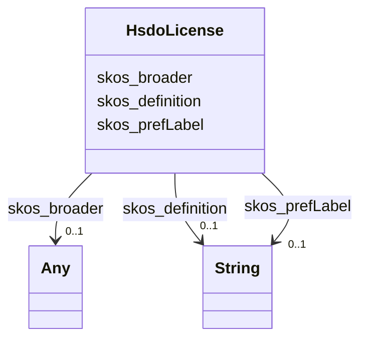

# Class: TODO -- what's a good name for this class (type)? (hsdo_License)


_TODO -- tell the world what this class (type) describes._


URI: [hsdo:License](http://schema.org/License)





<!-- no inheritance hierarchy -->


## Slots

| Name | Cardinality and Range | Description | Inheritance |
| ---  | --- | --- | --- |
| [skos_broader](../slots/skos_broader.md) | 0..1 <br/> [Any](../classes/Any.md)&nbsp;or&nbsp;<br />[HsdoScienceKeyword](../classes/HsdoScienceKeyword.md)&nbsp;or&nbsp;<br />[HsdoModels](../classes/HsdoModels.md)&nbsp;or&nbsp;<br />[SkosConcept](../classes/SkosConcept.md)&nbsp;or&nbsp;<br />[HsdoDataFormat](../classes/HsdoDataFormat.md)&nbsp;or&nbsp;<br />[HsdoVariable](../classes/HsdoVariable.md)&nbsp;or&nbsp;<br />[HsdoDataset](../classes/HsdoDataset.md)&nbsp;or&nbsp;<br />[HsdoModel](../classes/HsdoModel.md)&nbsp;or&nbsp;<br />[HsdoChronostratigraphicUnit](../classes/HsdoChronostratigraphicUnit.md)&nbsp;or&nbsp;<br />[HsdoLocation](../classes/HsdoLocation.md)&nbsp;or&nbsp;<br />[HsdoExperiment](../classes/HsdoExperiment.md)&nbsp;or&nbsp;<br />[HsdoTemporalResolutionRange](../classes/HsdoTemporalResolutionRange.md)&nbsp;or&nbsp;<br />[HsdoMeasurementName](../classes/HsdoMeasurementName.md)&nbsp;or&nbsp;<br />[HsdoPlatform](../classes/HsdoPlatform.md)&nbsp;or&nbsp;<br />[HsdoMimeType](../classes/HsdoMimeType.md)&nbsp;or&nbsp;<br />[HsdoRelatedUrlContentType](../classes/HsdoRelatedUrlContentType.md)&nbsp;or&nbsp;<br />[HsdoProvider](../classes/HsdoProvider.md)&nbsp;or&nbsp;<br />[HsdoProject](../classes/HsdoProject.md)&nbsp;or&nbsp;<br />[HsdoNominalResolution](../classes/HsdoNominalResolution.md)&nbsp;or&nbsp;<br />[HsdoSubExperimentId](../classes/HsdoSubExperimentId.md)&nbsp;or&nbsp;<br />[HsdoInstrument](../classes/HsdoInstrument.md)&nbsp;or&nbsp;<br />[HsdoHorizontalResolutionRange](../classes/HsdoHorizontalResolutionRange.md)&nbsp;or&nbsp;<br />[HsdoSourceType](../classes/HsdoSourceType.md) | TODO -- tell the world what this slot (predicate) describes | direct |
| [skos_prefLabel](../slots/skos_prefLabel.md) | 0..1 <br/> [xsd:string](http://www.w3.org/2001/XMLSchema#string) | TODO -- tell the world what this slot (predicate) describes | direct |
| [skos_definition](../slots/skos_definition.md) | 0..1 <br/> [xsd:string](http://www.w3.org/2001/XMLSchema#string) | TODO -- tell the world what this slot (predicate) describes | direct |


## Usages

| used by | used in | type | used |
| ---  | --- | --- | --- |
| [HsdoCmip6SourceId](../classes/HsdoCmip6SourceId.md) | [relation_HasLicenseInfo](../slots/relation_HasLicenseInfo.md) | range | [HsdoLicense](../classes/HsdoLicense.md) |


## Examples

| Value |
| --- |
| https://climateKG.org/entity/3c937799-5ee5-4ea3-b7d5-418a625a7872 |

## TODOs

* TODO -- Todos for this class go here
* or you can delete the todos
* if you think the class is perfect.

## Identifier and Mapping Information


### Schema Source


* from schema: climatepub4-kg


## Mappings

| Mapping Type | Mapped Value |
| ---  | ---  |
| self | hsdo:License |
| native | climatepub4-kg/:HsdoLicense |


## LinkML Source

<!-- TODO: investigate https://stackoverflow.com/questions/37606292/how-to-create-tabbed-code-blocks-in-mkdocs-or-sphinx -->

### Direct

<details>
```yaml
name: hsdo_License
description: TODO -- tell the world what this class (type) describes.
title: TODO -- what's a good name for this class (type)?
todos:
- TODO -- Todos for this class go here
- or you can delete the todos
- if you think the class is perfect.
notes:
- Class with 5 occurences.
examples:
- value: https://climateKG.org/entity/3c937799-5ee5-4ea3-b7d5-418a625a7872
from_schema: climatepub4-kg
slots:
- skos_broader
- skos_prefLabel
- skos_definition
class_uri: hsdo:License

```
</details>

### Induced

<details>
```yaml
name: hsdo_License
description: TODO -- tell the world what this class (type) describes.
title: TODO -- what's a good name for this class (type)?
todos:
- TODO -- Todos for this class go here
- or you can delete the todos
- if you think the class is perfect.
notes:
- Class with 5 occurences.
examples:
- value: https://climateKG.org/entity/3c937799-5ee5-4ea3-b7d5-418a625a7872
from_schema: climatepub4-kg
attributes:
  skos_broader:
    name: skos_broader
    description: TODO -- tell the world what this slot (predicate) describes.
    todos:
    - TODO -- Todos for this slot go here
    - or you can delete the todos
    - if you think the class is perfect.
    comments:
    - 2245 occurrences with subject type hsdo_Location and object type hsdo_Location.
    - 261 occurrences with subject type hsdo_Location and object type hsdo_Instrument.
    - 8109 occurrences with subject type hsdo_Science_Keyword and object type hsdo_Science_Keyword.
    - 2953 occurrences with subject type hsdo_Science_Keyword and object type hsdo_Provider.
    - 1937 occurrences with subject type hsdo_Science_Keyword and object type hsdo_Location.
    - 312 occurrences with subject type hsdo_Science_Keyword and object type hsdo_Model.
    - 1761 occurrences with subject type hsdo_Platform and object type hsdo_Instrument.
    - 2153 occurrences with subject type hsdo_Platform and object type hsdo_Platform.
    - 102 occurrences with subject type hsdo_Location and object type hsdo_Project.
    - 48 occurrences with subject type hsdo_Activity and object type hsdo_Project.
    - 40 occurrences with subject type hsdo_Model and object type hsdo_Instrument.
    - 34 occurrences with subject type hsdo_Model and object type hsdo_Platform.
    - 789 occurrences with subject type hsdo_Chronostratigraphic_Unit and object type
      hsdo_Chronostratigraphic_Unit.
    - 47 occurrences with subject type hsdo_Experiment and object type hsdo_Project.
    - 8707 occurrences with subject type hsdo_Provider and object type hsdo_Provider.
    - 86 occurrences with subject type hsdo_Model and object type hsdo_Project.
    - 6114 occurrences with subject type hsdo_Instrument and object type hsdo_Instrument.
    - 2038 occurrences with subject type hsdo_Instrument and object type hsdo_Experiment.
    - 57 occurrences with subject type hsdo_Experiment and object type hsdo_Provider.
    - 475 occurrences with subject type hsdo_Location and object type hsdo_Science_Keyword.
    - 311 occurrences with subject type hsdo_Location and object type hsdo_Provider.
    - 26 occurrences with subject type hsdo_Location and object type hsdo_Model.
    - 3416 occurrences with subject type hsdo_Project and object type hsdo_Project.
    - 4 occurrences with subject type hsdo_Realm and object type hsdo_Location.
    - 304 occurrences with subject type hsdo_Provider and object type hsdo_Location.
    - 180 occurrences with subject type hsdo_Instrument and object type hsdo_Project.
    - 891 occurrences with subject type hsdo_Models and object type hsdo_Science_Keyword.
    - 286 occurrences with subject type hsdo_Science_Keyword and object type hsdo_Instrument.
    - 355 occurrences with subject type hsdo_Experiment and object type hsdo_Experiment.
    - 131 occurrences with subject type hsdo_Model and object type hsdo_Science_Keyword.
    - 32 occurrences with subject type hsdo_Model and object type hsdo_Model.
    - 9 occurrences with subject type hsdo_Model and object type hsdo_Experiment.
    - 80 occurrences with subject type hsdo_Model and object type hsdo_Provider.
    - 317 occurrences with subject type hsdo_Measurement_Name and object type hsdo_Instrument.
    - 20 occurrences with subject type hsdo_Measurement_Name and object type hsdo_Location.
    - 75 occurrences with subject type hsdo_Institution and object type hsdo_Provider.
    - 38 occurrences with subject type hsdo_Model and object type hsdo_Location.
    - 12 occurrences with subject type hsdo_Instrument and object type hsdo_Variable.
    - 352 occurrences with subject type hsdo_Instrument and object type hsdo_Science_Keyword.
    - 160 occurrences with subject type hsdo_Instrument and object type hsdo_Provider.
    - 137 occurrences with subject type hsdo_Experiment and object type hsdo_Science_Keyword.
    - 31 occurrences with subject type hsdo_Experiment and object type hsdo_Location.
    - 54 occurrences with subject type hsdo_Sub_Experiment_Id and object type hsdo_Sub_Experiment_Id.
    - 227 occurrences with subject type hsdo_Measurement_Name and object type hsdo_Measurement_Name.
    - 130 occurrences with subject type hsdo_Instrument and object type hsdo_Location.
    - 154 occurrences with subject type hsdo_Provider and object type hsdo_Science_Keyword.
    - 182 occurrences with subject type hsdo_Provider and object type hsdo_Model.
    - 183 occurrences with subject type hsdo_Provider and object type hsdo_Instrument.
    - 43 occurrences with subject type hsdo_Location and object type hsdo_Platform.
    - 242 occurrences with subject type hsdo_Data_Format and object type hsdo_Data_Format.
    - 63 occurrences with subject type hsdo_Location and object type hsdo_Experiment.
    - 1281 occurrences with subject type hsdo_Variable and object type hsdo_Variable.
    - 55 occurrences with subject type hsdo_Platform and object type hsdo_Science_Keyword.
    - 25 occurrences with subject type hsdo_Platform and object type hsdo_Location.
    - 33 occurrences with subject type hsdo_Platform and object type hsdo_Provider.
    - 84 occurrences with subject type hsdo_Instrument and object type hsdo_Platform.
    - 27 occurrences with subject type hsdo_Science_Keyword and object type hsdo_Project.
    - 22 occurrences with subject type hsdo_Provider and object type hsdo_Related_Url_Content_Type.
    - 402 occurrences with subject type hsdo_Cmip6_Source_Id and object type hsdo_Science_Keyword.
    - 15 occurrences with subject type hsdo_Provider and object type hsdo_Sub_Experiment_Id.
    - 3 occurrences with subject type hsdo_Model and object type hsdo_Source_Type.
    - 58 occurrences with subject type hsdo_Experiment and object type hsdo_Instrument.
    - 6 occurrences with subject type hsdo_Experiment and object type hsdo_Platform.
    - 34 occurrences with subject type hsdo_Instrument and object type hsdo_Model.
    - 5 occurrences with subject type hsdo_Location and object type hsdo_Sub_Experiment_Id.
    - 220 occurrences with subject type hsdo_Science_Keyword and object type hsdo_Experiment.
    - 42 occurrences with subject type hsdo_Science_Keyword and object type hsdo_Platform.
    - 7 occurrences with subject type hsdo_Model and object type hsdo_Variable.
    - 13 occurrences with subject type hsdo_Provider and object type hsdo_Variable.
    - 4 occurrences with subject type hsdo_Provider and object type hsdo_Experiment.
    - 211 occurrences with subject type hsdo_Related_Url_Content_Type and object type
      hsdo_Related_Url_Content_Type.
    - 106 occurrences with subject type hsdo_Dataset and object type hsdo_Dataset.
    - 26 occurrences with subject type hsdo_Project and object type hsdo_Science_Keyword.
    - 4 occurrences with subject type hsdo_Project and object type hsdo_Location.
    - 15 occurrences with subject type hsdo_Project and object type hsdo_Provider.
    - 4 occurrences with subject type hsdo_Platform and object type hsdo_Experiment.
    - 7 occurrences with subject type hsdo_Location and object type hsdo_Related_Url_Content_Type.
    - 16 occurrences with subject type hsdo_Models and object type hsdo_Instrument.
    - 10 occurrences with subject type hsdo_Location and object type hsdo_Measurement_Name.
    - 1 occurrences with subject type hsdo_Provider and object type hsdo_Source_Type.
    - 14 occurrences with subject type hsdo_Instrument and object type hsdo_Related_Url_Content_Type.
    - 12 occurrences with subject type hsdo_Experiment and object type hsdo_Model.
    - 85 occurrences with subject type hsdo_Platform and object type hsdo_Model.
    - 18 occurrences with subject type hsdo_Temporal_Resolution_Range and object type
      hsdo_Temporal_Resolution_Range.
    - 4 occurrences with subject type hsdo_Project and object type hsdo_Model.
    - 17 occurrences with subject type hsdo_Platform and object type hsdo_Project.
    - 2 occurrences with subject type hsdo_Experiment and object type hsdo_Variable.
    - 3 occurrences with subject type hsdo_Provider and object type hsdo_Platform.
    - 12 occurrences with subject type hsdo_Location and object type hsdo_Variable.
    - 2 occurrences with subject type hsdo_Institution and object type hsdo_Location.
    - 4 occurrences with subject type hsdo_Source_Type and object type hsdo_Source_Type.
    - 15 occurrences with subject type hsdo_Nominal_Resolution and object type hsdo_Nominal_Resolution.
    - 3 occurrences with subject type hsdo_Experiment and object type hsdo_Source_Type.
    - 16 occurrences with subject type hsdo_Frequency and object type hsdo_Temporal_Resolution_Range.
    - 4 occurrences with subject type hsdo_License and object type hsdo_Instrument.
    - 1 occurrences with subject type hsdo_Instrument and object type hsdo_Models.
    - 3 occurrences with subject type hsdo_Location and object type hsdo_Source_Type.
    - 3 occurrences with subject type hsdo_Model and object type hsdo_Related_Url_Content_Type.
    - 24 occurrences with subject type hsdo_Related_Url_Content_Type and object type
      hsdo_Provider.
    - 1 occurrences with subject type hsdo_Project and object type hsdo_Experiment.
    - 1 occurrences with subject type hsdo_Project and object type hsdo_Variable.
    - 1 occurrences with subject type hsdo_Model and object type hsdo_Temporal_Resolution_Range.
    - 3 occurrences with subject type hsdo_Models and object type hsdo_Models.
    - 1 occurrences with subject type hsdo_Provider and object type hsdo_Project.
    - 2 occurrences with subject type hsdo_Experiment and object type hsdo_Measurement_Name.
    - 16338 occurrences with subject type skos_Concept and object type skos_Concept.
    - 37 occurrences with subject type hsdo_Mime_Type and object type hsdo_Mime_Type.
    - 14 occurrences with subject type hsdo_Horizontal_Resolution_Range and object
      type hsdo_Horizontal_Resolution_Range.
    - 6 occurrences with subject type hsdo_Vertical_Resolution_Range and object type
      hsdo_Variable.
    - 2 occurrences with subject type hsdo_Related_Url_Content_Type and object type
      hsdo_Instrument.
    examples:
    - value: https://climateKG.org/entity/ffcee960-5527-43e0-bfd0-ad48b1151cf0 skos:broader
        https://climateKG.org/entity/713eb469-abe4-4b6b-bad6-134187deabd8
    - value: https://climateKG.org/entity/fe4326f9-1089-4ede-ae32-5d7bc7d2349b skos:broader
        https://climateKG.org/entity/ff03e9fc-9882-4a5e-ad0b-830d8f1186cb
    - value: https://climateKG.org/entity/ffc61516-ea33-48f3-94df-7065fea388ee skos:broader
        https://climateKG.org/entity/d64a9627-3cf8-41d3-aaf7-8c2c46fb4a13
    - value: https://climateKG.org/entity/ffc61516-ea33-48f3-94df-7065fea388ee skos:broader
        https://climateKG.org/entity/e9f67a66-e9fc-435c-b720-ae32a2c3d8f5
    - value: https://climateKG.org/entity/ff9f8056-84d6-4fbc-abe0-9b6e82ed3f5e skos:broader
        https://climateKG.org/entity/c47f6052-634e-40ef-a5ac-13f69f6f4c2a
    - value: https://climateKG.org/entity/fec6c2e4-ca15-426a-b344-36bba69e5c1f skos:broader
        https://climateKG.org/entity/6f6423e8-ab4e-4572-8982-d9c40f64e28b
    - value: https://climateKG.org/entity/ffc0ac45-f742-49b2-a51b-000205e38669 skos:broader
        https://climateKG.org/entity/f3261de5-34c1-4980-af22-f9d7e7206d12
    - value: https://climateKG.org/entity/ffc0ac45-f742-49b2-a51b-000205e38669 skos:broader
        https://climateKG.org/entity/ef71c514-0fec-4354-bb1e-6baa5967634f
    - value: https://climateKG.org/entity/fe439b0d-db2c-4998-9890-c11c5c16641f skos:broader
        https://climateKG.org/entity/fb0b9fcd-5c96-4989-8c64-a479bbed83ab
    - value: https://climateKG.org/entity/d7144e27-6122-46e2-8335-b60c49a83248 skos:broader
        https://climateKG.org/entity/fb0b9fcd-5c96-4989-8c64-a479bbed83ab
    - value: https://climateKG.org/entity/ff1ace7a-7924-4198-8385-f7f7ede361c1 skos:broader
        https://climateKG.org/entity/085edf65-1c8c-414a-b8e4-a1a08ff08f22
    - value: https://climateKG.org/entity/f2b0301b-2f33-4048-9381-25a92226ed66 skos:broader
        https://climateKG.org/entity/b39a69b4-c3b9-4a94-b296-bbbbe5e4c847
    - value: https://climateKG.org/entity/ff133a4b-a23a-4710-93d3-2b802b21c8c4 skos:broader
        https://climateKG.org/entity/b44427cd-4b20-42a3-9e14-8d1f6d8399d5
    - value: https://climateKG.org/entity/e25399d8-139f-4641-89ee-24d42e9ed81c skos:broader
        https://climateKG.org/entity/fb0b9fcd-5c96-4989-8c64-a479bbed83ab
    - value: https://climateKG.org/entity/ffaea6a1-8b76-4e2e-a09f-a0280bc0952e skos:broader
        https://climateKG.org/entity/b301e170-c91e-4275-9858-d7720fb93416
    - value: https://climateKG.org/entity/fe761190-36bb-4eb1-8d5d-340c4a7f89ea skos:broader
        https://climateKG.org/entity/fb0b9fcd-5c96-4989-8c64-a479bbed83ab
    - value: https://climateKG.org/entity/fff596a8-f792-4627-8c3a-954012a1969b skos:broader
        https://climateKG.org/entity/6c0e547e-70cc-47db-8c8c-97c5ba73f1da
    - value: https://climateKG.org/entity/fff596a8-f792-4627-8c3a-954012a1969b skos:broader
        https://climateKG.org/entity/b2140059-b3ca-415c-b0a7-3e142783ffe8
    - value: https://climateKG.org/entity/f5df87b6-ed50-4da0-9ba5-7ce4c907bdb3 skos:broader
        https://climateKG.org/entity/e9f67a66-e9fc-435c-b720-ae32a2c3d8f5
    - value: https://climateKG.org/entity/ff5d5c12-74d9-435d-9164-1c9d69f967d7 skos:broader
        https://climateKG.org/entity/35e1f93b-99b3-4430-b477-0ecafa80d67a
    - value: https://climateKG.org/entity/ff5d5c12-74d9-435d-9164-1c9d69f967d7 skos:broader
        https://climateKG.org/entity/e9f67a66-e9fc-435c-b720-ae32a2c3d8f5
    - value: https://climateKG.org/entity/f4c1a555-4758-47ce-baa6-536730333833 skos:broader
        https://climateKG.org/entity/23703b6b-ee15-4512-b5b2-f441547e2edf
    - value: https://climateKG.org/entity/ffcca1c5-fffd-4359-b282-e00fc77c979e skos:broader
        https://climateKG.org/entity/fb0b9fcd-5c96-4989-8c64-a479bbed83ab
    - value: https://climateKG.org/entity/da44d8bd-4896-44c9-ab2b-4ab9ab263c65 skos:broader
        https://climateKG.org/entity/61cd0af2-2f62-4aa4-b6c3-f683e975c820
    - value: https://climateKG.org/entity/fed7e934-6a34-4379-9b57-ad6d49991498 skos:broader
        https://climateKG.org/entity/aef2fc80-def0-46a4-9259-9dc37e80ed08
    - value: https://climateKG.org/entity/ff25845a-5d94-43c1-abc4-419a108b0f1f skos:broader
        https://climateKG.org/entity/fb0b9fcd-5c96-4989-8c64-a479bbed83ab
    - value: https://climateKG.org/entity/ff7d51fb-85cb-4350-8817-b4121cf72357 skos:broader
        https://climateKG.org/entity/e1f20631-b5b9-438c-b5c2-b1fa0fce100a
    - value: https://climateKG.org/entity/ff889b84-e12f-40ab-815b-61d5aecf2b63 skos:broader
        https://climateKG.org/entity/431eca76-9d34-4f86-b1d3-a0b40221e905
    - value: https://climateKG.org/entity/ffcfde92-a161-4705-a7c6-7e400b5fb4e9 skos:broader
        https://climateKG.org/entity/d69f7457-db31-48ce-b8c2-98058c412bc6
    - value: https://climateKG.org/entity/ff1ace7a-7924-4198-8385-f7f7ede361c1 skos:broader
        https://climateKG.org/entity/fb93d937-c17c-45d0-a9e3-ca5c8a800ca8
    - value: https://climateKG.org/entity/f8845bec-c628-4185-aac1-4af22481c024 skos:broader
        https://climateKG.org/entity/8eb84f36-f355-458b-889f-b37cfa120654
    - value: https://climateKG.org/entity/e5b724af-b661-406a-ae1f-7cd2730c0576 skos:broader
        https://climateKG.org/entity/a956d045-3b12-441c-8a18-fac7d33b2b4e
    - value: https://climateKG.org/entity/ff1ace7a-7924-4198-8385-f7f7ede361c1 skos:broader
        https://climateKG.org/entity/e9f67a66-e9fc-435c-b720-ae32a2c3d8f5
    - value: https://climateKG.org/entity/ffcda4b1-0956-4413-a4c9-8d72b5dffb58 skos:broader
        https://climateKG.org/entity/e384382c-fb2a-43ea-b064-610e6d4807e9
    - value: https://climateKG.org/entity/fcb181b4-4732-4752-b70d-bbcc81fcdc59 skos:broader
        https://climateKG.org/entity/369c608c-787a-4ca6-8811-cc8eca7447d5
    - value: https://climateKG.org/entity/bf904092-467c-468e-99da-8722f9141204 skos:broader
        https://climateKG.org/entity/a158f804-b000-4013-9513-cee7790381c3
    - value: https://climateKG.org/entity/f8845bec-c628-4185-aac1-4af22481c024 skos:broader
        https://climateKG.org/entity/91c64c46-d040-4daa-b26c-61952fdfaf50
    - value: https://climateKG.org/entity/b3416c55-cdff-4e8b-89af-a9b219a9e538 skos:broader
        https://climateKG.org/entity/160af7da-6036-4af5-ba04-d666df8a0daa
    - value: https://climateKG.org/entity/fe4392b0-13a9-43ff-bacc-f44a65aed4fa skos:broader
        https://climateKG.org/entity/e1f20631-b5b9-438c-b5c2-b1fa0fce100a
    - value: https://climateKG.org/entity/fe06f678-7155-4f93-9e28-4c083d60cccc skos:broader
        https://climateKG.org/entity/e9f67a66-e9fc-435c-b720-ae32a2c3d8f5
    - value: https://climateKG.org/entity/f5df87b6-ed50-4da0-9ba5-7ce4c907bdb3 skos:broader
        https://climateKG.org/entity/b6fd22ab-dca7-4dfa-8812-913453b5695b
    - value: https://climateKG.org/entity/f5df87b6-ed50-4da0-9ba5-7ce4c907bdb3 skos:broader
        https://climateKG.org/entity/91697b7d-8f2b-4954-850e-61d5f61c867d
    - value: https://climateKG.org/entity/fc01908a-f93e-46e6-9f85-5b428b8d2b8d skos:broader
        https://climateKG.org/entity/2eecd388-25be-4367-90c6-0d683ef476ac
    - value: https://climateKG.org/entity/ffcda4b1-0956-4413-a4c9-8d72b5dffb58 skos:broader
        https://climateKG.org/entity/1f697c83-969d-48ee-87b8-245b11f7e24f
    - value: https://climateKG.org/entity/ff03e9fc-9882-4a5e-ad0b-830d8f1186cb skos:broader
        https://climateKG.org/entity/713eb469-abe4-4b6b-bad6-134187deabd8
    - value: https://climateKG.org/entity/ff850d62-675c-4386-a375-fe4af92ec3ff skos:broader
        https://climateKG.org/entity/d35b9ba5-d018-48a5-8f0d-92b9c55b3279
    - value: https://climateKG.org/entity/ff2f2855-6cdd-4bf0-a4ea-5aa61698d765 skos:broader
        https://climateKG.org/entity/5fea4160-25a7-44b5-bfba-ef140fdffaf4
    - value: https://climateKG.org/entity/feab952c-49ca-41c1-a2a0-b35bf4dd7048 skos:broader
        https://climateKG.org/entity/5527d704-a0fe-45ab-99f9-90fa64f4af7f
    - value: https://climateKG.org/entity/f62c196b-8ec3-40e8-a824-6849e5a496f2 skos:broader
        https://climateKG.org/entity/b39a69b4-c3b9-4a94-b296-bbbbe5e4c847
    - value: https://climateKG.org/entity/fd79ac2d-c42e-4f3d-9aa1-d5ae94d4d2e3 skos:broader
        https://climateKG.org/entity/bb6184eb-1ced-44fb-9668-d57cf1baa2e3
    - value: https://climateKG.org/entity/fbe91a4f-4d27-4cfe-ba1b-69a62e359a3d skos:broader
        https://climateKG.org/entity/f1a25060-330c-4f84-9633-ed59ae8c64bf
    - value: https://climateKG.org/entity/ffb483cf-a660-4ec1-b470-304efce6005d skos:broader
        https://climateKG.org/entity/160af7da-6036-4af5-ba04-d666df8a0daa
    - value: https://climateKG.org/entity/fee25cad-7ffe-4ee2-a6f2-8116b8a0a707 skos:broader
        https://climateKG.org/entity/fb93d937-c17c-45d0-a9e3-ca5c8a800ca8
    - value: https://climateKG.org/entity/f9846838-fdbc-4aa0-86e9-b0e70e97d0e2 skos:broader
        https://climateKG.org/entity/d62db12c-fdcf-40ec-a714-4fb7c615aebe
    - value: https://climateKG.org/entity/fee25cad-7ffe-4ee2-a6f2-8116b8a0a707 skos:broader
        https://climateKG.org/entity/e9f67a66-e9fc-435c-b720-ae32a2c3d8f5
    - value: https://climateKG.org/entity/fbcd0c2b-f8ac-4199-9a37-5e7a39150730 skos:broader
        https://climateKG.org/entity/267606d3-4918-4651-b40d-be12b09dd2fe
    - value: https://climateKG.org/entity/fd19a3f1-8eeb-49ab-bcaf-e7b4b267d415 skos:broader
        https://climateKG.org/entity/5a7bb095-4d12-4232-bc75-b8e82197cb92
    - value: https://climateKG.org/entity/d1996d91-e824-4b24-b94e-3aae4543b63b skos:broader
        https://climateKG.org/entity/894edd57-afb3-4bb3-878f-fc245d8b6e82
    - value: https://climateKG.org/entity/ffa6f7e9-e7e0-494d-84e4-41544a1762e7 skos:broader
        https://climateKG.org/entity/e1f20631-b5b9-438c-b5c2-b1fa0fce100a
    - value: https://climateKG.org/entity/dcbcdf6d-f4d7-4040-b7a5-07c46587b4bc skos:broader
        https://climateKG.org/entity/2eecd388-25be-4367-90c6-0d683ef476ac
    - value: https://climateKG.org/entity/bae77e96-ede8-44ab-8035-31feb2527fad skos:broader
        https://climateKG.org/entity/27a62e86-0b64-4e21-9766-cfdcd95ff87b
    - value: https://climateKG.org/entity/fa13c1b2-6be4-45c3-aefa-7918575a583d skos:broader
        https://climateKG.org/entity/2bc6e372-93d8-4672-96b1-ec159aff2e19
    - value: https://climateKG.org/entity/f80b13a8-7692-4d1a-be08-851544cd0cde skos:broader
        https://climateKG.org/entity/e8baa3a4-ef5a-455a-bf25-d61e59fc9bb3
    - value: https://climateKG.org/entity/fe06f678-7155-4f93-9e28-4c083d60cccc skos:broader
        https://climateKG.org/entity/23703b6b-ee15-4512-b5b2-f441547e2edf
    - value: https://climateKG.org/entity/c129a8c2-b9d5-4405-914f-a6949a8e7b5a skos:broader
        https://climateKG.org/entity/2eecd388-25be-4367-90c6-0d683ef476ac
    - value: https://climateKG.org/entity/fed291ec-8f7d-4131-a5cd-dc04706f61b0 skos:broader
        https://climateKG.org/entity/c7245882-84a1-4192-acfa-a758b5b9c151
    - value: https://climateKG.org/entity/f2295f39-e8c5-4032-8a05-618d95410b28 skos:broader
        https://climateKG.org/entity/cc9e67fc-eafa-43cc-879f-0cb56b25bc39
    - value: https://climateKG.org/entity/f860ed88-991f-4b52-90b9-fc8d4046a598 skos:broader
        https://climateKG.org/entity/160af7da-6036-4af5-ba04-d666df8a0daa
    - value: https://climateKG.org/entity/fe950f88-6d5e-4741-8076-3fbe16b0b9c4 skos:broader
        https://climateKG.org/entity/160af7da-6036-4af5-ba04-d666df8a0daa
    - value: https://climateKG.org/entity/e91ff41a-5cf5-460b-b765-c553ca2a4ae2 skos:broader
        https://climateKG.org/entity/bd1834b0-4f8f-4616-b330-6205bff567c2
    - value: https://climateKG.org/entity/fd01f7ec-fdf6-4440-b974-75f12fb4ec5f skos:broader
        https://climateKG.org/entity/894edd57-afb3-4bb3-878f-fc245d8b6e82
    - value: https://climateKG.org/entity/fe64cea2-19de-470c-a919-b24c744c696b skos:broader
        https://climateKG.org/entity/d3df0ea0-8954-4bea-aa01-c84c5d32eb54
    - value: https://climateKG.org/entity/f69374fe-eda2-4223-b130-096220251235 skos:broader
        https://climateKG.org/entity/fb93d937-c17c-45d0-a9e3-ca5c8a800ca8
    - value: https://climateKG.org/entity/7cacbfdf-71a3-4fac-b690-9aa54e4060dd skos:broader
        https://climateKG.org/entity/c47f6052-634e-40ef-a5ac-13f69f6f4c2a
    - value: https://climateKG.org/entity/f69374fe-eda2-4223-b130-096220251235 skos:broader
        https://climateKG.org/entity/e9f67a66-e9fc-435c-b720-ae32a2c3d8f5
    - value: https://climateKG.org/entity/d609fc5c-8267-4e79-84ec-93629d52aba8 skos:broader
        https://climateKG.org/entity/f1a25060-330c-4f84-9633-ed59ae8c64bf
    - value: https://climateKG.org/entity/e5803df8-c802-4f3f-96f5-53e534835887 skos:broader
        https://climateKG.org/entity/8759ab63-ac04-4136-bc25-0c00eece1096
    - value: https://climateKG.org/entity/fdd890fa-377a-46ce-8fdc-2d7d16a461b7 skos:broader
        https://climateKG.org/entity/fe4392b0-13a9-43ff-bacc-f44a65aed4fa
    - value: https://climateKG.org/entity/fb3ca6d5-ab16-413b-80f6-c2e2d50ec4c0 skos:broader
        https://climateKG.org/entity/67cc1cc2-04b9-4763-8e73-fb028f45baab
    - value: https://climateKG.org/entity/3b16a2e8-cc4d-40ce-a6c8-336bea211078 skos:broader
        https://climateKG.org/entity/27a62e86-0b64-4e21-9766-cfdcd95ff87b
    - value: https://climateKG.org/entity/fcc9411c-a1c9-415d-a16c-75c42f2cec45 skos:broader
        https://climateKG.org/entity/894edd57-afb3-4bb3-878f-fc245d8b6e82
    - value: https://climateKG.org/entity/eaa0bc43-e283-4bf1-ba20-ca32850a66ef skos:broader
        https://climateKG.org/entity/23703b6b-ee15-4512-b5b2-f441547e2edf
    - value: https://climateKG.org/entity/fe979e09-fcb1-4991-8fab-8ff32a28e84b skos:broader
        https://climateKG.org/entity/0a184cdc-c074-4946-90a6-02f03c686341
    - value: https://climateKG.org/entity/f86e464a-cf9d-4e15-a39b-501855d1dc5a skos:broader
        https://climateKG.org/entity/502ad03c-dba8-4b32-8af5-13fa947c3988
    - value: https://climateKG.org/entity/be7f6de0-f51e-42bc-9a66-fff30d809a67 skos:broader
        https://climateKG.org/entity/22ec2f9b-1f1a-469b-bc09-851d58637ff4
    - value: https://climateKG.org/entity/db7e4e2a-f55a-4515-bdd9-c5bc48e3c6d9 skos:broader
        https://climateKG.org/entity/fb0b9fcd-5c96-4989-8c64-a479bbed83ab
    - value: https://climateKG.org/entity/d4b91aac-8ca8-44e8-8854-ceae0cf3bc4e skos:broader
        https://climateKG.org/entity/160af7da-6036-4af5-ba04-d666df8a0daa
    - value: https://climateKG.org/entity/ab7eb13f-5fcb-4afa-8819-c37d36feeec1 skos:broader
        https://climateKG.org/entity/0a454dc9-de56-4682-8688-36ffd547d42f
    - value: https://climateKG.org/entity/f90ae98a-cdfb-490a-ba47-0186d69b4f8c skos:broader
        https://climateKG.org/entity/160af7da-6036-4af5-ba04-d666df8a0daa
    - value: https://climateKG.org/entity/7cf22186-281a-4665-b79b-5a6e5ea5b471 skos:broader
        https://climateKG.org/entity/aef2fc80-def0-46a4-9259-9dc37e80ed08
    - value: https://climateKG.org/entity/ff7b2b19-a8f6-4e84-a2c7-f2256199e13c skos:broader
        https://climateKG.org/entity/27a62e86-0b64-4e21-9766-cfdcd95ff87b
    - value: https://climateKG.org/entity/ef23b094-00f7-4ad3-8a9c-fa4ab8666c12 skos:broader
        https://climateKG.org/entity/c059a189-5d19-42f1-8a3a-1d0154da17dd
    - value: https://climateKG.org/entity/cd77430e-8e10-4581-b36e-e2db1124c34f skos:broader
        https://climateKG.org/entity/27a62e86-0b64-4e21-9766-cfdcd95ff87b
    - value: https://climateKG.org/entity/fb3ad06c-6a16-494b-a539-87da59e25c54 skos:broader
        https://climateKG.org/entity/502ad03c-dba8-4b32-8af5-13fa947c3988
    - value: https://climateKG.org/entity/9e36c429-c63a-48d8-8e94-caab8195f034 skos:broader
        https://climateKG.org/entity/3c937799-5ee5-4ea3-b7d5-418a625a7872
    - value: https://climateKG.org/entity/a68048f4-181c-4c6c-9bfa-9e4171e9f237 skos:broader
        https://climateKG.org/entity/35d2677c-619a-4a47-a5a7-3feb9973c5ab
    - value: https://climateKG.org/entity/e8c6761b-0653-495c-82e9-feb685344542 skos:broader
        https://climateKG.org/entity/27a62e86-0b64-4e21-9766-cfdcd95ff87b
    - value: https://climateKG.org/entity/ab2fce71-e5f9-4ba6-bfb1-bc428a8b7dd8 skos:broader
        https://climateKG.org/entity/894edd57-afb3-4bb3-878f-fc245d8b6e82
    - value: https://climateKG.org/entity/da43d7e4-4cb4-4b65-a9a1-94bf542f96de skos:broader
        https://climateKG.org/entity/750f6c61-0f15-4185-94d8-c029dec04bc5
    - value: https://climateKG.org/entity/be7f6de0-f51e-42bc-9a66-fff30d809a67 skos:broader
        https://climateKG.org/entity/a956d045-3b12-441c-8a18-fac7d33b2b4e
    - value: https://climateKG.org/entity/c819d2c9-fb81-4ce5-9737-ae8ea19690a2 skos:broader
        https://climateKG.org/entity/160af7da-6036-4af5-ba04-d666df8a0daa
    - value: https://climateKG.org/entity/e0040d4b-e398-4b65-bd42-d39434b5cc95 skos:broader
        https://climateKG.org/entity/502ad03c-dba8-4b32-8af5-13fa947c3988
    - value: https://climateKG.org/entity/3165b02f-962f-48bf-944b-66dd470f5988 skos:broader
        https://climateKG.org/entity/8cf3a3ce-4dd4-4364-8414-83e3b01354ec
    - value: https://climateKG.org/entity/f634ab55-de40-4d0b-93bc-691bf5408ccb skos:broader
        https://climateKG.org/entity/5a7bb095-4d12-4232-bc75-b8e82197cb92
    - value: https://climateKG.org/entity/fa13c1b2-6be4-45c3-aefa-7918575a583d skos:broader
        https://climateKG.org/entity/5b2a974e-0461-4eb1-86bd-807a29dccfc9
    - value: https://gcmd.earthdata.nasa.gov/kms/concept/ffff565f-15e9-4d15-a840-05c1a44fd2bf
        skos:broader https://gcmd.earthdata.nasa.gov/kms/concept/a31c2828-9b6d-44e9-b6ad-7ae81030f322
    - value: https://climateKG.org/entity/fea4e0a7-d794-481d-9915-52f1be226714 skos:broader
        https://climateKG.org/entity/ec1a1350-be24-42e6-a5cc-ccb806793def
    - value: https://climateKG.org/entity/e5c4876e-47b7-4d53-90a2-081a6b150140 skos:broader
        https://climateKG.org/entity/1499785c-8b74-45f4-bbf7-19d2d4e43b2f
    - value: https://climateKG.org/entity/eccf8700-c503-46a3-b6f7-86cf7e48465a skos:broader
        https://climateKG.org/entity/9728ca44-7bb3-40a4-9dd2-49470ad47fa5
    - value: https://climateKG.org/entity/f02b0c6a-7fd9-473d-a1cb-a6482e8daa61 skos:broader
        https://climateKG.org/entity/3c9d4493-22fd-48a8-9af5-bf0d16b7ede5
    from_schema: climatepub4-kg
    rank: 1000
    slot_uri: skos:broader
    alias: skos_broader
    owner: hsdo_License
    domain_of:
    - hsdo_Activity
    - hsdo_Chronostratigraphic_Unit
    - hsdo_Cmip6_Source_Id
    - hsdo_Data_Format
    - hsdo_Dataset
    - hsdo_Experiment
    - hsdo_Frequency
    - hsdo_Horizontal_Resolution_Range
    - hsdo_Institution
    - hsdo_Instrument
    - hsdo_License
    - hsdo_Location
    - hsdo_Measurement_Name
    - hsdo_Mime_Type
    - hsdo_Model
    - hsdo_Models
    - hsdo_Nominal_Resolution
    - hsdo_Platform
    - hsdo_Project
    - hsdo_Provider
    - hsdo_Realm
    - hsdo_Related_Url_Content_Type
    - hsdo_Science_Keyword
    - hsdo_Source_Type
    - hsdo_Sub_Experiment_Id
    - hsdo_Temporal_Resolution_Range
    - hsdo_Variable
    - hsdo_Vertical_Resolution_Range
    - skos_Concept
    range: Any
    any_of:
    - range: hsdo_Science_Keyword
    - range: hsdo_Models
    - range: skos_Concept
    - range: hsdo_Data_Format
    - range: hsdo_Variable
    - range: hsdo_Dataset
    - range: hsdo_Model
    - range: hsdo_Chronostratigraphic_Unit
    - range: hsdo_Location
    - range: hsdo_Experiment
    - range: hsdo_Temporal_Resolution_Range
    - range: hsdo_Measurement_Name
    - range: hsdo_Platform
    - range: hsdo_Mime_Type
    - range: hsdo_Related_Url_Content_Type
    - range: hsdo_Provider
    - range: hsdo_Project
    - range: hsdo_Nominal_Resolution
    - range: hsdo_Sub_Experiment_Id
    - range: hsdo_Instrument
    - range: hsdo_Horizontal_Resolution_Range
    - range: hsdo_Source_Type
  skos_prefLabel:
    name: skos_prefLabel
    description: TODO -- tell the world what this slot (predicate) describes.
    todos:
    - TODO -- Todos for this slot go here
    - or you can delete the todos
    - if you think the class is perfect.
    comments:
    - 983 occurrences with subject type hsdo_Location and object type string.
    - 2975 occurrences with subject type hsdo_Science_Keyword and object type string.
    - 1171 occurrences with subject type hsdo_Platform and object type string.
    - 24 occurrences with subject type hsdo_Activity and object type string.
    - 150 occurrences with subject type hsdo_Model and object type string.
    - 184 occurrences with subject type hsdo_Chronostratigraphic_Unit and object type
      string.
    - 444 occurrences with subject type hsdo_Experiment and object type string.
    - 3745 occurrences with subject type hsdo_Provider and object type string.
    - 2363 occurrences with subject type hsdo_Instrument and object type string.
    - 1727 occurrences with subject type hsdo_Project and object type string.
    - 4 occurrences with subject type hsdo_Realm and object type string.
    - 297 occurrences with subject type hsdo_Models and object type string.
    - 234 occurrences with subject type hsdo_Measurement_Name and object type string.
    - 75 occurrences with subject type hsdo_Institution and object type string.
    - 55 occurrences with subject type hsdo_Sub_Experiment_Id and object type string.
    - 198 occurrences with subject type hsdo_Data_Format and object type string.
    - 1283 occurrences with subject type hsdo_Variable and object type string.
    - 134 occurrences with subject type hsdo_Cmip6_Source_Id and object type string.
    - 15 occurrences with subject type hsdo_Horizontal_Resolution_Range and object
      type string.
    - 5 occurrences with subject type hsdo_Source_Type and object type string.
    - 88 occurrences with subject type hsdo_Related_Url_Content_Type and object type
      string.
    - 107 occurrences with subject type hsdo_Dataset and object type string.
    - 19 occurrences with subject type hsdo_Temporal_Resolution_Range and object type
      string.
    - 16 occurrences with subject type hsdo_Nominal_Resolution and object type string.
    - 16 occurrences with subject type hsdo_Frequency and object type string.
    - 4 occurrences with subject type hsdo_License and object type string.
    - 38 occurrences with subject type hsdo_Mime_Type and object type string.
    - 16359 occurrences with subject type skos_Concept and object type string.
    - 6 occurrences with subject type hsdo_Vertical_Resolution_Range and object type
      string.
    examples:
    - value: https://climateKG.org/entity/0006e246-4296-448c-9b81-a0831cad7f1c skos:prefLabel
        LABRADOR_SEA
    - value: https://climateKG.org/entity/001f18d3-7e61-430b-9883-1960c6256fe5 skos:prefLabel
        OPTICAL_DEPTH
    - value: https://climateKG.org/entity/007c3084-89db-458e-8387-14e192b6cb8e skos:prefLabel
        Sentinel_1
    - value: https://climateKG.org/entity/00a97d0c-e05e-43c9-93d0-3c7a2527b3c0 skos:prefLabel
        SIMIP
    - value: https://climateKG.org/entity/00bb59aa-755d-4710-a097-f1e2836f4032 skos:prefLabel
        RCM_3
    - value: https://climateKG.org/entity/00c6f0f3-5734-4500-a69e-f6780e365985 skos:prefLabel
        EARLY
    - value: https://climateKG.org/entity/00ce4800-70ef-4346-aa15-0554280d0896 skos:prefLabel
        HAB
    - value: https://climateKG.org/entity/0111fbd3-e6ec-464a-bc65-2323c2328e7c skos:prefLabel
        DOI
    - value: https://climateKG.org/entity/01407ecf-45af-4fcc-8a1b-9b383636e2e4 skos:prefLabel
        HYDRA
    - value: https://climateKG.org/entity/01e75216-1cee-4cc3-b31d-83019730da85 skos:prefLabel
        USNPS_ENVIRONMENTAL_CHANGE_IN_BERINGIAN_ARCTIC
    - value: https://climateKG.org/entity/021d2b85-4728-4434-b429-082874cfab69 skos:prefLabel
        ocnBgchem
    - value: https://climateKG.org/entity/028fe075-8ed0-47f0-b462-71e4adf72a4e skos:prefLabel
        HadGEM2_ES
    - value: https://climateKG.org/entity/038ac74c-470a-43e0-b80d-2b2fb1acfc13 skos:prefLabel
        ambient_aerosol_particles
    - value: https://climateKG.org/entity/03976e48-3ff9-4dc6-a4c4-fd77026380ff skos:prefLabel
        E3SM_Project
    - value: https://climateKG.org/entity/04e00ed0-39b6-4323-a788-2344264695c0 skos:prefLabel
        s2016
    - value: https://climateKG.org/entity/0679d78d-0931-4948-94ec-46ab130785a6 skos:prefLabel
        ICI
    - value: https://climateKG.org/entity/0893353d-4e8c-4b31-bcc5-fce552ccfff3 skos:prefLabel
        Point_Resolution
    - value: https://climateKG.org/entity/0cd4d2c4-ebfa-4759-b7aa-f9982122f581 skos:prefLabel
        IPSL_CM5A2_INCA
    - value: https://climateKG.org/entity/1499785c-8b74-45f4-bbf7-19d2d4e43b2f skos:prefLabel
        Horizontal_Resolution_Ranges
    - value: https://climateKG.org/entity/27a62e86-0b64-4e21-9766-cfdcd95ff87b skos:prefLabel
        Source_Type
    - value: https://climateKG.org/entity/2892b502-2c66-42d5-af3d-bcddb57d9195 skos:prefLabel
        GET_CAPABILITIES
    - value: https://climateKG.org/entity/2892e23f-5249-439d-8c0e-6c1d190b3beb skos:prefLabel
        ERA_5
    - value: https://climateKG.org/entity/3d97e993-dc6a-41ff-8a49-3e837c1fc2b1 skos:prefLabel
        Decadal
    - value: https://climateKG.org/entity/82a2971f-82eb-46aa-8d70-1343570edba8 skos:prefLabel
        10000_km
    - value: https://climateKG.org/entity/8e4900ff-c7bc-47a1-aa55-a8892696d769 skos:prefLabel
        day
    - value: https://climateKG.org/entity/95c7e601-fcfe-4fc9-9994-8105a1e11428 skos:prefLabel
        CC_BY_4_0
    - value: https://climateKG.org/entity/ec1a1350-be24-42e6-a5cc-ccb806793def skos:prefLabel
        Mime_Type
    - value: https://gcmd.earthdata.nasa.gov/kms/concept/0006e246-4296-448c-9b81-a0831cad7f1c
        skos:prefLabel LABRADOR_SEA
    - value: https://climateKG.org/entity/201337ea-fa14-4e58-a538-e92c5ff734a4 skos:prefLabel
        1_meter_10_meters
    from_schema: climatepub4-kg
    rank: 1000
    slot_uri: skos:prefLabel
    alias: skos_prefLabel
    owner: hsdo_License
    domain_of:
    - hsdo_Activity
    - hsdo_Chronostratigraphic_Unit
    - hsdo_Cmip6_Source_Id
    - hsdo_Data_Format
    - hsdo_Dataset
    - hsdo_Experiment
    - hsdo_Frequency
    - hsdo_Horizontal_Resolution_Range
    - hsdo_Institution
    - hsdo_Instrument
    - hsdo_License
    - hsdo_Location
    - hsdo_Measurement_Name
    - hsdo_Mime_Type
    - hsdo_Model
    - hsdo_Models
    - hsdo_Nominal_Resolution
    - hsdo_Platform
    - hsdo_Project
    - hsdo_Provider
    - hsdo_Realm
    - hsdo_Related_Url_Content_Type
    - hsdo_Science_Keyword
    - hsdo_Source_Type
    - hsdo_Sub_Experiment_Id
    - hsdo_Temporal_Resolution_Range
    - hsdo_Variable
    - hsdo_Vertical_Resolution_Range
    - skos_Concept
    range: string
  skos_definition:
    name: skos_definition
    description: TODO -- tell the world what this slot (predicate) describes.
    todos:
    - TODO -- Todos for this slot go here
    - or you can delete the todos
    - if you think the class is perfect.
    comments:
    - 368 occurrences with subject type hsdo_Location and object type string.
    - 2792 occurrences with subject type hsdo_Science_Keyword and object type string.
    - 1114 occurrences with subject type hsdo_Platform and object type string.
    - 24 occurrences with subject type hsdo_Activity and object type string.
    - 141 occurrences with subject type hsdo_Model and object type string.
    - 422 occurrences with subject type hsdo_Experiment and object type string.
    - 3483 occurrences with subject type hsdo_Provider and object type string.
    - 1913 occurrences with subject type hsdo_Instrument and object type string.
    - 1560 occurrences with subject type hsdo_Project and object type string.
    - 168 occurrences with subject type hsdo_Chronostratigraphic_Unit and object type
      string.
    - 93 occurrences with subject type hsdo_Measurement_Name and object type string.
    - 75 occurrences with subject type hsdo_Institution and object type string.
    - 54 occurrences with subject type hsdo_Sub_Experiment_Id and object type string.
    - 37 occurrences with subject type hsdo_Models and object type string.
    - 187 occurrences with subject type hsdo_Data_Format and object type string.
    - 1280 occurrences with subject type hsdo_Variable and object type string.
    - 134 occurrences with subject type hsdo_Cmip6_Source_Id and object type string.
    - 5 occurrences with subject type hsdo_Source_Type and object type string.
    - 106 occurrences with subject type hsdo_Dataset and object type string.
    - 68 occurrences with subject type hsdo_Related_Url_Content_Type and object type
      string.
    - 16 occurrences with subject type hsdo_Frequency and object type string.
    - 4 occurrences with subject type hsdo_License and object type string.
    - 1 occurrences with subject type hsdo_Temporal_Resolution_Range and object type
      string.
    - 16359 occurrences with subject type skos_Concept and object type string.
    - 32 occurrences with subject type hsdo_Mime_Type and object type string.
    examples:
    - value: https://climateKG.org/entity/0006e246-4296-448c-9b81-a0831cad7f1c skos:definition
        An arm of the Atlantic Ocean between Greenland and Labrador Canada
    - value: https://climateKG.org/entity/001f18d3-7e61-430b-9883-1960c6256fe5 skos:definition
        The degree to which the ocean absorbs light assuming verticalseparation between
        light source and light receiver
    - value: https://climateKG.org/entity/007c3084-89db-458e-8387-14e192b6cb8e skos:definition
        PREFERRED TERMS 1A S1B S1C S1D Sentinel1DEFINITIONSentinel1 is the European
        Radar Observatory representing the first new space component of the GMES Global
        Monitoring for Environment and Security satellite family designed and developed
        by ESA and funded by the EC European Commission The Copernicus missions Sentinel1
        2 and 3 represent the EU contribution to GEOSS Global Earth Observation System
        of Systems Sentinel1 is composed of a constellation of two satellites Sentinel1A
        and Sentinel1B sharing the same orbital plane with a 180 orbital phasing difference
        The mission provides an independent operational capability for continuous
        radar mapping of the Earth with enhanced revisit frequency coverage timeliness
        and reliability for operational services and applications requiring long time
        seriesBROADER CONCEPT Earth Observation SatelliteENTRY TERMS SENTINEL1NOTE
        ABCDHOSTS SARURI httpsearthesaintconceptsentinel1
    - value: https://climateKG.org/entity/00a97d0c-e05e-43c9-93d0-3c7a2527b3c0 skos:definition
        Sea Ice Model Intercomparison Project
    - value: https://climateKG.org/entity/00bb59aa-755d-4710-a097-f1e2836f4032 skos:definition
        The evolution of the RADARSAT program the RCM includes a trio of Earth observation
        satellites capable of scanning Earth day or night and in any weather conditions
        The threesatellite configuration allows for daily revisits of Canadas vast
        territory and maritime approaches as well as daily access to 90 of the worlds
        surface and the Arctic up to four times a day
    - value: https://climateKG.org/entity/00ce4800-70ef-4346-aa15-0554280d0896 skos:definition
        Concerns about harmful algal blooms HAB have increased over the lastdecade
        largely because of the perceived increase in the number andduration of events
        The toxins produced by these species cause finfishand shellfish poisoning
        and mortality of marine animals includingmammals and birdsAdvance warning
        of HABs increases the options for managing theseevents The HAB Project develops
        and supports systems that provideinformation on the location and extent of
        red tide blooms in the Gulfof Mexico The Experimental HAB bulletin alerts
        subscribers todeveloping blooms and changes in the location and extent of
        existingblooms The HAB Mapping System HABMapS provides the position of anidentified
        bloom and data from environmental conditions that mayaffect the extent or
        position Both tools rely on remote sensingtechnology to provide the large
        spatial scale and high frequency ofobservations required to assess bloom location
        and movements Thesetools can be used together to provide a regional perspective
        on HABeventsAdditional information on HAB available athttpwwwcscnoaagovcrshabfindexhtmlAdditional
        information on the HAB Mapping System available athttpwwwcscnoaagovcrshabfhabmapshtmlSST      Summary
        provided by NOAA
    - value: https://climateKG.org/entity/0111fbd3-e6ec-464a-bc65-2323c2328e7c skos:definition
        The US Department of the Interior manages one of every five acres of land
        inthe United States providing opportunities for wilderness wildlife protectionrecreation
        and resource development They supply water for much of the west sothat farmers
        can grow food and people can turn on their taps They provideaccess to energy
        and minerals so that people can warm and cool their homes anddrive to their
        jobs They honor American Indians Alaska Natives andaffiliated Island communities
        and protect wildlife and improve theenvironmentWebsite httpwwwdoigovSummary
        provided by the US Department of the Interior
    - value: https://climateKG.org/entity/01407ecf-45af-4fcc-8a1b-9b383636e2e4 skos:definition
        HYDRA is a plasma experimental investigation on the POLAR spacecraft HYDRA
        isa collection of electrostatic analyzers designed for high resolutionobservations
        of electron and ion velocity distributions in the earths polarmagnetosphere
        and was designed and constructed by a consortium of institutionsfor the purpose
        of improving our understanding of the complex interactions ofthe polar magnetosphere
        with the solar wind and the ionosphereHYDRA subsystems are DuoDecaElectronIonSpectrometer
        DDEIS Parallel Plate Analyzer PPA Data Processing Unit DPU and UV Intracalibration
        System For more information see httpwwwstphysicsuiowaeduandhttppwggsfcnasagovpolarpolarinstshtmlGroup
        InstrumentDetails   EntryID HYDRA   Group InstrumentIdentification      InstrumentCategory
        SolarSpace Observing Instruments      InstrumentClass Particle Detectors      ShortName
        HYDRA      LongName Hot Plasma Analyzer   EndGroup   Group AssociatedPlatforms      ShortName
        POLAR   EndGroup   OnlineResource httpwwwstphysicsuiowaedu   SampleImage httpwwwstphysicsuiowaeduwwwimagesddeis2jpg   Group
        InstrumentLogistics      InstrumentStartDate 19960224      InstrumentOwner
        University of Iowa   EndGroupEndGroup
    - value: https://climateKG.org/entity/01e75216-1cee-4cc3-b31d-83019730da85 skos:definition
        The US National Park Service NPS proposes a series of integrated research
        monitoring education and outreach projects designed to better understand and
        communicate change in Arctic environments in Alaska United States and adjacent
        areas of Chukotka Russia and the Yukon Territory Canada Proposed projects
        within this effort include the followingImplement the Vital Sign Monitoring
        Program for Arctic ARCN and Central Alaska CAKN Networks These new programs
        based on conceptual models and long term monitoring objectives now in development
        will implement monitoring of a broad suite of biological chemical and physical
        indicators on 406 million acres of NPS lands and waters in and around eight
        national park units in Alaska Implement baseline archaeological inventories
        and ethnographic research During 20072008 new archaeological inventories will
        be conducted at selected locations in Cape Krusenstern Denali and YukonCharley
        Rivers to locate and systematically document prehistoric human occupation
        sites in arctic and subarctic coastal inland and riverine environments Also
        ethnographic research at YukonCharley will synthesize oral written and archival
        data to produce a comprehensive ethnographic assessmentReport results of the
        Western Airborne Contaminants Assessment Program WACAP During 20072008 this
        ongoing multiregional interagency US program will report on airborne contaminants
        in arctic subarctic highaltitude and high latitude areas A series of journal
        articles and presentations will be submitted for publication during the IPY
        Results will include contaminants assessments spring snow pack data and atmospheric
        back trajectories for multiple airborne contaminants potentially affecting
        polar areas A separate study will report on biological effects of airborne
        heavy metal deposition mineral dust in Cape KrusensternConvene two conferences
        on arctic parks and protected areas Scientific conferences and workshops focused
        on science and conservation of Arctic ecosystems and cultures will be cosponsored
        by NPS during the IPY The 2007 bilingual conference in Chukotka will be organized
        with Russian cooperators through the Beringian International Heritage Program
        Beringia The 2008 symposium in Alaska will be organized with the USGS other
        US cooperating agencies and possibly Beringia program cooperators Both symposia
        will be multidisciplinary biological physical cultural and social sciencesFocused
        journal issue on climate change in Alaskas national parks A focused issue
        of the Alaska Park Science journal will be published during 2007 in both printed
        and webbased formats Internetbased supporting materials targeted to meet the
        curriculum requirements of middle and highschool science teachers and students
        will also be developed Issues in 20082009 will highlight findings from research
        underway during IPYDigitized photo archives of arctic national parks NPS collections
        of Alaska photos will be screened and a representative collection of historic
        photographs documenting natural and cultural resources and human activities
        in Alaskas NPS areas targeting 50100 photographs of each area will be digitally
        reproduced for use in IPY symposia and publications This collection will also
        be augmented by recent photos possibly including repeat visits to photograph
        and document change at the sites of historic photographs Augment photo collection
        by working in cooperation with local Native residents and Native entities
        of the 36 neighboring communities to Arctic parks to acquire copies of historical
        photos documenting historical landform conditions Obtain use permission digitize
        and make available to Arctic researchers for use as dated baseline conditionsFocused
        competitive funding programs Support for a series of new focused projects
        will be provided through identification and consideration of IPYrelated criteria
        in the proposal request and evaluation processes of appropriate National Park
        Service competitive grant programs Eligible activities will include research
        natural and cultural resource inventories and monitoring recording of local
        and traditional knowledge trend analysis education and public outreach in
        Alaska and adjacent areas of Chukotka and the Yukon Territory For IPY 20072008
        we will specifically invite proposals to study and inform the public about
        arcticsubarctic climate change global and local contaminants exotic species
        in the arctic and subarctic increasing human use of parks and protected areas
        and resource development within and surrounding these areasSummary provided
        by httpclassicipyorgdevelopmenteoiproposaldetailsphpid21
    - value: https://climateKG.org/entity/02f8be65-6bdd-4f4d-9e69-adac5aec33f6 skos:definition
        The Ordovician Period lasted almost 45 million years beginning 4883 million
        years ago and ending 4437 million years ago During this period the area north
        of the tropics was almost entirely ocean and most of the worlds land was collected
        into the southern supercontinent Gondwana Throughout the Ordovician Gondwana
        shifted towards the South Pole and much of it was submerged underwater The
        Ordovician is best known for its diverse marine invertebrates including graptolites
        trilobites brachiopods and the conodonts early vertebrates A typical marine
        community consisted of these animals plus red and green algae primitive fish
        cephalopods corals crinoids and gastropods More recently tetrahedral spores
        that are similar to those of primitive land plants have been found suggesting
        that plants invaded the land at this time From the Lower to Middle Ordovician
        the Earth experienced a milder climate  the weather was warm and the atmosphere
        contained a lot of moisture However when Gondwana finally settled on the South
        Pole during the Upper Ordovician massive glaciers formed causing shallow seas
        to drain and sea levels to drop This likely caused the mass extinctions that
        characterize the end of the Ordovician in which 60 of all marine invertebrate
        genera and 25 of all families went extinct
    - value: https://climateKG.org/entity/038ac74c-470a-43e0-b80d-2b2fb1acfc13 skos:definition
        Airborne solid particles also called dust or particulate matter PM or liquid
        droplets
    - value: https://climateKG.org/entity/03976e48-3ff9-4dc6-a4c4-fd77026380ff skos:definition
        LLNL Lawrence Livermore National Laboratory Livermore CA 94550 USA ANL Argonne
        National Laboratory Argonne IL 60439 USA BNL Brookhaven National Laboratory
        Upton NY 11973 USA LANL Los Alamos National Laboratory Los Alamos NM 87545
        USA LBNL Lawrence Berkeley National Laboratory Berkeley CA 94720 USA ORNL
        Oak Ridge National Laboratory Oak Ridge TN 37831 USA PNNL Pacific Northwest
        National Laboratory Richland WA 99352 USA SNL Sandia National Laboratories
        Albuquerque NM 87185 USA Mailing address LLNL Climate Program co David C Bader
        Principal Investigator L103 7000 East Avenue Livermore CA 94550 USA
    - value: https://climateKG.org/entity/04e00ed0-39b6-4323-a788-2344264695c0 skos:definition
        initialized near end of year 2016
    - value: https://climateKG.org/entity/063177a9-14cd-4750-9aa4-ad5d266bd7ad skos:definition
        Numerical representation of the atmosphere and its phenomena over the entireEarth
        using the equations of motion and including radiation photochemistryand the
        transfer of heat water vapor and momentum
    - value: https://climateKG.org/entity/0679d78d-0931-4948-94ec-46ab130785a6 skos:definition
        A generalpurpose programming language that is interpreted and contains several
        features such as dynamic typing along with the flexible data types is known
        as ICI not an acronym programming language It is considered to be similar
        to the Perl language This ICI language comprises flow control constructs and
        also contains some operators of the C language It is not an objectoriented
        language but some of the features of OOP can be attained by a specific inheritance
        method known as superstructures Similar to C this ICI programming language
        has the same system interface and a standard library for builtin functions
    - value: https://climateKG.org/entity/0a23c6c7-d4e5-4ab4-a906-03e9b9bbee64 skos:definition
        Depth to Soil Thaw
    - value: https://climateKG.org/entity/0cd4d2c4-ebfa-4759-b7aa-f9982122f581 skos:definition
        IPSLCM5A2INCA
    - value: https://climateKG.org/entity/27a62e86-0b64-4e21-9766-cfdcd95ff87b skos:definition
        Specific subsystems or modules that together constitute a comprehensive climate
        model
    - value: https://climateKG.org/entity/2892e23f-5249-439d-8c0e-6c1d190b3beb skos:definition
        ECMWF  ERA5 European ReAnalysis
    - value: https://climateKG.org/entity/4f3c0b04-1fe6-4e11-994a-9cc4afd09ce0 skos:definition
        The URL for accessing micro articles Micro articles are concise and focused
        selections of information that allow users to quickly assess topics and locate
        the most useful or relevant associated data information and tools
    - value: https://climateKG.org/entity/8e4900ff-c7bc-47a1-aa55-a8892696d769 skos:definition
        daily mean samples
    - value: https://climateKG.org/entity/95c7e601-fcfe-4fc9-9994-8105a1e11428 skos:definition
        Creative Commons Attribution 40 International httpscreativecommonsorglicensesby40
    - value: https://climateKG.org/entity/99ef187e-6940-4c10-8d65-00d4426d493b skos:definition
        A diurnal cycle is any pattern that recurs every 24 hours as a result of one
        full rotation of the Earth1 with respect to the Sun
    - value: 'https://gcmd.earthdata.nasa.gov/kms/concept/0006e246-4296-448c-9b81-a0831cad7f1c
        skos:definition Path = [''NORTH ATLANTIC OCEAN'', ''ATLANTIC OCEAN'', ''OCEAN'',
        ''Locations'']

        An arm of the Atlantic Ocean between Greenland and Labrador, Canada.'
    - value: https://climateKG.org/entity/07bcc60e-1551-44d9-b87e-7c260d230ecb skos:definition
        MIME Type for Opensearch Description files applicationopensearchdescriptionxml
        provides a humanreadable text description of the search engineParent OpenSearchDescriptionRestrictions
        The value must contain 1024 or fewer characters of plain text The value must
        not contain HTML or other markupRequirements This element must appear exactly
        once
    from_schema: climatepub4-kg
    rank: 1000
    slot_uri: skos:definition
    alias: skos_definition
    owner: hsdo_License
    domain_of:
    - hsdo_Activity
    - hsdo_Chronostratigraphic_Unit
    - hsdo_Cmip6_Source_Id
    - hsdo_Data_Format
    - hsdo_Dataset
    - hsdo_Experiment
    - hsdo_Frequency
    - hsdo_Institution
    - hsdo_Instrument
    - hsdo_License
    - hsdo_Location
    - hsdo_Measurement_Name
    - hsdo_Mime_Type
    - hsdo_Model
    - hsdo_Models
    - hsdo_Platform
    - hsdo_Project
    - hsdo_Provider
    - hsdo_Related_Url_Content_Type
    - hsdo_Science_Keyword
    - hsdo_Source_Type
    - hsdo_Sub_Experiment_Id
    - hsdo_Temporal_Resolution_Range
    - hsdo_Variable
    - skos_Concept
    range: string
class_uri: hsdo:License

```
</details>