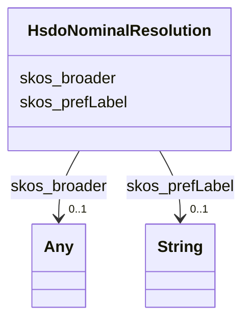

# Class: No class (type) name specified (hsdo_Nominal_Resolution)


_No class (type) description specified_


This class occurs 16 times.


URI: [hsdo:Nominal_Resolution](http://schema.org/Nominal_Resolution)





<!-- no inheritance hierarchy -->


## Slots

| Name | Cardinality and Range | Description | Inheritance | Occurrences |
| ---  | --- | --- | --- | --- |
| [skos_broader](../slots/skos_broader.md) | 0..1 <br/> [HsdoProvider](../classes/HsdoProvider.md)&nbsp;or&nbsp;<br />[HsdoModel](../classes/HsdoModel.md)&nbsp;or&nbsp;<br />[HsdoLicense](../classes/HsdoLicense.md)&nbsp;or&nbsp;<br />[HsdoMimeType](../classes/HsdoMimeType.md)&nbsp;or&nbsp;<br />[HsdoSubExperimentId](../classes/HsdoSubExperimentId.md)&nbsp;or&nbsp;<br />[HsdoVariable](../classes/HsdoVariable.md)&nbsp;or&nbsp;<br />[HsdoScienceKeyword](../classes/HsdoScienceKeyword.md)&nbsp;or&nbsp;<br />[HsdoSourceType](../classes/HsdoSourceType.md)&nbsp;or&nbsp;<br />[HsdoChronostratigraphicUnit](../classes/HsdoChronostratigraphicUnit.md)&nbsp;or&nbsp;<br />[HsdoNominalResolution](../classes/HsdoNominalResolution.md)&nbsp;or&nbsp;<br />[HsdoVerticalResolutionRange](../classes/HsdoVerticalResolutionRange.md)&nbsp;or&nbsp;<br />[HsdoDataset](../classes/HsdoDataset.md)&nbsp;or&nbsp;<br />[HsdoProject](../classes/HsdoProject.md)&nbsp;or&nbsp;<br />[HsdoTemporalResolutionRange](../classes/HsdoTemporalResolutionRange.md)&nbsp;or&nbsp;<br />[HsdoHorizontalResolutionRange](../classes/HsdoHorizontalResolutionRange.md)&nbsp;or&nbsp;<br />[HsdoPlatform](../classes/HsdoPlatform.md)&nbsp;or&nbsp;<br />[HsdoRealm](../classes/HsdoRealm.md)&nbsp;or&nbsp;<br />[HsdoExperiment](../classes/HsdoExperiment.md)&nbsp;or&nbsp;<br />[HsdoRegion](../classes/HsdoRegion.md)&nbsp;or&nbsp;<br />[HsdoModels](../classes/HsdoModels.md)&nbsp;or&nbsp;<br />[HsdoMeasurementName](../classes/HsdoMeasurementName.md)&nbsp;or&nbsp;<br />[HsdoRelatedUrlContentType](../classes/HsdoRelatedUrlContentType.md)&nbsp;or&nbsp;<br />[SkosConcept](../classes/SkosConcept.md)&nbsp;or&nbsp;<br />[HsdoLocation](../classes/HsdoLocation.md)&nbsp;or&nbsp;<br />[HsdoDataFormat](../classes/HsdoDataFormat.md)&nbsp;or&nbsp;<br />[HsdoInstrument](../classes/HsdoInstrument.md) | No slot (predicate) description specified <br/>  | direct | 15 |
| [skos_prefLabel](../slots/skos_prefLabel.md) | 0..1 <br/> [xsd:string](http://www.w3.org/2001/XMLSchema#string) | No slot (predicate) description specified <br/>  | direct | 16 |


## Usages

| used by | used in | type | used |
| ---  | --- | --- | --- |
| [HsdoActivity](../classes/HsdoActivity.md) | [skos_broader](../slots/skos_broader.md) | any_of[range] | [HsdoNominalResolution](../classes/HsdoNominalResolution.md) |
| [HsdoChronostratigraphicUnit](../classes/HsdoChronostratigraphicUnit.md) | [skos_broader](../slots/skos_broader.md) | any_of[range] | [HsdoNominalResolution](../classes/HsdoNominalResolution.md) |
| [HsdoCmip6SourceId](../classes/HsdoCmip6SourceId.md) | [skos_broader](../slots/skos_broader.md) | any_of[range] | [HsdoNominalResolution](../classes/HsdoNominalResolution.md) |
| [HsdoDataFormat](../classes/HsdoDataFormat.md) | [skos_broader](../slots/skos_broader.md) | any_of[range] | [HsdoNominalResolution](../classes/HsdoNominalResolution.md) |
| [HsdoDataset](../classes/HsdoDataset.md) | [skos_broader](../slots/skos_broader.md) | any_of[range] | [HsdoNominalResolution](../classes/HsdoNominalResolution.md) |
| [HsdoExperiment](../classes/HsdoExperiment.md) | [skos_broader](../slots/skos_broader.md) | any_of[range] | [HsdoNominalResolution](../classes/HsdoNominalResolution.md) |
| [HsdoFrequency](../classes/HsdoFrequency.md) | [skos_broader](../slots/skos_broader.md) | any_of[range] | [HsdoNominalResolution](../classes/HsdoNominalResolution.md) |
| [HsdoGridLabel](../classes/HsdoGridLabel.md) | [skos_broader](../slots/skos_broader.md) | any_of[range] | [HsdoNominalResolution](../classes/HsdoNominalResolution.md) |
| [HsdoHorizontalResolutionRange](../classes/HsdoHorizontalResolutionRange.md) | [skos_broader](../slots/skos_broader.md) | any_of[range] | [HsdoNominalResolution](../classes/HsdoNominalResolution.md) |
| [HsdoInstitution](../classes/HsdoInstitution.md) | [skos_broader](../slots/skos_broader.md) | any_of[range] | [HsdoNominalResolution](../classes/HsdoNominalResolution.md) |
| [HsdoInstrument](../classes/HsdoInstrument.md) | [skos_broader](../slots/skos_broader.md) | any_of[range] | [HsdoNominalResolution](../classes/HsdoNominalResolution.md) |
| [HsdoLicense](../classes/HsdoLicense.md) | [skos_broader](../slots/skos_broader.md) | any_of[range] | [HsdoNominalResolution](../classes/HsdoNominalResolution.md) |
| [HsdoLocation](../classes/HsdoLocation.md) | [skos_broader](../slots/skos_broader.md) | any_of[range] | [HsdoNominalResolution](../classes/HsdoNominalResolution.md) |
| [HsdoMeasurementName](../classes/HsdoMeasurementName.md) | [skos_broader](../slots/skos_broader.md) | any_of[range] | [HsdoNominalResolution](../classes/HsdoNominalResolution.md) |
| [HsdoMimeType](../classes/HsdoMimeType.md) | [skos_broader](../slots/skos_broader.md) | any_of[range] | [HsdoNominalResolution](../classes/HsdoNominalResolution.md) |
| [HsdoModel](../classes/HsdoModel.md) | [skos_broader](../slots/skos_broader.md) | any_of[range] | [HsdoNominalResolution](../classes/HsdoNominalResolution.md) |
| [HsdoModels](../classes/HsdoModels.md) | [skos_broader](../slots/skos_broader.md) | any_of[range] | [HsdoNominalResolution](../classes/HsdoNominalResolution.md) |
| [HsdoNominalResolution](../classes/HsdoNominalResolution.md) | [skos_broader](../slots/skos_broader.md) | any_of[range] | [HsdoNominalResolution](../classes/HsdoNominalResolution.md) |
| [HsdoObs4MipsSourceId](../classes/HsdoObs4MipsSourceId.md) | [skos_broader](../slots/skos_broader.md) | any_of[range] | [HsdoNominalResolution](../classes/HsdoNominalResolution.md) |
| [HsdoPlatform](../classes/HsdoPlatform.md) | [skos_broader](../slots/skos_broader.md) | any_of[range] | [HsdoNominalResolution](../classes/HsdoNominalResolution.md) |
| [HsdoProject](../classes/HsdoProject.md) | [skos_broader](../slots/skos_broader.md) | any_of[range] | [HsdoNominalResolution](../classes/HsdoNominalResolution.md) |
| [HsdoProvider](../classes/HsdoProvider.md) | [skos_broader](../slots/skos_broader.md) | any_of[range] | [HsdoNominalResolution](../classes/HsdoNominalResolution.md) |
| [HsdoRealm](../classes/HsdoRealm.md) | [skos_broader](../slots/skos_broader.md) | any_of[range] | [HsdoNominalResolution](../classes/HsdoNominalResolution.md) |
| [HsdoRegion](../classes/HsdoRegion.md) | [skos_broader](../slots/skos_broader.md) | any_of[range] | [HsdoNominalResolution](../classes/HsdoNominalResolution.md) |
| [HsdoRelatedUrlContentType](../classes/HsdoRelatedUrlContentType.md) | [skos_broader](../slots/skos_broader.md) | any_of[range] | [HsdoNominalResolution](../classes/HsdoNominalResolution.md) |
| [HsdoScienceKeyword](../classes/HsdoScienceKeyword.md) | [skos_broader](../slots/skos_broader.md) | any_of[range] | [HsdoNominalResolution](../classes/HsdoNominalResolution.md) |
| [HsdoSourceType](../classes/HsdoSourceType.md) | [skos_broader](../slots/skos_broader.md) | any_of[range] | [HsdoNominalResolution](../classes/HsdoNominalResolution.md) |
| [HsdoSubExperimentId](../classes/HsdoSubExperimentId.md) | [skos_broader](../slots/skos_broader.md) | any_of[range] | [HsdoNominalResolution](../classes/HsdoNominalResolution.md) |
| [HsdoTemporalResolutionRange](../classes/HsdoTemporalResolutionRange.md) | [skos_broader](../slots/skos_broader.md) | any_of[range] | [HsdoNominalResolution](../classes/HsdoNominalResolution.md) |
| [HsdoVariable](../classes/HsdoVariable.md) | [skos_broader](../slots/skos_broader.md) | any_of[range] | [HsdoNominalResolution](../classes/HsdoNominalResolution.md) |
| [HsdoVerticalResolutionRange](../classes/HsdoVerticalResolutionRange.md) | [skos_broader](../slots/skos_broader.md) | any_of[range] | [HsdoNominalResolution](../classes/HsdoNominalResolution.md) |
| [HsdoPaper](../classes/HsdoPaper.md) | [relation_Mention](../slots/relation_Mention.md) | any_of[range] | [HsdoNominalResolution](../classes/HsdoNominalResolution.md) |
| [SkosConcept](../classes/SkosConcept.md) | [skos_broader](../slots/skos_broader.md) | any_of[range] | [HsdoNominalResolution](../classes/HsdoNominalResolution.md) |


## LinkML Source

<!-- TODO: investigate https://stackoverflow.com/questions/37606292/how-to-create-tabbed-code-blocks-in-mkdocs-or-sphinx -->

### Direct

<details>

```yaml
name: hsdo_Nominal_Resolution
conforms_to: No schema conformance document specified
annotations:
  count:
    tag: count
    value: 16
description: No class (type) description specified
title: No class (type) name specified
from_schema: climatepub4-kg
rank: 1000
slots:
- skos_broader
- skos_prefLabel
slot_usage:
  skos_broader:
    name: skos_broader
    annotations:
      hsdo_Nominal_Resolution:
        tag: hsdo_Nominal_Resolution
        value: 15
  skos_prefLabel:
    name: skos_prefLabel
    annotations:
      string:
        tag: string
        value: 16
class_uri: hsdo:Nominal_Resolution

```
</details>

### Induced

<details>

```yaml
name: hsdo_Nominal_Resolution
conforms_to: No schema conformance document specified
annotations:
  count:
    tag: count
    value: 16
description: No class (type) description specified
title: No class (type) name specified
from_schema: climatepub4-kg
rank: 1000
slot_usage:
  skos_broader:
    name: skos_broader
    annotations:
      hsdo_Nominal_Resolution:
        tag: hsdo_Nominal_Resolution
        value: 15
  skos_prefLabel:
    name: skos_prefLabel
    annotations:
      string:
        tag: string
        value: 16
attributes:
  skos_broader:
    name: skos_broader
    annotations:
      hsdo_Nominal_Resolution:
        tag: hsdo_Nominal_Resolution
        value: 15
    description: No slot (predicate) description specified
    examples:
    - description: hsdo_Location→hsdo_Variable
      object:
        example_object: https://climateKG.org/entity/713eb469-abe4-4b6b-bad6-134187deabd8
        example_object_type: hsdo_Variable
        example_predicate: skos:broader
        example_subject: https://climateKG.org/entity/0006e246-4296-448c-9b81-a0831cad7f1c
        example_subject_type: hsdo_Location
    - description: hsdo_Location→hsdo_Location
      object:
        example_object: https://climateKG.org/entity/713eb469-abe4-4b6b-bad6-134187deabd8
        example_object_type: hsdo_Location
        example_predicate: skos:broader
        example_subject: https://climateKG.org/entity/0006e246-4296-448c-9b81-a0831cad7f1c
        example_subject_type: hsdo_Location
    - description: hsdo_Location→hsdo_Provider
      object:
        example_object: https://climateKG.org/entity/ff03e9fc-9882-4a5e-ad0b-830d8f1186cb
        example_object_type: hsdo_Provider
        example_predicate: skos:broader
        example_subject: https://climateKG.org/entity/0006e246-4296-448c-9b81-a0831cad7f1c
        example_subject_type: hsdo_Location
    - description: hsdo_Location→hsdo_Instrument
      object:
        example_object: https://climateKG.org/entity/ff03e9fc-9882-4a5e-ad0b-830d8f1186cb
        example_object_type: hsdo_Instrument
        example_predicate: skos:broader
        example_subject: https://climateKG.org/entity/0006e246-4296-448c-9b81-a0831cad7f1c
        example_subject_type: hsdo_Location
    - description: hsdo_Science_Keyword→hsdo_Science_Keyword
      object:
        example_object: https://climateKG.org/entity/1eb0ea0a-312c-4d74-8d42-6f1ad758f999
        example_object_type: hsdo_Science_Keyword
        example_predicate: skos:broader
        example_subject: https://climateKG.org/entity/001f18d3-7e61-430b-9883-1960c6256fe5
        example_subject_type: hsdo_Science_Keyword
    - description: hsdo_Variable→hsdo_Science_Keyword
      object:
        example_object: https://climateKG.org/entity/1eb0ea0a-312c-4d74-8d42-6f1ad758f999
        example_object_type: hsdo_Science_Keyword
        example_predicate: skos:broader
        example_subject: https://climateKG.org/entity/001f18d3-7e61-430b-9883-1960c6256fe5
        example_subject_type: hsdo_Variable
    - description: hsdo_Science_Keyword→hsdo_Provider
      object:
        example_object: https://climateKG.org/entity/457883c4-b30c-4d26-bed8-6c2887ebbc90
        example_object_type: hsdo_Provider
        example_predicate: skos:broader
        example_subject: https://climateKG.org/entity/001f18d3-7e61-430b-9883-1960c6256fe5
        example_subject_type: hsdo_Science_Keyword
    - description: hsdo_Variable→hsdo_Provider
      object:
        example_object: https://climateKG.org/entity/457883c4-b30c-4d26-bed8-6c2887ebbc90
        example_object_type: hsdo_Provider
        example_predicate: skos:broader
        example_subject: https://climateKG.org/entity/001f18d3-7e61-430b-9883-1960c6256fe5
        example_subject_type: hsdo_Variable
    - description: hsdo_Science_Keyword→hsdo_Model
      object:
        example_object: https://climateKG.org/entity/91697b7d-8f2b-4954-850e-61d5f61c867d
        example_object_type: hsdo_Model
        example_predicate: skos:broader
        example_subject: https://climateKG.org/entity/001f18d3-7e61-430b-9883-1960c6256fe5
        example_subject_type: hsdo_Science_Keyword
    - description: hsdo_Science_Keyword→hsdo_Location
      object:
        example_object: https://climateKG.org/entity/91697b7d-8f2b-4954-850e-61d5f61c867d
        example_object_type: hsdo_Location
        example_predicate: skos:broader
        example_subject: https://climateKG.org/entity/001f18d3-7e61-430b-9883-1960c6256fe5
        example_subject_type: hsdo_Science_Keyword
    - description: hsdo_Variable→hsdo_Model
      object:
        example_object: https://climateKG.org/entity/91697b7d-8f2b-4954-850e-61d5f61c867d
        example_object_type: hsdo_Model
        example_predicate: skos:broader
        example_subject: https://climateKG.org/entity/001f18d3-7e61-430b-9883-1960c6256fe5
        example_subject_type: hsdo_Variable
    - description: hsdo_Variable→hsdo_Location
      object:
        example_object: https://climateKG.org/entity/91697b7d-8f2b-4954-850e-61d5f61c867d
        example_object_type: hsdo_Location
        example_predicate: skos:broader
        example_subject: https://climateKG.org/entity/001f18d3-7e61-430b-9883-1960c6256fe5
        example_subject_type: hsdo_Variable
    - description: hsdo_Science_Keyword→hsdo_Variable
      object:
        example_object: https://climateKG.org/entity/58f39353-7e1c-4884-9501-376cd0377fbf
        example_object_type: hsdo_Variable
        example_predicate: skos:broader
        example_subject: https://climateKG.org/entity/003466f4-9ee7-4d3b-81ff-2013add292e2
        example_subject_type: hsdo_Science_Keyword
    - description: hsdo_Variable→hsdo_Variable
      object:
        example_object: https://climateKG.org/entity/58f39353-7e1c-4884-9501-376cd0377fbf
        example_object_type: hsdo_Variable
        example_predicate: skos:broader
        example_subject: https://climateKG.org/entity/003466f4-9ee7-4d3b-81ff-2013add292e2
        example_subject_type: hsdo_Variable
    - description: hsdo_Science_Keyword→hsdo_Project
      object:
        example_object: https://climateKG.org/entity/c47f6052-634e-40ef-a5ac-13f69f6f4c2a
        example_object_type: hsdo_Project
        example_predicate: skos:broader
        example_subject: https://climateKG.org/entity/005d192a-95b9-4fc2-afed-f87da3c3dc33
        example_subject_type: hsdo_Science_Keyword
    - description: hsdo_Variable→hsdo_Project
      object:
        example_object: https://climateKG.org/entity/c47f6052-634e-40ef-a5ac-13f69f6f4c2a
        example_object_type: hsdo_Project
        example_predicate: skos:broader
        example_subject: https://climateKG.org/entity/006b1ea6-222d-4740-b220-03886d49cd81
        example_subject_type: hsdo_Variable
    - description: hsdo_Platform→hsdo_Provider
      object:
        example_object: https://climateKG.org/entity/3466eed1-2fbb-49bf-ab0b-dc08731d502b
        example_object_type: hsdo_Provider
        example_predicate: skos:broader
        example_subject: https://climateKG.org/entity/007c3084-89db-458e-8387-14e192b6cb8e
        example_subject_type: hsdo_Platform
    - description: hsdo_Platform→hsdo_Instrument
      object:
        example_object: https://climateKG.org/entity/3466eed1-2fbb-49bf-ab0b-dc08731d502b
        example_object_type: hsdo_Instrument
        example_predicate: skos:broader
        example_subject: https://climateKG.org/entity/007c3084-89db-458e-8387-14e192b6cb8e
        example_subject_type: hsdo_Platform
    - description: hsdo_Platform→hsdo_Platform
      object:
        example_object: https://climateKG.org/entity/3466eed1-2fbb-49bf-ab0b-dc08731d502b
        example_object_type: hsdo_Platform
        example_predicate: skos:broader
        example_subject: https://climateKG.org/entity/007c3084-89db-458e-8387-14e192b6cb8e
        example_subject_type: hsdo_Platform
    - description: hsdo_Project→hsdo_Project
      object:
        example_object: https://climateKG.org/entity/0c89f3f4-7ab1-43ce-89ee-795d35f0e30a
        example_object_type: hsdo_Project
        example_predicate: skos:broader
        example_subject: https://climateKG.org/entity/00923bad-d9ac-4093-aca3-83d3e9ae3171
        example_subject_type: hsdo_Project
    - description: hsdo_Platform→hsdo_Project
      object:
        example_object: https://climateKG.org/entity/0c89f3f4-7ab1-43ce-89ee-795d35f0e30a
        example_object_type: hsdo_Project
        example_predicate: skos:broader
        example_subject: https://climateKG.org/entity/00923bad-d9ac-4093-aca3-83d3e9ae3171
        example_subject_type: hsdo_Platform
    - description: hsdo_Location→hsdo_Project
      object:
        example_object: https://climateKG.org/entity/0c89f3f4-7ab1-43ce-89ee-795d35f0e30a
        example_object_type: hsdo_Project
        example_predicate: skos:broader
        example_subject: https://climateKG.org/entity/00923bad-d9ac-4093-aca3-83d3e9ae3171
        example_subject_type: hsdo_Location
    - description: hsdo_Project→hsdo_Provider
      object:
        example_object: https://climateKG.org/entity/fb0b9fcd-5c96-4989-8c64-a479bbed83ab
        example_object_type: hsdo_Provider
        example_predicate: skos:broader
        example_subject: https://climateKG.org/entity/00923bad-d9ac-4093-aca3-83d3e9ae3171
        example_subject_type: hsdo_Project
    - description: hsdo_Location→hsdo_Model
      object:
        example_object: https://climateKG.org/entity/88bc8b39-ad19-4415-b426-e7d37450341a
        example_object_type: hsdo_Model
        example_predicate: skos:broader
        example_subject: https://climateKG.org/entity/009ebc80-5561-40d1-98d9-13cbc5bd1591
        example_subject_type: hsdo_Location
    - description: hsdo_Science_Keyword→hsdo_Platform
      object:
        example_object: https://climateKG.org/entity/fa0a36c3-2503-4662-98cd-7f3e74ce9f80
        example_object_type: hsdo_Platform
        example_predicate: skos:broader
        example_subject: https://climateKG.org/entity/00a21e9c-0c1d-4931-b9fa-b0204625a98a
        example_subject_type: hsdo_Science_Keyword
    - description: hsdo_Variable→hsdo_Platform
      object:
        example_object: https://climateKG.org/entity/fa0a36c3-2503-4662-98cd-7f3e74ce9f80
        example_object_type: hsdo_Platform
        example_predicate: skos:broader
        example_subject: https://climateKG.org/entity/00a21e9c-0c1d-4931-b9fa-b0204625a98a
        example_subject_type: hsdo_Variable
    - description: hsdo_Provider→hsdo_Project
      object:
        example_object: https://climateKG.org/entity/4eb1894b-35b4-406b-8864-944a42bc7702
        example_object_type: hsdo_Project
        example_predicate: skos:broader
        example_subject: https://climateKG.org/entity/00a97d0c-e05e-43c9-93d0-3c7a2527b3c0
        example_subject_type: hsdo_Provider
    - description: hsdo_Activity→hsdo_Project
      object:
        example_object: https://climateKG.org/entity/4eb1894b-35b4-406b-8864-944a42bc7702
        example_object_type: hsdo_Project
        example_predicate: skos:broader
        example_subject: https://climateKG.org/entity/00a97d0c-e05e-43c9-93d0-3c7a2527b3c0
        example_subject_type: hsdo_Activity
    - description: hsdo_Provider→hsdo_Provider
      object:
        example_object: https://climateKG.org/entity/fb0b9fcd-5c96-4989-8c64-a479bbed83ab
        example_object_type: hsdo_Provider
        example_predicate: skos:broader
        example_subject: https://climateKG.org/entity/00a97d0c-e05e-43c9-93d0-3c7a2527b3c0
        example_subject_type: hsdo_Provider
    - description: hsdo_Activity→hsdo_Provider
      object:
        example_object: https://climateKG.org/entity/fb0b9fcd-5c96-4989-8c64-a479bbed83ab
        example_object_type: hsdo_Provider
        example_predicate: skos:broader
        example_subject: https://climateKG.org/entity/00a97d0c-e05e-43c9-93d0-3c7a2527b3c0
        example_subject_type: hsdo_Activity
    - description: hsdo_Model→hsdo_Provider
      object:
        example_object: https://climateKG.org/entity/3466eed1-2fbb-49bf-ab0b-dc08731d502b
        example_object_type: hsdo_Provider
        example_predicate: skos:broader
        example_subject: https://climateKG.org/entity/00bb59aa-755d-4710-a097-f1e2836f4032
        example_subject_type: hsdo_Model
    - description: hsdo_Model→hsdo_Instrument
      object:
        example_object: https://climateKG.org/entity/3466eed1-2fbb-49bf-ab0b-dc08731d502b
        example_object_type: hsdo_Instrument
        example_predicate: skos:broader
        example_subject: https://climateKG.org/entity/00bb59aa-755d-4710-a097-f1e2836f4032
        example_subject_type: hsdo_Model
    - description: hsdo_Model→hsdo_Platform
      object:
        example_object: https://climateKG.org/entity/3466eed1-2fbb-49bf-ab0b-dc08731d502b
        example_object_type: hsdo_Platform
        example_predicate: skos:broader
        example_subject: https://climateKG.org/entity/00bb59aa-755d-4710-a097-f1e2836f4032
        example_subject_type: hsdo_Model
    - description: hsdo_Chronostratigraphic_Unit→hsdo_Chronostratigraphic_Unit
      object:
        example_object: https://climateKG.org/entity/02f8be65-6bdd-4f4d-9e69-adac5aec33f6
        example_object_type: hsdo_Chronostratigraphic_Unit
        example_predicate: skos:broader
        example_subject: https://climateKG.org/entity/00c6f0f3-5734-4500-a69e-f6780e365985
        example_subject_type: hsdo_Chronostratigraphic_Unit
    - description: hsdo_Chronostratigraphic_Unit→hsdo_Location
      object:
        example_object: https://climateKG.org/entity/af145656-986a-4969-bb77-6e5b2cff1ede
        example_object_type: hsdo_Location
        example_predicate: skos:broader
        example_subject: https://climateKG.org/entity/00c6f0f3-5734-4500-a69e-f6780e365985
        example_subject_type: hsdo_Chronostratigraphic_Unit
    - description: hsdo_Experiment→hsdo_Project
      object:
        example_object: https://climateKG.org/entity/af0968ce-ffe3-44a0-86de-2ec9b9a8fa5d
        example_object_type: hsdo_Project
        example_predicate: skos:broader
        example_subject: https://climateKG.org/entity/00ce4800-70ef-4346-aa15-0554280d0896
        example_subject_type: hsdo_Experiment
    - description: hsdo_Model→hsdo_Project
      object:
        example_object: https://climateKG.org/entity/af0968ce-ffe3-44a0-86de-2ec9b9a8fa5d
        example_object_type: hsdo_Project
        example_predicate: skos:broader
        example_subject: https://climateKG.org/entity/00ce4800-70ef-4346-aa15-0554280d0896
        example_subject_type: hsdo_Model
    - description: hsdo_Experiment→hsdo_Provider
      object:
        example_object: https://climateKG.org/entity/fb0b9fcd-5c96-4989-8c64-a479bbed83ab
        example_object_type: hsdo_Provider
        example_predicate: skos:broader
        example_subject: https://climateKG.org/entity/00ce4800-70ef-4346-aa15-0554280d0896
        example_subject_type: hsdo_Experiment
    - description: hsdo_Instrument→hsdo_Instrument
      object:
        example_object: https://climateKG.org/entity/02c354fd-8e2d-4825-b786-aa4b0782d1d6
        example_object_type: hsdo_Instrument
        example_predicate: skos:broader
        example_subject: https://climateKG.org/entity/01407ecf-45af-4fcc-8a1b-9b383636e2e4
        example_subject_type: hsdo_Instrument
    - description: hsdo_Instrument→hsdo_Experiment
      object:
        example_object: https://climateKG.org/entity/b2140059-b3ca-415c-b0a7-3e142783ffe8
        example_object_type: hsdo_Experiment
        example_predicate: skos:broader
        example_subject: https://climateKG.org/entity/01407ecf-45af-4fcc-8a1b-9b383636e2e4
        example_subject_type: hsdo_Instrument
    - description: hsdo_Instrument→hsdo_Provider
      object:
        example_object: https://climateKG.org/entity/b2140059-b3ca-415c-b0a7-3e142783ffe8
        example_object_type: hsdo_Provider
        example_predicate: skos:broader
        example_subject: https://climateKG.org/entity/01407ecf-45af-4fcc-8a1b-9b383636e2e4
        example_subject_type: hsdo_Instrument
    - description: hsdo_Instrument→hsdo_Location
      object:
        example_object: https://climateKG.org/entity/b2140059-b3ca-415c-b0a7-3e142783ffe8
        example_object_type: hsdo_Location
        example_predicate: skos:broader
        example_subject: https://climateKG.org/entity/01407ecf-45af-4fcc-8a1b-9b383636e2e4
        example_subject_type: hsdo_Instrument
    - description: hsdo_Instrument→hsdo_Variable
      object:
        example_object: https://climateKG.org/entity/b2140059-b3ca-415c-b0a7-3e142783ffe8
        example_object_type: hsdo_Variable
        example_predicate: skos:broader
        example_subject: https://climateKG.org/entity/01407ecf-45af-4fcc-8a1b-9b383636e2e4
        example_subject_type: hsdo_Instrument
    - description: hsdo_Location→hsdo_Science_Keyword
      object:
        example_object: https://climateKG.org/entity/1eb0ea0a-312c-4d74-8d42-6f1ad758f999
        example_object_type: hsdo_Science_Keyword
        example_predicate: skos:broader
        example_subject: https://climateKG.org/entity/01a84bc1-a571-4d23-b57f-1b04fd9542a6
        example_subject_type: hsdo_Location
    - description: hsdo_Variable→hsdo_Experiment
      object:
        example_object: https://climateKG.org/entity/b2140059-b3ca-415c-b0a7-3e142783ffe8
        example_object_type: hsdo_Experiment
        example_predicate: skos:broader
        example_subject: https://climateKG.org/entity/01cc0beb-7c9a-40ed-ad86-0661b41aee53
        example_subject_type: hsdo_Variable
    - description: hsdo_Variable→hsdo_Instrument
      object:
        example_object: https://climateKG.org/entity/b2140059-b3ca-415c-b0a7-3e142783ffe8
        example_object_type: hsdo_Instrument
        example_predicate: skos:broader
        example_subject: https://climateKG.org/entity/01cc0beb-7c9a-40ed-ad86-0661b41aee53
        example_subject_type: hsdo_Variable
    - description: hsdo_Realm→hsdo_Realm
      object:
        example_object: https://climateKG.org/entity/61cd0af2-2f62-4aa4-b6c3-f683e975c820
        example_object_type: hsdo_Realm
        example_predicate: skos:broader
        example_subject: https://climateKG.org/entity/021d2b85-4728-4434-b429-082874cfab69
        example_subject_type: hsdo_Realm
    - description: hsdo_Realm→hsdo_Location
      object:
        example_object: https://climateKG.org/entity/61cd0af2-2f62-4aa4-b6c3-f683e975c820
        example_object_type: hsdo_Location
        example_predicate: skos:broader
        example_subject: https://climateKG.org/entity/021d2b85-4728-4434-b429-082874cfab69
        example_subject_type: hsdo_Realm
    - description: hsdo_Provider→hsdo_Instrument
      object:
        example_object: https://climateKG.org/entity/055a79c7-61db-4250-abad-f1e09909f14c
        example_object_type: hsdo_Instrument
        example_predicate: skos:broader
        example_subject: https://climateKG.org/entity/0252ac58-9091-4879-85e0-dc765d636e62
        example_subject_type: hsdo_Provider
    - description: hsdo_Provider→hsdo_Experiment
      object:
        example_object: https://climateKG.org/entity/b2140059-b3ca-415c-b0a7-3e142783ffe8
        example_object_type: hsdo_Experiment
        example_predicate: skos:broader
        example_subject: https://climateKG.org/entity/0252ac58-9091-4879-85e0-dc765d636e62
        example_subject_type: hsdo_Provider
    - description: hsdo_Provider→hsdo_Location
      object:
        example_object: https://climateKG.org/entity/b2140059-b3ca-415c-b0a7-3e142783ffe8
        example_object_type: hsdo_Location
        example_predicate: skos:broader
        example_subject: https://climateKG.org/entity/0252ac58-9091-4879-85e0-dc765d636e62
        example_subject_type: hsdo_Provider
    - description: hsdo_Provider→hsdo_Variable
      object:
        example_object: https://climateKG.org/entity/b2140059-b3ca-415c-b0a7-3e142783ffe8
        example_object_type: hsdo_Variable
        example_predicate: skos:broader
        example_subject: https://climateKG.org/entity/0252ac58-9091-4879-85e0-dc765d636e62
        example_subject_type: hsdo_Provider
    - description: hsdo_Instrument→hsdo_Project
      object:
        example_object: https://climateKG.org/entity/4eb1894b-35b4-406b-8864-944a42bc7702
        example_object_type: hsdo_Project
        example_predicate: skos:broader
        example_subject: https://climateKG.org/entity/026d8833-f593-4554-85b0-ac89df1f21c5
        example_subject_type: hsdo_Instrument
    - description: hsdo_Provider→hsdo_Science_Keyword
      object:
        example_object: https://climateKG.org/entity/1eb0ea0a-312c-4d74-8d42-6f1ad758f999
        example_object_type: hsdo_Science_Keyword
        example_predicate: skos:broader
        example_subject: https://climateKG.org/entity/028fe075-8ed0-47f0-b462-71e4adf72a4e
        example_subject_type: hsdo_Provider
    - description: hsdo_Models→hsdo_Science_Keyword
      object:
        example_object: https://climateKG.org/entity/1eb0ea0a-312c-4d74-8d42-6f1ad758f999
        example_object_type: hsdo_Science_Keyword
        example_predicate: skos:broader
        example_subject: https://climateKG.org/entity/028fe075-8ed0-47f0-b462-71e4adf72a4e
        example_subject_type: hsdo_Models
    - description: hsdo_Science_Keyword→hsdo_Instrument
      object:
        example_object: https://climateKG.org/entity/2e5a401b-1507-4f57-82b8-36557c13b154
        example_object_type: hsdo_Instrument
        example_predicate: skos:broader
        example_subject: https://climateKG.org/entity/02ea239e-4bca-4fda-ab87-be12c723c30a
        example_subject_type: hsdo_Science_Keyword
    - description: hsdo_Experiment→hsdo_Experiment
      object:
        example_object: https://climateKG.org/entity/d69f7457-db31-48ce-b8c2-98058c412bc6
        example_object_type: hsdo_Experiment
        example_predicate: skos:broader
        example_subject: https://climateKG.org/entity/033c6854-b6b0-47b7-b41d-6c482932f336
        example_subject_type: hsdo_Experiment
    - description: hsdo_Experiment→hsdo_Platform
      object:
        example_object: https://climateKG.org/entity/d69f7457-db31-48ce-b8c2-98058c412bc6
        example_object_type: hsdo_Platform
        example_predicate: skos:broader
        example_subject: https://climateKG.org/entity/033c6854-b6b0-47b7-b41d-6c482932f336
        example_subject_type: hsdo_Experiment
    - description: hsdo_Experiment→hsdo_Location
      object:
        example_object: https://climateKG.org/entity/d69f7457-db31-48ce-b8c2-98058c412bc6
        example_object_type: hsdo_Location
        example_predicate: skos:broader
        example_subject: https://climateKG.org/entity/033c6854-b6b0-47b7-b41d-6c482932f336
        example_subject_type: hsdo_Experiment
    - description: hsdo_Experiment→hsdo_Variable
      object:
        example_object: https://climateKG.org/entity/d69f7457-db31-48ce-b8c2-98058c412bc6
        example_object_type: hsdo_Variable
        example_predicate: skos:broader
        example_subject: https://climateKG.org/entity/033c6854-b6b0-47b7-b41d-6c482932f336
        example_subject_type: hsdo_Experiment
    - description: hsdo_Model→hsdo_Science_Keyword
      object:
        example_object: https://climateKG.org/entity/1eb0ea0a-312c-4d74-8d42-6f1ad758f999
        example_object_type: hsdo_Science_Keyword
        example_predicate: skos:broader
        example_subject: https://climateKG.org/entity/0384fecd-9303-47f3-84e3-f01f58013fc3
        example_subject_type: hsdo_Model
    - description: hsdo_Model→hsdo_Model
      object:
        example_object: https://climateKG.org/entity/23703b6b-ee15-4512-b5b2-f441547e2edf
        example_object_type: hsdo_Model
        example_predicate: skos:broader
        example_subject: https://climateKG.org/entity/0384fecd-9303-47f3-84e3-f01f58013fc3
        example_subject_type: hsdo_Model
    - description: hsdo_Model→hsdo_Variable
      object:
        example_object: https://climateKG.org/entity/23703b6b-ee15-4512-b5b2-f441547e2edf
        example_object_type: hsdo_Variable
        example_predicate: skos:broader
        example_subject: https://climateKG.org/entity/0384fecd-9303-47f3-84e3-f01f58013fc3
        example_subject_type: hsdo_Model
    - description: hsdo_Model→hsdo_Experiment
      object:
        example_object: https://climateKG.org/entity/b887d3e5-4280-43d2-a34e-0f63ac086b6a
        example_object_type: hsdo_Experiment
        example_predicate: skos:broader
        example_subject: https://climateKG.org/entity/0384fecd-9303-47f3-84e3-f01f58013fc3
        example_subject_type: hsdo_Model
    - description: hsdo_Science_Keyword→hsdo_Experiment
      object:
        example_object: https://climateKG.org/entity/b887d3e5-4280-43d2-a34e-0f63ac086b6a
        example_object_type: hsdo_Experiment
        example_predicate: skos:broader
        example_subject: https://climateKG.org/entity/0384fecd-9303-47f3-84e3-f01f58013fc3
        example_subject_type: hsdo_Science_Keyword
    - description: hsdo_Measurement_Name→hsdo_Instrument
      object:
        example_object: https://climateKG.org/entity/2bc6e372-93d8-4672-96b1-ec159aff2e19
        example_object_type: hsdo_Instrument
        example_predicate: skos:broader
        example_subject: https://climateKG.org/entity/038ac74c-470a-43e0-b80d-2b2fb1acfc13
        example_subject_type: hsdo_Measurement_Name
    - description: hsdo_Measurement_Name→hsdo_Measurement_Name
      object:
        example_object: https://climateKG.org/entity/2bc6e372-93d8-4672-96b1-ec159aff2e19
        example_object_type: hsdo_Measurement_Name
        example_predicate: skos:broader
        example_subject: https://climateKG.org/entity/038ac74c-470a-43e0-b80d-2b2fb1acfc13
        example_subject_type: hsdo_Measurement_Name
    - description: hsdo_Measurement_Name→hsdo_Variable
      object:
        example_object: https://climateKG.org/entity/2bc6e372-93d8-4672-96b1-ec159aff2e19
        example_object_type: hsdo_Variable
        example_predicate: skos:broader
        example_subject: https://climateKG.org/entity/038ac74c-470a-43e0-b80d-2b2fb1acfc13
        example_subject_type: hsdo_Measurement_Name
    - description: hsdo_Measurement_Name→hsdo_Location
      object:
        example_object: https://climateKG.org/entity/ee0357cd-8f1c-4b62-8e97-51ebc91c4bb9
        example_object_type: hsdo_Location
        example_predicate: skos:broader
        example_subject: https://climateKG.org/entity/038ac74c-470a-43e0-b80d-2b2fb1acfc13
        example_subject_type: hsdo_Measurement_Name
    - description: hsdo_Institution→hsdo_Provider
      object:
        example_object: https://climateKG.org/entity/a158f804-b000-4013-9513-cee7790381c3
        example_object_type: hsdo_Provider
        example_predicate: skos:broader
        example_subject: https://climateKG.org/entity/03976e48-3ff9-4dc6-a4c4-fd77026380ff
        example_subject_type: hsdo_Institution
    - description: hsdo_Platform→hsdo_Science_Keyword
      object:
        example_object: https://climateKG.org/entity/1eb0ea0a-312c-4d74-8d42-6f1ad758f999
        example_object_type: hsdo_Science_Keyword
        example_predicate: skos:broader
        example_subject: https://climateKG.org/entity/0399b52c-e3de-4dcc-9eb6-b1e3acf2cf1b
        example_subject_type: hsdo_Platform
    - description: hsdo_Platform→hsdo_Location
      object:
        example_object: https://climateKG.org/entity/91c64c46-d040-4daa-b26c-61952fdfaf50
        example_object_type: hsdo_Location
        example_predicate: skos:broader
        example_subject: https://climateKG.org/entity/0399b52c-e3de-4dcc-9eb6-b1e3acf2cf1b
        example_subject_type: hsdo_Platform
    - description: hsdo_Model→hsdo_Location
      object:
        example_object: https://climateKG.org/entity/91c64c46-d040-4daa-b26c-61952fdfaf50
        example_object_type: hsdo_Location
        example_predicate: skos:broader
        example_subject: https://climateKG.org/entity/0399b52c-e3de-4dcc-9eb6-b1e3acf2cf1b
        example_subject_type: hsdo_Model
    - description: hsdo_Provider→hsdo_Platform
      object:
        example_object: https://climateKG.org/entity/c6455081-132d-4661-bb5f-22edf2f90800
        example_object_type: hsdo_Platform
        example_predicate: skos:broader
        example_subject: https://climateKG.org/entity/0399b52c-e3de-4dcc-9eb6-b1e3acf2cf1b
        example_subject_type: hsdo_Provider
    - description: hsdo_Provider→hsdo_Model
      object:
        example_object: https://climateKG.org/entity/c6455081-132d-4661-bb5f-22edf2f90800
        example_object_type: hsdo_Model
        example_predicate: skos:broader
        example_subject: https://climateKG.org/entity/0399b52c-e3de-4dcc-9eb6-b1e3acf2cf1b
        example_subject_type: hsdo_Provider
    - description: hsdo_Platform→hsdo_Model
      object:
        example_object: https://climateKG.org/entity/c6455081-132d-4661-bb5f-22edf2f90800
        example_object_type: hsdo_Model
        example_predicate: skos:broader
        example_subject: https://climateKG.org/entity/0399b52c-e3de-4dcc-9eb6-b1e3acf2cf1b
        example_subject_type: hsdo_Platform
    - description: hsdo_Platform→hsdo_Variable
      object:
        example_object: https://climateKG.org/entity/c6455081-132d-4661-bb5f-22edf2f90800
        example_object_type: hsdo_Variable
        example_predicate: skos:broader
        example_subject: https://climateKG.org/entity/0399b52c-e3de-4dcc-9eb6-b1e3acf2cf1b
        example_subject_type: hsdo_Platform
    - description: hsdo_Platform→hsdo_Experiment
      object:
        example_object: https://climateKG.org/entity/f1a25060-330c-4f84-9633-ed59ae8c64bf
        example_object_type: hsdo_Experiment
        example_predicate: skos:broader
        example_subject: https://climateKG.org/entity/0399b52c-e3de-4dcc-9eb6-b1e3acf2cf1b
        example_subject_type: hsdo_Platform
    - description: hsdo_Project→hsdo_Science_Keyword
      object:
        example_object: https://climateKG.org/entity/1eb0ea0a-312c-4d74-8d42-6f1ad758f999
        example_object_type: hsdo_Science_Keyword
        example_predicate: skos:broader
        example_subject: https://climateKG.org/entity/03d38261-1c90-491b-bc4e-cc4e703e1dff
        example_subject_type: hsdo_Project
    - description: hsdo_Instrument→hsdo_Science_Keyword
      object:
        example_object: https://climateKG.org/entity/1eb0ea0a-312c-4d74-8d42-6f1ad758f999
        example_object_type: hsdo_Science_Keyword
        example_predicate: skos:broader
        example_subject: https://climateKG.org/entity/03d38261-1c90-491b-bc4e-cc4e703e1dff
        example_subject_type: hsdo_Instrument
    - description: hsdo_Experiment→hsdo_Science_Keyword
      object:
        example_object: https://climateKG.org/entity/1eb0ea0a-312c-4d74-8d42-6f1ad758f999
        example_object_type: hsdo_Science_Keyword
        example_predicate: skos:broader
        example_subject: https://climateKG.org/entity/03fbea0a-74b9-4c78-8752-a588cff27f17
        example_subject_type: hsdo_Experiment
    - description: hsdo_Experiment→hsdo_Model
      object:
        example_object: https://climateKG.org/entity/91697b7d-8f2b-4954-850e-61d5f61c867d
        example_object_type: hsdo_Model
        example_predicate: skos:broader
        example_subject: https://climateKG.org/entity/03fbea0a-74b9-4c78-8752-a588cff27f17
        example_subject_type: hsdo_Experiment
    - description: hsdo_Project→hsdo_Platform
      object:
        example_object: https://climateKG.org/entity/0a184cdc-c074-4946-90a6-02f03c686341
        example_object_type: hsdo_Platform
        example_predicate: skos:broader
        example_subject: https://climateKG.org/entity/04d24dfe-c9f7-43b6-8bd8-8f2613767257
        example_subject_type: hsdo_Project
    - description: hsdo_Project→hsdo_Model
      object:
        example_object: https://climateKG.org/entity/0a184cdc-c074-4946-90a6-02f03c686341
        example_object_type: hsdo_Model
        example_predicate: skos:broader
        example_subject: https://climateKG.org/entity/04d24dfe-c9f7-43b6-8bd8-8f2613767257
        example_subject_type: hsdo_Project
    - description: hsdo_Project→hsdo_Variable
      object:
        example_object: https://climateKG.org/entity/0a184cdc-c074-4946-90a6-02f03c686341
        example_object_type: hsdo_Variable
        example_predicate: skos:broader
        example_subject: https://climateKG.org/entity/04d24dfe-c9f7-43b6-8bd8-8f2613767257
        example_subject_type: hsdo_Project
    - description: hsdo_Project→hsdo_Instrument
      object:
        example_object: https://climateKG.org/entity/f3261de5-34c1-4980-af22-f9d7e7206d12
        example_object_type: hsdo_Instrument
        example_predicate: skos:broader
        example_subject: https://climateKG.org/entity/04d24dfe-c9f7-43b6-8bd8-8f2613767257
        example_subject_type: hsdo_Project
    - description: hsdo_Sub_Experiment_Id→hsdo_Sub_Experiment_Id
      object:
        example_object: https://climateKG.org/entity/2eecd388-25be-4367-90c6-0d683ef476ac
        example_object_type: hsdo_Sub_Experiment_Id
        example_predicate: skos:broader
        example_subject: https://climateKG.org/entity/04e00ed0-39b6-4323-a788-2344264695c0
        example_subject_type: hsdo_Sub_Experiment_Id
    - description: hsdo_Variable→hsdo_Sub_Experiment_Id
      object:
        example_object: https://climateKG.org/entity/2eecd388-25be-4367-90c6-0d683ef476ac
        example_object_type: hsdo_Sub_Experiment_Id
        example_predicate: skos:broader
        example_subject: https://climateKG.org/entity/04e00ed0-39b6-4323-a788-2344264695c0
        example_subject_type: hsdo_Variable
    - description: hsdo_Instrument→hsdo_Model
      object:
        example_object: https://climateKG.org/entity/91697b7d-8f2b-4954-850e-61d5f61c867d
        example_object_type: hsdo_Model
        example_predicate: skos:broader
        example_subject: https://climateKG.org/entity/0517ae1f-7617-4f3b-80cb-649178032825
        example_subject_type: hsdo_Instrument
    - description: hsdo_Project→hsdo_Location
      object:
        example_object: https://climateKG.org/entity/713eb469-abe4-4b6b-bad6-134187deabd8
        example_object_type: hsdo_Location
        example_predicate: skos:broader
        example_subject: https://climateKG.org/entity/05af56f1-42b1-4205-8b85-0f3470f30011
        example_subject_type: hsdo_Project
    - description: hsdo_Location→hsdo_Platform
      object:
        example_object: https://climateKG.org/entity/3466eed1-2fbb-49bf-ab0b-dc08731d502b
        example_object_type: hsdo_Platform
        example_predicate: skos:broader
        example_subject: https://climateKG.org/entity/05d8035f-176b-451a-a52b-43d2cc6286bb
        example_subject_type: hsdo_Location
    - description: hsdo_Instrument→hsdo_Platform
      object:
        example_object: https://climateKG.org/entity/a956d045-3b12-441c-8a18-fac7d33b2b4e
        example_object_type: hsdo_Platform
        example_predicate: skos:broader
        example_subject: https://climateKG.org/entity/06053150-d796-477b-b305-292442d658ed
        example_subject_type: hsdo_Instrument
    - description: hsdo_Location→hsdo_Experiment
      object:
        example_object: https://climateKG.org/entity/a956d045-3b12-441c-8a18-fac7d33b2b4e
        example_object_type: hsdo_Experiment
        example_predicate: skos:broader
        example_subject: https://climateKG.org/entity/06053150-d796-477b-b305-292442d658ed
        example_subject_type: hsdo_Location
    - description: hsdo_Data_Format→hsdo_Model
      object:
        example_object: https://climateKG.org/entity/8e770fe1-6e82-43aa-9f8a-75d217d7e6cb
        example_object_type: hsdo_Model
        example_predicate: skos:broader
        example_subject: https://climateKG.org/entity/0679d78d-0931-4948-94ec-46ab130785a6
        example_subject_type: hsdo_Data_Format
    - description: hsdo_Data_Format→hsdo_Data_Format
      object:
        example_object: https://climateKG.org/entity/8e770fe1-6e82-43aa-9f8a-75d217d7e6cb
        example_object_type: hsdo_Data_Format
        example_predicate: skos:broader
        example_subject: https://climateKG.org/entity/0679d78d-0931-4948-94ec-46ab130785a6
        example_subject_type: hsdo_Data_Format
    - description: hsdo_Variable→hsdo_Data_Format
      object:
        example_object: https://climateKG.org/entity/8e770fe1-6e82-43aa-9f8a-75d217d7e6cb
        example_object_type: hsdo_Data_Format
        example_predicate: skos:broader
        example_subject: https://climateKG.org/entity/0679d78d-0931-4948-94ec-46ab130785a6
        example_subject_type: hsdo_Variable
    - description: hsdo_Provider→hsdo_Data_Format
      object:
        example_object: https://climateKG.org/entity/8e770fe1-6e82-43aa-9f8a-75d217d7e6cb
        example_object_type: hsdo_Data_Format
        example_predicate: skos:broader
        example_subject: https://climateKG.org/entity/08208d5b-1311-4c14-b8c1-5f64f75cb392
        example_subject_type: hsdo_Provider
    - description: hsdo_Location→hsdo_Data_Format
      object:
        example_object: https://climateKG.org/entity/8e770fe1-6e82-43aa-9f8a-75d217d7e6cb
        example_object_type: hsdo_Data_Format
        example_predicate: skos:broader
        example_subject: https://climateKG.org/entity/08208d5b-1311-4c14-b8c1-5f64f75cb392
        example_subject_type: hsdo_Location
    - description: hsdo_Vertical_Resolution_Range→hsdo_Vertical_Resolution_Range
      object:
        example_object: https://climateKG.org/entity/9728ca44-7bb3-40a4-9dd2-49470ad47fa5
        example_object_type: hsdo_Vertical_Resolution_Range
        example_predicate: skos:broader
        example_subject: https://climateKG.org/entity/0893353d-4e8c-4b31-bcc5-fce552ccfff3
        example_subject_type: hsdo_Vertical_Resolution_Range
    - description: hsdo_Vertical_Resolution_Range→hsdo_Variable
      object:
        example_object: https://climateKG.org/entity/9728ca44-7bb3-40a4-9dd2-49470ad47fa5
        example_object_type: hsdo_Variable
        example_predicate: skos:broader
        example_subject: https://climateKG.org/entity/0893353d-4e8c-4b31-bcc5-fce552ccfff3
        example_subject_type: hsdo_Vertical_Resolution_Range
    - description: hsdo_Variable→hsdo_Vertical_Resolution_Range
      object:
        example_object: https://climateKG.org/entity/9728ca44-7bb3-40a4-9dd2-49470ad47fa5
        example_object_type: hsdo_Vertical_Resolution_Range
        example_predicate: skos:broader
        example_subject: https://climateKG.org/entity/0893353d-4e8c-4b31-bcc5-fce552ccfff3
        example_subject_type: hsdo_Variable
    - description: hsdo_Region→hsdo_Region
      object:
        example_object: https://climateKG.org/entity/559411a8-5fe5-4d2c-ad6b-30849e650396
        example_object_type: hsdo_Region
        example_predicate: skos:broader
        example_subject: https://climateKG.org/entity/0ad9d595-8e1d-478b-873e-5b4a112354d4
        example_subject_type: hsdo_Region
    - description: hsdo_Region→hsdo_Platform
      object:
        example_object: https://climateKG.org/entity/559411a8-5fe5-4d2c-ad6b-30849e650396
        example_object_type: hsdo_Platform
        example_predicate: skos:broader
        example_subject: https://climateKG.org/entity/0ad9d595-8e1d-478b-873e-5b4a112354d4
        example_subject_type: hsdo_Region
    - description: hsdo_Region→hsdo_Location
      object:
        example_object: https://climateKG.org/entity/559411a8-5fe5-4d2c-ad6b-30849e650396
        example_object_type: hsdo_Location
        example_predicate: skos:broader
        example_subject: https://climateKG.org/entity/0ad9d595-8e1d-478b-873e-5b4a112354d4
        example_subject_type: hsdo_Region
    - description: hsdo_Region→hsdo_Model
      object:
        example_object: https://climateKG.org/entity/559411a8-5fe5-4d2c-ad6b-30849e650396
        example_object_type: hsdo_Model
        example_predicate: skos:broader
        example_subject: https://climateKG.org/entity/0ad9d595-8e1d-478b-873e-5b4a112354d4
        example_subject_type: hsdo_Region
    - description: hsdo_Region→hsdo_Variable
      object:
        example_object: https://climateKG.org/entity/559411a8-5fe5-4d2c-ad6b-30849e650396
        example_object_type: hsdo_Variable
        example_predicate: skos:broader
        example_subject: https://climateKG.org/entity/0ad9d595-8e1d-478b-873e-5b4a112354d4
        example_subject_type: hsdo_Region
    - description: hsdo_Location→hsdo_Region
      object:
        example_object: https://climateKG.org/entity/559411a8-5fe5-4d2c-ad6b-30849e650396
        example_object_type: hsdo_Region
        example_predicate: skos:broader
        example_subject: https://climateKG.org/entity/0ad9d595-8e1d-478b-873e-5b4a112354d4
        example_subject_type: hsdo_Location
    - description: hsdo_Project→hsdo_Experiment
      object:
        example_object: https://climateKG.org/entity/b2140059-b3ca-415c-b0a7-3e142783ffe8
        example_object_type: hsdo_Experiment
        example_predicate: skos:broader
        example_subject: https://climateKG.org/entity/0bdca141-ccec-471e-9dd9-f47d3a94abf7
        example_subject_type: hsdo_Project
    - description: hsdo_Provider→hsdo_Related_Url_Content_Type
      object:
        example_object: https://climateKG.org/entity/8759ab63-ac04-4136-bc25-0c00eece1096
        example_object_type: hsdo_Related_Url_Content_Type
        example_predicate: skos:broader
        example_subject: https://climateKG.org/entity/0c3aa5c6-f1f9-4c16-aa96-30672028d26c
        example_subject_type: hsdo_Provider
    - description: hsdo_Related_Url_Content_Type→hsdo_Related_Url_Content_Type
      object:
        example_object: https://climateKG.org/entity/8759ab63-ac04-4136-bc25-0c00eece1096
        example_object_type: hsdo_Related_Url_Content_Type
        example_predicate: skos:broader
        example_subject: https://climateKG.org/entity/0c3aa5c6-f1f9-4c16-aa96-30672028d26c
        example_subject_type: hsdo_Related_Url_Content_Type
    - description: hsdo_Cmip6_Source_Id→hsdo_Science_Keyword
      object:
        example_object: https://climateKG.org/entity/1eb0ea0a-312c-4d74-8d42-6f1ad758f999
        example_object_type: hsdo_Science_Keyword
        example_predicate: skos:broader
        example_subject: https://climateKG.org/entity/0cd4d2c4-ebfa-4759-b7aa-f9982122f581
        example_subject_type: hsdo_Cmip6_Source_Id
    - description: hsdo_Provider→hsdo_Models
      object:
        example_object: https://climateKG.org/entity/fe4392b0-13a9-43ff-bacc-f44a65aed4fa
        example_object_type: hsdo_Models
        example_predicate: skos:broader
        example_subject: https://climateKG.org/entity/0d42ba19-5ce7-4840-a1b3-5a8341bcc272
        example_subject_type: hsdo_Provider
    - description: hsdo_Instrument→hsdo_Models
      object:
        example_object: https://climateKG.org/entity/fe4392b0-13a9-43ff-bacc-f44a65aed4fa
        example_object_type: hsdo_Models
        example_predicate: skos:broader
        example_subject: https://climateKG.org/entity/0d42ba19-5ce7-4840-a1b3-5a8341bcc272
        example_subject_type: hsdo_Instrument
    - description: hsdo_Models→hsdo_Instrument
      object:
        example_object: https://climateKG.org/entity/fe4392b0-13a9-43ff-bacc-f44a65aed4fa
        example_object_type: hsdo_Instrument
        example_predicate: skos:broader
        example_subject: https://climateKG.org/entity/0d42ba19-5ce7-4840-a1b3-5a8341bcc272
        example_subject_type: hsdo_Models
    - description: hsdo_Models→hsdo_Platform
      object:
        example_object: https://climateKG.org/entity/fe4392b0-13a9-43ff-bacc-f44a65aed4fa
        example_object_type: hsdo_Platform
        example_predicate: skos:broader
        example_subject: https://climateKG.org/entity/0d42ba19-5ce7-4840-a1b3-5a8341bcc272
        example_subject_type: hsdo_Models
    - description: hsdo_Models→hsdo_Models
      object:
        example_object: https://climateKG.org/entity/fe4392b0-13a9-43ff-bacc-f44a65aed4fa
        example_object_type: hsdo_Models
        example_predicate: skos:broader
        example_subject: https://climateKG.org/entity/0d42ba19-5ce7-4840-a1b3-5a8341bcc272
        example_subject_type: hsdo_Models
    - description: hsdo_Science_Keyword→hsdo_Models
      object:
        example_object: https://climateKG.org/entity/fe4392b0-13a9-43ff-bacc-f44a65aed4fa
        example_object_type: hsdo_Models
        example_predicate: skos:broader
        example_subject: https://climateKG.org/entity/0d42ba19-5ce7-4840-a1b3-5a8341bcc272
        example_subject_type: hsdo_Science_Keyword
    - description: hsdo_Experiment→hsdo_Chronostratigraphic_Unit
      object:
        example_object: https://climateKG.org/entity/a0bd8bda-adb6-4ea2-ae02-5caef1557ad6
        example_object_type: hsdo_Chronostratigraphic_Unit
        example_predicate: skos:broader
        example_subject: https://climateKG.org/entity/0d7a2c62-d0b0-4a13-8412-d7cc8d68aeff
        example_subject_type: hsdo_Experiment
    - description: hsdo_Variable→hsdo_Chronostratigraphic_Unit
      object:
        example_object: https://climateKG.org/entity/a0bd8bda-adb6-4ea2-ae02-5caef1557ad6
        example_object_type: hsdo_Chronostratigraphic_Unit
        example_predicate: skos:broader
        example_subject: https://climateKG.org/entity/0d7a2c62-d0b0-4a13-8412-d7cc8d68aeff
        example_subject_type: hsdo_Variable
    - description: hsdo_Location→hsdo_Chronostratigraphic_Unit
      object:
        example_object: https://climateKG.org/entity/a0bd8bda-adb6-4ea2-ae02-5caef1557ad6
        example_object_type: hsdo_Chronostratigraphic_Unit
        example_predicate: skos:broader
        example_subject: https://climateKG.org/entity/0d7a2c62-d0b0-4a13-8412-d7cc8d68aeff
        example_subject_type: hsdo_Location
    - description: hsdo_Measurement_Name→hsdo_Provider
      object:
        example_object: https://climateKG.org/entity/e384382c-fb2a-43ea-b064-610e6d4807e9
        example_object_type: hsdo_Provider
        example_predicate: skos:broader
        example_subject: https://climateKG.org/entity/11abb715-37f4-43b7-8681-1410ee578290
        example_subject_type: hsdo_Measurement_Name
    - description: hsdo_Measurement_Name→hsdo_Platform
      object:
        example_object: https://climateKG.org/entity/e384382c-fb2a-43ea-b064-610e6d4807e9
        example_object_type: hsdo_Platform
        example_predicate: skos:broader
        example_subject: https://climateKG.org/entity/11abb715-37f4-43b7-8681-1410ee578290
        example_subject_type: hsdo_Measurement_Name
    - description: hsdo_Measurement_Name→hsdo_Model
      object:
        example_object: https://climateKG.org/entity/e384382c-fb2a-43ea-b064-610e6d4807e9
        example_object_type: hsdo_Model
        example_predicate: skos:broader
        example_subject: https://climateKG.org/entity/11abb715-37f4-43b7-8681-1410ee578290
        example_subject_type: hsdo_Measurement_Name
    - description: hsdo_Provider→hsdo_Sub_Experiment_Id
      object:
        example_object: https://climateKG.org/entity/2eecd388-25be-4367-90c6-0d683ef476ac
        example_object_type: hsdo_Sub_Experiment_Id
        example_predicate: skos:broader
        example_subject: https://climateKG.org/entity/11e0d494-e43e-4035-bd74-7fca6c90f1f9
        example_subject_type: hsdo_Provider
    - description: hsdo_Provider→hsdo_Chronostratigraphic_Unit
      object:
        example_object: https://climateKG.org/entity/35aa6f1d-da5b-473d-b95c-24ba82cc0780
        example_object_type: hsdo_Chronostratigraphic_Unit
        example_predicate: skos:broader
        example_subject: https://climateKG.org/entity/11fdca69-e5fb-4b41-97e5-de678fd7eade
        example_subject_type: hsdo_Provider
    - description: hsdo_Chronostratigraphic_Unit→hsdo_Project
      object:
        example_object: https://climateKG.org/entity/b44427cd-4b20-42a3-9e14-8d1f6d8399d5
        example_object_type: hsdo_Project
        example_predicate: skos:broader
        example_subject: https://climateKG.org/entity/11fdca69-e5fb-4b41-97e5-de678fd7eade
        example_subject_type: hsdo_Chronostratigraphic_Unit
    - description: hsdo_Model→hsdo_Source_Type
      object:
        example_object: https://climateKG.org/entity/27a62e86-0b64-4e21-9766-cfdcd95ff87b
        example_object_type: hsdo_Source_Type
        example_predicate: skos:broader
        example_subject: https://climateKG.org/entity/13df63e8-85ad-405d-9b43-256371e259c0
        example_subject_type: hsdo_Model
    - description: hsdo_Source_Type→hsdo_Source_Type
      object:
        example_object: https://climateKG.org/entity/27a62e86-0b64-4e21-9766-cfdcd95ff87b
        example_object_type: hsdo_Source_Type
        example_predicate: skos:broader
        example_subject: https://climateKG.org/entity/13df63e8-85ad-405d-9b43-256371e259c0
        example_subject_type: hsdo_Source_Type
    - description: hsdo_Experiment→hsdo_Instrument
      object:
        example_object: https://climateKG.org/entity/2e38423f-a5e6-411a-88d3-8fdc00aaf30a
        example_object_type: hsdo_Instrument
        example_predicate: skos:broader
        example_subject: https://climateKG.org/entity/1449ce31-3588-45cd-88b5-55e24d677210
        example_subject_type: hsdo_Experiment
    - description: hsdo_Chronostratigraphic_Unit→hsdo_Instrument
      object:
        example_object: https://climateKG.org/entity/c98a4c91-1b1d-464d-8380-497a186db7eb
        example_object_type: hsdo_Instrument
        example_predicate: skos:broader
        example_subject: https://climateKG.org/entity/16e234b5-5ecb-4e03-b4ec-7a5e03db8017
        example_subject_type: hsdo_Chronostratigraphic_Unit
    - description: hsdo_Chronostratigraphic_Unit→hsdo_Variable
      object:
        example_object: https://climateKG.org/entity/c98a4c91-1b1d-464d-8380-497a186db7eb
        example_object_type: hsdo_Variable
        example_predicate: skos:broader
        example_subject: https://climateKG.org/entity/16e234b5-5ecb-4e03-b4ec-7a5e03db8017
        example_subject_type: hsdo_Chronostratigraphic_Unit
    - description: hsdo_Model→hsdo_Measurement_Name
      object:
        example_object: https://climateKG.org/entity/2bc6e372-93d8-4672-96b1-ec159aff2e19
        example_object_type: hsdo_Measurement_Name
        example_predicate: skos:broader
        example_subject: https://climateKG.org/entity/1838e31f-ef6d-42f8-b166-71f6cd1aaa57
        example_subject_type: hsdo_Model
    - description: hsdo_Variable→hsdo_Measurement_Name
      object:
        example_object: https://climateKG.org/entity/2bc6e372-93d8-4672-96b1-ec159aff2e19
        example_object_type: hsdo_Measurement_Name
        example_predicate: skos:broader
        example_subject: https://climateKG.org/entity/1838e31f-ef6d-42f8-b166-71f6cd1aaa57
        example_subject_type: hsdo_Variable
    - description: hsdo_Location→hsdo_Sub_Experiment_Id
      object:
        example_object: https://climateKG.org/entity/2eecd388-25be-4367-90c6-0d683ef476ac
        example_object_type: hsdo_Sub_Experiment_Id
        example_predicate: skos:broader
        example_subject: https://climateKG.org/entity/18b92a48-f493-4818-89a1-8cd8f63b6420
        example_subject_type: hsdo_Location
    - description: hsdo_Instrument→hsdo_Data_Format
      object:
        example_object: https://climateKG.org/entity/8e770fe1-6e82-43aa-9f8a-75d217d7e6cb
        example_object_type: hsdo_Data_Format
        example_predicate: skos:broader
        example_subject: https://climateKG.org/entity/191a9f1d-cfd3-469d-86b8-ce2d2355034a
        example_subject_type: hsdo_Instrument
    - description: hsdo_Platform→hsdo_Measurement_Name
      object:
        example_object: https://climateKG.org/entity/2bc6e372-93d8-4672-96b1-ec159aff2e19
        example_object_type: hsdo_Measurement_Name
        example_predicate: skos:broader
        example_subject: https://climateKG.org/entity/1c08d8f3-f733-41d8-a01b-2f4044043224
        example_subject_type: hsdo_Platform
    - description: hsdo_Location→hsdo_Measurement_Name
      object:
        example_object: https://climateKG.org/entity/2bc6e372-93d8-4672-96b1-ec159aff2e19
        example_object_type: hsdo_Measurement_Name
        example_predicate: skos:broader
        example_subject: https://climateKG.org/entity/1c08d8f3-f733-41d8-a01b-2f4044043224
        example_subject_type: hsdo_Location
    - description: hsdo_Provider→hsdo_Dataset
      object:
        example_object: https://climateKG.org/entity/d3df0ea0-8954-4bea-aa01-c84c5d32eb54
        example_object_type: hsdo_Dataset
        example_predicate: skos:broader
        example_subject: https://climateKG.org/entity/2892e23f-5249-439d-8c0e-6c1d190b3beb
        example_subject_type: hsdo_Provider
    - description: hsdo_Dataset→hsdo_Provider
      object:
        example_object: https://climateKG.org/entity/d3df0ea0-8954-4bea-aa01-c84c5d32eb54
        example_object_type: hsdo_Provider
        example_predicate: skos:broader
        example_subject: https://climateKG.org/entity/2892e23f-5249-439d-8c0e-6c1d190b3beb
        example_subject_type: hsdo_Dataset
    - description: hsdo_Dataset→hsdo_Model
      object:
        example_object: https://climateKG.org/entity/d3df0ea0-8954-4bea-aa01-c84c5d32eb54
        example_object_type: hsdo_Model
        example_predicate: skos:broader
        example_subject: https://climateKG.org/entity/2892e23f-5249-439d-8c0e-6c1d190b3beb
        example_subject_type: hsdo_Dataset
    - description: hsdo_Dataset→hsdo_Dataset
      object:
        example_object: https://climateKG.org/entity/d3df0ea0-8954-4bea-aa01-c84c5d32eb54
        example_object_type: hsdo_Dataset
        example_predicate: skos:broader
        example_subject: https://climateKG.org/entity/2892e23f-5249-439d-8c0e-6c1d190b3beb
        example_subject_type: hsdo_Dataset
    - description: hsdo_Dataset→hsdo_Variable
      object:
        example_object: https://climateKG.org/entity/d3df0ea0-8954-4bea-aa01-c84c5d32eb54
        example_object_type: hsdo_Variable
        example_predicate: skos:broader
        example_subject: https://climateKG.org/entity/2892e23f-5249-439d-8c0e-6c1d190b3beb
        example_subject_type: hsdo_Dataset
    - description: hsdo_Obs4Mips_Source_Id→hsdo_Provider
      object:
        example_object: https://climateKG.org/entity/d3df0ea0-8954-4bea-aa01-c84c5d32eb54
        example_object_type: hsdo_Provider
        example_predicate: skos:broader
        example_subject: https://climateKG.org/entity/2892e23f-5249-439d-8c0e-6c1d190b3beb
        example_subject_type: hsdo_Obs4Mips_Source_Id
    - description: hsdo_Obs4Mips_Source_Id→hsdo_Model
      object:
        example_object: https://climateKG.org/entity/d3df0ea0-8954-4bea-aa01-c84c5d32eb54
        example_object_type: hsdo_Model
        example_predicate: skos:broader
        example_subject: https://climateKG.org/entity/2892e23f-5249-439d-8c0e-6c1d190b3beb
        example_subject_type: hsdo_Obs4Mips_Source_Id
    - description: hsdo_Obs4Mips_Source_Id→hsdo_Dataset
      object:
        example_object: https://climateKG.org/entity/d3df0ea0-8954-4bea-aa01-c84c5d32eb54
        example_object_type: hsdo_Dataset
        example_predicate: skos:broader
        example_subject: https://climateKG.org/entity/2892e23f-5249-439d-8c0e-6c1d190b3beb
        example_subject_type: hsdo_Obs4Mips_Source_Id
    - description: hsdo_Obs4Mips_Source_Id→hsdo_Variable
      object:
        example_object: https://climateKG.org/entity/d3df0ea0-8954-4bea-aa01-c84c5d32eb54
        example_object_type: hsdo_Variable
        example_predicate: skos:broader
        example_subject: https://climateKG.org/entity/2892e23f-5249-439d-8c0e-6c1d190b3beb
        example_subject_type: hsdo_Obs4Mips_Source_Id
    - description: hsdo_Model→hsdo_Dataset
      object:
        example_object: https://climateKG.org/entity/d3df0ea0-8954-4bea-aa01-c84c5d32eb54
        example_object_type: hsdo_Dataset
        example_predicate: skos:broader
        example_subject: https://climateKG.org/entity/2892e23f-5249-439d-8c0e-6c1d190b3beb
        example_subject_type: hsdo_Model
    - description: hsdo_Science_Keyword→hsdo_Dataset
      object:
        example_object: https://climateKG.org/entity/d3df0ea0-8954-4bea-aa01-c84c5d32eb54
        example_object_type: hsdo_Dataset
        example_predicate: skos:broader
        example_subject: https://climateKG.org/entity/2892e23f-5249-439d-8c0e-6c1d190b3beb
        example_subject_type: hsdo_Science_Keyword
    - description: hsdo_Variable→hsdo_Region
      object:
        example_object: https://climateKG.org/entity/559411a8-5fe5-4d2c-ad6b-30849e650396
        example_object_type: hsdo_Region
        example_predicate: skos:broader
        example_subject: https://climateKG.org/entity/2ea2cf5b-f0ae-4ea0-bcaa-b4b0c2e6636b
        example_subject_type: hsdo_Variable
    - description: hsdo_Project→hsdo_Related_Url_Content_Type
      object:
        example_object: https://climateKG.org/entity/5ec1bb9d-0efc-4099-9b31-ec791bbd8145
        example_object_type: hsdo_Related_Url_Content_Type
        example_predicate: skos:broader
        example_subject: https://climateKG.org/entity/3112d474-b44f-4af1-8266-c3dd6d28220f
        example_subject_type: hsdo_Project
    - description: hsdo_Location→hsdo_Related_Url_Content_Type
      object:
        example_object: https://climateKG.org/entity/5ec1bb9d-0efc-4099-9b31-ec791bbd8145
        example_object_type: hsdo_Related_Url_Content_Type
        example_predicate: skos:broader
        example_subject: https://climateKG.org/entity/3112d474-b44f-4af1-8266-c3dd6d28220f
        example_subject_type: hsdo_Location
    - description: hsdo_Project→hsdo_Models
      object:
        example_object: https://climateKG.org/entity/fe4392b0-13a9-43ff-bacc-f44a65aed4fa
        example_object_type: hsdo_Models
        example_predicate: skos:broader
        example_subject: https://climateKG.org/entity/35d2677c-619a-4a47-a5a7-3feb9973c5ab
        example_subject_type: hsdo_Project
    - description: hsdo_Variable→hsdo_Models
      object:
        example_object: https://climateKG.org/entity/fe4392b0-13a9-43ff-bacc-f44a65aed4fa
        example_object_type: hsdo_Models
        example_predicate: skos:broader
        example_subject: https://climateKG.org/entity/35d2677c-619a-4a47-a5a7-3feb9973c5ab
        example_subject_type: hsdo_Variable
    - description: hsdo_Variable→hsdo_Related_Url_Content_Type
      object:
        example_object: https://climateKG.org/entity/5ec1bb9d-0efc-4099-9b31-ec791bbd8145
        example_object_type: hsdo_Related_Url_Content_Type
        example_predicate: skos:broader
        example_subject: https://climateKG.org/entity/367f8b8a-e57e-4c49-b971-0b5c6a484186
        example_subject_type: hsdo_Variable
    - description: hsdo_Provider→hsdo_Measurement_Name
      object:
        example_object: https://climateKG.org/entity/2bc6e372-93d8-4672-96b1-ec159aff2e19
        example_object_type: hsdo_Measurement_Name
        example_predicate: skos:broader
        example_subject: https://climateKG.org/entity/3a0d1a04-972c-4272-a34e-a57c77112d76
        example_subject_type: hsdo_Provider
    - description: hsdo_Instrument→hsdo_Measurement_Name
      object:
        example_object: https://climateKG.org/entity/2bc6e372-93d8-4672-96b1-ec159aff2e19
        example_object_type: hsdo_Measurement_Name
        example_predicate: skos:broader
        example_subject: https://climateKG.org/entity/3a0d1a04-972c-4272-a34e-a57c77112d76
        example_subject_type: hsdo_Instrument
    - description: hsdo_Model→hsdo_Data_Format
      object:
        example_object: https://climateKG.org/entity/8e770fe1-6e82-43aa-9f8a-75d217d7e6cb
        example_object_type: hsdo_Data_Format
        example_predicate: skos:broader
        example_subject: https://climateKG.org/entity/3a3d2a90-5cf6-4ddd-a3c4-c88fa0c6941d
        example_subject_type: hsdo_Model
    - description: hsdo_Provider→hsdo_Source_Type
      object:
        example_object: https://climateKG.org/entity/27a62e86-0b64-4e21-9766-cfdcd95ff87b
        example_object_type: hsdo_Source_Type
        example_predicate: skos:broader
        example_subject: https://climateKG.org/entity/3b16a2e8-cc4d-40ce-a6c8-336bea211078
        example_subject_type: hsdo_Provider
    - description: hsdo_Variable→hsdo_Source_Type
      object:
        example_object: https://climateKG.org/entity/27a62e86-0b64-4e21-9766-cfdcd95ff87b
        example_object_type: hsdo_Source_Type
        example_predicate: skos:broader
        example_subject: https://climateKG.org/entity/3b16a2e8-cc4d-40ce-a6c8-336bea211078
        example_subject_type: hsdo_Variable
    - description: hsdo_Related_Url_Content_Type→hsdo_Provider
      object:
        example_object: https://climateKG.org/entity/750f6c61-0f15-4185-94d8-c029dec04bc5
        example_object_type: hsdo_Provider
        example_predicate: skos:broader
        example_subject: https://climateKG.org/entity/3c2a68a6-d8c2-4f14-8208-e57a4446ad71
        example_subject_type: hsdo_Related_Url_Content_Type
    - description: hsdo_Related_Url_Content_Type→hsdo_Variable
      object:
        example_object: https://climateKG.org/entity/750f6c61-0f15-4185-94d8-c029dec04bc5
        example_object_type: hsdo_Variable
        example_predicate: skos:broader
        example_subject: https://climateKG.org/entity/3c2a68a6-d8c2-4f14-8208-e57a4446ad71
        example_subject_type: hsdo_Related_Url_Content_Type
    - description: hsdo_Instrument→hsdo_Related_Url_Content_Type
      object:
        example_object: https://climateKG.org/entity/8759ab63-ac04-4136-bc25-0c00eece1096
        example_object_type: hsdo_Related_Url_Content_Type
        example_predicate: skos:broader
        example_subject: https://climateKG.org/entity/3c9d4493-22fd-48a8-9af5-bf0d16b7ede5
        example_subject_type: hsdo_Instrument
    - description: hsdo_Temporal_Resolution_Range→hsdo_Temporal_Resolution_Range
      object:
        example_object: https://climateKG.org/entity/502ad03c-dba8-4b32-8af5-13fa947c3988
        example_object_type: hsdo_Temporal_Resolution_Range
        example_predicate: skos:broader
        example_subject: https://climateKG.org/entity/3d97e993-dc6a-41ff-8a49-3e837c1fc2b1
        example_subject_type: hsdo_Temporal_Resolution_Range
    - description: hsdo_Temporal_Resolution_Range→hsdo_Variable
      object:
        example_object: https://climateKG.org/entity/502ad03c-dba8-4b32-8af5-13fa947c3988
        example_object_type: hsdo_Variable
        example_predicate: skos:broader
        example_subject: https://climateKG.org/entity/3d97e993-dc6a-41ff-8a49-3e837c1fc2b1
        example_subject_type: hsdo_Temporal_Resolution_Range
    - description: hsdo_Variable→hsdo_Temporal_Resolution_Range
      object:
        example_object: https://climateKG.org/entity/502ad03c-dba8-4b32-8af5-13fa947c3988
        example_object_type: hsdo_Temporal_Resolution_Range
        example_predicate: skos:broader
        example_subject: https://climateKG.org/entity/3d97e993-dc6a-41ff-8a49-3e837c1fc2b1
        example_subject_type: hsdo_Variable
    - description: hsdo_Chronostratigraphic_Unit→hsdo_Experiment
      object:
        example_object: https://climateKG.org/entity/6cb96c3b-1a1c-4d26-a894-2638d5cd05d1
        example_object_type: hsdo_Experiment
        example_predicate: skos:broader
        example_subject: https://climateKG.org/entity/430b7535-b720-4b3e-a497-5517eb571a75
        example_subject_type: hsdo_Chronostratigraphic_Unit
    - description: hsdo_Variable→hsdo_Realm
      object:
        example_object: https://climateKG.org/entity/61cd0af2-2f62-4aa4-b6c3-f683e975c820
        example_object_type: hsdo_Realm
        example_predicate: skos:broader
        example_subject: https://climateKG.org/entity/49c6b17a-73b3-4a88-921e-960c5ceca013
        example_subject_type: hsdo_Variable
    - description: hsdo_Location→hsdo_Realm
      object:
        example_object: https://climateKG.org/entity/61cd0af2-2f62-4aa4-b6c3-f683e975c820
        example_object_type: hsdo_Realm
        example_predicate: skos:broader
        example_subject: https://climateKG.org/entity/49c6b17a-73b3-4a88-921e-960c5ceca013
        example_subject_type: hsdo_Location
    - description: hsdo_Provider→hsdo_Realm
      object:
        example_object: https://climateKG.org/entity/61cd0af2-2f62-4aa4-b6c3-f683e975c820
        example_object_type: hsdo_Realm
        example_predicate: skos:broader
        example_subject: https://climateKG.org/entity/5668f6df-ab5a-4991-9720-dda2faae7f3e
        example_subject_type: hsdo_Provider
    - description: hsdo_Model→hsdo_Realm
      object:
        example_object: https://climateKG.org/entity/61cd0af2-2f62-4aa4-b6c3-f683e975c820
        example_object_type: hsdo_Realm
        example_predicate: skos:broader
        example_subject: https://climateKG.org/entity/5668f6df-ab5a-4991-9720-dda2faae7f3e
        example_subject_type: hsdo_Model
    - description: hsdo_Chronostratigraphic_Unit→hsdo_Provider
      object:
        example_object: https://climateKG.org/entity/a77f665d-345c-49b0-9e9b-f9f78a1415cc
        example_object_type: hsdo_Provider
        example_predicate: skos:broader
        example_subject: https://climateKG.org/entity/5e89981e-0ef5-4aec-b118-54fdf197eb05
        example_subject_type: hsdo_Chronostratigraphic_Unit
    - description: hsdo_Project→hsdo_Chronostratigraphic_Unit
      object:
        example_object: https://climateKG.org/entity/a9f88ca9-5d19-45fa-8fbb-3c6ff5f1f190
        example_object_type: hsdo_Chronostratigraphic_Unit
        example_predicate: skos:broader
        example_subject: https://climateKG.org/entity/6cb96c3b-1a1c-4d26-a894-2638d5cd05d1
        example_subject_type: hsdo_Project
    - description: hsdo_Platform→hsdo_Region
      object:
        example_object: https://climateKG.org/entity/559411a8-5fe5-4d2c-ad6b-30849e650396
        example_object_type: hsdo_Region
        example_predicate: skos:broader
        example_subject: https://climateKG.org/entity/6d951069-13eb-45c9-9165-572bc9d6dcd9
        example_subject_type: hsdo_Platform
    - description: hsdo_Institution→hsdo_Variable
      object:
        example_object: https://climateKG.org/entity/aef2fc80-def0-46a4-9259-9dc37e80ed08
        example_object_type: hsdo_Variable
        example_predicate: skos:broader
        example_subject: https://climateKG.org/entity/75592ef1-3940-4d00-9dd1-cfc57ab9f30c
        example_subject_type: hsdo_Institution
    - description: hsdo_Institution→hsdo_Location
      object:
        example_object: https://climateKG.org/entity/aef2fc80-def0-46a4-9259-9dc37e80ed08
        example_object_type: hsdo_Location
        example_predicate: skos:broader
        example_subject: https://climateKG.org/entity/75592ef1-3940-4d00-9dd1-cfc57ab9f30c
        example_subject_type: hsdo_Institution
    - description: hsdo_Nominal_Resolution→hsdo_Nominal_Resolution
      object:
        example_object: https://climateKG.org/entity/c059a189-5d19-42f1-8a3a-1d0154da17dd
        example_object_type: hsdo_Nominal_Resolution
        example_predicate: skos:broader
        example_subject: https://climateKG.org/entity/82a2971f-82eb-46aa-8d70-1343570edba8
        example_subject_type: hsdo_Nominal_Resolution
    - description: hsdo_Variable→hsdo_Nominal_Resolution
      object:
        example_object: https://climateKG.org/entity/c059a189-5d19-42f1-8a3a-1d0154da17dd
        example_object_type: hsdo_Nominal_Resolution
        example_predicate: skos:broader
        example_subject: https://climateKG.org/entity/82a2971f-82eb-46aa-8d70-1343570edba8
        example_subject_type: hsdo_Variable
    - description: hsdo_Provider→hsdo_Region
      object:
        example_object: https://climateKG.org/entity/559411a8-5fe5-4d2c-ad6b-30849e650396
        example_object_type: hsdo_Region
        example_predicate: skos:broader
        example_subject: https://climateKG.org/entity/86163a89-c736-4f6a-a48e-a6ca7a1a06af
        example_subject_type: hsdo_Provider
    - description: hsdo_Project→hsdo_Region
      object:
        example_object: https://climateKG.org/entity/559411a8-5fe5-4d2c-ad6b-30849e650396
        example_object_type: hsdo_Region
        example_predicate: skos:broader
        example_subject: https://climateKG.org/entity/86163a89-c736-4f6a-a48e-a6ca7a1a06af
        example_subject_type: hsdo_Project
    - description: hsdo_Model→hsdo_Region
      object:
        example_object: https://climateKG.org/entity/559411a8-5fe5-4d2c-ad6b-30849e650396
        example_object_type: hsdo_Region
        example_predicate: skos:broader
        example_subject: https://climateKG.org/entity/86163a89-c736-4f6a-a48e-a6ca7a1a06af
        example_subject_type: hsdo_Model
    - description: hsdo_Experiment→hsdo_Source_Type
      object:
        example_object: https://climateKG.org/entity/27a62e86-0b64-4e21-9766-cfdcd95ff87b
        example_object_type: hsdo_Source_Type
        example_predicate: skos:broader
        example_subject: https://climateKG.org/entity/878e70de-f929-4d2f-9325-145ca95787e9
        example_subject_type: hsdo_Experiment
    - description: hsdo_Instrument→hsdo_Source_Type
      object:
        example_object: https://climateKG.org/entity/27a62e86-0b64-4e21-9766-cfdcd95ff87b
        example_object_type: hsdo_Source_Type
        example_predicate: skos:broader
        example_subject: https://climateKG.org/entity/878e70de-f929-4d2f-9325-145ca95787e9
        example_subject_type: hsdo_Instrument
    - description: hsdo_Provider→hsdo_Temporal_Resolution_Range
      object:
        example_object: https://climateKG.org/entity/502ad03c-dba8-4b32-8af5-13fa947c3988
        example_object_type: hsdo_Temporal_Resolution_Range
        example_predicate: skos:broader
        example_subject: https://climateKG.org/entity/8e4900ff-c7bc-47a1-aa55-a8892696d769
        example_subject_type: hsdo_Provider
    - description: hsdo_Frequency→hsdo_Temporal_Resolution_Range
      object:
        example_object: https://climateKG.org/entity/502ad03c-dba8-4b32-8af5-13fa947c3988
        example_object_type: hsdo_Temporal_Resolution_Range
        example_predicate: skos:broader
        example_subject: https://climateKG.org/entity/8e4900ff-c7bc-47a1-aa55-a8892696d769
        example_subject_type: hsdo_Frequency
    - description: hsdo_Frequency→hsdo_Variable
      object:
        example_object: https://climateKG.org/entity/502ad03c-dba8-4b32-8af5-13fa947c3988
        example_object_type: hsdo_Variable
        example_predicate: skos:broader
        example_subject: https://climateKG.org/entity/8e4900ff-c7bc-47a1-aa55-a8892696d769
        example_subject_type: hsdo_Frequency
    - description: hsdo_License→hsdo_Provider
      object:
        example_object: https://climateKG.org/entity/3c937799-5ee5-4ea3-b7d5-418a625a7872
        example_object_type: hsdo_Provider
        example_predicate: skos:broader
        example_subject: https://climateKG.org/entity/95c7e601-fcfe-4fc9-9994-8105a1e11428
        example_subject_type: hsdo_License
    - description: hsdo_License→hsdo_Instrument
      object:
        example_object: https://climateKG.org/entity/3c937799-5ee5-4ea3-b7d5-418a625a7872
        example_object_type: hsdo_Instrument
        example_predicate: skos:broader
        example_subject: https://climateKG.org/entity/95c7e601-fcfe-4fc9-9994-8105a1e11428
        example_subject_type: hsdo_License
    - description: hsdo_License→hsdo_License
      object:
        example_object: https://climateKG.org/entity/3c937799-5ee5-4ea3-b7d5-418a625a7872
        example_object_type: hsdo_License
        example_predicate: skos:broader
        example_subject: https://climateKG.org/entity/95c7e601-fcfe-4fc9-9994-8105a1e11428
        example_subject_type: hsdo_License
    - description: hsdo_Grid_Label→hsdo_Model
      object:
        example_object: https://climateKG.org/entity/8e770fe1-6e82-43aa-9f8a-75d217d7e6cb
        example_object_type: hsdo_Model
        example_predicate: skos:broader
        example_subject: https://climateKG.org/entity/a42a0f2b-365b-42a9-b285-cf549596188d
        example_subject_type: hsdo_Grid_Label
    - description: hsdo_Grid_Label→hsdo_Data_Format
      object:
        example_object: https://climateKG.org/entity/8e770fe1-6e82-43aa-9f8a-75d217d7e6cb
        example_object_type: hsdo_Data_Format
        example_predicate: skos:broader
        example_subject: https://climateKG.org/entity/a42a0f2b-365b-42a9-b285-cf549596188d
        example_subject_type: hsdo_Grid_Label
    - description: hsdo_Grid_Label→hsdo_Instrument
      object:
        example_object: https://climateKG.org/entity/bb6184eb-1ced-44fb-9668-d57cf1baa2e3
        example_object_type: hsdo_Instrument
        example_predicate: skos:broader
        example_subject: https://climateKG.org/entity/a42a0f2b-365b-42a9-b285-cf549596188d
        example_subject_type: hsdo_Grid_Label
    - description: hsdo_Grid_Label→hsdo_Platform
      object:
        example_object: https://climateKG.org/entity/bb6184eb-1ced-44fb-9668-d57cf1baa2e3
        example_object_type: hsdo_Platform
        example_predicate: skos:broader
        example_subject: https://climateKG.org/entity/a42a0f2b-365b-42a9-b285-cf549596188d
        example_subject_type: hsdo_Grid_Label
    - description: hsdo_Grid_Label→hsdo_Location
      object:
        example_object: https://climateKG.org/entity/bb6184eb-1ced-44fb-9668-d57cf1baa2e3
        example_object_type: hsdo_Location
        example_predicate: skos:broader
        example_subject: https://climateKG.org/entity/a42a0f2b-365b-42a9-b285-cf549596188d
        example_subject_type: hsdo_Grid_Label
    - description: hsdo_Data_Format→hsdo_Instrument
      object:
        example_object: https://climateKG.org/entity/bb6184eb-1ced-44fb-9668-d57cf1baa2e3
        example_object_type: hsdo_Instrument
        example_predicate: skos:broader
        example_subject: https://climateKG.org/entity/a42a0f2b-365b-42a9-b285-cf549596188d
        example_subject_type: hsdo_Data_Format
    - description: hsdo_Data_Format→hsdo_Platform
      object:
        example_object: https://climateKG.org/entity/bb6184eb-1ced-44fb-9668-d57cf1baa2e3
        example_object_type: hsdo_Platform
        example_predicate: skos:broader
        example_subject: https://climateKG.org/entity/a42a0f2b-365b-42a9-b285-cf549596188d
        example_subject_type: hsdo_Data_Format
    - description: hsdo_Data_Format→hsdo_Location
      object:
        example_object: https://climateKG.org/entity/bb6184eb-1ced-44fb-9668-d57cf1baa2e3
        example_object_type: hsdo_Location
        example_predicate: skos:broader
        example_subject: https://climateKG.org/entity/a42a0f2b-365b-42a9-b285-cf549596188d
        example_subject_type: hsdo_Data_Format
    - description: hsdo_Platform→hsdo_Models
      object:
        example_object: https://climateKG.org/entity/fe4392b0-13a9-43ff-bacc-f44a65aed4fa
        example_object_type: hsdo_Models
        example_predicate: skos:broader
        example_subject: https://climateKG.org/entity/a63c35d7-bf69-4f64-a6a9-e87cde0ce801
        example_subject_type: hsdo_Platform
    - description: hsdo_Models→hsdo_Provider
      object:
        example_object: https://climateKG.org/entity/35d2677c-619a-4a47-a5a7-3feb9973c5ab
        example_object_type: hsdo_Provider
        example_predicate: skos:broader
        example_subject: https://climateKG.org/entity/a68048f4-181c-4c6c-9bfa-9e4171e9f237
        example_subject_type: hsdo_Models
    - description: hsdo_Models→hsdo_Project
      object:
        example_object: https://climateKG.org/entity/35d2677c-619a-4a47-a5a7-3feb9973c5ab
        example_object_type: hsdo_Project
        example_predicate: skos:broader
        example_subject: https://climateKG.org/entity/a68048f4-181c-4c6c-9bfa-9e4171e9f237
        example_subject_type: hsdo_Models
    - description: hsdo_Models→hsdo_Variable
      object:
        example_object: https://climateKG.org/entity/35d2677c-619a-4a47-a5a7-3feb9973c5ab
        example_object_type: hsdo_Variable
        example_predicate: skos:broader
        example_subject: https://climateKG.org/entity/a68048f4-181c-4c6c-9bfa-9e4171e9f237
        example_subject_type: hsdo_Models
    - description: hsdo_Location→hsdo_Source_Type
      object:
        example_object: https://climateKG.org/entity/27a62e86-0b64-4e21-9766-cfdcd95ff87b
        example_object_type: hsdo_Source_Type
        example_predicate: skos:broader
        example_subject: https://climateKG.org/entity/a79831b8-8dc4-4445-9b77-4344394b7034
        example_subject_type: hsdo_Location
    - description: hsdo_Model→hsdo_Related_Url_Content_Type
      object:
        example_object: https://climateKG.org/entity/5ec1bb9d-0efc-4099-9b31-ec791bbd8145
        example_object_type: hsdo_Related_Url_Content_Type
        example_predicate: skos:broader
        example_subject: https://climateKG.org/entity/ab2fce71-e5f9-4ba6-bfb1-bc428a8b7dd8
        example_subject_type: hsdo_Model
    - description: hsdo_Project→hsdo_Data_Format
      object:
        example_object: https://climateKG.org/entity/8e770fe1-6e82-43aa-9f8a-75d217d7e6cb
        example_object_type: hsdo_Data_Format
        example_predicate: skos:broader
        example_subject: https://climateKG.org/entity/ac392872-1571-4bfd-94dd-81f93d9f1fd0
        example_subject_type: hsdo_Project
    - description: hsdo_Instrument→hsdo_Dataset
      object:
        example_object: https://climateKG.org/entity/d3df0ea0-8954-4bea-aa01-c84c5d32eb54
        example_object_type: hsdo_Dataset
        example_predicate: skos:broader
        example_subject: https://climateKG.org/entity/aeec8336-4b23-4f14-a985-9ca0150f1afd
        example_subject_type: hsdo_Instrument
    - description: hsdo_Platform→hsdo_Data_Format
      object:
        example_object: https://climateKG.org/entity/8e770fe1-6e82-43aa-9f8a-75d217d7e6cb
        example_object_type: hsdo_Data_Format
        example_predicate: skos:broader
        example_subject: https://climateKG.org/entity/bb6184eb-1ced-44fb-9668-d57cf1baa2e3
        example_subject_type: hsdo_Platform
    - description: hsdo_Instrument→hsdo_Chronostratigraphic_Unit
      object:
        example_object: https://climateKG.org/entity/0e098a6e-2123-4566-9069-6a3401775ca3
        example_object_type: hsdo_Chronostratigraphic_Unit
        example_predicate: skos:broader
        example_subject: https://climateKG.org/entity/c98a4c91-1b1d-464d-8380-497a186db7eb
        example_subject_type: hsdo_Instrument
    - description: hsdo_Experiment→hsdo_Data_Format
      object:
        example_object: https://climateKG.org/entity/8e770fe1-6e82-43aa-9f8a-75d217d7e6cb
        example_object_type: hsdo_Data_Format
        example_predicate: skos:broader
        example_subject: https://climateKG.org/entity/d896a8cc-4fce-4a8d-86bc-185b324fab2b
        example_subject_type: hsdo_Experiment
    - description: hsdo_Model→hsdo_Chronostratigraphic_Unit
      object:
        example_object: https://climateKG.org/entity/a9f88ca9-5d19-45fa-8fbb-3c6ff5f1f190
        example_object_type: hsdo_Chronostratigraphic_Unit
        example_predicate: skos:broader
        example_subject: https://climateKG.org/entity/e000088a-8252-4603-ba55-38189c45612c
        example_subject_type: hsdo_Model
    - description: hsdo_Model→hsdo_Temporal_Resolution_Range
      object:
        example_object: https://climateKG.org/entity/502ad03c-dba8-4b32-8af5-13fa947c3988
        example_object_type: hsdo_Temporal_Resolution_Range
        example_predicate: skos:broader
        example_subject: https://climateKG.org/entity/e0040d4b-e398-4b65-bd42-d39434b5cc95
        example_subject_type: hsdo_Model
    - description: hsdo_Experiment→hsdo_Realm
      object:
        example_object: https://climateKG.org/entity/61cd0af2-2f62-4aa4-b6c3-f683e975c820
        example_object_type: hsdo_Realm
        example_predicate: skos:broader
        example_subject: https://climateKG.org/entity/e2e53a45-c6ee-4fac-9c08-7677c1318533
        example_subject_type: hsdo_Experiment
    - description: hsdo_Platform→hsdo_Related_Url_Content_Type
      object:
        example_object: https://climateKG.org/entity/731f4e5c-d200-4c56-9daa-e6fad17415ef
        example_object_type: hsdo_Related_Url_Content_Type
        example_predicate: skos:broader
        example_subject: https://climateKG.org/entity/efbd1edc-388f-4985-8033-6782ee87d463
        example_subject_type: hsdo_Platform
    - description: hsdo_Instrument→hsdo_Region
      object:
        example_object: https://climateKG.org/entity/559411a8-5fe5-4d2c-ad6b-30849e650396
        example_object_type: hsdo_Region
        example_predicate: skos:broader
        example_subject: https://climateKG.org/entity/f08d8e34-01db-4e89-a840-336432d18ecb
        example_subject_type: hsdo_Instrument
    - description: hsdo_Experiment→hsdo_Measurement_Name
      object:
        example_object: https://climateKG.org/entity/2bc6e372-93d8-4672-96b1-ec159aff2e19
        example_object_type: hsdo_Measurement_Name
        example_predicate: skos:broader
        example_subject: https://climateKG.org/entity/fa13c1b2-6be4-45c3-aefa-7918575a583d
        example_subject_type: hsdo_Experiment
    - description: skos_Concept→skos_Concept
      object:
        example_object: https://gcmd.earthdata.nasa.gov/kms/concept/a4202721-0cba-4fa1-853f-890f146b04f9
        example_object_type: skos_Concept
        example_predicate: skos:broader
        example_subject: https://gcmd.earthdata.nasa.gov/kms/concept/0006e246-4296-448c-9b81-a0831cad7f1c
        example_subject_type: skos_Concept
    - description: hsdo_Chronostratigraphic_Unit→hsdo_Model
      object:
        example_object: https://climateKG.org/entity/e000088a-8252-4603-ba55-38189c45612c
        example_object_type: hsdo_Model
        example_predicate: skos:broader
        example_subject: https://climateKG.org/entity/007cc0a7-cccf-47c9-a55d-af36592055b3
        example_subject_type: hsdo_Chronostratigraphic_Unit
    - description: hsdo_Mime_Type→hsdo_Mime_Type
      object:
        example_object: https://climateKG.org/entity/ec1a1350-be24-42e6-a5cc-ccb806793def
        example_object_type: hsdo_Mime_Type
        example_predicate: skos:broader
        example_subject: https://climateKG.org/entity/07bcc60e-1551-44d9-b87e-7c260d230ecb
        example_subject_type: hsdo_Mime_Type
    - description: hsdo_Horizontal_Resolution_Range→hsdo_Variable
      object:
        example_object: https://climateKG.org/entity/1499785c-8b74-45f4-bbf7-19d2d4e43b2f
        example_object_type: hsdo_Variable
        example_predicate: skos:broader
        example_subject: https://climateKG.org/entity/08e4b31c-0be3-49cd-9374-caac345e7402
        example_subject_type: hsdo_Horizontal_Resolution_Range
    - description: hsdo_Horizontal_Resolution_Range→hsdo_Horizontal_Resolution_Range
      object:
        example_object: https://climateKG.org/entity/1499785c-8b74-45f4-bbf7-19d2d4e43b2f
        example_object_type: hsdo_Horizontal_Resolution_Range
        example_predicate: skos:broader
        example_subject: https://climateKG.org/entity/08e4b31c-0be3-49cd-9374-caac345e7402
        example_subject_type: hsdo_Horizontal_Resolution_Range
    - description: hsdo_Related_Url_Content_Type→hsdo_Instrument
      object:
        example_object: https://climateKG.org/entity/3c9d4493-22fd-48a8-9af5-bf0d16b7ede5
        example_object_type: hsdo_Instrument
        example_predicate: skos:broader
        example_subject: https://climateKG.org/entity/4cc17021-b9cc-4b3f-a4f1-f05f7c1aeb2d
        example_subject_type: hsdo_Related_Url_Content_Type
    from_schema: climatepub4-kg
    rank: 1000
    slot_uri: skos:broader
    alias: skos_broader
    owner: hsdo_Nominal_Resolution
    domain_of:
    - hsdo_Activity
    - hsdo_Chronostratigraphic_Unit
    - hsdo_Cmip6_Source_Id
    - hsdo_Data_Format
    - hsdo_Dataset
    - hsdo_Experiment
    - hsdo_Frequency
    - hsdo_Grid_Label
    - hsdo_Horizontal_Resolution_Range
    - hsdo_Institution
    - hsdo_Instrument
    - hsdo_License
    - hsdo_Location
    - hsdo_Measurement_Name
    - hsdo_Mime_Type
    - hsdo_Model
    - hsdo_Models
    - hsdo_Nominal_Resolution
    - hsdo_Obs4Mips_Source_Id
    - hsdo_Platform
    - hsdo_Project
    - hsdo_Provider
    - hsdo_Realm
    - hsdo_Region
    - hsdo_Related_Url_Content_Type
    - hsdo_Science_Keyword
    - hsdo_Source_Type
    - hsdo_Sub_Experiment_Id
    - hsdo_Temporal_Resolution_Range
    - hsdo_Variable
    - hsdo_Vertical_Resolution_Range
    - skos_Concept
    range: Any
    any_of:
    - range: hsdo_Provider
    - range: hsdo_Model
    - range: hsdo_License
    - range: hsdo_Mime_Type
    - range: hsdo_Sub_Experiment_Id
    - range: hsdo_Variable
    - range: hsdo_Science_Keyword
    - range: hsdo_Source_Type
    - range: hsdo_Chronostratigraphic_Unit
    - range: hsdo_Nominal_Resolution
    - range: hsdo_Vertical_Resolution_Range
    - range: hsdo_Dataset
    - range: hsdo_Project
    - range: hsdo_Temporal_Resolution_Range
    - range: hsdo_Horizontal_Resolution_Range
    - range: hsdo_Platform
    - range: hsdo_Realm
    - range: hsdo_Experiment
    - range: hsdo_Region
    - range: hsdo_Models
    - range: hsdo_Measurement_Name
    - range: hsdo_Related_Url_Content_Type
    - range: skos_Concept
    - range: hsdo_Location
    - range: hsdo_Data_Format
    - range: hsdo_Instrument
  skos_prefLabel:
    name: skos_prefLabel
    annotations:
      string:
        tag: string
        value: 16
    description: No slot (predicate) description specified
    examples:
    - description: hsdo_Location→string
      object:
        example_object: LABRADOR_SEA
        example_object_type: string
        example_predicate: skos:prefLabel
        example_subject: https://climateKG.org/entity/0006e246-4296-448c-9b81-a0831cad7f1c
        example_subject_type: hsdo_Location
    - description: hsdo_Science_Keyword→string
      object:
        example_object: OPTICAL_DEPTH
        example_object_type: string
        example_predicate: skos:prefLabel
        example_subject: https://climateKG.org/entity/001f18d3-7e61-430b-9883-1960c6256fe5
        example_subject_type: hsdo_Science_Keyword
    - description: hsdo_Variable→string
      object:
        example_object: OPTICAL_DEPTH
        example_object_type: string
        example_predicate: skos:prefLabel
        example_subject: https://climateKG.org/entity/001f18d3-7e61-430b-9883-1960c6256fe5
        example_subject_type: hsdo_Variable
    - description: hsdo_Platform→string
      object:
        example_object: Sentinel_1
        example_object_type: string
        example_predicate: skos:prefLabel
        example_subject: https://climateKG.org/entity/007c3084-89db-458e-8387-14e192b6cb8e
        example_subject_type: hsdo_Platform
    - description: hsdo_Project→string
      object:
        example_object: CREEFS
        example_object_type: string
        example_predicate: skos:prefLabel
        example_subject: https://climateKG.org/entity/00923bad-d9ac-4093-aca3-83d3e9ae3171
        example_subject_type: hsdo_Project
    - description: hsdo_Provider→string
      object:
        example_object: SIMIP
        example_object_type: string
        example_predicate: skos:prefLabel
        example_subject: https://climateKG.org/entity/00a97d0c-e05e-43c9-93d0-3c7a2527b3c0
        example_subject_type: hsdo_Provider
    - description: hsdo_Activity→string
      object:
        example_object: SIMIP
        example_object_type: string
        example_predicate: skos:prefLabel
        example_subject: https://climateKG.org/entity/00a97d0c-e05e-43c9-93d0-3c7a2527b3c0
        example_subject_type: hsdo_Activity
    - description: hsdo_Model→string
      object:
        example_object: RCM_3
        example_object_type: string
        example_predicate: skos:prefLabel
        example_subject: https://climateKG.org/entity/00bb59aa-755d-4710-a097-f1e2836f4032
        example_subject_type: hsdo_Model
    - description: hsdo_Chronostratigraphic_Unit→string
      object:
        example_object: EARLY
        example_object_type: string
        example_predicate: skos:prefLabel
        example_subject: https://climateKG.org/entity/00c6f0f3-5734-4500-a69e-f6780e365985
        example_subject_type: hsdo_Chronostratigraphic_Unit
    - description: hsdo_Experiment→string
      object:
        example_object: HAB
        example_object_type: string
        example_predicate: skos:prefLabel
        example_subject: https://climateKG.org/entity/00ce4800-70ef-4346-aa15-0554280d0896
        example_subject_type: hsdo_Experiment
    - description: hsdo_Instrument→string
      object:
        example_object: HYDRA
        example_object_type: string
        example_predicate: skos:prefLabel
        example_subject: https://climateKG.org/entity/01407ecf-45af-4fcc-8a1b-9b383636e2e4
        example_subject_type: hsdo_Instrument
    - description: hsdo_Realm→string
      object:
        example_object: ocnBgchem
        example_object_type: string
        example_predicate: skos:prefLabel
        example_subject: https://climateKG.org/entity/021d2b85-4728-4434-b429-082874cfab69
        example_subject_type: hsdo_Realm
    - description: hsdo_Models→string
      object:
        example_object: HadGEM2_ES
        example_object_type: string
        example_predicate: skos:prefLabel
        example_subject: https://climateKG.org/entity/028fe075-8ed0-47f0-b462-71e4adf72a4e
        example_subject_type: hsdo_Models
    - description: hsdo_Measurement_Name→string
      object:
        example_object: ambient_aerosol_particles
        example_object_type: string
        example_predicate: skos:prefLabel
        example_subject: https://climateKG.org/entity/038ac74c-470a-43e0-b80d-2b2fb1acfc13
        example_subject_type: hsdo_Measurement_Name
    - description: hsdo_Institution→string
      object:
        example_object: E3SM_Project
        example_object_type: string
        example_predicate: skos:prefLabel
        example_subject: https://climateKG.org/entity/03976e48-3ff9-4dc6-a4c4-fd77026380ff
        example_subject_type: hsdo_Institution
    - description: hsdo_Sub_Experiment_Id→string
      object:
        example_object: s2016
        example_object_type: string
        example_predicate: skos:prefLabel
        example_subject: https://climateKG.org/entity/04e00ed0-39b6-4323-a788-2344264695c0
        example_subject_type: hsdo_Sub_Experiment_Id
    - description: hsdo_Data_Format→string
      object:
        example_object: ICI
        example_object_type: string
        example_predicate: skos:prefLabel
        example_subject: https://climateKG.org/entity/0679d78d-0931-4948-94ec-46ab130785a6
        example_subject_type: hsdo_Data_Format
    - description: hsdo_Vertical_Resolution_Range→string
      object:
        example_object: Point_Resolution
        example_object_type: string
        example_predicate: skos:prefLabel
        example_subject: https://climateKG.org/entity/0893353d-4e8c-4b31-bcc5-fce552ccfff3
        example_subject_type: hsdo_Vertical_Resolution_Range
    - description: hsdo_Region→string
      object:
        example_object: eurasia
        example_object_type: string
        example_predicate: skos:prefLabel
        example_subject: https://climateKG.org/entity/0ad9d595-8e1d-478b-873e-5b4a112354d4
        example_subject_type: hsdo_Region
    - description: hsdo_Related_Url_Content_Type→string
      object:
        example_object: MAP_SERVICE
        example_object_type: string
        example_predicate: skos:prefLabel
        example_subject: https://climateKG.org/entity/0c3aa5c6-f1f9-4c16-aa96-30672028d26c
        example_subject_type: hsdo_Related_Url_Content_Type
    - description: hsdo_Cmip6_Source_Id→string
      object:
        example_object: IPSL_CM5A2_INCA
        example_object_type: string
        example_predicate: skos:prefLabel
        example_subject: https://climateKG.org/entity/0cd4d2c4-ebfa-4759-b7aa-f9982122f581
        example_subject_type: hsdo_Cmip6_Source_Id
    - description: hsdo_Source_Type→string
      object:
        example_object: AOGCM
        example_object_type: string
        example_predicate: skos:prefLabel
        example_subject: https://climateKG.org/entity/13df63e8-85ad-405d-9b43-256371e259c0
        example_subject_type: hsdo_Source_Type
    - description: hsdo_Horizontal_Resolution_Range→string
      object:
        example_object: Horizontal_Resolution_Ranges
        example_object_type: string
        example_predicate: skos:prefLabel
        example_subject: https://climateKG.org/entity/1499785c-8b74-45f4-bbf7-19d2d4e43b2f
        example_subject_type: hsdo_Horizontal_Resolution_Range
    - description: hsdo_Dataset→string
      object:
        example_object: ERA_5
        example_object_type: string
        example_predicate: skos:prefLabel
        example_subject: https://climateKG.org/entity/2892e23f-5249-439d-8c0e-6c1d190b3beb
        example_subject_type: hsdo_Dataset
    - description: hsdo_Obs4Mips_Source_Id→string
      object:
        example_object: ERA_5
        example_object_type: string
        example_predicate: skos:prefLabel
        example_subject: https://climateKG.org/entity/2892e23f-5249-439d-8c0e-6c1d190b3beb
        example_subject_type: hsdo_Obs4Mips_Source_Id
    - description: hsdo_License→string
      object:
        example_object: License
        example_object_type: string
        example_predicate: skos:prefLabel
        example_subject: https://climateKG.org/entity/3c937799-5ee5-4ea3-b7d5-418a625a7872
        example_subject_type: hsdo_License
    - description: hsdo_Temporal_Resolution_Range→string
      object:
        example_object: Decadal
        example_object_type: string
        example_predicate: skos:prefLabel
        example_subject: https://climateKG.org/entity/3d97e993-dc6a-41ff-8a49-3e837c1fc2b1
        example_subject_type: hsdo_Temporal_Resolution_Range
    - description: hsdo_Nominal_Resolution→string
      object:
        example_object: 10000_km
        example_object_type: string
        example_predicate: skos:prefLabel
        example_subject: https://climateKG.org/entity/82a2971f-82eb-46aa-8d70-1343570edba8
        example_subject_type: hsdo_Nominal_Resolution
    - description: hsdo_Frequency→string
      object:
        example_object: day
        example_object_type: string
        example_predicate: skos:prefLabel
        example_subject: https://climateKG.org/entity/8e4900ff-c7bc-47a1-aa55-a8892696d769
        example_subject_type: hsdo_Frequency
    - description: hsdo_Grid_Label→string
      object:
        example_object: gra
        example_object_type: string
        example_predicate: skos:prefLabel
        example_subject: https://climateKG.org/entity/a42a0f2b-365b-42a9-b285-cf549596188d
        example_subject_type: hsdo_Grid_Label
    - description: hsdo_Mime_Type→string
      object:
        example_object: Mime_Type
        example_object_type: string
        example_predicate: skos:prefLabel
        example_subject: https://climateKG.org/entity/ec1a1350-be24-42e6-a5cc-ccb806793def
        example_subject_type: hsdo_Mime_Type
    - description: skos_Concept→string
      object:
        example_object: LABRADOR_SEA
        example_object_type: string
        example_predicate: skos:prefLabel
        example_subject: https://gcmd.earthdata.nasa.gov/kms/concept/0006e246-4296-448c-9b81-a0831cad7f1c
        example_subject_type: skos_Concept
    from_schema: climatepub4-kg
    rank: 1000
    slot_uri: skos:prefLabel
    alias: skos_prefLabel
    owner: hsdo_Nominal_Resolution
    domain_of:
    - hsdo_Activity
    - hsdo_Chronostratigraphic_Unit
    - hsdo_Cmip6_Source_Id
    - hsdo_Data_Format
    - hsdo_Dataset
    - hsdo_Experiment
    - hsdo_Frequency
    - hsdo_Grid_Label
    - hsdo_Horizontal_Resolution_Range
    - hsdo_Institution
    - hsdo_Instrument
    - hsdo_License
    - hsdo_Location
    - hsdo_Measurement_Name
    - hsdo_Mime_Type
    - hsdo_Model
    - hsdo_Models
    - hsdo_Nominal_Resolution
    - hsdo_Obs4Mips_Source_Id
    - hsdo_Platform
    - hsdo_Project
    - hsdo_Provider
    - hsdo_Realm
    - hsdo_Region
    - hsdo_Related_Url_Content_Type
    - hsdo_Science_Keyword
    - hsdo_Source_Type
    - hsdo_Sub_Experiment_Id
    - hsdo_Temporal_Resolution_Range
    - hsdo_Variable
    - hsdo_Vertical_Resolution_Range
    - skos_Concept
    range: string
class_uri: hsdo:Nominal_Resolution

```
</details>