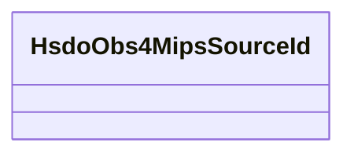

# Class: TODO -- what's a good name for this class (type)? (hsdo_Obs4Mips_Source_Id)


_TODO -- tell the world what this class (type) describes._


URI: [hsdo:Obs4Mips_Source_Id](http://schema.org/Obs4Mips_Source_Id)





<!-- no inheritance hierarchy -->


## Slots

| Name | Cardinality and Range | Description | Inheritance |
| ---  | --- | --- | --- |


## Examples

| Value |
| --- |
| https://climateKG.org/entity/2892e23f-5249-439d-8c0e-6c1d190b3beb |

## TODOs

* TODO -- Todos for this class go here
* or you can delete the todos
* if you think the class is perfect.

## Identifier and Mapping Information


### Schema Source


* from schema: climatepub4-kg


## Mappings

| Mapping Type | Mapped Value |
| ---  | ---  |
| self | hsdo:Obs4Mips_Source_Id |
| native | climatepub4-kg/:HsdoObs4MipsSourceId |


## LinkML Source

<!-- TODO: investigate https://stackoverflow.com/questions/37606292/how-to-create-tabbed-code-blocks-in-mkdocs-or-sphinx -->

### Direct

<details>
```yaml
name: hsdo_Obs4Mips_Source_Id
description: TODO -- tell the world what this class (type) describes.
title: TODO -- what's a good name for this class (type)?
todos:
- TODO -- Todos for this class go here
- or you can delete the todos
- if you think the class is perfect.
notes:
- Class with 106 occurences.
examples:
- value: https://climateKG.org/entity/2892e23f-5249-439d-8c0e-6c1d190b3beb
from_schema: climatepub4-kg
class_uri: hsdo:Obs4Mips_Source_Id

```
</details>

### Induced

<details>
```yaml
name: hsdo_Obs4Mips_Source_Id
description: TODO -- tell the world what this class (type) describes.
title: TODO -- what's a good name for this class (type)?
todos:
- TODO -- Todos for this class go here
- or you can delete the todos
- if you think the class is perfect.
notes:
- Class with 106 occurences.
examples:
- value: https://climateKG.org/entity/2892e23f-5249-439d-8c0e-6c1d190b3beb
from_schema: climatepub4-kg
class_uri: hsdo:Obs4Mips_Source_Id

```
</details>