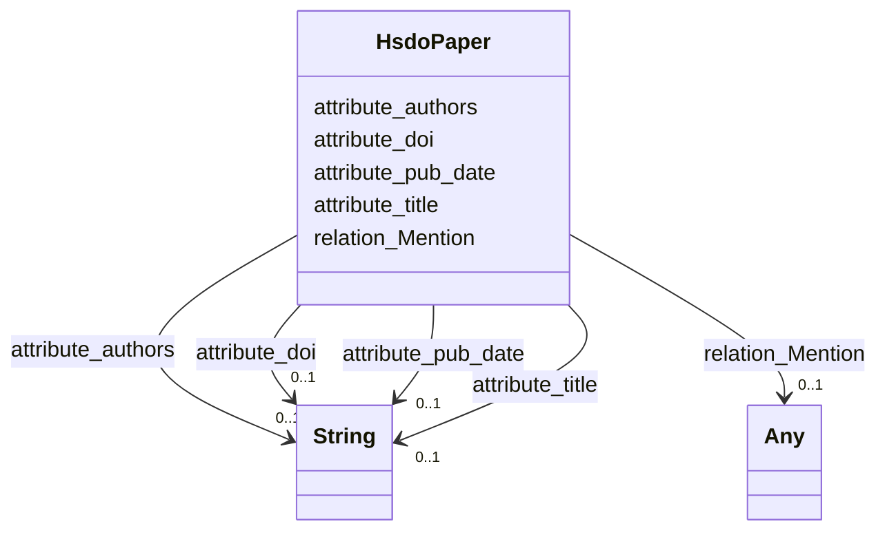

# Class: No class (type) name specified (hsdo_paper)


_No class (type) description specified_


This class occurs 300 times.


URI: [hsdo:paper](http://schema.org/paper)





<!-- no inheritance hierarchy -->


## Slots

| Name | Cardinality and Range | Description | Inheritance | Occurrences |
| ---  | --- | --- | --- | --- |
| [attribute_doi](../slots/attribute_doi.md) | 0..1 <br/> [xsd:string](http://www.w3.org/2001/XMLSchema#string) | No slot (predicate) description specified <br/>  | direct | 284 |
| [attribute_authors](../slots/attribute_authors.md) | 0..1 <br/> [xsd:string](http://www.w3.org/2001/XMLSchema#string) | No slot (predicate) description specified <br/>  | direct | 287 |
| [attribute_title](../slots/attribute_title.md) | 0..1 <br/> [xsd:string](http://www.w3.org/2001/XMLSchema#string) | No slot (predicate) description specified <br/>  | direct | 286 |
| [relation_Mention](../slots/relation_Mention.md) | 0..1 <br/> [HsdoProvider](../classes/HsdoProvider.md)&nbsp;or&nbsp;<br />[HsdoInstitution](../classes/HsdoInstitution.md)&nbsp;or&nbsp;<br />[HsdoModel](../classes/HsdoModel.md)&nbsp;or&nbsp;<br />[HsdoLicense](../classes/HsdoLicense.md)&nbsp;or&nbsp;<br />[HsdoSubExperimentId](../classes/HsdoSubExperimentId.md)&nbsp;or&nbsp;<br />[HsdoVariable](../classes/HsdoVariable.md)&nbsp;or&nbsp;<br />[HsdoScienceKeyword](../classes/HsdoScienceKeyword.md)&nbsp;or&nbsp;<br />[HsdoSourceType](../classes/HsdoSourceType.md)&nbsp;or&nbsp;<br />[HsdoChronostratigraphicUnit](../classes/HsdoChronostratigraphicUnit.md)&nbsp;or&nbsp;<br />[HsdoNominalResolution](../classes/HsdoNominalResolution.md)&nbsp;or&nbsp;<br />[HsdoVerticalResolutionRange](../classes/HsdoVerticalResolutionRange.md)&nbsp;or&nbsp;<br />[HsdoDataset](../classes/HsdoDataset.md)&nbsp;or&nbsp;<br />[HsdoProject](../classes/HsdoProject.md)&nbsp;or&nbsp;<br />[HsdoTemporalResolutionRange](../classes/HsdoTemporalResolutionRange.md)&nbsp;or&nbsp;<br />[HsdoHorizontalResolutionRange](../classes/HsdoHorizontalResolutionRange.md)&nbsp;or&nbsp;<br />[HsdoGridLabel](../classes/HsdoGridLabel.md)&nbsp;or&nbsp;<br />[HsdoPlatform](../classes/HsdoPlatform.md)&nbsp;or&nbsp;<br />[HsdoRealm](../classes/HsdoRealm.md)&nbsp;or&nbsp;<br />[HsdoExperiment](../classes/HsdoExperiment.md)&nbsp;or&nbsp;<br />[HsdoRegion](../classes/HsdoRegion.md)&nbsp;or&nbsp;<br />[HsdoModels](../classes/HsdoModels.md)&nbsp;or&nbsp;<br />[HsdoMeasurementName](../classes/HsdoMeasurementName.md)&nbsp;or&nbsp;<br />[HsdoCmip6SourceId](../classes/HsdoCmip6SourceId.md)&nbsp;or&nbsp;<br />[HsdoRelatedUrlContentType](../classes/HsdoRelatedUrlContentType.md)&nbsp;or&nbsp;<br />[HsdoActivity](../classes/HsdoActivity.md)&nbsp;or&nbsp;<br />[HsdoFrequency](../classes/HsdoFrequency.md)&nbsp;or&nbsp;<br />[HsdoLocation](../classes/HsdoLocation.md)&nbsp;or&nbsp;<br />[HsdoObs4MipsSourceId](../classes/HsdoObs4MipsSourceId.md)&nbsp;or&nbsp;<br />[HsdoDataFormat](../classes/HsdoDataFormat.md)&nbsp;or&nbsp;<br />[HsdoInstrument](../classes/HsdoInstrument.md) | No slot (predicate) description specified <br/>  | direct | 47280 |
| [attribute_pub_date](../slots/attribute_pub_date.md) | 0..1 <br/> [xsd:string](http://www.w3.org/2001/XMLSchema#string) | No slot (predicate) description specified <br/>  | direct | 181 |


## LinkML Source

<!-- TODO: investigate https://stackoverflow.com/questions/37606292/how-to-create-tabbed-code-blocks-in-mkdocs-or-sphinx -->

### Direct

<details>

```yaml
name: hsdo_paper
conforms_to: No schema conformance document specified
annotations:
  count:
    tag: count
    value: 300
description: No class (type) description specified
title: No class (type) name specified
from_schema: climatepub4-kg
rank: 1000
slots:
- attribute_doi
- attribute_authors
- attribute_title
- relation_Mention
- attribute_pub_date
slot_usage:
  attribute_authors:
    name: attribute_authors
    annotations:
      string:
        tag: string
        value: 287
  attribute_doi:
    name: attribute_doi
    annotations:
      string:
        tag: string
        value: 284
  attribute_pub_date:
    name: attribute_pub_date
    annotations:
      string:
        tag: string
        value: 181
  attribute_title:
    name: attribute_title
    annotations:
      string:
        tag: string
        value: 286
  relation_Mention:
    name: relation_Mention
    annotations:
      hsdo_Activity:
        tag: hsdo_Activity
        value: 65
      hsdo_Chronostratigraphic_Unit:
        tag: hsdo_Chronostratigraphic_Unit
        value: 119
      hsdo_Cmip6_Source_Id:
        tag: hsdo_Cmip6_Source_Id
        value: 30
      hsdo_Data_Format:
        tag: hsdo_Data_Format
        value: 85
      hsdo_Dataset:
        tag: hsdo_Dataset
        value: 33
      hsdo_Experiment:
        tag: hsdo_Experiment
        value: 1522
      hsdo_Frequency:
        tag: hsdo_Frequency
        value: 5
      hsdo_Grid_Label:
        tag: hsdo_Grid_Label
        value: 2
      hsdo_Horizontal_Resolution_Range:
        tag: hsdo_Horizontal_Resolution_Range
        value: 3
      hsdo_Institution:
        tag: hsdo_Institution
        value: 104
      hsdo_Instrument:
        tag: hsdo_Instrument
        value: 3559
      hsdo_License:
        tag: hsdo_License
        value: 2
      hsdo_Location:
        tag: hsdo_Location
        value: 8294
      hsdo_Measurement_Name:
        tag: hsdo_Measurement_Name
        value: 544
      hsdo_Model:
        tag: hsdo_Model
        value: 3455
      hsdo_Models:
        tag: hsdo_Models
        value: 598
      hsdo_Nominal_Resolution:
        tag: hsdo_Nominal_Resolution
        value: 2
      hsdo_Obs4Mips_Source_Id:
        tag: hsdo_Obs4Mips_Source_Id
        value: 18
      hsdo_Platform:
        tag: hsdo_Platform
        value: 2677
      hsdo_Project:
        tag: hsdo_Project
        value: 2871
      hsdo_Provider:
        tag: hsdo_Provider
        value: 6329
      hsdo_Realm:
        tag: hsdo_Realm
        value: 140
      hsdo_Region:
        tag: hsdo_Region
        value: 232
      hsdo_Related_Url_Content_Type:
        tag: hsdo_Related_Url_Content_Type
        value: 74
      hsdo_Science_Keyword:
        tag: hsdo_Science_Keyword
        value: 6482
      hsdo_Source_Type:
        tag: hsdo_Source_Type
        value: 53
      hsdo_Sub_Experiment_Id:
        tag: hsdo_Sub_Experiment_Id
        value: 76
      hsdo_Temporal_Resolution_Range:
        tag: hsdo_Temporal_Resolution_Range
        value: 33
      hsdo_Variable:
        tag: hsdo_Variable
        value: 9870
      hsdo_Vertical_Resolution_Range:
        tag: hsdo_Vertical_Resolution_Range
        value: 3
class_uri: hsdo:paper

```
</details>

### Induced

<details>

```yaml
name: hsdo_paper
conforms_to: No schema conformance document specified
annotations:
  count:
    tag: count
    value: 300
description: No class (type) description specified
title: No class (type) name specified
from_schema: climatepub4-kg
rank: 1000
slot_usage:
  attribute_authors:
    name: attribute_authors
    annotations:
      string:
        tag: string
        value: 287
  attribute_doi:
    name: attribute_doi
    annotations:
      string:
        tag: string
        value: 284
  attribute_pub_date:
    name: attribute_pub_date
    annotations:
      string:
        tag: string
        value: 181
  attribute_title:
    name: attribute_title
    annotations:
      string:
        tag: string
        value: 286
  relation_Mention:
    name: relation_Mention
    annotations:
      hsdo_Activity:
        tag: hsdo_Activity
        value: 65
      hsdo_Chronostratigraphic_Unit:
        tag: hsdo_Chronostratigraphic_Unit
        value: 119
      hsdo_Cmip6_Source_Id:
        tag: hsdo_Cmip6_Source_Id
        value: 30
      hsdo_Data_Format:
        tag: hsdo_Data_Format
        value: 85
      hsdo_Dataset:
        tag: hsdo_Dataset
        value: 33
      hsdo_Experiment:
        tag: hsdo_Experiment
        value: 1522
      hsdo_Frequency:
        tag: hsdo_Frequency
        value: 5
      hsdo_Grid_Label:
        tag: hsdo_Grid_Label
        value: 2
      hsdo_Horizontal_Resolution_Range:
        tag: hsdo_Horizontal_Resolution_Range
        value: 3
      hsdo_Institution:
        tag: hsdo_Institution
        value: 104
      hsdo_Instrument:
        tag: hsdo_Instrument
        value: 3559
      hsdo_License:
        tag: hsdo_License
        value: 2
      hsdo_Location:
        tag: hsdo_Location
        value: 8294
      hsdo_Measurement_Name:
        tag: hsdo_Measurement_Name
        value: 544
      hsdo_Model:
        tag: hsdo_Model
        value: 3455
      hsdo_Models:
        tag: hsdo_Models
        value: 598
      hsdo_Nominal_Resolution:
        tag: hsdo_Nominal_Resolution
        value: 2
      hsdo_Obs4Mips_Source_Id:
        tag: hsdo_Obs4Mips_Source_Id
        value: 18
      hsdo_Platform:
        tag: hsdo_Platform
        value: 2677
      hsdo_Project:
        tag: hsdo_Project
        value: 2871
      hsdo_Provider:
        tag: hsdo_Provider
        value: 6329
      hsdo_Realm:
        tag: hsdo_Realm
        value: 140
      hsdo_Region:
        tag: hsdo_Region
        value: 232
      hsdo_Related_Url_Content_Type:
        tag: hsdo_Related_Url_Content_Type
        value: 74
      hsdo_Science_Keyword:
        tag: hsdo_Science_Keyword
        value: 6482
      hsdo_Source_Type:
        tag: hsdo_Source_Type
        value: 53
      hsdo_Sub_Experiment_Id:
        tag: hsdo_Sub_Experiment_Id
        value: 76
      hsdo_Temporal_Resolution_Range:
        tag: hsdo_Temporal_Resolution_Range
        value: 33
      hsdo_Variable:
        tag: hsdo_Variable
        value: 9870
      hsdo_Vertical_Resolution_Range:
        tag: hsdo_Vertical_Resolution_Range
        value: 3
attributes:
  attribute_doi:
    name: attribute_doi
    annotations:
      string:
        tag: string
        value: 284
    description: No slot (predicate) description specified
    examples:
    - description: hsdo_paper→string
      object:
        example_object: 10.1093/icesjms/fsr010
        example_object_type: string
        example_predicate: attribute:doi
        example_subject: https://climateKG.org/entity/008b3eddfa29b8dc6e8d97472e4526bec2c9c2cb
        example_subject_type: hsdo_paper
    from_schema: climatepub4-kg
    rank: 1000
    slot_uri: attribute:doi
    alias: attribute_doi
    owner: hsdo_paper
    domain_of:
    - hsdo_paper
    range: string
  attribute_authors:
    name: attribute_authors
    annotations:
      string:
        tag: string
        value: 287
    description: No slot (predicate) description specified
    examples:
    - description: hsdo_paper→string
      object:
        example_object: James N Ianelli; Anne B Hollowed; Alan C Haynie; Franz J Mueter;
          Nicholas A Bond
        example_object_type: string
        example_predicate: attribute:authors
        example_subject: https://climateKG.org/entity/008b3eddfa29b8dc6e8d97472e4526bec2c9c2cb
        example_subject_type: hsdo_paper
    from_schema: climatepub4-kg
    rank: 1000
    slot_uri: attribute:authors
    alias: attribute_authors
    owner: hsdo_paper
    domain_of:
    - hsdo_paper
    range: string
  attribute_title:
    name: attribute_title
    annotations:
      string:
        tag: string
        value: 286
    description: No slot (predicate) description specified
    examples:
    - description: hsdo_paper→string
      object:
        example_object: Evaluating management strategies for eastern Bering Sea walleye
          pollock (Theragra chalcogramma) in a changing environment
        example_object_type: string
        example_predicate: attribute:title
        example_subject: https://climateKG.org/entity/008b3eddfa29b8dc6e8d97472e4526bec2c9c2cb
        example_subject_type: hsdo_paper
    from_schema: climatepub4-kg
    rank: 1000
    slot_uri: attribute:title
    alias: attribute_title
    owner: hsdo_paper
    domain_of:
    - hsdo_paper
    range: string
  relation_Mention:
    name: relation_Mention
    annotations:
      hsdo_Activity:
        tag: hsdo_Activity
        value: 65
      hsdo_Chronostratigraphic_Unit:
        tag: hsdo_Chronostratigraphic_Unit
        value: 119
      hsdo_Cmip6_Source_Id:
        tag: hsdo_Cmip6_Source_Id
        value: 30
      hsdo_Data_Format:
        tag: hsdo_Data_Format
        value: 85
      hsdo_Dataset:
        tag: hsdo_Dataset
        value: 33
      hsdo_Experiment:
        tag: hsdo_Experiment
        value: 1522
      hsdo_Frequency:
        tag: hsdo_Frequency
        value: 5
      hsdo_Grid_Label:
        tag: hsdo_Grid_Label
        value: 2
      hsdo_Horizontal_Resolution_Range:
        tag: hsdo_Horizontal_Resolution_Range
        value: 3
      hsdo_Institution:
        tag: hsdo_Institution
        value: 104
      hsdo_Instrument:
        tag: hsdo_Instrument
        value: 3559
      hsdo_License:
        tag: hsdo_License
        value: 2
      hsdo_Location:
        tag: hsdo_Location
        value: 8294
      hsdo_Measurement_Name:
        tag: hsdo_Measurement_Name
        value: 544
      hsdo_Model:
        tag: hsdo_Model
        value: 3455
      hsdo_Models:
        tag: hsdo_Models
        value: 598
      hsdo_Nominal_Resolution:
        tag: hsdo_Nominal_Resolution
        value: 2
      hsdo_Obs4Mips_Source_Id:
        tag: hsdo_Obs4Mips_Source_Id
        value: 18
      hsdo_Platform:
        tag: hsdo_Platform
        value: 2677
      hsdo_Project:
        tag: hsdo_Project
        value: 2871
      hsdo_Provider:
        tag: hsdo_Provider
        value: 6329
      hsdo_Realm:
        tag: hsdo_Realm
        value: 140
      hsdo_Region:
        tag: hsdo_Region
        value: 232
      hsdo_Related_Url_Content_Type:
        tag: hsdo_Related_Url_Content_Type
        value: 74
      hsdo_Science_Keyword:
        tag: hsdo_Science_Keyword
        value: 6482
      hsdo_Source_Type:
        tag: hsdo_Source_Type
        value: 53
      hsdo_Sub_Experiment_Id:
        tag: hsdo_Sub_Experiment_Id
        value: 76
      hsdo_Temporal_Resolution_Range:
        tag: hsdo_Temporal_Resolution_Range
        value: 33
      hsdo_Variable:
        tag: hsdo_Variable
        value: 9870
      hsdo_Vertical_Resolution_Range:
        tag: hsdo_Vertical_Resolution_Range
        value: 3
    description: No slot (predicate) description specified
    examples:
    - description: hsdo_paper→hsdo_Experiment
      object:
        example_object: https://climateKG.org/entity/2be0af28-a6b8-4fce-82e4-1ad86788a4d5
        example_object_type: hsdo_Experiment
        example_predicate: relation:Mention
        example_subject: https://climateKG.org/entity/008b3eddfa29b8dc6e8d97472e4526bec2c9c2cb
        example_subject_type: hsdo_paper
    - description: hsdo_paper→hsdo_Provider
      object:
        example_object: https://climateKG.org/entity/2be0af28-a6b8-4fce-82e4-1ad86788a4d5
        example_object_type: hsdo_Provider
        example_predicate: relation:Mention
        example_subject: https://climateKG.org/entity/008b3eddfa29b8dc6e8d97472e4526bec2c9c2cb
        example_subject_type: hsdo_paper
    - description: hsdo_paper→hsdo_Platform
      object:
        example_object: https://climateKG.org/entity/2be0af28-a6b8-4fce-82e4-1ad86788a4d5
        example_object_type: hsdo_Platform
        example_predicate: relation:Mention
        example_subject: https://climateKG.org/entity/008b3eddfa29b8dc6e8d97472e4526bec2c9c2cb
        example_subject_type: hsdo_paper
    - description: hsdo_paper→hsdo_Project
      object:
        example_object: https://climateKG.org/entity/2be0af28-a6b8-4fce-82e4-1ad86788a4d5
        example_object_type: hsdo_Project
        example_predicate: relation:Mention
        example_subject: https://climateKG.org/entity/008b3eddfa29b8dc6e8d97472e4526bec2c9c2cb
        example_subject_type: hsdo_paper
    - description: hsdo_paper→hsdo_Instrument
      object:
        example_object: https://climateKG.org/entity/2be0af28-a6b8-4fce-82e4-1ad86788a4d5
        example_object_type: hsdo_Instrument
        example_predicate: relation:Mention
        example_subject: https://climateKG.org/entity/008b3eddfa29b8dc6e8d97472e4526bec2c9c2cb
        example_subject_type: hsdo_paper
    - description: hsdo_paper→hsdo_Model
      object:
        example_object: https://climateKG.org/entity/2be0af28-a6b8-4fce-82e4-1ad86788a4d5
        example_object_type: hsdo_Model
        example_predicate: relation:Mention
        example_subject: https://climateKG.org/entity/008b3eddfa29b8dc6e8d97472e4526bec2c9c2cb
        example_subject_type: hsdo_paper
    - description: hsdo_paper→hsdo_Science_Keyword
      object:
        example_object: https://climateKG.org/entity/2be0af28-a6b8-4fce-82e4-1ad86788a4d5
        example_object_type: hsdo_Science_Keyword
        example_predicate: relation:Mention
        example_subject: https://climateKG.org/entity/008b3eddfa29b8dc6e8d97472e4526bec2c9c2cb
        example_subject_type: hsdo_paper
    - description: hsdo_paper→hsdo_Variable
      object:
        example_object: https://climateKG.org/entity/2be0af28-a6b8-4fce-82e4-1ad86788a4d5
        example_object_type: hsdo_Variable
        example_predicate: relation:Mention
        example_subject: https://climateKG.org/entity/008b3eddfa29b8dc6e8d97472e4526bec2c9c2cb
        example_subject_type: hsdo_paper
    - description: hsdo_paper→hsdo_Location
      object:
        example_object: https://climateKG.org/entity/4c4878cb-18f5-464c-b4bb-858273a48d6a
        example_object_type: hsdo_Location
        example_predicate: relation:Mention
        example_subject: https://climateKG.org/entity/008b3eddfa29b8dc6e8d97472e4526bec2c9c2cb
        example_subject_type: hsdo_paper
    - description: hsdo_paper→hsdo_Measurement_Name
      object:
        example_object: https://climateKG.org/entity/fa13c1b2-6be4-45c3-aefa-7918575a583d
        example_object_type: hsdo_Measurement_Name
        example_predicate: relation:Mention
        example_subject: https://climateKG.org/entity/008b3eddfa29b8dc6e8d97472e4526bec2c9c2cb
        example_subject_type: hsdo_paper
    - description: hsdo_paper→hsdo_Models
      object:
        example_object: https://climateKG.org/entity/1e97323a-ac5b-4d1d-858f-505b875b3bfb
        example_object_type: hsdo_Models
        example_predicate: relation:Mention
        example_subject: https://climateKG.org/entity/010d24ebe62f59c792c4533f7c273d3bece6a4ab
        example_subject_type: hsdo_paper
    - description: hsdo_paper→hsdo_Region
      object:
        example_object: https://climateKG.org/entity/a62ae820-58c5-47ff-bb72-2680962b26f4
        example_object_type: hsdo_Region
        example_predicate: relation:Mention
        example_subject: https://climateKG.org/entity/010d24ebe62f59c792c4533f7c273d3bece6a4ab
        example_subject_type: hsdo_paper
    - description: hsdo_paper→hsdo_Realm
      object:
        example_object: https://climateKG.org/entity/5668f6df-ab5a-4991-9720-dda2faae7f3e
        example_object_type: hsdo_Realm
        example_predicate: relation:Mention
        example_subject: https://climateKG.org/entity/0147bfb750090fd9b5d2bb274e5ec05e4e02306a
        example_subject_type: hsdo_paper
    - description: hsdo_paper→hsdo_Related_Url_Content_Type
      object:
        example_object: https://climateKG.org/entity/d1996d91-e824-4b24-b94e-3aae4543b63b
        example_object_type: hsdo_Related_Url_Content_Type
        example_predicate: relation:Mention
        example_subject: https://climateKG.org/entity/02891fcc3490b4667b30d99a6dfb99cf201b17e8
        example_subject_type: hsdo_paper
    - description: hsdo_paper→hsdo_Chronostratigraphic_Unit
      object:
        example_object: https://climateKG.org/entity/ee019c00-2300-4675-9dea-8f993a744a67
        example_object_type: hsdo_Chronostratigraphic_Unit
        example_predicate: relation:Mention
        example_subject: https://climateKG.org/entity/02891fcc3490b4667b30d99a6dfb99cf201b17e8
        example_subject_type: hsdo_paper
    - description: hsdo_paper→hsdo_Data_Format
      object:
        example_object: https://climateKG.org/entity/22996c6c-4a7c-4ff3-9782-1fc3c680a88c
        example_object_type: hsdo_Data_Format
        example_predicate: relation:Mention
        example_subject: https://climateKG.org/entity/037059dc422507a219160802936634b5db5ced97
        example_subject_type: hsdo_paper
    - description: hsdo_paper→hsdo_Obs4Mips_Source_Id
      object:
        example_object: https://climateKG.org/entity/a0b26420-3a13-4742-8d6f-391dc5c49d64
        example_object_type: hsdo_Obs4Mips_Source_Id
        example_predicate: relation:Mention
        example_subject: https://climateKG.org/entity/056432f6496e03344fcd43dc214a12afba72db8d
        example_subject_type: hsdo_paper
    - description: hsdo_paper→hsdo_Dataset
      object:
        example_object: https://climateKG.org/entity/a0b26420-3a13-4742-8d6f-391dc5c49d64
        example_object_type: hsdo_Dataset
        example_predicate: relation:Mention
        example_subject: https://climateKG.org/entity/056432f6496e03344fcd43dc214a12afba72db8d
        example_subject_type: hsdo_paper
    - description: hsdo_paper→hsdo_Sub_Experiment_Id
      object:
        example_object: https://climateKG.org/entity/3946e7a7-0871-4644-a3b5-ab9ca942b49b
        example_object_type: hsdo_Sub_Experiment_Id
        example_predicate: relation:Mention
        example_subject: https://climateKG.org/entity/05aa19ed1429ca3e0c10a317b7e25c1674e6f4bd
        example_subject_type: hsdo_paper
    - description: hsdo_paper→hsdo_Institution
      object:
        example_object: https://climateKG.org/entity/3be6270c-8554-467a-b2c7-9c13bc086b10
        example_object_type: hsdo_Institution
        example_predicate: relation:Mention
        example_subject: https://climateKG.org/entity/05aa19ed1429ca3e0c10a317b7e25c1674e6f4bd
        example_subject_type: hsdo_paper
    - description: hsdo_paper→hsdo_Source_Type
      object:
        example_object: https://climateKG.org/entity/bae77e96-ede8-44ab-8035-31feb2527fad
        example_object_type: hsdo_Source_Type
        example_predicate: relation:Mention
        example_subject: https://climateKG.org/entity/05c1f46c8f32c915e3f027239946cb2f2ce9002a
        example_subject_type: hsdo_paper
    - description: hsdo_paper→hsdo_Activity
      object:
        example_object: https://climateKG.org/entity/68885007-d975-4f24-bdd5-dd19b246bdf6
        example_object_type: hsdo_Activity
        example_predicate: relation:Mention
        example_subject: https://climateKG.org/entity/07803b27a8500e5fb114abf41996fe59c1510f3d
        example_subject_type: hsdo_paper
    - description: hsdo_paper→hsdo_Horizontal_Resolution_Range
      object:
        example_object: https://climateKG.org/entity/1499785c-8b74-45f4-bbf7-19d2d4e43b2f
        example_object_type: hsdo_Horizontal_Resolution_Range
        example_predicate: relation:Mention
        example_subject: https://climateKG.org/entity/09bdb7d909ed6615760571a6aa14051133179aee
        example_subject_type: hsdo_paper
    - description: hsdo_paper→hsdo_Temporal_Resolution_Range
      object:
        example_object: https://climateKG.org/entity/99ef187e-6940-4c10-8d65-00d4426d493b
        example_object_type: hsdo_Temporal_Resolution_Range
        example_predicate: relation:Mention
        example_subject: https://climateKG.org/entity/09bdb7d909ed6615760571a6aa14051133179aee
        example_subject_type: hsdo_paper
    - description: hsdo_paper→hsdo_Vertical_Resolution_Range
      object:
        example_object: https://climateKG.org/entity/0893353d-4e8c-4b31-bcc5-fce552ccfff3
        example_object_type: hsdo_Vertical_Resolution_Range
        example_predicate: relation:Mention
        example_subject: https://climateKG.org/entity/15109797315f5e34fbc5e71359fb0bb1398141d6
        example_subject_type: hsdo_paper
    - description: hsdo_paper→hsdo_Cmip6_Source_Id
      object:
        example_object: https://climateKG.org/entity/4baeaba9-9381-4ed5-b7aa-75879bacbb03
        example_object_type: hsdo_Cmip6_Source_Id
        example_predicate: relation:Mention
        example_subject: https://climateKG.org/entity/1fb5a4812103e81d0bea4d26b0004e7206e7d5ac
        example_subject_type: hsdo_paper
    - description: hsdo_paper→hsdo_Frequency
      object:
        example_object: https://climateKG.org/entity/8e4900ff-c7bc-47a1-aa55-a8892696d769
        example_object_type: hsdo_Frequency
        example_predicate: relation:Mention
        example_subject: https://climateKG.org/entity/25bf7b958708f860b9321415b9bf73e6cbbb5e4c
        example_subject_type: hsdo_paper
    - description: hsdo_paper→hsdo_License
      object:
        example_object: https://climateKG.org/entity/3c937799-5ee5-4ea3-b7d5-418a625a7872
        example_object_type: hsdo_License
        example_predicate: relation:Mention
        example_subject: https://climateKG.org/entity/34dde8fd93d7e1f6c0364f3facc8e94c705e93c8
        example_subject_type: hsdo_paper
    - description: hsdo_paper→hsdo_Nominal_Resolution
      object:
        example_object: https://climateKG.org/entity/d34741f2-83bd-4ff5-bac4-25a890c5bee4
        example_object_type: hsdo_Nominal_Resolution
        example_predicate: relation:Mention
        example_subject: https://climateKG.org/entity/375500048f97abfb58352f5b2f6b88c268954592
        example_subject_type: hsdo_paper
    - description: hsdo_paper→hsdo_Grid_Label
      object:
        example_object: https://climateKG.org/entity/a42a0f2b-365b-42a9-b285-cf549596188d
        example_object_type: hsdo_Grid_Label
        example_predicate: relation:Mention
        example_subject: https://climateKG.org/entity/6c113e9c26a43d78b38b140dc6280c94bd60cd59
        example_subject_type: hsdo_paper
    from_schema: climatepub4-kg
    rank: 1000
    slot_uri: relation:Mention
    alias: relation_Mention
    owner: hsdo_paper
    domain_of:
    - hsdo_paper
    range: Any
    any_of:
    - range: hsdo_Provider
    - range: hsdo_Institution
    - range: hsdo_Model
    - range: hsdo_License
    - range: hsdo_Sub_Experiment_Id
    - range: hsdo_Variable
    - range: hsdo_Science_Keyword
    - range: hsdo_Source_Type
    - range: hsdo_Chronostratigraphic_Unit
    - range: hsdo_Nominal_Resolution
    - range: hsdo_Vertical_Resolution_Range
    - range: hsdo_Dataset
    - range: hsdo_Project
    - range: hsdo_Temporal_Resolution_Range
    - range: hsdo_Horizontal_Resolution_Range
    - range: hsdo_Grid_Label
    - range: hsdo_Platform
    - range: hsdo_Realm
    - range: hsdo_Experiment
    - range: hsdo_Region
    - range: hsdo_Models
    - range: hsdo_Measurement_Name
    - range: hsdo_Cmip6_Source_Id
    - range: hsdo_Related_Url_Content_Type
    - range: hsdo_Activity
    - range: hsdo_Frequency
    - range: hsdo_Location
    - range: hsdo_Obs4Mips_Source_Id
    - range: hsdo_Data_Format
    - range: hsdo_Instrument
  attribute_pub_date:
    name: attribute_pub_date
    annotations:
      string:
        tag: string
        value: 181
    description: No slot (predicate) description specified
    examples:
    - description: hsdo_paper→string
      object:
        example_object: '2024-07-17'
        example_object_type: string
        example_predicate: attribute:pub_date
        example_subject: https://climateKG.org/entity/008b3eddfa29b8dc6e8d97472e4526bec2c9c2cb
        example_subject_type: hsdo_paper
    from_schema: climatepub4-kg
    rank: 1000
    slot_uri: attribute:pub_date
    alias: attribute_pub_date
    owner: hsdo_paper
    domain_of:
    - hsdo_paper
    range: string
class_uri: hsdo:paper

```
</details>