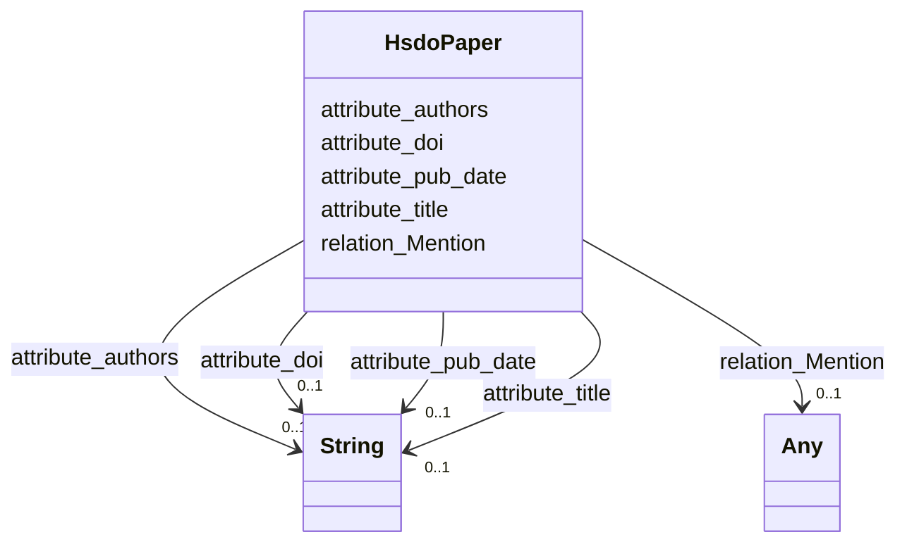

# Class: No class (type) name specified (hsdo_paper)


_No class (type) description specified_


URI: [hsdo:paper](http://schema.org/paper)





<!-- no inheritance hierarchy -->


## Slots

| Name | Cardinality and Range | Description | Inheritance |
| ---  | --- | --- | --- |
| [relation_Mention](../slots/relation_Mention.md) | 0..1 <br/> [HsdoMeasurementName](../classes/HsdoMeasurementName.md)&nbsp;or&nbsp;<br />[HsdoProject](../classes/HsdoProject.md)&nbsp;or&nbsp;<br />[HsdoInstitution](../classes/HsdoInstitution.md)&nbsp;or&nbsp;<br />[HsdoSubExperimentId](../classes/HsdoSubExperimentId.md)&nbsp;or&nbsp;<br />[HsdoActivity](../classes/HsdoActivity.md)&nbsp;or&nbsp;<br />[HsdoRelatedUrlContentType](../classes/HsdoRelatedUrlContentType.md)&nbsp;or&nbsp;<br />[HsdoPlatform](../classes/HsdoPlatform.md)&nbsp;or&nbsp;<br />[HsdoModels](../classes/HsdoModels.md)&nbsp;or&nbsp;<br />[HsdoCmip6SourceId](../classes/HsdoCmip6SourceId.md)&nbsp;or&nbsp;<br />[HsdoExperiment](../classes/HsdoExperiment.md)&nbsp;or&nbsp;<br />[HsdoVariable](../classes/HsdoVariable.md)&nbsp;or&nbsp;<br />[HsdoProvider](../classes/HsdoProvider.md)&nbsp;or&nbsp;<br />[HsdoFrequency](../classes/HsdoFrequency.md)&nbsp;or&nbsp;<br />[HsdoModel](../classes/HsdoModel.md)&nbsp;or&nbsp;<br />[HsdoInstrument](../classes/HsdoInstrument.md)&nbsp;or&nbsp;<br />[HsdoNominalResolution](../classes/HsdoNominalResolution.md)&nbsp;or&nbsp;<br />[HsdoLocation](../classes/HsdoLocation.md)&nbsp;or&nbsp;<br />[HsdoHorizontalResolutionRange](../classes/HsdoHorizontalResolutionRange.md)&nbsp;or&nbsp;<br />[HsdoChronostratigraphicUnit](../classes/HsdoChronostratigraphicUnit.md)&nbsp;or&nbsp;<br />[HsdoTemporalResolutionRange](../classes/HsdoTemporalResolutionRange.md)&nbsp;or&nbsp;<br />[HsdoDataFormat](../classes/HsdoDataFormat.md)&nbsp;or&nbsp;<br />[HsdoScienceKeyword](../classes/HsdoScienceKeyword.md)&nbsp;or&nbsp;<br />[HsdoDataset](../classes/HsdoDataset.md) | No slot (predicate) description specified <br/> 1416 occurrences with subject type hsdo_paper and object type hsdo_Experiment.<br/>1646 occurrences with subject type hsdo_paper and object type hsdo_Science_Keyword.<br/>784 occurrences with subject type hsdo_paper and object type hsdo_Model.<br/>3054 occurrences with subject type hsdo_paper and object type hsdo_Instrument.<br/>5961 occurrences with subject type hsdo_paper and object type hsdo_Location.<br/>582 occurrences with subject type hsdo_paper and object type hsdo_Provider.<br/>627 occurrences with subject type hsdo_paper and object type hsdo_Project.<br/>434 occurrences with subject type hsdo_paper and object type hsdo_Models.<br/>125 occurrences with subject type hsdo_paper and object type hsdo_Variable.<br/>318 occurrences with subject type hsdo_paper and object type hsdo_Platform.<br/>107 occurrences with subject type hsdo_paper and object type hsdo_Measurement_Name.<br/>119 occurrences with subject type hsdo_paper and object type hsdo_Chronostratigraphic_Unit.<br/>85 occurrences with subject type hsdo_paper and object type hsdo_Data_Format.<br/>33 occurrences with subject type hsdo_paper and object type hsdo_Dataset.<br/>104 occurrences with subject type hsdo_paper and object type hsdo_Institution.<br/>21 occurrences with subject type hsdo_paper and object type hsdo_Sub_Experiment_Id.<br/>65 occurrences with subject type hsdo_paper and object type hsdo_Activity.<br/>14 occurrences with subject type hsdo_paper and object type hsdo_Related_Url_Content_Type.<br/>3 occurrences with subject type hsdo_paper and object type hsdo_Horizontal_Resolution_Range.<br/>24 occurrences with subject type hsdo_paper and object type hsdo_Temporal_Resolution_Range.<br/>30 occurrences with subject type hsdo_paper and object type hsdo_Cmip6_Source_Id.<br/>5 occurrences with subject type hsdo_paper and object type hsdo_Frequency.<br/>2 occurrences with subject type hsdo_paper and object type hsdo_Nominal_Resolution. | direct |
| [attribute_doi](../slots/attribute_doi.md) | 0..1 <br/> [xsd:string](xsd:string) | No slot (predicate) description specified <br/> 284 occurrences with subject type hsdo_paper and object type string. | direct |
| [attribute_pub_date](../slots/attribute_pub_date.md) | 0..1 <br/> [xsd:string](xsd:string) | No slot (predicate) description specified <br/> 181 occurrences with subject type hsdo_paper and object type string. | direct |
| [attribute_authors](../slots/attribute_authors.md) | 0..1 <br/> [xsd:string](xsd:string) | No slot (predicate) description specified <br/> 287 occurrences with subject type hsdo_paper and object type string. | direct |
| [attribute_title](../slots/attribute_title.md) | 0..1 <br/> [xsd:string](xsd:string) | No slot (predicate) description specified <br/> 286 occurrences with subject type hsdo_paper and object type string. | direct |


## Identifier and Mapping Information


### Schema Source


* from schema: climatepub4-kg


## Mappings

| Mapping Type | Mapped Value |
| ---  | ---  |
| self | hsdo:paper |
| native | climatepub4-kg/:HsdoPaper |


## LinkML Source

<!-- TODO: investigate https://stackoverflow.com/questions/37606292/how-to-create-tabbed-code-blocks-in-mkdocs-or-sphinx -->

### Direct

<details>
```yaml
name: hsdo_paper
conforms_to: No schema conformance document specified
description: No class (type) description specified
title: No class (type) name specified
notes:
- Class with 300 occurrences.
from_schema: climatepub4-kg
rank: 1000
slots:
- relation_Mention
- attribute_doi
- attribute_pub_date
- attribute_authors
- attribute_title
class_uri: hsdo:paper

```
</details>

### Induced

<details>
```yaml
name: hsdo_paper
conforms_to: No schema conformance document specified
description: No class (type) description specified
title: No class (type) name specified
notes:
- Class with 300 occurrences.
from_schema: climatepub4-kg
rank: 1000
attributes:
  relation_Mention:
    name: relation_Mention
    description: No slot (predicate) description specified
    comments:
    - 1416 occurrences with subject type hsdo_paper and object type hsdo_Experiment.
    - 1646 occurrences with subject type hsdo_paper and object type hsdo_Science_Keyword.
    - 784 occurrences with subject type hsdo_paper and object type hsdo_Model.
    - 3054 occurrences with subject type hsdo_paper and object type hsdo_Instrument.
    - 5961 occurrences with subject type hsdo_paper and object type hsdo_Location.
    - 582 occurrences with subject type hsdo_paper and object type hsdo_Provider.
    - 627 occurrences with subject type hsdo_paper and object type hsdo_Project.
    - 434 occurrences with subject type hsdo_paper and object type hsdo_Models.
    - 125 occurrences with subject type hsdo_paper and object type hsdo_Variable.
    - 318 occurrences with subject type hsdo_paper and object type hsdo_Platform.
    - 107 occurrences with subject type hsdo_paper and object type hsdo_Measurement_Name.
    - 119 occurrences with subject type hsdo_paper and object type hsdo_Chronostratigraphic_Unit.
    - 85 occurrences with subject type hsdo_paper and object type hsdo_Data_Format.
    - 33 occurrences with subject type hsdo_paper and object type hsdo_Dataset.
    - 104 occurrences with subject type hsdo_paper and object type hsdo_Institution.
    - 21 occurrences with subject type hsdo_paper and object type hsdo_Sub_Experiment_Id.
    - 65 occurrences with subject type hsdo_paper and object type hsdo_Activity.
    - 14 occurrences with subject type hsdo_paper and object type hsdo_Related_Url_Content_Type.
    - 3 occurrences with subject type hsdo_paper and object type hsdo_Horizontal_Resolution_Range.
    - 24 occurrences with subject type hsdo_paper and object type hsdo_Temporal_Resolution_Range.
    - 30 occurrences with subject type hsdo_paper and object type hsdo_Cmip6_Source_Id.
    - 5 occurrences with subject type hsdo_paper and object type hsdo_Frequency.
    - 2 occurrences with subject type hsdo_paper and object type hsdo_Nominal_Resolution.
    examples:
    - description: hsdo_paper → hsdo_Experiment
      object:
        example_object: https://climateKG.org/entity/878e70de-f929-4d2f-9325-145ca95787e9
        example_object_type: hsdo_Experiment
        example_predicate: relation:Mention
        example_subject: https://climateKG.org/entity/initial_3
        example_subject_type: hsdo_paper
    - description: hsdo_paper → hsdo_Science_Keyword
      object:
        example_object: https://climateKG.org/entity/d6aec072-daf9-4f96-b667-6c7831cf6bdd
        example_object_type: hsdo_Science_Keyword
        example_predicate: relation:Mention
        example_subject: https://climateKG.org/entity/initial_3
        example_subject_type: hsdo_paper
    - description: hsdo_paper → hsdo_Model
      object:
        example_object: https://climateKG.org/entity/3fe9c479-3cb5-45bf-8f4d-637282dccfa3
        example_object_type: hsdo_Model
        example_predicate: relation:Mention
        example_subject: https://climateKG.org/entity/initial_3
        example_subject_type: hsdo_paper
    - description: hsdo_paper → hsdo_Instrument
      object:
        example_object: https://climateKG.org/entity/ba008542-5c6f-462a-8ddf-21e54cbf3034
        example_object_type: hsdo_Instrument
        example_predicate: relation:Mention
        example_subject: https://climateKG.org/entity/initial_3
        example_subject_type: hsdo_paper
    - description: hsdo_paper → hsdo_Location
      object:
        example_object: https://climateKG.org/entity/fa0ec8a7-ebed-4f2d-834b-1fa6a1c2e0ed
        example_object_type: hsdo_Location
        example_predicate: relation:Mention
        example_subject: https://climateKG.org/entity/initial_3
        example_subject_type: hsdo_paper
    - description: hsdo_paper → hsdo_Provider
      object:
        example_object: https://climateKG.org/entity/d738d343-0440-4258-850d-107f9cd8072c
        example_object_type: hsdo_Provider
        example_predicate: relation:Mention
        example_subject: https://climateKG.org/entity/initial_2
        example_subject_type: hsdo_paper
    - description: hsdo_paper → hsdo_Project
      object:
        example_object: https://climateKG.org/entity/4ea1b3cc-d4d2-4803-a416-753cdd1ec451
        example_object_type: hsdo_Project
        example_predicate: relation:Mention
        example_subject: https://climateKG.org/entity/initial_3
        example_subject_type: hsdo_paper
    - description: hsdo_paper → hsdo_Models
      object:
        example_object: https://climateKG.org/entity/b0346391-1b8a-41b8-9427-ff6e314fa06d
        example_object_type: hsdo_Models
        example_predicate: relation:Mention
        example_subject: https://climateKG.org/entity/initial_3
        example_subject_type: hsdo_paper
    - description: hsdo_paper → hsdo_Variable
      object:
        example_object: https://climateKG.org/entity/ba70b595-5263-4ffd-97a2-f86ba91681ae
        example_object_type: hsdo_Variable
        example_predicate: relation:Mention
        example_subject: https://climateKG.org/entity/initial_2
        example_subject_type: hsdo_paper
    - description: hsdo_paper → hsdo_Platform
      object:
        example_object: https://climateKG.org/entity/a9c4dcab-bbd0-4f67-b2c0-bbbe71b8245e
        example_object_type: hsdo_Platform
        example_predicate: relation:Mention
        example_subject: https://climateKG.org/entity/initial_2
        example_subject_type: hsdo_paper
    - description: hsdo_paper → hsdo_Measurement_Name
      object:
        example_object: https://climateKG.org/entity/fabeb7da-9d33-450e-83b0-5c3651d1e4a1
        example_object_type: hsdo_Measurement_Name
        example_predicate: relation:Mention
        example_subject: https://climateKG.org/entity/f5e16581be56679d091bec59956504b6c3e30239
        example_subject_type: hsdo_paper
    - description: hsdo_paper → hsdo_Chronostratigraphic_Unit
      object:
        example_object: https://climateKG.org/entity/c7e7fb38-44ef-4c5b-aa1d-b3fdcf89d838
        example_object_type: hsdo_Chronostratigraphic_Unit
        example_predicate: relation:Mention
        example_subject: https://climateKG.org/entity/fb813628076a23fecc28f478f08a09ebdee33b0f
        example_subject_type: hsdo_paper
    - description: hsdo_paper → hsdo_Data_Format
      object:
        example_object: https://climateKG.org/entity/ac392872-1571-4bfd-94dd-81f93d9f1fd0
        example_object_type: hsdo_Data_Format
        example_predicate: relation:Mention
        example_subject: https://climateKG.org/entity/initial_2
        example_subject_type: hsdo_paper
    - description: hsdo_paper → hsdo_Dataset
      object:
        example_object: https://climateKG.org/entity/a0b26420-3a13-4742-8d6f-391dc5c49d64
        example_object_type: hsdo_Dataset
        example_predicate: relation:Mention
        example_subject: https://climateKG.org/entity/initial_3
        example_subject_type: hsdo_paper
    - description: hsdo_paper → hsdo_Institution
      object:
        example_object: https://climateKG.org/entity/e8df7edd-a176-45c9-8515-3a520948ef63
        example_object_type: hsdo_Institution
        example_predicate: relation:Mention
        example_subject: https://climateKG.org/entity/initial_3
        example_subject_type: hsdo_paper
    - description: hsdo_paper → hsdo_Sub_Experiment_Id
      object:
        example_object: https://climateKG.org/entity/3bc6fedc-c5a4-4986-bec2-eacc7b75a5dd
        example_object_type: hsdo_Sub_Experiment_Id
        example_predicate: relation:Mention
        example_subject: https://climateKG.org/entity/e6047f024856646877a812ee5a3f3848a9830b49
        example_subject_type: hsdo_paper
    - description: hsdo_paper → hsdo_Activity
      object:
        example_object: https://climateKG.org/entity/68885007-d975-4f24-bdd5-dd19b246bdf6
        example_object_type: hsdo_Activity
        example_predicate: relation:Mention
        example_subject: https://climateKG.org/entity/initial_2
        example_subject_type: hsdo_paper
    - description: hsdo_paper → hsdo_Related_Url_Content_Type
      object:
        example_object: https://climateKG.org/entity/86b8b121-d710-4c5b-84b0-7b40717f6c76
        example_object_type: hsdo_Related_Url_Content_Type
        example_predicate: relation:Mention
        example_subject: https://climateKG.org/entity/f71f5612d64efcb9af7ebc9cd2e550d6d053e5a7
        example_subject_type: hsdo_paper
    - description: hsdo_paper → hsdo_Horizontal_Resolution_Range
      object:
        example_object: https://climateKG.org/entity/1499785c-8b74-45f4-bbf7-19d2d4e43b2f
        example_object_type: hsdo_Horizontal_Resolution_Range
        example_predicate: relation:Mention
        example_subject: https://climateKG.org/entity/c3ff320aa72c7e29d067731f19e847505567c120
        example_subject_type: hsdo_paper
    - description: hsdo_paper → hsdo_Temporal_Resolution_Range
      object:
        example_object: https://climateKG.org/entity/7c5420a6-94e2-40ca-9dff-20309090d327
        example_object_type: hsdo_Temporal_Resolution_Range
        example_predicate: relation:Mention
        example_subject: https://climateKG.org/entity/f1c594d8410ba7bf74732bfa710f08a935511a7d
        example_subject_type: hsdo_paper
    - description: hsdo_paper → hsdo_Cmip6_Source_Id
      object:
        example_object: https://climateKG.org/entity/df0ba39b-7461-4cee-8660-c80fee72e96b
        example_object_type: hsdo_Cmip6_Source_Id
        example_predicate: relation:Mention
        example_subject: https://climateKG.org/entity/initial_2
        example_subject_type: hsdo_paper
    - description: hsdo_paper → hsdo_Frequency
      object:
        example_object: https://climateKG.org/entity/8e4900ff-c7bc-47a1-aa55-a8892696d769
        example_object_type: hsdo_Frequency
        example_predicate: relation:Mention
        example_subject: https://climateKG.org/entity/c3ff320aa72c7e29d067731f19e847505567c120
        example_subject_type: hsdo_paper
    - description: hsdo_paper → hsdo_Nominal_Resolution
      object:
        example_object: https://climateKG.org/entity/82a2971f-82eb-46aa-8d70-1343570edba8
        example_object_type: hsdo_Nominal_Resolution
        example_predicate: relation:Mention
        example_subject: https://climateKG.org/entity/cd3e2817ca55a23192a862920ac38ad5c06e2adf
        example_subject_type: hsdo_paper
    from_schema: climatepub4-kg
    rank: 1000
    slot_uri: relation:Mention
    alias: relation_Mention
    owner: hsdo_paper
    domain_of:
    - hsdo_paper
    range: Any
    any_of:
    - range: hsdo_Measurement_Name
    - range: hsdo_Project
    - range: hsdo_Institution
    - range: hsdo_Sub_Experiment_Id
    - range: hsdo_Activity
    - range: hsdo_Related_Url_Content_Type
    - range: hsdo_Platform
    - range: hsdo_Models
    - range: hsdo_Cmip6_Source_Id
    - range: hsdo_Experiment
    - range: hsdo_Variable
    - range: hsdo_Provider
    - range: hsdo_Frequency
    - range: hsdo_Model
    - range: hsdo_Instrument
    - range: hsdo_Nominal_Resolution
    - range: hsdo_Location
    - range: hsdo_Horizontal_Resolution_Range
    - range: hsdo_Chronostratigraphic_Unit
    - range: hsdo_Temporal_Resolution_Range
    - range: hsdo_Data_Format
    - range: hsdo_Science_Keyword
    - range: hsdo_Dataset
  attribute_doi:
    name: attribute_doi
    description: No slot (predicate) description specified
    comments:
    - 284 occurrences with subject type hsdo_paper and object type string.
    examples:
    - description: hsdo_paper → string
      object:
        example_object: 10.1093/icesjms/fsr010
        example_object_type: string
        example_predicate: attribute:doi
        example_subject: https://climateKG.org/entity/008b3eddfa29b8dc6e8d97472e4526bec2c9c2cb
        example_subject_type: hsdo_paper
    from_schema: climatepub4-kg
    rank: 1000
    slot_uri: attribute:doi
    alias: attribute_doi
    owner: hsdo_paper
    domain_of:
    - hsdo_paper
    range: string
  attribute_pub_date:
    name: attribute_pub_date
    description: No slot (predicate) description specified
    comments:
    - 181 occurrences with subject type hsdo_paper and object type string.
    examples:
    - description: hsdo_paper → string
      object:
        example_object: '2024-07-17'
        example_object_type: string
        example_predicate: attribute:pub_date
        example_subject: https://climateKG.org/entity/008b3eddfa29b8dc6e8d97472e4526bec2c9c2cb
        example_subject_type: hsdo_paper
    from_schema: climatepub4-kg
    rank: 1000
    slot_uri: attribute:pub_date
    alias: attribute_pub_date
    owner: hsdo_paper
    domain_of:
    - hsdo_paper
    range: string
  attribute_authors:
    name: attribute_authors
    description: No slot (predicate) description specified
    comments:
    - 287 occurrences with subject type hsdo_paper and object type string.
    examples:
    - description: hsdo_paper → string
      object:
        example_object: James N Ianelli; Anne B Hollowed; Alan C Haynie; Franz J Mueter;
          Nicholas A Bond
        example_object_type: string
        example_predicate: attribute:authors
        example_subject: https://climateKG.org/entity/008b3eddfa29b8dc6e8d97472e4526bec2c9c2cb
        example_subject_type: hsdo_paper
    from_schema: climatepub4-kg
    rank: 1000
    slot_uri: attribute:authors
    alias: attribute_authors
    owner: hsdo_paper
    domain_of:
    - hsdo_paper
    range: string
  attribute_title:
    name: attribute_title
    description: No slot (predicate) description specified
    comments:
    - 286 occurrences with subject type hsdo_paper and object type string.
    examples:
    - description: hsdo_paper → string
      object:
        example_object: Evaluating management strategies for eastern Bering Sea walleye
          pollock (Theragra chalcogramma) in a changing environment
        example_object_type: string
        example_predicate: attribute:title
        example_subject: https://climateKG.org/entity/008b3eddfa29b8dc6e8d97472e4526bec2c9c2cb
        example_subject_type: hsdo_paper
    from_schema: climatepub4-kg
    rank: 1000
    slot_uri: attribute:title
    alias: attribute_title
    owner: hsdo_paper
    domain_of:
    - hsdo_paper
    range: string
class_uri: hsdo:paper

```
</details>