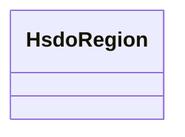

# Class: No class name specified (hsdo_Region)


_No class (type) description specified_


URI: [hsdo:Region](http://schema.org/Region)





<!-- no inheritance hierarchy -->


## Slots

| Name | Cardinality and Range | Description | Inheritance |
| ---  | --- | --- | --- |


## Examples

| Value |
| --- |
| https://climateKG.org/entity/0ad9d595-8e1d-478b-873e-5b4a112354d4 |


## Identifier and Mapping Information


### Schema Source


* from schema: climatepub4-kg


## Mappings

| Mapping Type | Mapped Value |
| ---  | ---  |
| self | hsdo:Region |
| native | climatepub4-kg/:HsdoRegion |


## LinkML Source

<!-- TODO: investigate https://stackoverflow.com/questions/37606292/how-to-create-tabbed-code-blocks-in-mkdocs-or-sphinx -->

### Direct

<details>
```yaml
name: hsdo_Region
conforms_to: No schema conformance document specified
description: No class (type) description specified
title: No class name specified
notes:
- Class with 69 occurrences.
examples:
- value: https://climateKG.org/entity/0ad9d595-8e1d-478b-873e-5b4a112354d4
from_schema: climatepub4-kg
rank: 1000
class_uri: hsdo:Region

```
</details>

### Induced

<details>
```yaml
name: hsdo_Region
conforms_to: No schema conformance document specified
description: No class (type) description specified
title: No class name specified
notes:
- Class with 69 occurrences.
examples:
- value: https://climateKG.org/entity/0ad9d595-8e1d-478b-873e-5b4a112354d4
from_schema: climatepub4-kg
rank: 1000
class_uri: hsdo:Region

```
</details>