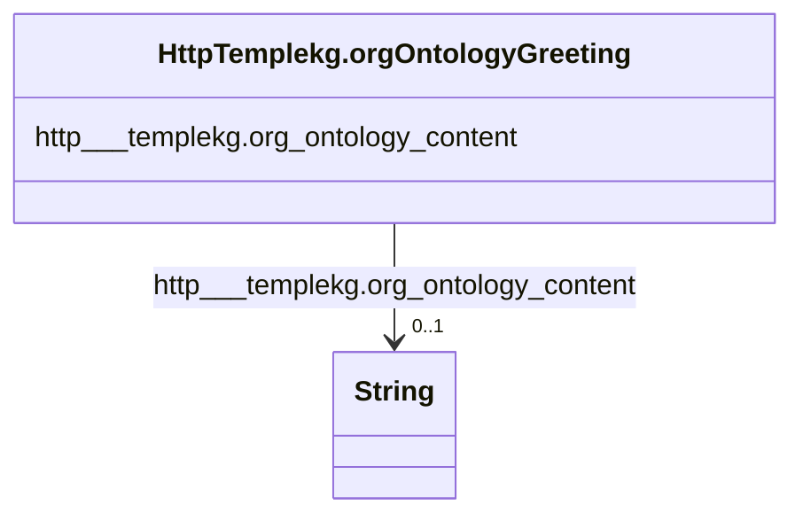

# Class: HttpTemplekg.orgOntologyGreeting


This class occurs 2 times.


URI: [http://templekg.org/ontology/Greeting](http://templekg.org/ontology/Greeting)





<!-- no inheritance hierarchy -->


## Slots

| Name | Cardinality and Range | Description | Inheritance | Occurrences |
| ---  | --- | --- | --- | --- |
| [http___templekg.org_ontology_content](../slots/http___templekg.org_ontology_content.md) | 0..1 <br/> [xsd:string](http://www.w3.org/2001/XMLSchema#string) |  <br/>  | direct | 2 |


## LinkML Source

<!-- TODO: investigate https://stackoverflow.com/questions/37606292/how-to-create-tabbed-code-blocks-in-mkdocs-or-sphinx -->

### Direct

<details>

```yaml
name: http___templekg.org_ontology_Greeting
from_schema: okns:climatepub4-kg
rank: 1000
slots:
- http___templekg.org_ontology_content
class_uri: http://templekg.org/ontology/Greeting

```
</details>

### Induced

<details>

```yaml
name: http___templekg.org_ontology_Greeting
from_schema: okns:climatepub4-kg
rank: 1000
attributes:
  http___templekg.org_ontology_content:
    name: http___templekg.org_ontology_content
    from_schema: okns:climatepub4-kg
    rank: 1000
    slot_uri: http://templekg.org/ontology/content
    alias: http___templekg.org_ontology_content
    owner: http___templekg.org_ontology_Greeting
    domain_of:
    - http___templekg.org_ontology_Greeting
    range: string
class_uri: http://templekg.org/ontology/Greeting

```
</details>