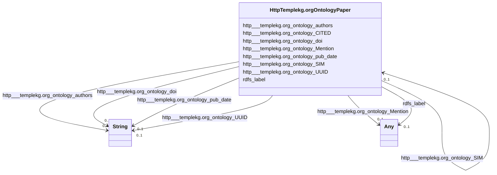

# Class: HttpTemplekg.orgOntologyPaper


This class occurs 500 times.


URI: [http://templekg.org/ontology/Paper](http://templekg.org/ontology/Paper)





<!-- no inheritance hierarchy -->


## Slots

| Name | Cardinality and Range | Description | Inheritance | Occurrences |
| ---  | --- | --- | --- | --- |
| [http___templekg.org_ontology_Mention](../slots/http___templekg.org_ontology_Mention.md) | 0..1 <br/> [HttpTemplekg.orgOntologyPlatform](../classes/HttpTemplekg.orgOntologyPlatform.md)&nbsp;or&nbsp;<br />[HttpTemplekg.orgOntologyWeatherEvent](../classes/HttpTemplekg.orgOntologyWeatherEvent.md)&nbsp;or&nbsp;<br />[HttpTemplekg.orgOntologyTeleconnection](../classes/HttpTemplekg.orgOntologyTeleconnection.md)&nbsp;or&nbsp;<br />[HttpTemplekg.orgOntologyVariable](../classes/HttpTemplekg.orgOntologyVariable.md)&nbsp;or&nbsp;<br />[HttpTemplekg.orgOntologyModel](../classes/HttpTemplekg.orgOntologyModel.md)&nbsp;or&nbsp;<br />[HttpTemplekg.orgOntologyOthers](../classes/HttpTemplekg.orgOntologyOthers.md)&nbsp;or&nbsp;<br />[HttpTemplekg.orgOntologyProvider](../classes/HttpTemplekg.orgOntologyProvider.md)&nbsp;or&nbsp;<br />[HttpTemplekg.orgOntologyExperiment](../classes/HttpTemplekg.orgOntologyExperiment.md)&nbsp;or&nbsp;<br />[SdosProject](../classes/SdosProject.md)&nbsp;or&nbsp;<br />[HttpTemplekg.orgOntologyLocation](../classes/HttpTemplekg.orgOntologyLocation.md)&nbsp;or&nbsp;<br />[HttpTemplekg.orgOntologyNaturalHazard](../classes/HttpTemplekg.orgOntologyNaturalHazard.md)&nbsp;or&nbsp;<br />[HttpTemplekg.orgOntologyOceanCirculation](../classes/HttpTemplekg.orgOntologyOceanCirculation.md)&nbsp;or&nbsp;<br />[HttpTemplekg.orgOntologyInstrument](../classes/HttpTemplekg.orgOntologyInstrument.md) |  <br/>  | direct | 22181 |
| [http___templekg.org_ontology_CITED](../slots/http___templekg.org_ontology_CITED.md) | 0..1 <br/> [HttpTemplekg.orgOntologyPaper](../classes/HttpTemplekg.orgOntologyPaper.md) |  <br/>  | direct | 117 |
| [http___templekg.org_ontology_authors](../slots/http___templekg.org_ontology_authors.md) | 0..1 <br/> [xsd:string](http://www.w3.org/2001/XMLSchema#string) |  <br/>  | direct | 486 |
| [http___templekg.org_ontology_UUID](../slots/http___templekg.org_ontology_UUID.md) | 0..1 <br/> [xsd:string](http://www.w3.org/2001/XMLSchema#string) |  <br/>  | direct | 500 |
| [http___templekg.org_ontology_doi](../slots/http___templekg.org_ontology_doi.md) | 0..1 <br/> [xsd:string](http://www.w3.org/2001/XMLSchema#string) |  <br/>  | direct | 475 |
| [http___templekg.org_ontology_SIM](../slots/http___templekg.org_ontology_SIM.md) | 0..1 <br/> [HttpTemplekg.orgOntologyPaper](../classes/HttpTemplekg.orgOntologyPaper.md) |  <br/>  | direct | 1068 |
| [rdfs_label](../slots/rdfs_label.md) | 0..1 <br/> [RdfsLiteral](../classes/RdfsLiteral.md)&nbsp;or&nbsp;<br />[xsd:string](http://www.w3.org/2001/XMLSchema#string) | A human-readable name for the subject <br/>  | direct | 484 |
| [http___templekg.org_ontology_pub_date](../slots/http___templekg.org_ontology_pub_date.md) | 0..1 <br/> [xsd:string](http://www.w3.org/2001/XMLSchema#string) |  <br/>  | direct | 363 |


## Usages

| used by | used in | type | used |
| ---  | --- | --- | --- |
| [HttpTemplekg.orgOntologyPaper](../classes/HttpTemplekg.orgOntologyPaper.md) | [http___templekg.org_ontology_CITED](../slots/http___templekg.org_ontology_CITED.md) | range | [HttpTemplekg.orgOntologyPaper](../classes/HttpTemplekg.orgOntologyPaper.md) |
| [HttpTemplekg.orgOntologyPaper](../classes/HttpTemplekg.orgOntologyPaper.md) | [http___templekg.org_ontology_SIM](../slots/http___templekg.org_ontology_SIM.md) | range | [HttpTemplekg.orgOntologyPaper](../classes/HttpTemplekg.orgOntologyPaper.md) |


## LinkML Source

<!-- TODO: investigate https://stackoverflow.com/questions/37606292/how-to-create-tabbed-code-blocks-in-mkdocs-or-sphinx -->

### Direct

<details>

```yaml
name: http___templekg.org_ontology_Paper
from_schema: okns:climatepub4-kg
rank: 1000
slots:
- http___templekg.org_ontology_Mention
- http___templekg.org_ontology_CITED
- http___templekg.org_ontology_authors
- http___templekg.org_ontology_UUID
- http___templekg.org_ontology_doi
- http___templekg.org_ontology_SIM
- rdfs_label
- http___templekg.org_ontology_pub_date
class_uri: http://templekg.org/ontology/Paper

```
</details>

### Induced

<details>

```yaml
name: http___templekg.org_ontology_Paper
from_schema: okns:climatepub4-kg
rank: 1000
attributes:
  http___templekg.org_ontology_Mention:
    name: http___templekg.org_ontology_Mention
    from_schema: okns:climatepub4-kg
    rank: 1000
    slot_uri: http://templekg.org/ontology/Mention
    alias: http___templekg.org_ontology_Mention
    owner: http___templekg.org_ontology_Paper
    domain_of:
    - http___templekg.org_ontology_Paper
    range: Any
    any_of:
    - range: http___templekg.org_ontology_Platform
    - range: http___templekg.org_ontology_WeatherEvent
    - range: http___templekg.org_ontology_Teleconnection
    - range: http___templekg.org_ontology_Variable
    - range: http___templekg.org_ontology_Model
    - range: http___templekg.org_ontology_Others
    - range: http___templekg.org_ontology_Provider
    - range: http___templekg.org_ontology_Experiment
    - range: sdos_Project
    - range: http___templekg.org_ontology_Location
    - range: http___templekg.org_ontology_NaturalHazard
    - range: http___templekg.org_ontology_OceanCirculation
    - range: http___templekg.org_ontology_Instrument
  http___templekg.org_ontology_CITED:
    name: http___templekg.org_ontology_CITED
    from_schema: okns:climatepub4-kg
    rank: 1000
    slot_uri: http://templekg.org/ontology/CITED
    alias: http___templekg.org_ontology_CITED
    owner: http___templekg.org_ontology_Paper
    domain_of:
    - http___templekg.org_ontology_Paper
    range: http___templekg.org_ontology_Paper
  http___templekg.org_ontology_authors:
    name: http___templekg.org_ontology_authors
    from_schema: okns:climatepub4-kg
    rank: 1000
    slot_uri: http://templekg.org/ontology/authors
    alias: http___templekg.org_ontology_authors
    owner: http___templekg.org_ontology_Paper
    domain_of:
    - http___templekg.org_ontology_Paper
    range: string
  http___templekg.org_ontology_UUID:
    name: http___templekg.org_ontology_UUID
    from_schema: okns:climatepub4-kg
    rank: 1000
    slot_uri: http://templekg.org/ontology/UUID
    alias: http___templekg.org_ontology_UUID
    owner: http___templekg.org_ontology_Paper
    domain_of:
    - http___templekg.org_ontology_Experiment
    - http___templekg.org_ontology_Instrument
    - http___templekg.org_ontology_Location
    - http___templekg.org_ontology_Model
    - http___templekg.org_ontology_NaturalHazard
    - http___templekg.org_ontology_OceanCirculation
    - http___templekg.org_ontology_Others
    - http___templekg.org_ontology_Paper
    - http___templekg.org_ontology_Platform
    - http___templekg.org_ontology_Provider
    - http___templekg.org_ontology_Teleconnection
    - http___templekg.org_ontology_Variable
    - http___templekg.org_ontology_WeatherEvent
    range: string
  http___templekg.org_ontology_doi:
    name: http___templekg.org_ontology_doi
    from_schema: okns:climatepub4-kg
    rank: 1000
    slot_uri: http://templekg.org/ontology/doi
    alias: http___templekg.org_ontology_doi
    owner: http___templekg.org_ontology_Paper
    domain_of:
    - http___templekg.org_ontology_Paper
    range: string
  http___templekg.org_ontology_SIM:
    name: http___templekg.org_ontology_SIM
    from_schema: okns:climatepub4-kg
    rank: 1000
    slot_uri: http://templekg.org/ontology/SIM
    alias: http___templekg.org_ontology_SIM
    owner: http___templekg.org_ontology_Paper
    domain_of:
    - http___templekg.org_ontology_Paper
    range: http___templekg.org_ontology_Paper
  rdfs_label:
    name: rdfs_label
    description: A human-readable name for the subject.
    title: label
    from_schema: okns:owl-rdf-rdfs
    source: http://www.w3.org/2000/01/rdf-schema#
    domain: rdfs_Resource
    slot_uri: rdfs:label
    alias: rdfs_label
    owner: http___templekg.org_ontology_Paper
    domain_of:
    - owl_OntologyProperty
    - rdf_List
    - rdfs_Datatype
    - sdos_ActionStatusType
    - sdos_AdultOrientedEnumeration
    - sdos_BoardingPolicyType
    - sdos_BodyMeasurementTypeEnumeration
    - sdos_BookFormatType
    - sdos_Boolean
    - sdos_CarUsageType
    - sdos_CertificationStatusEnumeration
    - sdos_ContactPointOption
    - sdos_DayOfWeek
    - sdos_DeliveryMethod
    - sdos_DigitalDocumentPermissionType
    - sdos_DigitalPlatformEnumeration
    - sdos_DriveWheelConfigurationValue
    - sdos_DrugCostCategory
    - sdos_DrugPregnancyCategory
    - sdos_DrugPrescriptionStatus
    - sdos_EUEnergyEfficiencyEnumeration
    - sdos_EnergyStarEnergyEfficiencyEnumeration
    - sdos_EventAttendanceModeEnumeration
    - sdos_EventStatusType
    - sdos_FulfillmentTypeEnumeration
    - sdos_GameAvailabilityEnumeration
    - sdos_GamePlayMode
    - sdos_GameServerStatus
    - sdos_GenderType
    - sdos_GovernmentBenefitsType
    - sdos_HealthAspectEnumeration
    - sdos_IPTCDigitalSourceEnumeration
    - sdos_IncentiveQualifiedExpenseType
    - sdos_IncentiveStatus
    - sdos_IncentiveType
    - sdos_InfectiousAgentClass
    - sdos_ItemAvailability
    - sdos_ItemListOrderType
    - sdos_LegalForceStatus
    - sdos_LegalValueLevel
    - sdos_MapCategoryType
    - sdos_MeasurementMethodEnum
    - sdos_MediaManipulationRatingEnumeration
    - sdos_MedicalAudienceType
    - sdos_MedicalDevicePurpose
    - sdos_MedicalEvidenceLevel
    - sdos_MedicalImagingTechnique
    - sdos_MedicalObservationalStudyDesign
    - sdos_MedicalProcedureType
    - sdos_MedicalSpecialty
    - sdos_MedicalStudyStatus
    - sdos_MedicalTrialDesign
    - sdos_MedicineSystem
    - sdos_MerchantReturnEnumeration
    - sdos_MusicAlbumProductionType
    - sdos_MusicAlbumReleaseType
    - sdos_MusicReleaseFormatType
    - sdos_NLNonprofitType
    - sdos_OfferItemCondition
    - sdos_OrderStatus
    - sdos_PaymentMethodType
    - sdos_PaymentStatusType
    - sdos_PhysicalActivityCategory
    - sdos_PhysicalExam
    - sdos_PriceComponentTypeEnumeration
    - sdos_PriceTypeEnumeration
    - sdos_ProductReturnEnumeration
    - sdos_PurchaseType
    - sdos_RefundTypeEnumeration
    - sdos_ReservationStatusType
    - sdos_RestrictedDiet
    - sdos_ReturnFeesEnumeration
    - sdos_ReturnLabelSourceEnumeration
    - sdos_ReturnMethodEnumeration
    - sdos_RsvpResponseType
    - sdos_SizeSystemEnumeration
    - sdos_SteeringPositionValue
    - sdos_TierBenefitEnumeration
    - sdos_UKNonprofitType
    - sdos_USNonprofitType
    - sdos_WearableMeasurementTypeEnumeration
    - sdos_WearableSizeGroupEnumeration
    - sdos_WearableSizeSystemEnumeration
    - dcam_VocabularyEncodingScheme
    - http___templekg.org_ontology_Experiment
    - http___templekg.org_ontology_Instrument
    - http___templekg.org_ontology_Location
    - http___templekg.org_ontology_Model
    - http___templekg.org_ontology_NaturalHazard
    - http___templekg.org_ontology_OceanCirculation
    - http___templekg.org_ontology_Others
    - http___templekg.org_ontology_Paper
    - http___templekg.org_ontology_Platform
    - http___templekg.org_ontology_Provider
    - http___templekg.org_ontology_Teleconnection
    - http___templekg.org_ontology_Variable
    - http___templekg.org_ontology_WeatherEvent
    range: Any
    any_of:
    - range: rdfs_Literal
    - range: string
  http___templekg.org_ontology_pub_date:
    name: http___templekg.org_ontology_pub_date
    from_schema: okns:climatepub4-kg
    rank: 1000
    slot_uri: http://templekg.org/ontology/pub_date
    alias: http___templekg.org_ontology_pub_date
    owner: http___templekg.org_ontology_Paper
    domain_of:
    - http___templekg.org_ontology_Paper
    range: string
class_uri: http://templekg.org/ontology/Paper

```
</details>