# Class: HttpTemplekg.orgOntologyPlatform


This class occurs 1214 times.


URI: [http://templekg.org/ontology/Platform](http://templekg.org/ontology/Platform)

```mermaid
 classDiagram
    class HttpTemplekg.orgOntologyPlatform
    click HttpTemplekg.orgOntologyPlatform href "../HttpTemplekg.orgOntologyPlatform"
      HttpTemplekg.orgOntologyPlatform : dct_description
        
          
    
    
    HttpTemplekg.orgOntologyPlatform --> "0..1" String : dct_description
    click String href "../String"

        
      HttpTemplekg.orgOntologyPlatform : http___templekg.org_ontology_ChildOf
        
          
    
    
    HttpTemplekg.orgOntologyPlatform --> "0..1" Any : http___templekg.org_ontology_ChildOf
    click Any href "../Any"

        
      HttpTemplekg.orgOntologyPlatform : http___templekg.org_ontology_collapsed_uuids
        
          
    
    
    HttpTemplekg.orgOntologyPlatform --> "0..1" String : http___templekg.org_ontology_collapsed_uuids
    click String href "../String"

        
      HttpTemplekg.orgOntologyPlatform : http___templekg.org_ontology_ComparedTo
        
          
    
    
    HttpTemplekg.orgOntologyPlatform --> "0..1" Any : http___templekg.org_ontology_ComparedTo
    click Any href "../Any"

        
      HttpTemplekg.orgOntologyPlatform : http___templekg.org_ontology_MountedOn
        
          
    
    
    HttpTemplekg.orgOntologyPlatform --> "0..1" Any : http___templekg.org_ontology_MountedOn
    click Any href "../Any"

        
      HttpTemplekg.orgOntologyPlatform : http___templekg.org_ontology_Outputs
        
          
    
    
    HttpTemplekg.orgOntologyPlatform --> "0..1" Any : http___templekg.org_ontology_Outputs
    click Any href "../Any"

        
      HttpTemplekg.orgOntologyPlatform : http___templekg.org_ontology_ProvidedBy
        
          
    
    
    HttpTemplekg.orgOntologyPlatform --> "0..1" Any : http___templekg.org_ontology_ProvidedBy
    click Any href "../Any"

        
      HttpTemplekg.orgOntologyPlatform : http___templekg.org_ontology_RunBy
        
          
    
    
    HttpTemplekg.orgOntologyPlatform --> "0..1" Any : http___templekg.org_ontology_RunBy
    click Any href "../Any"

        
      HttpTemplekg.orgOntologyPlatform : http___templekg.org_ontology_TargetsLocation
        
          
    
    
    HttpTemplekg.orgOntologyPlatform --> "0..1" Any : http___templekg.org_ontology_TargetsLocation
    click Any href "../Any"

        
      HttpTemplekg.orgOntologyPlatform : http___templekg.org_ontology_UsedIn
        
          
    
    
    HttpTemplekg.orgOntologyPlatform --> "0..1" Any : http___templekg.org_ontology_UsedIn
    click Any href "../Any"

        
      HttpTemplekg.orgOntologyPlatform : http___templekg.org_ontology_UUID
        
          
    
    
    HttpTemplekg.orgOntologyPlatform --> "0..1" String : http___templekg.org_ontology_UUID
    click String href "../String"

        
      HttpTemplekg.orgOntologyPlatform : http___templekg.org_ontology_ValidatedBy
        
          
    
    
    HttpTemplekg.orgOntologyPlatform --> "0..1" Any : http___templekg.org_ontology_ValidatedBy
    click Any href "../Any"

        
      HttpTemplekg.orgOntologyPlatform : http___templekg.org_ontology_WikiBasedOn
        
          
    
    
    HttpTemplekg.orgOntologyPlatform --> "0..1" Any : http___templekg.org_ontology_WikiBasedOn
    click Any href "../Any"

        
      HttpTemplekg.orgOntologyPlatform : http___templekg.org_ontology_WikiChild
        
          
    
    
    HttpTemplekg.orgOntologyPlatform --> "0..1" Any : http___templekg.org_ontology_WikiChild
    click Any href "../Any"

        
      HttpTemplekg.orgOntologyPlatform : http___templekg.org_ontology_WikiContinent
        
          
    
    
    HttpTemplekg.orgOntologyPlatform --> "0..1" HttpTemplekg.orgOntologyLocation : http___templekg.org_ontology_WikiContinent
    click HttpTemplekg.orgOntologyLocation href "../HttpTemplekg.orgOntologyLocation"

        
      HttpTemplekg.orgOntologyPlatform : http___templekg.org_ontology_WikiCountryOfCitizenship
        
          
    
    
    HttpTemplekg.orgOntologyPlatform --> "0..1" Any : http___templekg.org_ontology_WikiCountryOfCitizenship
    click Any href "../Any"

        
      HttpTemplekg.orgOntologyPlatform : http___templekg.org_ontology_wikidata_description
        
          
    
    
    HttpTemplekg.orgOntologyPlatform --> "0..1" String : http___templekg.org_ontology_wikidata_description
    click String href "../String"

        
      HttpTemplekg.orgOntologyPlatform : http___templekg.org_ontology_wikidata_ids
        
          
    
    
    HttpTemplekg.orgOntologyPlatform --> "0..1" String : http___templekg.org_ontology_wikidata_ids
    click String href "../String"

        
      HttpTemplekg.orgOntologyPlatform : http___templekg.org_ontology_WikiDepicts
        
          
    
    
    HttpTemplekg.orgOntologyPlatform --> "0..1" Any : http___templekg.org_ontology_WikiDepicts
    click Any href "../Any"

        
      HttpTemplekg.orgOntologyPlatform : http___templekg.org_ontology_WikiDifferentFrom
        
          
    
    
    HttpTemplekg.orgOntologyPlatform --> "0..1" Any : http___templekg.org_ontology_WikiDifferentFrom
    click Any href "../Any"

        
      HttpTemplekg.orgOntologyPlatform : http___templekg.org_ontology_WikiExpressedIn
        
          
    
    
    HttpTemplekg.orgOntologyPlatform --> "0..1" HttpTemplekg.orgOntologyVariable : http___templekg.org_ontology_WikiExpressedIn
    click HttpTemplekg.orgOntologyVariable href "../HttpTemplekg.orgOntologyVariable"

        
      HttpTemplekg.orgOntologyPlatform : http___templekg.org_ontology_WikiFollowedBy
        
          
    
    
    HttpTemplekg.orgOntologyPlatform --> "0..1" Any : http___templekg.org_ontology_WikiFollowedBy
    click Any href "../Any"

        
      HttpTemplekg.orgOntologyPlatform : http___templekg.org_ontology_WikiFollows
        
          
    
    
    HttpTemplekg.orgOntologyPlatform --> "0..1" Any : http___templekg.org_ontology_WikiFollows
    click Any href "../Any"

        
      HttpTemplekg.orgOntologyPlatform : http___templekg.org_ontology_WikiHasEffect
        
          
    
    
    HttpTemplekg.orgOntologyPlatform --> "0..1" Any : http___templekg.org_ontology_WikiHasEffect
    click Any href "../Any"

        
      HttpTemplekg.orgOntologyPlatform : http___templekg.org_ontology_WikiHasParts
        
          
    
    
    HttpTemplekg.orgOntologyPlatform --> "0..1" Any : http___templekg.org_ontology_WikiHasParts
    click Any href "../Any"

        
      HttpTemplekg.orgOntologyPlatform : http___templekg.org_ontology_WikiHasUse
        
          
    
    
    HttpTemplekg.orgOntologyPlatform --> "0..1" Any : http___templekg.org_ontology_WikiHasUse
    click Any href "../Any"

        
      HttpTemplekg.orgOntologyPlatform : http___templekg.org_ontology_WikiInfluencedBy
        
          
    
    
    HttpTemplekg.orgOntologyPlatform --> "0..1" Any : http___templekg.org_ontology_WikiInfluencedBy
    click Any href "../Any"

        
      HttpTemplekg.orgOntologyPlatform : http___templekg.org_ontology_WikiInstanceOf
        
          
    
    
    HttpTemplekg.orgOntologyPlatform --> "0..1" Any : http___templekg.org_ontology_WikiInstanceOf
    click Any href "../Any"

        
      HttpTemplekg.orgOntologyPlatform : http___templekg.org_ontology_WikiLocatedInTheAdministrativeTerritorialEntity
        
          
    
    
    HttpTemplekg.orgOntologyPlatform --> "0..1" Any : http___templekg.org_ontology_WikiLocatedInTheAdministrativeTerritorialEntity
    click Any href "../Any"

        
      HttpTemplekg.orgOntologyPlatform : http___templekg.org_ontology_WikiMadeFromMaterial
        
          
    
    
    HttpTemplekg.orgOntologyPlatform --> "0..1" Any : http___templekg.org_ontology_WikiMadeFromMaterial
    click Any href "../Any"

        
      HttpTemplekg.orgOntologyPlatform : http___templekg.org_ontology_WikiNamedAfter
        
          
    
    
    HttpTemplekg.orgOntologyPlatform --> "0..1" Any : http___templekg.org_ontology_WikiNamedAfter
    click Any href "../Any"

        
      HttpTemplekg.orgOntologyPlatform : http___templekg.org_ontology_WikiOperator
        
          
    
    
    HttpTemplekg.orgOntologyPlatform --> "0..1" Any : http___templekg.org_ontology_WikiOperator
    click Any href "../Any"

        
      HttpTemplekg.orgOntologyPlatform : http___templekg.org_ontology_WikiPartOf
        
          
    
    
    HttpTemplekg.orgOntologyPlatform --> "0..1" Any : http___templekg.org_ontology_WikiPartOf
    click Any href "../Any"

        
      HttpTemplekg.orgOntologyPlatform : http___templekg.org_ontology_WikiPlaceOfPublication
        
          
    
    
    HttpTemplekg.orgOntologyPlatform --> "0..1" Any : http___templekg.org_ontology_WikiPlaceOfPublication
    click Any href "../Any"

        
      HttpTemplekg.orgOntologyPlatform : http___templekg.org_ontology_WikiStudiedIn
        
          
    
    
    HttpTemplekg.orgOntologyPlatform --> "0..1" Any : http___templekg.org_ontology_WikiStudiedIn
    click Any href "../Any"

        
      HttpTemplekg.orgOntologyPlatform : http___templekg.org_ontology_WikiSubclassOf
        
          
    
    
    HttpTemplekg.orgOntologyPlatform --> "0..1" Any : http___templekg.org_ontology_WikiSubclassOf
    click Any href "../Any"

        
      HttpTemplekg.orgOntologyPlatform : http___templekg.org_ontology_WikiUses
        
          
    
    
    HttpTemplekg.orgOntologyPlatform --> "0..1" Any : http___templekg.org_ontology_WikiUses
    click Any href "../Any"

        
      HttpTemplekg.orgOntologyPlatform : prov_atLocation
        
          
    
    
    HttpTemplekg.orgOntologyPlatform --> "0..1" ProvLocation : prov_atLocation
    click ProvLocation href "../ProvLocation"

        
      HttpTemplekg.orgOntologyPlatform : rdfs_label
        
          
    
    
    HttpTemplekg.orgOntologyPlatform --> "0..1" Any : rdfs_label
    click Any href "../Any"

        
      
```





<!-- no inheritance hierarchy -->


## Slots

| Name | Cardinality and Range | Description | Inheritance | Occurrences |
| ---  | --- | --- | --- | --- |
| [http___templekg.org_ontology_WikiInstanceOf](../slots/http___templekg.org_ontology_WikiInstanceOf.md) | 0..1 <br/> [HttpTemplekg.orgOntologyPlatform](../classes/HttpTemplekg.orgOntologyPlatform.md)&nbsp;or&nbsp;<br />[HttpTemplekg.orgOntologyVariable](../classes/HttpTemplekg.orgOntologyVariable.md)&nbsp;or&nbsp;<br />[HttpTemplekg.orgOntologyModel](../classes/HttpTemplekg.orgOntologyModel.md)&nbsp;or&nbsp;<br />[HttpTemplekg.orgOntologyOthers](../classes/HttpTemplekg.orgOntologyOthers.md)&nbsp;or&nbsp;<br />[HttpTemplekg.orgOntologyProvider](../classes/HttpTemplekg.orgOntologyProvider.md)&nbsp;or&nbsp;<br />[HttpTemplekg.orgOntologyLocation](../classes/HttpTemplekg.orgOntologyLocation.md)&nbsp;or&nbsp;<br />[HttpTemplekg.orgOntologyInstrument](../classes/HttpTemplekg.orgOntologyInstrument.md)&nbsp;or&nbsp;<br />[SdosProject](../classes/SdosProject.md) |  <br/>  | direct | 129 |
| [http___templekg.org_ontology_ProvidedBy](../slots/http___templekg.org_ontology_ProvidedBy.md) | 0..1 <br/> [HttpTemplekg.orgOntologyPlatform](../classes/HttpTemplekg.orgOntologyPlatform.md)&nbsp;or&nbsp;<br />[HttpTemplekg.orgOntologyWeatherEvent](../classes/HttpTemplekg.orgOntologyWeatherEvent.md)&nbsp;or&nbsp;<br />[HttpTemplekg.orgOntologyTeleconnection](../classes/HttpTemplekg.orgOntologyTeleconnection.md)&nbsp;or&nbsp;<br />[HttpTemplekg.orgOntologyVariable](../classes/HttpTemplekg.orgOntologyVariable.md)&nbsp;or&nbsp;<br />[HttpTemplekg.orgOntologyModel](../classes/HttpTemplekg.orgOntologyModel.md)&nbsp;or&nbsp;<br />[HttpTemplekg.orgOntologyOthers](../classes/HttpTemplekg.orgOntologyOthers.md)&nbsp;or&nbsp;<br />[HttpTemplekg.orgOntologyProvider](../classes/HttpTemplekg.orgOntologyProvider.md)&nbsp;or&nbsp;<br />[HttpTemplekg.orgOntologyExperiment](../classes/HttpTemplekg.orgOntologyExperiment.md)&nbsp;or&nbsp;<br />[SdosProject](../classes/SdosProject.md)&nbsp;or&nbsp;<br />[HttpTemplekg.orgOntologyLocation](../classes/HttpTemplekg.orgOntologyLocation.md)&nbsp;or&nbsp;<br />[HttpTemplekg.orgOntologyInstrument](../classes/HttpTemplekg.orgOntologyInstrument.md) |  <br/>  | direct | 44 |
| [http___templekg.org_ontology_MountedOn](../slots/http___templekg.org_ontology_MountedOn.md) | 0..1 <br/> [HttpTemplekg.orgOntologyPlatform](../classes/HttpTemplekg.orgOntologyPlatform.md)&nbsp;or&nbsp;<br />[HttpTemplekg.orgOntologyModel](../classes/HttpTemplekg.orgOntologyModel.md)&nbsp;or&nbsp;<br />[HttpTemplekg.orgOntologyOthers](../classes/HttpTemplekg.orgOntologyOthers.md)&nbsp;or&nbsp;<br />[HttpTemplekg.orgOntologyProvider](../classes/HttpTemplekg.orgOntologyProvider.md)&nbsp;or&nbsp;<br />[SdosProject](../classes/SdosProject.md)&nbsp;or&nbsp;<br />[HttpTemplekg.orgOntologyLocation](../classes/HttpTemplekg.orgOntologyLocation.md)&nbsp;or&nbsp;<br />[HttpTemplekg.orgOntologyInstrument](../classes/HttpTemplekg.orgOntologyInstrument.md) |  <br/>  | direct | 6 |
| [http___templekg.org_ontology_WikiNamedAfter](../slots/http___templekg.org_ontology_WikiNamedAfter.md) | 0..1 <br/> [HttpTemplekg.orgOntologyPlatform](../classes/HttpTemplekg.orgOntologyPlatform.md)&nbsp;or&nbsp;<br />[HttpTemplekg.orgOntologyOthers](../classes/HttpTemplekg.orgOntologyOthers.md)&nbsp;or&nbsp;<br />[HttpTemplekg.orgOntologyProvider](../classes/HttpTemplekg.orgOntologyProvider.md)&nbsp;or&nbsp;<br />[SdosProject](../classes/SdosProject.md)&nbsp;or&nbsp;<br />[HttpTemplekg.orgOntologyLocation](../classes/HttpTemplekg.orgOntologyLocation.md)&nbsp;or&nbsp;<br />[HttpTemplekg.orgOntologyInstrument](../classes/HttpTemplekg.orgOntologyInstrument.md) |  <br/>  | direct | 6 |
| [http___templekg.org_ontology_WikiPartOf](../slots/http___templekg.org_ontology_WikiPartOf.md) | 0..1 <br/> [HttpTemplekg.orgOntologyPlatform](../classes/HttpTemplekg.orgOntologyPlatform.md)&nbsp;or&nbsp;<br />[HttpTemplekg.orgOntologyTeleconnection](../classes/HttpTemplekg.orgOntologyTeleconnection.md)&nbsp;or&nbsp;<br />[HttpTemplekg.orgOntologyOthers](../classes/HttpTemplekg.orgOntologyOthers.md)&nbsp;or&nbsp;<br />[HttpTemplekg.orgOntologyProvider](../classes/HttpTemplekg.orgOntologyProvider.md)&nbsp;or&nbsp;<br />[SdosProject](../classes/SdosProject.md)&nbsp;or&nbsp;<br />[HttpTemplekg.orgOntologyLocation](../classes/HttpTemplekg.orgOntologyLocation.md)&nbsp;or&nbsp;<br />[HttpTemplekg.orgOntologyInstrument](../classes/HttpTemplekg.orgOntologyInstrument.md) |  <br/>  | direct | 151 |
| [http___templekg.org_ontology_TargetsLocation](../slots/http___templekg.org_ontology_TargetsLocation.md) | 0..1 <br/> [HttpTemplekg.orgOntologyPlatform](../classes/HttpTemplekg.orgOntologyPlatform.md)&nbsp;or&nbsp;<br />[HttpTemplekg.orgOntologyWeatherEvent](../classes/HttpTemplekg.orgOntologyWeatherEvent.md)&nbsp;or&nbsp;<br />[HttpTemplekg.orgOntologyTeleconnection](../classes/HttpTemplekg.orgOntologyTeleconnection.md)&nbsp;or&nbsp;<br />[HttpTemplekg.orgOntologyVariable](../classes/HttpTemplekg.orgOntologyVariable.md)&nbsp;or&nbsp;<br />[HttpTemplekg.orgOntologyModel](../classes/HttpTemplekg.orgOntologyModel.md)&nbsp;or&nbsp;<br />[HttpTemplekg.orgOntologyOthers](../classes/HttpTemplekg.orgOntologyOthers.md)&nbsp;or&nbsp;<br />[HttpTemplekg.orgOntologyProvider](../classes/HttpTemplekg.orgOntologyProvider.md)&nbsp;or&nbsp;<br />[HttpTemplekg.orgOntologyExperiment](../classes/HttpTemplekg.orgOntologyExperiment.md)&nbsp;or&nbsp;<br />[HttpTemplekg.orgOntologyLocation](../classes/HttpTemplekg.orgOntologyLocation.md)&nbsp;or&nbsp;<br />[HttpTemplekg.orgOntologyInstrument](../classes/HttpTemplekg.orgOntologyInstrument.md)&nbsp;or&nbsp;<br />[HttpTemplekg.orgOntologyNaturalHazard](../classes/HttpTemplekg.orgOntologyNaturalHazard.md)&nbsp;or&nbsp;<br />[HttpTemplekg.orgOntologyOceanCirculation](../classes/HttpTemplekg.orgOntologyOceanCirculation.md)&nbsp;or&nbsp;<br />[SdosProject](../classes/SdosProject.md) |  <br/>  | direct | 65 |
| [http___templekg.org_ontology_RunBy](../slots/http___templekg.org_ontology_RunBy.md) | 0..1 <br/> [HttpTemplekg.orgOntologyPlatform](../classes/HttpTemplekg.orgOntologyPlatform.md)&nbsp;or&nbsp;<br />[HttpTemplekg.orgOntologyTeleconnection](../classes/HttpTemplekg.orgOntologyTeleconnection.md)&nbsp;or&nbsp;<br />[HttpTemplekg.orgOntologyModel](../classes/HttpTemplekg.orgOntologyModel.md)&nbsp;or&nbsp;<br />[HttpTemplekg.orgOntologyOthers](../classes/HttpTemplekg.orgOntologyOthers.md)&nbsp;or&nbsp;<br />[HttpTemplekg.orgOntologyProvider](../classes/HttpTemplekg.orgOntologyProvider.md)&nbsp;or&nbsp;<br />[HttpTemplekg.orgOntologyExperiment](../classes/HttpTemplekg.orgOntologyExperiment.md)&nbsp;or&nbsp;<br />[HttpTemplekg.orgOntologyLocation](../classes/HttpTemplekg.orgOntologyLocation.md)&nbsp;or&nbsp;<br />[HttpTemplekg.orgOntologyOceanCirculation](../classes/HttpTemplekg.orgOntologyOceanCirculation.md)&nbsp;or&nbsp;<br />[SdosProject](../classes/SdosProject.md) |  <br/>  | direct | 19 |
| [http___templekg.org_ontology_ChildOf](../slots/http___templekg.org_ontology_ChildOf.md) | 0..1 <br/> [HttpTemplekg.orgOntologyPlatform](../classes/HttpTemplekg.orgOntologyPlatform.md)&nbsp;or&nbsp;<br />[HttpTemplekg.orgOntologyWeatherEvent](../classes/HttpTemplekg.orgOntologyWeatherEvent.md)&nbsp;or&nbsp;<br />[HttpTemplekg.orgOntologyVariable](../classes/HttpTemplekg.orgOntologyVariable.md)&nbsp;or&nbsp;<br />[HttpTemplekg.orgOntologyModel](../classes/HttpTemplekg.orgOntologyModel.md)&nbsp;or&nbsp;<br />[HttpTemplekg.orgOntologyOthers](../classes/HttpTemplekg.orgOntologyOthers.md)&nbsp;or&nbsp;<br />[HttpTemplekg.orgOntologyProvider](../classes/HttpTemplekg.orgOntologyProvider.md)&nbsp;or&nbsp;<br />[HttpTemplekg.orgOntologyLocation](../classes/HttpTemplekg.orgOntologyLocation.md)&nbsp;or&nbsp;<br />[HttpTemplekg.orgOntologyInstrument](../classes/HttpTemplekg.orgOntologyInstrument.md)&nbsp;or&nbsp;<br />[HttpTemplekg.orgOntologyNaturalHazard](../classes/HttpTemplekg.orgOntologyNaturalHazard.md)&nbsp;or&nbsp;<br />[HttpTemplekg.orgOntologyOceanCirculation](../classes/HttpTemplekg.orgOntologyOceanCirculation.md)&nbsp;or&nbsp;<br />[SdosProject](../classes/SdosProject.md) |  <br/>  | direct | 4268 |
| [http___templekg.org_ontology_Outputs](../slots/http___templekg.org_ontology_Outputs.md) | 0..1 <br/> [HttpTemplekg.orgOntologyPlatform](../classes/HttpTemplekg.orgOntologyPlatform.md)&nbsp;or&nbsp;<br />[HttpTemplekg.orgOntologyWeatherEvent](../classes/HttpTemplekg.orgOntologyWeatherEvent.md)&nbsp;or&nbsp;<br />[HttpTemplekg.orgOntologyTeleconnection](../classes/HttpTemplekg.orgOntologyTeleconnection.md)&nbsp;or&nbsp;<br />[HttpTemplekg.orgOntologyVariable](../classes/HttpTemplekg.orgOntologyVariable.md)&nbsp;or&nbsp;<br />[HttpTemplekg.orgOntologyModel](../classes/HttpTemplekg.orgOntologyModel.md)&nbsp;or&nbsp;<br />[HttpTemplekg.orgOntologyOthers](../classes/HttpTemplekg.orgOntologyOthers.md)&nbsp;or&nbsp;<br />[HttpTemplekg.orgOntologyProvider](../classes/HttpTemplekg.orgOntologyProvider.md)&nbsp;or&nbsp;<br />[HttpTemplekg.orgOntologyExperiment](../classes/HttpTemplekg.orgOntologyExperiment.md)&nbsp;or&nbsp;<br />[HttpTemplekg.orgOntologyInstrument](../classes/HttpTemplekg.orgOntologyInstrument.md)&nbsp;or&nbsp;<br />[HttpTemplekg.orgOntologyNaturalHazard](../classes/HttpTemplekg.orgOntologyNaturalHazard.md)&nbsp;or&nbsp;<br />[HttpTemplekg.orgOntologyOceanCirculation](../classes/HttpTemplekg.orgOntologyOceanCirculation.md)&nbsp;or&nbsp;<br />[SdosProject](../classes/SdosProject.md) |  <br/>  | direct | 49 |
| [http___templekg.org_ontology_WikiPlaceOfPublication](../slots/http___templekg.org_ontology_WikiPlaceOfPublication.md) | 0..1 <br/> [HttpTemplekg.orgOntologyProvider](../classes/HttpTemplekg.orgOntologyProvider.md)&nbsp;or&nbsp;<br />[HttpTemplekg.orgOntologyLocation](../classes/HttpTemplekg.orgOntologyLocation.md)&nbsp;or&nbsp;<br />[HttpTemplekg.orgOntologyInstrument](../classes/HttpTemplekg.orgOntologyInstrument.md) |  <br/>  | direct | 18 |
| [http___templekg.org_ontology_WikiUses](../slots/http___templekg.org_ontology_WikiUses.md) | 0..1 <br/> [HttpTemplekg.orgOntologyPlatform](../classes/HttpTemplekg.orgOntologyPlatform.md)&nbsp;or&nbsp;<br />[HttpTemplekg.orgOntologyOthers](../classes/HttpTemplekg.orgOntologyOthers.md)&nbsp;or&nbsp;<br />[HttpTemplekg.orgOntologyProvider](../classes/HttpTemplekg.orgOntologyProvider.md)&nbsp;or&nbsp;<br />[HttpTemplekg.orgOntologyInstrument](../classes/HttpTemplekg.orgOntologyInstrument.md)&nbsp;or&nbsp;<br />[SdosProject](../classes/SdosProject.md) |  <br/>  | direct | 4 |
| [http___templekg.org_ontology_wikidata_description](../slots/http___templekg.org_ontology_wikidata_description.md) | 0..1 <br/> [xsd:string](http://www.w3.org/2001/XMLSchema#string) |  <br/>  | direct | 556 |
| [http___templekg.org_ontology_ComparedTo](../slots/http___templekg.org_ontology_ComparedTo.md) | 0..1 <br/> [HttpTemplekg.orgOntologyPlatform](../classes/HttpTemplekg.orgOntologyPlatform.md)&nbsp;or&nbsp;<br />[HttpTemplekg.orgOntologyWeatherEvent](../classes/HttpTemplekg.orgOntologyWeatherEvent.md)&nbsp;or&nbsp;<br />[HttpTemplekg.orgOntologyTeleconnection](../classes/HttpTemplekg.orgOntologyTeleconnection.md)&nbsp;or&nbsp;<br />[HttpTemplekg.orgOntologyVariable](../classes/HttpTemplekg.orgOntologyVariable.md)&nbsp;or&nbsp;<br />[HttpTemplekg.orgOntologyModel](../classes/HttpTemplekg.orgOntologyModel.md)&nbsp;or&nbsp;<br />[HttpTemplekg.orgOntologyOthers](../classes/HttpTemplekg.orgOntologyOthers.md)&nbsp;or&nbsp;<br />[HttpTemplekg.orgOntologyProvider](../classes/HttpTemplekg.orgOntologyProvider.md)&nbsp;or&nbsp;<br />[HttpTemplekg.orgOntologyExperiment](../classes/HttpTemplekg.orgOntologyExperiment.md)&nbsp;or&nbsp;<br />[HttpTemplekg.orgOntologyLocation](../classes/HttpTemplekg.orgOntologyLocation.md)&nbsp;or&nbsp;<br />[HttpTemplekg.orgOntologyInstrument](../classes/HttpTemplekg.orgOntologyInstrument.md)&nbsp;or&nbsp;<br />[HttpTemplekg.orgOntologyNaturalHazard](../classes/HttpTemplekg.orgOntologyNaturalHazard.md)&nbsp;or&nbsp;<br />[HttpTemplekg.orgOntologyOceanCirculation](../classes/HttpTemplekg.orgOntologyOceanCirculation.md)&nbsp;or&nbsp;<br />[SdosProject](../classes/SdosProject.md) |  <br/>  | direct | 32 |
| [http___templekg.org_ontology_wikidata_ids](../slots/http___templekg.org_ontology_wikidata_ids.md) | 0..1 <br/> [xsd:string](http://www.w3.org/2001/XMLSchema#string) |  <br/>  | direct | 577 |
| [http___templekg.org_ontology_WikiExpressedIn](../slots/http___templekg.org_ontology_WikiExpressedIn.md) | 0..1 <br/> [HttpTemplekg.orgOntologyVariable](../classes/HttpTemplekg.orgOntologyVariable.md) |  <br/>  | direct | 1 |
| [http___templekg.org_ontology_WikiChild](../slots/http___templekg.org_ontology_WikiChild.md) | 0..1 <br/> [HttpTemplekg.orgOntologyPlatform](../classes/HttpTemplekg.orgOntologyPlatform.md)&nbsp;or&nbsp;<br />[HttpTemplekg.orgOntologyOthers](../classes/HttpTemplekg.orgOntologyOthers.md)&nbsp;or&nbsp;<br />[HttpTemplekg.orgOntologyProvider](../classes/HttpTemplekg.orgOntologyProvider.md)&nbsp;or&nbsp;<br />[HttpTemplekg.orgOntologyLocation](../classes/HttpTemplekg.orgOntologyLocation.md)&nbsp;or&nbsp;<br />[HttpTemplekg.orgOntologyInstrument](../classes/HttpTemplekg.orgOntologyInstrument.md)&nbsp;or&nbsp;<br />[HttpTemplekg.orgOntologyNaturalHazard](../classes/HttpTemplekg.orgOntologyNaturalHazard.md)&nbsp;or&nbsp;<br />[SdosProject](../classes/SdosProject.md) |  <br/>  | direct | 23 |
| [http___templekg.org_ontology_WikiMadeFromMaterial](../slots/http___templekg.org_ontology_WikiMadeFromMaterial.md) | 0..1 <br/> [HttpTemplekg.orgOntologyOthers](../classes/HttpTemplekg.orgOntologyOthers.md)&nbsp;or&nbsp;<br />[SdosProject](../classes/SdosProject.md)&nbsp;or&nbsp;<br />[HttpTemplekg.orgOntologyVariable](../classes/HttpTemplekg.orgOntologyVariable.md)&nbsp;or&nbsp;<br />[HttpTemplekg.orgOntologyInstrument](../classes/HttpTemplekg.orgOntologyInstrument.md) |  <br/>  | direct | 3 |
| [http___templekg.org_ontology_WikiStudiedIn](../slots/http___templekg.org_ontology_WikiStudiedIn.md) | 0..1 <br/> [HttpTemplekg.orgOntologyModel](../classes/HttpTemplekg.orgOntologyModel.md)&nbsp;or&nbsp;<br />[HttpTemplekg.orgOntologyOthers](../classes/HttpTemplekg.orgOntologyOthers.md)&nbsp;or&nbsp;<br />[HttpTemplekg.orgOntologyProvider](../classes/HttpTemplekg.orgOntologyProvider.md)&nbsp;or&nbsp;<br />[HttpTemplekg.orgOntologyLocation](../classes/HttpTemplekg.orgOntologyLocation.md)&nbsp;or&nbsp;<br />[SdosProject](../classes/SdosProject.md) |  <br/>  | direct | 1 |
| [http___templekg.org_ontology_WikiOperator](../slots/http___templekg.org_ontology_WikiOperator.md) | 0..1 <br/> [HttpTemplekg.orgOntologyPlatform](../classes/HttpTemplekg.orgOntologyPlatform.md)&nbsp;or&nbsp;<br />[HttpTemplekg.orgOntologyOthers](../classes/HttpTemplekg.orgOntologyOthers.md)&nbsp;or&nbsp;<br />[HttpTemplekg.orgOntologyProvider](../classes/HttpTemplekg.orgOntologyProvider.md)&nbsp;or&nbsp;<br />[SdosProject](../classes/SdosProject.md)&nbsp;or&nbsp;<br />[HttpTemplekg.orgOntologyLocation](../classes/HttpTemplekg.orgOntologyLocation.md)&nbsp;or&nbsp;<br />[HttpTemplekg.orgOntologyInstrument](../classes/HttpTemplekg.orgOntologyInstrument.md) |  <br/>  | direct | 55 |
| [http___templekg.org_ontology_UsedIn](../slots/http___templekg.org_ontology_UsedIn.md) | 0..1 <br/> [HttpTemplekg.orgOntologyPlatform](../classes/HttpTemplekg.orgOntologyPlatform.md)&nbsp;or&nbsp;<br />[HttpTemplekg.orgOntologyWeatherEvent](../classes/HttpTemplekg.orgOntologyWeatherEvent.md)&nbsp;or&nbsp;<br />[HttpTemplekg.orgOntologyTeleconnection](../classes/HttpTemplekg.orgOntologyTeleconnection.md)&nbsp;or&nbsp;<br />[HttpTemplekg.orgOntologyVariable](../classes/HttpTemplekg.orgOntologyVariable.md)&nbsp;or&nbsp;<br />[HttpTemplekg.orgOntologyModel](../classes/HttpTemplekg.orgOntologyModel.md)&nbsp;or&nbsp;<br />[HttpTemplekg.orgOntologyOthers](../classes/HttpTemplekg.orgOntologyOthers.md)&nbsp;or&nbsp;<br />[HttpTemplekg.orgOntologyProvider](../classes/HttpTemplekg.orgOntologyProvider.md)&nbsp;or&nbsp;<br />[HttpTemplekg.orgOntologyExperiment](../classes/HttpTemplekg.orgOntologyExperiment.md)&nbsp;or&nbsp;<br />[SdosProject](../classes/SdosProject.md)&nbsp;or&nbsp;<br />[HttpTemplekg.orgOntologyLocation](../classes/HttpTemplekg.orgOntologyLocation.md)&nbsp;or&nbsp;<br />[HttpTemplekg.orgOntologyNaturalHazard](../classes/HttpTemplekg.orgOntologyNaturalHazard.md)&nbsp;or&nbsp;<br />[HttpTemplekg.orgOntologyOceanCirculation](../classes/HttpTemplekg.orgOntologyOceanCirculation.md)&nbsp;or&nbsp;<br />[HttpTemplekg.orgOntologyInstrument](../classes/HttpTemplekg.orgOntologyInstrument.md) |  <br/>  | direct | 112 |
| [http___templekg.org_ontology_WikiInfluencedBy](../slots/http___templekg.org_ontology_WikiInfluencedBy.md) | 0..1 <br/> [HttpTemplekg.orgOntologyPlatform](../classes/HttpTemplekg.orgOntologyPlatform.md)&nbsp;or&nbsp;<br />[HttpTemplekg.orgOntologyOthers](../classes/HttpTemplekg.orgOntologyOthers.md)&nbsp;or&nbsp;<br />[HttpTemplekg.orgOntologyProvider](../classes/HttpTemplekg.orgOntologyProvider.md)&nbsp;or&nbsp;<br />[HttpTemplekg.orgOntologyLocation](../classes/HttpTemplekg.orgOntologyLocation.md)&nbsp;or&nbsp;<br />[HttpTemplekg.orgOntologyInstrument](../classes/HttpTemplekg.orgOntologyInstrument.md)&nbsp;or&nbsp;<br />[SdosProject](../classes/SdosProject.md) |  <br/>  | direct | 2 |
| [http___templekg.org_ontology_WikiHasEffect](../slots/http___templekg.org_ontology_WikiHasEffect.md) | 0..1 <br/> [HttpTemplekg.orgOntologyNaturalHazard](../classes/HttpTemplekg.orgOntologyNaturalHazard.md)&nbsp;or&nbsp;<br />[SdosProject](../classes/SdosProject.md)&nbsp;or&nbsp;<br />[HttpTemplekg.orgOntologyInstrument](../classes/HttpTemplekg.orgOntologyInstrument.md)&nbsp;or&nbsp;<br />[HttpTemplekg.orgOntologyOthers](../classes/HttpTemplekg.orgOntologyOthers.md) |  <br/>  | direct | 1 |
| [http___templekg.org_ontology_WikiContinent](../slots/http___templekg.org_ontology_WikiContinent.md) | 0..1 <br/> [HttpTemplekg.orgOntologyLocation](../classes/HttpTemplekg.orgOntologyLocation.md) |  <br/>  | direct | 2 |
| [http___templekg.org_ontology_WikiCountryOfCitizenship](../slots/http___templekg.org_ontology_WikiCountryOfCitizenship.md) | 0..1 <br/> [HttpTemplekg.orgOntologyProvider](../classes/HttpTemplekg.orgOntologyProvider.md)&nbsp;or&nbsp;<br />[HttpTemplekg.orgOntologyLocation](../classes/HttpTemplekg.orgOntologyLocation.md)&nbsp;or&nbsp;<br />[SdosProject](../classes/SdosProject.md) |  <br/>  | direct | 12 |
| [dct_description](../slots/dct_description.md) | 0..1 <br/> [xsd:string](http://www.w3.org/2001/XMLSchema#string) | Description may include but is not limited to: an abstract, a table of conten... <br/> description: An account of the resource. | direct | 1159 |
| [http___templekg.org_ontology_collapsed_uuids](../slots/http___templekg.org_ontology_collapsed_uuids.md) | 0..1 <br/> [xsd:string](http://www.w3.org/2001/XMLSchema#string) |  <br/>  | direct | 24 |
| [http___templekg.org_ontology_WikiSubclassOf](../slots/http___templekg.org_ontology_WikiSubclassOf.md) | 0..1 <br/> [HttpTemplekg.orgOntologyPlatform](../classes/HttpTemplekg.orgOntologyPlatform.md)&nbsp;or&nbsp;<br />[HttpTemplekg.orgOntologyWeatherEvent](../classes/HttpTemplekg.orgOntologyWeatherEvent.md)&nbsp;or&nbsp;<br />[HttpTemplekg.orgOntologyVariable](../classes/HttpTemplekg.orgOntologyVariable.md)&nbsp;or&nbsp;<br />[HttpTemplekg.orgOntologyModel](../classes/HttpTemplekg.orgOntologyModel.md)&nbsp;or&nbsp;<br />[HttpTemplekg.orgOntologyOthers](../classes/HttpTemplekg.orgOntologyOthers.md)&nbsp;or&nbsp;<br />[HttpTemplekg.orgOntologyProvider](../classes/HttpTemplekg.orgOntologyProvider.md)&nbsp;or&nbsp;<br />[HttpTemplekg.orgOntologyLocation](../classes/HttpTemplekg.orgOntologyLocation.md)&nbsp;or&nbsp;<br />[HttpTemplekg.orgOntologyInstrument](../classes/HttpTemplekg.orgOntologyInstrument.md)&nbsp;or&nbsp;<br />[HttpTemplekg.orgOntologyNaturalHazard](../classes/HttpTemplekg.orgOntologyNaturalHazard.md)&nbsp;or&nbsp;<br />[HttpTemplekg.orgOntologyOceanCirculation](../classes/HttpTemplekg.orgOntologyOceanCirculation.md)&nbsp;or&nbsp;<br />[SdosProject](../classes/SdosProject.md) |  <br/>  | direct | 46 |
| [http___templekg.org_ontology_UUID](../slots/http___templekg.org_ontology_UUID.md) | 0..1 <br/> [xsd:string](http://www.w3.org/2001/XMLSchema#string) |  <br/>  | direct | 1214 |
| [http___templekg.org_ontology_WikiFollowedBy](../slots/http___templekg.org_ontology_WikiFollowedBy.md) | 0..1 <br/> [HttpTemplekg.orgOntologyPlatform](../classes/HttpTemplekg.orgOntologyPlatform.md)&nbsp;or&nbsp;<br />[HttpTemplekg.orgOntologyVariable](../classes/HttpTemplekg.orgOntologyVariable.md)&nbsp;or&nbsp;<br />[HttpTemplekg.orgOntologyOthers](../classes/HttpTemplekg.orgOntologyOthers.md)&nbsp;or&nbsp;<br />[HttpTemplekg.orgOntologyProvider](../classes/HttpTemplekg.orgOntologyProvider.md)&nbsp;or&nbsp;<br />[HttpTemplekg.orgOntologyLocation](../classes/HttpTemplekg.orgOntologyLocation.md)&nbsp;or&nbsp;<br />[HttpTemplekg.orgOntologyInstrument](../classes/HttpTemplekg.orgOntologyInstrument.md)&nbsp;or&nbsp;<br />[SdosProject](../classes/SdosProject.md) |  <br/>  | direct | 105 |
| [prov_atLocation](../slots/prov_atLocation.md) | 0..1 <br/> [ProvLocation](../classes/ProvLocation.md) | The Location of any resource <br/> description: This property has multiple RDFS domains to suit multiple OWL Profiles. See <a href="#owl-profile">PROV-O OWL Profile</a>.<br/>No occurrences of this slot in the graph. | direct | 14 |
| [http___templekg.org_ontology_WikiFollows](../slots/http___templekg.org_ontology_WikiFollows.md) | 0..1 <br/> [HttpTemplekg.orgOntologyPlatform](../classes/HttpTemplekg.orgOntologyPlatform.md)&nbsp;or&nbsp;<br />[HttpTemplekg.orgOntologyOthers](../classes/HttpTemplekg.orgOntologyOthers.md)&nbsp;or&nbsp;<br />[SdosProject](../classes/SdosProject.md)&nbsp;or&nbsp;<br />[HttpTemplekg.orgOntologyLocation](../classes/HttpTemplekg.orgOntologyLocation.md)&nbsp;or&nbsp;<br />[HttpTemplekg.orgOntologyInstrument](../classes/HttpTemplekg.orgOntologyInstrument.md) |  <br/>  | direct | 109 |
| [http___templekg.org_ontology_WikiDifferentFrom](../slots/http___templekg.org_ontology_WikiDifferentFrom.md) | 0..1 <br/> [HttpTemplekg.orgOntologyPlatform](../classes/HttpTemplekg.orgOntologyPlatform.md)&nbsp;or&nbsp;<br />[HttpTemplekg.orgOntologyWeatherEvent](../classes/HttpTemplekg.orgOntologyWeatherEvent.md)&nbsp;or&nbsp;<br />[HttpTemplekg.orgOntologyVariable](../classes/HttpTemplekg.orgOntologyVariable.md)&nbsp;or&nbsp;<br />[HttpTemplekg.orgOntologyOthers](../classes/HttpTemplekg.orgOntologyOthers.md)&nbsp;or&nbsp;<br />[HttpTemplekg.orgOntologyProvider](../classes/HttpTemplekg.orgOntologyProvider.md)&nbsp;or&nbsp;<br />[HttpTemplekg.orgOntologyLocation](../classes/HttpTemplekg.orgOntologyLocation.md)&nbsp;or&nbsp;<br />[HttpTemplekg.orgOntologyInstrument](../classes/HttpTemplekg.orgOntologyInstrument.md)&nbsp;or&nbsp;<br />[HttpTemplekg.orgOntologyNaturalHazard](../classes/HttpTemplekg.orgOntologyNaturalHazard.md)&nbsp;or&nbsp;<br />[SdosProject](../classes/SdosProject.md) |  <br/>  | direct | 13 |
| [http___templekg.org_ontology_WikiDepicts](../slots/http___templekg.org_ontology_WikiDepicts.md) | 0..1 <br/> [HttpTemplekg.orgOntologyPlatform](../classes/HttpTemplekg.orgOntologyPlatform.md)&nbsp;or&nbsp;<br />[SdosProject](../classes/SdosProject.md)&nbsp;or&nbsp;<br />[HttpTemplekg.orgOntologyInstrument](../classes/HttpTemplekg.orgOntologyInstrument.md)&nbsp;or&nbsp;<br />[HttpTemplekg.orgOntologyOthers](../classes/HttpTemplekg.orgOntologyOthers.md) |  <br/>  | direct | 1 |
| [http___templekg.org_ontology_WikiBasedOn](../slots/http___templekg.org_ontology_WikiBasedOn.md) | 0..1 <br/> [HttpTemplekg.orgOntologyPlatform](../classes/HttpTemplekg.orgOntologyPlatform.md)&nbsp;or&nbsp;<br />[HttpTemplekg.orgOntologyOthers](../classes/HttpTemplekg.orgOntologyOthers.md) |  <br/>  | direct | 2 |
| [http___templekg.org_ontology_WikiHasUse](../slots/http___templekg.org_ontology_WikiHasUse.md) | 0..1 <br/> [HttpTemplekg.orgOntologyPlatform](../classes/HttpTemplekg.orgOntologyPlatform.md)&nbsp;or&nbsp;<br />[HttpTemplekg.orgOntologyOthers](../classes/HttpTemplekg.orgOntologyOthers.md)&nbsp;or&nbsp;<br />[HttpTemplekg.orgOntologyProvider](../classes/HttpTemplekg.orgOntologyProvider.md)&nbsp;or&nbsp;<br />[SdosProject](../classes/SdosProject.md)&nbsp;or&nbsp;<br />[HttpTemplekg.orgOntologyInstrument](../classes/HttpTemplekg.orgOntologyInstrument.md) |  <br/>  | direct | 15 |
| [http___templekg.org_ontology_WikiLocatedInTheAdministrativeTerritorialEntity](../slots/http___templekg.org_ontology_WikiLocatedInTheAdministrativeTerritorialEntity.md) | 0..1 <br/> [HttpTemplekg.orgOntologyOthers](../classes/HttpTemplekg.orgOntologyOthers.md)&nbsp;or&nbsp;<br />[HttpTemplekg.orgOntologyProvider](../classes/HttpTemplekg.orgOntologyProvider.md)&nbsp;or&nbsp;<br />[HttpTemplekg.orgOntologyLocation](../classes/HttpTemplekg.orgOntologyLocation.md)&nbsp;or&nbsp;<br />[HttpTemplekg.orgOntologyInstrument](../classes/HttpTemplekg.orgOntologyInstrument.md)&nbsp;or&nbsp;<br />[SdosProject](../classes/SdosProject.md) |  <br/>  | direct | 10 |
| [http___templekg.org_ontology_ValidatedBy](../slots/http___templekg.org_ontology_ValidatedBy.md) | 0..1 <br/> [HttpTemplekg.orgOntologyPlatform](../classes/HttpTemplekg.orgOntologyPlatform.md)&nbsp;or&nbsp;<br />[HttpTemplekg.orgOntologyWeatherEvent](../classes/HttpTemplekg.orgOntologyWeatherEvent.md)&nbsp;or&nbsp;<br />[HttpTemplekg.orgOntologyTeleconnection](../classes/HttpTemplekg.orgOntologyTeleconnection.md)&nbsp;or&nbsp;<br />[HttpTemplekg.orgOntologyVariable](../classes/HttpTemplekg.orgOntologyVariable.md)&nbsp;or&nbsp;<br />[HttpTemplekg.orgOntologyModel](../classes/HttpTemplekg.orgOntologyModel.md)&nbsp;or&nbsp;<br />[HttpTemplekg.orgOntologyOthers](../classes/HttpTemplekg.orgOntologyOthers.md)&nbsp;or&nbsp;<br />[HttpTemplekg.orgOntologyProvider](../classes/HttpTemplekg.orgOntologyProvider.md)&nbsp;or&nbsp;<br />[HttpTemplekg.orgOntologyExperiment](../classes/HttpTemplekg.orgOntologyExperiment.md)&nbsp;or&nbsp;<br />[HttpTemplekg.orgOntologyInstrument](../classes/HttpTemplekg.orgOntologyInstrument.md)&nbsp;or&nbsp;<br />[HttpTemplekg.orgOntologyNaturalHazard](../classes/HttpTemplekg.orgOntologyNaturalHazard.md)&nbsp;or&nbsp;<br />[HttpTemplekg.orgOntologyOceanCirculation](../classes/HttpTemplekg.orgOntologyOceanCirculation.md)&nbsp;or&nbsp;<br />[SdosProject](../classes/SdosProject.md) |  <br/>  | direct | 17 |
| [http___templekg.org_ontology_WikiHasParts](../slots/http___templekg.org_ontology_WikiHasParts.md) | 0..1 <br/> [HttpTemplekg.orgOntologyPlatform](../classes/HttpTemplekg.orgOntologyPlatform.md)&nbsp;or&nbsp;<br />[HttpTemplekg.orgOntologyWeatherEvent](../classes/HttpTemplekg.orgOntologyWeatherEvent.md)&nbsp;or&nbsp;<br />[HttpTemplekg.orgOntologyTeleconnection](../classes/HttpTemplekg.orgOntologyTeleconnection.md)&nbsp;or&nbsp;<br />[HttpTemplekg.orgOntologyVariable](../classes/HttpTemplekg.orgOntologyVariable.md)&nbsp;or&nbsp;<br />[HttpTemplekg.orgOntologyOthers](../classes/HttpTemplekg.orgOntologyOthers.md)&nbsp;or&nbsp;<br />[HttpTemplekg.orgOntologyProvider](../classes/HttpTemplekg.orgOntologyProvider.md)&nbsp;or&nbsp;<br />[SdosProject](../classes/SdosProject.md)&nbsp;or&nbsp;<br />[HttpTemplekg.orgOntologyLocation](../classes/HttpTemplekg.orgOntologyLocation.md)&nbsp;or&nbsp;<br />[HttpTemplekg.orgOntologyInstrument](../classes/HttpTemplekg.orgOntologyInstrument.md) |  <br/>  | direct | 71 |
| [rdfs_label](../slots/rdfs_label.md) | 0..1 <br/> [RdfsLiteral](../classes/RdfsLiteral.md)&nbsp;or&nbsp;<br />[xsd:string](http://www.w3.org/2001/XMLSchema#string) | A human-readable name for the subject <br/>  | direct | 1214 |


## Usages

| used by | used in | type | used |
| ---  | --- | --- | --- |
| [HttpTemplekg.orgOntologyExperiment](../classes/HttpTemplekg.orgOntologyExperiment.md) | [http___templekg.org_ontology_ProvidedBy](../slots/http___templekg.org_ontology_ProvidedBy.md) | any_of[range] | [HttpTemplekg.orgOntologyPlatform](../classes/HttpTemplekg.orgOntologyPlatform.md) |
| [HttpTemplekg.orgOntologyExperiment](../classes/HttpTemplekg.orgOntologyExperiment.md) | [http___templekg.org_ontology_RunBy](../slots/http___templekg.org_ontology_RunBy.md) | any_of[range] | [HttpTemplekg.orgOntologyPlatform](../classes/HttpTemplekg.orgOntologyPlatform.md) |
| [HttpTemplekg.orgOntologyExperiment](../classes/HttpTemplekg.orgOntologyExperiment.md) | [http___templekg.org_ontology_TargetsLocation](../slots/http___templekg.org_ontology_TargetsLocation.md) | any_of[range] | [HttpTemplekg.orgOntologyPlatform](../classes/HttpTemplekg.orgOntologyPlatform.md) |
| [HttpTemplekg.orgOntologyExperiment](../classes/HttpTemplekg.orgOntologyExperiment.md) | [http___templekg.org_ontology_ChildOf](../slots/http___templekg.org_ontology_ChildOf.md) | any_of[range] | [HttpTemplekg.orgOntologyPlatform](../classes/HttpTemplekg.orgOntologyPlatform.md) |
| [HttpTemplekg.orgOntologyExperiment](../classes/HttpTemplekg.orgOntologyExperiment.md) | [http___templekg.org_ontology_Outputs](../slots/http___templekg.org_ontology_Outputs.md) | any_of[range] | [HttpTemplekg.orgOntologyPlatform](../classes/HttpTemplekg.orgOntologyPlatform.md) |
| [HttpTemplekg.orgOntologyExperiment](../classes/HttpTemplekg.orgOntologyExperiment.md) | [http___templekg.org_ontology_ComparedTo](../slots/http___templekg.org_ontology_ComparedTo.md) | any_of[range] | [HttpTemplekg.orgOntologyPlatform](../classes/HttpTemplekg.orgOntologyPlatform.md) |
| [HttpTemplekg.orgOntologyExperiment](../classes/HttpTemplekg.orgOntologyExperiment.md) | [http___templekg.org_ontology_UsedIn](../slots/http___templekg.org_ontology_UsedIn.md) | any_of[range] | [HttpTemplekg.orgOntologyPlatform](../classes/HttpTemplekg.orgOntologyPlatform.md) |
| [HttpTemplekg.orgOntologyExperiment](../classes/HttpTemplekg.orgOntologyExperiment.md) | [http___templekg.org_ontology_ValidatedBy](../slots/http___templekg.org_ontology_ValidatedBy.md) | any_of[range] | [HttpTemplekg.orgOntologyPlatform](../classes/HttpTemplekg.orgOntologyPlatform.md) |
| [HttpTemplekg.orgOntologyInstrument](../classes/HttpTemplekg.orgOntologyInstrument.md) | [http___templekg.org_ontology_ProvidedBy](../slots/http___templekg.org_ontology_ProvidedBy.md) | any_of[range] | [HttpTemplekg.orgOntologyPlatform](../classes/HttpTemplekg.orgOntologyPlatform.md) |
| [HttpTemplekg.orgOntologyInstrument](../classes/HttpTemplekg.orgOntologyInstrument.md) | [http___templekg.org_ontology_MountedOn](../slots/http___templekg.org_ontology_MountedOn.md) | any_of[range] | [HttpTemplekg.orgOntologyPlatform](../classes/HttpTemplekg.orgOntologyPlatform.md) |
| [HttpTemplekg.orgOntologyInstrument](../classes/HttpTemplekg.orgOntologyInstrument.md) | [http___templekg.org_ontology_WikiInstanceOf](../slots/http___templekg.org_ontology_WikiInstanceOf.md) | any_of[range] | [HttpTemplekg.orgOntologyPlatform](../classes/HttpTemplekg.orgOntologyPlatform.md) |
| [HttpTemplekg.orgOntologyInstrument](../classes/HttpTemplekg.orgOntologyInstrument.md) | [http___templekg.org_ontology_WikiNamedAfter](../slots/http___templekg.org_ontology_WikiNamedAfter.md) | any_of[range] | [HttpTemplekg.orgOntologyPlatform](../classes/HttpTemplekg.orgOntologyPlatform.md) |
| [HttpTemplekg.orgOntologyInstrument](../classes/HttpTemplekg.orgOntologyInstrument.md) | [http___templekg.org_ontology_WikiPartOf](../slots/http___templekg.org_ontology_WikiPartOf.md) | any_of[range] | [HttpTemplekg.orgOntologyPlatform](../classes/HttpTemplekg.orgOntologyPlatform.md) |
| [HttpTemplekg.orgOntologyInstrument](../classes/HttpTemplekg.orgOntologyInstrument.md) | [http___templekg.org_ontology_TargetsLocation](../slots/http___templekg.org_ontology_TargetsLocation.md) | any_of[range] | [HttpTemplekg.orgOntologyPlatform](../classes/HttpTemplekg.orgOntologyPlatform.md) |
| [HttpTemplekg.orgOntologyInstrument](../classes/HttpTemplekg.orgOntologyInstrument.md) | [http___templekg.org_ontology_ChildOf](../slots/http___templekg.org_ontology_ChildOf.md) | any_of[range] | [HttpTemplekg.orgOntologyPlatform](../classes/HttpTemplekg.orgOntologyPlatform.md) |
| [HttpTemplekg.orgOntologyInstrument](../classes/HttpTemplekg.orgOntologyInstrument.md) | [http___templekg.org_ontology_Outputs](../slots/http___templekg.org_ontology_Outputs.md) | any_of[range] | [HttpTemplekg.orgOntologyPlatform](../classes/HttpTemplekg.orgOntologyPlatform.md) |
| [HttpTemplekg.orgOntologyInstrument](../classes/HttpTemplekg.orgOntologyInstrument.md) | [http___templekg.org_ontology_WikiUses](../slots/http___templekg.org_ontology_WikiUses.md) | any_of[range] | [HttpTemplekg.orgOntologyPlatform](../classes/HttpTemplekg.orgOntologyPlatform.md) |
| [HttpTemplekg.orgOntologyInstrument](../classes/HttpTemplekg.orgOntologyInstrument.md) | [http___templekg.org_ontology_ComparedTo](../slots/http___templekg.org_ontology_ComparedTo.md) | any_of[range] | [HttpTemplekg.orgOntologyPlatform](../classes/HttpTemplekg.orgOntologyPlatform.md) |
| [HttpTemplekg.orgOntologyInstrument](../classes/HttpTemplekg.orgOntologyInstrument.md) | [http___templekg.org_ontology_WikiChild](../slots/http___templekg.org_ontology_WikiChild.md) | any_of[range] | [HttpTemplekg.orgOntologyPlatform](../classes/HttpTemplekg.orgOntologyPlatform.md) |
| [HttpTemplekg.orgOntologyInstrument](../classes/HttpTemplekg.orgOntologyInstrument.md) | [http___templekg.org_ontology_WikiLocatedOnAstronomicalBody](../slots/http___templekg.org_ontology_WikiLocatedOnAstronomicalBody.md) | range | [HttpTemplekg.orgOntologyPlatform](../classes/HttpTemplekg.orgOntologyPlatform.md) |
| [HttpTemplekg.orgOntologyInstrument](../classes/HttpTemplekg.orgOntologyInstrument.md) | [http___templekg.org_ontology_WikiOperator](../slots/http___templekg.org_ontology_WikiOperator.md) | any_of[range] | [HttpTemplekg.orgOntologyPlatform](../classes/HttpTemplekg.orgOntologyPlatform.md) |
| [HttpTemplekg.orgOntologyInstrument](../classes/HttpTemplekg.orgOntologyInstrument.md) | [http___templekg.org_ontology_UsedIn](../slots/http___templekg.org_ontology_UsedIn.md) | any_of[range] | [HttpTemplekg.orgOntologyPlatform](../classes/HttpTemplekg.orgOntologyPlatform.md) |
| [HttpTemplekg.orgOntologyInstrument](../classes/HttpTemplekg.orgOntologyInstrument.md) | [http___templekg.org_ontology_WikiInfluencedBy](../slots/http___templekg.org_ontology_WikiInfluencedBy.md) | any_of[range] | [HttpTemplekg.orgOntologyPlatform](../classes/HttpTemplekg.orgOntologyPlatform.md) |
| [HttpTemplekg.orgOntologyInstrument](../classes/HttpTemplekg.orgOntologyInstrument.md) | [http___templekg.org_ontology_WikiLocation](../slots/http___templekg.org_ontology_WikiLocation.md) | any_of[range] | [HttpTemplekg.orgOntologyPlatform](../classes/HttpTemplekg.orgOntologyPlatform.md) |
| [HttpTemplekg.orgOntologyInstrument](../classes/HttpTemplekg.orgOntologyInstrument.md) | [http___templekg.org_ontology_WikiSubclassOf](../slots/http___templekg.org_ontology_WikiSubclassOf.md) | any_of[range] | [HttpTemplekg.orgOntologyPlatform](../classes/HttpTemplekg.orgOntologyPlatform.md) |
| [HttpTemplekg.orgOntologyInstrument](../classes/HttpTemplekg.orgOntologyInstrument.md) | [http___templekg.org_ontology_WikiFollowedBy](../slots/http___templekg.org_ontology_WikiFollowedBy.md) | any_of[range] | [HttpTemplekg.orgOntologyPlatform](../classes/HttpTemplekg.orgOntologyPlatform.md) |
| [HttpTemplekg.orgOntologyInstrument](../classes/HttpTemplekg.orgOntologyInstrument.md) | [http___templekg.org_ontology_WikiFollows](../slots/http___templekg.org_ontology_WikiFollows.md) | any_of[range] | [HttpTemplekg.orgOntologyPlatform](../classes/HttpTemplekg.orgOntologyPlatform.md) |
| [HttpTemplekg.orgOntologyInstrument](../classes/HttpTemplekg.orgOntologyInstrument.md) | [http___templekg.org_ontology_WikiDifferentFrom](../slots/http___templekg.org_ontology_WikiDifferentFrom.md) | any_of[range] | [HttpTemplekg.orgOntologyPlatform](../classes/HttpTemplekg.orgOntologyPlatform.md) |
| [HttpTemplekg.orgOntologyInstrument](../classes/HttpTemplekg.orgOntologyInstrument.md) | [http___templekg.org_ontology_WikiDepicts](../slots/http___templekg.org_ontology_WikiDepicts.md) | any_of[range] | [HttpTemplekg.orgOntologyPlatform](../classes/HttpTemplekg.orgOntologyPlatform.md) |
| [HttpTemplekg.orgOntologyInstrument](../classes/HttpTemplekg.orgOntologyInstrument.md) | [http___templekg.org_ontology_WikiHasUse](../slots/http___templekg.org_ontology_WikiHasUse.md) | any_of[range] | [HttpTemplekg.orgOntologyPlatform](../classes/HttpTemplekg.orgOntologyPlatform.md) |
| [HttpTemplekg.orgOntologyInstrument](../classes/HttpTemplekg.orgOntologyInstrument.md) | [http___templekg.org_ontology_WikiHasCause](../slots/http___templekg.org_ontology_WikiHasCause.md) | any_of[range] | [HttpTemplekg.orgOntologyPlatform](../classes/HttpTemplekg.orgOntologyPlatform.md) |
| [HttpTemplekg.orgOntologyInstrument](../classes/HttpTemplekg.orgOntologyInstrument.md) | [http___templekg.org_ontology_WikiLocatedInOrNextToBodyOfWater](../slots/http___templekg.org_ontology_WikiLocatedInOrNextToBodyOfWater.md) | any_of[range] | [HttpTemplekg.orgOntologyPlatform](../classes/HttpTemplekg.orgOntologyPlatform.md) |
| [HttpTemplekg.orgOntologyInstrument](../classes/HttpTemplekg.orgOntologyInstrument.md) | [http___templekg.org_ontology_ValidatedBy](../slots/http___templekg.org_ontology_ValidatedBy.md) | any_of[range] | [HttpTemplekg.orgOntologyPlatform](../classes/HttpTemplekg.orgOntologyPlatform.md) |
| [HttpTemplekg.orgOntologyInstrument](../classes/HttpTemplekg.orgOntologyInstrument.md) | [http___templekg.org_ontology_WikiHasParts](../slots/http___templekg.org_ontology_WikiHasParts.md) | any_of[range] | [HttpTemplekg.orgOntologyPlatform](../classes/HttpTemplekg.orgOntologyPlatform.md) |
| [HttpTemplekg.orgOntologyLocation](../classes/HttpTemplekg.orgOntologyLocation.md) | [http___templekg.org_ontology_WikiInstanceOf](../slots/http___templekg.org_ontology_WikiInstanceOf.md) | any_of[range] | [HttpTemplekg.orgOntologyPlatform](../classes/HttpTemplekg.orgOntologyPlatform.md) |
| [HttpTemplekg.orgOntologyLocation](../classes/HttpTemplekg.orgOntologyLocation.md) | [http___templekg.org_ontology_ProvidedBy](../slots/http___templekg.org_ontology_ProvidedBy.md) | any_of[range] | [HttpTemplekg.orgOntologyPlatform](../classes/HttpTemplekg.orgOntologyPlatform.md) |
| [HttpTemplekg.orgOntologyLocation](../classes/HttpTemplekg.orgOntologyLocation.md) | [http___templekg.org_ontology_WikiNamedAfter](../slots/http___templekg.org_ontology_WikiNamedAfter.md) | any_of[range] | [HttpTemplekg.orgOntologyPlatform](../classes/HttpTemplekg.orgOntologyPlatform.md) |
| [HttpTemplekg.orgOntologyLocation](../classes/HttpTemplekg.orgOntologyLocation.md) | [http___templekg.org_ontology_WikiPartOf](../slots/http___templekg.org_ontology_WikiPartOf.md) | any_of[range] | [HttpTemplekg.orgOntologyPlatform](../classes/HttpTemplekg.orgOntologyPlatform.md) |
| [HttpTemplekg.orgOntologyLocation](../classes/HttpTemplekg.orgOntologyLocation.md) | [http___templekg.org_ontology_TargetsLocation](../slots/http___templekg.org_ontology_TargetsLocation.md) | any_of[range] | [HttpTemplekg.orgOntologyPlatform](../classes/HttpTemplekg.orgOntologyPlatform.md) |
| [HttpTemplekg.orgOntologyLocation](../classes/HttpTemplekg.orgOntologyLocation.md) | [http___templekg.org_ontology_ChildOf](../slots/http___templekg.org_ontology_ChildOf.md) | any_of[range] | [HttpTemplekg.orgOntologyPlatform](../classes/HttpTemplekg.orgOntologyPlatform.md) |
| [HttpTemplekg.orgOntologyLocation](../classes/HttpTemplekg.orgOntologyLocation.md) | [http___templekg.org_ontology_Outputs](../slots/http___templekg.org_ontology_Outputs.md) | any_of[range] | [HttpTemplekg.orgOntologyPlatform](../classes/HttpTemplekg.orgOntologyPlatform.md) |
| [HttpTemplekg.orgOntologyLocation](../classes/HttpTemplekg.orgOntologyLocation.md) | [http___templekg.org_ontology_WikiUses](../slots/http___templekg.org_ontology_WikiUses.md) | any_of[range] | [HttpTemplekg.orgOntologyPlatform](../classes/HttpTemplekg.orgOntologyPlatform.md) |
| [HttpTemplekg.orgOntologyLocation](../classes/HttpTemplekg.orgOntologyLocation.md) | [http___templekg.org_ontology_ComparedTo](../slots/http___templekg.org_ontology_ComparedTo.md) | any_of[range] | [HttpTemplekg.orgOntologyPlatform](../classes/HttpTemplekg.orgOntologyPlatform.md) |
| [HttpTemplekg.orgOntologyLocation](../classes/HttpTemplekg.orgOntologyLocation.md) | [http___templekg.org_ontology_WikiCapital](../slots/http___templekg.org_ontology_WikiCapital.md) | any_of[range] | [HttpTemplekg.orgOntologyPlatform](../classes/HttpTemplekg.orgOntologyPlatform.md) |
| [HttpTemplekg.orgOntologyLocation](../classes/HttpTemplekg.orgOntologyLocation.md) | [http___templekg.org_ontology_WikiChild](../slots/http___templekg.org_ontology_WikiChild.md) | any_of[range] | [HttpTemplekg.orgOntologyPlatform](../classes/HttpTemplekg.orgOntologyPlatform.md) |
| [HttpTemplekg.orgOntologyLocation](../classes/HttpTemplekg.orgOntologyLocation.md) | [http___templekg.org_ontology_WikiLocatedOnAstronomicalBody](../slots/http___templekg.org_ontology_WikiLocatedOnAstronomicalBody.md) | range | [HttpTemplekg.orgOntologyPlatform](../classes/HttpTemplekg.orgOntologyPlatform.md) |
| [HttpTemplekg.orgOntologyLocation](../classes/HttpTemplekg.orgOntologyLocation.md) | [http___templekg.org_ontology_WikiOperator](../slots/http___templekg.org_ontology_WikiOperator.md) | any_of[range] | [HttpTemplekg.orgOntologyPlatform](../classes/HttpTemplekg.orgOntologyPlatform.md) |
| [HttpTemplekg.orgOntologyLocation](../classes/HttpTemplekg.orgOntologyLocation.md) | [http___templekg.org_ontology_WikiMemberOf](../slots/http___templekg.org_ontology_WikiMemberOf.md) | any_of[range] | [HttpTemplekg.orgOntologyPlatform](../classes/HttpTemplekg.orgOntologyPlatform.md) |
| [HttpTemplekg.orgOntologyLocation](../classes/HttpTemplekg.orgOntologyLocation.md) | [http___templekg.org_ontology_UsedIn](../slots/http___templekg.org_ontology_UsedIn.md) | any_of[range] | [HttpTemplekg.orgOntologyPlatform](../classes/HttpTemplekg.orgOntologyPlatform.md) |
| [HttpTemplekg.orgOntologyLocation](../classes/HttpTemplekg.orgOntologyLocation.md) | [http___templekg.org_ontology_WikiInfluencedBy](../slots/http___templekg.org_ontology_WikiInfluencedBy.md) | any_of[range] | [HttpTemplekg.orgOntologyPlatform](../classes/HttpTemplekg.orgOntologyPlatform.md) |
| [HttpTemplekg.orgOntologyLocation](../classes/HttpTemplekg.orgOntologyLocation.md) | [http___templekg.org_ontology_WikiLocation](../slots/http___templekg.org_ontology_WikiLocation.md) | any_of[range] | [HttpTemplekg.orgOntologyPlatform](../classes/HttpTemplekg.orgOntologyPlatform.md) |
| [HttpTemplekg.orgOntologyLocation](../classes/HttpTemplekg.orgOntologyLocation.md) | [http___templekg.org_ontology_WikiSubclassOf](../slots/http___templekg.org_ontology_WikiSubclassOf.md) | any_of[range] | [HttpTemplekg.orgOntologyPlatform](../classes/HttpTemplekg.orgOntologyPlatform.md) |
| [HttpTemplekg.orgOntologyLocation](../classes/HttpTemplekg.orgOntologyLocation.md) | [http___templekg.org_ontology_WikiFollowedBy](../slots/http___templekg.org_ontology_WikiFollowedBy.md) | any_of[range] | [HttpTemplekg.orgOntologyPlatform](../classes/HttpTemplekg.orgOntologyPlatform.md) |
| [HttpTemplekg.orgOntologyLocation](../classes/HttpTemplekg.orgOntologyLocation.md) | [http___templekg.org_ontology_WikiFollows](../slots/http___templekg.org_ontology_WikiFollows.md) | any_of[range] | [HttpTemplekg.orgOntologyPlatform](../classes/HttpTemplekg.orgOntologyPlatform.md) |
| [HttpTemplekg.orgOntologyLocation](../classes/HttpTemplekg.orgOntologyLocation.md) | [http___templekg.org_ontology_WikiDifferentFrom](../slots/http___templekg.org_ontology_WikiDifferentFrom.md) | any_of[range] | [HttpTemplekg.orgOntologyPlatform](../classes/HttpTemplekg.orgOntologyPlatform.md) |
| [HttpTemplekg.orgOntologyLocation](../classes/HttpTemplekg.orgOntologyLocation.md) | [http___templekg.org_ontology_WikiDepicts](../slots/http___templekg.org_ontology_WikiDepicts.md) | any_of[range] | [HttpTemplekg.orgOntologyPlatform](../classes/HttpTemplekg.orgOntologyPlatform.md) |
| [HttpTemplekg.orgOntologyLocation](../classes/HttpTemplekg.orgOntologyLocation.md) | [http___templekg.org_ontology_WikiHasUse](../slots/http___templekg.org_ontology_WikiHasUse.md) | any_of[range] | [HttpTemplekg.orgOntologyPlatform](../classes/HttpTemplekg.orgOntologyPlatform.md) |
| [HttpTemplekg.orgOntologyLocation](../classes/HttpTemplekg.orgOntologyLocation.md) | [http___templekg.org_ontology_WikiLocatedInOrNextToBodyOfWater](../slots/http___templekg.org_ontology_WikiLocatedInOrNextToBodyOfWater.md) | any_of[range] | [HttpTemplekg.orgOntologyPlatform](../classes/HttpTemplekg.orgOntologyPlatform.md) |
| [HttpTemplekg.orgOntologyLocation](../classes/HttpTemplekg.orgOntologyLocation.md) | [http___templekg.org_ontology_ValidatedBy](../slots/http___templekg.org_ontology_ValidatedBy.md) | any_of[range] | [HttpTemplekg.orgOntologyPlatform](../classes/HttpTemplekg.orgOntologyPlatform.md) |
| [HttpTemplekg.orgOntologyLocation](../classes/HttpTemplekg.orgOntologyLocation.md) | [http___templekg.org_ontology_WikiHasParts](../slots/http___templekg.org_ontology_WikiHasParts.md) | any_of[range] | [HttpTemplekg.orgOntologyPlatform](../classes/HttpTemplekg.orgOntologyPlatform.md) |
| [HttpTemplekg.orgOntologyModel](../classes/HttpTemplekg.orgOntologyModel.md) | [http___templekg.org_ontology_ProvidedBy](../slots/http___templekg.org_ontology_ProvidedBy.md) | any_of[range] | [HttpTemplekg.orgOntologyPlatform](../classes/HttpTemplekg.orgOntologyPlatform.md) |
| [HttpTemplekg.orgOntologyModel](../classes/HttpTemplekg.orgOntologyModel.md) | [http___templekg.org_ontology_MountedOn](../slots/http___templekg.org_ontology_MountedOn.md) | any_of[range] | [HttpTemplekg.orgOntologyPlatform](../classes/HttpTemplekg.orgOntologyPlatform.md) |
| [HttpTemplekg.orgOntologyModel](../classes/HttpTemplekg.orgOntologyModel.md) | [http___templekg.org_ontology_RunBy](../slots/http___templekg.org_ontology_RunBy.md) | any_of[range] | [HttpTemplekg.orgOntologyPlatform](../classes/HttpTemplekg.orgOntologyPlatform.md) |
| [HttpTemplekg.orgOntologyModel](../classes/HttpTemplekg.orgOntologyModel.md) | [http___templekg.org_ontology_TargetsLocation](../slots/http___templekg.org_ontology_TargetsLocation.md) | any_of[range] | [HttpTemplekg.orgOntologyPlatform](../classes/HttpTemplekg.orgOntologyPlatform.md) |
| [HttpTemplekg.orgOntologyModel](../classes/HttpTemplekg.orgOntologyModel.md) | [http___templekg.org_ontology_ChildOf](../slots/http___templekg.org_ontology_ChildOf.md) | any_of[range] | [HttpTemplekg.orgOntologyPlatform](../classes/HttpTemplekg.orgOntologyPlatform.md) |
| [HttpTemplekg.orgOntologyModel](../classes/HttpTemplekg.orgOntologyModel.md) | [http___templekg.org_ontology_Outputs](../slots/http___templekg.org_ontology_Outputs.md) | any_of[range] | [HttpTemplekg.orgOntologyPlatform](../classes/HttpTemplekg.orgOntologyPlatform.md) |
| [HttpTemplekg.orgOntologyModel](../classes/HttpTemplekg.orgOntologyModel.md) | [http___templekg.org_ontology_ComparedTo](../slots/http___templekg.org_ontology_ComparedTo.md) | any_of[range] | [HttpTemplekg.orgOntologyPlatform](../classes/HttpTemplekg.orgOntologyPlatform.md) |
| [HttpTemplekg.orgOntologyModel](../classes/HttpTemplekg.orgOntologyModel.md) | [http___templekg.org_ontology_UsedIn](../slots/http___templekg.org_ontology_UsedIn.md) | any_of[range] | [HttpTemplekg.orgOntologyPlatform](../classes/HttpTemplekg.orgOntologyPlatform.md) |
| [HttpTemplekg.orgOntologyModel](../classes/HttpTemplekg.orgOntologyModel.md) | [http___templekg.org_ontology_WikiSubclassOf](../slots/http___templekg.org_ontology_WikiSubclassOf.md) | any_of[range] | [HttpTemplekg.orgOntologyPlatform](../classes/HttpTemplekg.orgOntologyPlatform.md) |
| [HttpTemplekg.orgOntologyModel](../classes/HttpTemplekg.orgOntologyModel.md) | [http___templekg.org_ontology_WikiHasUse](../slots/http___templekg.org_ontology_WikiHasUse.md) | any_of[range] | [HttpTemplekg.orgOntologyPlatform](../classes/HttpTemplekg.orgOntologyPlatform.md) |
| [HttpTemplekg.orgOntologyModel](../classes/HttpTemplekg.orgOntologyModel.md) | [http___templekg.org_ontology_ValidatedBy](../slots/http___templekg.org_ontology_ValidatedBy.md) | any_of[range] | [HttpTemplekg.orgOntologyPlatform](../classes/HttpTemplekg.orgOntologyPlatform.md) |
| [HttpTemplekg.orgOntologyModel](../classes/HttpTemplekg.orgOntologyModel.md) | [http___templekg.org_ontology_WikiHasParts](../slots/http___templekg.org_ontology_WikiHasParts.md) | any_of[range] | [HttpTemplekg.orgOntologyPlatform](../classes/HttpTemplekg.orgOntologyPlatform.md) |
| [HttpTemplekg.orgOntologyNaturalHazard](../classes/HttpTemplekg.orgOntologyNaturalHazard.md) | [http___templekg.org_ontology_WikiDifferentFrom](../slots/http___templekg.org_ontology_WikiDifferentFrom.md) | any_of[range] | [HttpTemplekg.orgOntologyPlatform](../classes/HttpTemplekg.orgOntologyPlatform.md) |
| [HttpTemplekg.orgOntologyNaturalHazard](../classes/HttpTemplekg.orgOntologyNaturalHazard.md) | [http___templekg.org_ontology_ComparedTo](../slots/http___templekg.org_ontology_ComparedTo.md) | any_of[range] | [HttpTemplekg.orgOntologyPlatform](../classes/HttpTemplekg.orgOntologyPlatform.md) |
| [HttpTemplekg.orgOntologyNaturalHazard](../classes/HttpTemplekg.orgOntologyNaturalHazard.md) | [http___templekg.org_ontology_WikiHasCause](../slots/http___templekg.org_ontology_WikiHasCause.md) | any_of[range] | [HttpTemplekg.orgOntologyPlatform](../classes/HttpTemplekg.orgOntologyPlatform.md) |
| [HttpTemplekg.orgOntologyNaturalHazard](../classes/HttpTemplekg.orgOntologyNaturalHazard.md) | [http___templekg.org_ontology_WikiSubclassOf](../slots/http___templekg.org_ontology_WikiSubclassOf.md) | any_of[range] | [HttpTemplekg.orgOntologyPlatform](../classes/HttpTemplekg.orgOntologyPlatform.md) |
| [HttpTemplekg.orgOntologyNaturalHazard](../classes/HttpTemplekg.orgOntologyNaturalHazard.md) | [http___templekg.org_ontology_ValidatedBy](../slots/http___templekg.org_ontology_ValidatedBy.md) | any_of[range] | [HttpTemplekg.orgOntologyPlatform](../classes/HttpTemplekg.orgOntologyPlatform.md) |
| [HttpTemplekg.orgOntologyNaturalHazard](../classes/HttpTemplekg.orgOntologyNaturalHazard.md) | [http___templekg.org_ontology_UsedIn](../slots/http___templekg.org_ontology_UsedIn.md) | any_of[range] | [HttpTemplekg.orgOntologyPlatform](../classes/HttpTemplekg.orgOntologyPlatform.md) |
| [HttpTemplekg.orgOntologyNaturalHazard](../classes/HttpTemplekg.orgOntologyNaturalHazard.md) | [http___templekg.org_ontology_TargetsLocation](../slots/http___templekg.org_ontology_TargetsLocation.md) | any_of[range] | [HttpTemplekg.orgOntologyPlatform](../classes/HttpTemplekg.orgOntologyPlatform.md) |
| [HttpTemplekg.orgOntologyNaturalHazard](../classes/HttpTemplekg.orgOntologyNaturalHazard.md) | [http___templekg.org_ontology_ChildOf](../slots/http___templekg.org_ontology_ChildOf.md) | any_of[range] | [HttpTemplekg.orgOntologyPlatform](../classes/HttpTemplekg.orgOntologyPlatform.md) |
| [HttpTemplekg.orgOntologyOceanCirculation](../classes/HttpTemplekg.orgOntologyOceanCirculation.md) | [http___templekg.org_ontology_WikiInstanceOf](../slots/http___templekg.org_ontology_WikiInstanceOf.md) | any_of[range] | [HttpTemplekg.orgOntologyPlatform](../classes/HttpTemplekg.orgOntologyPlatform.md) |
| [HttpTemplekg.orgOntologyOceanCirculation](../classes/HttpTemplekg.orgOntologyOceanCirculation.md) | [http___templekg.org_ontology_ComparedTo](../slots/http___templekg.org_ontology_ComparedTo.md) | any_of[range] | [HttpTemplekg.orgOntologyPlatform](../classes/HttpTemplekg.orgOntologyPlatform.md) |
| [HttpTemplekg.orgOntologyOceanCirculation](../classes/HttpTemplekg.orgOntologyOceanCirculation.md) | [http___templekg.org_ontology_WikiSubclassOf](../slots/http___templekg.org_ontology_WikiSubclassOf.md) | any_of[range] | [HttpTemplekg.orgOntologyPlatform](../classes/HttpTemplekg.orgOntologyPlatform.md) |
| [HttpTemplekg.orgOntologyOceanCirculation](../classes/HttpTemplekg.orgOntologyOceanCirculation.md) | [http___templekg.org_ontology_UsedIn](../slots/http___templekg.org_ontology_UsedIn.md) | any_of[range] | [HttpTemplekg.orgOntologyPlatform](../classes/HttpTemplekg.orgOntologyPlatform.md) |
| [HttpTemplekg.orgOntologyOceanCirculation](../classes/HttpTemplekg.orgOntologyOceanCirculation.md) | [http___templekg.org_ontology_TargetsLocation](../slots/http___templekg.org_ontology_TargetsLocation.md) | any_of[range] | [HttpTemplekg.orgOntologyPlatform](../classes/HttpTemplekg.orgOntologyPlatform.md) |
| [HttpTemplekg.orgOntologyOceanCirculation](../classes/HttpTemplekg.orgOntologyOceanCirculation.md) | [http___templekg.org_ontology_RunBy](../slots/http___templekg.org_ontology_RunBy.md) | any_of[range] | [HttpTemplekg.orgOntologyPlatform](../classes/HttpTemplekg.orgOntologyPlatform.md) |
| [HttpTemplekg.orgOntologyOceanCirculation](../classes/HttpTemplekg.orgOntologyOceanCirculation.md) | [http___templekg.org_ontology_ChildOf](../slots/http___templekg.org_ontology_ChildOf.md) | any_of[range] | [HttpTemplekg.orgOntologyPlatform](../classes/HttpTemplekg.orgOntologyPlatform.md) |
| [HttpTemplekg.orgOntologyOceanCirculation](../classes/HttpTemplekg.orgOntologyOceanCirculation.md) | [http___templekg.org_ontology_Outputs](../slots/http___templekg.org_ontology_Outputs.md) | any_of[range] | [HttpTemplekg.orgOntologyPlatform](../classes/HttpTemplekg.orgOntologyPlatform.md) |
| [HttpTemplekg.orgOntologyOthers](../classes/HttpTemplekg.orgOntologyOthers.md) | [http___templekg.org_ontology_WikiInstanceOf](../slots/http___templekg.org_ontology_WikiInstanceOf.md) | any_of[range] | [HttpTemplekg.orgOntologyPlatform](../classes/HttpTemplekg.orgOntologyPlatform.md) |
| [HttpTemplekg.orgOntologyOthers](../classes/HttpTemplekg.orgOntologyOthers.md) | [http___templekg.org_ontology_ProvidedBy](../slots/http___templekg.org_ontology_ProvidedBy.md) | any_of[range] | [HttpTemplekg.orgOntologyPlatform](../classes/HttpTemplekg.orgOntologyPlatform.md) |
| [HttpTemplekg.orgOntologyOthers](../classes/HttpTemplekg.orgOntologyOthers.md) | [http___templekg.org_ontology_MountedOn](../slots/http___templekg.org_ontology_MountedOn.md) | any_of[range] | [HttpTemplekg.orgOntologyPlatform](../classes/HttpTemplekg.orgOntologyPlatform.md) |
| [HttpTemplekg.orgOntologyOthers](../classes/HttpTemplekg.orgOntologyOthers.md) | [http___templekg.org_ontology_WikiNamedAfter](../slots/http___templekg.org_ontology_WikiNamedAfter.md) | any_of[range] | [HttpTemplekg.orgOntologyPlatform](../classes/HttpTemplekg.orgOntologyPlatform.md) |
| [HttpTemplekg.orgOntologyOthers](../classes/HttpTemplekg.orgOntologyOthers.md) | [http___templekg.org_ontology_WikiPartOf](../slots/http___templekg.org_ontology_WikiPartOf.md) | any_of[range] | [HttpTemplekg.orgOntologyPlatform](../classes/HttpTemplekg.orgOntologyPlatform.md) |
| [HttpTemplekg.orgOntologyOthers](../classes/HttpTemplekg.orgOntologyOthers.md) | [http___templekg.org_ontology_TargetsLocation](../slots/http___templekg.org_ontology_TargetsLocation.md) | any_of[range] | [HttpTemplekg.orgOntologyPlatform](../classes/HttpTemplekg.orgOntologyPlatform.md) |
| [HttpTemplekg.orgOntologyOthers](../classes/HttpTemplekg.orgOntologyOthers.md) | [http___templekg.org_ontology_RunBy](../slots/http___templekg.org_ontology_RunBy.md) | any_of[range] | [HttpTemplekg.orgOntologyPlatform](../classes/HttpTemplekg.orgOntologyPlatform.md) |
| [HttpTemplekg.orgOntologyOthers](../classes/HttpTemplekg.orgOntologyOthers.md) | [http___templekg.org_ontology_ChildOf](../slots/http___templekg.org_ontology_ChildOf.md) | any_of[range] | [HttpTemplekg.orgOntologyPlatform](../classes/HttpTemplekg.orgOntologyPlatform.md) |
| [HttpTemplekg.orgOntologyOthers](../classes/HttpTemplekg.orgOntologyOthers.md) | [http___templekg.org_ontology_Outputs](../slots/http___templekg.org_ontology_Outputs.md) | any_of[range] | [HttpTemplekg.orgOntologyPlatform](../classes/HttpTemplekg.orgOntologyPlatform.md) |
| [HttpTemplekg.orgOntologyOthers](../classes/HttpTemplekg.orgOntologyOthers.md) | [http___templekg.org_ontology_WikiUses](../slots/http___templekg.org_ontology_WikiUses.md) | any_of[range] | [HttpTemplekg.orgOntologyPlatform](../classes/HttpTemplekg.orgOntologyPlatform.md) |
| [HttpTemplekg.orgOntologyOthers](../classes/HttpTemplekg.orgOntologyOthers.md) | [http___templekg.org_ontology_ComparedTo](../slots/http___templekg.org_ontology_ComparedTo.md) | any_of[range] | [HttpTemplekg.orgOntologyPlatform](../classes/HttpTemplekg.orgOntologyPlatform.md) |
| [HttpTemplekg.orgOntologyOthers](../classes/HttpTemplekg.orgOntologyOthers.md) | [http___templekg.org_ontology_WikiCapital](../slots/http___templekg.org_ontology_WikiCapital.md) | any_of[range] | [HttpTemplekg.orgOntologyPlatform](../classes/HttpTemplekg.orgOntologyPlatform.md) |
| [HttpTemplekg.orgOntologyOthers](../classes/HttpTemplekg.orgOntologyOthers.md) | [http___templekg.org_ontology_WikiOperator](../slots/http___templekg.org_ontology_WikiOperator.md) | any_of[range] | [HttpTemplekg.orgOntologyPlatform](../classes/HttpTemplekg.orgOntologyPlatform.md) |
| [HttpTemplekg.orgOntologyOthers](../classes/HttpTemplekg.orgOntologyOthers.md) | [http___templekg.org_ontology_WikiMemberOf](../slots/http___templekg.org_ontology_WikiMemberOf.md) | any_of[range] | [HttpTemplekg.orgOntologyPlatform](../classes/HttpTemplekg.orgOntologyPlatform.md) |
| [HttpTemplekg.orgOntologyOthers](../classes/HttpTemplekg.orgOntologyOthers.md) | [http___templekg.org_ontology_UsedIn](../slots/http___templekg.org_ontology_UsedIn.md) | any_of[range] | [HttpTemplekg.orgOntologyPlatform](../classes/HttpTemplekg.orgOntologyPlatform.md) |
| [HttpTemplekg.orgOntologyOthers](../classes/HttpTemplekg.orgOntologyOthers.md) | [http___templekg.org_ontology_WikiInfluencedBy](../slots/http___templekg.org_ontology_WikiInfluencedBy.md) | any_of[range] | [HttpTemplekg.orgOntologyPlatform](../classes/HttpTemplekg.orgOntologyPlatform.md) |
| [HttpTemplekg.orgOntologyOthers](../classes/HttpTemplekg.orgOntologyOthers.md) | [http___templekg.org_ontology_WikiLocation](../slots/http___templekg.org_ontology_WikiLocation.md) | any_of[range] | [HttpTemplekg.orgOntologyPlatform](../classes/HttpTemplekg.orgOntologyPlatform.md) |
| [HttpTemplekg.orgOntologyOthers](../classes/HttpTemplekg.orgOntologyOthers.md) | [http___templekg.org_ontology_WikiSubclassOf](../slots/http___templekg.org_ontology_WikiSubclassOf.md) | any_of[range] | [HttpTemplekg.orgOntologyPlatform](../classes/HttpTemplekg.orgOntologyPlatform.md) |
| [HttpTemplekg.orgOntologyOthers](../classes/HttpTemplekg.orgOntologyOthers.md) | [http___templekg.org_ontology_WikiFollowedBy](../slots/http___templekg.org_ontology_WikiFollowedBy.md) | any_of[range] | [HttpTemplekg.orgOntologyPlatform](../classes/HttpTemplekg.orgOntologyPlatform.md) |
| [HttpTemplekg.orgOntologyOthers](../classes/HttpTemplekg.orgOntologyOthers.md) | [http___templekg.org_ontology_WikiFollows](../slots/http___templekg.org_ontology_WikiFollows.md) | any_of[range] | [HttpTemplekg.orgOntologyPlatform](../classes/HttpTemplekg.orgOntologyPlatform.md) |
| [HttpTemplekg.orgOntologyOthers](../classes/HttpTemplekg.orgOntologyOthers.md) | [http___templekg.org_ontology_WikiDifferentFrom](../slots/http___templekg.org_ontology_WikiDifferentFrom.md) | any_of[range] | [HttpTemplekg.orgOntologyPlatform](../classes/HttpTemplekg.orgOntologyPlatform.md) |
| [HttpTemplekg.orgOntologyOthers](../classes/HttpTemplekg.orgOntologyOthers.md) | [http___templekg.org_ontology_WikiDepicts](../slots/http___templekg.org_ontology_WikiDepicts.md) | any_of[range] | [HttpTemplekg.orgOntologyPlatform](../classes/HttpTemplekg.orgOntologyPlatform.md) |
| [HttpTemplekg.orgOntologyOthers](../classes/HttpTemplekg.orgOntologyOthers.md) | [http___templekg.org_ontology_WikiBasedOn](../slots/http___templekg.org_ontology_WikiBasedOn.md) | any_of[range] | [HttpTemplekg.orgOntologyPlatform](../classes/HttpTemplekg.orgOntologyPlatform.md) |
| [HttpTemplekg.orgOntologyOthers](../classes/HttpTemplekg.orgOntologyOthers.md) | [http___templekg.org_ontology_WikiHasUse](../slots/http___templekg.org_ontology_WikiHasUse.md) | any_of[range] | [HttpTemplekg.orgOntologyPlatform](../classes/HttpTemplekg.orgOntologyPlatform.md) |
| [HttpTemplekg.orgOntologyOthers](../classes/HttpTemplekg.orgOntologyOthers.md) | [http___templekg.org_ontology_WikiHasCause](../slots/http___templekg.org_ontology_WikiHasCause.md) | any_of[range] | [HttpTemplekg.orgOntologyPlatform](../classes/HttpTemplekg.orgOntologyPlatform.md) |
| [HttpTemplekg.orgOntologyOthers](../classes/HttpTemplekg.orgOntologyOthers.md) | [http___templekg.org_ontology_ValidatedBy](../slots/http___templekg.org_ontology_ValidatedBy.md) | any_of[range] | [HttpTemplekg.orgOntologyPlatform](../classes/HttpTemplekg.orgOntologyPlatform.md) |
| [HttpTemplekg.orgOntologyOthers](../classes/HttpTemplekg.orgOntologyOthers.md) | [http___templekg.org_ontology_WikiHasParts](../slots/http___templekg.org_ontology_WikiHasParts.md) | any_of[range] | [HttpTemplekg.orgOntologyPlatform](../classes/HttpTemplekg.orgOntologyPlatform.md) |
| [HttpTemplekg.orgOntologyPaper](../classes/HttpTemplekg.orgOntologyPaper.md) | [http___templekg.org_ontology_Mention](../slots/http___templekg.org_ontology_Mention.md) | any_of[range] | [HttpTemplekg.orgOntologyPlatform](../classes/HttpTemplekg.orgOntologyPlatform.md) |
| [HttpTemplekg.orgOntologyPlatform](../classes/HttpTemplekg.orgOntologyPlatform.md) | [http___templekg.org_ontology_WikiInstanceOf](../slots/http___templekg.org_ontology_WikiInstanceOf.md) | any_of[range] | [HttpTemplekg.orgOntologyPlatform](../classes/HttpTemplekg.orgOntologyPlatform.md) |
| [HttpTemplekg.orgOntologyPlatform](../classes/HttpTemplekg.orgOntologyPlatform.md) | [http___templekg.org_ontology_ProvidedBy](../slots/http___templekg.org_ontology_ProvidedBy.md) | any_of[range] | [HttpTemplekg.orgOntologyPlatform](../classes/HttpTemplekg.orgOntologyPlatform.md) |
| [HttpTemplekg.orgOntologyPlatform](../classes/HttpTemplekg.orgOntologyPlatform.md) | [http___templekg.org_ontology_MountedOn](../slots/http___templekg.org_ontology_MountedOn.md) | any_of[range] | [HttpTemplekg.orgOntologyPlatform](../classes/HttpTemplekg.orgOntologyPlatform.md) |
| [HttpTemplekg.orgOntologyPlatform](../classes/HttpTemplekg.orgOntologyPlatform.md) | [http___templekg.org_ontology_WikiNamedAfter](../slots/http___templekg.org_ontology_WikiNamedAfter.md) | any_of[range] | [HttpTemplekg.orgOntologyPlatform](../classes/HttpTemplekg.orgOntologyPlatform.md) |
| [HttpTemplekg.orgOntologyPlatform](../classes/HttpTemplekg.orgOntologyPlatform.md) | [http___templekg.org_ontology_WikiPartOf](../slots/http___templekg.org_ontology_WikiPartOf.md) | any_of[range] | [HttpTemplekg.orgOntologyPlatform](../classes/HttpTemplekg.orgOntologyPlatform.md) |
| [HttpTemplekg.orgOntologyPlatform](../classes/HttpTemplekg.orgOntologyPlatform.md) | [http___templekg.org_ontology_TargetsLocation](../slots/http___templekg.org_ontology_TargetsLocation.md) | any_of[range] | [HttpTemplekg.orgOntologyPlatform](../classes/HttpTemplekg.orgOntologyPlatform.md) |
| [HttpTemplekg.orgOntologyPlatform](../classes/HttpTemplekg.orgOntologyPlatform.md) | [http___templekg.org_ontology_RunBy](../slots/http___templekg.org_ontology_RunBy.md) | any_of[range] | [HttpTemplekg.orgOntologyPlatform](../classes/HttpTemplekg.orgOntologyPlatform.md) |
| [HttpTemplekg.orgOntologyPlatform](../classes/HttpTemplekg.orgOntologyPlatform.md) | [http___templekg.org_ontology_ChildOf](../slots/http___templekg.org_ontology_ChildOf.md) | any_of[range] | [HttpTemplekg.orgOntologyPlatform](../classes/HttpTemplekg.orgOntologyPlatform.md) |
| [HttpTemplekg.orgOntologyPlatform](../classes/HttpTemplekg.orgOntologyPlatform.md) | [http___templekg.org_ontology_Outputs](../slots/http___templekg.org_ontology_Outputs.md) | any_of[range] | [HttpTemplekg.orgOntologyPlatform](../classes/HttpTemplekg.orgOntologyPlatform.md) |
| [HttpTemplekg.orgOntologyPlatform](../classes/HttpTemplekg.orgOntologyPlatform.md) | [http___templekg.org_ontology_WikiUses](../slots/http___templekg.org_ontology_WikiUses.md) | any_of[range] | [HttpTemplekg.orgOntologyPlatform](../classes/HttpTemplekg.orgOntologyPlatform.md) |
| [HttpTemplekg.orgOntologyPlatform](../classes/HttpTemplekg.orgOntologyPlatform.md) | [http___templekg.org_ontology_ComparedTo](../slots/http___templekg.org_ontology_ComparedTo.md) | any_of[range] | [HttpTemplekg.orgOntologyPlatform](../classes/HttpTemplekg.orgOntologyPlatform.md) |
| [HttpTemplekg.orgOntologyPlatform](../classes/HttpTemplekg.orgOntologyPlatform.md) | [http___templekg.org_ontology_WikiChild](../slots/http___templekg.org_ontology_WikiChild.md) | any_of[range] | [HttpTemplekg.orgOntologyPlatform](../classes/HttpTemplekg.orgOntologyPlatform.md) |
| [HttpTemplekg.orgOntologyPlatform](../classes/HttpTemplekg.orgOntologyPlatform.md) | [http___templekg.org_ontology_WikiOperator](../slots/http___templekg.org_ontology_WikiOperator.md) | any_of[range] | [HttpTemplekg.orgOntologyPlatform](../classes/HttpTemplekg.orgOntologyPlatform.md) |
| [HttpTemplekg.orgOntologyPlatform](../classes/HttpTemplekg.orgOntologyPlatform.md) | [http___templekg.org_ontology_UsedIn](../slots/http___templekg.org_ontology_UsedIn.md) | any_of[range] | [HttpTemplekg.orgOntologyPlatform](../classes/HttpTemplekg.orgOntologyPlatform.md) |
| [HttpTemplekg.orgOntologyPlatform](../classes/HttpTemplekg.orgOntologyPlatform.md) | [http___templekg.org_ontology_WikiInfluencedBy](../slots/http___templekg.org_ontology_WikiInfluencedBy.md) | any_of[range] | [HttpTemplekg.orgOntologyPlatform](../classes/HttpTemplekg.orgOntologyPlatform.md) |
| [HttpTemplekg.orgOntologyPlatform](../classes/HttpTemplekg.orgOntologyPlatform.md) | [http___templekg.org_ontology_WikiSubclassOf](../slots/http___templekg.org_ontology_WikiSubclassOf.md) | any_of[range] | [HttpTemplekg.orgOntologyPlatform](../classes/HttpTemplekg.orgOntologyPlatform.md) |
| [HttpTemplekg.orgOntologyPlatform](../classes/HttpTemplekg.orgOntologyPlatform.md) | [http___templekg.org_ontology_WikiFollowedBy](../slots/http___templekg.org_ontology_WikiFollowedBy.md) | any_of[range] | [HttpTemplekg.orgOntologyPlatform](../classes/HttpTemplekg.orgOntologyPlatform.md) |
| [HttpTemplekg.orgOntologyPlatform](../classes/HttpTemplekg.orgOntologyPlatform.md) | [http___templekg.org_ontology_WikiFollows](../slots/http___templekg.org_ontology_WikiFollows.md) | any_of[range] | [HttpTemplekg.orgOntologyPlatform](../classes/HttpTemplekg.orgOntologyPlatform.md) |
| [HttpTemplekg.orgOntologyPlatform](../classes/HttpTemplekg.orgOntologyPlatform.md) | [http___templekg.org_ontology_WikiDifferentFrom](../slots/http___templekg.org_ontology_WikiDifferentFrom.md) | any_of[range] | [HttpTemplekg.orgOntologyPlatform](../classes/HttpTemplekg.orgOntologyPlatform.md) |
| [HttpTemplekg.orgOntologyPlatform](../classes/HttpTemplekg.orgOntologyPlatform.md) | [http___templekg.org_ontology_WikiDepicts](../slots/http___templekg.org_ontology_WikiDepicts.md) | any_of[range] | [HttpTemplekg.orgOntologyPlatform](../classes/HttpTemplekg.orgOntologyPlatform.md) |
| [HttpTemplekg.orgOntologyPlatform](../classes/HttpTemplekg.orgOntologyPlatform.md) | [http___templekg.org_ontology_WikiBasedOn](../slots/http___templekg.org_ontology_WikiBasedOn.md) | any_of[range] | [HttpTemplekg.orgOntologyPlatform](../classes/HttpTemplekg.orgOntologyPlatform.md) |
| [HttpTemplekg.orgOntologyPlatform](../classes/HttpTemplekg.orgOntologyPlatform.md) | [http___templekg.org_ontology_WikiHasUse](../slots/http___templekg.org_ontology_WikiHasUse.md) | any_of[range] | [HttpTemplekg.orgOntologyPlatform](../classes/HttpTemplekg.orgOntologyPlatform.md) |
| [HttpTemplekg.orgOntologyPlatform](../classes/HttpTemplekg.orgOntologyPlatform.md) | [http___templekg.org_ontology_ValidatedBy](../slots/http___templekg.org_ontology_ValidatedBy.md) | any_of[range] | [HttpTemplekg.orgOntologyPlatform](../classes/HttpTemplekg.orgOntologyPlatform.md) |
| [HttpTemplekg.orgOntologyPlatform](../classes/HttpTemplekg.orgOntologyPlatform.md) | [http___templekg.org_ontology_WikiHasParts](../slots/http___templekg.org_ontology_WikiHasParts.md) | any_of[range] | [HttpTemplekg.orgOntologyPlatform](../classes/HttpTemplekg.orgOntologyPlatform.md) |
| [HttpTemplekg.orgOntologyProvider](../classes/HttpTemplekg.orgOntologyProvider.md) | [http___templekg.org_ontology_ProvidedBy](../slots/http___templekg.org_ontology_ProvidedBy.md) | any_of[range] | [HttpTemplekg.orgOntologyPlatform](../classes/HttpTemplekg.orgOntologyPlatform.md) |
| [HttpTemplekg.orgOntologyProvider](../classes/HttpTemplekg.orgOntologyProvider.md) | [http___templekg.org_ontology_WikiInstanceOf](../slots/http___templekg.org_ontology_WikiInstanceOf.md) | any_of[range] | [HttpTemplekg.orgOntologyPlatform](../classes/HttpTemplekg.orgOntologyPlatform.md) |
| [HttpTemplekg.orgOntologyProvider](../classes/HttpTemplekg.orgOntologyProvider.md) | [http___templekg.org_ontology_WikiNamedAfter](../slots/http___templekg.org_ontology_WikiNamedAfter.md) | any_of[range] | [HttpTemplekg.orgOntologyPlatform](../classes/HttpTemplekg.orgOntologyPlatform.md) |
| [HttpTemplekg.orgOntologyProvider](../classes/HttpTemplekg.orgOntologyProvider.md) | [http___templekg.org_ontology_WikiPartOf](../slots/http___templekg.org_ontology_WikiPartOf.md) | any_of[range] | [HttpTemplekg.orgOntologyPlatform](../classes/HttpTemplekg.orgOntologyPlatform.md) |
| [HttpTemplekg.orgOntologyProvider](../classes/HttpTemplekg.orgOntologyProvider.md) | [http___templekg.org_ontology_RunBy](../slots/http___templekg.org_ontology_RunBy.md) | any_of[range] | [HttpTemplekg.orgOntologyPlatform](../classes/HttpTemplekg.orgOntologyPlatform.md) |
| [HttpTemplekg.orgOntologyProvider](../classes/HttpTemplekg.orgOntologyProvider.md) | [http___templekg.org_ontology_TargetsLocation](../slots/http___templekg.org_ontology_TargetsLocation.md) | any_of[range] | [HttpTemplekg.orgOntologyPlatform](../classes/HttpTemplekg.orgOntologyPlatform.md) |
| [HttpTemplekg.orgOntologyProvider](../classes/HttpTemplekg.orgOntologyProvider.md) | [http___templekg.org_ontology_ChildOf](../slots/http___templekg.org_ontology_ChildOf.md) | any_of[range] | [HttpTemplekg.orgOntologyPlatform](../classes/HttpTemplekg.orgOntologyPlatform.md) |
| [HttpTemplekg.orgOntologyProvider](../classes/HttpTemplekg.orgOntologyProvider.md) | [http___templekg.org_ontology_Outputs](../slots/http___templekg.org_ontology_Outputs.md) | any_of[range] | [HttpTemplekg.orgOntologyPlatform](../classes/HttpTemplekg.orgOntologyPlatform.md) |
| [HttpTemplekg.orgOntologyProvider](../classes/HttpTemplekg.orgOntologyProvider.md) | [http___templekg.org_ontology_WikiUses](../slots/http___templekg.org_ontology_WikiUses.md) | any_of[range] | [HttpTemplekg.orgOntologyPlatform](../classes/HttpTemplekg.orgOntologyPlatform.md) |
| [HttpTemplekg.orgOntologyProvider](../classes/HttpTemplekg.orgOntologyProvider.md) | [http___templekg.org_ontology_ComparedTo](../slots/http___templekg.org_ontology_ComparedTo.md) | any_of[range] | [HttpTemplekg.orgOntologyPlatform](../classes/HttpTemplekg.orgOntologyPlatform.md) |
| [HttpTemplekg.orgOntologyProvider](../classes/HttpTemplekg.orgOntologyProvider.md) | [http___templekg.org_ontology_WikiCapital](../slots/http___templekg.org_ontology_WikiCapital.md) | any_of[range] | [HttpTemplekg.orgOntologyPlatform](../classes/HttpTemplekg.orgOntologyPlatform.md) |
| [HttpTemplekg.orgOntologyProvider](../classes/HttpTemplekg.orgOntologyProvider.md) | [http___templekg.org_ontology_WikiChild](../slots/http___templekg.org_ontology_WikiChild.md) | any_of[range] | [HttpTemplekg.orgOntologyPlatform](../classes/HttpTemplekg.orgOntologyPlatform.md) |
| [HttpTemplekg.orgOntologyProvider](../classes/HttpTemplekg.orgOntologyProvider.md) | [http___templekg.org_ontology_WikiOperator](../slots/http___templekg.org_ontology_WikiOperator.md) | any_of[range] | [HttpTemplekg.orgOntologyPlatform](../classes/HttpTemplekg.orgOntologyPlatform.md) |
| [HttpTemplekg.orgOntologyProvider](../classes/HttpTemplekg.orgOntologyProvider.md) | [http___templekg.org_ontology_WikiMemberOf](../slots/http___templekg.org_ontology_WikiMemberOf.md) | any_of[range] | [HttpTemplekg.orgOntologyPlatform](../classes/HttpTemplekg.orgOntologyPlatform.md) |
| [HttpTemplekg.orgOntologyProvider](../classes/HttpTemplekg.orgOntologyProvider.md) | [http___templekg.org_ontology_UsedIn](../slots/http___templekg.org_ontology_UsedIn.md) | any_of[range] | [HttpTemplekg.orgOntologyPlatform](../classes/HttpTemplekg.orgOntologyPlatform.md) |
| [HttpTemplekg.orgOntologyProvider](../classes/HttpTemplekg.orgOntologyProvider.md) | [http___templekg.org_ontology_WikiInfluencedBy](../slots/http___templekg.org_ontology_WikiInfluencedBy.md) | any_of[range] | [HttpTemplekg.orgOntologyPlatform](../classes/HttpTemplekg.orgOntologyPlatform.md) |
| [HttpTemplekg.orgOntologyProvider](../classes/HttpTemplekg.orgOntologyProvider.md) | [http___templekg.org_ontology_WikiLocation](../slots/http___templekg.org_ontology_WikiLocation.md) | any_of[range] | [HttpTemplekg.orgOntologyPlatform](../classes/HttpTemplekg.orgOntologyPlatform.md) |
| [HttpTemplekg.orgOntologyProvider](../classes/HttpTemplekg.orgOntologyProvider.md) | [http___templekg.org_ontology_WikiSubclassOf](../slots/http___templekg.org_ontology_WikiSubclassOf.md) | any_of[range] | [HttpTemplekg.orgOntologyPlatform](../classes/HttpTemplekg.orgOntologyPlatform.md) |
| [HttpTemplekg.orgOntologyProvider](../classes/HttpTemplekg.orgOntologyProvider.md) | [http___templekg.org_ontology_WikiFollowedBy](../slots/http___templekg.org_ontology_WikiFollowedBy.md) | any_of[range] | [HttpTemplekg.orgOntologyPlatform](../classes/HttpTemplekg.orgOntologyPlatform.md) |
| [HttpTemplekg.orgOntologyProvider](../classes/HttpTemplekg.orgOntologyProvider.md) | [http___templekg.org_ontology_WikiFollows](../slots/http___templekg.org_ontology_WikiFollows.md) | any_of[range] | [HttpTemplekg.orgOntologyPlatform](../classes/HttpTemplekg.orgOntologyPlatform.md) |
| [HttpTemplekg.orgOntologyProvider](../classes/HttpTemplekg.orgOntologyProvider.md) | [http___templekg.org_ontology_WikiDifferentFrom](../slots/http___templekg.org_ontology_WikiDifferentFrom.md) | any_of[range] | [HttpTemplekg.orgOntologyPlatform](../classes/HttpTemplekg.orgOntologyPlatform.md) |
| [HttpTemplekg.orgOntologyProvider](../classes/HttpTemplekg.orgOntologyProvider.md) | [http___templekg.org_ontology_WikiBasedOn](../slots/http___templekg.org_ontology_WikiBasedOn.md) | any_of[range] | [HttpTemplekg.orgOntologyPlatform](../classes/HttpTemplekg.orgOntologyPlatform.md) |
| [HttpTemplekg.orgOntologyProvider](../classes/HttpTemplekg.orgOntologyProvider.md) | [http___templekg.org_ontology_WikiHasUse](../slots/http___templekg.org_ontology_WikiHasUse.md) | any_of[range] | [HttpTemplekg.orgOntologyPlatform](../classes/HttpTemplekg.orgOntologyPlatform.md) |
| [HttpTemplekg.orgOntologyProvider](../classes/HttpTemplekg.orgOntologyProvider.md) | [http___templekg.org_ontology_WikiLocatedInOrNextToBodyOfWater](../slots/http___templekg.org_ontology_WikiLocatedInOrNextToBodyOfWater.md) | any_of[range] | [HttpTemplekg.orgOntologyPlatform](../classes/HttpTemplekg.orgOntologyPlatform.md) |
| [HttpTemplekg.orgOntologyProvider](../classes/HttpTemplekg.orgOntologyProvider.md) | [http___templekg.org_ontology_ValidatedBy](../slots/http___templekg.org_ontology_ValidatedBy.md) | any_of[range] | [HttpTemplekg.orgOntologyPlatform](../classes/HttpTemplekg.orgOntologyPlatform.md) |
| [HttpTemplekg.orgOntologyProvider](../classes/HttpTemplekg.orgOntologyProvider.md) | [http___templekg.org_ontology_WikiHasParts](../slots/http___templekg.org_ontology_WikiHasParts.md) | any_of[range] | [HttpTemplekg.orgOntologyPlatform](../classes/HttpTemplekg.orgOntologyPlatform.md) |
| [HttpTemplekg.orgOntologyTeleconnection](../classes/HttpTemplekg.orgOntologyTeleconnection.md) | [http___templekg.org_ontology_WikiInstanceOf](../slots/http___templekg.org_ontology_WikiInstanceOf.md) | any_of[range] | [HttpTemplekg.orgOntologyPlatform](../classes/HttpTemplekg.orgOntologyPlatform.md) |
| [HttpTemplekg.orgOntologyTeleconnection](../classes/HttpTemplekg.orgOntologyTeleconnection.md) | [http___templekg.org_ontology_ComparedTo](../slots/http___templekg.org_ontology_ComparedTo.md) | any_of[range] | [HttpTemplekg.orgOntologyPlatform](../classes/HttpTemplekg.orgOntologyPlatform.md) |
| [HttpTemplekg.orgOntologyTeleconnection](../classes/HttpTemplekg.orgOntologyTeleconnection.md) | [http___templekg.org_ontology_WikiPartOf](../slots/http___templekg.org_ontology_WikiPartOf.md) | any_of[range] | [HttpTemplekg.orgOntologyPlatform](../classes/HttpTemplekg.orgOntologyPlatform.md) |
| [HttpTemplekg.orgOntologyTeleconnection](../classes/HttpTemplekg.orgOntologyTeleconnection.md) | [http___templekg.org_ontology_WikiSubclassOf](../slots/http___templekg.org_ontology_WikiSubclassOf.md) | any_of[range] | [HttpTemplekg.orgOntologyPlatform](../classes/HttpTemplekg.orgOntologyPlatform.md) |
| [HttpTemplekg.orgOntologyTeleconnection](../classes/HttpTemplekg.orgOntologyTeleconnection.md) | [http___templekg.org_ontology_ValidatedBy](../slots/http___templekg.org_ontology_ValidatedBy.md) | any_of[range] | [HttpTemplekg.orgOntologyPlatform](../classes/HttpTemplekg.orgOntologyPlatform.md) |
| [HttpTemplekg.orgOntologyTeleconnection](../classes/HttpTemplekg.orgOntologyTeleconnection.md) | [http___templekg.org_ontology_UsedIn](../slots/http___templekg.org_ontology_UsedIn.md) | any_of[range] | [HttpTemplekg.orgOntologyPlatform](../classes/HttpTemplekg.orgOntologyPlatform.md) |
| [HttpTemplekg.orgOntologyTeleconnection](../classes/HttpTemplekg.orgOntologyTeleconnection.md) | [http___templekg.org_ontology_TargetsLocation](../slots/http___templekg.org_ontology_TargetsLocation.md) | any_of[range] | [HttpTemplekg.orgOntologyPlatform](../classes/HttpTemplekg.orgOntologyPlatform.md) |
| [HttpTemplekg.orgOntologyTeleconnection](../classes/HttpTemplekg.orgOntologyTeleconnection.md) | [http___templekg.org_ontology_WikiHasParts](../slots/http___templekg.org_ontology_WikiHasParts.md) | any_of[range] | [HttpTemplekg.orgOntologyPlatform](../classes/HttpTemplekg.orgOntologyPlatform.md) |
| [HttpTemplekg.orgOntologyTeleconnection](../classes/HttpTemplekg.orgOntologyTeleconnection.md) | [http___templekg.org_ontology_ChildOf](../slots/http___templekg.org_ontology_ChildOf.md) | any_of[range] | [HttpTemplekg.orgOntologyPlatform](../classes/HttpTemplekg.orgOntologyPlatform.md) |
| [HttpTemplekg.orgOntologyTeleconnection](../classes/HttpTemplekg.orgOntologyTeleconnection.md) | [http___templekg.org_ontology_Outputs](../slots/http___templekg.org_ontology_Outputs.md) | any_of[range] | [HttpTemplekg.orgOntologyPlatform](../classes/HttpTemplekg.orgOntologyPlatform.md) |
| [HttpTemplekg.orgOntologyVariable](../classes/HttpTemplekg.orgOntologyVariable.md) | [http___templekg.org_ontology_WikiInstanceOf](../slots/http___templekg.org_ontology_WikiInstanceOf.md) | any_of[range] | [HttpTemplekg.orgOntologyPlatform](../classes/HttpTemplekg.orgOntologyPlatform.md) |
| [HttpTemplekg.orgOntologyVariable](../classes/HttpTemplekg.orgOntologyVariable.md) | [http___templekg.org_ontology_ProvidedBy](../slots/http___templekg.org_ontology_ProvidedBy.md) | any_of[range] | [HttpTemplekg.orgOntologyPlatform](../classes/HttpTemplekg.orgOntologyPlatform.md) |
| [HttpTemplekg.orgOntologyVariable](../classes/HttpTemplekg.orgOntologyVariable.md) | [http___templekg.org_ontology_WikiNamedAfter](../slots/http___templekg.org_ontology_WikiNamedAfter.md) | any_of[range] | [HttpTemplekg.orgOntologyPlatform](../classes/HttpTemplekg.orgOntologyPlatform.md) |
| [HttpTemplekg.orgOntologyVariable](../classes/HttpTemplekg.orgOntologyVariable.md) | [http___templekg.org_ontology_WikiPartOf](../slots/http___templekg.org_ontology_WikiPartOf.md) | any_of[range] | [HttpTemplekg.orgOntologyPlatform](../classes/HttpTemplekg.orgOntologyPlatform.md) |
| [HttpTemplekg.orgOntologyVariable](../classes/HttpTemplekg.orgOntologyVariable.md) | [http___templekg.org_ontology_TargetsLocation](../slots/http___templekg.org_ontology_TargetsLocation.md) | any_of[range] | [HttpTemplekg.orgOntologyPlatform](../classes/HttpTemplekg.orgOntologyPlatform.md) |
| [HttpTemplekg.orgOntologyVariable](../classes/HttpTemplekg.orgOntologyVariable.md) | [http___templekg.org_ontology_ChildOf](../slots/http___templekg.org_ontology_ChildOf.md) | any_of[range] | [HttpTemplekg.orgOntologyPlatform](../classes/HttpTemplekg.orgOntologyPlatform.md) |
| [HttpTemplekg.orgOntologyVariable](../classes/HttpTemplekg.orgOntologyVariable.md) | [http___templekg.org_ontology_Outputs](../slots/http___templekg.org_ontology_Outputs.md) | any_of[range] | [HttpTemplekg.orgOntologyPlatform](../classes/HttpTemplekg.orgOntologyPlatform.md) |
| [HttpTemplekg.orgOntologyVariable](../classes/HttpTemplekg.orgOntologyVariable.md) | [http___templekg.org_ontology_ComparedTo](../slots/http___templekg.org_ontology_ComparedTo.md) | any_of[range] | [HttpTemplekg.orgOntologyPlatform](../classes/HttpTemplekg.orgOntologyPlatform.md) |
| [HttpTemplekg.orgOntologyVariable](../classes/HttpTemplekg.orgOntologyVariable.md) | [http___templekg.org_ontology_WikiCapital](../slots/http___templekg.org_ontology_WikiCapital.md) | any_of[range] | [HttpTemplekg.orgOntologyPlatform](../classes/HttpTemplekg.orgOntologyPlatform.md) |
| [HttpTemplekg.orgOntologyVariable](../classes/HttpTemplekg.orgOntologyVariable.md) | [http___templekg.org_ontology_WikiChild](../slots/http___templekg.org_ontology_WikiChild.md) | any_of[range] | [HttpTemplekg.orgOntologyPlatform](../classes/HttpTemplekg.orgOntologyPlatform.md) |
| [HttpTemplekg.orgOntologyVariable](../classes/HttpTemplekg.orgOntologyVariable.md) | [http___templekg.org_ontology_UsedIn](../slots/http___templekg.org_ontology_UsedIn.md) | any_of[range] | [HttpTemplekg.orgOntologyPlatform](../classes/HttpTemplekg.orgOntologyPlatform.md) |
| [HttpTemplekg.orgOntologyVariable](../classes/HttpTemplekg.orgOntologyVariable.md) | [http___templekg.org_ontology_WikiSubclassOf](../slots/http___templekg.org_ontology_WikiSubclassOf.md) | any_of[range] | [HttpTemplekg.orgOntologyPlatform](../classes/HttpTemplekg.orgOntologyPlatform.md) |
| [HttpTemplekg.orgOntologyVariable](../classes/HttpTemplekg.orgOntologyVariable.md) | [http___templekg.org_ontology_WikiFollowedBy](../slots/http___templekg.org_ontology_WikiFollowedBy.md) | any_of[range] | [HttpTemplekg.orgOntologyPlatform](../classes/HttpTemplekg.orgOntologyPlatform.md) |
| [HttpTemplekg.orgOntologyVariable](../classes/HttpTemplekg.orgOntologyVariable.md) | [http___templekg.org_ontology_WikiFollows](../slots/http___templekg.org_ontology_WikiFollows.md) | any_of[range] | [HttpTemplekg.orgOntologyPlatform](../classes/HttpTemplekg.orgOntologyPlatform.md) |
| [HttpTemplekg.orgOntologyVariable](../classes/HttpTemplekg.orgOntologyVariable.md) | [http___templekg.org_ontology_WikiDifferentFrom](../slots/http___templekg.org_ontology_WikiDifferentFrom.md) | any_of[range] | [HttpTemplekg.orgOntologyPlatform](../classes/HttpTemplekg.orgOntologyPlatform.md) |
| [HttpTemplekg.orgOntologyVariable](../classes/HttpTemplekg.orgOntologyVariable.md) | [http___templekg.org_ontology_WikiHasCause](../slots/http___templekg.org_ontology_WikiHasCause.md) | any_of[range] | [HttpTemplekg.orgOntologyPlatform](../classes/HttpTemplekg.orgOntologyPlatform.md) |
| [HttpTemplekg.orgOntologyVariable](../classes/HttpTemplekg.orgOntologyVariable.md) | [http___templekg.org_ontology_WikiLocatedInOrNextToBodyOfWater](../slots/http___templekg.org_ontology_WikiLocatedInOrNextToBodyOfWater.md) | any_of[range] | [HttpTemplekg.orgOntologyPlatform](../classes/HttpTemplekg.orgOntologyPlatform.md) |
| [HttpTemplekg.orgOntologyVariable](../classes/HttpTemplekg.orgOntologyVariable.md) | [http___templekg.org_ontology_ValidatedBy](../slots/http___templekg.org_ontology_ValidatedBy.md) | any_of[range] | [HttpTemplekg.orgOntologyPlatform](../classes/HttpTemplekg.orgOntologyPlatform.md) |
| [HttpTemplekg.orgOntologyVariable](../classes/HttpTemplekg.orgOntologyVariable.md) | [http___templekg.org_ontology_WikiHasParts](../slots/http___templekg.org_ontology_WikiHasParts.md) | any_of[range] | [HttpTemplekg.orgOntologyPlatform](../classes/HttpTemplekg.orgOntologyPlatform.md) |
| [HttpTemplekg.orgOntologyWeatherEvent](../classes/HttpTemplekg.orgOntologyWeatherEvent.md) | [http___templekg.org_ontology_WikiInstanceOf](../slots/http___templekg.org_ontology_WikiInstanceOf.md) | any_of[range] | [HttpTemplekg.orgOntologyPlatform](../classes/HttpTemplekg.orgOntologyPlatform.md) |
| [HttpTemplekg.orgOntologyWeatherEvent](../classes/HttpTemplekg.orgOntologyWeatherEvent.md) | [http___templekg.org_ontology_ComparedTo](../slots/http___templekg.org_ontology_ComparedTo.md) | any_of[range] | [HttpTemplekg.orgOntologyPlatform](../classes/HttpTemplekg.orgOntologyPlatform.md) |
| [HttpTemplekg.orgOntologyWeatherEvent](../classes/HttpTemplekg.orgOntologyWeatherEvent.md) | [http___templekg.org_ontology_WikiSubclassOf](../slots/http___templekg.org_ontology_WikiSubclassOf.md) | any_of[range] | [HttpTemplekg.orgOntologyPlatform](../classes/HttpTemplekg.orgOntologyPlatform.md) |
| [HttpTemplekg.orgOntologyWeatherEvent](../classes/HttpTemplekg.orgOntologyWeatherEvent.md) | [http___templekg.org_ontology_ValidatedBy](../slots/http___templekg.org_ontology_ValidatedBy.md) | any_of[range] | [HttpTemplekg.orgOntologyPlatform](../classes/HttpTemplekg.orgOntologyPlatform.md) |
| [HttpTemplekg.orgOntologyWeatherEvent](../classes/HttpTemplekg.orgOntologyWeatherEvent.md) | [http___templekg.org_ontology_UsedIn](../slots/http___templekg.org_ontology_UsedIn.md) | any_of[range] | [HttpTemplekg.orgOntologyPlatform](../classes/HttpTemplekg.orgOntologyPlatform.md) |
| [HttpTemplekg.orgOntologyWeatherEvent](../classes/HttpTemplekg.orgOntologyWeatherEvent.md) | [http___templekg.org_ontology_TargetsLocation](../slots/http___templekg.org_ontology_TargetsLocation.md) | any_of[range] | [HttpTemplekg.orgOntologyPlatform](../classes/HttpTemplekg.orgOntologyPlatform.md) |
| [HttpTemplekg.orgOntologyWeatherEvent](../classes/HttpTemplekg.orgOntologyWeatherEvent.md) | [http___templekg.org_ontology_RunBy](../slots/http___templekg.org_ontology_RunBy.md) | any_of[range] | [HttpTemplekg.orgOntologyPlatform](../classes/HttpTemplekg.orgOntologyPlatform.md) |
| [HttpTemplekg.orgOntologyWeatherEvent](../classes/HttpTemplekg.orgOntologyWeatherEvent.md) | [http___templekg.org_ontology_ChildOf](../slots/http___templekg.org_ontology_ChildOf.md) | any_of[range] | [HttpTemplekg.orgOntologyPlatform](../classes/HttpTemplekg.orgOntologyPlatform.md) |
| [HttpTemplekg.orgOntologyWeatherEvent](../classes/HttpTemplekg.orgOntologyWeatherEvent.md) | [http___templekg.org_ontology_Outputs](../slots/http___templekg.org_ontology_Outputs.md) | any_of[range] | [HttpTemplekg.orgOntologyPlatform](../classes/HttpTemplekg.orgOntologyPlatform.md) |
| [HttpTemplekg.orgOntologyWeatherEvent](../classes/HttpTemplekg.orgOntologyWeatherEvent.md) | [http___templekg.org_ontology_WikiHasParts](../slots/http___templekg.org_ontology_WikiHasParts.md) | any_of[range] | [HttpTemplekg.orgOntologyPlatform](../classes/HttpTemplekg.orgOntologyPlatform.md) |


## LinkML Source

<!-- TODO: investigate https://stackoverflow.com/questions/37606292/how-to-create-tabbed-code-blocks-in-mkdocs-or-sphinx -->

### Direct

<details>

```yaml
name: http___templekg.org_ontology_Platform
from_schema: okns:climatepub4-kg
rank: 1000
slots:
- http___templekg.org_ontology_WikiInstanceOf
- http___templekg.org_ontology_ProvidedBy
- http___templekg.org_ontology_MountedOn
- http___templekg.org_ontology_WikiNamedAfter
- http___templekg.org_ontology_WikiPartOf
- http___templekg.org_ontology_TargetsLocation
- http___templekg.org_ontology_RunBy
- http___templekg.org_ontology_ChildOf
- http___templekg.org_ontology_Outputs
- http___templekg.org_ontology_WikiPlaceOfPublication
- http___templekg.org_ontology_WikiUses
- http___templekg.org_ontology_wikidata_description
- http___templekg.org_ontology_ComparedTo
- http___templekg.org_ontology_wikidata_ids
- http___templekg.org_ontology_WikiExpressedIn
- http___templekg.org_ontology_WikiChild
- http___templekg.org_ontology_WikiMadeFromMaterial
- http___templekg.org_ontology_WikiStudiedIn
- http___templekg.org_ontology_WikiOperator
- http___templekg.org_ontology_UsedIn
- http___templekg.org_ontology_WikiInfluencedBy
- http___templekg.org_ontology_WikiHasEffect
- http___templekg.org_ontology_WikiContinent
- http___templekg.org_ontology_WikiCountryOfCitizenship
- dct_description
- http___templekg.org_ontology_collapsed_uuids
- http___templekg.org_ontology_WikiSubclassOf
- http___templekg.org_ontology_UUID
- http___templekg.org_ontology_WikiFollowedBy
- prov_atLocation
- http___templekg.org_ontology_WikiFollows
- http___templekg.org_ontology_WikiDifferentFrom
- http___templekg.org_ontology_WikiDepicts
- http___templekg.org_ontology_WikiBasedOn
- http___templekg.org_ontology_WikiHasUse
- http___templekg.org_ontology_WikiLocatedInTheAdministrativeTerritorialEntity
- http___templekg.org_ontology_ValidatedBy
- http___templekg.org_ontology_WikiHasParts
- rdfs_label
class_uri: http://templekg.org/ontology/Platform

```
</details>

### Induced

<details>

```yaml
name: http___templekg.org_ontology_Platform
from_schema: okns:climatepub4-kg
rank: 1000
attributes:
  http___templekg.org_ontology_WikiInstanceOf:
    name: http___templekg.org_ontology_WikiInstanceOf
    from_schema: okns:climatepub4-kg
    rank: 1000
    slot_uri: http://templekg.org/ontology/WikiInstanceOf
    alias: http___templekg.org_ontology_WikiInstanceOf
    owner: http___templekg.org_ontology_Platform
    domain_of:
    - http___templekg.org_ontology_Instrument
    - http___templekg.org_ontology_Location
    - http___templekg.org_ontology_OceanCirculation
    - http___templekg.org_ontology_Others
    - http___templekg.org_ontology_Platform
    - http___templekg.org_ontology_Provider
    - http___templekg.org_ontology_Teleconnection
    - http___templekg.org_ontology_Variable
    - http___templekg.org_ontology_WeatherEvent
    range: Any
    any_of:
    - range: http___templekg.org_ontology_Platform
    - range: http___templekg.org_ontology_Variable
    - range: http___templekg.org_ontology_Model
    - range: http___templekg.org_ontology_Others
    - range: http___templekg.org_ontology_Provider
    - range: http___templekg.org_ontology_Location
    - range: http___templekg.org_ontology_Instrument
    - range: sdos_Project
  http___templekg.org_ontology_ProvidedBy:
    name: http___templekg.org_ontology_ProvidedBy
    from_schema: okns:climatepub4-kg
    rank: 1000
    slot_uri: http://templekg.org/ontology/ProvidedBy
    alias: http___templekg.org_ontology_ProvidedBy
    owner: http___templekg.org_ontology_Platform
    domain_of:
    - http___templekg.org_ontology_Experiment
    - http___templekg.org_ontology_Instrument
    - http___templekg.org_ontology_Location
    - http___templekg.org_ontology_Model
    - http___templekg.org_ontology_Others
    - http___templekg.org_ontology_Platform
    - http___templekg.org_ontology_Provider
    - http___templekg.org_ontology_Variable
    range: Any
    any_of:
    - range: http___templekg.org_ontology_Platform
    - range: http___templekg.org_ontology_WeatherEvent
    - range: http___templekg.org_ontology_Teleconnection
    - range: http___templekg.org_ontology_Variable
    - range: http___templekg.org_ontology_Model
    - range: http___templekg.org_ontology_Others
    - range: http___templekg.org_ontology_Provider
    - range: http___templekg.org_ontology_Experiment
    - range: sdos_Project
    - range: http___templekg.org_ontology_Location
    - range: http___templekg.org_ontology_Instrument
  http___templekg.org_ontology_MountedOn:
    name: http___templekg.org_ontology_MountedOn
    from_schema: okns:climatepub4-kg
    rank: 1000
    slot_uri: http://templekg.org/ontology/MountedOn
    alias: http___templekg.org_ontology_MountedOn
    owner: http___templekg.org_ontology_Platform
    domain_of:
    - http___templekg.org_ontology_Instrument
    - http___templekg.org_ontology_Model
    - http___templekg.org_ontology_Others
    - http___templekg.org_ontology_Platform
    range: Any
    any_of:
    - range: http___templekg.org_ontology_Platform
    - range: http___templekg.org_ontology_Model
    - range: http___templekg.org_ontology_Others
    - range: http___templekg.org_ontology_Provider
    - range: sdos_Project
    - range: http___templekg.org_ontology_Location
    - range: http___templekg.org_ontology_Instrument
  http___templekg.org_ontology_WikiNamedAfter:
    name: http___templekg.org_ontology_WikiNamedAfter
    from_schema: okns:climatepub4-kg
    rank: 1000
    slot_uri: http://templekg.org/ontology/WikiNamedAfter
    alias: http___templekg.org_ontology_WikiNamedAfter
    owner: http___templekg.org_ontology_Platform
    domain_of:
    - http___templekg.org_ontology_Instrument
    - http___templekg.org_ontology_Location
    - http___templekg.org_ontology_Others
    - http___templekg.org_ontology_Platform
    - http___templekg.org_ontology_Provider
    - http___templekg.org_ontology_Variable
    range: Any
    any_of:
    - range: http___templekg.org_ontology_Platform
    - range: http___templekg.org_ontology_Others
    - range: http___templekg.org_ontology_Provider
    - range: sdos_Project
    - range: http___templekg.org_ontology_Location
    - range: http___templekg.org_ontology_Instrument
  http___templekg.org_ontology_WikiPartOf:
    name: http___templekg.org_ontology_WikiPartOf
    from_schema: okns:climatepub4-kg
    rank: 1000
    slot_uri: http://templekg.org/ontology/WikiPartOf
    alias: http___templekg.org_ontology_WikiPartOf
    owner: http___templekg.org_ontology_Platform
    domain_of:
    - http___templekg.org_ontology_Instrument
    - http___templekg.org_ontology_Location
    - http___templekg.org_ontology_Others
    - http___templekg.org_ontology_Platform
    - http___templekg.org_ontology_Provider
    - http___templekg.org_ontology_Teleconnection
    - http___templekg.org_ontology_Variable
    range: Any
    any_of:
    - range: http___templekg.org_ontology_Platform
    - range: http___templekg.org_ontology_Teleconnection
    - range: http___templekg.org_ontology_Others
    - range: http___templekg.org_ontology_Provider
    - range: sdos_Project
    - range: http___templekg.org_ontology_Location
    - range: http___templekg.org_ontology_Instrument
  http___templekg.org_ontology_TargetsLocation:
    name: http___templekg.org_ontology_TargetsLocation
    from_schema: okns:climatepub4-kg
    rank: 1000
    slot_uri: http://templekg.org/ontology/TargetsLocation
    alias: http___templekg.org_ontology_TargetsLocation
    owner: http___templekg.org_ontology_Platform
    domain_of:
    - http___templekg.org_ontology_Experiment
    - http___templekg.org_ontology_Instrument
    - http___templekg.org_ontology_Location
    - http___templekg.org_ontology_Model
    - http___templekg.org_ontology_NaturalHazard
    - http___templekg.org_ontology_OceanCirculation
    - http___templekg.org_ontology_Others
    - http___templekg.org_ontology_Platform
    - http___templekg.org_ontology_Provider
    - http___templekg.org_ontology_Teleconnection
    - http___templekg.org_ontology_Variable
    - http___templekg.org_ontology_WeatherEvent
    range: Any
    any_of:
    - range: http___templekg.org_ontology_Platform
    - range: http___templekg.org_ontology_WeatherEvent
    - range: http___templekg.org_ontology_Teleconnection
    - range: http___templekg.org_ontology_Variable
    - range: http___templekg.org_ontology_Model
    - range: http___templekg.org_ontology_Others
    - range: http___templekg.org_ontology_Provider
    - range: http___templekg.org_ontology_Experiment
    - range: http___templekg.org_ontology_Location
    - range: http___templekg.org_ontology_Instrument
    - range: http___templekg.org_ontology_NaturalHazard
    - range: http___templekg.org_ontology_OceanCirculation
    - range: sdos_Project
  http___templekg.org_ontology_RunBy:
    name: http___templekg.org_ontology_RunBy
    from_schema: okns:climatepub4-kg
    rank: 1000
    slot_uri: http://templekg.org/ontology/RunBy
    alias: http___templekg.org_ontology_RunBy
    owner: http___templekg.org_ontology_Platform
    domain_of:
    - http___templekg.org_ontology_Experiment
    - http___templekg.org_ontology_Model
    - http___templekg.org_ontology_OceanCirculation
    - http___templekg.org_ontology_Others
    - http___templekg.org_ontology_Platform
    - http___templekg.org_ontology_Provider
    - http___templekg.org_ontology_WeatherEvent
    range: Any
    any_of:
    - range: http___templekg.org_ontology_Platform
    - range: http___templekg.org_ontology_Teleconnection
    - range: http___templekg.org_ontology_Model
    - range: http___templekg.org_ontology_Others
    - range: http___templekg.org_ontology_Provider
    - range: http___templekg.org_ontology_Experiment
    - range: http___templekg.org_ontology_Location
    - range: http___templekg.org_ontology_OceanCirculation
    - range: sdos_Project
  http___templekg.org_ontology_ChildOf:
    name: http___templekg.org_ontology_ChildOf
    from_schema: okns:climatepub4-kg
    rank: 1000
    slot_uri: http://templekg.org/ontology/ChildOf
    alias: http___templekg.org_ontology_ChildOf
    owner: http___templekg.org_ontology_Platform
    domain_of:
    - http___templekg.org_ontology_Experiment
    - http___templekg.org_ontology_Instrument
    - http___templekg.org_ontology_Location
    - http___templekg.org_ontology_Model
    - http___templekg.org_ontology_NaturalHazard
    - http___templekg.org_ontology_OceanCirculation
    - http___templekg.org_ontology_Others
    - http___templekg.org_ontology_Platform
    - http___templekg.org_ontology_Provider
    - http___templekg.org_ontology_Teleconnection
    - http___templekg.org_ontology_Variable
    - http___templekg.org_ontology_WeatherEvent
    range: Any
    any_of:
    - range: http___templekg.org_ontology_Platform
    - range: http___templekg.org_ontology_WeatherEvent
    - range: http___templekg.org_ontology_Variable
    - range: http___templekg.org_ontology_Model
    - range: http___templekg.org_ontology_Others
    - range: http___templekg.org_ontology_Provider
    - range: http___templekg.org_ontology_Location
    - range: http___templekg.org_ontology_Instrument
    - range: http___templekg.org_ontology_NaturalHazard
    - range: http___templekg.org_ontology_OceanCirculation
    - range: sdos_Project
  http___templekg.org_ontology_Outputs:
    name: http___templekg.org_ontology_Outputs
    from_schema: okns:climatepub4-kg
    rank: 1000
    slot_uri: http://templekg.org/ontology/Outputs
    alias: http___templekg.org_ontology_Outputs
    owner: http___templekg.org_ontology_Platform
    domain_of:
    - http___templekg.org_ontology_Experiment
    - http___templekg.org_ontology_Instrument
    - http___templekg.org_ontology_Location
    - http___templekg.org_ontology_Model
    - http___templekg.org_ontology_OceanCirculation
    - http___templekg.org_ontology_Others
    - http___templekg.org_ontology_Platform
    - http___templekg.org_ontology_Provider
    - http___templekg.org_ontology_Teleconnection
    - http___templekg.org_ontology_Variable
    - http___templekg.org_ontology_WeatherEvent
    range: Any
    any_of:
    - range: http___templekg.org_ontology_Platform
    - range: http___templekg.org_ontology_WeatherEvent
    - range: http___templekg.org_ontology_Teleconnection
    - range: http___templekg.org_ontology_Variable
    - range: http___templekg.org_ontology_Model
    - range: http___templekg.org_ontology_Others
    - range: http___templekg.org_ontology_Provider
    - range: http___templekg.org_ontology_Experiment
    - range: http___templekg.org_ontology_Instrument
    - range: http___templekg.org_ontology_NaturalHazard
    - range: http___templekg.org_ontology_OceanCirculation
    - range: sdos_Project
  http___templekg.org_ontology_WikiPlaceOfPublication:
    name: http___templekg.org_ontology_WikiPlaceOfPublication
    from_schema: okns:climatepub4-kg
    rank: 1000
    slot_uri: http://templekg.org/ontology/WikiPlaceOfPublication
    alias: http___templekg.org_ontology_WikiPlaceOfPublication
    owner: http___templekg.org_ontology_Platform
    domain_of:
    - http___templekg.org_ontology_Instrument
    - http___templekg.org_ontology_Location
    - http___templekg.org_ontology_Others
    - http___templekg.org_ontology_Platform
    - http___templekg.org_ontology_Provider
    - http___templekg.org_ontology_Variable
    range: Any
    any_of:
    - range: http___templekg.org_ontology_Provider
    - range: http___templekg.org_ontology_Location
    - range: http___templekg.org_ontology_Instrument
  http___templekg.org_ontology_WikiUses:
    name: http___templekg.org_ontology_WikiUses
    from_schema: okns:climatepub4-kg
    rank: 1000
    slot_uri: http://templekg.org/ontology/WikiUses
    alias: http___templekg.org_ontology_WikiUses
    owner: http___templekg.org_ontology_Platform
    domain_of:
    - http___templekg.org_ontology_Instrument
    - http___templekg.org_ontology_Location
    - http___templekg.org_ontology_Others
    - http___templekg.org_ontology_Platform
    - http___templekg.org_ontology_Provider
    range: Any
    any_of:
    - range: http___templekg.org_ontology_Platform
    - range: http___templekg.org_ontology_Others
    - range: http___templekg.org_ontology_Provider
    - range: http___templekg.org_ontology_Instrument
    - range: sdos_Project
  http___templekg.org_ontology_wikidata_description:
    name: http___templekg.org_ontology_wikidata_description
    from_schema: okns:climatepub4-kg
    rank: 1000
    slot_uri: http://templekg.org/ontology/wikidata_description
    alias: http___templekg.org_ontology_wikidata_description
    owner: http___templekg.org_ontology_Platform
    domain_of:
    - http___templekg.org_ontology_Experiment
    - http___templekg.org_ontology_Instrument
    - http___templekg.org_ontology_Location
    - http___templekg.org_ontology_Model
    - http___templekg.org_ontology_NaturalHazard
    - http___templekg.org_ontology_OceanCirculation
    - http___templekg.org_ontology_Others
    - http___templekg.org_ontology_Platform
    - http___templekg.org_ontology_Provider
    - http___templekg.org_ontology_Teleconnection
    - http___templekg.org_ontology_Variable
    - http___templekg.org_ontology_WeatherEvent
    range: string
  http___templekg.org_ontology_ComparedTo:
    name: http___templekg.org_ontology_ComparedTo
    from_schema: okns:climatepub4-kg
    rank: 1000
    slot_uri: http://templekg.org/ontology/ComparedTo
    alias: http___templekg.org_ontology_ComparedTo
    owner: http___templekg.org_ontology_Platform
    domain_of:
    - http___templekg.org_ontology_Experiment
    - http___templekg.org_ontology_Instrument
    - http___templekg.org_ontology_Location
    - http___templekg.org_ontology_Model
    - http___templekg.org_ontology_NaturalHazard
    - http___templekg.org_ontology_OceanCirculation
    - http___templekg.org_ontology_Others
    - http___templekg.org_ontology_Platform
    - http___templekg.org_ontology_Provider
    - http___templekg.org_ontology_Teleconnection
    - http___templekg.org_ontology_Variable
    - http___templekg.org_ontology_WeatherEvent
    range: Any
    any_of:
    - range: http___templekg.org_ontology_Platform
    - range: http___templekg.org_ontology_WeatherEvent
    - range: http___templekg.org_ontology_Teleconnection
    - range: http___templekg.org_ontology_Variable
    - range: http___templekg.org_ontology_Model
    - range: http___templekg.org_ontology_Others
    - range: http___templekg.org_ontology_Provider
    - range: http___templekg.org_ontology_Experiment
    - range: http___templekg.org_ontology_Location
    - range: http___templekg.org_ontology_Instrument
    - range: http___templekg.org_ontology_NaturalHazard
    - range: http___templekg.org_ontology_OceanCirculation
    - range: sdos_Project
  http___templekg.org_ontology_wikidata_ids:
    name: http___templekg.org_ontology_wikidata_ids
    from_schema: okns:climatepub4-kg
    rank: 1000
    slot_uri: http://templekg.org/ontology/wikidata_ids
    alias: http___templekg.org_ontology_wikidata_ids
    owner: http___templekg.org_ontology_Platform
    domain_of:
    - http___templekg.org_ontology_Experiment
    - http___templekg.org_ontology_Instrument
    - http___templekg.org_ontology_Location
    - http___templekg.org_ontology_Model
    - http___templekg.org_ontology_NaturalHazard
    - http___templekg.org_ontology_OceanCirculation
    - http___templekg.org_ontology_Others
    - http___templekg.org_ontology_Platform
    - http___templekg.org_ontology_Provider
    - http___templekg.org_ontology_Teleconnection
    - http___templekg.org_ontology_Variable
    - http___templekg.org_ontology_WeatherEvent
    range: string
  http___templekg.org_ontology_WikiExpressedIn:
    name: http___templekg.org_ontology_WikiExpressedIn
    from_schema: okns:climatepub4-kg
    rank: 1000
    slot_uri: http://templekg.org/ontology/WikiExpressedIn
    alias: http___templekg.org_ontology_WikiExpressedIn
    owner: http___templekg.org_ontology_Platform
    domain_of:
    - http___templekg.org_ontology_Platform
    range: http___templekg.org_ontology_Variable
  http___templekg.org_ontology_WikiChild:
    name: http___templekg.org_ontology_WikiChild
    from_schema: okns:climatepub4-kg
    rank: 1000
    slot_uri: http://templekg.org/ontology/WikiChild
    alias: http___templekg.org_ontology_WikiChild
    owner: http___templekg.org_ontology_Platform
    domain_of:
    - http___templekg.org_ontology_Instrument
    - http___templekg.org_ontology_Location
    - http___templekg.org_ontology_Platform
    - http___templekg.org_ontology_Provider
    - http___templekg.org_ontology_Variable
    range: Any
    any_of:
    - range: http___templekg.org_ontology_Platform
    - range: http___templekg.org_ontology_Others
    - range: http___templekg.org_ontology_Provider
    - range: http___templekg.org_ontology_Location
    - range: http___templekg.org_ontology_Instrument
    - range: http___templekg.org_ontology_NaturalHazard
    - range: sdos_Project
  http___templekg.org_ontology_WikiMadeFromMaterial:
    name: http___templekg.org_ontology_WikiMadeFromMaterial
    from_schema: okns:climatepub4-kg
    rank: 1000
    slot_uri: http://templekg.org/ontology/WikiMadeFromMaterial
    alias: http___templekg.org_ontology_WikiMadeFromMaterial
    owner: http___templekg.org_ontology_Platform
    domain_of:
    - http___templekg.org_ontology_Instrument
    - http___templekg.org_ontology_Location
    - http___templekg.org_ontology_Others
    - http___templekg.org_ontology_Platform
    - http___templekg.org_ontology_Variable
    range: Any
    any_of:
    - range: http___templekg.org_ontology_Others
    - range: sdos_Project
    - range: http___templekg.org_ontology_Variable
    - range: http___templekg.org_ontology_Instrument
  http___templekg.org_ontology_WikiStudiedIn:
    name: http___templekg.org_ontology_WikiStudiedIn
    from_schema: okns:climatepub4-kg
    rank: 1000
    slot_uri: http://templekg.org/ontology/WikiStudiedIn
    alias: http___templekg.org_ontology_WikiStudiedIn
    owner: http___templekg.org_ontology_Platform
    domain_of:
    - http___templekg.org_ontology_Instrument
    - http___templekg.org_ontology_Location
    - http___templekg.org_ontology_Model
    - http___templekg.org_ontology_NaturalHazard
    - http___templekg.org_ontology_Others
    - http___templekg.org_ontology_Platform
    - http___templekg.org_ontology_Provider
    - http___templekg.org_ontology_Variable
    range: Any
    any_of:
    - range: http___templekg.org_ontology_Model
    - range: http___templekg.org_ontology_Others
    - range: http___templekg.org_ontology_Provider
    - range: http___templekg.org_ontology_Location
    - range: sdos_Project
  http___templekg.org_ontology_WikiOperator:
    name: http___templekg.org_ontology_WikiOperator
    from_schema: okns:climatepub4-kg
    rank: 1000
    slot_uri: http://templekg.org/ontology/WikiOperator
    alias: http___templekg.org_ontology_WikiOperator
    owner: http___templekg.org_ontology_Platform
    domain_of:
    - http___templekg.org_ontology_Instrument
    - http___templekg.org_ontology_Location
    - http___templekg.org_ontology_Others
    - http___templekg.org_ontology_Platform
    - http___templekg.org_ontology_Provider
    range: Any
    any_of:
    - range: http___templekg.org_ontology_Platform
    - range: http___templekg.org_ontology_Others
    - range: http___templekg.org_ontology_Provider
    - range: sdos_Project
    - range: http___templekg.org_ontology_Location
    - range: http___templekg.org_ontology_Instrument
  http___templekg.org_ontology_UsedIn:
    name: http___templekg.org_ontology_UsedIn
    from_schema: okns:climatepub4-kg
    rank: 1000
    slot_uri: http://templekg.org/ontology/UsedIn
    alias: http___templekg.org_ontology_UsedIn
    owner: http___templekg.org_ontology_Platform
    domain_of:
    - http___templekg.org_ontology_Experiment
    - http___templekg.org_ontology_Instrument
    - http___templekg.org_ontology_Location
    - http___templekg.org_ontology_Model
    - http___templekg.org_ontology_NaturalHazard
    - http___templekg.org_ontology_OceanCirculation
    - http___templekg.org_ontology_Others
    - http___templekg.org_ontology_Platform
    - http___templekg.org_ontology_Provider
    - http___templekg.org_ontology_Teleconnection
    - http___templekg.org_ontology_Variable
    - http___templekg.org_ontology_WeatherEvent
    range: Any
    any_of:
    - range: http___templekg.org_ontology_Platform
    - range: http___templekg.org_ontology_WeatherEvent
    - range: http___templekg.org_ontology_Teleconnection
    - range: http___templekg.org_ontology_Variable
    - range: http___templekg.org_ontology_Model
    - range: http___templekg.org_ontology_Others
    - range: http___templekg.org_ontology_Provider
    - range: http___templekg.org_ontology_Experiment
    - range: sdos_Project
    - range: http___templekg.org_ontology_Location
    - range: http___templekg.org_ontology_NaturalHazard
    - range: http___templekg.org_ontology_OceanCirculation
    - range: http___templekg.org_ontology_Instrument
  http___templekg.org_ontology_WikiInfluencedBy:
    name: http___templekg.org_ontology_WikiInfluencedBy
    from_schema: okns:climatepub4-kg
    rank: 1000
    slot_uri: http://templekg.org/ontology/WikiInfluencedBy
    alias: http___templekg.org_ontology_WikiInfluencedBy
    owner: http___templekg.org_ontology_Platform
    domain_of:
    - http___templekg.org_ontology_Instrument
    - http___templekg.org_ontology_Location
    - http___templekg.org_ontology_Others
    - http___templekg.org_ontology_Platform
    - http___templekg.org_ontology_Provider
    range: Any
    any_of:
    - range: http___templekg.org_ontology_Platform
    - range: http___templekg.org_ontology_Others
    - range: http___templekg.org_ontology_Provider
    - range: http___templekg.org_ontology_Location
    - range: http___templekg.org_ontology_Instrument
    - range: sdos_Project
  http___templekg.org_ontology_WikiHasEffect:
    name: http___templekg.org_ontology_WikiHasEffect
    from_schema: okns:climatepub4-kg
    rank: 1000
    slot_uri: http://templekg.org/ontology/WikiHasEffect
    alias: http___templekg.org_ontology_WikiHasEffect
    owner: http___templekg.org_ontology_Platform
    domain_of:
    - http___templekg.org_ontology_Instrument
    - http___templekg.org_ontology_Model
    - http___templekg.org_ontology_NaturalHazard
    - http___templekg.org_ontology_Others
    - http___templekg.org_ontology_Platform
    - http___templekg.org_ontology_WeatherEvent
    range: Any
    any_of:
    - range: http___templekg.org_ontology_NaturalHazard
    - range: sdos_Project
    - range: http___templekg.org_ontology_Instrument
    - range: http___templekg.org_ontology_Others
  http___templekg.org_ontology_WikiContinent:
    name: http___templekg.org_ontology_WikiContinent
    from_schema: okns:climatepub4-kg
    rank: 1000
    slot_uri: http://templekg.org/ontology/WikiContinent
    alias: http___templekg.org_ontology_WikiContinent
    owner: http___templekg.org_ontology_Platform
    domain_of:
    - http___templekg.org_ontology_Instrument
    - http___templekg.org_ontology_Location
    - http___templekg.org_ontology_Others
    - http___templekg.org_ontology_Platform
    - http___templekg.org_ontology_Provider
    - http___templekg.org_ontology_Variable
    range: http___templekg.org_ontology_Location
  http___templekg.org_ontology_WikiCountryOfCitizenship:
    name: http___templekg.org_ontology_WikiCountryOfCitizenship
    from_schema: okns:climatepub4-kg
    rank: 1000
    slot_uri: http://templekg.org/ontology/WikiCountryOfCitizenship
    alias: http___templekg.org_ontology_WikiCountryOfCitizenship
    owner: http___templekg.org_ontology_Platform
    domain_of:
    - http___templekg.org_ontology_Instrument
    - http___templekg.org_ontology_Location
    - http___templekg.org_ontology_Others
    - http___templekg.org_ontology_Platform
    - http___templekg.org_ontology_Provider
    - http___templekg.org_ontology_Variable
    range: Any
    any_of:
    - range: http___templekg.org_ontology_Provider
    - range: http___templekg.org_ontology_Location
    - range: sdos_Project
  dct_description:
    name: dct_description
    description: 'Description may include but is not limited to: an abstract, a table
      of contents, a graphical representation, or a free-text account of the resource.'
    title: Description
    comments:
    - 'description: An account of the resource.'
    from_schema: okns:dc
    source: http://purl.org/dc/terms/
    slot_uri: dct:description
    alias: dct_description
    owner: http___templekg.org_ontology_Platform
    domain_of:
    - http___templekg.org_ontology_Experiment
    - http___templekg.org_ontology_Instrument
    - http___templekg.org_ontology_Location
    - http___templekg.org_ontology_Model
    - http___templekg.org_ontology_NaturalHazard
    - http___templekg.org_ontology_OceanCirculation
    - http___templekg.org_ontology_Others
    - http___templekg.org_ontology_Platform
    - http___templekg.org_ontology_Provider
    - http___templekg.org_ontology_Teleconnection
    - http___templekg.org_ontology_Variable
    - http___templekg.org_ontology_WeatherEvent
    subproperty_of: dc_description
    range: string
  http___templekg.org_ontology_collapsed_uuids:
    name: http___templekg.org_ontology_collapsed_uuids
    from_schema: okns:climatepub4-kg
    rank: 1000
    slot_uri: http://templekg.org/ontology/collapsed_uuids
    alias: http___templekg.org_ontology_collapsed_uuids
    owner: http___templekg.org_ontology_Platform
    domain_of:
    - http___templekg.org_ontology_Instrument
    - http___templekg.org_ontology_Location
    - http___templekg.org_ontology_Others
    - http___templekg.org_ontology_Platform
    - http___templekg.org_ontology_Provider
    - http___templekg.org_ontology_Variable
    - http___templekg.org_ontology_WeatherEvent
    range: string
  http___templekg.org_ontology_WikiSubclassOf:
    name: http___templekg.org_ontology_WikiSubclassOf
    from_schema: okns:climatepub4-kg
    rank: 1000
    slot_uri: http://templekg.org/ontology/WikiSubclassOf
    alias: http___templekg.org_ontology_WikiSubclassOf
    owner: http___templekg.org_ontology_Platform
    domain_of:
    - http___templekg.org_ontology_Instrument
    - http___templekg.org_ontology_Location
    - http___templekg.org_ontology_Model
    - http___templekg.org_ontology_NaturalHazard
    - http___templekg.org_ontology_OceanCirculation
    - http___templekg.org_ontology_Others
    - http___templekg.org_ontology_Platform
    - http___templekg.org_ontology_Provider
    - http___templekg.org_ontology_Teleconnection
    - http___templekg.org_ontology_Variable
    - http___templekg.org_ontology_WeatherEvent
    range: Any
    any_of:
    - range: http___templekg.org_ontology_Platform
    - range: http___templekg.org_ontology_WeatherEvent
    - range: http___templekg.org_ontology_Variable
    - range: http___templekg.org_ontology_Model
    - range: http___templekg.org_ontology_Others
    - range: http___templekg.org_ontology_Provider
    - range: http___templekg.org_ontology_Location
    - range: http___templekg.org_ontology_Instrument
    - range: http___templekg.org_ontology_NaturalHazard
    - range: http___templekg.org_ontology_OceanCirculation
    - range: sdos_Project
  http___templekg.org_ontology_UUID:
    name: http___templekg.org_ontology_UUID
    from_schema: okns:climatepub4-kg
    rank: 1000
    slot_uri: http://templekg.org/ontology/UUID
    alias: http___templekg.org_ontology_UUID
    owner: http___templekg.org_ontology_Platform
    domain_of:
    - http___templekg.org_ontology_Experiment
    - http___templekg.org_ontology_Instrument
    - http___templekg.org_ontology_Location
    - http___templekg.org_ontology_Model
    - http___templekg.org_ontology_NaturalHazard
    - http___templekg.org_ontology_OceanCirculation
    - http___templekg.org_ontology_Others
    - http___templekg.org_ontology_Paper
    - http___templekg.org_ontology_Platform
    - http___templekg.org_ontology_Provider
    - http___templekg.org_ontology_Teleconnection
    - http___templekg.org_ontology_Variable
    - http___templekg.org_ontology_WeatherEvent
    range: string
  http___templekg.org_ontology_WikiFollowedBy:
    name: http___templekg.org_ontology_WikiFollowedBy
    from_schema: okns:climatepub4-kg
    rank: 1000
    slot_uri: http://templekg.org/ontology/WikiFollowedBy
    alias: http___templekg.org_ontology_WikiFollowedBy
    owner: http___templekg.org_ontology_Platform
    domain_of:
    - http___templekg.org_ontology_Instrument
    - http___templekg.org_ontology_Location
    - http___templekg.org_ontology_Others
    - http___templekg.org_ontology_Platform
    - http___templekg.org_ontology_Provider
    - http___templekg.org_ontology_Variable
    range: Any
    any_of:
    - range: http___templekg.org_ontology_Platform
    - range: http___templekg.org_ontology_Variable
    - range: http___templekg.org_ontology_Others
    - range: http___templekg.org_ontology_Provider
    - range: http___templekg.org_ontology_Location
    - range: http___templekg.org_ontology_Instrument
    - range: sdos_Project
  prov_atLocation:
    name: prov_atLocation
    description: The Location of any resource.
    title: atLocation
    comments:
    - 'description: This property has multiple RDFS domains to suit multiple OWL Profiles.
      See <a href="#owl-profile">PROV-O OWL Profile</a>.'
    - No occurrences of this slot in the graph.
    from_schema: okns:prov
    source: http://www.w3.org/ns/prov-o#
    slot_uri: prov:atLocation
    alias: prov_atLocation
    owner: http___templekg.org_ontology_Platform
    domain_of:
    - http___templekg.org_ontology_Experiment
    - http___templekg.org_ontology_Instrument
    - http___templekg.org_ontology_Location
    - http___templekg.org_ontology_Model
    - http___templekg.org_ontology_NaturalHazard
    - http___templekg.org_ontology_OceanCirculation
    - http___templekg.org_ontology_Others
    - http___templekg.org_ontology_Platform
    - http___templekg.org_ontology_Provider
    - http___templekg.org_ontology_Teleconnection
    - http___templekg.org_ontology_Variable
    - http___templekg.org_ontology_WeatherEvent
    range: prov_Location
  http___templekg.org_ontology_WikiFollows:
    name: http___templekg.org_ontology_WikiFollows
    from_schema: okns:climatepub4-kg
    rank: 1000
    slot_uri: http://templekg.org/ontology/WikiFollows
    alias: http___templekg.org_ontology_WikiFollows
    owner: http___templekg.org_ontology_Platform
    domain_of:
    - http___templekg.org_ontology_Instrument
    - http___templekg.org_ontology_Location
    - http___templekg.org_ontology_Others
    - http___templekg.org_ontology_Platform
    - http___templekg.org_ontology_Provider
    - http___templekg.org_ontology_Variable
    range: Any
    any_of:
    - range: http___templekg.org_ontology_Platform
    - range: http___templekg.org_ontology_Others
    - range: sdos_Project
    - range: http___templekg.org_ontology_Location
    - range: http___templekg.org_ontology_Instrument
  http___templekg.org_ontology_WikiDifferentFrom:
    name: http___templekg.org_ontology_WikiDifferentFrom
    from_schema: okns:climatepub4-kg
    rank: 1000
    slot_uri: http://templekg.org/ontology/WikiDifferentFrom
    alias: http___templekg.org_ontology_WikiDifferentFrom
    owner: http___templekg.org_ontology_Platform
    domain_of:
    - http___templekg.org_ontology_Instrument
    - http___templekg.org_ontology_Location
    - http___templekg.org_ontology_NaturalHazard
    - http___templekg.org_ontology_Others
    - http___templekg.org_ontology_Platform
    - http___templekg.org_ontology_Provider
    - http___templekg.org_ontology_Variable
    range: Any
    any_of:
    - range: http___templekg.org_ontology_Platform
    - range: http___templekg.org_ontology_WeatherEvent
    - range: http___templekg.org_ontology_Variable
    - range: http___templekg.org_ontology_Others
    - range: http___templekg.org_ontology_Provider
    - range: http___templekg.org_ontology_Location
    - range: http___templekg.org_ontology_Instrument
    - range: http___templekg.org_ontology_NaturalHazard
    - range: sdos_Project
  http___templekg.org_ontology_WikiDepicts:
    name: http___templekg.org_ontology_WikiDepicts
    from_schema: okns:climatepub4-kg
    rank: 1000
    slot_uri: http://templekg.org/ontology/WikiDepicts
    alias: http___templekg.org_ontology_WikiDepicts
    owner: http___templekg.org_ontology_Platform
    domain_of:
    - http___templekg.org_ontology_Instrument
    - http___templekg.org_ontology_Location
    - http___templekg.org_ontology_Others
    - http___templekg.org_ontology_Platform
    range: Any
    any_of:
    - range: http___templekg.org_ontology_Platform
    - range: sdos_Project
    - range: http___templekg.org_ontology_Instrument
    - range: http___templekg.org_ontology_Others
  http___templekg.org_ontology_WikiBasedOn:
    name: http___templekg.org_ontology_WikiBasedOn
    from_schema: okns:climatepub4-kg
    rank: 1000
    slot_uri: http://templekg.org/ontology/WikiBasedOn
    alias: http___templekg.org_ontology_WikiBasedOn
    owner: http___templekg.org_ontology_Platform
    domain_of:
    - http___templekg.org_ontology_Others
    - http___templekg.org_ontology_Platform
    - http___templekg.org_ontology_Provider
    range: Any
    any_of:
    - range: http___templekg.org_ontology_Platform
    - range: http___templekg.org_ontology_Others
  http___templekg.org_ontology_WikiHasUse:
    name: http___templekg.org_ontology_WikiHasUse
    from_schema: okns:climatepub4-kg
    rank: 1000
    slot_uri: http://templekg.org/ontology/WikiHasUse
    alias: http___templekg.org_ontology_WikiHasUse
    owner: http___templekg.org_ontology_Platform
    domain_of:
    - http___templekg.org_ontology_Instrument
    - http___templekg.org_ontology_Location
    - http___templekg.org_ontology_Model
    - http___templekg.org_ontology_Others
    - http___templekg.org_ontology_Platform
    - http___templekg.org_ontology_Provider
    range: Any
    any_of:
    - range: http___templekg.org_ontology_Platform
    - range: http___templekg.org_ontology_Others
    - range: http___templekg.org_ontology_Provider
    - range: sdos_Project
    - range: http___templekg.org_ontology_Instrument
  http___templekg.org_ontology_WikiLocatedInTheAdministrativeTerritorialEntity:
    name: http___templekg.org_ontology_WikiLocatedInTheAdministrativeTerritorialEntity
    from_schema: okns:climatepub4-kg
    rank: 1000
    slot_uri: http://templekg.org/ontology/WikiLocatedInTheAdministrativeTerritorialEntity
    alias: http___templekg.org_ontology_WikiLocatedInTheAdministrativeTerritorialEntity
    owner: http___templekg.org_ontology_Platform
    domain_of:
    - http___templekg.org_ontology_Instrument
    - http___templekg.org_ontology_Location
    - http___templekg.org_ontology_Others
    - http___templekg.org_ontology_Platform
    - http___templekg.org_ontology_Provider
    - http___templekg.org_ontology_Variable
    range: Any
    any_of:
    - range: http___templekg.org_ontology_Others
    - range: http___templekg.org_ontology_Provider
    - range: http___templekg.org_ontology_Location
    - range: http___templekg.org_ontology_Instrument
    - range: sdos_Project
  http___templekg.org_ontology_ValidatedBy:
    name: http___templekg.org_ontology_ValidatedBy
    from_schema: okns:climatepub4-kg
    rank: 1000
    slot_uri: http://templekg.org/ontology/ValidatedBy
    alias: http___templekg.org_ontology_ValidatedBy
    owner: http___templekg.org_ontology_Platform
    domain_of:
    - http___templekg.org_ontology_Experiment
    - http___templekg.org_ontology_Instrument
    - http___templekg.org_ontology_Location
    - http___templekg.org_ontology_Model
    - http___templekg.org_ontology_NaturalHazard
    - http___templekg.org_ontology_Others
    - http___templekg.org_ontology_Platform
    - http___templekg.org_ontology_Provider
    - http___templekg.org_ontology_Teleconnection
    - http___templekg.org_ontology_Variable
    - http___templekg.org_ontology_WeatherEvent
    range: Any
    any_of:
    - range: http___templekg.org_ontology_Platform
    - range: http___templekg.org_ontology_WeatherEvent
    - range: http___templekg.org_ontology_Teleconnection
    - range: http___templekg.org_ontology_Variable
    - range: http___templekg.org_ontology_Model
    - range: http___templekg.org_ontology_Others
    - range: http___templekg.org_ontology_Provider
    - range: http___templekg.org_ontology_Experiment
    - range: http___templekg.org_ontology_Instrument
    - range: http___templekg.org_ontology_NaturalHazard
    - range: http___templekg.org_ontology_OceanCirculation
    - range: sdos_Project
  http___templekg.org_ontology_WikiHasParts:
    name: http___templekg.org_ontology_WikiHasParts
    from_schema: okns:climatepub4-kg
    rank: 1000
    slot_uri: http://templekg.org/ontology/WikiHasParts
    alias: http___templekg.org_ontology_WikiHasParts
    owner: http___templekg.org_ontology_Platform
    domain_of:
    - http___templekg.org_ontology_Instrument
    - http___templekg.org_ontology_Location
    - http___templekg.org_ontology_Model
    - http___templekg.org_ontology_Others
    - http___templekg.org_ontology_Platform
    - http___templekg.org_ontology_Provider
    - http___templekg.org_ontology_Teleconnection
    - http___templekg.org_ontology_Variable
    - http___templekg.org_ontology_WeatherEvent
    range: Any
    any_of:
    - range: http___templekg.org_ontology_Platform
    - range: http___templekg.org_ontology_WeatherEvent
    - range: http___templekg.org_ontology_Teleconnection
    - range: http___templekg.org_ontology_Variable
    - range: http___templekg.org_ontology_Others
    - range: http___templekg.org_ontology_Provider
    - range: sdos_Project
    - range: http___templekg.org_ontology_Location
    - range: http___templekg.org_ontology_Instrument
  rdfs_label:
    name: rdfs_label
    description: A human-readable name for the subject.
    title: label
    from_schema: okns:owl-rdf-rdfs
    source: http://www.w3.org/2000/01/rdf-schema#
    domain: rdfs_Resource
    slot_uri: rdfs:label
    alias: rdfs_label
    owner: http___templekg.org_ontology_Platform
    domain_of:
    - owl_OntologyProperty
    - rdf_List
    - rdfs_Datatype
    - sdos_ActionStatusType
    - sdos_AdultOrientedEnumeration
    - sdos_BoardingPolicyType
    - sdos_BodyMeasurementTypeEnumeration
    - sdos_BookFormatType
    - sdos_Boolean
    - sdos_CarUsageType
    - sdos_CertificationStatusEnumeration
    - sdos_ContactPointOption
    - sdos_DayOfWeek
    - sdos_DeliveryMethod
    - sdos_DigitalDocumentPermissionType
    - sdos_DigitalPlatformEnumeration
    - sdos_DriveWheelConfigurationValue
    - sdos_DrugCostCategory
    - sdos_DrugPregnancyCategory
    - sdos_DrugPrescriptionStatus
    - sdos_EUEnergyEfficiencyEnumeration
    - sdos_EnergyStarEnergyEfficiencyEnumeration
    - sdos_EventAttendanceModeEnumeration
    - sdos_EventStatusType
    - sdos_FulfillmentTypeEnumeration
    - sdos_GameAvailabilityEnumeration
    - sdos_GamePlayMode
    - sdos_GameServerStatus
    - sdos_GenderType
    - sdos_GovernmentBenefitsType
    - sdos_HealthAspectEnumeration
    - sdos_IPTCDigitalSourceEnumeration
    - sdos_IncentiveQualifiedExpenseType
    - sdos_IncentiveStatus
    - sdos_IncentiveType
    - sdos_InfectiousAgentClass
    - sdos_ItemAvailability
    - sdos_ItemListOrderType
    - sdos_LegalForceStatus
    - sdos_LegalValueLevel
    - sdos_MapCategoryType
    - sdos_MeasurementMethodEnum
    - sdos_MediaManipulationRatingEnumeration
    - sdos_MedicalAudienceType
    - sdos_MedicalDevicePurpose
    - sdos_MedicalEvidenceLevel
    - sdos_MedicalImagingTechnique
    - sdos_MedicalObservationalStudyDesign
    - sdos_MedicalProcedureType
    - sdos_MedicalSpecialty
    - sdos_MedicalStudyStatus
    - sdos_MedicalTrialDesign
    - sdos_MedicineSystem
    - sdos_MerchantReturnEnumeration
    - sdos_MusicAlbumProductionType
    - sdos_MusicAlbumReleaseType
    - sdos_MusicReleaseFormatType
    - sdos_NLNonprofitType
    - sdos_OfferItemCondition
    - sdos_OrderStatus
    - sdos_PaymentMethodType
    - sdos_PaymentStatusType
    - sdos_PhysicalActivityCategory
    - sdos_PhysicalExam
    - sdos_PriceComponentTypeEnumeration
    - sdos_PriceTypeEnumeration
    - sdos_ProductReturnEnumeration
    - sdos_PurchaseType
    - sdos_RefundTypeEnumeration
    - sdos_ReservationStatusType
    - sdos_RestrictedDiet
    - sdos_ReturnFeesEnumeration
    - sdos_ReturnLabelSourceEnumeration
    - sdos_ReturnMethodEnumeration
    - sdos_RsvpResponseType
    - sdos_SizeSystemEnumeration
    - sdos_SteeringPositionValue
    - sdos_TierBenefitEnumeration
    - sdos_UKNonprofitType
    - sdos_USNonprofitType
    - sdos_WearableMeasurementTypeEnumeration
    - sdos_WearableSizeGroupEnumeration
    - sdos_WearableSizeSystemEnumeration
    - dcam_VocabularyEncodingScheme
    - http___templekg.org_ontology_Experiment
    - http___templekg.org_ontology_Instrument
    - http___templekg.org_ontology_Location
    - http___templekg.org_ontology_Model
    - http___templekg.org_ontology_NaturalHazard
    - http___templekg.org_ontology_OceanCirculation
    - http___templekg.org_ontology_Others
    - http___templekg.org_ontology_Paper
    - http___templekg.org_ontology_Platform
    - http___templekg.org_ontology_Provider
    - http___templekg.org_ontology_Teleconnection
    - http___templekg.org_ontology_Variable
    - http___templekg.org_ontology_WeatherEvent
    range: Any
    any_of:
    - range: rdfs_Literal
    - range: string
class_uri: http://templekg.org/ontology/Platform

```
</details>