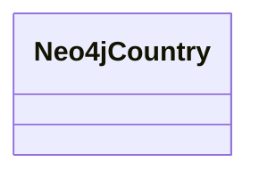

# Class: Country (neo4j_Country)


URI: [neo4j:Country](neo4j://graph.schema#Country)





<!-- no inheritance hierarchy -->


## Slots

| Name | Cardinality and Range | Description | Inheritance | Occurrences |
| ---  | --- | --- | --- | --- |


## Usages

| used by | used in | type | used |
| ---  | --- | --- | --- |
| [HttpsClimatepub4kg.github.ioOntology#Country](../classes/HttpsClimatepub4kg.github.ioOntology#Country.md) | [neo4j_country](../slots/neo4j_country.md) | domain | [Neo4jCountry](../classes/Neo4jCountry.md) |
| [HttpsClimatepub4kg.github.ioOntology#Country](../classes/HttpsClimatepub4kg.github.ioOntology#Country.md) | [neo4j_area_sqkm](../slots/neo4j_area_sqkm.md) | domain | [Neo4jCountry](../classes/Neo4jCountry.md) |
| [HttpsClimatepub4kg.github.ioOntology#Country](../classes/HttpsClimatepub4kg.github.ioOntology#Country.md) | [neo4j_postal_code_regex](../slots/neo4j_postal_code_regex.md) | domain | [Neo4jCountry](../classes/Neo4jCountry.md) |
| [HttpsClimatepub4kg.github.ioOntology#Country](../classes/HttpsClimatepub4kg.github.ioOntology#Country.md) | [neo4j_phone](../slots/neo4j_phone.md) | domain | [Neo4jCountry](../classes/Neo4jCountry.md) |
| [HttpsClimatepub4kg.github.ioOntology#Country](../classes/HttpsClimatepub4kg.github.ioOntology#Country.md) | [neo4j_currencyname](../slots/neo4j_currencyname.md) | domain | [Neo4jCountry](../classes/Neo4jCountry.md) |
| [HttpsClimatepub4kg.github.ioOntology#Country](../classes/HttpsClimatepub4kg.github.ioOntology#Country.md) | [neo4j_iso3](../slots/neo4j_iso3.md) | domain | [Neo4jCountry](../classes/Neo4jCountry.md) |
| [HttpsClimatepub4kg.github.ioOntology#Country](../classes/HttpsClimatepub4kg.github.ioOntology#Country.md) | [neo4j_neighbours](../slots/neo4j_neighbours.md) | domain | [Neo4jCountry](../classes/Neo4jCountry.md) |
| [HttpsClimatepub4kg.github.ioOntology#Country](../classes/HttpsClimatepub4kg.github.ioOntology#Country.md) | [neo4j_fips](../slots/neo4j_fips.md) | domain | [Neo4jCountry](../classes/Neo4jCountry.md) |
| [HttpsClimatepub4kg.github.ioOntology#Country](../classes/HttpsClimatepub4kg.github.ioOntology#Country.md) | [neo4j_postal_code_format](../slots/neo4j_postal_code_format.md) | domain | [Neo4jCountry](../classes/Neo4jCountry.md) |
| [HttpsClimatepub4kg.github.ioOntology#Country](../classes/HttpsClimatepub4kg.github.ioOntology#Country.md) | [neo4j_isonumeric](../slots/neo4j_isonumeric.md) | domain | [Neo4jCountry](../classes/Neo4jCountry.md) |
| [HttpsClimatepub4kg.github.ioOntology#Country](../classes/HttpsClimatepub4kg.github.ioOntology#Country.md) | [neo4j_languages](../slots/neo4j_languages.md) | domain | [Neo4jCountry](../classes/Neo4jCountry.md) |
| [HttpsClimatepub4kg.github.ioOntology#Country](../classes/HttpsClimatepub4kg.github.ioOntology#Country.md) | [neo4j_tld](../slots/neo4j_tld.md) | domain | [Neo4jCountry](../classes/Neo4jCountry.md) |
| [HttpsClimatepub4kg.github.ioOntology#Country](../classes/HttpsClimatepub4kg.github.ioOntology#Country.md) | [neo4j_currencycode](../slots/neo4j_currencycode.md) | domain | [Neo4jCountry](../classes/Neo4jCountry.md) |
| [HttpsClimatepub4kg.github.ioOntology#Country](../classes/HttpsClimatepub4kg.github.ioOntology#Country.md) | [neo4j_equivalent_fips_code](../slots/neo4j_equivalent_fips_code.md) | domain | [Neo4jCountry](../classes/Neo4jCountry.md) |
| [HttpsClimatepub4kg.github.ioOntology#Country](../classes/HttpsClimatepub4kg.github.ioOntology#Country.md) | [neo4j_capital](../slots/neo4j_capital.md) | domain | [Neo4jCountry](../classes/Neo4jCountry.md) |
| [HttpsClimatepub4kg.github.ioOntology#Country](../classes/HttpsClimatepub4kg.github.ioOntology#Country.md) | [neo4j_continent](../slots/neo4j_continent.md) | domain | [Neo4jCountry](../classes/Neo4jCountry.md) |


## LinkML Source

<!-- TODO: investigate https://stackoverflow.com/questions/37606292/how-to-create-tabbed-code-blocks-in-mkdocs-or-sphinx -->

### Direct

<details>

```yaml
name: neo4j_Country
title: Country
from_schema: okns:climatepub4-kg
rank: 1000
class_uri: neo4j:Country

```
</details>

### Induced

<details>

```yaml
name: neo4j_Country
title: Country
from_schema: okns:climatepub4-kg
rank: 1000
class_uri: neo4j:Country

```
</details>