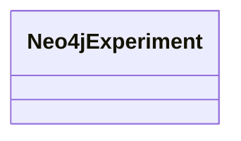

# Class: Experiment (neo4j_Experiment)


URI: [neo4j:Experiment](neo4j://graph.schema#Experiment)





<!-- no inheritance hierarchy -->


## Slots

| Name | Cardinality and Range | Description | Inheritance | Occurrences |
| ---  | --- | --- | --- | --- |


## Usages

| used by | used in | type | used |
| ---  | --- | --- | --- |
| [HttpsClimatepub4kg.github.ioOntology#Experiment](../classes/HttpsClimatepub4kg.github.ioOntology#Experiment.md) | [neo4j_experiment_title](../slots/neo4j_experiment_title.md) | domain | [Neo4jExperiment](../classes/Neo4jExperiment.md) |


## LinkML Source

<!-- TODO: investigate https://stackoverflow.com/questions/37606292/how-to-create-tabbed-code-blocks-in-mkdocs-or-sphinx -->

### Direct

<details>

```yaml
name: neo4j_Experiment
title: Experiment
from_schema: okns:climatepub4-kg
rank: 1000
class_uri: neo4j:Experiment

```
</details>

### Induced

<details>

```yaml
name: neo4j_Experiment
title: Experiment
from_schema: okns:climatepub4-kg
rank: 1000
class_uri: neo4j:Experiment

```
</details>