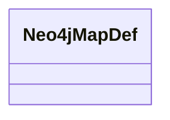

# Class: No class (entity type) name specified -- this class is noted as being in the domain or range of a slot in this graph but has not itself been defined. (neo4j__MapDef)


URI: [neo4j:_MapDef](neo4j://graph.schema#_MapDef)





<!-- no inheritance hierarchy -->


## Slots

| Name | Cardinality and Range | Description | Inheritance | Occurrences |
| ---  | --- | --- | --- | --- |


## LinkML Source

<!-- TODO: investigate https://stackoverflow.com/questions/37606292/how-to-create-tabbed-code-blocks-in-mkdocs-or-sphinx -->

### Direct

<details>

```yaml
name: neo4j__MapDef
title: No class (entity type) name specified -- this class is noted as being in the
  domain or range of a slot in this graph but has not itself been defined.
from_schema: okns:climatepub4-kg
rank: 1000
class_uri: neo4j:_MapDef

```
</details>

### Induced

<details>

```yaml
name: neo4j__MapDef
title: No class (entity type) name specified -- this class is noted as being in the
  domain or range of a slot in this graph but has not itself been defined.
from_schema: okns:climatepub4-kg
rank: 1000
class_uri: neo4j:_MapDef

```
</details>