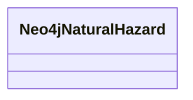

# Class: Natural_Hazard (neo4j_Natural_Hazard)


URI: [neo4j:Natural_Hazard](neo4j://graph.schema#Natural_Hazard)





<!-- no inheritance hierarchy -->


## Slots

| Name | Cardinality and Range | Description | Inheritance | Occurrences |
| ---  | --- | --- | --- | --- |


## LinkML Source

<!-- TODO: investigate https://stackoverflow.com/questions/37606292/how-to-create-tabbed-code-blocks-in-mkdocs-or-sphinx -->

### Direct

<details>

```yaml
name: neo4j_Natural_Hazard
title: Natural_Hazard
from_schema: okns:climatepub4-kg
rank: 1000
class_uri: neo4j:Natural_Hazard

```
</details>

### Induced

<details>

```yaml
name: neo4j_Natural_Hazard
title: Natural_Hazard
from_schema: okns:climatepub4-kg
rank: 1000
class_uri: neo4j:Natural_Hazard

```
</details>