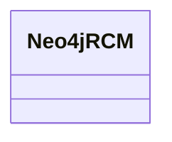

# Class: RCM (neo4j_RCM)


URI: [neo4j:RCM](neo4j://graph.schema#RCM)





<!-- no inheritance hierarchy -->


## Slots

| Name | Cardinality and Range | Description | Inheritance | Occurrences |
| ---  | --- | --- | --- | --- |


## Usages

| used by | used in | type | used |
| ---  | --- | --- | --- |
| [HttpsClimatepub4kg.github.ioOntology#RCM](../classes/HttpsClimatepub4kg.github.ioOntology#RCM.md) | [neo4j_rcm_version](../slots/neo4j_rcm_version.md) | domain | [Neo4jRCM](../classes/Neo4jRCM.md) |


## LinkML Source

<!-- TODO: investigate https://stackoverflow.com/questions/37606292/how-to-create-tabbed-code-blocks-in-mkdocs-or-sphinx -->

### Direct

<details>

```yaml
name: neo4j_RCM
title: RCM
from_schema: okns:climatepub4-kg
rank: 1000
class_uri: neo4j:RCM

```
</details>

### Induced

<details>

```yaml
name: neo4j_RCM
title: RCM
from_schema: okns:climatepub4-kg
rank: 1000
class_uri: neo4j:RCM

```
</details>