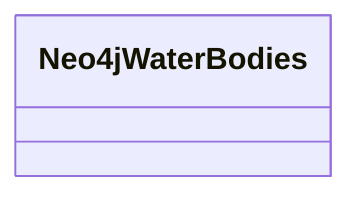

# Class: Water_Bodies (neo4j_Water_Bodies)


URI: [neo4j:Water_Bodies](neo4j://graph.schema#Water_Bodies)





<!-- no inheritance hierarchy -->


## Slots

| Name | Cardinality and Range | Description | Inheritance | Occurrences |
| ---  | --- | --- | --- | --- |


## Usages

| used by | used in | type | used |
| ---  | --- | --- | --- |
| [HttpsClimatepub4kg.github.ioOntology#WaterBodies](../classes/HttpsClimatepub4kg.github.ioOntology#WaterBodies.md) | [neo4j_Name](../slots/neo4j_Name.md) | domain | [Neo4jWaterBodies](../classes/Neo4jWaterBodies.md) |


## LinkML Source

<!-- TODO: investigate https://stackoverflow.com/questions/37606292/how-to-create-tabbed-code-blocks-in-mkdocs-or-sphinx -->

### Direct

<details>

```yaml
name: neo4j_Water_Bodies
title: Water_Bodies
from_schema: okns:climatepub4-kg
rank: 1000
class_uri: neo4j:Water_Bodies

```
</details>

### Induced

<details>

```yaml
name: neo4j_Water_Bodies
title: Water_Bodies
from_schema: okns:climatepub4-kg
rank: 1000
class_uri: neo4j:Water_Bodies

```
</details>