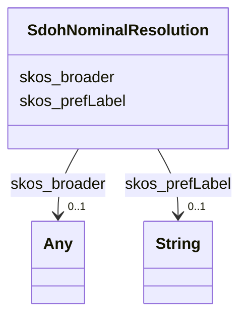

# Class: TODO -- what's a good name for this class (type)? (sdoh_Nominal_Resolution)


_TODO -- tell the world what this class (type) describes._


URI: [sdoh:Nominal_Resolution](http://schema.org/Nominal_Resolution)





<!-- no inheritance hierarchy -->


## Slots

| Name | Cardinality and Range | Description | Inheritance |
| ---  | --- | --- | --- |
| [skos_prefLabel](../slots/skos_prefLabel.md) | 0..1 <br/> [xsd:string](http://www.w3.org/2001/XMLSchema#string) | TODO -- tell the world what this slot (predicate) describes | direct |
| [skos_broader](../slots/skos_broader.md) | 0..1 <br/> [Any](../classes/Any.md)&nbsp;or&nbsp;<br />[SdohInstrument](../classes/SdohInstrument.md)&nbsp;or&nbsp;<br />[SdohMeasurementName](../classes/SdohMeasurementName.md)&nbsp;or&nbsp;<br />[SdohDataFormat](../classes/SdohDataFormat.md)&nbsp;or&nbsp;<br />[SdohChronostratigraphicUnit](../classes/SdohChronostratigraphicUnit.md)&nbsp;or&nbsp;<br />[SdohMimeType](../classes/SdohMimeType.md)&nbsp;or&nbsp;<br />[SdohModel](../classes/SdohModel.md)&nbsp;or&nbsp;<br />[SdohNominalResolution](../classes/SdohNominalResolution.md)&nbsp;or&nbsp;<br />[SdohExperiment](../classes/SdohExperiment.md)&nbsp;or&nbsp;<br />[SdohTemporalResolutionRange](../classes/SdohTemporalResolutionRange.md)&nbsp;or&nbsp;<br />[SdohVariable](../classes/SdohVariable.md)&nbsp;or&nbsp;<br />[SdohSourceType](../classes/SdohSourceType.md)&nbsp;or&nbsp;<br />[SdohDataset](../classes/SdohDataset.md)&nbsp;or&nbsp;<br />[SkosConcept](../classes/SkosConcept.md)&nbsp;or&nbsp;<br />[SdohHorizontalResolutionRange](../classes/SdohHorizontalResolutionRange.md)&nbsp;or&nbsp;<br />[SdohProject](../classes/SdohProject.md)&nbsp;or&nbsp;<br />[SdohModels](../classes/SdohModels.md)&nbsp;or&nbsp;<br />[SdohSubExperimentId](../classes/SdohSubExperimentId.md)&nbsp;or&nbsp;<br />[SdohPlatform](../classes/SdohPlatform.md)&nbsp;or&nbsp;<br />[SdohRelatedUrlContentType](../classes/SdohRelatedUrlContentType.md)&nbsp;or&nbsp;<br />[SdohProvider](../classes/SdohProvider.md)&nbsp;or&nbsp;<br />[SdohLocation](../classes/SdohLocation.md)&nbsp;or&nbsp;<br />[SdohScienceKeyword](../classes/SdohScienceKeyword.md) | TODO -- tell the world what this slot (predicate) describes | direct |


## Usages

| used by | used in | type | used |
| ---  | --- | --- | --- |
| [SdohActivity](../classes/SdohActivity.md) | [skos_broader](../slots/skos_broader.md) | any_of[range] | [SdohNominalResolution](../classes/SdohNominalResolution.md) |
| [SdohChronostratigraphicUnit](../classes/SdohChronostratigraphicUnit.md) | [skos_broader](../slots/skos_broader.md) | any_of[range] | [SdohNominalResolution](../classes/SdohNominalResolution.md) |
| [SdohCmip6SourceId](../classes/SdohCmip6SourceId.md) | [skos_broader](../slots/skos_broader.md) | any_of[range] | [SdohNominalResolution](../classes/SdohNominalResolution.md) |
| [SdohDataFormat](../classes/SdohDataFormat.md) | [skos_broader](../slots/skos_broader.md) | any_of[range] | [SdohNominalResolution](../classes/SdohNominalResolution.md) |
| [SdohDataset](../classes/SdohDataset.md) | [skos_broader](../slots/skos_broader.md) | any_of[range] | [SdohNominalResolution](../classes/SdohNominalResolution.md) |
| [SdohExperiment](../classes/SdohExperiment.md) | [skos_broader](../slots/skos_broader.md) | any_of[range] | [SdohNominalResolution](../classes/SdohNominalResolution.md) |
| [SdohFrequency](../classes/SdohFrequency.md) | [skos_broader](../slots/skos_broader.md) | any_of[range] | [SdohNominalResolution](../classes/SdohNominalResolution.md) |
| [SdohHorizontalResolutionRange](../classes/SdohHorizontalResolutionRange.md) | [skos_broader](../slots/skos_broader.md) | any_of[range] | [SdohNominalResolution](../classes/SdohNominalResolution.md) |
| [SdohInstitution](../classes/SdohInstitution.md) | [skos_broader](../slots/skos_broader.md) | any_of[range] | [SdohNominalResolution](../classes/SdohNominalResolution.md) |
| [SdohInstrument](../classes/SdohInstrument.md) | [skos_broader](../slots/skos_broader.md) | any_of[range] | [SdohNominalResolution](../classes/SdohNominalResolution.md) |
| [SdohLicense](../classes/SdohLicense.md) | [skos_broader](../slots/skos_broader.md) | any_of[range] | [SdohNominalResolution](../classes/SdohNominalResolution.md) |
| [SdohLocation](../classes/SdohLocation.md) | [skos_broader](../slots/skos_broader.md) | any_of[range] | [SdohNominalResolution](../classes/SdohNominalResolution.md) |
| [SdohMeasurementName](../classes/SdohMeasurementName.md) | [skos_broader](../slots/skos_broader.md) | any_of[range] | [SdohNominalResolution](../classes/SdohNominalResolution.md) |
| [SdohMimeType](../classes/SdohMimeType.md) | [skos_broader](../slots/skos_broader.md) | any_of[range] | [SdohNominalResolution](../classes/SdohNominalResolution.md) |
| [SdohModel](../classes/SdohModel.md) | [skos_broader](../slots/skos_broader.md) | any_of[range] | [SdohNominalResolution](../classes/SdohNominalResolution.md) |
| [SdohModels](../classes/SdohModels.md) | [skos_broader](../slots/skos_broader.md) | any_of[range] | [SdohNominalResolution](../classes/SdohNominalResolution.md) |
| [SdohNominalResolution](../classes/SdohNominalResolution.md) | [skos_broader](../slots/skos_broader.md) | any_of[range] | [SdohNominalResolution](../classes/SdohNominalResolution.md) |
| [SdohPlatform](../classes/SdohPlatform.md) | [skos_broader](../slots/skos_broader.md) | any_of[range] | [SdohNominalResolution](../classes/SdohNominalResolution.md) |
| [SdohProject](../classes/SdohProject.md) | [skos_broader](../slots/skos_broader.md) | any_of[range] | [SdohNominalResolution](../classes/SdohNominalResolution.md) |
| [SdohProvider](../classes/SdohProvider.md) | [skos_broader](../slots/skos_broader.md) | any_of[range] | [SdohNominalResolution](../classes/SdohNominalResolution.md) |
| [SdohRealm](../classes/SdohRealm.md) | [skos_broader](../slots/skos_broader.md) | any_of[range] | [SdohNominalResolution](../classes/SdohNominalResolution.md) |
| [SdohRelatedUrlContentType](../classes/SdohRelatedUrlContentType.md) | [skos_broader](../slots/skos_broader.md) | any_of[range] | [SdohNominalResolution](../classes/SdohNominalResolution.md) |
| [SdohScienceKeyword](../classes/SdohScienceKeyword.md) | [skos_broader](../slots/skos_broader.md) | any_of[range] | [SdohNominalResolution](../classes/SdohNominalResolution.md) |
| [SdohSourceType](../classes/SdohSourceType.md) | [skos_broader](../slots/skos_broader.md) | any_of[range] | [SdohNominalResolution](../classes/SdohNominalResolution.md) |
| [SdohSubExperimentId](../classes/SdohSubExperimentId.md) | [skos_broader](../slots/skos_broader.md) | any_of[range] | [SdohNominalResolution](../classes/SdohNominalResolution.md) |
| [SdohTemporalResolutionRange](../classes/SdohTemporalResolutionRange.md) | [skos_broader](../slots/skos_broader.md) | any_of[range] | [SdohNominalResolution](../classes/SdohNominalResolution.md) |
| [SdohVariable](../classes/SdohVariable.md) | [skos_broader](../slots/skos_broader.md) | any_of[range] | [SdohNominalResolution](../classes/SdohNominalResolution.md) |
| [SdohVerticalResolutionRange](../classes/SdohVerticalResolutionRange.md) | [skos_broader](../slots/skos_broader.md) | any_of[range] | [SdohNominalResolution](../classes/SdohNominalResolution.md) |
| [SdohPaper](../classes/SdohPaper.md) | [http___relation.org_Mention](../slots/http___relation.org_Mention.md) | any_of[range] | [SdohNominalResolution](../classes/SdohNominalResolution.md) |
| [SkosConcept](../classes/SkosConcept.md) | [skos_broader](../slots/skos_broader.md) | any_of[range] | [SdohNominalResolution](../classes/SdohNominalResolution.md) |


## Examples

| Value |
| --- |
| https://climateKG.org/entity/82a2971f-82eb-46aa-8d70-1343570edba8 |

## TODOs

* TODO -- Todos for this class go here
* or you can delete the todos
* if you think the class is perfect.

## Identifier and Mapping Information


### Schema Source


* from schema: climatepub4-kg


## Mappings

| Mapping Type | Mapped Value |
| ---  | ---  |
| self | sdoh:Nominal_Resolution |
| native | climatepub4-kg/:SdohNominalResolution |


## LinkML Source

<!-- TODO: investigate https://stackoverflow.com/questions/37606292/how-to-create-tabbed-code-blocks-in-mkdocs-or-sphinx -->

### Direct

<details>
```yaml
name: sdoh_Nominal_Resolution
description: TODO -- tell the world what this class (type) describes.
title: TODO -- what's a good name for this class (type)?
todos:
- TODO -- Todos for this class go here
- or you can delete the todos
- if you think the class is perfect.
notes:
- Class with 16 occurences.
examples:
- value: https://climateKG.org/entity/82a2971f-82eb-46aa-8d70-1343570edba8
from_schema: climatepub4-kg
slots:
- skos_prefLabel
- skos_broader
class_uri: sdoh:Nominal_Resolution

```
</details>

### Induced

<details>
```yaml
name: sdoh_Nominal_Resolution
description: TODO -- tell the world what this class (type) describes.
title: TODO -- what's a good name for this class (type)?
todos:
- TODO -- Todos for this class go here
- or you can delete the todos
- if you think the class is perfect.
notes:
- Class with 16 occurences.
examples:
- value: https://climateKG.org/entity/82a2971f-82eb-46aa-8d70-1343570edba8
from_schema: climatepub4-kg
attributes:
  skos_prefLabel:
    name: skos_prefLabel
    description: TODO -- tell the world what this slot (predicate) describes.
    todos:
    - TODO -- Todos for this slot go here
    - or you can delete the todos
    - if you think the class is perfect.
    comments:
    - 983 occurrences with subject type sdoh_Location and object type string.
    - 2975 occurrences with subject type sdoh_Science_Keyword and object type string.
    - 1171 occurrences with subject type sdoh_Platform and object type string.
    - 24 occurrences with subject type sdoh_Activity and object type string.
    - 150 occurrences with subject type sdoh_Model and object type string.
    - 184 occurrences with subject type sdoh_Chronostratigraphic_Unit and object type
      string.
    - 444 occurrences with subject type sdoh_Experiment and object type string.
    - 3745 occurrences with subject type sdoh_Provider and object type string.
    - 2363 occurrences with subject type sdoh_Instrument and object type string.
    - 1727 occurrences with subject type sdoh_Project and object type string.
    - 4 occurrences with subject type sdoh_Realm and object type string.
    - 297 occurrences with subject type sdoh_Models and object type string.
    - 234 occurrences with subject type sdoh_Measurement_Name and object type string.
    - 75 occurrences with subject type sdoh_Institution and object type string.
    - 55 occurrences with subject type sdoh_Sub_Experiment_Id and object type string.
    - 198 occurrences with subject type sdoh_Data_Format and object type string.
    - 1283 occurrences with subject type sdoh_Variable and object type string.
    - 134 occurrences with subject type sdoh_Cmip6_Source_Id and object type string.
    - 15 occurrences with subject type sdoh_Horizontal_Resolution_Range and object
      type string.
    - 5 occurrences with subject type sdoh_Source_Type and object type string.
    - 88 occurrences with subject type sdoh_Related_Url_Content_Type and object type
      string.
    - 107 occurrences with subject type sdoh_Dataset and object type string.
    - 19 occurrences with subject type sdoh_Temporal_Resolution_Range and object type
      string.
    - 16 occurrences with subject type sdoh_Nominal_Resolution and object type string.
    - 16 occurrences with subject type sdoh_Frequency and object type string.
    - 4 occurrences with subject type sdoh_License and object type string.
    - 38 occurrences with subject type sdoh_Mime_Type and object type string.
    - 16359 occurrences with subject type skos_Concept and object type string.
    - 6 occurrences with subject type sdoh_Vertical_Resolution_Range and object type
      string.
    examples:
    - value: https://climateKG.org/entity/0006e246-4296-448c-9b81-a0831cad7f1c skos:prefLabel
        LABRADOR_SEA
    - value: https://climateKG.org/entity/001f18d3-7e61-430b-9883-1960c6256fe5 skos:prefLabel
        OPTICAL_DEPTH
    - value: https://climateKG.org/entity/007c3084-89db-458e-8387-14e192b6cb8e skos:prefLabel
        Sentinel_1
    - value: https://climateKG.org/entity/00a97d0c-e05e-43c9-93d0-3c7a2527b3c0 skos:prefLabel
        SIMIP
    - value: https://climateKG.org/entity/00bb59aa-755d-4710-a097-f1e2836f4032 skos:prefLabel
        RCM_3
    - value: https://climateKG.org/entity/00c6f0f3-5734-4500-a69e-f6780e365985 skos:prefLabel
        EARLY
    - value: https://climateKG.org/entity/00ce4800-70ef-4346-aa15-0554280d0896 skos:prefLabel
        HAB
    - value: https://climateKG.org/entity/0111fbd3-e6ec-464a-bc65-2323c2328e7c skos:prefLabel
        DOI
    - value: https://climateKG.org/entity/01407ecf-45af-4fcc-8a1b-9b383636e2e4 skos:prefLabel
        HYDRA
    - value: https://climateKG.org/entity/01e75216-1cee-4cc3-b31d-83019730da85 skos:prefLabel
        USNPS_ENVIRONMENTAL_CHANGE_IN_BERINGIAN_ARCTIC
    - value: https://climateKG.org/entity/021d2b85-4728-4434-b429-082874cfab69 skos:prefLabel
        ocnBgchem
    - value: https://climateKG.org/entity/028fe075-8ed0-47f0-b462-71e4adf72a4e skos:prefLabel
        HadGEM2_ES
    - value: https://climateKG.org/entity/038ac74c-470a-43e0-b80d-2b2fb1acfc13 skos:prefLabel
        ambient_aerosol_particles
    - value: https://climateKG.org/entity/03976e48-3ff9-4dc6-a4c4-fd77026380ff skos:prefLabel
        E3SM_Project
    - value: https://climateKG.org/entity/04e00ed0-39b6-4323-a788-2344264695c0 skos:prefLabel
        s2016
    - value: https://climateKG.org/entity/0679d78d-0931-4948-94ec-46ab130785a6 skos:prefLabel
        ICI
    - value: https://climateKG.org/entity/0893353d-4e8c-4b31-bcc5-fce552ccfff3 skos:prefLabel
        Point_Resolution
    - value: https://climateKG.org/entity/0cd4d2c4-ebfa-4759-b7aa-f9982122f581 skos:prefLabel
        IPSL_CM5A2_INCA
    - value: https://climateKG.org/entity/1499785c-8b74-45f4-bbf7-19d2d4e43b2f skos:prefLabel
        Horizontal_Resolution_Ranges
    - value: https://climateKG.org/entity/27a62e86-0b64-4e21-9766-cfdcd95ff87b skos:prefLabel
        Source_Type
    - value: https://climateKG.org/entity/2892b502-2c66-42d5-af3d-bcddb57d9195 skos:prefLabel
        GET_CAPABILITIES
    - value: https://climateKG.org/entity/2892e23f-5249-439d-8c0e-6c1d190b3beb skos:prefLabel
        ERA_5
    - value: https://climateKG.org/entity/3d97e993-dc6a-41ff-8a49-3e837c1fc2b1 skos:prefLabel
        Decadal
    - value: https://climateKG.org/entity/82a2971f-82eb-46aa-8d70-1343570edba8 skos:prefLabel
        10000_km
    - value: https://climateKG.org/entity/8e4900ff-c7bc-47a1-aa55-a8892696d769 skos:prefLabel
        day
    - value: https://climateKG.org/entity/95c7e601-fcfe-4fc9-9994-8105a1e11428 skos:prefLabel
        CC_BY_4_0
    - value: https://climateKG.org/entity/ec1a1350-be24-42e6-a5cc-ccb806793def skos:prefLabel
        Mime_Type
    - value: https://gcmd.earthdata.nasa.gov/kms/concept/0006e246-4296-448c-9b81-a0831cad7f1c
        skos:prefLabel LABRADOR_SEA
    - value: https://climateKG.org/entity/201337ea-fa14-4e58-a538-e92c5ff734a4 skos:prefLabel
        1_meter_10_meters
    from_schema: climatepub4-kg
    rank: 1000
    slot_uri: skos:prefLabel
    alias: skos_prefLabel
    owner: sdoh_Nominal_Resolution
    domain_of:
    - sdoh_Activity
    - sdoh_Chronostratigraphic_Unit
    - sdoh_Cmip6_Source_Id
    - sdoh_Data_Format
    - sdoh_Dataset
    - sdoh_Experiment
    - sdoh_Frequency
    - sdoh_Horizontal_Resolution_Range
    - sdoh_Institution
    - sdoh_Instrument
    - sdoh_License
    - sdoh_Location
    - sdoh_Measurement_Name
    - sdoh_Mime_Type
    - sdoh_Model
    - sdoh_Models
    - sdoh_Nominal_Resolution
    - sdoh_Platform
    - sdoh_Project
    - sdoh_Provider
    - sdoh_Realm
    - sdoh_Related_Url_Content_Type
    - sdoh_Science_Keyword
    - sdoh_Source_Type
    - sdoh_Sub_Experiment_Id
    - sdoh_Temporal_Resolution_Range
    - sdoh_Variable
    - sdoh_Vertical_Resolution_Range
    - skos_Concept
    range: string
  skos_broader:
    name: skos_broader
    description: TODO -- tell the world what this slot (predicate) describes.
    todos:
    - TODO -- Todos for this slot go here
    - or you can delete the todos
    - if you think the class is perfect.
    comments:
    - 2245 occurrences with subject type sdoh_Location and object type sdoh_Location.
    - 261 occurrences with subject type sdoh_Location and object type sdoh_Instrument.
    - 8109 occurrences with subject type sdoh_Science_Keyword and object type sdoh_Science_Keyword.
    - 2953 occurrences with subject type sdoh_Science_Keyword and object type sdoh_Provider.
    - 1937 occurrences with subject type sdoh_Science_Keyword and object type sdoh_Location.
    - 312 occurrences with subject type sdoh_Science_Keyword and object type sdoh_Model.
    - 1761 occurrences with subject type sdoh_Platform and object type sdoh_Instrument.
    - 2153 occurrences with subject type sdoh_Platform and object type sdoh_Platform.
    - 102 occurrences with subject type sdoh_Location and object type sdoh_Project.
    - 48 occurrences with subject type sdoh_Activity and object type sdoh_Project.
    - 40 occurrences with subject type sdoh_Model and object type sdoh_Instrument.
    - 34 occurrences with subject type sdoh_Model and object type sdoh_Platform.
    - 789 occurrences with subject type sdoh_Chronostratigraphic_Unit and object type
      sdoh_Chronostratigraphic_Unit.
    - 47 occurrences with subject type sdoh_Experiment and object type sdoh_Project.
    - 8707 occurrences with subject type sdoh_Provider and object type sdoh_Provider.
    - 86 occurrences with subject type sdoh_Model and object type sdoh_Project.
    - 6114 occurrences with subject type sdoh_Instrument and object type sdoh_Instrument.
    - 2038 occurrences with subject type sdoh_Instrument and object type sdoh_Experiment.
    - 57 occurrences with subject type sdoh_Experiment and object type sdoh_Provider.
    - 475 occurrences with subject type sdoh_Location and object type sdoh_Science_Keyword.
    - 311 occurrences with subject type sdoh_Location and object type sdoh_Provider.
    - 26 occurrences with subject type sdoh_Location and object type sdoh_Model.
    - 3416 occurrences with subject type sdoh_Project and object type sdoh_Project.
    - 4 occurrences with subject type sdoh_Realm and object type sdoh_Location.
    - 304 occurrences with subject type sdoh_Provider and object type sdoh_Location.
    - 180 occurrences with subject type sdoh_Instrument and object type sdoh_Project.
    - 891 occurrences with subject type sdoh_Models and object type sdoh_Science_Keyword.
    - 286 occurrences with subject type sdoh_Science_Keyword and object type sdoh_Instrument.
    - 355 occurrences with subject type sdoh_Experiment and object type sdoh_Experiment.
    - 131 occurrences with subject type sdoh_Model and object type sdoh_Science_Keyword.
    - 32 occurrences with subject type sdoh_Model and object type sdoh_Model.
    - 9 occurrences with subject type sdoh_Model and object type sdoh_Experiment.
    - 80 occurrences with subject type sdoh_Model and object type sdoh_Provider.
    - 317 occurrences with subject type sdoh_Measurement_Name and object type sdoh_Instrument.
    - 20 occurrences with subject type sdoh_Measurement_Name and object type sdoh_Location.
    - 75 occurrences with subject type sdoh_Institution and object type sdoh_Provider.
    - 38 occurrences with subject type sdoh_Model and object type sdoh_Location.
    - 12 occurrences with subject type sdoh_Instrument and object type sdoh_Variable.
    - 352 occurrences with subject type sdoh_Instrument and object type sdoh_Science_Keyword.
    - 160 occurrences with subject type sdoh_Instrument and object type sdoh_Provider.
    - 137 occurrences with subject type sdoh_Experiment and object type sdoh_Science_Keyword.
    - 31 occurrences with subject type sdoh_Experiment and object type sdoh_Location.
    - 54 occurrences with subject type sdoh_Sub_Experiment_Id and object type sdoh_Sub_Experiment_Id.
    - 227 occurrences with subject type sdoh_Measurement_Name and object type sdoh_Measurement_Name.
    - 130 occurrences with subject type sdoh_Instrument and object type sdoh_Location.
    - 154 occurrences with subject type sdoh_Provider and object type sdoh_Science_Keyword.
    - 182 occurrences with subject type sdoh_Provider and object type sdoh_Model.
    - 183 occurrences with subject type sdoh_Provider and object type sdoh_Instrument.
    - 43 occurrences with subject type sdoh_Location and object type sdoh_Platform.
    - 242 occurrences with subject type sdoh_Data_Format and object type sdoh_Data_Format.
    - 63 occurrences with subject type sdoh_Location and object type sdoh_Experiment.
    - 1281 occurrences with subject type sdoh_Variable and object type sdoh_Variable.
    - 55 occurrences with subject type sdoh_Platform and object type sdoh_Science_Keyword.
    - 25 occurrences with subject type sdoh_Platform and object type sdoh_Location.
    - 33 occurrences with subject type sdoh_Platform and object type sdoh_Provider.
    - 84 occurrences with subject type sdoh_Instrument and object type sdoh_Platform.
    - 27 occurrences with subject type sdoh_Science_Keyword and object type sdoh_Project.
    - 22 occurrences with subject type sdoh_Provider and object type sdoh_Related_Url_Content_Type.
    - 402 occurrences with subject type sdoh_Cmip6_Source_Id and object type sdoh_Science_Keyword.
    - 15 occurrences with subject type sdoh_Provider and object type sdoh_Sub_Experiment_Id.
    - 3 occurrences with subject type sdoh_Model and object type sdoh_Source_Type.
    - 58 occurrences with subject type sdoh_Experiment and object type sdoh_Instrument.
    - 6 occurrences with subject type sdoh_Experiment and object type sdoh_Platform.
    - 34 occurrences with subject type sdoh_Instrument and object type sdoh_Model.
    - 5 occurrences with subject type sdoh_Location and object type sdoh_Sub_Experiment_Id.
    - 220 occurrences with subject type sdoh_Science_Keyword and object type sdoh_Experiment.
    - 42 occurrences with subject type sdoh_Science_Keyword and object type sdoh_Platform.
    - 7 occurrences with subject type sdoh_Model and object type sdoh_Variable.
    - 13 occurrences with subject type sdoh_Provider and object type sdoh_Variable.
    - 4 occurrences with subject type sdoh_Provider and object type sdoh_Experiment.
    - 211 occurrences with subject type sdoh_Related_Url_Content_Type and object type
      sdoh_Related_Url_Content_Type.
    - 106 occurrences with subject type sdoh_Dataset and object type sdoh_Dataset.
    - 26 occurrences with subject type sdoh_Project and object type sdoh_Science_Keyword.
    - 4 occurrences with subject type sdoh_Project and object type sdoh_Location.
    - 15 occurrences with subject type sdoh_Project and object type sdoh_Provider.
    - 4 occurrences with subject type sdoh_Platform and object type sdoh_Experiment.
    - 7 occurrences with subject type sdoh_Location and object type sdoh_Related_Url_Content_Type.
    - 16 occurrences with subject type sdoh_Models and object type sdoh_Instrument.
    - 10 occurrences with subject type sdoh_Location and object type sdoh_Measurement_Name.
    - 1 occurrences with subject type sdoh_Provider and object type sdoh_Source_Type.
    - 14 occurrences with subject type sdoh_Instrument and object type sdoh_Related_Url_Content_Type.
    - 12 occurrences with subject type sdoh_Experiment and object type sdoh_Model.
    - 85 occurrences with subject type sdoh_Platform and object type sdoh_Model.
    - 18 occurrences with subject type sdoh_Temporal_Resolution_Range and object type
      sdoh_Temporal_Resolution_Range.
    - 4 occurrences with subject type sdoh_Project and object type sdoh_Model.
    - 17 occurrences with subject type sdoh_Platform and object type sdoh_Project.
    - 2 occurrences with subject type sdoh_Experiment and object type sdoh_Variable.
    - 3 occurrences with subject type sdoh_Provider and object type sdoh_Platform.
    - 12 occurrences with subject type sdoh_Location and object type sdoh_Variable.
    - 2 occurrences with subject type sdoh_Institution and object type sdoh_Location.
    - 4 occurrences with subject type sdoh_Source_Type and object type sdoh_Source_Type.
    - 15 occurrences with subject type sdoh_Nominal_Resolution and object type sdoh_Nominal_Resolution.
    - 3 occurrences with subject type sdoh_Experiment and object type sdoh_Source_Type.
    - 16 occurrences with subject type sdoh_Frequency and object type sdoh_Temporal_Resolution_Range.
    - 4 occurrences with subject type sdoh_License and object type sdoh_Instrument.
    - 1 occurrences with subject type sdoh_Instrument and object type sdoh_Models.
    - 3 occurrences with subject type sdoh_Location and object type sdoh_Source_Type.
    - 3 occurrences with subject type sdoh_Model and object type sdoh_Related_Url_Content_Type.
    - 24 occurrences with subject type sdoh_Related_Url_Content_Type and object type
      sdoh_Provider.
    - 1 occurrences with subject type sdoh_Project and object type sdoh_Experiment.
    - 1 occurrences with subject type sdoh_Project and object type sdoh_Variable.
    - 1 occurrences with subject type sdoh_Model and object type sdoh_Temporal_Resolution_Range.
    - 3 occurrences with subject type sdoh_Models and object type sdoh_Models.
    - 1 occurrences with subject type sdoh_Provider and object type sdoh_Project.
    - 2 occurrences with subject type sdoh_Experiment and object type sdoh_Measurement_Name.
    - 16338 occurrences with subject type skos_Concept and object type skos_Concept.
    - 37 occurrences with subject type sdoh_Mime_Type and object type sdoh_Mime_Type.
    - 14 occurrences with subject type sdoh_Horizontal_Resolution_Range and object
      type sdoh_Horizontal_Resolution_Range.
    - 6 occurrences with subject type sdoh_Vertical_Resolution_Range and object type
      sdoh_Variable.
    - 2 occurrences with subject type sdoh_Related_Url_Content_Type and object type
      sdoh_Instrument.
    examples:
    - value: https://climateKG.org/entity/ffcee960-5527-43e0-bfd0-ad48b1151cf0 skos:broader
        https://climateKG.org/entity/713eb469-abe4-4b6b-bad6-134187deabd8
    - value: https://climateKG.org/entity/fe4326f9-1089-4ede-ae32-5d7bc7d2349b skos:broader
        https://climateKG.org/entity/ff03e9fc-9882-4a5e-ad0b-830d8f1186cb
    - value: https://climateKG.org/entity/ffc61516-ea33-48f3-94df-7065fea388ee skos:broader
        https://climateKG.org/entity/d64a9627-3cf8-41d3-aaf7-8c2c46fb4a13
    - value: https://climateKG.org/entity/ffc61516-ea33-48f3-94df-7065fea388ee skos:broader
        https://climateKG.org/entity/e9f67a66-e9fc-435c-b720-ae32a2c3d8f5
    - value: https://climateKG.org/entity/ff9f8056-84d6-4fbc-abe0-9b6e82ed3f5e skos:broader
        https://climateKG.org/entity/c47f6052-634e-40ef-a5ac-13f69f6f4c2a
    - value: https://climateKG.org/entity/fec6c2e4-ca15-426a-b344-36bba69e5c1f skos:broader
        https://climateKG.org/entity/6f6423e8-ab4e-4572-8982-d9c40f64e28b
    - value: https://climateKG.org/entity/ffc0ac45-f742-49b2-a51b-000205e38669 skos:broader
        https://climateKG.org/entity/f3261de5-34c1-4980-af22-f9d7e7206d12
    - value: https://climateKG.org/entity/ffc0ac45-f742-49b2-a51b-000205e38669 skos:broader
        https://climateKG.org/entity/ef71c514-0fec-4354-bb1e-6baa5967634f
    - value: https://climateKG.org/entity/fe439b0d-db2c-4998-9890-c11c5c16641f skos:broader
        https://climateKG.org/entity/fb0b9fcd-5c96-4989-8c64-a479bbed83ab
    - value: https://climateKG.org/entity/d7144e27-6122-46e2-8335-b60c49a83248 skos:broader
        https://climateKG.org/entity/fb0b9fcd-5c96-4989-8c64-a479bbed83ab
    - value: https://climateKG.org/entity/ff1ace7a-7924-4198-8385-f7f7ede361c1 skos:broader
        https://climateKG.org/entity/085edf65-1c8c-414a-b8e4-a1a08ff08f22
    - value: https://climateKG.org/entity/f2b0301b-2f33-4048-9381-25a92226ed66 skos:broader
        https://climateKG.org/entity/b39a69b4-c3b9-4a94-b296-bbbbe5e4c847
    - value: https://climateKG.org/entity/ff133a4b-a23a-4710-93d3-2b802b21c8c4 skos:broader
        https://climateKG.org/entity/b44427cd-4b20-42a3-9e14-8d1f6d8399d5
    - value: https://climateKG.org/entity/e25399d8-139f-4641-89ee-24d42e9ed81c skos:broader
        https://climateKG.org/entity/fb0b9fcd-5c96-4989-8c64-a479bbed83ab
    - value: https://climateKG.org/entity/ffaea6a1-8b76-4e2e-a09f-a0280bc0952e skos:broader
        https://climateKG.org/entity/b301e170-c91e-4275-9858-d7720fb93416
    - value: https://climateKG.org/entity/fe761190-36bb-4eb1-8d5d-340c4a7f89ea skos:broader
        https://climateKG.org/entity/fb0b9fcd-5c96-4989-8c64-a479bbed83ab
    - value: https://climateKG.org/entity/fff596a8-f792-4627-8c3a-954012a1969b skos:broader
        https://climateKG.org/entity/6c0e547e-70cc-47db-8c8c-97c5ba73f1da
    - value: https://climateKG.org/entity/fff596a8-f792-4627-8c3a-954012a1969b skos:broader
        https://climateKG.org/entity/b2140059-b3ca-415c-b0a7-3e142783ffe8
    - value: https://climateKG.org/entity/f5df87b6-ed50-4da0-9ba5-7ce4c907bdb3 skos:broader
        https://climateKG.org/entity/e9f67a66-e9fc-435c-b720-ae32a2c3d8f5
    - value: https://climateKG.org/entity/ff5d5c12-74d9-435d-9164-1c9d69f967d7 skos:broader
        https://climateKG.org/entity/35e1f93b-99b3-4430-b477-0ecafa80d67a
    - value: https://climateKG.org/entity/ff5d5c12-74d9-435d-9164-1c9d69f967d7 skos:broader
        https://climateKG.org/entity/e9f67a66-e9fc-435c-b720-ae32a2c3d8f5
    - value: https://climateKG.org/entity/f4c1a555-4758-47ce-baa6-536730333833 skos:broader
        https://climateKG.org/entity/23703b6b-ee15-4512-b5b2-f441547e2edf
    - value: https://climateKG.org/entity/ffcca1c5-fffd-4359-b282-e00fc77c979e skos:broader
        https://climateKG.org/entity/fb0b9fcd-5c96-4989-8c64-a479bbed83ab
    - value: https://climateKG.org/entity/da44d8bd-4896-44c9-ab2b-4ab9ab263c65 skos:broader
        https://climateKG.org/entity/61cd0af2-2f62-4aa4-b6c3-f683e975c820
    - value: https://climateKG.org/entity/fed7e934-6a34-4379-9b57-ad6d49991498 skos:broader
        https://climateKG.org/entity/aef2fc80-def0-46a4-9259-9dc37e80ed08
    - value: https://climateKG.org/entity/ff25845a-5d94-43c1-abc4-419a108b0f1f skos:broader
        https://climateKG.org/entity/fb0b9fcd-5c96-4989-8c64-a479bbed83ab
    - value: https://climateKG.org/entity/ff7d51fb-85cb-4350-8817-b4121cf72357 skos:broader
        https://climateKG.org/entity/e1f20631-b5b9-438c-b5c2-b1fa0fce100a
    - value: https://climateKG.org/entity/ff889b84-e12f-40ab-815b-61d5aecf2b63 skos:broader
        https://climateKG.org/entity/431eca76-9d34-4f86-b1d3-a0b40221e905
    - value: https://climateKG.org/entity/ffcfde92-a161-4705-a7c6-7e400b5fb4e9 skos:broader
        https://climateKG.org/entity/d69f7457-db31-48ce-b8c2-98058c412bc6
    - value: https://climateKG.org/entity/ff1ace7a-7924-4198-8385-f7f7ede361c1 skos:broader
        https://climateKG.org/entity/fb93d937-c17c-45d0-a9e3-ca5c8a800ca8
    - value: https://climateKG.org/entity/f8845bec-c628-4185-aac1-4af22481c024 skos:broader
        https://climateKG.org/entity/8eb84f36-f355-458b-889f-b37cfa120654
    - value: https://climateKG.org/entity/e5b724af-b661-406a-ae1f-7cd2730c0576 skos:broader
        https://climateKG.org/entity/a956d045-3b12-441c-8a18-fac7d33b2b4e
    - value: https://climateKG.org/entity/ff1ace7a-7924-4198-8385-f7f7ede361c1 skos:broader
        https://climateKG.org/entity/e9f67a66-e9fc-435c-b720-ae32a2c3d8f5
    - value: https://climateKG.org/entity/ffcda4b1-0956-4413-a4c9-8d72b5dffb58 skos:broader
        https://climateKG.org/entity/e384382c-fb2a-43ea-b064-610e6d4807e9
    - value: https://climateKG.org/entity/fcb181b4-4732-4752-b70d-bbcc81fcdc59 skos:broader
        https://climateKG.org/entity/369c608c-787a-4ca6-8811-cc8eca7447d5
    - value: https://climateKG.org/entity/bf904092-467c-468e-99da-8722f9141204 skos:broader
        https://climateKG.org/entity/a158f804-b000-4013-9513-cee7790381c3
    - value: https://climateKG.org/entity/f8845bec-c628-4185-aac1-4af22481c024 skos:broader
        https://climateKG.org/entity/91c64c46-d040-4daa-b26c-61952fdfaf50
    - value: https://climateKG.org/entity/b3416c55-cdff-4e8b-89af-a9b219a9e538 skos:broader
        https://climateKG.org/entity/160af7da-6036-4af5-ba04-d666df8a0daa
    - value: https://climateKG.org/entity/fe4392b0-13a9-43ff-bacc-f44a65aed4fa skos:broader
        https://climateKG.org/entity/e1f20631-b5b9-438c-b5c2-b1fa0fce100a
    - value: https://climateKG.org/entity/fe06f678-7155-4f93-9e28-4c083d60cccc skos:broader
        https://climateKG.org/entity/e9f67a66-e9fc-435c-b720-ae32a2c3d8f5
    - value: https://climateKG.org/entity/f5df87b6-ed50-4da0-9ba5-7ce4c907bdb3 skos:broader
        https://climateKG.org/entity/b6fd22ab-dca7-4dfa-8812-913453b5695b
    - value: https://climateKG.org/entity/f5df87b6-ed50-4da0-9ba5-7ce4c907bdb3 skos:broader
        https://climateKG.org/entity/91697b7d-8f2b-4954-850e-61d5f61c867d
    - value: https://climateKG.org/entity/fc01908a-f93e-46e6-9f85-5b428b8d2b8d skos:broader
        https://climateKG.org/entity/2eecd388-25be-4367-90c6-0d683ef476ac
    - value: https://climateKG.org/entity/ffcda4b1-0956-4413-a4c9-8d72b5dffb58 skos:broader
        https://climateKG.org/entity/1f697c83-969d-48ee-87b8-245b11f7e24f
    - value: https://climateKG.org/entity/ff03e9fc-9882-4a5e-ad0b-830d8f1186cb skos:broader
        https://climateKG.org/entity/713eb469-abe4-4b6b-bad6-134187deabd8
    - value: https://climateKG.org/entity/ff850d62-675c-4386-a375-fe4af92ec3ff skos:broader
        https://climateKG.org/entity/d35b9ba5-d018-48a5-8f0d-92b9c55b3279
    - value: https://climateKG.org/entity/ff2f2855-6cdd-4bf0-a4ea-5aa61698d765 skos:broader
        https://climateKG.org/entity/5fea4160-25a7-44b5-bfba-ef140fdffaf4
    - value: https://climateKG.org/entity/feab952c-49ca-41c1-a2a0-b35bf4dd7048 skos:broader
        https://climateKG.org/entity/5527d704-a0fe-45ab-99f9-90fa64f4af7f
    - value: https://climateKG.org/entity/f62c196b-8ec3-40e8-a824-6849e5a496f2 skos:broader
        https://climateKG.org/entity/b39a69b4-c3b9-4a94-b296-bbbbe5e4c847
    - value: https://climateKG.org/entity/fd79ac2d-c42e-4f3d-9aa1-d5ae94d4d2e3 skos:broader
        https://climateKG.org/entity/bb6184eb-1ced-44fb-9668-d57cf1baa2e3
    - value: https://climateKG.org/entity/fbe91a4f-4d27-4cfe-ba1b-69a62e359a3d skos:broader
        https://climateKG.org/entity/f1a25060-330c-4f84-9633-ed59ae8c64bf
    - value: https://climateKG.org/entity/ffb483cf-a660-4ec1-b470-304efce6005d skos:broader
        https://climateKG.org/entity/160af7da-6036-4af5-ba04-d666df8a0daa
    - value: https://climateKG.org/entity/fee25cad-7ffe-4ee2-a6f2-8116b8a0a707 skos:broader
        https://climateKG.org/entity/fb93d937-c17c-45d0-a9e3-ca5c8a800ca8
    - value: https://climateKG.org/entity/f9846838-fdbc-4aa0-86e9-b0e70e97d0e2 skos:broader
        https://climateKG.org/entity/d62db12c-fdcf-40ec-a714-4fb7c615aebe
    - value: https://climateKG.org/entity/fee25cad-7ffe-4ee2-a6f2-8116b8a0a707 skos:broader
        https://climateKG.org/entity/e9f67a66-e9fc-435c-b720-ae32a2c3d8f5
    - value: https://climateKG.org/entity/fbcd0c2b-f8ac-4199-9a37-5e7a39150730 skos:broader
        https://climateKG.org/entity/267606d3-4918-4651-b40d-be12b09dd2fe
    - value: https://climateKG.org/entity/fd19a3f1-8eeb-49ab-bcaf-e7b4b267d415 skos:broader
        https://climateKG.org/entity/5a7bb095-4d12-4232-bc75-b8e82197cb92
    - value: https://climateKG.org/entity/d1996d91-e824-4b24-b94e-3aae4543b63b skos:broader
        https://climateKG.org/entity/894edd57-afb3-4bb3-878f-fc245d8b6e82
    - value: https://climateKG.org/entity/ffa6f7e9-e7e0-494d-84e4-41544a1762e7 skos:broader
        https://climateKG.org/entity/e1f20631-b5b9-438c-b5c2-b1fa0fce100a
    - value: https://climateKG.org/entity/dcbcdf6d-f4d7-4040-b7a5-07c46587b4bc skos:broader
        https://climateKG.org/entity/2eecd388-25be-4367-90c6-0d683ef476ac
    - value: https://climateKG.org/entity/bae77e96-ede8-44ab-8035-31feb2527fad skos:broader
        https://climateKG.org/entity/27a62e86-0b64-4e21-9766-cfdcd95ff87b
    - value: https://climateKG.org/entity/fa13c1b2-6be4-45c3-aefa-7918575a583d skos:broader
        https://climateKG.org/entity/2bc6e372-93d8-4672-96b1-ec159aff2e19
    - value: https://climateKG.org/entity/f80b13a8-7692-4d1a-be08-851544cd0cde skos:broader
        https://climateKG.org/entity/e8baa3a4-ef5a-455a-bf25-d61e59fc9bb3
    - value: https://climateKG.org/entity/fe06f678-7155-4f93-9e28-4c083d60cccc skos:broader
        https://climateKG.org/entity/23703b6b-ee15-4512-b5b2-f441547e2edf
    - value: https://climateKG.org/entity/c129a8c2-b9d5-4405-914f-a6949a8e7b5a skos:broader
        https://climateKG.org/entity/2eecd388-25be-4367-90c6-0d683ef476ac
    - value: https://climateKG.org/entity/fed291ec-8f7d-4131-a5cd-dc04706f61b0 skos:broader
        https://climateKG.org/entity/c7245882-84a1-4192-acfa-a758b5b9c151
    - value: https://climateKG.org/entity/f2295f39-e8c5-4032-8a05-618d95410b28 skos:broader
        https://climateKG.org/entity/cc9e67fc-eafa-43cc-879f-0cb56b25bc39
    - value: https://climateKG.org/entity/f860ed88-991f-4b52-90b9-fc8d4046a598 skos:broader
        https://climateKG.org/entity/160af7da-6036-4af5-ba04-d666df8a0daa
    - value: https://climateKG.org/entity/fe950f88-6d5e-4741-8076-3fbe16b0b9c4 skos:broader
        https://climateKG.org/entity/160af7da-6036-4af5-ba04-d666df8a0daa
    - value: https://climateKG.org/entity/e91ff41a-5cf5-460b-b765-c553ca2a4ae2 skos:broader
        https://climateKG.org/entity/bd1834b0-4f8f-4616-b330-6205bff567c2
    - value: https://climateKG.org/entity/fd01f7ec-fdf6-4440-b974-75f12fb4ec5f skos:broader
        https://climateKG.org/entity/894edd57-afb3-4bb3-878f-fc245d8b6e82
    - value: https://climateKG.org/entity/fe64cea2-19de-470c-a919-b24c744c696b skos:broader
        https://climateKG.org/entity/d3df0ea0-8954-4bea-aa01-c84c5d32eb54
    - value: https://climateKG.org/entity/f69374fe-eda2-4223-b130-096220251235 skos:broader
        https://climateKG.org/entity/fb93d937-c17c-45d0-a9e3-ca5c8a800ca8
    - value: https://climateKG.org/entity/7cacbfdf-71a3-4fac-b690-9aa54e4060dd skos:broader
        https://climateKG.org/entity/c47f6052-634e-40ef-a5ac-13f69f6f4c2a
    - value: https://climateKG.org/entity/f69374fe-eda2-4223-b130-096220251235 skos:broader
        https://climateKG.org/entity/e9f67a66-e9fc-435c-b720-ae32a2c3d8f5
    - value: https://climateKG.org/entity/d609fc5c-8267-4e79-84ec-93629d52aba8 skos:broader
        https://climateKG.org/entity/f1a25060-330c-4f84-9633-ed59ae8c64bf
    - value: https://climateKG.org/entity/e5803df8-c802-4f3f-96f5-53e534835887 skos:broader
        https://climateKG.org/entity/8759ab63-ac04-4136-bc25-0c00eece1096
    - value: https://climateKG.org/entity/fdd890fa-377a-46ce-8fdc-2d7d16a461b7 skos:broader
        https://climateKG.org/entity/fe4392b0-13a9-43ff-bacc-f44a65aed4fa
    - value: https://climateKG.org/entity/fb3ca6d5-ab16-413b-80f6-c2e2d50ec4c0 skos:broader
        https://climateKG.org/entity/67cc1cc2-04b9-4763-8e73-fb028f45baab
    - value: https://climateKG.org/entity/3b16a2e8-cc4d-40ce-a6c8-336bea211078 skos:broader
        https://climateKG.org/entity/27a62e86-0b64-4e21-9766-cfdcd95ff87b
    - value: https://climateKG.org/entity/fcc9411c-a1c9-415d-a16c-75c42f2cec45 skos:broader
        https://climateKG.org/entity/894edd57-afb3-4bb3-878f-fc245d8b6e82
    - value: https://climateKG.org/entity/eaa0bc43-e283-4bf1-ba20-ca32850a66ef skos:broader
        https://climateKG.org/entity/23703b6b-ee15-4512-b5b2-f441547e2edf
    - value: https://climateKG.org/entity/fe979e09-fcb1-4991-8fab-8ff32a28e84b skos:broader
        https://climateKG.org/entity/0a184cdc-c074-4946-90a6-02f03c686341
    - value: https://climateKG.org/entity/f86e464a-cf9d-4e15-a39b-501855d1dc5a skos:broader
        https://climateKG.org/entity/502ad03c-dba8-4b32-8af5-13fa947c3988
    - value: https://climateKG.org/entity/be7f6de0-f51e-42bc-9a66-fff30d809a67 skos:broader
        https://climateKG.org/entity/22ec2f9b-1f1a-469b-bc09-851d58637ff4
    - value: https://climateKG.org/entity/db7e4e2a-f55a-4515-bdd9-c5bc48e3c6d9 skos:broader
        https://climateKG.org/entity/fb0b9fcd-5c96-4989-8c64-a479bbed83ab
    - value: https://climateKG.org/entity/d4b91aac-8ca8-44e8-8854-ceae0cf3bc4e skos:broader
        https://climateKG.org/entity/160af7da-6036-4af5-ba04-d666df8a0daa
    - value: https://climateKG.org/entity/ab7eb13f-5fcb-4afa-8819-c37d36feeec1 skos:broader
        https://climateKG.org/entity/0a454dc9-de56-4682-8688-36ffd547d42f
    - value: https://climateKG.org/entity/f90ae98a-cdfb-490a-ba47-0186d69b4f8c skos:broader
        https://climateKG.org/entity/160af7da-6036-4af5-ba04-d666df8a0daa
    - value: https://climateKG.org/entity/7cf22186-281a-4665-b79b-5a6e5ea5b471 skos:broader
        https://climateKG.org/entity/aef2fc80-def0-46a4-9259-9dc37e80ed08
    - value: https://climateKG.org/entity/ff7b2b19-a8f6-4e84-a2c7-f2256199e13c skos:broader
        https://climateKG.org/entity/27a62e86-0b64-4e21-9766-cfdcd95ff87b
    - value: https://climateKG.org/entity/ef23b094-00f7-4ad3-8a9c-fa4ab8666c12 skos:broader
        https://climateKG.org/entity/c059a189-5d19-42f1-8a3a-1d0154da17dd
    - value: https://climateKG.org/entity/cd77430e-8e10-4581-b36e-e2db1124c34f skos:broader
        https://climateKG.org/entity/27a62e86-0b64-4e21-9766-cfdcd95ff87b
    - value: https://climateKG.org/entity/fb3ad06c-6a16-494b-a539-87da59e25c54 skos:broader
        https://climateKG.org/entity/502ad03c-dba8-4b32-8af5-13fa947c3988
    - value: https://climateKG.org/entity/9e36c429-c63a-48d8-8e94-caab8195f034 skos:broader
        https://climateKG.org/entity/3c937799-5ee5-4ea3-b7d5-418a625a7872
    - value: https://climateKG.org/entity/a68048f4-181c-4c6c-9bfa-9e4171e9f237 skos:broader
        https://climateKG.org/entity/35d2677c-619a-4a47-a5a7-3feb9973c5ab
    - value: https://climateKG.org/entity/e8c6761b-0653-495c-82e9-feb685344542 skos:broader
        https://climateKG.org/entity/27a62e86-0b64-4e21-9766-cfdcd95ff87b
    - value: https://climateKG.org/entity/ab2fce71-e5f9-4ba6-bfb1-bc428a8b7dd8 skos:broader
        https://climateKG.org/entity/894edd57-afb3-4bb3-878f-fc245d8b6e82
    - value: https://climateKG.org/entity/da43d7e4-4cb4-4b65-a9a1-94bf542f96de skos:broader
        https://climateKG.org/entity/750f6c61-0f15-4185-94d8-c029dec04bc5
    - value: https://climateKG.org/entity/be7f6de0-f51e-42bc-9a66-fff30d809a67 skos:broader
        https://climateKG.org/entity/a956d045-3b12-441c-8a18-fac7d33b2b4e
    - value: https://climateKG.org/entity/c819d2c9-fb81-4ce5-9737-ae8ea19690a2 skos:broader
        https://climateKG.org/entity/160af7da-6036-4af5-ba04-d666df8a0daa
    - value: https://climateKG.org/entity/e0040d4b-e398-4b65-bd42-d39434b5cc95 skos:broader
        https://climateKG.org/entity/502ad03c-dba8-4b32-8af5-13fa947c3988
    - value: https://climateKG.org/entity/3165b02f-962f-48bf-944b-66dd470f5988 skos:broader
        https://climateKG.org/entity/8cf3a3ce-4dd4-4364-8414-83e3b01354ec
    - value: https://climateKG.org/entity/f634ab55-de40-4d0b-93bc-691bf5408ccb skos:broader
        https://climateKG.org/entity/5a7bb095-4d12-4232-bc75-b8e82197cb92
    - value: https://climateKG.org/entity/fa13c1b2-6be4-45c3-aefa-7918575a583d skos:broader
        https://climateKG.org/entity/5b2a974e-0461-4eb1-86bd-807a29dccfc9
    - value: https://gcmd.earthdata.nasa.gov/kms/concept/ffff565f-15e9-4d15-a840-05c1a44fd2bf
        skos:broader https://gcmd.earthdata.nasa.gov/kms/concept/a31c2828-9b6d-44e9-b6ad-7ae81030f322
    - value: https://climateKG.org/entity/fea4e0a7-d794-481d-9915-52f1be226714 skos:broader
        https://climateKG.org/entity/ec1a1350-be24-42e6-a5cc-ccb806793def
    - value: https://climateKG.org/entity/e5c4876e-47b7-4d53-90a2-081a6b150140 skos:broader
        https://climateKG.org/entity/1499785c-8b74-45f4-bbf7-19d2d4e43b2f
    - value: https://climateKG.org/entity/eccf8700-c503-46a3-b6f7-86cf7e48465a skos:broader
        https://climateKG.org/entity/9728ca44-7bb3-40a4-9dd2-49470ad47fa5
    - value: https://climateKG.org/entity/f02b0c6a-7fd9-473d-a1cb-a6482e8daa61 skos:broader
        https://climateKG.org/entity/3c9d4493-22fd-48a8-9af5-bf0d16b7ede5
    from_schema: climatepub4-kg
    rank: 1000
    slot_uri: skos:broader
    alias: skos_broader
    owner: sdoh_Nominal_Resolution
    domain_of:
    - sdoh_Activity
    - sdoh_Chronostratigraphic_Unit
    - sdoh_Cmip6_Source_Id
    - sdoh_Data_Format
    - sdoh_Dataset
    - sdoh_Experiment
    - sdoh_Frequency
    - sdoh_Horizontal_Resolution_Range
    - sdoh_Institution
    - sdoh_Instrument
    - sdoh_License
    - sdoh_Location
    - sdoh_Measurement_Name
    - sdoh_Mime_Type
    - sdoh_Model
    - sdoh_Models
    - sdoh_Nominal_Resolution
    - sdoh_Platform
    - sdoh_Project
    - sdoh_Provider
    - sdoh_Realm
    - sdoh_Related_Url_Content_Type
    - sdoh_Science_Keyword
    - sdoh_Source_Type
    - sdoh_Sub_Experiment_Id
    - sdoh_Temporal_Resolution_Range
    - sdoh_Variable
    - sdoh_Vertical_Resolution_Range
    - skos_Concept
    range: Any
    any_of:
    - range: sdoh_Instrument
    - range: sdoh_Measurement_Name
    - range: sdoh_Data_Format
    - range: sdoh_Chronostratigraphic_Unit
    - range: sdoh_Mime_Type
    - range: sdoh_Model
    - range: sdoh_Nominal_Resolution
    - range: sdoh_Experiment
    - range: sdoh_Temporal_Resolution_Range
    - range: sdoh_Variable
    - range: sdoh_Source_Type
    - range: sdoh_Dataset
    - range: skos_Concept
    - range: sdoh_Horizontal_Resolution_Range
    - range: sdoh_Project
    - range: sdoh_Models
    - range: sdoh_Sub_Experiment_Id
    - range: sdoh_Platform
    - range: sdoh_Related_Url_Content_Type
    - range: sdoh_Provider
    - range: sdoh_Location
    - range: sdoh_Science_Keyword
class_uri: sdoh:Nominal_Resolution

```
</details>