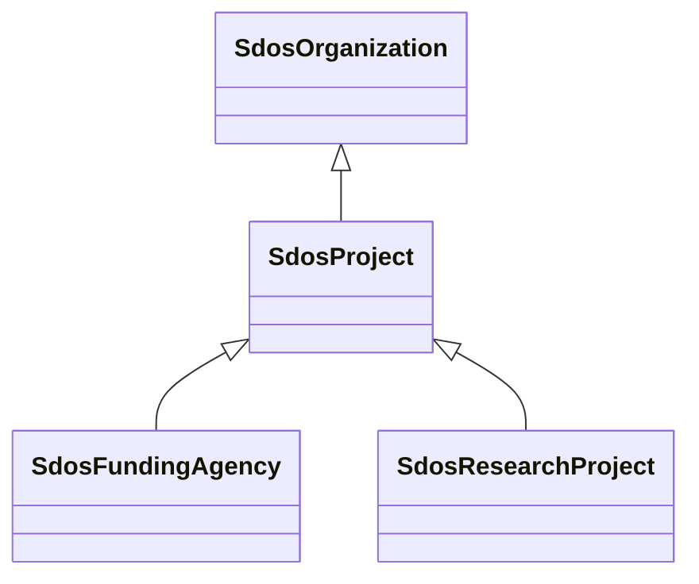

# Class: Project (sdos_Project)


_An enterprise (potentially individual but typically collaborative), planned to achieve a particular aim.␊Use properties from [[Organization]], [[subOrganization]]/[[parentOrganization]] to indicate project sub-structures._


This class occurs 1944 times.


URI: [sdos:Project](https://schema.org/Project)





## Inheritance
* [SdosThing](../classes/SdosThing.md)
    * [SdosOrganization](../classes/SdosOrganization.md)
        * **SdosProject**
            * [SdosFundingAgency](../classes/SdosFundingAgency.md)
            * [SdosResearchProject](../classes/SdosResearchProject.md)


## Slots

| Name | Cardinality and Range | Description | Inheritance | Occurrences |
| ---  | --- | --- | --- | --- |


## Comments

* source: https://schema.org/docs/collab/FundInfoCollab


## LinkML Source

<!-- TODO: investigate https://stackoverflow.com/questions/37606292/how-to-create-tabbed-code-blocks-in-mkdocs-or-sphinx -->

### Direct

<details>

```yaml
name: sdos_Project
description: An enterprise (potentially individual but typically collaborative), planned
  to achieve a particular aim.␊Use properties from [[Organization]], [[subOrganization]]/[[parentOrganization]]
  to indicate project sub-structures.
title: Project
comments:
- 'source: https://schema.org/docs/collab/FundInfoCollab'
from_schema: okns:sdo
source: https://github.com/schemaorg/schemaorg/issues/383
is_a: sdos_Organization
class_uri: sdos:Project

```
</details>

### Induced

<details>

```yaml
name: sdos_Project
description: An enterprise (potentially individual but typically collaborative), planned
  to achieve a particular aim.␊Use properties from [[Organization]], [[subOrganization]]/[[parentOrganization]]
  to indicate project sub-structures.
title: Project
comments:
- 'source: https://schema.org/docs/collab/FundInfoCollab'
from_schema: okns:sdo
source: https://github.com/schemaorg/schemaorg/issues/383
is_a: sdos_Organization
class_uri: sdos:Project

```
</details>