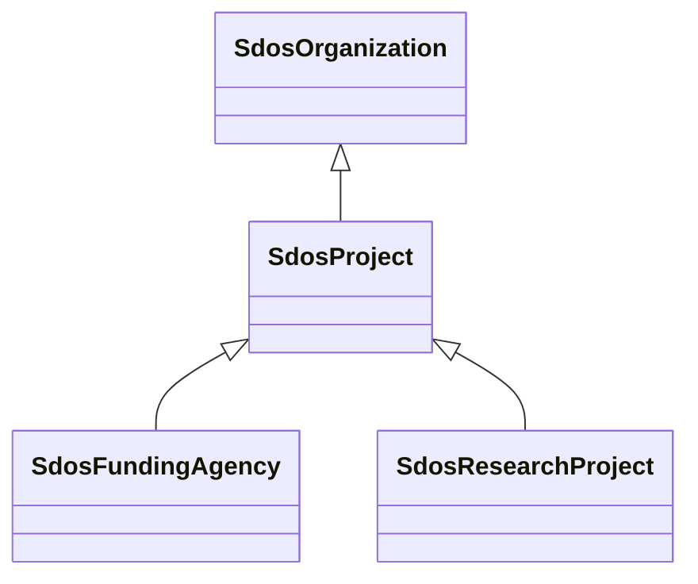

# Class: Project (sdos_Project)


_An enterprise (potentially individual but typically collaborative), planned to achieve a particular aim.␊Use properties from [[Organization]], [[subOrganization]]/[[parentOrganization]] to indicate project sub-structures._


This class occurs 1944 times.


URI: [sdos:Project](https://schema.org/Project)





## Inheritance
* [SdosThing](../classes/SdosThing.md)
    * [SdosOrganization](../classes/SdosOrganization.md)
        * **SdosProject**
            * [SdosFundingAgency](../classes/SdosFundingAgency.md)
            * [SdosResearchProject](../classes/SdosResearchProject.md)


## Slots

| Name | Cardinality and Range | Description | Inheritance | Occurrences |
| ---  | --- | --- | --- | --- |


## Usages

| used by | used in | type | used |
| ---  | --- | --- | --- |
| [HttpTemplekg.orgOntologyExperiment](../classes/HttpTemplekg.orgOntologyExperiment.md) | [http___templekg.org_ontology_ProvidedBy](../slots/http___templekg.org_ontology_ProvidedBy.md) | any_of[range] | [SdosProject](../classes/SdosProject.md) |
| [HttpTemplekg.orgOntologyExperiment](../classes/HttpTemplekg.orgOntologyExperiment.md) | [http___templekg.org_ontology_HasActivity](../slots/http___templekg.org_ontology_HasActivity.md) | range | [SdosProject](../classes/SdosProject.md) |
| [HttpTemplekg.orgOntologyExperiment](../classes/HttpTemplekg.orgOntologyExperiment.md) | [http___templekg.org_ontology_RunBy](../slots/http___templekg.org_ontology_RunBy.md) | any_of[range] | [SdosProject](../classes/SdosProject.md) |
| [HttpTemplekg.orgOntologyExperiment](../classes/HttpTemplekg.orgOntologyExperiment.md) | [http___templekg.org_ontology_TargetsLocation](../slots/http___templekg.org_ontology_TargetsLocation.md) | any_of[range] | [SdosProject](../classes/SdosProject.md) |
| [HttpTemplekg.orgOntologyExperiment](../classes/HttpTemplekg.orgOntologyExperiment.md) | [http___templekg.org_ontology_ChildOf](../slots/http___templekg.org_ontology_ChildOf.md) | any_of[range] | [SdosProject](../classes/SdosProject.md) |
| [HttpTemplekg.orgOntologyExperiment](../classes/HttpTemplekg.orgOntologyExperiment.md) | [http___templekg.org_ontology_Outputs](../slots/http___templekg.org_ontology_Outputs.md) | any_of[range] | [SdosProject](../classes/SdosProject.md) |
| [HttpTemplekg.orgOntologyExperiment](../classes/HttpTemplekg.orgOntologyExperiment.md) | [http___templekg.org_ontology_ComparedTo](../slots/http___templekg.org_ontology_ComparedTo.md) | any_of[range] | [SdosProject](../classes/SdosProject.md) |
| [HttpTemplekg.orgOntologyExperiment](../classes/HttpTemplekg.orgOntologyExperiment.md) | [http___templekg.org_ontology_UsedIn](../slots/http___templekg.org_ontology_UsedIn.md) | any_of[range] | [SdosProject](../classes/SdosProject.md) |
| [HttpTemplekg.orgOntologyExperiment](../classes/HttpTemplekg.orgOntologyExperiment.md) | [http___templekg.org_ontology_HasProjectName](../slots/http___templekg.org_ontology_HasProjectName.md) | range | [SdosProject](../classes/SdosProject.md) |
| [HttpTemplekg.orgOntologyExperiment](../classes/HttpTemplekg.orgOntologyExperiment.md) | [http___templekg.org_ontology_HasParentActivity](../slots/http___templekg.org_ontology_HasParentActivity.md) | range | [SdosProject](../classes/SdosProject.md) |
| [HttpTemplekg.orgOntologyExperiment](../classes/HttpTemplekg.orgOntologyExperiment.md) | [http___templekg.org_ontology_ValidatedBy](../slots/http___templekg.org_ontology_ValidatedBy.md) | any_of[range] | [SdosProject](../classes/SdosProject.md) |
| [HttpTemplekg.orgOntologyInstrument](../classes/HttpTemplekg.orgOntologyInstrument.md) | [http___templekg.org_ontology_ProvidedBy](../slots/http___templekg.org_ontology_ProvidedBy.md) | any_of[range] | [SdosProject](../classes/SdosProject.md) |
| [HttpTemplekg.orgOntologyInstrument](../classes/HttpTemplekg.orgOntologyInstrument.md) | [http___templekg.org_ontology_MountedOn](../slots/http___templekg.org_ontology_MountedOn.md) | any_of[range] | [SdosProject](../classes/SdosProject.md) |
| [HttpTemplekg.orgOntologyInstrument](../classes/HttpTemplekg.orgOntologyInstrument.md) | [http___templekg.org_ontology_WikiInstanceOf](../slots/http___templekg.org_ontology_WikiInstanceOf.md) | any_of[range] | [SdosProject](../classes/SdosProject.md) |
| [HttpTemplekg.orgOntologyInstrument](../classes/HttpTemplekg.orgOntologyInstrument.md) | [http___templekg.org_ontology_WikiNamedAfter](../slots/http___templekg.org_ontology_WikiNamedAfter.md) | any_of[range] | [SdosProject](../classes/SdosProject.md) |
| [HttpTemplekg.orgOntologyInstrument](../classes/HttpTemplekg.orgOntologyInstrument.md) | [http___templekg.org_ontology_WikiPartOf](../slots/http___templekg.org_ontology_WikiPartOf.md) | any_of[range] | [SdosProject](../classes/SdosProject.md) |
| [HttpTemplekg.orgOntologyInstrument](../classes/HttpTemplekg.orgOntologyInstrument.md) | [http___templekg.org_ontology_TargetsLocation](../slots/http___templekg.org_ontology_TargetsLocation.md) | any_of[range] | [SdosProject](../classes/SdosProject.md) |
| [HttpTemplekg.orgOntologyInstrument](../classes/HttpTemplekg.orgOntologyInstrument.md) | [http___templekg.org_ontology_ChildOf](../slots/http___templekg.org_ontology_ChildOf.md) | any_of[range] | [SdosProject](../classes/SdosProject.md) |
| [HttpTemplekg.orgOntologyInstrument](../classes/HttpTemplekg.orgOntologyInstrument.md) | [http___templekg.org_ontology_Outputs](../slots/http___templekg.org_ontology_Outputs.md) | any_of[range] | [SdosProject](../classes/SdosProject.md) |
| [HttpTemplekg.orgOntologyInstrument](../classes/HttpTemplekg.orgOntologyInstrument.md) | [http___templekg.org_ontology_WikiUses](../slots/http___templekg.org_ontology_WikiUses.md) | any_of[range] | [SdosProject](../classes/SdosProject.md) |
| [HttpTemplekg.orgOntologyInstrument](../classes/HttpTemplekg.orgOntologyInstrument.md) | [http___templekg.org_ontology_ComparedTo](../slots/http___templekg.org_ontology_ComparedTo.md) | any_of[range] | [SdosProject](../classes/SdosProject.md) |
| [HttpTemplekg.orgOntologyInstrument](../classes/HttpTemplekg.orgOntologyInstrument.md) | [http___templekg.org_ontology_WikiChild](../slots/http___templekg.org_ontology_WikiChild.md) | any_of[range] | [SdosProject](../classes/SdosProject.md) |
| [HttpTemplekg.orgOntologyInstrument](../classes/HttpTemplekg.orgOntologyInstrument.md) | [http___templekg.org_ontology_WikiMadeFromMaterial](../slots/http___templekg.org_ontology_WikiMadeFromMaterial.md) | any_of[range] | [SdosProject](../classes/SdosProject.md) |
| [HttpTemplekg.orgOntologyInstrument](../classes/HttpTemplekg.orgOntologyInstrument.md) | [http___templekg.org_ontology_WikiStudiedIn](../slots/http___templekg.org_ontology_WikiStudiedIn.md) | any_of[range] | [SdosProject](../classes/SdosProject.md) |
| [HttpTemplekg.orgOntologyInstrument](../classes/HttpTemplekg.orgOntologyInstrument.md) | [http___templekg.org_ontology_WikiOperator](../slots/http___templekg.org_ontology_WikiOperator.md) | any_of[range] | [SdosProject](../classes/SdosProject.md) |
| [HttpTemplekg.orgOntologyInstrument](../classes/HttpTemplekg.orgOntologyInstrument.md) | [http___templekg.org_ontology_UsedIn](../slots/http___templekg.org_ontology_UsedIn.md) | any_of[range] | [SdosProject](../classes/SdosProject.md) |
| [HttpTemplekg.orgOntologyInstrument](../classes/HttpTemplekg.orgOntologyInstrument.md) | [http___templekg.org_ontology_WikiInfluencedBy](../slots/http___templekg.org_ontology_WikiInfluencedBy.md) | any_of[range] | [SdosProject](../classes/SdosProject.md) |
| [HttpTemplekg.orgOntologyInstrument](../classes/HttpTemplekg.orgOntologyInstrument.md) | [http___templekg.org_ontology_WikiHasEffect](../slots/http___templekg.org_ontology_WikiHasEffect.md) | any_of[range] | [SdosProject](../classes/SdosProject.md) |
| [HttpTemplekg.orgOntologyInstrument](../classes/HttpTemplekg.orgOntologyInstrument.md) | [http___templekg.org_ontology_WikiCountryOfCitizenship](../slots/http___templekg.org_ontology_WikiCountryOfCitizenship.md) | any_of[range] | [SdosProject](../classes/SdosProject.md) |
| [HttpTemplekg.orgOntologyInstrument](../classes/HttpTemplekg.orgOntologyInstrument.md) | [http___templekg.org_ontology_WikiSubclassOf](../slots/http___templekg.org_ontology_WikiSubclassOf.md) | any_of[range] | [SdosProject](../classes/SdosProject.md) |
| [HttpTemplekg.orgOntologyInstrument](../classes/HttpTemplekg.orgOntologyInstrument.md) | [http___templekg.org_ontology_WikiFollowedBy](../slots/http___templekg.org_ontology_WikiFollowedBy.md) | any_of[range] | [SdosProject](../classes/SdosProject.md) |
| [HttpTemplekg.orgOntologyInstrument](../classes/HttpTemplekg.orgOntologyInstrument.md) | [http___templekg.org_ontology_WikiMeasures](../slots/http___templekg.org_ontology_WikiMeasures.md) | any_of[range] | [SdosProject](../classes/SdosProject.md) |
| [HttpTemplekg.orgOntologyInstrument](../classes/HttpTemplekg.orgOntologyInstrument.md) | [http___templekg.org_ontology_WikiFollows](../slots/http___templekg.org_ontology_WikiFollows.md) | any_of[range] | [SdosProject](../classes/SdosProject.md) |
| [HttpTemplekg.orgOntologyInstrument](../classes/HttpTemplekg.orgOntologyInstrument.md) | [http___templekg.org_ontology_WikiOppositeOf](../slots/http___templekg.org_ontology_WikiOppositeOf.md) | any_of[range] | [SdosProject](../classes/SdosProject.md) |
| [HttpTemplekg.orgOntologyInstrument](../classes/HttpTemplekg.orgOntologyInstrument.md) | [http___templekg.org_ontology_WikiDifferentFrom](../slots/http___templekg.org_ontology_WikiDifferentFrom.md) | any_of[range] | [SdosProject](../classes/SdosProject.md) |
| [HttpTemplekg.orgOntologyInstrument](../classes/HttpTemplekg.orgOntologyInstrument.md) | [http___templekg.org_ontology_WikiDepicts](../slots/http___templekg.org_ontology_WikiDepicts.md) | any_of[range] | [SdosProject](../classes/SdosProject.md) |
| [HttpTemplekg.orgOntologyInstrument](../classes/HttpTemplekg.orgOntologyInstrument.md) | [http___templekg.org_ontology_WikiHasUse](../slots/http___templekg.org_ontology_WikiHasUse.md) | any_of[range] | [SdosProject](../classes/SdosProject.md) |
| [HttpTemplekg.orgOntologyInstrument](../classes/HttpTemplekg.orgOntologyInstrument.md) | [http___templekg.org_ontology_WikiParticipant](../slots/http___templekg.org_ontology_WikiParticipant.md) | any_of[range] | [SdosProject](../classes/SdosProject.md) |
| [HttpTemplekg.orgOntologyInstrument](../classes/HttpTemplekg.orgOntologyInstrument.md) | [http___templekg.org_ontology_WikiLocatedInTheAdministrativeTerritorialEntity](../slots/http___templekg.org_ontology_WikiLocatedInTheAdministrativeTerritorialEntity.md) | any_of[range] | [SdosProject](../classes/SdosProject.md) |
| [HttpTemplekg.orgOntologyInstrument](../classes/HttpTemplekg.orgOntologyInstrument.md) | [http___templekg.org_ontology_WikiLocatedInOrNextToBodyOfWater](../slots/http___templekg.org_ontology_WikiLocatedInOrNextToBodyOfWater.md) | any_of[range] | [SdosProject](../classes/SdosProject.md) |
| [HttpTemplekg.orgOntologyInstrument](../classes/HttpTemplekg.orgOntologyInstrument.md) | [http___templekg.org_ontology_ValidatedBy](../slots/http___templekg.org_ontology_ValidatedBy.md) | any_of[range] | [SdosProject](../classes/SdosProject.md) |
| [HttpTemplekg.orgOntologyInstrument](../classes/HttpTemplekg.orgOntologyInstrument.md) | [http___templekg.org_ontology_WikiHasParts](../slots/http___templekg.org_ontology_WikiHasParts.md) | any_of[range] | [SdosProject](../classes/SdosProject.md) |
| [HttpTemplekg.orgOntologyLocation](../classes/HttpTemplekg.orgOntologyLocation.md) | [http___templekg.org_ontology_WikiInstanceOf](../slots/http___templekg.org_ontology_WikiInstanceOf.md) | any_of[range] | [SdosProject](../classes/SdosProject.md) |
| [HttpTemplekg.orgOntologyLocation](../classes/HttpTemplekg.orgOntologyLocation.md) | [http___templekg.org_ontology_ProvidedBy](../slots/http___templekg.org_ontology_ProvidedBy.md) | any_of[range] | [SdosProject](../classes/SdosProject.md) |
| [HttpTemplekg.orgOntologyLocation](../classes/HttpTemplekg.orgOntologyLocation.md) | [http___templekg.org_ontology_WikiNamedAfter](../slots/http___templekg.org_ontology_WikiNamedAfter.md) | any_of[range] | [SdosProject](../classes/SdosProject.md) |
| [HttpTemplekg.orgOntologyLocation](../classes/HttpTemplekg.orgOntologyLocation.md) | [http___templekg.org_ontology_WikiPartOf](../slots/http___templekg.org_ontology_WikiPartOf.md) | any_of[range] | [SdosProject](../classes/SdosProject.md) |
| [HttpTemplekg.orgOntologyLocation](../classes/HttpTemplekg.orgOntologyLocation.md) | [http___templekg.org_ontology_TargetsLocation](../slots/http___templekg.org_ontology_TargetsLocation.md) | any_of[range] | [SdosProject](../classes/SdosProject.md) |
| [HttpTemplekg.orgOntologyLocation](../classes/HttpTemplekg.orgOntologyLocation.md) | [http___templekg.org_ontology_ChildOf](../slots/http___templekg.org_ontology_ChildOf.md) | any_of[range] | [SdosProject](../classes/SdosProject.md) |
| [HttpTemplekg.orgOntologyLocation](../classes/HttpTemplekg.orgOntologyLocation.md) | [http___templekg.org_ontology_Outputs](../slots/http___templekg.org_ontology_Outputs.md) | any_of[range] | [SdosProject](../classes/SdosProject.md) |
| [HttpTemplekg.orgOntologyLocation](../classes/HttpTemplekg.orgOntologyLocation.md) | [http___templekg.org_ontology_WikiUses](../slots/http___templekg.org_ontology_WikiUses.md) | any_of[range] | [SdosProject](../classes/SdosProject.md) |
| [HttpTemplekg.orgOntologyLocation](../classes/HttpTemplekg.orgOntologyLocation.md) | [http___templekg.org_ontology_ComparedTo](../slots/http___templekg.org_ontology_ComparedTo.md) | any_of[range] | [SdosProject](../classes/SdosProject.md) |
| [HttpTemplekg.orgOntologyLocation](../classes/HttpTemplekg.orgOntologyLocation.md) | [http___templekg.org_ontology_WikiCapital](../slots/http___templekg.org_ontology_WikiCapital.md) | any_of[range] | [SdosProject](../classes/SdosProject.md) |
| [HttpTemplekg.orgOntologyLocation](../classes/HttpTemplekg.orgOntologyLocation.md) | [http___templekg.org_ontology_WikiChild](../slots/http___templekg.org_ontology_WikiChild.md) | any_of[range] | [SdosProject](../classes/SdosProject.md) |
| [HttpTemplekg.orgOntologyLocation](../classes/HttpTemplekg.orgOntologyLocation.md) | [http___templekg.org_ontology_WikiMadeFromMaterial](../slots/http___templekg.org_ontology_WikiMadeFromMaterial.md) | any_of[range] | [SdosProject](../classes/SdosProject.md) |
| [HttpTemplekg.orgOntologyLocation](../classes/HttpTemplekg.orgOntologyLocation.md) | [http___templekg.org_ontology_WikiStudiedIn](../slots/http___templekg.org_ontology_WikiStudiedIn.md) | any_of[range] | [SdosProject](../classes/SdosProject.md) |
| [HttpTemplekg.orgOntologyLocation](../classes/HttpTemplekg.orgOntologyLocation.md) | [http___templekg.org_ontology_WikiOperator](../slots/http___templekg.org_ontology_WikiOperator.md) | any_of[range] | [SdosProject](../classes/SdosProject.md) |
| [HttpTemplekg.orgOntologyLocation](../classes/HttpTemplekg.orgOntologyLocation.md) | [http___templekg.org_ontology_UsedIn](../slots/http___templekg.org_ontology_UsedIn.md) | any_of[range] | [SdosProject](../classes/SdosProject.md) |
| [HttpTemplekg.orgOntologyLocation](../classes/HttpTemplekg.orgOntologyLocation.md) | [http___templekg.org_ontology_WikiInfluencedBy](../slots/http___templekg.org_ontology_WikiInfluencedBy.md) | any_of[range] | [SdosProject](../classes/SdosProject.md) |
| [HttpTemplekg.orgOntologyLocation](../classes/HttpTemplekg.orgOntologyLocation.md) | [http___templekg.org_ontology_WikiBasinCountry](../slots/http___templekg.org_ontology_WikiBasinCountry.md) | any_of[range] | [SdosProject](../classes/SdosProject.md) |
| [HttpTemplekg.orgOntologyLocation](../classes/HttpTemplekg.orgOntologyLocation.md) | [http___templekg.org_ontology_WikiCountryOfCitizenship](../slots/http___templekg.org_ontology_WikiCountryOfCitizenship.md) | any_of[range] | [SdosProject](../classes/SdosProject.md) |
| [HttpTemplekg.orgOntologyLocation](../classes/HttpTemplekg.orgOntologyLocation.md) | [http___templekg.org_ontology_WikiSubclassOf](../slots/http___templekg.org_ontology_WikiSubclassOf.md) | any_of[range] | [SdosProject](../classes/SdosProject.md) |
| [HttpTemplekg.orgOntologyLocation](../classes/HttpTemplekg.orgOntologyLocation.md) | [http___templekg.org_ontology_WikiFollowedBy](../slots/http___templekg.org_ontology_WikiFollowedBy.md) | any_of[range] | [SdosProject](../classes/SdosProject.md) |
| [HttpTemplekg.orgOntologyLocation](../classes/HttpTemplekg.orgOntologyLocation.md) | [http___templekg.org_ontology_WikiHasPartsOfTheClass](../slots/http___templekg.org_ontology_WikiHasPartsOfTheClass.md) | any_of[range] | [SdosProject](../classes/SdosProject.md) |
| [HttpTemplekg.orgOntologyLocation](../classes/HttpTemplekg.orgOntologyLocation.md) | [http___templekg.org_ontology_WikiFollows](../slots/http___templekg.org_ontology_WikiFollows.md) | any_of[range] | [SdosProject](../classes/SdosProject.md) |
| [HttpTemplekg.orgOntologyLocation](../classes/HttpTemplekg.orgOntologyLocation.md) | [http___templekg.org_ontology_WikiOppositeOf](../slots/http___templekg.org_ontology_WikiOppositeOf.md) | any_of[range] | [SdosProject](../classes/SdosProject.md) |
| [HttpTemplekg.orgOntologyLocation](../classes/HttpTemplekg.orgOntologyLocation.md) | [http___templekg.org_ontology_WikiDifferentFrom](../slots/http___templekg.org_ontology_WikiDifferentFrom.md) | any_of[range] | [SdosProject](../classes/SdosProject.md) |
| [HttpTemplekg.orgOntologyLocation](../classes/HttpTemplekg.orgOntologyLocation.md) | [http___templekg.org_ontology_WikiDepicts](../slots/http___templekg.org_ontology_WikiDepicts.md) | any_of[range] | [SdosProject](../classes/SdosProject.md) |
| [HttpTemplekg.orgOntologyLocation](../classes/HttpTemplekg.orgOntologyLocation.md) | [http___templekg.org_ontology_WikiHasUse](../slots/http___templekg.org_ontology_WikiHasUse.md) | any_of[range] | [SdosProject](../classes/SdosProject.md) |
| [HttpTemplekg.orgOntologyLocation](../classes/HttpTemplekg.orgOntologyLocation.md) | [http___templekg.org_ontology_WikiParticipant](../slots/http___templekg.org_ontology_WikiParticipant.md) | any_of[range] | [SdosProject](../classes/SdosProject.md) |
| [HttpTemplekg.orgOntologyLocation](../classes/HttpTemplekg.orgOntologyLocation.md) | [http___templekg.org_ontology_WikiLocatedInTheAdministrativeTerritorialEntity](../slots/http___templekg.org_ontology_WikiLocatedInTheAdministrativeTerritorialEntity.md) | any_of[range] | [SdosProject](../classes/SdosProject.md) |
| [HttpTemplekg.orgOntologyLocation](../classes/HttpTemplekg.orgOntologyLocation.md) | [http___templekg.org_ontology_WikiLocatedInOrNextToBodyOfWater](../slots/http___templekg.org_ontology_WikiLocatedInOrNextToBodyOfWater.md) | any_of[range] | [SdosProject](../classes/SdosProject.md) |
| [HttpTemplekg.orgOntologyLocation](../classes/HttpTemplekg.orgOntologyLocation.md) | [http___templekg.org_ontology_ValidatedBy](../slots/http___templekg.org_ontology_ValidatedBy.md) | any_of[range] | [SdosProject](../classes/SdosProject.md) |
| [HttpTemplekg.orgOntologyLocation](../classes/HttpTemplekg.orgOntologyLocation.md) | [http___templekg.org_ontology_WikiHasParts](../slots/http___templekg.org_ontology_WikiHasParts.md) | any_of[range] | [SdosProject](../classes/SdosProject.md) |
| [HttpTemplekg.orgOntologyModel](../classes/HttpTemplekg.orgOntologyModel.md) | [http___templekg.org_ontology_HasActivityParticipation](../slots/http___templekg.org_ontology_HasActivityParticipation.md) | range | [SdosProject](../classes/SdosProject.md) |
| [HttpTemplekg.orgOntologyModel](../classes/HttpTemplekg.orgOntologyModel.md) | [http___templekg.org_ontology_ProvidedBy](../slots/http___templekg.org_ontology_ProvidedBy.md) | any_of[range] | [SdosProject](../classes/SdosProject.md) |
| [HttpTemplekg.orgOntologyModel](../classes/HttpTemplekg.orgOntologyModel.md) | [http___templekg.org_ontology_MountedOn](../slots/http___templekg.org_ontology_MountedOn.md) | any_of[range] | [SdosProject](../classes/SdosProject.md) |
| [HttpTemplekg.orgOntologyModel](../classes/HttpTemplekg.orgOntologyModel.md) | [http___templekg.org_ontology_WikiIsTheStudyOf](../slots/http___templekg.org_ontology_WikiIsTheStudyOf.md) | any_of[range] | [SdosProject](../classes/SdosProject.md) |
| [HttpTemplekg.orgOntologyModel](../classes/HttpTemplekg.orgOntologyModel.md) | [http___templekg.org_ontology_RunBy](../slots/http___templekg.org_ontology_RunBy.md) | any_of[range] | [SdosProject](../classes/SdosProject.md) |
| [HttpTemplekg.orgOntologyModel](../classes/HttpTemplekg.orgOntologyModel.md) | [http___templekg.org_ontology_TargetsLocation](../slots/http___templekg.org_ontology_TargetsLocation.md) | any_of[range] | [SdosProject](../classes/SdosProject.md) |
| [HttpTemplekg.orgOntologyModel](../classes/HttpTemplekg.orgOntologyModel.md) | [http___templekg.org_ontology_ChildOf](../slots/http___templekg.org_ontology_ChildOf.md) | any_of[range] | [SdosProject](../classes/SdosProject.md) |
| [HttpTemplekg.orgOntologyModel](../classes/HttpTemplekg.orgOntologyModel.md) | [http___templekg.org_ontology_Outputs](../slots/http___templekg.org_ontology_Outputs.md) | any_of[range] | [SdosProject](../classes/SdosProject.md) |
| [HttpTemplekg.orgOntologyModel](../classes/HttpTemplekg.orgOntologyModel.md) | [http___templekg.org_ontology_ComparedTo](../slots/http___templekg.org_ontology_ComparedTo.md) | any_of[range] | [SdosProject](../classes/SdosProject.md) |
| [HttpTemplekg.orgOntologyModel](../classes/HttpTemplekg.orgOntologyModel.md) | [http___templekg.org_ontology_WikiStudiedIn](../slots/http___templekg.org_ontology_WikiStudiedIn.md) | any_of[range] | [SdosProject](../classes/SdosProject.md) |
| [HttpTemplekg.orgOntologyModel](../classes/HttpTemplekg.orgOntologyModel.md) | [http___templekg.org_ontology_UsedIn](../slots/http___templekg.org_ontology_UsedIn.md) | any_of[range] | [SdosProject](../classes/SdosProject.md) |
| [HttpTemplekg.orgOntologyModel](../classes/HttpTemplekg.orgOntologyModel.md) | [http___templekg.org_ontology_WikiHasEffect](../slots/http___templekg.org_ontology_WikiHasEffect.md) | any_of[range] | [SdosProject](../classes/SdosProject.md) |
| [HttpTemplekg.orgOntologyModel](../classes/HttpTemplekg.orgOntologyModel.md) | [http___templekg.org_ontology_HasProjectName](../slots/http___templekg.org_ontology_HasProjectName.md) | range | [SdosProject](../classes/SdosProject.md) |
| [HttpTemplekg.orgOntologyModel](../classes/HttpTemplekg.orgOntologyModel.md) | [http___templekg.org_ontology_WikiSubclassOf](../slots/http___templekg.org_ontology_WikiSubclassOf.md) | any_of[range] | [SdosProject](../classes/SdosProject.md) |
| [HttpTemplekg.orgOntologyModel](../classes/HttpTemplekg.orgOntologyModel.md) | [http___templekg.org_ontology_WikiHasPartsOfTheClass](../slots/http___templekg.org_ontology_WikiHasPartsOfTheClass.md) | any_of[range] | [SdosProject](../classes/SdosProject.md) |
| [HttpTemplekg.orgOntologyModel](../classes/HttpTemplekg.orgOntologyModel.md) | [http___templekg.org_ontology_WikiHasUse](../slots/http___templekg.org_ontology_WikiHasUse.md) | any_of[range] | [SdosProject](../classes/SdosProject.md) |
| [HttpTemplekg.orgOntologyModel](../classes/HttpTemplekg.orgOntologyModel.md) | [http___templekg.org_ontology_ValidatedBy](../slots/http___templekg.org_ontology_ValidatedBy.md) | any_of[range] | [SdosProject](../classes/SdosProject.md) |
| [HttpTemplekg.orgOntologyModel](../classes/HttpTemplekg.orgOntologyModel.md) | [http___templekg.org_ontology_WikiHasParts](../slots/http___templekg.org_ontology_WikiHasParts.md) | any_of[range] | [SdosProject](../classes/SdosProject.md) |
| [HttpTemplekg.orgOntologyNaturalHazard](../classes/HttpTemplekg.orgOntologyNaturalHazard.md) | [http___templekg.org_ontology_WikiDifferentFrom](../slots/http___templekg.org_ontology_WikiDifferentFrom.md) | any_of[range] | [SdosProject](../classes/SdosProject.md) |
| [HttpTemplekg.orgOntologyNaturalHazard](../classes/HttpTemplekg.orgOntologyNaturalHazard.md) | [http___templekg.org_ontology_ComparedTo](../slots/http___templekg.org_ontology_ComparedTo.md) | any_of[range] | [SdosProject](../classes/SdosProject.md) |
| [HttpTemplekg.orgOntologyNaturalHazard](../classes/HttpTemplekg.orgOntologyNaturalHazard.md) | [http___templekg.org_ontology_WikiStudiedIn](../slots/http___templekg.org_ontology_WikiStudiedIn.md) | any_of[range] | [SdosProject](../classes/SdosProject.md) |
| [HttpTemplekg.orgOntologyNaturalHazard](../classes/HttpTemplekg.orgOntologyNaturalHazard.md) | [http___templekg.org_ontology_WikiSubclassOf](../slots/http___templekg.org_ontology_WikiSubclassOf.md) | any_of[range] | [SdosProject](../classes/SdosProject.md) |
| [HttpTemplekg.orgOntologyNaturalHazard](../classes/HttpTemplekg.orgOntologyNaturalHazard.md) | [http___templekg.org_ontology_ValidatedBy](../slots/http___templekg.org_ontology_ValidatedBy.md) | any_of[range] | [SdosProject](../classes/SdosProject.md) |
| [HttpTemplekg.orgOntologyNaturalHazard](../classes/HttpTemplekg.orgOntologyNaturalHazard.md) | [http___templekg.org_ontology_UsedIn](../slots/http___templekg.org_ontology_UsedIn.md) | any_of[range] | [SdosProject](../classes/SdosProject.md) |
| [HttpTemplekg.orgOntologyNaturalHazard](../classes/HttpTemplekg.orgOntologyNaturalHazard.md) | [http___templekg.org_ontology_TargetsLocation](../slots/http___templekg.org_ontology_TargetsLocation.md) | any_of[range] | [SdosProject](../classes/SdosProject.md) |
| [HttpTemplekg.orgOntologyNaturalHazard](../classes/HttpTemplekg.orgOntologyNaturalHazard.md) | [http___templekg.org_ontology_ChildOf](../slots/http___templekg.org_ontology_ChildOf.md) | any_of[range] | [SdosProject](../classes/SdosProject.md) |
| [HttpTemplekg.orgOntologyNaturalHazard](../classes/HttpTemplekg.orgOntologyNaturalHazard.md) | [http___templekg.org_ontology_WikiHasEffect](../slots/http___templekg.org_ontology_WikiHasEffect.md) | any_of[range] | [SdosProject](../classes/SdosProject.md) |
| [HttpTemplekg.orgOntologyOceanCirculation](../classes/HttpTemplekg.orgOntologyOceanCirculation.md) | [http___templekg.org_ontology_WikiInstanceOf](../slots/http___templekg.org_ontology_WikiInstanceOf.md) | any_of[range] | [SdosProject](../classes/SdosProject.md) |
| [HttpTemplekg.orgOntologyOceanCirculation](../classes/HttpTemplekg.orgOntologyOceanCirculation.md) | [http___templekg.org_ontology_ComparedTo](../slots/http___templekg.org_ontology_ComparedTo.md) | any_of[range] | [SdosProject](../classes/SdosProject.md) |
| [HttpTemplekg.orgOntologyOceanCirculation](../classes/HttpTemplekg.orgOntologyOceanCirculation.md) | [http___templekg.org_ontology_WikiSubclassOf](../slots/http___templekg.org_ontology_WikiSubclassOf.md) | any_of[range] | [SdosProject](../classes/SdosProject.md) |
| [HttpTemplekg.orgOntologyOceanCirculation](../classes/HttpTemplekg.orgOntologyOceanCirculation.md) | [http___templekg.org_ontology_UsedIn](../slots/http___templekg.org_ontology_UsedIn.md) | any_of[range] | [SdosProject](../classes/SdosProject.md) |
| [HttpTemplekg.orgOntologyOceanCirculation](../classes/HttpTemplekg.orgOntologyOceanCirculation.md) | [http___templekg.org_ontology_TargetsLocation](../slots/http___templekg.org_ontology_TargetsLocation.md) | any_of[range] | [SdosProject](../classes/SdosProject.md) |
| [HttpTemplekg.orgOntologyOceanCirculation](../classes/HttpTemplekg.orgOntologyOceanCirculation.md) | [http___templekg.org_ontology_RunBy](../slots/http___templekg.org_ontology_RunBy.md) | any_of[range] | [SdosProject](../classes/SdosProject.md) |
| [HttpTemplekg.orgOntologyOceanCirculation](../classes/HttpTemplekg.orgOntologyOceanCirculation.md) | [http___templekg.org_ontology_ChildOf](../slots/http___templekg.org_ontology_ChildOf.md) | any_of[range] | [SdosProject](../classes/SdosProject.md) |
| [HttpTemplekg.orgOntologyOceanCirculation](../classes/HttpTemplekg.orgOntologyOceanCirculation.md) | [http___templekg.org_ontology_Outputs](../slots/http___templekg.org_ontology_Outputs.md) | any_of[range] | [SdosProject](../classes/SdosProject.md) |
| [HttpTemplekg.orgOntologyOthers](../classes/HttpTemplekg.orgOntologyOthers.md) | [http___templekg.org_ontology_WikiInstanceOf](../slots/http___templekg.org_ontology_WikiInstanceOf.md) | any_of[range] | [SdosProject](../classes/SdosProject.md) |
| [HttpTemplekg.orgOntologyOthers](../classes/HttpTemplekg.orgOntologyOthers.md) | [http___templekg.org_ontology_ProvidedBy](../slots/http___templekg.org_ontology_ProvidedBy.md) | any_of[range] | [SdosProject](../classes/SdosProject.md) |
| [HttpTemplekg.orgOntologyOthers](../classes/HttpTemplekg.orgOntologyOthers.md) | [http___templekg.org_ontology_MountedOn](../slots/http___templekg.org_ontology_MountedOn.md) | any_of[range] | [SdosProject](../classes/SdosProject.md) |
| [HttpTemplekg.orgOntologyOthers](../classes/HttpTemplekg.orgOntologyOthers.md) | [http___templekg.org_ontology_WikiNamedAfter](../slots/http___templekg.org_ontology_WikiNamedAfter.md) | any_of[range] | [SdosProject](../classes/SdosProject.md) |
| [HttpTemplekg.orgOntologyOthers](../classes/HttpTemplekg.orgOntologyOthers.md) | [http___templekg.org_ontology_WikiIsTheStudyOf](../slots/http___templekg.org_ontology_WikiIsTheStudyOf.md) | any_of[range] | [SdosProject](../classes/SdosProject.md) |
| [HttpTemplekg.orgOntologyOthers](../classes/HttpTemplekg.orgOntologyOthers.md) | [http___templekg.org_ontology_WikiPartOf](../slots/http___templekg.org_ontology_WikiPartOf.md) | any_of[range] | [SdosProject](../classes/SdosProject.md) |
| [HttpTemplekg.orgOntologyOthers](../classes/HttpTemplekg.orgOntologyOthers.md) | [http___templekg.org_ontology_TargetsLocation](../slots/http___templekg.org_ontology_TargetsLocation.md) | any_of[range] | [SdosProject](../classes/SdosProject.md) |
| [HttpTemplekg.orgOntologyOthers](../classes/HttpTemplekg.orgOntologyOthers.md) | [http___templekg.org_ontology_RunBy](../slots/http___templekg.org_ontology_RunBy.md) | any_of[range] | [SdosProject](../classes/SdosProject.md) |
| [HttpTemplekg.orgOntologyOthers](../classes/HttpTemplekg.orgOntologyOthers.md) | [http___templekg.org_ontology_ChildOf](../slots/http___templekg.org_ontology_ChildOf.md) | any_of[range] | [SdosProject](../classes/SdosProject.md) |
| [HttpTemplekg.orgOntologyOthers](../classes/HttpTemplekg.orgOntologyOthers.md) | [http___templekg.org_ontology_Outputs](../slots/http___templekg.org_ontology_Outputs.md) | any_of[range] | [SdosProject](../classes/SdosProject.md) |
| [HttpTemplekg.orgOntologyOthers](../classes/HttpTemplekg.orgOntologyOthers.md) | [http___templekg.org_ontology_WikiUses](../slots/http___templekg.org_ontology_WikiUses.md) | any_of[range] | [SdosProject](../classes/SdosProject.md) |
| [HttpTemplekg.orgOntologyOthers](../classes/HttpTemplekg.orgOntologyOthers.md) | [http___templekg.org_ontology_ComparedTo](../slots/http___templekg.org_ontology_ComparedTo.md) | any_of[range] | [SdosProject](../classes/SdosProject.md) |
| [HttpTemplekg.orgOntologyOthers](../classes/HttpTemplekg.orgOntologyOthers.md) | [http___templekg.org_ontology_WikiCapital](../slots/http___templekg.org_ontology_WikiCapital.md) | any_of[range] | [SdosProject](../classes/SdosProject.md) |
| [HttpTemplekg.orgOntologyOthers](../classes/HttpTemplekg.orgOntologyOthers.md) | [http___templekg.org_ontology_WikiMadeFromMaterial](../slots/http___templekg.org_ontology_WikiMadeFromMaterial.md) | any_of[range] | [SdosProject](../classes/SdosProject.md) |
| [HttpTemplekg.orgOntologyOthers](../classes/HttpTemplekg.orgOntologyOthers.md) | [http___templekg.org_ontology_WikiStudiedIn](../slots/http___templekg.org_ontology_WikiStudiedIn.md) | any_of[range] | [SdosProject](../classes/SdosProject.md) |
| [HttpTemplekg.orgOntologyOthers](../classes/HttpTemplekg.orgOntologyOthers.md) | [http___templekg.org_ontology_WikiOperator](../slots/http___templekg.org_ontology_WikiOperator.md) | any_of[range] | [SdosProject](../classes/SdosProject.md) |
| [HttpTemplekg.orgOntologyOthers](../classes/HttpTemplekg.orgOntologyOthers.md) | [http___templekg.org_ontology_UsedIn](../slots/http___templekg.org_ontology_UsedIn.md) | any_of[range] | [SdosProject](../classes/SdosProject.md) |
| [HttpTemplekg.orgOntologyOthers](../classes/HttpTemplekg.orgOntologyOthers.md) | [http___templekg.org_ontology_WikiPdbLigandId](../slots/http___templekg.org_ontology_WikiPdbLigandId.md) | any_of[range] | [SdosProject](../classes/SdosProject.md) |
| [HttpTemplekg.orgOntologyOthers](../classes/HttpTemplekg.orgOntologyOthers.md) | [http___templekg.org_ontology_WikiInfluencedBy](../slots/http___templekg.org_ontology_WikiInfluencedBy.md) | any_of[range] | [SdosProject](../classes/SdosProject.md) |
| [HttpTemplekg.orgOntologyOthers](../classes/HttpTemplekg.orgOntologyOthers.md) | [http___templekg.org_ontology_WikiHasEffect](../slots/http___templekg.org_ontology_WikiHasEffect.md) | any_of[range] | [SdosProject](../classes/SdosProject.md) |
| [HttpTemplekg.orgOntologyOthers](../classes/HttpTemplekg.orgOntologyOthers.md) | [http___templekg.org_ontology_WikiCountryOfCitizenship](../slots/http___templekg.org_ontology_WikiCountryOfCitizenship.md) | any_of[range] | [SdosProject](../classes/SdosProject.md) |
| [HttpTemplekg.orgOntologyOthers](../classes/HttpTemplekg.orgOntologyOthers.md) | [http___templekg.org_ontology_WikiSubclassOf](../slots/http___templekg.org_ontology_WikiSubclassOf.md) | any_of[range] | [SdosProject](../classes/SdosProject.md) |
| [HttpTemplekg.orgOntologyOthers](../classes/HttpTemplekg.orgOntologyOthers.md) | [http___templekg.org_ontology_HasProjectName](../slots/http___templekg.org_ontology_HasProjectName.md) | range | [SdosProject](../classes/SdosProject.md) |
| [HttpTemplekg.orgOntologyOthers](../classes/HttpTemplekg.orgOntologyOthers.md) | [http___templekg.org_ontology_WikiFollowedBy](../slots/http___templekg.org_ontology_WikiFollowedBy.md) | any_of[range] | [SdosProject](../classes/SdosProject.md) |
| [HttpTemplekg.orgOntologyOthers](../classes/HttpTemplekg.orgOntologyOthers.md) | [http___templekg.org_ontology_WikiAssociatedHazard](../slots/http___templekg.org_ontology_WikiAssociatedHazard.md) | range | [SdosProject](../classes/SdosProject.md) |
| [HttpTemplekg.orgOntologyOthers](../classes/HttpTemplekg.orgOntologyOthers.md) | [http___templekg.org_ontology_WikiHasPartsOfTheClass](../slots/http___templekg.org_ontology_WikiHasPartsOfTheClass.md) | any_of[range] | [SdosProject](../classes/SdosProject.md) |
| [HttpTemplekg.orgOntologyOthers](../classes/HttpTemplekg.orgOntologyOthers.md) | [http___templekg.org_ontology_WikiFollows](../slots/http___templekg.org_ontology_WikiFollows.md) | any_of[range] | [SdosProject](../classes/SdosProject.md) |
| [HttpTemplekg.orgOntologyOthers](../classes/HttpTemplekg.orgOntologyOthers.md) | [http___templekg.org_ontology_WikiMeasures](../slots/http___templekg.org_ontology_WikiMeasures.md) | any_of[range] | [SdosProject](../classes/SdosProject.md) |
| [HttpTemplekg.orgOntologyOthers](../classes/HttpTemplekg.orgOntologyOthers.md) | [http___templekg.org_ontology_WikiOppositeOf](../slots/http___templekg.org_ontology_WikiOppositeOf.md) | any_of[range] | [SdosProject](../classes/SdosProject.md) |
| [HttpTemplekg.orgOntologyOthers](../classes/HttpTemplekg.orgOntologyOthers.md) | [http___templekg.org_ontology_WikiDifferentFrom](../slots/http___templekg.org_ontology_WikiDifferentFrom.md) | any_of[range] | [SdosProject](../classes/SdosProject.md) |
| [HttpTemplekg.orgOntologyOthers](../classes/HttpTemplekg.orgOntologyOthers.md) | [http___templekg.org_ontology_WikiDepicts](../slots/http___templekg.org_ontology_WikiDepicts.md) | any_of[range] | [SdosProject](../classes/SdosProject.md) |
| [HttpTemplekg.orgOntologyOthers](../classes/HttpTemplekg.orgOntologyOthers.md) | [http___templekg.org_ontology_WikiFileExtension](../slots/http___templekg.org_ontology_WikiFileExtension.md) | any_of[range] | [SdosProject](../classes/SdosProject.md) |
| [HttpTemplekg.orgOntologyOthers](../classes/HttpTemplekg.orgOntologyOthers.md) | [http___templekg.org_ontology_WikiHasUse](../slots/http___templekg.org_ontology_WikiHasUse.md) | any_of[range] | [SdosProject](../classes/SdosProject.md) |
| [HttpTemplekg.orgOntologyOthers](../classes/HttpTemplekg.orgOntologyOthers.md) | [http___templekg.org_ontology_WikiLocatedInTheAdministrativeTerritorialEntity](../slots/http___templekg.org_ontology_WikiLocatedInTheAdministrativeTerritorialEntity.md) | any_of[range] | [SdosProject](../classes/SdosProject.md) |
| [HttpTemplekg.orgOntologyOthers](../classes/HttpTemplekg.orgOntologyOthers.md) | [http___templekg.org_ontology_WikiParticipant](../slots/http___templekg.org_ontology_WikiParticipant.md) | any_of[range] | [SdosProject](../classes/SdosProject.md) |
| [HttpTemplekg.orgOntologyOthers](../classes/HttpTemplekg.orgOntologyOthers.md) | [http___templekg.org_ontology_ValidatedBy](../slots/http___templekg.org_ontology_ValidatedBy.md) | any_of[range] | [SdosProject](../classes/SdosProject.md) |
| [HttpTemplekg.orgOntologyOthers](../classes/HttpTemplekg.orgOntologyOthers.md) | [http___templekg.org_ontology_WikiHasParts](../slots/http___templekg.org_ontology_WikiHasParts.md) | any_of[range] | [SdosProject](../classes/SdosProject.md) |
| [HttpTemplekg.orgOntologyPaper](../classes/HttpTemplekg.orgOntologyPaper.md) | [http___templekg.org_ontology_Mention](../slots/http___templekg.org_ontology_Mention.md) | any_of[range] | [SdosProject](../classes/SdosProject.md) |
| [HttpTemplekg.orgOntologyPlatform](../classes/HttpTemplekg.orgOntologyPlatform.md) | [http___templekg.org_ontology_WikiInstanceOf](../slots/http___templekg.org_ontology_WikiInstanceOf.md) | any_of[range] | [SdosProject](../classes/SdosProject.md) |
| [HttpTemplekg.orgOntologyPlatform](../classes/HttpTemplekg.orgOntologyPlatform.md) | [http___templekg.org_ontology_ProvidedBy](../slots/http___templekg.org_ontology_ProvidedBy.md) | any_of[range] | [SdosProject](../classes/SdosProject.md) |
| [HttpTemplekg.orgOntologyPlatform](../classes/HttpTemplekg.orgOntologyPlatform.md) | [http___templekg.org_ontology_MountedOn](../slots/http___templekg.org_ontology_MountedOn.md) | any_of[range] | [SdosProject](../classes/SdosProject.md) |
| [HttpTemplekg.orgOntologyPlatform](../classes/HttpTemplekg.orgOntologyPlatform.md) | [http___templekg.org_ontology_WikiNamedAfter](../slots/http___templekg.org_ontology_WikiNamedAfter.md) | any_of[range] | [SdosProject](../classes/SdosProject.md) |
| [HttpTemplekg.orgOntologyPlatform](../classes/HttpTemplekg.orgOntologyPlatform.md) | [http___templekg.org_ontology_WikiPartOf](../slots/http___templekg.org_ontology_WikiPartOf.md) | any_of[range] | [SdosProject](../classes/SdosProject.md) |
| [HttpTemplekg.orgOntologyPlatform](../classes/HttpTemplekg.orgOntologyPlatform.md) | [http___templekg.org_ontology_TargetsLocation](../slots/http___templekg.org_ontology_TargetsLocation.md) | any_of[range] | [SdosProject](../classes/SdosProject.md) |
| [HttpTemplekg.orgOntologyPlatform](../classes/HttpTemplekg.orgOntologyPlatform.md) | [http___templekg.org_ontology_RunBy](../slots/http___templekg.org_ontology_RunBy.md) | any_of[range] | [SdosProject](../classes/SdosProject.md) |
| [HttpTemplekg.orgOntologyPlatform](../classes/HttpTemplekg.orgOntologyPlatform.md) | [http___templekg.org_ontology_ChildOf](../slots/http___templekg.org_ontology_ChildOf.md) | any_of[range] | [SdosProject](../classes/SdosProject.md) |
| [HttpTemplekg.orgOntologyPlatform](../classes/HttpTemplekg.orgOntologyPlatform.md) | [http___templekg.org_ontology_Outputs](../slots/http___templekg.org_ontology_Outputs.md) | any_of[range] | [SdosProject](../classes/SdosProject.md) |
| [HttpTemplekg.orgOntologyPlatform](../classes/HttpTemplekg.orgOntologyPlatform.md) | [http___templekg.org_ontology_WikiUses](../slots/http___templekg.org_ontology_WikiUses.md) | any_of[range] | [SdosProject](../classes/SdosProject.md) |
| [HttpTemplekg.orgOntologyPlatform](../classes/HttpTemplekg.orgOntologyPlatform.md) | [http___templekg.org_ontology_ComparedTo](../slots/http___templekg.org_ontology_ComparedTo.md) | any_of[range] | [SdosProject](../classes/SdosProject.md) |
| [HttpTemplekg.orgOntologyPlatform](../classes/HttpTemplekg.orgOntologyPlatform.md) | [http___templekg.org_ontology_WikiChild](../slots/http___templekg.org_ontology_WikiChild.md) | any_of[range] | [SdosProject](../classes/SdosProject.md) |
| [HttpTemplekg.orgOntologyPlatform](../classes/HttpTemplekg.orgOntologyPlatform.md) | [http___templekg.org_ontology_WikiMadeFromMaterial](../slots/http___templekg.org_ontology_WikiMadeFromMaterial.md) | any_of[range] | [SdosProject](../classes/SdosProject.md) |
| [HttpTemplekg.orgOntologyPlatform](../classes/HttpTemplekg.orgOntologyPlatform.md) | [http___templekg.org_ontology_WikiStudiedIn](../slots/http___templekg.org_ontology_WikiStudiedIn.md) | any_of[range] | [SdosProject](../classes/SdosProject.md) |
| [HttpTemplekg.orgOntologyPlatform](../classes/HttpTemplekg.orgOntologyPlatform.md) | [http___templekg.org_ontology_WikiOperator](../slots/http___templekg.org_ontology_WikiOperator.md) | any_of[range] | [SdosProject](../classes/SdosProject.md) |
| [HttpTemplekg.orgOntologyPlatform](../classes/HttpTemplekg.orgOntologyPlatform.md) | [http___templekg.org_ontology_UsedIn](../slots/http___templekg.org_ontology_UsedIn.md) | any_of[range] | [SdosProject](../classes/SdosProject.md) |
| [HttpTemplekg.orgOntologyPlatform](../classes/HttpTemplekg.orgOntologyPlatform.md) | [http___templekg.org_ontology_WikiInfluencedBy](../slots/http___templekg.org_ontology_WikiInfluencedBy.md) | any_of[range] | [SdosProject](../classes/SdosProject.md) |
| [HttpTemplekg.orgOntologyPlatform](../classes/HttpTemplekg.orgOntologyPlatform.md) | [http___templekg.org_ontology_WikiHasEffect](../slots/http___templekg.org_ontology_WikiHasEffect.md) | any_of[range] | [SdosProject](../classes/SdosProject.md) |
| [HttpTemplekg.orgOntologyPlatform](../classes/HttpTemplekg.orgOntologyPlatform.md) | [http___templekg.org_ontology_WikiCountryOfCitizenship](../slots/http___templekg.org_ontology_WikiCountryOfCitizenship.md) | any_of[range] | [SdosProject](../classes/SdosProject.md) |
| [HttpTemplekg.orgOntologyPlatform](../classes/HttpTemplekg.orgOntologyPlatform.md) | [http___templekg.org_ontology_WikiSubclassOf](../slots/http___templekg.org_ontology_WikiSubclassOf.md) | any_of[range] | [SdosProject](../classes/SdosProject.md) |
| [HttpTemplekg.orgOntologyPlatform](../classes/HttpTemplekg.orgOntologyPlatform.md) | [http___templekg.org_ontology_WikiFollowedBy](../slots/http___templekg.org_ontology_WikiFollowedBy.md) | any_of[range] | [SdosProject](../classes/SdosProject.md) |
| [HttpTemplekg.orgOntologyPlatform](../classes/HttpTemplekg.orgOntologyPlatform.md) | [http___templekg.org_ontology_WikiFollows](../slots/http___templekg.org_ontology_WikiFollows.md) | any_of[range] | [SdosProject](../classes/SdosProject.md) |
| [HttpTemplekg.orgOntologyPlatform](../classes/HttpTemplekg.orgOntologyPlatform.md) | [http___templekg.org_ontology_WikiDifferentFrom](../slots/http___templekg.org_ontology_WikiDifferentFrom.md) | any_of[range] | [SdosProject](../classes/SdosProject.md) |
| [HttpTemplekg.orgOntologyPlatform](../classes/HttpTemplekg.orgOntologyPlatform.md) | [http___templekg.org_ontology_WikiDepicts](../slots/http___templekg.org_ontology_WikiDepicts.md) | any_of[range] | [SdosProject](../classes/SdosProject.md) |
| [HttpTemplekg.orgOntologyPlatform](../classes/HttpTemplekg.orgOntologyPlatform.md) | [http___templekg.org_ontology_WikiHasUse](../slots/http___templekg.org_ontology_WikiHasUse.md) | any_of[range] | [SdosProject](../classes/SdosProject.md) |
| [HttpTemplekg.orgOntologyPlatform](../classes/HttpTemplekg.orgOntologyPlatform.md) | [http___templekg.org_ontology_WikiLocatedInTheAdministrativeTerritorialEntity](../slots/http___templekg.org_ontology_WikiLocatedInTheAdministrativeTerritorialEntity.md) | any_of[range] | [SdosProject](../classes/SdosProject.md) |
| [HttpTemplekg.orgOntologyPlatform](../classes/HttpTemplekg.orgOntologyPlatform.md) | [http___templekg.org_ontology_ValidatedBy](../slots/http___templekg.org_ontology_ValidatedBy.md) | any_of[range] | [SdosProject](../classes/SdosProject.md) |
| [HttpTemplekg.orgOntologyPlatform](../classes/HttpTemplekg.orgOntologyPlatform.md) | [http___templekg.org_ontology_WikiHasParts](../slots/http___templekg.org_ontology_WikiHasParts.md) | any_of[range] | [SdosProject](../classes/SdosProject.md) |
| [HttpTemplekg.orgOntologyProvider](../classes/HttpTemplekg.orgOntologyProvider.md) | [http___templekg.org_ontology_ProvidedBy](../slots/http___templekg.org_ontology_ProvidedBy.md) | any_of[range] | [SdosProject](../classes/SdosProject.md) |
| [HttpTemplekg.orgOntologyProvider](../classes/HttpTemplekg.orgOntologyProvider.md) | [http___templekg.org_ontology_WikiInstanceOf](../slots/http___templekg.org_ontology_WikiInstanceOf.md) | any_of[range] | [SdosProject](../classes/SdosProject.md) |
| [HttpTemplekg.orgOntologyProvider](../classes/HttpTemplekg.orgOntologyProvider.md) | [http___templekg.org_ontology_WikiNamedAfter](../slots/http___templekg.org_ontology_WikiNamedAfter.md) | any_of[range] | [SdosProject](../classes/SdosProject.md) |
| [HttpTemplekg.orgOntologyProvider](../classes/HttpTemplekg.orgOntologyProvider.md) | [http___templekg.org_ontology_WikiPartOf](../slots/http___templekg.org_ontology_WikiPartOf.md) | any_of[range] | [SdosProject](../classes/SdosProject.md) |
| [HttpTemplekg.orgOntologyProvider](../classes/HttpTemplekg.orgOntologyProvider.md) | [http___templekg.org_ontology_RunBy](../slots/http___templekg.org_ontology_RunBy.md) | any_of[range] | [SdosProject](../classes/SdosProject.md) |
| [HttpTemplekg.orgOntologyProvider](../classes/HttpTemplekg.orgOntologyProvider.md) | [http___templekg.org_ontology_TargetsLocation](../slots/http___templekg.org_ontology_TargetsLocation.md) | any_of[range] | [SdosProject](../classes/SdosProject.md) |
| [HttpTemplekg.orgOntologyProvider](../classes/HttpTemplekg.orgOntologyProvider.md) | [http___templekg.org_ontology_ChildOf](../slots/http___templekg.org_ontology_ChildOf.md) | any_of[range] | [SdosProject](../classes/SdosProject.md) |
| [HttpTemplekg.orgOntologyProvider](../classes/HttpTemplekg.orgOntologyProvider.md) | [http___templekg.org_ontology_Outputs](../slots/http___templekg.org_ontology_Outputs.md) | any_of[range] | [SdosProject](../classes/SdosProject.md) |
| [HttpTemplekg.orgOntologyProvider](../classes/HttpTemplekg.orgOntologyProvider.md) | [http___templekg.org_ontology_WikiUses](../slots/http___templekg.org_ontology_WikiUses.md) | any_of[range] | [SdosProject](../classes/SdosProject.md) |
| [HttpTemplekg.orgOntologyProvider](../classes/HttpTemplekg.orgOntologyProvider.md) | [http___templekg.org_ontology_ComparedTo](../slots/http___templekg.org_ontology_ComparedTo.md) | any_of[range] | [SdosProject](../classes/SdosProject.md) |
| [HttpTemplekg.orgOntologyProvider](../classes/HttpTemplekg.orgOntologyProvider.md) | [http___templekg.org_ontology_WikiCapital](../slots/http___templekg.org_ontology_WikiCapital.md) | any_of[range] | [SdosProject](../classes/SdosProject.md) |
| [HttpTemplekg.orgOntologyProvider](../classes/HttpTemplekg.orgOntologyProvider.md) | [http___templekg.org_ontology_WikiHasSubsidiary](../slots/http___templekg.org_ontology_WikiHasSubsidiary.md) | any_of[range] | [SdosProject](../classes/SdosProject.md) |
| [HttpTemplekg.orgOntologyProvider](../classes/HttpTemplekg.orgOntologyProvider.md) | [http___templekg.org_ontology_WikiChild](../slots/http___templekg.org_ontology_WikiChild.md) | any_of[range] | [SdosProject](../classes/SdosProject.md) |
| [HttpTemplekg.orgOntologyProvider](../classes/HttpTemplekg.orgOntologyProvider.md) | [http___templekg.org_ontology_WikiStudiedIn](../slots/http___templekg.org_ontology_WikiStudiedIn.md) | any_of[range] | [SdosProject](../classes/SdosProject.md) |
| [HttpTemplekg.orgOntologyProvider](../classes/HttpTemplekg.orgOntologyProvider.md) | [http___templekg.org_ontology_WikiOperator](../slots/http___templekg.org_ontology_WikiOperator.md) | any_of[range] | [SdosProject](../classes/SdosProject.md) |
| [HttpTemplekg.orgOntologyProvider](../classes/HttpTemplekg.orgOntologyProvider.md) | [http___templekg.org_ontology_UsedIn](../slots/http___templekg.org_ontology_UsedIn.md) | any_of[range] | [SdosProject](../classes/SdosProject.md) |
| [HttpTemplekg.orgOntologyProvider](../classes/HttpTemplekg.orgOntologyProvider.md) | [http___templekg.org_ontology_WikiInfluencedBy](../slots/http___templekg.org_ontology_WikiInfluencedBy.md) | any_of[range] | [SdosProject](../classes/SdosProject.md) |
| [HttpTemplekg.orgOntologyProvider](../classes/HttpTemplekg.orgOntologyProvider.md) | [http___templekg.org_ontology_WikiBasinCountry](../slots/http___templekg.org_ontology_WikiBasinCountry.md) | any_of[range] | [SdosProject](../classes/SdosProject.md) |
| [HttpTemplekg.orgOntologyProvider](../classes/HttpTemplekg.orgOntologyProvider.md) | [http___templekg.org_ontology_WikiCountryOfCitizenship](../slots/http___templekg.org_ontology_WikiCountryOfCitizenship.md) | any_of[range] | [SdosProject](../classes/SdosProject.md) |
| [HttpTemplekg.orgOntologyProvider](../classes/HttpTemplekg.orgOntologyProvider.md) | [http___templekg.org_ontology_WikiSubclassOf](../slots/http___templekg.org_ontology_WikiSubclassOf.md) | any_of[range] | [SdosProject](../classes/SdosProject.md) |
| [HttpTemplekg.orgOntologyProvider](../classes/HttpTemplekg.orgOntologyProvider.md) | [http___templekg.org_ontology_WikiFollowedBy](../slots/http___templekg.org_ontology_WikiFollowedBy.md) | any_of[range] | [SdosProject](../classes/SdosProject.md) |
| [HttpTemplekg.orgOntologyProvider](../classes/HttpTemplekg.orgOntologyProvider.md) | [http___templekg.org_ontology_WikiHasPartsOfTheClass](../slots/http___templekg.org_ontology_WikiHasPartsOfTheClass.md) | any_of[range] | [SdosProject](../classes/SdosProject.md) |
| [HttpTemplekg.orgOntologyProvider](../classes/HttpTemplekg.orgOntologyProvider.md) | [http___templekg.org_ontology_WikiFollows](../slots/http___templekg.org_ontology_WikiFollows.md) | any_of[range] | [SdosProject](../classes/SdosProject.md) |
| [HttpTemplekg.orgOntologyProvider](../classes/HttpTemplekg.orgOntologyProvider.md) | [http___templekg.org_ontology_WikiDifferentFrom](../slots/http___templekg.org_ontology_WikiDifferentFrom.md) | any_of[range] | [SdosProject](../classes/SdosProject.md) |
| [HttpTemplekg.orgOntologyProvider](../classes/HttpTemplekg.orgOntologyProvider.md) | [http___templekg.org_ontology_WikiFileExtension](../slots/http___templekg.org_ontology_WikiFileExtension.md) | any_of[range] | [SdosProject](../classes/SdosProject.md) |
| [HttpTemplekg.orgOntologyProvider](../classes/HttpTemplekg.orgOntologyProvider.md) | [http___templekg.org_ontology_WikiHasUse](../slots/http___templekg.org_ontology_WikiHasUse.md) | any_of[range] | [SdosProject](../classes/SdosProject.md) |
| [HttpTemplekg.orgOntologyProvider](../classes/HttpTemplekg.orgOntologyProvider.md) | [http___templekg.org_ontology_WikiParticipant](../slots/http___templekg.org_ontology_WikiParticipant.md) | any_of[range] | [SdosProject](../classes/SdosProject.md) |
| [HttpTemplekg.orgOntologyProvider](../classes/HttpTemplekg.orgOntologyProvider.md) | [http___templekg.org_ontology_WikiLocatedInTheAdministrativeTerritorialEntity](../slots/http___templekg.org_ontology_WikiLocatedInTheAdministrativeTerritorialEntity.md) | any_of[range] | [SdosProject](../classes/SdosProject.md) |
| [HttpTemplekg.orgOntologyProvider](../classes/HttpTemplekg.orgOntologyProvider.md) | [http___templekg.org_ontology_WikiLocatedInOrNextToBodyOfWater](../slots/http___templekg.org_ontology_WikiLocatedInOrNextToBodyOfWater.md) | any_of[range] | [SdosProject](../classes/SdosProject.md) |
| [HttpTemplekg.orgOntologyProvider](../classes/HttpTemplekg.orgOntologyProvider.md) | [http___templekg.org_ontology_ValidatedBy](../slots/http___templekg.org_ontology_ValidatedBy.md) | any_of[range] | [SdosProject](../classes/SdosProject.md) |
| [HttpTemplekg.orgOntologyProvider](../classes/HttpTemplekg.orgOntologyProvider.md) | [http___templekg.org_ontology_WikiHasParts](../slots/http___templekg.org_ontology_WikiHasParts.md) | any_of[range] | [SdosProject](../classes/SdosProject.md) |
| [HttpTemplekg.orgOntologyTeleconnection](../classes/HttpTemplekg.orgOntologyTeleconnection.md) | [http___templekg.org_ontology_WikiInstanceOf](../slots/http___templekg.org_ontology_WikiInstanceOf.md) | any_of[range] | [SdosProject](../classes/SdosProject.md) |
| [HttpTemplekg.orgOntologyTeleconnection](../classes/HttpTemplekg.orgOntologyTeleconnection.md) | [http___templekg.org_ontology_ComparedTo](../slots/http___templekg.org_ontology_ComparedTo.md) | any_of[range] | [SdosProject](../classes/SdosProject.md) |
| [HttpTemplekg.orgOntologyTeleconnection](../classes/HttpTemplekg.orgOntologyTeleconnection.md) | [http___templekg.org_ontology_WikiPartOf](../slots/http___templekg.org_ontology_WikiPartOf.md) | any_of[range] | [SdosProject](../classes/SdosProject.md) |
| [HttpTemplekg.orgOntologyTeleconnection](../classes/HttpTemplekg.orgOntologyTeleconnection.md) | [http___templekg.org_ontology_WikiSubclassOf](../slots/http___templekg.org_ontology_WikiSubclassOf.md) | any_of[range] | [SdosProject](../classes/SdosProject.md) |
| [HttpTemplekg.orgOntologyTeleconnection](../classes/HttpTemplekg.orgOntologyTeleconnection.md) | [http___templekg.org_ontology_ValidatedBy](../slots/http___templekg.org_ontology_ValidatedBy.md) | any_of[range] | [SdosProject](../classes/SdosProject.md) |
| [HttpTemplekg.orgOntologyTeleconnection](../classes/HttpTemplekg.orgOntologyTeleconnection.md) | [http___templekg.org_ontology_UsedIn](../slots/http___templekg.org_ontology_UsedIn.md) | any_of[range] | [SdosProject](../classes/SdosProject.md) |
| [HttpTemplekg.orgOntologyTeleconnection](../classes/HttpTemplekg.orgOntologyTeleconnection.md) | [http___templekg.org_ontology_TargetsLocation](../slots/http___templekg.org_ontology_TargetsLocation.md) | any_of[range] | [SdosProject](../classes/SdosProject.md) |
| [HttpTemplekg.orgOntologyTeleconnection](../classes/HttpTemplekg.orgOntologyTeleconnection.md) | [http___templekg.org_ontology_WikiHasParts](../slots/http___templekg.org_ontology_WikiHasParts.md) | any_of[range] | [SdosProject](../classes/SdosProject.md) |
| [HttpTemplekg.orgOntologyTeleconnection](../classes/HttpTemplekg.orgOntologyTeleconnection.md) | [http___templekg.org_ontology_ChildOf](../slots/http___templekg.org_ontology_ChildOf.md) | any_of[range] | [SdosProject](../classes/SdosProject.md) |
| [HttpTemplekg.orgOntologyTeleconnection](../classes/HttpTemplekg.orgOntologyTeleconnection.md) | [http___templekg.org_ontology_Outputs](../slots/http___templekg.org_ontology_Outputs.md) | any_of[range] | [SdosProject](../classes/SdosProject.md) |
| [HttpTemplekg.orgOntologyVariable](../classes/HttpTemplekg.orgOntologyVariable.md) | [http___templekg.org_ontology_WikiInstanceOf](../slots/http___templekg.org_ontology_WikiInstanceOf.md) | any_of[range] | [SdosProject](../classes/SdosProject.md) |
| [HttpTemplekg.orgOntologyVariable](../classes/HttpTemplekg.orgOntologyVariable.md) | [http___templekg.org_ontology_ProvidedBy](../slots/http___templekg.org_ontology_ProvidedBy.md) | any_of[range] | [SdosProject](../classes/SdosProject.md) |
| [HttpTemplekg.orgOntologyVariable](../classes/HttpTemplekg.orgOntologyVariable.md) | [http___templekg.org_ontology_WikiNamedAfter](../slots/http___templekg.org_ontology_WikiNamedAfter.md) | any_of[range] | [SdosProject](../classes/SdosProject.md) |
| [HttpTemplekg.orgOntologyVariable](../classes/HttpTemplekg.orgOntologyVariable.md) | [http___templekg.org_ontology_WikiPartOf](../slots/http___templekg.org_ontology_WikiPartOf.md) | any_of[range] | [SdosProject](../classes/SdosProject.md) |
| [HttpTemplekg.orgOntologyVariable](../classes/HttpTemplekg.orgOntologyVariable.md) | [http___templekg.org_ontology_TargetsLocation](../slots/http___templekg.org_ontology_TargetsLocation.md) | any_of[range] | [SdosProject](../classes/SdosProject.md) |
| [HttpTemplekg.orgOntologyVariable](../classes/HttpTemplekg.orgOntologyVariable.md) | [http___templekg.org_ontology_ChildOf](../slots/http___templekg.org_ontology_ChildOf.md) | any_of[range] | [SdosProject](../classes/SdosProject.md) |
| [HttpTemplekg.orgOntologyVariable](../classes/HttpTemplekg.orgOntologyVariable.md) | [http___templekg.org_ontology_Outputs](../slots/http___templekg.org_ontology_Outputs.md) | any_of[range] | [SdosProject](../classes/SdosProject.md) |
| [HttpTemplekg.orgOntologyVariable](../classes/HttpTemplekg.orgOntologyVariable.md) | [http___templekg.org_ontology_ComparedTo](../slots/http___templekg.org_ontology_ComparedTo.md) | any_of[range] | [SdosProject](../classes/SdosProject.md) |
| [HttpTemplekg.orgOntologyVariable](../classes/HttpTemplekg.orgOntologyVariable.md) | [http___templekg.org_ontology_WikiCapital](../slots/http___templekg.org_ontology_WikiCapital.md) | any_of[range] | [SdosProject](../classes/SdosProject.md) |
| [HttpTemplekg.orgOntologyVariable](../classes/HttpTemplekg.orgOntologyVariable.md) | [http___templekg.org_ontology_WikiChild](../slots/http___templekg.org_ontology_WikiChild.md) | any_of[range] | [SdosProject](../classes/SdosProject.md) |
| [HttpTemplekg.orgOntologyVariable](../classes/HttpTemplekg.orgOntologyVariable.md) | [http___templekg.org_ontology_WikiMadeFromMaterial](../slots/http___templekg.org_ontology_WikiMadeFromMaterial.md) | any_of[range] | [SdosProject](../classes/SdosProject.md) |
| [HttpTemplekg.orgOntologyVariable](../classes/HttpTemplekg.orgOntologyVariable.md) | [http___templekg.org_ontology_WikiStudiedIn](../slots/http___templekg.org_ontology_WikiStudiedIn.md) | any_of[range] | [SdosProject](../classes/SdosProject.md) |
| [HttpTemplekg.orgOntologyVariable](../classes/HttpTemplekg.orgOntologyVariable.md) | [http___templekg.org_ontology_UsedIn](../slots/http___templekg.org_ontology_UsedIn.md) | any_of[range] | [SdosProject](../classes/SdosProject.md) |
| [HttpTemplekg.orgOntologyVariable](../classes/HttpTemplekg.orgOntologyVariable.md) | [http___templekg.org_ontology_WikiCountryOfCitizenship](../slots/http___templekg.org_ontology_WikiCountryOfCitizenship.md) | any_of[range] | [SdosProject](../classes/SdosProject.md) |
| [HttpTemplekg.orgOntologyVariable](../classes/HttpTemplekg.orgOntologyVariable.md) | [http___templekg.org_ontology_WikiSubclassOf](../slots/http___templekg.org_ontology_WikiSubclassOf.md) | any_of[range] | [SdosProject](../classes/SdosProject.md) |
| [HttpTemplekg.orgOntologyVariable](../classes/HttpTemplekg.orgOntologyVariable.md) | [http___templekg.org_ontology_HasProjectName](../slots/http___templekg.org_ontology_HasProjectName.md) | range | [SdosProject](../classes/SdosProject.md) |
| [HttpTemplekg.orgOntologyVariable](../classes/HttpTemplekg.orgOntologyVariable.md) | [http___templekg.org_ontology_WikiAssociatedHazard](../slots/http___templekg.org_ontology_WikiAssociatedHazard.md) | range | [SdosProject](../classes/SdosProject.md) |
| [HttpTemplekg.orgOntologyVariable](../classes/HttpTemplekg.orgOntologyVariable.md) | [http___templekg.org_ontology_WikiFollowedBy](../slots/http___templekg.org_ontology_WikiFollowedBy.md) | any_of[range] | [SdosProject](../classes/SdosProject.md) |
| [HttpTemplekg.orgOntologyVariable](../classes/HttpTemplekg.orgOntologyVariable.md) | [http___templekg.org_ontology_WikiHasPartsOfTheClass](../slots/http___templekg.org_ontology_WikiHasPartsOfTheClass.md) | any_of[range] | [SdosProject](../classes/SdosProject.md) |
| [HttpTemplekg.orgOntologyVariable](../classes/HttpTemplekg.orgOntologyVariable.md) | [http___templekg.org_ontology_WikiFollows](../slots/http___templekg.org_ontology_WikiFollows.md) | any_of[range] | [SdosProject](../classes/SdosProject.md) |
| [HttpTemplekg.orgOntologyVariable](../classes/HttpTemplekg.orgOntologyVariable.md) | [http___templekg.org_ontology_WikiOppositeOf](../slots/http___templekg.org_ontology_WikiOppositeOf.md) | any_of[range] | [SdosProject](../classes/SdosProject.md) |
| [HttpTemplekg.orgOntologyVariable](../classes/HttpTemplekg.orgOntologyVariable.md) | [http___templekg.org_ontology_WikiDifferentFrom](../slots/http___templekg.org_ontology_WikiDifferentFrom.md) | any_of[range] | [SdosProject](../classes/SdosProject.md) |
| [HttpTemplekg.orgOntologyVariable](../classes/HttpTemplekg.orgOntologyVariable.md) | [http___templekg.org_ontology_WikiFileExtension](../slots/http___templekg.org_ontology_WikiFileExtension.md) | any_of[range] | [SdosProject](../classes/SdosProject.md) |
| [HttpTemplekg.orgOntologyVariable](../classes/HttpTemplekg.orgOntologyVariable.md) | [http___templekg.org_ontology_WikiLocatedInTheAdministrativeTerritorialEntity](../slots/http___templekg.org_ontology_WikiLocatedInTheAdministrativeTerritorialEntity.md) | any_of[range] | [SdosProject](../classes/SdosProject.md) |
| [HttpTemplekg.orgOntologyVariable](../classes/HttpTemplekg.orgOntologyVariable.md) | [http___templekg.org_ontology_WikiLocatedInOrNextToBodyOfWater](../slots/http___templekg.org_ontology_WikiLocatedInOrNextToBodyOfWater.md) | any_of[range] | [SdosProject](../classes/SdosProject.md) |
| [HttpTemplekg.orgOntologyVariable](../classes/HttpTemplekg.orgOntologyVariable.md) | [http___templekg.org_ontology_ValidatedBy](../slots/http___templekg.org_ontology_ValidatedBy.md) | any_of[range] | [SdosProject](../classes/SdosProject.md) |
| [HttpTemplekg.orgOntologyVariable](../classes/HttpTemplekg.orgOntologyVariable.md) | [http___templekg.org_ontology_WikiHasParts](../slots/http___templekg.org_ontology_WikiHasParts.md) | any_of[range] | [SdosProject](../classes/SdosProject.md) |
| [HttpTemplekg.orgOntologyWeatherEvent](../classes/HttpTemplekg.orgOntologyWeatherEvent.md) | [http___templekg.org_ontology_WikiInstanceOf](../slots/http___templekg.org_ontology_WikiInstanceOf.md) | any_of[range] | [SdosProject](../classes/SdosProject.md) |
| [HttpTemplekg.orgOntologyWeatherEvent](../classes/HttpTemplekg.orgOntologyWeatherEvent.md) | [http___templekg.org_ontology_ComparedTo](../slots/http___templekg.org_ontology_ComparedTo.md) | any_of[range] | [SdosProject](../classes/SdosProject.md) |
| [HttpTemplekg.orgOntologyWeatherEvent](../classes/HttpTemplekg.orgOntologyWeatherEvent.md) | [http___templekg.org_ontology_WikiSubclassOf](../slots/http___templekg.org_ontology_WikiSubclassOf.md) | any_of[range] | [SdosProject](../classes/SdosProject.md) |
| [HttpTemplekg.orgOntologyWeatherEvent](../classes/HttpTemplekg.orgOntologyWeatherEvent.md) | [http___templekg.org_ontology_ValidatedBy](../slots/http___templekg.org_ontology_ValidatedBy.md) | any_of[range] | [SdosProject](../classes/SdosProject.md) |
| [HttpTemplekg.orgOntologyWeatherEvent](../classes/HttpTemplekg.orgOntologyWeatherEvent.md) | [http___templekg.org_ontology_UsedIn](../slots/http___templekg.org_ontology_UsedIn.md) | any_of[range] | [SdosProject](../classes/SdosProject.md) |
| [HttpTemplekg.orgOntologyWeatherEvent](../classes/HttpTemplekg.orgOntologyWeatherEvent.md) | [http___templekg.org_ontology_TargetsLocation](../slots/http___templekg.org_ontology_TargetsLocation.md) | any_of[range] | [SdosProject](../classes/SdosProject.md) |
| [HttpTemplekg.orgOntologyWeatherEvent](../classes/HttpTemplekg.orgOntologyWeatherEvent.md) | [http___templekg.org_ontology_RunBy](../slots/http___templekg.org_ontology_RunBy.md) | any_of[range] | [SdosProject](../classes/SdosProject.md) |
| [HttpTemplekg.orgOntologyWeatherEvent](../classes/HttpTemplekg.orgOntologyWeatherEvent.md) | [http___templekg.org_ontology_ChildOf](../slots/http___templekg.org_ontology_ChildOf.md) | any_of[range] | [SdosProject](../classes/SdosProject.md) |
| [HttpTemplekg.orgOntologyWeatherEvent](../classes/HttpTemplekg.orgOntologyWeatherEvent.md) | [http___templekg.org_ontology_Outputs](../slots/http___templekg.org_ontology_Outputs.md) | any_of[range] | [SdosProject](../classes/SdosProject.md) |
| [HttpTemplekg.orgOntologyWeatherEvent](../classes/HttpTemplekg.orgOntologyWeatherEvent.md) | [http___templekg.org_ontology_WikiHasParts](../slots/http___templekg.org_ontology_WikiHasParts.md) | any_of[range] | [SdosProject](../classes/SdosProject.md) |
| [HttpTemplekg.orgOntologyWeatherEvent](../classes/HttpTemplekg.orgOntologyWeatherEvent.md) | [http___templekg.org_ontology_WikiHasEffect](../slots/http___templekg.org_ontology_WikiHasEffect.md) | any_of[range] | [SdosProject](../classes/SdosProject.md) |


## Comments

* source: https://schema.org/docs/collab/FundInfoCollab


## LinkML Source

<!-- TODO: investigate https://stackoverflow.com/questions/37606292/how-to-create-tabbed-code-blocks-in-mkdocs-or-sphinx -->

### Direct

<details>

```yaml
name: sdos_Project
description: An enterprise (potentially individual but typically collaborative), planned
  to achieve a particular aim.␊Use properties from [[Organization]], [[subOrganization]]/[[parentOrganization]]
  to indicate project sub-structures.
title: Project
comments:
- 'source: https://schema.org/docs/collab/FundInfoCollab'
from_schema: okns:sdo
source: https://github.com/schemaorg/schemaorg/issues/383
is_a: sdos_Organization
class_uri: sdos:Project

```
</details>

### Induced

<details>

```yaml
name: sdos_Project
description: An enterprise (potentially individual but typically collaborative), planned
  to achieve a particular aim.␊Use properties from [[Organization]], [[subOrganization]]/[[parentOrganization]]
  to indicate project sub-structures.
title: Project
comments:
- 'source: https://schema.org/docs/collab/FundInfoCollab'
from_schema: okns:sdo
source: https://github.com/schemaorg/schemaorg/issues/383
is_a: sdos_Organization
class_uri: sdos:Project

```
</details>