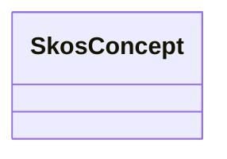

# Class: Concept (skos_Concept)


_An idea or notion; a unit of thought._


This class occurs 13935 times.


URI: [skos:Concept](http://www.w3.org/2004/02/skos/core#Concept)





<!-- no inheritance hierarchy -->


## Slots

| Name | Cardinality and Range | Description | Inheritance | Occurrences |
| ---  | --- | --- | --- | --- |


## Usages

| used by | used in | type | used |
| ---  | --- | --- | --- |
| [AdmsSemanticAssetDistribution](../classes/AdmsSemanticAssetDistribution.md) | [adms_status](../slots/adms_status.md) | range | [SkosConcept](../classes/SkosConcept.md) |


## LinkML Source

<!-- TODO: investigate https://stackoverflow.com/questions/37606292/how-to-create-tabbed-code-blocks-in-mkdocs-or-sphinx -->

### Direct

<details>

```yaml
name: skos_Concept
description: An idea or notion; a unit of thought.
title: Concept
from_schema: okns:skos
source: http://www.w3.org/2004/02/skos/core
class_uri: skos:Concept

```
</details>

### Induced

<details>

```yaml
name: skos_Concept
description: An idea or notion; a unit of thought.
title: Concept
from_schema: okns:skos
source: http://www.w3.org/2004/02/skos/core
class_uri: skos:Concept

```
</details>