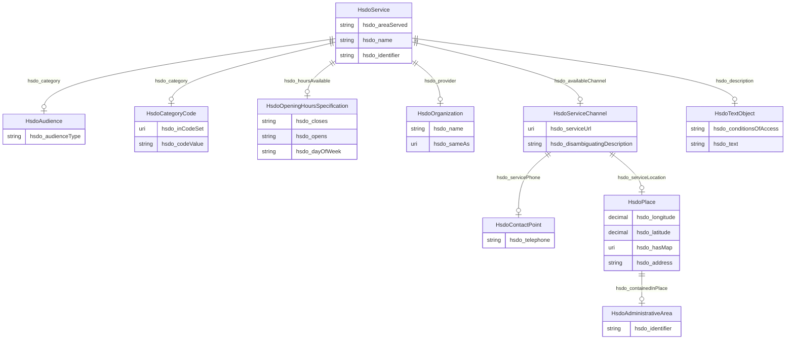

# No schema name specified

No schema description specified

## Schema Diagram

## Classes

| Class | Description | Occurrences |
| --- | --- | --- |
| [HsdoAdministrativeArea](classes/HsdoAdministrativeArea.md) | A geographical region, typically under the jurisdiction of a particular government. | 39 | 
| [HsdoAudience](classes/HsdoAudience.md) | Intended audience for an item, i.e. the group for whom the item was created. | 81 | 
| [HsdoCategoryCode](classes/HsdoCategoryCode.md) | A Category Code. | 157 | 
| [HsdoContactPoint](classes/HsdoContactPoint.md) | A contact point&#x2014;for example, a Customer Complaints department. | 87 | 
| [HsdoOpeningHoursSpecification](classes/HsdoOpeningHoursSpecification.md) | A structured value providing information about the opening hours of a place or a certain service inside a place.\n\n␊The place is __open__ if the [[opens]] property is specified, and __closed__ otherwise.\n\nIf the value for the [[closes]] property is less than the value for the [[opens]] property then the hour range is assumed to span over the next day.␊       | 609 | 
| [HsdoOrganization](classes/HsdoOrganization.md) | An organization such as a school, NGO, corporation, club, etc. | 87 | 
| [HsdoPlace](classes/HsdoPlace.md) | Entities that have a somewhat fixed, physical extension. | 87 | 
| [HsdoService](classes/HsdoService.md) | A service provided by an organization, e.g. delivery service, print services, etc. | 87 | 
| [HsdoServiceChannel](classes/HsdoServiceChannel.md) | A means for accessing a service, e.g. a government office location, web site, or phone number. | 174 | 
| [HsdoTextObject](classes/HsdoTextObject.md) | A text file. The text can be unformatted or contain markup, html, etc. | 87 | 

## Slots

| Slot | Description | Occurrences |
| --- | --- | --- |
| [hsdo_address](slots/hsdo_address.md) | Physical address of the item | 93 |
| [hsdo_areaServed](slots/hsdo_areaServed.md) | The geographic area where a service or offered item is provided | 87 |
| [hsdo_audienceType](slots/hsdo_audienceType.md) | The target group associated with a given audience (e | 81 |
| [hsdo_availableChannel](slots/hsdo_availableChannel.md) | A means of accessing the service (e | 174 |
| [hsdo_category](slots/hsdo_category.md) | A category for the item | 1345 |
| [hsdo_closes](slots/hsdo_closes.md) | The closing hour of the place or service on the given day(s) of the week | 623 |
| [hsdo_codeValue](slots/hsdo_codeValue.md) | A short textual code that uniquely identifies the value | 158 |
| [hsdo_conditionsOfAccess](slots/hsdo_conditionsOfAccess.md) | Conditions that affect the availability of, or method(s) of access to, an ite... | 88 |
| [hsdo_containedInPlace](slots/hsdo_containedInPlace.md) | The basic containment relation between a place and one that contains it | 88 |
| [hsdo_dayOfWeek](slots/hsdo_dayOfWeek.md) | The day of the week for which these opening hours are valid | 609 |
| [hsdo_description](slots/hsdo_description.md) | A description of the item | 87 |
| [hsdo_disambiguatingDescription](slots/hsdo_disambiguatingDescription.md) | A sub property of description | 174 |
| [hsdo_hasMap](slots/hsdo_hasMap.md) | A URL to a map of the place | 88 |
| [hsdo_hoursAvailable](slots/hsdo_hoursAvailable.md) | The hours during which this service or contact is available | 609 |
| [hsdo_identifier](slots/hsdo_identifier.md) | The identifier property represents any kind of identifier for any kind of [[T... | 126 |
| [hsdo_inCodeSet](slots/hsdo_inCodeSet.md) | A [[CategoryCodeSet]] that contains this category code | 157 |
| [hsdo_latitude](slots/hsdo_latitude.md) | The latitude of a location | 89 |
| [hsdo_longitude](slots/hsdo_longitude.md) | The longitude of a location | 89 |
| [hsdo_name](slots/hsdo_name.md) | The name of the item | 177 |
| [hsdo_opens](slots/hsdo_opens.md) | The opening hour of the place or service on the given day(s) of the week | 631 |
| [hsdo_provider](slots/hsdo_provider.md) | The service provider, service operator, or service performer; the goods produ... | 87 |
| [hsdo_sameAs](slots/hsdo_sameAs.md) | URL of a reference Web page that unambiguously indicates the item's identity | 127 |
| [hsdo_serviceLocation](slots/hsdo_serviceLocation.md) | The location (e | 87 |
| [hsdo_servicePhone](slots/hsdo_servicePhone.md) | The phone number to use to access the service | 87 |
| [hsdo_serviceUrl](slots/hsdo_serviceUrl.md) | The website to access the service | 188 |
| [hsdo_telephone](slots/hsdo_telephone.md) | The telephone number | 87 |
| [hsdo_text](slots/hsdo_text.md) | The textual content of this CreativeWork | 90 |

## IRI prefixes

* dreamkg: http://www.semanticweb.org/dreamkg/ijcai/
* hsdo: http://schema.org/
* linkml: https://w3id.org/linkml/
* xsd: http://www.w3.org/2001/XMLSchema#
* shex: http://www.w3.org/ns/shex#
* schema: http://schema.org/
