# dream-kg

No schema description specified

## Schema Diagram

```mermaid
erDiagram
HsdoAdministrativeArea {
    string hsdo_identifier  
    uri prov_wasInfluencedBy  
}
HsdoAudience {
    string hsdo_audienceType  
    uri prov_wasInfluencedBy  
}
HsdoCategoryCode {
    string hsdo_codeValue  
    uri hsdo_inCodeSet  
    uri prov_wasInfluencedBy  
}
HsdoContactPoint {
    uri prov_wasInfluencedBy  
    string hsdo_telephone  
}
HsdoOpeningHoursSpecification {
    string hsdo_dayOfWeek  
    uri prov_wasInfluencedBy  
    string hsdo_opens  
    string hsdo_closes  
}
HsdoOrganization {
    uri hsdo_sameAs  
    string hsdo_name  
    uri prov_wasInfluencedBy  
}
HsdoPlace {
    string hsdo_address  
    uri hsdo_hasMap  
    decimal hsdo_longitude  
    decimal hsdo_latitude  
    uri prov_wasInfluencedBy  
}
HsdoService {
    string hsdo_name  
    uri prov_wasInfluencedBy  
    string hsdo_identifier  
    string hsdo_areaServed  
}
HsdoServiceChannel {
    string hsdo_disambiguatingDescription  
    uri hsdo_serviceUrl  
}
HsdoTextObject {
    string hsdo_conditionsOfAccess  
    string hsdo_text  
    uri prov_wasInfluencedBy  
}
HsdoWebPage {

}
ProvActivity {

}
ProvCollection {
    uri prov_wasInfluencedBy  
}
ProvEntity {
    uri prov_wasInfluencedBy  
}

HsdoAdministrativeArea ||--|o ProvActivity : "prov_wasGeneratedBy"
HsdoAdministrativeArea ||--|o ProvEntity : "prov_wasDerivedFrom"
HsdoAdministrativeArea ||--|o ProvActivity : "prov_wasInfluencedBy"
HsdoAdministrativeArea ||--|o ProvEntity : "prov_wasInfluencedBy"
HsdoAdministrativeArea ||--|o HsdoOrganization : "prov_wasInfluencedBy"
HsdoAdministrativeArea ||--|o HsdoContactPoint : "prov_wasInfluencedBy"
HsdoAdministrativeArea ||--|o HsdoWebPage : "prov_wasInfluencedBy"
HsdoAdministrativeArea ||--|o HsdoPlace : "prov_wasInfluencedBy"
HsdoAdministrativeArea ||--|o HsdoService : "prov_wasInfluencedBy"
HsdoAdministrativeArea ||--|o HsdoOpeningHoursSpecification : "prov_wasInfluencedBy"
HsdoAdministrativeArea ||--|o HsdoTextObject : "prov_wasInfluencedBy"
HsdoAudience ||--|o ProvActivity : "prov_wasGeneratedBy"
HsdoAudience ||--|o ProvEntity : "prov_wasDerivedFrom"
HsdoAudience ||--|o ProvActivity : "prov_wasInfluencedBy"
HsdoAudience ||--|o ProvEntity : "prov_wasInfluencedBy"
HsdoAudience ||--|o HsdoOrganization : "prov_wasInfluencedBy"
HsdoAudience ||--|o HsdoContactPoint : "prov_wasInfluencedBy"
HsdoAudience ||--|o HsdoWebPage : "prov_wasInfluencedBy"
HsdoAudience ||--|o HsdoPlace : "prov_wasInfluencedBy"
HsdoAudience ||--|o HsdoService : "prov_wasInfluencedBy"
HsdoAudience ||--|o HsdoOpeningHoursSpecification : "prov_wasInfluencedBy"
HsdoAudience ||--|o HsdoTextObject : "prov_wasInfluencedBy"
HsdoCategoryCode ||--|o ProvActivity : "prov_wasGeneratedBy"
HsdoCategoryCode ||--|o ProvActivity : "prov_wasInfluencedBy"
HsdoCategoryCode ||--|o ProvEntity : "prov_wasInfluencedBy"
HsdoCategoryCode ||--|o HsdoOrganization : "prov_wasInfluencedBy"
HsdoCategoryCode ||--|o HsdoContactPoint : "prov_wasInfluencedBy"
HsdoCategoryCode ||--|o HsdoWebPage : "prov_wasInfluencedBy"
HsdoCategoryCode ||--|o HsdoPlace : "prov_wasInfluencedBy"
HsdoCategoryCode ||--|o HsdoService : "prov_wasInfluencedBy"
HsdoCategoryCode ||--|o HsdoOpeningHoursSpecification : "prov_wasInfluencedBy"
HsdoCategoryCode ||--|o HsdoTextObject : "prov_wasInfluencedBy"
HsdoCategoryCode ||--|o ProvEntity : "prov_wasDerivedFrom"
HsdoContactPoint ||--|o ProvActivity : "prov_wasGeneratedBy"
HsdoContactPoint ||--|o ProvActivity : "prov_wasInfluencedBy"
HsdoContactPoint ||--|o ProvEntity : "prov_wasInfluencedBy"
HsdoContactPoint ||--|o HsdoOrganization : "prov_wasInfluencedBy"
HsdoContactPoint ||--|o HsdoContactPoint : "prov_wasInfluencedBy"
HsdoContactPoint ||--|o HsdoWebPage : "prov_wasInfluencedBy"
HsdoContactPoint ||--|o HsdoPlace : "prov_wasInfluencedBy"
HsdoContactPoint ||--|o HsdoService : "prov_wasInfluencedBy"
HsdoContactPoint ||--|o HsdoOpeningHoursSpecification : "prov_wasInfluencedBy"
HsdoContactPoint ||--|o HsdoTextObject : "prov_wasInfluencedBy"
HsdoContactPoint ||--|o ProvEntity : "prov_wasDerivedFrom"
HsdoContactPoint ||--|o HsdoCategoryCode : "prov_influenced"
HsdoContactPoint ||--|o ProvEntity : "prov_influenced"
HsdoContactPoint ||--|o HsdoOrganization : "prov_influenced"
HsdoContactPoint ||--|o HsdoContactPoint : "prov_influenced"
HsdoContactPoint ||--|o HsdoPlace : "prov_influenced"
HsdoContactPoint ||--|o ProvCollection : "prov_influenced"
HsdoContactPoint ||--|o HsdoService : "prov_influenced"
HsdoContactPoint ||--|o HsdoAudience : "prov_influenced"
HsdoContactPoint ||--|o HsdoAdministrativeArea : "prov_influenced"
HsdoContactPoint ||--|o HsdoOpeningHoursSpecification : "prov_influenced"
HsdoContactPoint ||--|o HsdoTextObject : "prov_influenced"
HsdoOpeningHoursSpecification ||--|o ProvActivity : "prov_wasGeneratedBy"
HsdoOpeningHoursSpecification ||--|o ProvActivity : "prov_wasInfluencedBy"
HsdoOpeningHoursSpecification ||--|o ProvEntity : "prov_wasInfluencedBy"
HsdoOpeningHoursSpecification ||--|o HsdoOrganization : "prov_wasInfluencedBy"
HsdoOpeningHoursSpecification ||--|o HsdoContactPoint : "prov_wasInfluencedBy"
HsdoOpeningHoursSpecification ||--|o HsdoWebPage : "prov_wasInfluencedBy"
HsdoOpeningHoursSpecification ||--|o HsdoPlace : "prov_wasInfluencedBy"
HsdoOpeningHoursSpecification ||--|o HsdoService : "prov_wasInfluencedBy"
HsdoOpeningHoursSpecification ||--|o HsdoOpeningHoursSpecification : "prov_wasInfluencedBy"
HsdoOpeningHoursSpecification ||--|o HsdoTextObject : "prov_wasInfluencedBy"
HsdoOpeningHoursSpecification ||--|o ProvEntity : "prov_wasDerivedFrom"
HsdoOpeningHoursSpecification ||--|o HsdoCategoryCode : "prov_influenced"
HsdoOpeningHoursSpecification ||--|o ProvEntity : "prov_influenced"
HsdoOpeningHoursSpecification ||--|o HsdoOrganization : "prov_influenced"
HsdoOpeningHoursSpecification ||--|o HsdoContactPoint : "prov_influenced"
HsdoOpeningHoursSpecification ||--|o HsdoPlace : "prov_influenced"
HsdoOpeningHoursSpecification ||--|o ProvCollection : "prov_influenced"
HsdoOpeningHoursSpecification ||--|o HsdoService : "prov_influenced"
HsdoOpeningHoursSpecification ||--|o HsdoAudience : "prov_influenced"
HsdoOpeningHoursSpecification ||--|o HsdoAdministrativeArea : "prov_influenced"
HsdoOpeningHoursSpecification ||--|o HsdoOpeningHoursSpecification : "prov_influenced"
HsdoOpeningHoursSpecification ||--|o HsdoTextObject : "prov_influenced"
HsdoOrganization ||--|o ProvActivity : "prov_wasGeneratedBy"
HsdoOrganization ||--|o ProvActivity : "prov_wasInfluencedBy"
HsdoOrganization ||--|o ProvEntity : "prov_wasInfluencedBy"
HsdoOrganization ||--|o HsdoOrganization : "prov_wasInfluencedBy"
HsdoOrganization ||--|o HsdoContactPoint : "prov_wasInfluencedBy"
HsdoOrganization ||--|o HsdoWebPage : "prov_wasInfluencedBy"
HsdoOrganization ||--|o HsdoPlace : "prov_wasInfluencedBy"
HsdoOrganization ||--|o HsdoService : "prov_wasInfluencedBy"
HsdoOrganization ||--|o HsdoOpeningHoursSpecification : "prov_wasInfluencedBy"
HsdoOrganization ||--|o HsdoTextObject : "prov_wasInfluencedBy"
HsdoOrganization ||--|o ProvEntity : "prov_wasDerivedFrom"
HsdoOrganization ||--|o HsdoCategoryCode : "prov_influenced"
HsdoOrganization ||--|o ProvEntity : "prov_influenced"
HsdoOrganization ||--|o HsdoOrganization : "prov_influenced"
HsdoOrganization ||--|o HsdoContactPoint : "prov_influenced"
HsdoOrganization ||--|o HsdoPlace : "prov_influenced"
HsdoOrganization ||--|o ProvCollection : "prov_influenced"
HsdoOrganization ||--|o HsdoService : "prov_influenced"
HsdoOrganization ||--|o HsdoAudience : "prov_influenced"
HsdoOrganization ||--|o HsdoAdministrativeArea : "prov_influenced"
HsdoOrganization ||--|o HsdoOpeningHoursSpecification : "prov_influenced"
HsdoOrganization ||--|o HsdoTextObject : "prov_influenced"
HsdoPlace ||--|o HsdoAdministrativeArea : "hsdo_containedInPlace"
HsdoPlace ||--|o ProvActivity : "prov_wasGeneratedBy"
HsdoPlace ||--|o ProvActivity : "prov_wasInfluencedBy"
HsdoPlace ||--|o ProvEntity : "prov_wasInfluencedBy"
HsdoPlace ||--|o HsdoOrganization : "prov_wasInfluencedBy"
HsdoPlace ||--|o HsdoContactPoint : "prov_wasInfluencedBy"
HsdoPlace ||--|o HsdoWebPage : "prov_wasInfluencedBy"
HsdoPlace ||--|o HsdoPlace : "prov_wasInfluencedBy"
HsdoPlace ||--|o HsdoService : "prov_wasInfluencedBy"
HsdoPlace ||--|o HsdoOpeningHoursSpecification : "prov_wasInfluencedBy"
HsdoPlace ||--|o HsdoTextObject : "prov_wasInfluencedBy"
HsdoPlace ||--|o ProvEntity : "prov_wasDerivedFrom"
HsdoPlace ||--|o HsdoCategoryCode : "prov_influenced"
HsdoPlace ||--|o ProvEntity : "prov_influenced"
HsdoPlace ||--|o HsdoOrganization : "prov_influenced"
HsdoPlace ||--|o HsdoContactPoint : "prov_influenced"
HsdoPlace ||--|o HsdoPlace : "prov_influenced"
HsdoPlace ||--|o ProvCollection : "prov_influenced"
HsdoPlace ||--|o HsdoService : "prov_influenced"
HsdoPlace ||--|o HsdoAudience : "prov_influenced"
HsdoPlace ||--|o HsdoAdministrativeArea : "prov_influenced"
HsdoPlace ||--|o HsdoOpeningHoursSpecification : "prov_influenced"
HsdoPlace ||--|o HsdoTextObject : "prov_influenced"
HsdoService ||--|o ProvEntity : "prov_wasDerivedFrom"
HsdoService ||--|o HsdoServiceChannel : "hsdo_availableChannel"
HsdoService ||--|o HsdoOrganization : "hsdo_provider"
HsdoService ||--|o HsdoTextObject : "hsdo_description"
HsdoService ||--|o HsdoCategoryCode : "prov_influenced"
HsdoService ||--|o ProvEntity : "prov_influenced"
HsdoService ||--|o HsdoOrganization : "prov_influenced"
HsdoService ||--|o HsdoContactPoint : "prov_influenced"
HsdoService ||--|o HsdoPlace : "prov_influenced"
HsdoService ||--|o ProvCollection : "prov_influenced"
HsdoService ||--|o HsdoService : "prov_influenced"
HsdoService ||--|o HsdoAudience : "prov_influenced"
HsdoService ||--|o HsdoAdministrativeArea : "prov_influenced"
HsdoService ||--|o HsdoOpeningHoursSpecification : "prov_influenced"
HsdoService ||--|o HsdoTextObject : "prov_influenced"
HsdoService ||--|o HsdoCategoryCode : "hsdo_category"
HsdoService ||--|o HsdoAudience : "hsdo_category"
HsdoService ||--|o ProvActivity : "prov_wasGeneratedBy"
HsdoService ||--|o ProvActivity : "prov_wasInfluencedBy"
HsdoService ||--|o ProvEntity : "prov_wasInfluencedBy"
HsdoService ||--|o HsdoOrganization : "prov_wasInfluencedBy"
HsdoService ||--|o HsdoContactPoint : "prov_wasInfluencedBy"
HsdoService ||--|o HsdoWebPage : "prov_wasInfluencedBy"
HsdoService ||--|o HsdoPlace : "prov_wasInfluencedBy"
HsdoService ||--|o HsdoService : "prov_wasInfluencedBy"
HsdoService ||--|o HsdoOpeningHoursSpecification : "prov_wasInfluencedBy"
HsdoService ||--|o HsdoTextObject : "prov_wasInfluencedBy"
HsdoService ||--|o HsdoOpeningHoursSpecification : "hsdo_hoursAvailable"
HsdoServiceChannel ||--|o HsdoPlace : "hsdo_serviceLocation"
HsdoServiceChannel ||--|o HsdoContactPoint : "hsdo_servicePhone"
HsdoTextObject ||--|o ProvActivity : "prov_wasGeneratedBy"
HsdoTextObject ||--|o ProvActivity : "prov_wasInfluencedBy"
HsdoTextObject ||--|o ProvEntity : "prov_wasInfluencedBy"
HsdoTextObject ||--|o HsdoOrganization : "prov_wasInfluencedBy"
HsdoTextObject ||--|o HsdoContactPoint : "prov_wasInfluencedBy"
HsdoTextObject ||--|o HsdoWebPage : "prov_wasInfluencedBy"
HsdoTextObject ||--|o HsdoPlace : "prov_wasInfluencedBy"
HsdoTextObject ||--|o HsdoService : "prov_wasInfluencedBy"
HsdoTextObject ||--|o HsdoOpeningHoursSpecification : "prov_wasInfluencedBy"
HsdoTextObject ||--|o HsdoTextObject : "prov_wasInfluencedBy"
HsdoTextObject ||--|o ProvEntity : "prov_wasDerivedFrom"
HsdoTextObject ||--|o HsdoCategoryCode : "prov_influenced"
HsdoTextObject ||--|o ProvEntity : "prov_influenced"
HsdoTextObject ||--|o HsdoOrganization : "prov_influenced"
HsdoTextObject ||--|o HsdoContactPoint : "prov_influenced"
HsdoTextObject ||--|o HsdoPlace : "prov_influenced"
HsdoTextObject ||--|o ProvCollection : "prov_influenced"
HsdoTextObject ||--|o HsdoService : "prov_influenced"
HsdoTextObject ||--|o HsdoAudience : "prov_influenced"
HsdoTextObject ||--|o HsdoAdministrativeArea : "prov_influenced"
HsdoTextObject ||--|o HsdoOpeningHoursSpecification : "prov_influenced"
HsdoTextObject ||--|o HsdoTextObject : "prov_influenced"
HsdoWebPage ||--|o HsdoCategoryCode : "prov_influenced"
HsdoWebPage ||--|o ProvEntity : "prov_influenced"
HsdoWebPage ||--|o HsdoOrganization : "prov_influenced"
HsdoWebPage ||--|o HsdoContactPoint : "prov_influenced"
HsdoWebPage ||--|o HsdoPlace : "prov_influenced"
HsdoWebPage ||--|o ProvCollection : "prov_influenced"
HsdoWebPage ||--|o HsdoService : "prov_influenced"
HsdoWebPage ||--|o HsdoAudience : "prov_influenced"
HsdoWebPage ||--|o HsdoAdministrativeArea : "prov_influenced"
HsdoWebPage ||--|o HsdoOpeningHoursSpecification : "prov_influenced"
HsdoWebPage ||--|o HsdoTextObject : "prov_influenced"
ProvActivity ||--|o HsdoCategoryCode : "prov_generated"
ProvActivity ||--|o ProvEntity : "prov_generated"
ProvActivity ||--|o HsdoOrganization : "prov_generated"
ProvActivity ||--|o HsdoContactPoint : "prov_generated"
ProvActivity ||--|o HsdoPlace : "prov_generated"
ProvActivity ||--|o HsdoService : "prov_generated"
ProvActivity ||--|o HsdoAudience : "prov_generated"
ProvActivity ||--|o HsdoAdministrativeArea : "prov_generated"
ProvActivity ||--|o HsdoOpeningHoursSpecification : "prov_generated"
ProvActivity ||--|o HsdoTextObject : "prov_generated"
ProvActivity ||--|o HsdoCategoryCode : "prov_influenced"
ProvActivity ||--|o ProvEntity : "prov_influenced"
ProvActivity ||--|o HsdoOrganization : "prov_influenced"
ProvActivity ||--|o HsdoContactPoint : "prov_influenced"
ProvActivity ||--|o HsdoPlace : "prov_influenced"
ProvActivity ||--|o ProvCollection : "prov_influenced"
ProvActivity ||--|o HsdoService : "prov_influenced"
ProvActivity ||--|o HsdoAudience : "prov_influenced"
ProvActivity ||--|o HsdoAdministrativeArea : "prov_influenced"
ProvActivity ||--|o HsdoOpeningHoursSpecification : "prov_influenced"
ProvActivity ||--|o HsdoTextObject : "prov_influenced"
ProvCollection ||--|o ProvActivity : "prov_wasInfluencedBy"
ProvCollection ||--|o ProvEntity : "prov_wasInfluencedBy"
ProvCollection ||--|o HsdoOrganization : "prov_wasInfluencedBy"
ProvCollection ||--|o HsdoContactPoint : "prov_wasInfluencedBy"
ProvCollection ||--|o HsdoWebPage : "prov_wasInfluencedBy"
ProvCollection ||--|o HsdoPlace : "prov_wasInfluencedBy"
ProvCollection ||--|o HsdoService : "prov_wasInfluencedBy"
ProvCollection ||--|o HsdoOpeningHoursSpecification : "prov_wasInfluencedBy"
ProvCollection ||--|o HsdoTextObject : "prov_wasInfluencedBy"
ProvCollection ||--|o ProvEntity : "prov_hadMember"
ProvCollection ||--|o HsdoOrganization : "prov_hadMember"
ProvCollection ||--|o HsdoContactPoint : "prov_hadMember"
ProvCollection ||--|o HsdoWebPage : "prov_hadMember"
ProvCollection ||--|o HsdoPlace : "prov_hadMember"
ProvCollection ||--|o HsdoService : "prov_hadMember"
ProvCollection ||--|o HsdoOpeningHoursSpecification : "prov_hadMember"
ProvCollection ||--|o HsdoTextObject : "prov_hadMember"
ProvEntity ||--|o ProvActivity : "prov_wasGeneratedBy"
ProvEntity ||--|o ProvActivity : "prov_wasInfluencedBy"
ProvEntity ||--|o ProvEntity : "prov_wasInfluencedBy"
ProvEntity ||--|o HsdoOrganization : "prov_wasInfluencedBy"
ProvEntity ||--|o HsdoContactPoint : "prov_wasInfluencedBy"
ProvEntity ||--|o HsdoWebPage : "prov_wasInfluencedBy"
ProvEntity ||--|o HsdoPlace : "prov_wasInfluencedBy"
ProvEntity ||--|o HsdoService : "prov_wasInfluencedBy"
ProvEntity ||--|o HsdoOpeningHoursSpecification : "prov_wasInfluencedBy"
ProvEntity ||--|o HsdoTextObject : "prov_wasInfluencedBy"
ProvEntity ||--|o ProvEntity : "prov_wasDerivedFrom"
ProvEntity ||--|o HsdoCategoryCode : "prov_influenced"
ProvEntity ||--|o ProvEntity : "prov_influenced"
ProvEntity ||--|o HsdoOrganization : "prov_influenced"
ProvEntity ||--|o HsdoContactPoint : "prov_influenced"
ProvEntity ||--|o HsdoPlace : "prov_influenced"
ProvEntity ||--|o ProvCollection : "prov_influenced"
ProvEntity ||--|o HsdoService : "prov_influenced"
ProvEntity ||--|o HsdoAudience : "prov_influenced"
ProvEntity ||--|o HsdoAdministrativeArea : "prov_influenced"
ProvEntity ||--|o HsdoOpeningHoursSpecification : "prov_influenced"
ProvEntity ||--|o HsdoTextObject : "prov_influenced"

```

## IRI prefixes

* dreamkg: http://www.semanticweb.org/dreamkg/ijcai/
* hsdo: http://schema.org/
* linkml: https://w3id.org/linkml/
* prov: http://www.w3.org/ns/prov#
* rdf: http://www.w3.org/1999/02/22-rdf-syntax-ns#

## Classes

| Class | Description |
| --- | --- |
| [HsdoAdministrativeArea](classes/HsdoAdministrativeArea.md) | A geographical region, typically under the jurisdiction of a particular government. Class with 39 occurrences.| 
| [HsdoAudience](classes/HsdoAudience.md) | Intended audience for an item, i.e. the group for whom the item was created. Class with 81 occurrences.| 
| [HsdoCategoryCode](classes/HsdoCategoryCode.md) | A Category Code. Class with 157 occurrences.| 
| [HsdoContactPoint](classes/HsdoContactPoint.md) | A contact point&#x2014;for example, a Customer Complaints department. Class with 87 occurrences.| 
| [HsdoOpeningHoursSpecification](classes/HsdoOpeningHoursSpecification.md) | A structured value providing information about the opening hours of a place or a certain service inside a place.\n\n␊The place is __open__ if the [[opens]] property is specified, and __closed__ otherwise.\n\nIf the value for the [[closes]] property is less than the value for the [[opens]] property then the hour range is assumed to span over the next day.␊       Class with 609 occurrences.| 
| [HsdoOrganization](classes/HsdoOrganization.md) | An organization such as a school, NGO, corporation, club, etc. Class with 87 occurrences.| 
| [HsdoPlace](classes/HsdoPlace.md) | Entities that have a somewhat fixed, physical extension. Class with 87 occurrences.| 
| [HsdoService](classes/HsdoService.md) | A service provided by an organization, e.g. delivery service, print services, etc. Class with 87 occurrences.| 
| [HsdoServiceChannel](classes/HsdoServiceChannel.md) | A means for accessing a service, e.g. a government office location, web site, or phone number. Class with 174 occurrences.| 
| [HsdoTextObject](classes/HsdoTextObject.md) | A text file. The text can be unformatted or contain markup, html, etc. Class with 87 occurrences.| 
| [HsdoWebPage](classes/HsdoWebPage.md) | A web page. Every web page is implicitly assumed to be declared to be of type WebPage, so the various properties about that webpage, such as <code>breadcrumb</code> may be used. We recommend explicit declaration if these properties are specified, but if they are found outside of an itemscope, they will be assumed to be about the page. Class with 87 occurrences.| 
| [ProvActivity](classes/ProvActivity.md) | No class (type) description specified Class with 1 occurrences.| 
| [ProvCollection](classes/ProvCollection.md) | No class (type) description specified Class with 2 occurrences.| 
| [ProvEntity](classes/ProvEntity.md) | No class (type) description specified Class with 1586 occurrences.| 

## Slots

| Slot | Description |
| --- | --- |
| [hsdo_address](slots/hsdo_address.md) | No slot (predicate) description specified 93 occurrences with subject type hsdo_Place and object type string.|
| [hsdo_areaServed](slots/hsdo_areaServed.md) | No slot (predicate) description specified 87 occurrences with subject type hsdo_Service and object type string.|
| [hsdo_audienceType](slots/hsdo_audienceType.md) | No slot (predicate) description specified 81 occurrences with subject type hsdo_Audience and object type string.|
| [hsdo_availableChannel](slots/hsdo_availableChannel.md) | No slot (predicate) description specified 174 occurrences with subject type hsdo_Service and object type hsdo_ServiceChannel.|
| [hsdo_category](slots/hsdo_category.md) | No slot (predicate) description specified 539 occurrences with subject type hsdo_Service and object type hsdo_Audience. 806 occurrences with subject type hsdo_Service and object type hsdo_CategoryCode.|
| [hsdo_closes](slots/hsdo_closes.md) | No slot (predicate) description specified 623 occurrences with subject type hsdo_OpeningHoursSpecification and object type string.|
| [hsdo_codeValue](slots/hsdo_codeValue.md) | No slot (predicate) description specified 158 occurrences with subject type hsdo_CategoryCode and object type string.|
| [hsdo_conditionsOfAccess](slots/hsdo_conditionsOfAccess.md) | No slot (predicate) description specified 88 occurrences with subject type hsdo_TextObject and object type string.|
| [hsdo_containedInPlace](slots/hsdo_containedInPlace.md) | No slot (predicate) description specified 88 occurrences with subject type hsdo_Place and object type hsdo_AdministrativeArea.|
| [hsdo_dayOfWeek](slots/hsdo_dayOfWeek.md) | No slot (predicate) description specified 609 occurrences with subject type hsdo_OpeningHoursSpecification and object type string.|
| [hsdo_description](slots/hsdo_description.md) | No slot (predicate) description specified 87 occurrences with subject type hsdo_Service and object type hsdo_TextObject.|
| [hsdo_disambiguatingDescription](slots/hsdo_disambiguatingDescription.md) | No slot (predicate) description specified 174 occurrences with subject type hsdo_ServiceChannel and object type string.|
| [hsdo_hasMap](slots/hsdo_hasMap.md) | No slot (predicate) description specified 88 occurrences with subject type hsdo_Place and object type uri.|
| [hsdo_hoursAvailable](slots/hsdo_hoursAvailable.md) | No slot (predicate) description specified 609 occurrences with subject type hsdo_Service and object type hsdo_OpeningHoursSpecification.|
| [hsdo_identifier](slots/hsdo_identifier.md) | No slot (predicate) description specified 87 occurrences with subject type hsdo_Service and object type string. 39 occurrences with subject type hsdo_AdministrativeArea and object type string.|
| [hsdo_inCodeSet](slots/hsdo_inCodeSet.md) | No slot (predicate) description specified 157 occurrences with subject type hsdo_CategoryCode and object type uri.|
| [hsdo_latitude](slots/hsdo_latitude.md) | No slot (predicate) description specified 89 occurrences with subject type hsdo_Place and object type decimal.|
| [hsdo_longitude](slots/hsdo_longitude.md) | No slot (predicate) description specified 89 occurrences with subject type hsdo_Place and object type decimal.|
| [hsdo_name](slots/hsdo_name.md) | No slot (predicate) description specified 88 occurrences with subject type hsdo_Service and object type string. 89 occurrences with subject type hsdo_Organization and object type string.|
| [hsdo_opens](slots/hsdo_opens.md) | No slot (predicate) description specified 631 occurrences with subject type hsdo_OpeningHoursSpecification and object type string.|
| [hsdo_provider](slots/hsdo_provider.md) | No slot (predicate) description specified 87 occurrences with subject type hsdo_Service and object type hsdo_Organization.|
| [hsdo_sameAs](slots/hsdo_sameAs.md) | No slot (predicate) description specified 127 occurrences with subject type hsdo_Organization and object type uri.|
| [hsdo_serviceLocation](slots/hsdo_serviceLocation.md) | No slot (predicate) description specified 87 occurrences with subject type hsdo_ServiceChannel and object type hsdo_Place.|
| [hsdo_servicePhone](slots/hsdo_servicePhone.md) | No slot (predicate) description specified 87 occurrences with subject type hsdo_ServiceChannel and object type hsdo_ContactPoint.|
| [hsdo_serviceUrl](slots/hsdo_serviceUrl.md) | No slot (predicate) description specified 188 occurrences with subject type hsdo_ServiceChannel and object type uri.|
| [hsdo_telephone](slots/hsdo_telephone.md) | No slot (predicate) description specified 87 occurrences with subject type hsdo_ContactPoint and object type string.|
| [hsdo_text](slots/hsdo_text.md) | No slot (predicate) description specified 90 occurrences with subject type hsdo_TextObject and object type string.|
| [prov_generated](slots/prov_generated.md) | No slot (predicate) description specified 81 occurrences with subject type prov_Activity and object type hsdo_Audience. 157 occurrences with subject type prov_Activity and object type hsdo_CategoryCode. 87 occurrences with subject type prov_Activity and object type hsdo_Service. 174 occurrences with subject type prov_Activity and object type prov_Entity. 87 occurrences with subject type prov_Activity and object type hsdo_TextObject. 609 occurrences with subject type prov_Activity and object type hsdo_OpeningHoursSpecification. 87 occurrences with subject type prov_Activity and object type hsdo_Place. 87 occurrences with subject type prov_Activity and object type hsdo_ContactPoint. 87 occurrences with subject type prov_Activity and object type hsdo_Organization. 39 occurrences with subject type prov_Activity and object type hsdo_AdministrativeArea.|
| [prov_hadMember](slots/prov_hadMember.md) | No slot (predicate) description specified 87 occurrences with subject type prov_Collection and object type hsdo_Service. 174 occurrences with subject type prov_Collection and object type prov_Entity. 87 occurrences with subject type prov_Collection and object type hsdo_TextObject. 609 occurrences with subject type prov_Collection and object type hsdo_OpeningHoursSpecification. 87 occurrences with subject type prov_Collection and object type hsdo_Place. 87 occurrences with subject type prov_Collection and object type hsdo_ContactPoint. 87 occurrences with subject type prov_Collection and object type hsdo_Organization. 87 occurrences with subject type prov_Collection and object type hsdo_WebPage.|
| [prov_influenced](slots/prov_influenced.md) | No slot (predicate) description specified 162 occurrences with subject type prov_Entity and object type hsdo_Audience. 314 occurrences with subject type prov_Entity and object type hsdo_CategoryCode. 174 occurrences with subject type prov_Entity and object type hsdo_Service. 348 occurrences with subject type prov_Entity and object type prov_Entity. 174 occurrences with subject type prov_Entity and object type hsdo_TextObject. 1218 occurrences with subject type prov_Entity and object type hsdo_OpeningHoursSpecification. 174 occurrences with subject type prov_Entity and object type hsdo_Place. 174 occurrences with subject type prov_Entity and object type hsdo_ContactPoint. 174 occurrences with subject type prov_Entity and object type hsdo_Organization. 78 occurrences with subject type prov_Entity and object type hsdo_AdministrativeArea. 243 occurrences with untyped subjects and object type hsdo_Audience. 471 occurrences with untyped subjects and object type hsdo_CategoryCode. 117 occurrences with untyped subjects and object type hsdo_AdministrativeArea. 81 occurrences with subject type prov_Activity and object type hsdo_Audience. 157 occurrences with subject type prov_Activity and object type hsdo_CategoryCode. 87 occurrences with subject type prov_Activity and object type hsdo_Service. 174 occurrences with subject type prov_Activity and object type prov_Entity. 87 occurrences with subject type prov_Activity and object type hsdo_TextObject. 609 occurrences with subject type prov_Activity and object type hsdo_OpeningHoursSpecification. 87 occurrences with subject type prov_Activity and object type hsdo_Place. 87 occurrences with subject type prov_Activity and object type hsdo_ContactPoint. 87 occurrences with subject type prov_Activity and object type hsdo_Organization. 39 occurrences with subject type prov_Activity and object type hsdo_AdministrativeArea. 87 occurrences with subject type hsdo_Service and object type prov_Collection. 174 occurrences with subject type prov_Entity and object type prov_Collection. 87 occurrences with subject type hsdo_TextObject and object type prov_Collection. 609 occurrences with subject type hsdo_OpeningHoursSpecification and object type prov_Collection. 87 occurrences with subject type hsdo_Place and object type prov_Collection. 87 occurrences with subject type hsdo_ContactPoint and object type prov_Collection. 87 occurrences with subject type hsdo_Organization and object type prov_Collection. 87 occurrences with subject type hsdo_WebPage and object type prov_Collection. 87 occurrences with subject type hsdo_WebPage and object type hsdo_Service. 174 occurrences with subject type hsdo_WebPage and object type prov_Entity. 87 occurrences with subject type hsdo_WebPage and object type hsdo_TextObject. 609 occurrences with subject type hsdo_WebPage and object type hsdo_OpeningHoursSpecification. 87 occurrences with subject type hsdo_WebPage and object type hsdo_Place. 87 occurrences with subject type hsdo_WebPage and object type hsdo_ContactPoint. 87 occurrences with subject type hsdo_WebPage and object type hsdo_Organization.|
| [prov_wasDerivedFrom](slots/prov_wasDerivedFrom.md) | No slot (predicate) description specified 162 occurrences with subject type hsdo_Audience and object type prov_Entity. 314 occurrences with subject type hsdo_CategoryCode and object type prov_Entity. 174 occurrences with subject type hsdo_Service and object type prov_Entity. 348 occurrences with subject type prov_Entity and object type prov_Entity. 174 occurrences with subject type hsdo_TextObject and object type prov_Entity. 1218 occurrences with subject type hsdo_OpeningHoursSpecification and object type prov_Entity. 174 occurrences with subject type hsdo_Place and object type prov_Entity. 174 occurrences with subject type hsdo_ContactPoint and object type prov_Entity. 174 occurrences with subject type hsdo_Organization and object type prov_Entity. 78 occurrences with subject type hsdo_AdministrativeArea and object type prov_Entity.|
| [prov_wasGeneratedBy](slots/prov_wasGeneratedBy.md) | No slot (predicate) description specified 81 occurrences with subject type hsdo_Audience and object type prov_Activity. 157 occurrences with subject type hsdo_CategoryCode and object type prov_Activity. 87 occurrences with subject type hsdo_Service and object type prov_Activity. 174 occurrences with subject type prov_Entity and object type prov_Activity. 87 occurrences with subject type hsdo_TextObject and object type prov_Activity. 609 occurrences with subject type hsdo_OpeningHoursSpecification and object type prov_Activity. 87 occurrences with subject type hsdo_Place and object type prov_Activity. 87 occurrences with subject type hsdo_ContactPoint and object type prov_Activity. 87 occurrences with subject type hsdo_Organization and object type prov_Activity. 39 occurrences with subject type hsdo_AdministrativeArea and object type prov_Activity.|
| [prov_wasInfluencedBy](slots/prov_wasInfluencedBy.md) | No slot (predicate) description specified 162 occurrences with subject type hsdo_Audience and object type prov_Entity. 243 occurrences with subject type hsdo_Audience and object type uri. 81 occurrences with subject type hsdo_Audience and object type prov_Activity. 314 occurrences with subject type hsdo_CategoryCode and object type prov_Entity. 471 occurrences with subject type hsdo_CategoryCode and object type uri. 157 occurrences with subject type hsdo_CategoryCode and object type prov_Activity. 87 occurrences with subject type prov_Collection and object type hsdo_Service. 174 occurrences with subject type prov_Collection and object type prov_Entity. 87 occurrences with subject type prov_Collection and object type hsdo_TextObject. 609 occurrences with subject type prov_Collection and object type hsdo_OpeningHoursSpecification. 87 occurrences with subject type prov_Collection and object type hsdo_Place. 87 occurrences with subject type prov_Collection and object type hsdo_ContactPoint. 87 occurrences with subject type prov_Collection and object type hsdo_Organization. 87 occurrences with subject type prov_Collection and object type hsdo_WebPage. 174 occurrences with subject type hsdo_Service and object type prov_Entity. 87 occurrences with subject type hsdo_Service and object type prov_Activity. 87 occurrences with subject type hsdo_Service and object type hsdo_WebPage. 348 occurrences with subject type prov_Entity and object type prov_Entity. 174 occurrences with subject type prov_Entity and object type prov_Activity. 174 occurrences with subject type prov_Entity and object type hsdo_WebPage. 174 occurrences with subject type hsdo_TextObject and object type prov_Entity. 87 occurrences with subject type hsdo_TextObject and object type prov_Activity. 87 occurrences with subject type hsdo_TextObject and object type hsdo_WebPage. 1218 occurrences with subject type hsdo_OpeningHoursSpecification and object type prov_Entity. 609 occurrences with subject type hsdo_OpeningHoursSpecification and object type prov_Activity. 609 occurrences with subject type hsdo_OpeningHoursSpecification and object type hsdo_WebPage. 174 occurrences with subject type hsdo_Place and object type prov_Entity. 87 occurrences with subject type hsdo_Place and object type prov_Activity. 87 occurrences with subject type hsdo_Place and object type hsdo_WebPage. 174 occurrences with subject type hsdo_ContactPoint and object type prov_Entity. 87 occurrences with subject type hsdo_ContactPoint and object type prov_Activity. 87 occurrences with subject type hsdo_ContactPoint and object type hsdo_WebPage. 174 occurrences with subject type hsdo_Organization and object type prov_Entity. 87 occurrences with subject type hsdo_Organization and object type prov_Activity. 87 occurrences with subject type hsdo_Organization and object type hsdo_WebPage. 78 occurrences with subject type hsdo_AdministrativeArea and object type prov_Entity. 117 occurrences with subject type hsdo_AdministrativeArea and object type uri. 39 occurrences with subject type hsdo_AdministrativeArea and object type prov_Activity.|

