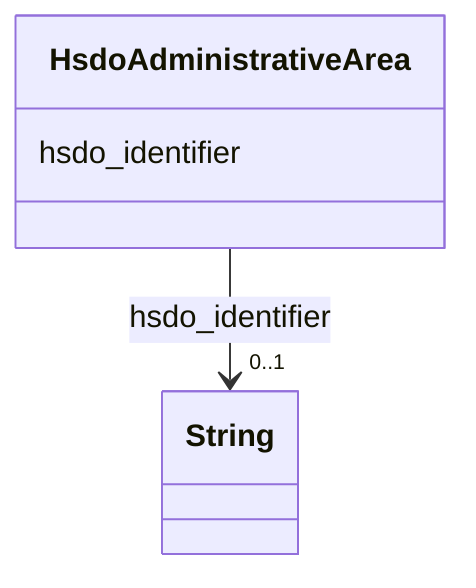

# Class: AdministrativeArea (hsdo_AdministrativeArea)


_A geographical region, typically under the jurisdiction of a particular government._


URI: [hsdo:AdministrativeArea](hsdo:AdministrativeArea)





<!-- no inheritance hierarchy -->


## Slots

| Name | Cardinality and Range | Description | Inheritance |
| ---  | --- | --- | --- |
| [hsdo_identifier](../slots/hsdo_identifier.md) | 0..1 <br/> [xsd:string](xsd:string) | No slot (predicate) description specified | direct |


## Usages

| used by | used in | type | used |
| ---  | --- | --- | --- |
| [HsdoPlace](../classes/HsdoPlace.md) | [hsdo_containedInPlace](../slots/hsdo_containedInPlace.md) | range | [HsdoAdministrativeArea](../classes/HsdoAdministrativeArea.md) |


## Examples

| Value |
| --- |
| dreamkg:zip/19143 |


## Identifier and Mapping Information


### Schema Source


* from schema: dream-kg


## Mappings

| Mapping Type | Mapped Value |
| ---  | ---  |
| self | hsdo:AdministrativeArea |
| native | dream-kg/:HsdoAdministrativeArea |


## LinkML Source

<!-- TODO: investigate https://stackoverflow.com/questions/37606292/how-to-create-tabbed-code-blocks-in-mkdocs-or-sphinx -->

### Direct

<details>
```yaml
name: hsdo_AdministrativeArea
description: A geographical region, typically under the jurisdiction of a particular
  government.
title: AdministrativeArea
notes:
- Class with 39 occurrences.
examples:
- value: dreamkg:zip/19143
from_schema: dream-kg
rank: 1000
slots:
- hsdo_identifier
class_uri: hsdo:AdministrativeArea

```
</details>

### Induced

<details>
```yaml
name: hsdo_AdministrativeArea
description: A geographical region, typically under the jurisdiction of a particular
  government.
title: AdministrativeArea
notes:
- Class with 39 occurrences.
examples:
- value: dreamkg:zip/19143
from_schema: dream-kg
rank: 1000
attributes:
  hsdo_identifier:
    name: hsdo_identifier
    description: No slot (predicate) description specified
    comments:
    - 87 occurrences with subject type hsdo_Service and object type string.
    - 39 occurrences with subject type hsdo_AdministrativeArea and object type string.
    examples:
    - description: hsdo_Service → string
      object:
        example_object: '5367371355914240'
        example_predicate: hsdo:identifier
        example_subject: dreamkg:service/5367371355914240
    - description: hsdo_AdministrativeArea → string
      object:
        example_object: '19320'
        example_predicate: hsdo:identifier
        example_subject: dreamkg:zip/19320
    from_schema: dream-kg
    rank: 1000
    slot_uri: hsdo:identifier
    alias: hsdo_identifier
    owner: hsdo_AdministrativeArea
    domain_of:
    - hsdo_AdministrativeArea
    - hsdo_Service
    range: string
class_uri: hsdo:AdministrativeArea

```
</details>