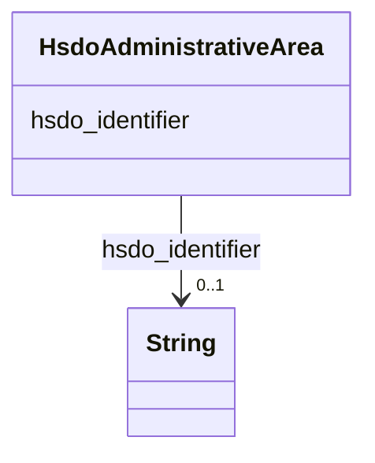

# Class: AdministrativeArea (hsdo_AdministrativeArea)


_A geographical region, typically under the jurisdiction of a particular government._


This class occurs 39 times.


URI: [hsdo:AdministrativeArea](http://schema.org/AdministrativeArea)





<!-- no inheritance hierarchy -->


## Slots

| Name | Cardinality and Range | Description | Inheritance | Occurrences |
| ---  | --- | --- | --- | --- |
| [hsdo_identifier](../slots/hsdo_identifier.md) | 0..1 <br/> [xsd:string](http://www.w3.org/2001/XMLSchema#string) | The identifier property represents any kind of identifier for any kind of [[T... <br/>  | direct | 39 |


## Usages

| used by | used in | type | used |
| ---  | --- | --- | --- |
| [HsdoPlace](../classes/HsdoPlace.md) | [hsdo_containedInPlace](../slots/hsdo_containedInPlace.md) | range | [HsdoAdministrativeArea](../classes/HsdoAdministrativeArea.md) |


## LinkML Source

<!-- TODO: investigate https://stackoverflow.com/questions/37606292/how-to-create-tabbed-code-blocks-in-mkdocs-or-sphinx -->

### Direct

<details>

```yaml
name: hsdo_AdministrativeArea
conforms_to: No schema conformance document specified
annotations:
  count:
    tag: count
    value: 39
description: A geographical region, typically under the jurisdiction of a particular
  government.
title: AdministrativeArea
from_schema: dream-kg
rank: 1000
slots:
- hsdo_identifier
slot_usage:
  hsdo_identifier:
    name: hsdo_identifier
    annotations:
      string:
        tag: string
        value: 39
class_uri: hsdo:AdministrativeArea

```
</details>

### Induced

<details>

```yaml
name: hsdo_AdministrativeArea
conforms_to: No schema conformance document specified
annotations:
  count:
    tag: count
    value: 39
description: A geographical region, typically under the jurisdiction of a particular
  government.
title: AdministrativeArea
from_schema: dream-kg
rank: 1000
slot_usage:
  hsdo_identifier:
    name: hsdo_identifier
    annotations:
      string:
        tag: string
        value: 39
attributes:
  hsdo_identifier:
    name: hsdo_identifier
    annotations:
      string:
        tag: string
        value: 39
    description: 'The identifier property represents any kind of identifier for any
      kind of [[Thing]], such as ISBNs, GTIN codes, UUIDs etc. Schema.org provides
      dedicated properties for representing many of these, either as textual strings
      or as URL (URI) links. See [background notes](/docs/datamodel.html#identifierBg)
      for more details.␊        '
    title: identifier
    examples:
    - description: hsdo_Service→string
      object:
        example_object: '6379467169595392'
        example_object_type: string
        example_predicate: hsdo:identifier
        example_subject: dreamkg:service/6379467169595392
        example_subject_type: hsdo_Service
    - description: hsdo_AdministrativeArea→string
      object:
        example_object: '19131'
        example_object_type: string
        example_predicate: hsdo:identifier
        example_subject: dreamkg:zip/19131
        example_subject_type: hsdo_AdministrativeArea
    from_schema: dream-kg
    rank: 1000
    slot_uri: hsdo:identifier
    alias: hsdo_identifier
    owner: hsdo_AdministrativeArea
    domain_of:
    - hsdo_AdministrativeArea
    - hsdo_Service
    range: string
class_uri: hsdo:AdministrativeArea

```
</details>