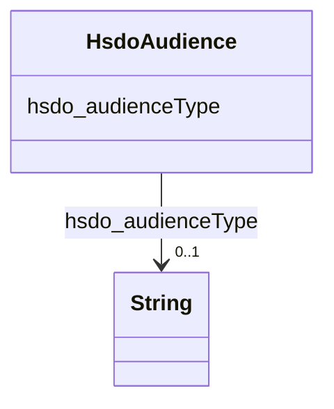

# Class: Audience (hsdo_Audience)


_Intended audience for an item, i.e. the group for whom the item was created._


This class occurs 81 times.


URI: [hsdo:Audience](http://schema.org/Audience)





<!-- no inheritance hierarchy -->


## Slots

| Name | Cardinality and Range | Description | Inheritance | Occurrences |
| ---  | --- | --- | --- | --- |
| [hsdo_audienceType](../slots/hsdo_audienceType.md) | 0..1 <br/> [xsd:string](http://www.w3.org/2001/XMLSchema#string) | The target group associated with a given audience (e <br/>  | direct | 81 |


## Usages

| used by | used in | type | used |
| ---  | --- | --- | --- |
| [HsdoService](../classes/HsdoService.md) | [hsdo_category](../slots/hsdo_category.md) | any_of[range] | [HsdoAudience](../classes/HsdoAudience.md) |


## LinkML Source

<!-- TODO: investigate https://stackoverflow.com/questions/37606292/how-to-create-tabbed-code-blocks-in-mkdocs-or-sphinx -->

### Direct

<details>

```yaml
name: hsdo_Audience
conforms_to: No schema conformance document specified
annotations:
  count:
    tag: count
    value: 81
description: Intended audience for an item, i.e. the group for whom the item was created.
title: Audience
from_schema: dream-kg
rank: 1000
slots:
- hsdo_audienceType
slot_usage:
  hsdo_audienceType:
    name: hsdo_audienceType
    annotations:
      string:
        tag: string
        value: 81
class_uri: hsdo:Audience

```
</details>

### Induced

<details>

```yaml
name: hsdo_Audience
conforms_to: No schema conformance document specified
annotations:
  count:
    tag: count
    value: 81
description: Intended audience for an item, i.e. the group for whom the item was created.
title: Audience
from_schema: dream-kg
rank: 1000
slot_usage:
  hsdo_audienceType:
    name: hsdo_audienceType
    annotations:
      string:
        tag: string
        value: 81
attributes:
  hsdo_audienceType:
    name: hsdo_audienceType
    annotations:
      string:
        tag: string
        value: 81
    description: The target group associated with a given audience (e.g. veterans,
      car owners, musicians, etc.).
    title: audienceType
    examples:
    - description: hsdo_Audience→string
      object:
        example_object: hiv/aids
        example_object_type: string
        example_predicate: hsdo:audienceType
        example_subject: dreamkg:category/audience/HivAids
        example_subject_type: hsdo_Audience
    from_schema: dream-kg
    rank: 1000
    slot_uri: hsdo:audienceType
    alias: hsdo_audienceType
    owner: hsdo_Audience
    domain_of:
    - hsdo_Audience
    range: string
class_uri: hsdo:Audience

```
</details>