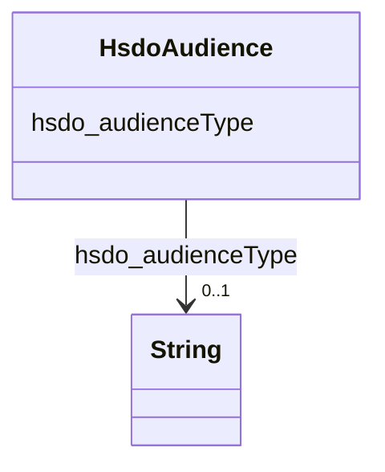

# Class: Audience (hsdo_Audience)


_Intended audience for an item, i.e. the group for whom the item was created._


URI: [hsdo:Audience](hsdo:Audience)





<!-- no inheritance hierarchy -->


## Slots

| Name | Cardinality and Range | Description | Inheritance |
| ---  | --- | --- | --- |
| [hsdo_audienceType](../slots/hsdo_audienceType.md) | 0..1 <br/> [xsd:string](xsd:string) | No slot (predicate) description specified | direct |


## Usages

| used by | used in | type | used |
| ---  | --- | --- | --- |
| [HsdoService](../classes/HsdoService.md) | [hsdo_category](../slots/hsdo_category.md) | any_of[range] | [HsdoAudience](../classes/HsdoAudience.md) |


## Examples

| Value |
| --- |
| dreamkg:category/audience/Latino |


## Identifier and Mapping Information


### Schema Source


* from schema: dream-kg


## Mappings

| Mapping Type | Mapped Value |
| ---  | ---  |
| self | hsdo:Audience |
| native | dream-kg/:HsdoAudience |


## LinkML Source

<!-- TODO: investigate https://stackoverflow.com/questions/37606292/how-to-create-tabbed-code-blocks-in-mkdocs-or-sphinx -->

### Direct

<details>
```yaml
name: hsdo_Audience
description: Intended audience for an item, i.e. the group for whom the item was created.
title: Audience
notes:
- Class with 81 occurrences.
examples:
- value: dreamkg:category/audience/Latino
from_schema: dream-kg
rank: 1000
slots:
- hsdo_audienceType
class_uri: hsdo:Audience

```
</details>

### Induced

<details>
```yaml
name: hsdo_Audience
description: Intended audience for an item, i.e. the group for whom the item was created.
title: Audience
notes:
- Class with 81 occurrences.
examples:
- value: dreamkg:category/audience/Latino
from_schema: dream-kg
rank: 1000
attributes:
  hsdo_audienceType:
    name: hsdo_audienceType
    description: No slot (predicate) description specified
    comments:
    - 81 occurrences with subject type hsdo_Audience and object type string.
    examples:
    - description: hsdo_Audience → string
      object:
        example_object: human trafficking survivors
        example_predicate: hsdo:audienceType
        example_subject: dreamkg:category/audience/HumanTraffickingSurvivors
    from_schema: dream-kg
    rank: 1000
    slot_uri: hsdo:audienceType
    alias: hsdo_audienceType
    owner: hsdo_Audience
    domain_of:
    - hsdo_Audience
    range: string
class_uri: hsdo:Audience

```
</details>