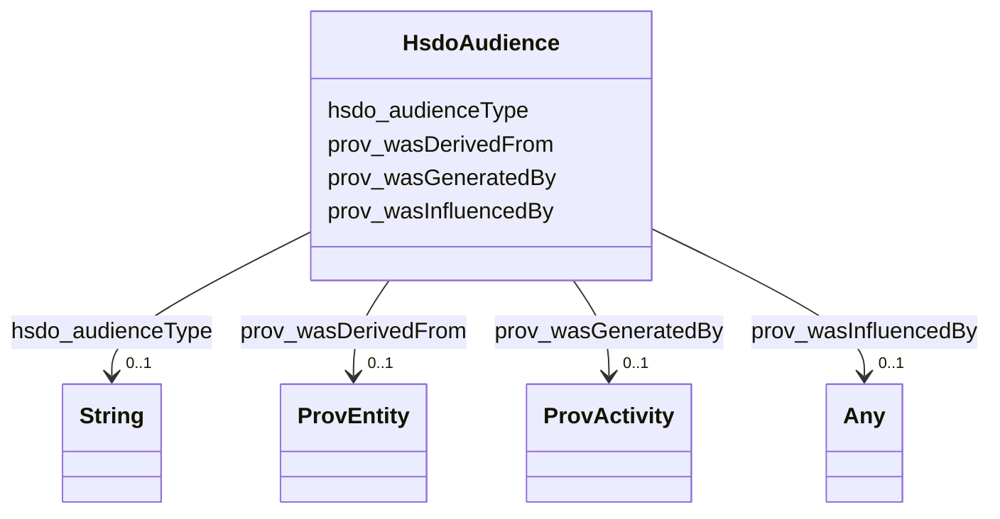

# Class: No class (type) name specified (hsdo_Audience)


_Intended audience for an item, i.e. the group for whom the item was created._


This class occurs 81 times.


URI: [hsdo:Audience](http://schema.org/Audience)





<!-- no inheritance hierarchy -->


## Slots

| Name | Cardinality and Range | Description | Inheritance | Occurrences |
| ---  | --- | --- | --- | --- |
| [prov_wasGeneratedBy](../slots/prov_wasGeneratedBy.md) | 0..1 <br/> [ProvActivity](../classes/ProvActivity.md) | No slot (predicate) description specified <br/>  | direct | 81 |
| [prov_wasDerivedFrom](../slots/prov_wasDerivedFrom.md) | 0..1 <br/> [ProvEntity](../classes/ProvEntity.md) | The more specific subproperties of prov:wasDerivedFrom (i <br/>  | direct | 162 |
| [hsdo_audienceType](../slots/hsdo_audienceType.md) | 0..1 <br/> [xsd:string](http://www.w3.org/2001/XMLSchema#string) | The target group associated with a given audience (e <br/>  | direct | 81 |
| [prov_wasInfluencedBy](../slots/prov_wasInfluencedBy.md) | 0..1 <br/> [HsdoWebPage](../classes/HsdoWebPage.md)&nbsp;or&nbsp;<br />[ProvActivity](../classes/ProvActivity.md)&nbsp;or&nbsp;<br />[HsdoPlace](../classes/HsdoPlace.md)&nbsp;or&nbsp;<br />[HsdoOpeningHoursSpecification](../classes/HsdoOpeningHoursSpecification.md)&nbsp;or&nbsp;<br />[HsdoService](../classes/HsdoService.md)&nbsp;or&nbsp;<br />[ProvEntity](../classes/ProvEntity.md)&nbsp;or&nbsp;<br />[HsdoOrganization](../classes/HsdoOrganization.md)&nbsp;or&nbsp;<br />[HsdoContactPoint](../classes/HsdoContactPoint.md)&nbsp;or&nbsp;<br />[xsd:anyURI](http://www.w3.org/2001/XMLSchema#anyURI)&nbsp;or&nbsp;<br />[HsdoTextObject](../classes/HsdoTextObject.md) | Because prov:wasInfluencedBy is a broad relation, its more specific subproper... <br/>  | direct | 486 |


## Usages

| used by | used in | type | used |
| ---  | --- | --- | --- |
| [HsdoContactPoint](../classes/HsdoContactPoint.md) | [prov_influenced](../slots/prov_influenced.md) | any_of[range] | [HsdoAudience](../classes/HsdoAudience.md) |
| [HsdoOpeningHoursSpecification](../classes/HsdoOpeningHoursSpecification.md) | [prov_influenced](../slots/prov_influenced.md) | any_of[range] | [HsdoAudience](../classes/HsdoAudience.md) |
| [HsdoOrganization](../classes/HsdoOrganization.md) | [prov_influenced](../slots/prov_influenced.md) | any_of[range] | [HsdoAudience](../classes/HsdoAudience.md) |
| [HsdoPlace](../classes/HsdoPlace.md) | [prov_influenced](../slots/prov_influenced.md) | any_of[range] | [HsdoAudience](../classes/HsdoAudience.md) |
| [HsdoService](../classes/HsdoService.md) | [hsdo_category](../slots/hsdo_category.md) | any_of[range] | [HsdoAudience](../classes/HsdoAudience.md) |
| [HsdoService](../classes/HsdoService.md) | [prov_influenced](../slots/prov_influenced.md) | any_of[range] | [HsdoAudience](../classes/HsdoAudience.md) |
| [HsdoTextObject](../classes/HsdoTextObject.md) | [prov_influenced](../slots/prov_influenced.md) | any_of[range] | [HsdoAudience](../classes/HsdoAudience.md) |
| [HsdoWebPage](../classes/HsdoWebPage.md) | [prov_influenced](../slots/prov_influenced.md) | any_of[range] | [HsdoAudience](../classes/HsdoAudience.md) |
| [ProvActivity](../classes/ProvActivity.md) | [prov_influenced](../slots/prov_influenced.md) | any_of[range] | [HsdoAudience](../classes/HsdoAudience.md) |
| [ProvActivity](../classes/ProvActivity.md) | [prov_generated](../slots/prov_generated.md) | any_of[range] | [HsdoAudience](../classes/HsdoAudience.md) |
| [ProvEntity](../classes/ProvEntity.md) | [hsdo_category](../slots/hsdo_category.md) | any_of[range] | [HsdoAudience](../classes/HsdoAudience.md) |
| [ProvEntity](../classes/ProvEntity.md) | [prov_influenced](../slots/prov_influenced.md) | any_of[range] | [HsdoAudience](../classes/HsdoAudience.md) |


## LinkML Source

<!-- TODO: investigate https://stackoverflow.com/questions/37606292/how-to-create-tabbed-code-blocks-in-mkdocs-or-sphinx -->

### Direct

<details>

```yaml
name: hsdo_Audience
conforms_to: No schema conformance document specified
annotations:
  count:
    tag: count
    value: 81
description: Intended audience for an item, i.e. the group for whom the item was created.
title: No class (type) name specified
from_schema: dream-kg
rank: 1000
slots:
- prov_wasGeneratedBy
- prov_wasDerivedFrom
- hsdo_audienceType
- prov_wasInfluencedBy
slot_usage:
  hsdo_audienceType:
    name: hsdo_audienceType
    annotations:
      string:
        tag: string
        value: 81
  prov_wasDerivedFrom:
    name: prov_wasDerivedFrom
    annotations:
      prov_Entity:
        tag: prov_Entity
        value: 162
  prov_wasGeneratedBy:
    name: prov_wasGeneratedBy
    annotations:
      prov_Activity:
        tag: prov_Activity
        value: 81
  prov_wasInfluencedBy:
    name: prov_wasInfluencedBy
    annotations:
      prov_Activity:
        tag: prov_Activity
        value: 81
      prov_Entity:
        tag: prov_Entity
        value: 162
      uri:
        tag: uri
        value: 243
class_uri: hsdo:Audience

```
</details>

### Induced

<details>

```yaml
name: hsdo_Audience
conforms_to: No schema conformance document specified
annotations:
  count:
    tag: count
    value: 81
description: Intended audience for an item, i.e. the group for whom the item was created.
title: No class (type) name specified
from_schema: dream-kg
rank: 1000
slot_usage:
  hsdo_audienceType:
    name: hsdo_audienceType
    annotations:
      string:
        tag: string
        value: 81
  prov_wasDerivedFrom:
    name: prov_wasDerivedFrom
    annotations:
      prov_Entity:
        tag: prov_Entity
        value: 162
  prov_wasGeneratedBy:
    name: prov_wasGeneratedBy
    annotations:
      prov_Activity:
        tag: prov_Activity
        value: 81
  prov_wasInfluencedBy:
    name: prov_wasInfluencedBy
    annotations:
      prov_Activity:
        tag: prov_Activity
        value: 81
      prov_Entity:
        tag: prov_Entity
        value: 162
      uri:
        tag: uri
        value: 243
attributes:
  prov_wasGeneratedBy:
    name: prov_wasGeneratedBy
    annotations:
      prov_Activity:
        tag: prov_Activity
        value: 81
    description: No slot (predicate) description specified
    examples:
    - object:
        example_object: dreamkg:process/run/ontop-CM
        example_object_type: prov_Activity
        example_predicate: prov:wasGeneratedBy
        example_subject: dreamkg:category/audience/AbuseOrNeglectSurvivors
        example_subject_type: hsdo_Audience
    - object:
        example_object: dreamkg:process/run/ontop-CM
        example_object_type: prov_Activity
        example_predicate: prov:wasGeneratedBy
        example_subject: dreamkg:category/audience/AbuseOrNeglectSurvivors
        example_subject_type: prov_Entity
    - object:
        example_object: dreamkg:process/run/ontop-CM
        example_object_type: prov_Activity
        example_predicate: prov:wasGeneratedBy
        example_subject: dreamkg:category/availability/Available
        example_subject_type: hsdo_CategoryCode
    - object:
        example_object: dreamkg:process/run/ontop-CM
        example_object_type: prov_Activity
        example_predicate: prov:wasGeneratedBy
        example_subject: dreamkg:service/4542572480692224
        example_subject_type: hsdo_Service
    - object:
        example_object: dreamkg:process/run/ontop-CM
        example_object_type: prov_Activity
        example_predicate: prov:wasGeneratedBy
        example_subject: dreamkg:service/desc/4542572480692224
        example_subject_type: hsdo_TextObject
    - object:
        example_object: dreamkg:process/run/ontop-CM
        example_object_type: prov_Activity
        example_predicate: prov:wasGeneratedBy
        example_subject: dreamkg:service/hours/friday/4542572480692224
        example_subject_type: hsdo_OpeningHoursSpecification
    - object:
        example_object: dreamkg:process/run/ontop-CM
        example_object_type: prov_Activity
        example_predicate: prov:wasGeneratedBy
        example_subject: dreamkg:service/location/4542572480692224
        example_subject_type: hsdo_Place
    - object:
        example_object: dreamkg:process/run/ontop-CM
        example_object_type: prov_Activity
        example_predicate: prov:wasGeneratedBy
        example_subject: dreamkg:service/phone/4542572480692224
        example_subject_type: hsdo_ContactPoint
    - object:
        example_object: dreamkg:process/run/ontop-CM
        example_object_type: prov_Activity
        example_predicate: prov:wasGeneratedBy
        example_subject: dreamkg:service/provider/4542572480692224
        example_subject_type: hsdo_Organization
    - object:
        example_object: dreamkg:process/run/ontop-CM
        example_object_type: prov_Activity
        example_predicate: prov:wasGeneratedBy
        example_subject: dreamkg:zip/17602
        example_subject_type: hsdo_AdministrativeArea
    from_schema: dream-kg
    rank: 1000
    slot_uri: prov:wasGeneratedBy
    alias: prov_wasGeneratedBy
    owner: hsdo_Audience
    domain_of:
    - hsdo_AdministrativeArea
    - hsdo_Audience
    - hsdo_CategoryCode
    - hsdo_ContactPoint
    - hsdo_OpeningHoursSpecification
    - hsdo_Organization
    - hsdo_Place
    - hsdo_Service
    - hsdo_TextObject
    - prov_Entity
    range: prov_Activity
  prov_wasDerivedFrom:
    name: prov_wasDerivedFrom
    annotations:
      prov_Entity:
        tag: prov_Entity
        value: 162
    description: The more specific subproperties of prov:wasDerivedFrom (i.e., prov:wasQuotedFrom,
      prov:wasRevisionOf, prov:hadPrimarySource) should be used when applicable.@en
    examples:
    - object:
        example_object: dreamkg:data/sql
        example_object_type: prov_Entity
        example_predicate: prov:wasDerivedFrom
        example_subject: dreamkg:category/audience/AbuseOrNeglectSurvivors
        example_subject_type: hsdo_Audience
    - object:
        example_object: dreamkg:data/sql
        example_object_type: prov_Entity
        example_predicate: prov:wasDerivedFrom
        example_subject: dreamkg:category/audience/AbuseOrNeglectSurvivors
        example_subject_type: prov_Entity
    - object:
        example_object: dreamkg:data/sql
        example_object_type: prov_Entity
        example_predicate: prov:wasDerivedFrom
        example_subject: dreamkg:category/availability/Available
        example_subject_type: hsdo_CategoryCode
    - object:
        example_object: dreamkg:data/sql
        example_object_type: prov_Entity
        example_predicate: prov:wasDerivedFrom
        example_subject: dreamkg:service/4542572480692224
        example_subject_type: hsdo_Service
    - object:
        example_object: dreamkg:data/sql
        example_object_type: prov_Entity
        example_predicate: prov:wasDerivedFrom
        example_subject: dreamkg:service/desc/4542572480692224
        example_subject_type: hsdo_TextObject
    - object:
        example_object: dreamkg:data/sql
        example_object_type: prov_Entity
        example_predicate: prov:wasDerivedFrom
        example_subject: dreamkg:service/hours/friday/4542572480692224
        example_subject_type: hsdo_OpeningHoursSpecification
    - object:
        example_object: dreamkg:data/sql
        example_object_type: prov_Entity
        example_predicate: prov:wasDerivedFrom
        example_subject: dreamkg:service/location/4542572480692224
        example_subject_type: hsdo_Place
    - object:
        example_object: dreamkg:data/sql
        example_object_type: prov_Entity
        example_predicate: prov:wasDerivedFrom
        example_subject: dreamkg:service/phone/4542572480692224
        example_subject_type: hsdo_ContactPoint
    - object:
        example_object: dreamkg:data/sql
        example_object_type: prov_Entity
        example_predicate: prov:wasDerivedFrom
        example_subject: dreamkg:service/provider/4542572480692224
        example_subject_type: hsdo_Organization
    - object:
        example_object: dreamkg:data/sql
        example_object_type: prov_Entity
        example_predicate: prov:wasDerivedFrom
        example_subject: dreamkg:zip/17602
        example_subject_type: hsdo_AdministrativeArea
    from_schema: dream-kg
    rank: 1000
    slot_uri: prov:wasDerivedFrom
    alias: prov_wasDerivedFrom
    owner: hsdo_Audience
    domain_of:
    - hsdo_AdministrativeArea
    - hsdo_Audience
    - hsdo_CategoryCode
    - hsdo_ContactPoint
    - hsdo_OpeningHoursSpecification
    - hsdo_Organization
    - hsdo_Place
    - hsdo_Service
    - hsdo_TextObject
    - prov_Entity
    range: prov_Entity
  hsdo_audienceType:
    name: hsdo_audienceType
    annotations:
      string:
        tag: string
        value: 81
    description: The target group associated with a given audience (e.g. veterans,
      car owners, musicians, etc.).
    examples:
    - object:
        example_object: abuse or neglect survivors
        example_object_type: string
        example_predicate: schema:audienceType
        example_subject: dreamkg:category/audience/AbuseOrNeglectSurvivors
        example_subject_type: hsdo_Audience
    - object:
        example_object: abuse or neglect survivors
        example_object_type: string
        example_predicate: schema:audienceType
        example_subject: dreamkg:category/audience/AbuseOrNeglectSurvivors
        example_subject_type: prov_Entity
    from_schema: dream-kg
    rank: 1000
    slot_uri: schema:audienceType
    alias: hsdo_audienceType
    owner: hsdo_Audience
    domain_of:
    - hsdo_Audience
    - prov_Entity
    range: string
  prov_wasInfluencedBy:
    name: prov_wasInfluencedBy
    annotations:
      prov_Activity:
        tag: prov_Activity
        value: 81
      prov_Entity:
        tag: prov_Entity
        value: 162
      uri:
        tag: uri
        value: 243
    description: Because prov:wasInfluencedBy is a broad relation, its more specific
      subproperties (e.g. prov:wasInformedBy, prov:actedOnBehalfOf, prov:wasEndedBy,
      etc.) should be used when applicable.@en
    examples:
    - object:
        example_object: dreamkg:data/sql
        example_object_type: prov_Entity
        example_predicate: prov:wasInfluencedBy
        example_subject: dreamkg:category/audience/AbuseOrNeglectSurvivors
        example_subject_type: hsdo_Audience
    - object:
        example_object: dreamkg:data/sql
        example_object_type: prov_Entity
        example_predicate: prov:wasInfluencedBy
        example_subject: dreamkg:category/audience/AbuseOrNeglectSurvivors
        example_subject_type: prov_Entity
    - object:
        example_object: dreamkg:file/AuntBertha/UpToDate/Versions/Final_Emergency_Food_20240109.csv
        example_object_type: uri
        example_predicate: prov:wasInfluencedBy
        example_subject: dreamkg:category/audience/AbuseOrNeglectSurvivors
        example_subject_type: hsdo_Audience
    - object:
        example_object: dreamkg:file/AuntBertha/UpToDate/Versions/Final_Emergency_Food_20240109.csv
        example_object_type: uri
        example_predicate: prov:wasInfluencedBy
        example_subject: dreamkg:category/audience/AbuseOrNeglectSurvivors
        example_subject_type: prov_Entity
    - object:
        example_object: dreamkg:process/run/ontop-CM
        example_object_type: prov_Activity
        example_predicate: prov:wasInfluencedBy
        example_subject: dreamkg:category/audience/AbuseOrNeglectSurvivors
        example_subject_type: hsdo_Audience
    - object:
        example_object: dreamkg:process/run/ontop-CM
        example_object_type: prov_Activity
        example_predicate: prov:wasInfluencedBy
        example_subject: dreamkg:category/audience/AbuseOrNeglectSurvivors
        example_subject_type: prov_Entity
    - object:
        example_object: dreamkg:data/sql
        example_object_type: prov_Entity
        example_predicate: prov:wasInfluencedBy
        example_subject: dreamkg:category/availability/Available
        example_subject_type: hsdo_CategoryCode
    - object:
        example_object: dreamkg:file/AuntBertha/UpToDate/Versions/Final_Emergency_Food_20240109.csv
        example_object_type: uri
        example_predicate: prov:wasInfluencedBy
        example_subject: dreamkg:category/availability/Available
        example_subject_type: hsdo_CategoryCode
    - object:
        example_object: dreamkg:process/run/ontop-CM
        example_object_type: prov_Activity
        example_predicate: prov:wasInfluencedBy
        example_subject: dreamkg:category/availability/Available
        example_subject_type: hsdo_CategoryCode
    - object:
        example_object: dreamkg:service/4542572480692224
        example_object_type: hsdo_Service
        example_predicate: prov:wasInfluencedBy
        example_subject: dreamkg:file/kg.ttl
        example_subject_type: prov_Entity
    - object:
        example_object: dreamkg:service/4542572480692224
        example_object_type: prov_Entity
        example_predicate: prov:wasInfluencedBy
        example_subject: dreamkg:file/kg.ttl
        example_subject_type: prov_Collection
    - object:
        example_object: dreamkg:service/4542572480692224
        example_object_type: hsdo_Service
        example_predicate: prov:wasInfluencedBy
        example_subject: dreamkg:file/kg.ttl
        example_subject_type: prov_Collection
    - object:
        example_object: dreamkg:service/desc/4542572480692224
        example_object_type: hsdo_TextObject
        example_predicate: prov:wasInfluencedBy
        example_subject: dreamkg:file/kg.ttl
        example_subject_type: prov_Entity
    - object:
        example_object: dreamkg:service/desc/4542572480692224
        example_object_type: hsdo_TextObject
        example_predicate: prov:wasInfluencedBy
        example_subject: dreamkg:file/kg.ttl
        example_subject_type: prov_Collection
    - object:
        example_object: dreamkg:service/hours/friday/4542572480692224
        example_object_type: hsdo_OpeningHoursSpecification
        example_predicate: prov:wasInfluencedBy
        example_subject: dreamkg:file/kg.ttl
        example_subject_type: prov_Entity
    - object:
        example_object: dreamkg:service/hours/friday/4542572480692224
        example_object_type: hsdo_OpeningHoursSpecification
        example_predicate: prov:wasInfluencedBy
        example_subject: dreamkg:file/kg.ttl
        example_subject_type: prov_Collection
    - object:
        example_object: dreamkg:service/location/4542572480692224
        example_object_type: hsdo_Place
        example_predicate: prov:wasInfluencedBy
        example_subject: dreamkg:file/kg.ttl
        example_subject_type: prov_Entity
    - object:
        example_object: dreamkg:service/location/4542572480692224
        example_object_type: hsdo_Place
        example_predicate: prov:wasInfluencedBy
        example_subject: dreamkg:file/kg.ttl
        example_subject_type: prov_Collection
    - object:
        example_object: dreamkg:service/phone/4542572480692224
        example_object_type: hsdo_ContactPoint
        example_predicate: prov:wasInfluencedBy
        example_subject: dreamkg:file/kg.ttl
        example_subject_type: prov_Entity
    - object:
        example_object: dreamkg:service/phone/4542572480692224
        example_object_type: hsdo_ContactPoint
        example_predicate: prov:wasInfluencedBy
        example_subject: dreamkg:file/kg.ttl
        example_subject_type: prov_Collection
    - object:
        example_object: dreamkg:service/provider/4542572480692224
        example_object_type: hsdo_Organization
        example_predicate: prov:wasInfluencedBy
        example_subject: dreamkg:file/kg.ttl
        example_subject_type: prov_Entity
    - object:
        example_object: dreamkg:service/provider/4542572480692224
        example_object_type: hsdo_Organization
        example_predicate: prov:wasInfluencedBy
        example_subject: dreamkg:file/kg.ttl
        example_subject_type: prov_Collection
    - object:
        example_object: https://www.auntbertha.com//achievement-through-counseling-and-treatment-%2528act-1%2529--philadelphia-pa--opioid-treatment-program-%2528otp%2529/5792020391002112
        example_object_type: hsdo_WebPage
        example_predicate: prov:wasInfluencedBy
        example_subject: dreamkg:outside/ab
        example_subject_type: prov_Entity
    - object:
        example_object: https://www.auntbertha.com//achievement-through-counseling-and-treatment-%2528act-1%2529--philadelphia-pa--opioid-treatment-program-%2528otp%2529/5792020391002112
        example_object_type: hsdo_WebPage
        example_predicate: prov:wasInfluencedBy
        example_subject: dreamkg:outside/ab
        example_subject_type: prov_Collection
    - object:
        example_object: dreamkg:data/sql
        example_object_type: prov_Entity
        example_predicate: prov:wasInfluencedBy
        example_subject: dreamkg:service/4542572480692224
        example_subject_type: hsdo_Service
    - object:
        example_object: dreamkg:process/run/ontop-CM
        example_object_type: prov_Activity
        example_predicate: prov:wasInfluencedBy
        example_subject: dreamkg:service/4542572480692224
        example_subject_type: hsdo_Service
    - object:
        example_object: https://www.auntbertha.com//child-guidance-resource-centers-%2528cgrc%2529--philadelphia-pa--drug-and-alcohol-services/4542572480692224
        example_object_type: hsdo_WebPage
        example_predicate: prov:wasInfluencedBy
        example_subject: dreamkg:service/4542572480692224
        example_subject_type: hsdo_Service
    - object:
        example_object: dreamkg:data/sql
        example_object_type: prov_Entity
        example_predicate: prov:wasInfluencedBy
        example_subject: dreamkg:service/desc/4542572480692224
        example_subject_type: hsdo_TextObject
    - object:
        example_object: dreamkg:process/run/ontop-CM
        example_object_type: prov_Activity
        example_predicate: prov:wasInfluencedBy
        example_subject: dreamkg:service/desc/4542572480692224
        example_subject_type: hsdo_TextObject
    - object:
        example_object: https://www.auntbertha.com//child-guidance-resource-centers-%2528cgrc%2529--philadelphia-pa--drug-and-alcohol-services/4542572480692224
        example_object_type: hsdo_WebPage
        example_predicate: prov:wasInfluencedBy
        example_subject: dreamkg:service/desc/4542572480692224
        example_subject_type: hsdo_TextObject
    - object:
        example_object: dreamkg:data/sql
        example_object_type: prov_Entity
        example_predicate: prov:wasInfluencedBy
        example_subject: dreamkg:service/hours/friday/4542572480692224
        example_subject_type: hsdo_OpeningHoursSpecification
    - object:
        example_object: dreamkg:process/run/ontop-CM
        example_object_type: prov_Activity
        example_predicate: prov:wasInfluencedBy
        example_subject: dreamkg:service/hours/friday/4542572480692224
        example_subject_type: hsdo_OpeningHoursSpecification
    - object:
        example_object: https://www.auntbertha.com//child-guidance-resource-centers-%2528cgrc%2529--philadelphia-pa--drug-and-alcohol-services/4542572480692224
        example_object_type: hsdo_WebPage
        example_predicate: prov:wasInfluencedBy
        example_subject: dreamkg:service/hours/friday/4542572480692224
        example_subject_type: hsdo_OpeningHoursSpecification
    - object:
        example_object: dreamkg:data/sql
        example_object_type: prov_Entity
        example_predicate: prov:wasInfluencedBy
        example_subject: dreamkg:service/location/4542572480692224
        example_subject_type: hsdo_Place
    - object:
        example_object: dreamkg:process/run/ontop-CM
        example_object_type: prov_Activity
        example_predicate: prov:wasInfluencedBy
        example_subject: dreamkg:service/location/4542572480692224
        example_subject_type: hsdo_Place
    - object:
        example_object: https://www.auntbertha.com//child-guidance-resource-centers-%2528cgrc%2529--philadelphia-pa--drug-and-alcohol-services/4542572480692224
        example_object_type: hsdo_WebPage
        example_predicate: prov:wasInfluencedBy
        example_subject: dreamkg:service/location/4542572480692224
        example_subject_type: hsdo_Place
    - object:
        example_object: dreamkg:data/sql
        example_object_type: prov_Entity
        example_predicate: prov:wasInfluencedBy
        example_subject: dreamkg:service/phone/4542572480692224
        example_subject_type: hsdo_ContactPoint
    - object:
        example_object: dreamkg:process/run/ontop-CM
        example_object_type: prov_Activity
        example_predicate: prov:wasInfluencedBy
        example_subject: dreamkg:service/phone/4542572480692224
        example_subject_type: hsdo_ContactPoint
    - object:
        example_object: https://www.auntbertha.com//child-guidance-resource-centers-%2528cgrc%2529--philadelphia-pa--drug-and-alcohol-services/4542572480692224
        example_object_type: hsdo_WebPage
        example_predicate: prov:wasInfluencedBy
        example_subject: dreamkg:service/phone/4542572480692224
        example_subject_type: hsdo_ContactPoint
    - object:
        example_object: dreamkg:data/sql
        example_object_type: prov_Entity
        example_predicate: prov:wasInfluencedBy
        example_subject: dreamkg:service/provider/4542572480692224
        example_subject_type: hsdo_Organization
    - object:
        example_object: dreamkg:process/run/ontop-CM
        example_object_type: prov_Activity
        example_predicate: prov:wasInfluencedBy
        example_subject: dreamkg:service/provider/4542572480692224
        example_subject_type: hsdo_Organization
    - object:
        example_object: https://www.auntbertha.com//child-guidance-resource-centers-%2528cgrc%2529--philadelphia-pa--drug-and-alcohol-services/4542572480692224
        example_object_type: hsdo_WebPage
        example_predicate: prov:wasInfluencedBy
        example_subject: dreamkg:service/provider/4542572480692224
        example_subject_type: hsdo_Organization
    - object:
        example_object: dreamkg:data/sql
        example_object_type: prov_Entity
        example_predicate: prov:wasInfluencedBy
        example_subject: dreamkg:zip/17602
        example_subject_type: hsdo_AdministrativeArea
    - object:
        example_object: dreamkg:file/AuntBertha/UpToDate/Versions/Final_Emergency_Food_20240109.csv
        example_object_type: uri
        example_predicate: prov:wasInfluencedBy
        example_subject: dreamkg:zip/17602
        example_subject_type: hsdo_AdministrativeArea
    - object:
        example_object: dreamkg:process/run/ontop-CM
        example_object_type: prov_Activity
        example_predicate: prov:wasInfluencedBy
        example_subject: dreamkg:zip/17602
        example_subject_type: hsdo_AdministrativeArea
    from_schema: dream-kg
    rank: 1000
    slot_uri: prov:wasInfluencedBy
    alias: prov_wasInfluencedBy
    owner: hsdo_Audience
    domain_of:
    - hsdo_AdministrativeArea
    - hsdo_Audience
    - hsdo_CategoryCode
    - hsdo_ContactPoint
    - hsdo_OpeningHoursSpecification
    - hsdo_Organization
    - hsdo_Place
    - hsdo_Service
    - hsdo_TextObject
    - prov_Collection
    - prov_Entity
    range: Any
    any_of:
    - range: hsdo_WebPage
    - range: prov_Activity
    - range: hsdo_Place
    - range: hsdo_OpeningHoursSpecification
    - range: hsdo_Service
    - range: prov_Entity
    - range: hsdo_Organization
    - range: hsdo_ContactPoint
    - range: uri
    - range: hsdo_TextObject
class_uri: hsdo:Audience

```
</details>