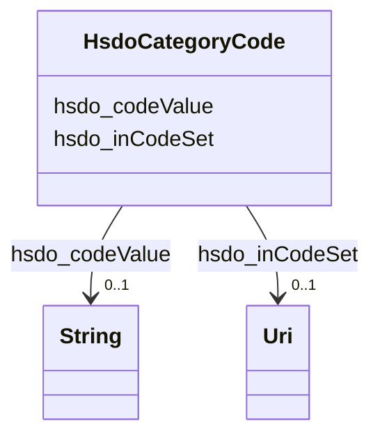

# Class: CategoryCode (hsdo_CategoryCode)


_A Category Code._


This class occurs 157 times.


URI: [hsdo:CategoryCode](http://schema.org/CategoryCode)





<!-- no inheritance hierarchy -->


## Slots

| Name | Cardinality and Range | Description | Inheritance | Occurrences |
| ---  | --- | --- | --- | --- |
| [hsdo_inCodeSet](../slots/hsdo_inCodeSet.md) | 0..1 <br/> [xsd:anyURI](http://www.w3.org/2001/XMLSchema#anyURI) | A [[CategoryCodeSet]] that contains this category code <br/>  | direct | 157 |
| [hsdo_codeValue](../slots/hsdo_codeValue.md) | 0..1 <br/> [xsd:string](http://www.w3.org/2001/XMLSchema#string) | A short textual code that uniquely identifies the value <br/>  | direct | 158 |


## Usages

| used by | used in | type | used |
| ---  | --- | --- | --- |
| [HsdoService](../classes/HsdoService.md) | [hsdo_category](../slots/hsdo_category.md) | any_of[range] | [HsdoCategoryCode](../classes/HsdoCategoryCode.md) |


## LinkML Source

<!-- TODO: investigate https://stackoverflow.com/questions/37606292/how-to-create-tabbed-code-blocks-in-mkdocs-or-sphinx -->

### Direct

<details>

```yaml
name: hsdo_CategoryCode
conforms_to: No schema conformance document specified
annotations:
  count:
    tag: count
    value: 157
description: A Category Code.
title: CategoryCode
from_schema: dream-kg
rank: 1000
slots:
- hsdo_inCodeSet
- hsdo_codeValue
slot_usage:
  hsdo_codeValue:
    name: hsdo_codeValue
    annotations:
      string:
        tag: string
        value: 158
  hsdo_inCodeSet:
    name: hsdo_inCodeSet
    annotations:
      uri:
        tag: uri
        value: 157
class_uri: hsdo:CategoryCode

```
</details>

### Induced

<details>

```yaml
name: hsdo_CategoryCode
conforms_to: No schema conformance document specified
annotations:
  count:
    tag: count
    value: 157
description: A Category Code.
title: CategoryCode
from_schema: dream-kg
rank: 1000
slot_usage:
  hsdo_codeValue:
    name: hsdo_codeValue
    annotations:
      string:
        tag: string
        value: 158
  hsdo_inCodeSet:
    name: hsdo_inCodeSet
    annotations:
      uri:
        tag: uri
        value: 157
attributes:
  hsdo_inCodeSet:
    name: hsdo_inCodeSet
    annotations:
      uri:
        tag: uri
        value: 157
    description: A [[CategoryCodeSet]] that contains this category code.
    title: inCodeSet
    examples:
    - description: hsdo_CategoryCode→uri
      object:
        example_object: dreamkg:_CategoryCodeSet_Services_Main
        example_object_type: uri
        example_predicate: hsdo:inCodeSet
        example_subject: dreamkg:category/service/main/ResidentialCare
        example_subject_type: hsdo_CategoryCode
    from_schema: dream-kg
    rank: 1000
    slot_uri: hsdo:inCodeSet
    alias: hsdo_inCodeSet
    owner: hsdo_CategoryCode
    domain_of:
    - hsdo_CategoryCode
    range: uri
  hsdo_codeValue:
    name: hsdo_codeValue
    annotations:
      string:
        tag: string
        value: 158
    description: A short textual code that uniquely identifies the value.
    title: codeValue
    examples:
    - description: hsdo_CategoryCode→string
      object:
        example_object: residential care
        example_object_type: string
        example_predicate: hsdo:codeValue
        example_subject: dreamkg:category/service/main/ResidentialCare
        example_subject_type: hsdo_CategoryCode
    from_schema: dream-kg
    rank: 1000
    slot_uri: hsdo:codeValue
    alias: hsdo_codeValue
    owner: hsdo_CategoryCode
    domain_of:
    - hsdo_CategoryCode
    range: string
class_uri: hsdo:CategoryCode

```
</details>